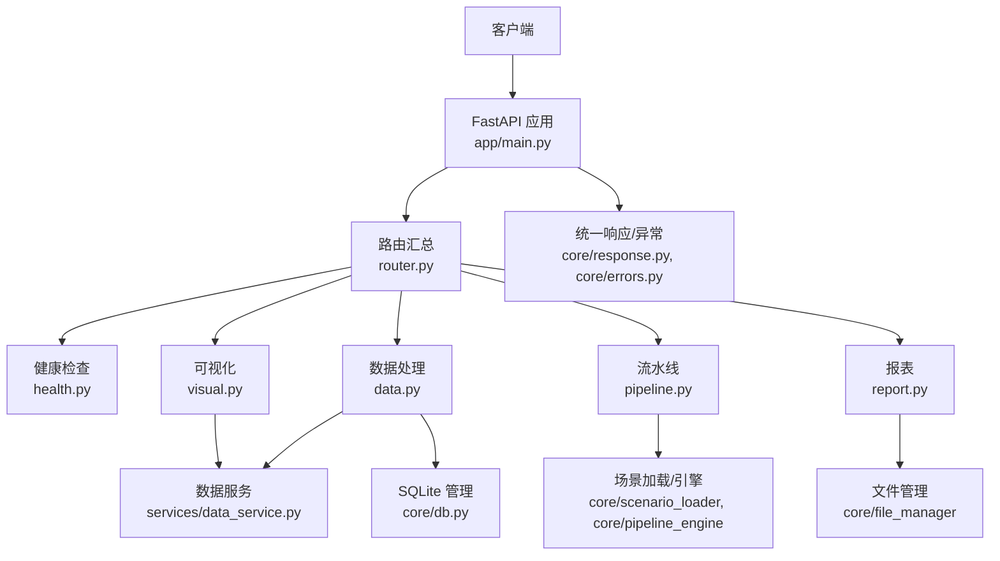
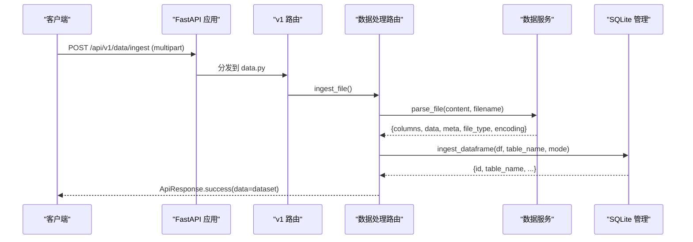
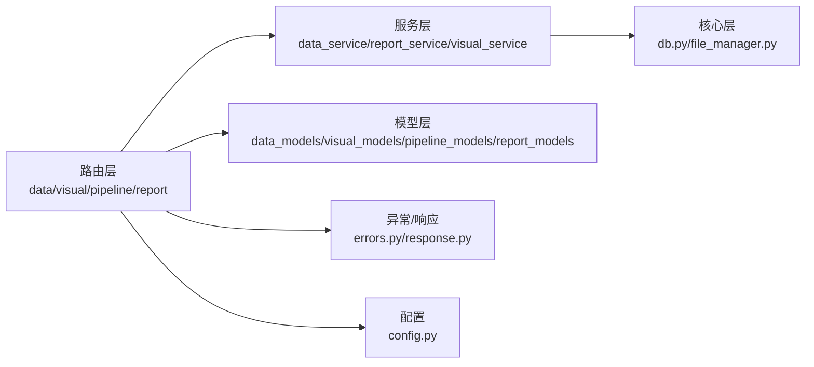

# API 接口文档

<cite>
**本文引用的文件**
- [app/main.py](file://app/main.py)
- [app/api/v1/router.py](file://app/api/v1/router.py)
- [app/api/v1/health.py](file://app/api/v1/health.py)
- [app/api/v1/data.py](file://app/api/v1/data.py)
- [app/api/v1/pipeline.py](file://app/api/v1/pipeline.py)
- [app/api/v1/report.py](file://app/api/v1/report.py)
- [app/api/v1/visual.py](file://app/api/v1/visual.py)
- [app/models/data_models.py](file://app/models/data_models.py)
- [app/models/pipeline_models.py](file://app/models/pipeline_models.py)
- [app/models/report_models.py](file://app/models/report_models.py)
- [app/models/visual_models.py](file://app/models/visual_models.py)
- [app/services/data_service.py](file://app/services/data_service.py)
- [app/core/db.py](file://app/core/db.py)
- [app/core/response.py](file://app/core/response.py)
- [app/core/errors.py](file://app/core/errors.py)
- [app/config.py](file://app/config.py)
</cite>

## 目录
1. [简介](#简介)
2. [项目结构](#项目结构)
3. [核心组件](#核心组件)
4. [架构总览](#架构总览)
5. [详细接口说明](#详细接口说明)
6. [依赖关系分析](#依赖关系分析)
7. [性能与限流建议](#性能与限流建议)
8. [故障排查指南](#故障排查指南)
9. [结论](#结论)
10. [附录：错误码与最佳实践](#附录错误码与最佳实践)

## 简介
本接口文档面向开发者，系统化说明 hiagent 辅助 Web 服务提供的 RESTful API。涵盖数据入库、SQL 查询、数据处理（筛选、聚合、透视、排序、去重、清洗、统计）、可视化图表生成、报表导出、Pipeline 场景执行以及健康检查等能力。所有接口统一返回 ApiResponse 格式，并内置安全校验与异常处理机制，便于快速集成与排障。

## 项目结构
- 路由层：按功能域划分 v1 路由模块，统一挂载到 /api/v1
- 模型层：Pydantic 定义请求/响应结构，保证参数校验与文档自动生成
- 服务层：封装业务逻辑（数据处理、报表生成、可视化）
- 核心层：数据库持久化、文件管理、统一响应与异常处理、配置
- 入口：FastAPI 应用启动、中间件、全局异常处理器、文件下载端点

**图示来源**
- [app/main.py:46-95](file://app/main.py#L46-L95)
- [app/api/v1/router.py:1-18](file://app/api/v1/router.py#L1-L18)
- [app/api/v1/data.py:1-201](file://app/api/v1/data.py#L1-L201)
- [app/api/v1/visual.py:1-30](file://app/api/v1/visual.py#L1-L30)
- [app/api/v1/pipeline.py:1-48](file://app/api/v1/pipeline.py#L1-L48)
- [app/api/v1/report.py:1-35](file://app/api/v1/report.py#L1-L35)
- [app/services/data_service.py:1-447](file://app/services/data_service.py#L1-L447)
- [app/core/db.py:1-324](file://app/core/db.py#L1-L324)
- [app/core/response.py:1-103](file://app/core/response.py#L1-L103)
- [app/core/errors.py:1-74](file://app/core/errors.py#L1-L74)

**章节来源**
- [app/main.py:46-95](file://app/main.py#L46-L95)
- [app/api/v1/router.py:1-18](file://app/api/v1/router.py#L1-L18)

## 核心组件
- 统一响应体：ApiResponse，包含 code、message、data、request_id；提供 success/error 构造方法
- 错误码：ErrorCode 枚举，覆盖通用、数据处理、可视化、文件、编排、Pipeline 等模块
- 异常处理：AppException 业务异常、参数校验异常、未预期异常的全局处理器
- 配置：Settings 从环境变量或 .env 读取，包括端口、存储路径、数据库路径等
- 数据库：SQLite 数据集管理，支持入库、列表、详情、预览、删除、只读 SQL 查询
- 文件管理：保存临时文件并提供下载接口

**章节来源**
- [app/core/response.py:12-103](file://app/core/response.py#L12-L103)
- [app/core/errors.py:15-74](file://app/core/errors.py#L15-L74)
- [app/config.py:6-23](file://app/config.py#L6-L23)
- [app/core/db.py:59-324](file://app/core/db.py#L59-L324)

## 架构总览

**图示来源**
- [app/api/v1/data.py:39-83](file://app/api/v1/data.py#L39-L83)
- [app/services/data_service.py:77-117](file://app/services/data_service.py#L77-L117)
- [app/core/db.py:89-189](file://app/core/db.py#L89-L189)

## 详细接口说明

### 基础信息
- 基础路径：/api/v1
- 统一响应格式：ApiResponse{code, message, data, request_id}
- 认证机制：当前未实现鉴权中间件；可通过网关或反向代理增加认证
- 跨域：已启用 CORS 允许所有来源（生产环境建议收紧）
- 请求追踪：自动注入 X-Request-ID，并在响应头回传

**章节来源**
- [app/main.py:55-71](file://app/main.py#L55-L71)
- [app/core/response.py:71-103](file://app/core/response.py#L71-L103)

### 健康检查
- GET /api/v1/health
- 描述：服务健康检查，无需认证
- 成功响应示例：{"code":0,"message":"success","data":{"status":"healthy"},"request_id":"..."}
- 失败场景：无（除非服务不可用）

**章节来源**
- [app/api/v1/health.py:10-12](file://app/api/v1/health.py#L10-L12)

### 数据处理
- 数据入库
  - POST /api/v1/data/ingest
  - 内容类型：multipart/form-data
  - 表单字段：
    - file: CSV/Excel/JSON 文件
    - table_name: 可选，append 模式必填
    - description: 可选，数据集描述
    - mode: create | append（默认 create）
  - 行为：解析文件为 DataFrame，写入 SQLite 表，记录元数据
  - 成功响应：包含 id、table_name、filename、description、row_count、column_count、columns、dtypes、file_type、mode
  - 常见错误：不支持的文件格式、空数据、追加目标不存在、列不匹配、非法入库模式
- 列出数据集
  - GET /api/v1/data/datasets
  - 返回：数据集元信息列表
- 获取数据集详情
  - GET /api/v1/data/datasets/{dataset_id}?preview=N
  - 返回：元信息 + 前 N 行预览（可选）
- SQL 查询（SQLite）
  - POST /api/v1/data/datasets/{dataset_id}/query
  - 请求体：{"sql": "SELECT ..."}
  - 限制：仅允许 SELECT/WITH 开头，禁止危险语句
  - 返回：{columns, data, row_count}
- 删除数据集
  - DELETE /api/v1/data/datasets/{dataset_id}
  - 返回：{"deleted": true, "id": "..."}
- 单步数据处理（基于内存 DataFrame）
  - POST /api/v1/data/parse
    - 上传文件解析为 DataFrame，返回 columns、data、meta、file_type、encoding
  - POST /api/v1/data/query
    - 请求体：{"dataframe": {"columns":[], "data":[[]], "dtypes":{}}, "sql": "SELECT * FROM df", "table_name": "df"}
    - 使用 DuckDB 在内存中执行 SQL
  - POST /api/v1/data/filter
    - 请求体：{"dataframe": {...}, "conditions": [{"column":"...", "operator":"eq|ne|gt|ge|lt|le|in|not_in|contains|startswith|endswith", "value":...}], "logic":"and|or"}
  - POST /api/v1/data/aggregate
    - 请求体：{"dataframe": {...}, "group_by":["..."], "agg_columns":["..."], "agg_funcs":["sum|mean|count|min|max|median|std|var"]}
  - POST /api/v1/data/pivot
    - 请求体：{"dataframe": {...}, "index":["..."], "columns":["..."], "values":["..."], "agg_func":"sum"}
  - POST /api/v1/data/sort
    - 请求体：{"dataframe": {...}, "sort_by":["..."], "ascending":true|false|[bool,...]}
  - POST /api/v1/data/dedup
    - 请求体：{"dataframe": {...}, "subset":["..."], "keep":"first|last|false"}
  - POST /api/v1/data/clean
    - 请求体：{"dataframe": {...}, "operations":[{"operation":"fill_na|drop_na|cast_type|strip_text|replace_text|drop_outliers", "column":"...", "params":{}}]}
  - POST /api/v1/data/statistics
    - 请求体：{"dataframe": {...}, "stat_type":"descriptive|correlation|frequency", "columns":["..."], "params":{}}

注意：
- 所有单步数据处理接口均返回统一结构：{columns, data, meta}
- 过滤条件运算符、聚合函数、清洗操作均有白名单校验，非法值将返回参数校验错误

**章节来源**
- [app/api/v1/data.py:39-201](file://app/api/v1/data.py#L39-L201)
- [app/services/data_service.py:35-447](file://app/services/data_service.py#L35-L447)
- [app/core/db.py:89-324](file://app/core/db.py#L89-L324)
- [app/models/data_models.py:13-145](file://app/models/data_models.py#L13-L145)

### 可视化
- 生成图表
  - POST /api/v1/visual/chart
  - 请求体：
    - dataframe: {columns, data, dtypes}
    - config: {chart_type, x, y, title, xlabel, ylabel, colors, width, height, x_axis, y_axis, extra}
    - output_format: png|svg|html
  - 返回：
    - image_base64: PNG/SVG base64
    - html_content: HTML 输出（当 output_format=html）
    - filename: 临时文件名（可下载）
    - output_format
- 渲染表格
  - POST /api/v1/visual/table
  - 请求体：
    - dataframe: {columns, data, dtypes}
    - config: {title, sort_by, sort_ascending, max_rows, conditional_styles, column_widths, show_index}
  - 返回：
    - html: 渲染后的 HTML 表格
    - row_count, column_count

**章节来源**
- [app/api/v1/visual.py:13-29](file://app/api/v1/visual.py#L13-L29)
- [app/models/visual_models.py:15-107](file://app/models/visual_models.py#L15-L107)

### 报表导出
- 生成分期限目标检视 Excel 报表
  - POST /api/v1/report/term-target-review
  - 请求体：
    - current_date: YYYY-MM-DD
    - rows: [{product_type, term_category, daily_scale, vs_last_month, sales_analysis}]
  - 行为：生成 Excel 文件并保存到临时目录，返回下载链接
  - 返回：
    - filename: 生成的文件名
    - format: xlsx
    - download_url: 下载路径（相对 base_url）
    - row_count: 数据行数
    - column_count: 固定 6
- 文件下载
  - GET /api/v1/file/download/{filename}
  - 返回：二进制文件流

**章节来源**
- [app/api/v1/report.py:15-34](file://app/api/v1/report.py#L15-L34)
- [app/main.py:82-93](file://app/main.py#L82-L93)
- [app/models/report_models.py:11-36](file://app/models/report_models.py#L11-L36)

### Pipeline 执行
- 执行 Pipeline
  - POST /api/v1/pipeline/run
  - 请求体：
    - scenario_id: 场景 ID（对应 YAML 文件名）
    - params: 场景参数
  - 行为：加载场景配置，执行步骤，收集输出
  - 返回：
    - scenario_id
    - steps: [{step_name, status, duration_ms, message}]
    - outputs: [{name, type, data}]
    - total_duration_ms
- 列出场景
  - GET /api/v1/pipeline/scenarios
  - 返回：可用场景列表（scenario_id, name, description, version）

**章节来源**
- [app/api/v1/pipeline.py:14-47](file://app/api/v1/pipeline.py#L14-L47)
- [app/models/pipeline_models.py:11-46](file://app/models/pipeline_models.py#L11-L46)

## 依赖关系分析

**图示来源**
- [app/api/v1/data.py:1-201](file://app/api/v1/data.py#L1-L201)
- [app/api/v1/visual.py:1-30](file://app/api/v1/visual.py#L1-L30)
- [app/api/v1/pipeline.py:1-48](file://app/api/v1/pipeline.py#L1-L48)
- [app/api/v1/report.py:1-35](file://app/api/v1/report.py#L1-L35)
- [app/services/data_service.py:1-447](file://app/services/data_service.py#L1-L447)
- [app/core/db.py:1-324](file://app/core/db.py#L1-L324)
- [app/core/response.py:1-103](file://app/core/response.py#L1-L103)
- [app/core/errors.py:1-74](file://app/core/errors.py#L1-L74)
- [app/config.py:1-23](file://app/config.py#L1-L23)

**章节来源**
- [app/api/v1/router.py:1-18](file://app/api/v1/router.py#L1-L18)
- [app/main.py:46-95](file://app/main.py#L46-L95)

## 性能与限流建议
- 并发与连接
  - SQLite 适合轻量读写；高并发写场景建议使用 WAL 模式或迁移至更合适的数据库
  - 每次入库/查询创建独立连接，避免跨线程问题
- 大文件处理
  - 上传文件建议分片或限制大小；解析过程在内存中进行，注意内存占用
- 查询优化
  - 对 SQLite 查询尽量使用索引列；复杂查询建议在外部数据仓库完成
- 限流策略
  - 当前未内置限流；可在网关层（如 Nginx、APISIX）或 FastAPI 中间件实现
- 缓存
  - 对频繁访问的静态结果（如图表、报表）可引入缓存层（Redis）减少重复计算

[本节为通用指导，不直接分析具体文件]

## 故障排查指南
- 参数校验失败
  - 现象：HTTP 422，错误码 PARAM_VALIDATION_ERROR
  - 排查：检查 Pydantic 模型字段类型、必填项、枚举值范围
- 资源不存在
  - 现象：错误码 RESOURCE_NOT_FOUND
  - 排查：确认 dataset_id 是否存在；表名是否被清理
- 文件解析失败
  - 现象：错误码 FILE_PARSE_ERROR
  - 排查：文件格式是否受支持；编码是否正确；文件是否为空
- SQL 执行错误
  - 现象：错误码 SQL_EXECUTION_ERROR
  - 排查：SQL 是否以 SELECT/WITH 开头；是否包含危险关键字；语法是否正确
- 渲染失败
  - 现象：错误码 RENDER_FAILED
  - 排查：图表配置是否合法；数据列是否存在；尺寸是否在允许范围
- 文件下载失败
  - 现象：错误码 FILE_NOT_FOUND
  - 排查：文件名是否正确；文件是否已被清理任务删除

**章节来源**
- [app/core/errors.py:30-74](file://app/core/errors.py#L30-L74)
- [app/core/response.py:48-68](file://app/core/response.py#L48-L68)
- [app/api/v1/data.py:52-134](file://app/api/v1/data.py#L52-L134)
- [app/services/data_service.py:122-158](file://app/services/data_service.py#L122-L158)

## 结论
该 API 体系围绕“数据入库—处理—可视化—报表—流水线”形成闭环，通过统一的响应与异常机制降低集成成本。结合场景化 Pipeline 与灵活的单步数据处理接口，可满足多种数据分析与自动化需求。生产部署时建议补充认证、限流、监控与告警，以提升安全性与稳定性。

## 附录：错误码与最佳实践

### 错误码一览
- 成功：SUCCESS = 0
- 通用：PARAM_VALIDATION_ERROR = 1001, RESOURCE_NOT_FOUND = 1003
- 数据处理：FILE_PARSE_ERROR = 2001, SQL_EXECUTION_ERROR = 2002, DATA_EMPTY = 2003, DATA_TYPE_ERROR = 2004, DATASET_ERROR = 2005
- 可视化：CHART_TYPE_UNSUPPORTED = 3001, RENDER_FAILED = 3002
- 文件文档：FILE_NOT_FOUND = 4001, FILE_FORMAT_ERROR = 4002, REPORT_GENERATION_FAILED = 4003
- 编排：PROXY_REQUEST_FAILED = 5001, PROXY_TIMEOUT = 5002
- Pipeline：SCENARIO_NOT_FOUND = 6001, PIPELINE_STEP_FAILED = 6002, CONNECTOR_ERROR = 6003

**章节来源**
- [app/core/response.py:12-68](file://app/core/response.py#L12-L68)

### 最佳实践
- 请求设计
  - 使用 Pydantic 模型约束输入，确保字段完整与类型正确
  - 对敏感或大体积数据采用分页或分批传输
- 安全与合规
  - 仅允许 SELECT/WITH 的 SQL 查询，避免危险关键字
  - 在生产环境关闭宽泛 CORS，并添加鉴权与审计日志
- 性能优化
  - 合理设置图表尺寸与最大行数，避免过大响应
  - 对高频报表与图表进行缓存
- 运维与可观测性
  - 利用 request_id 追踪请求链路
  - 定期清理临时文件，避免磁盘占用

[本节为通用指导，不直接分析具体文件]