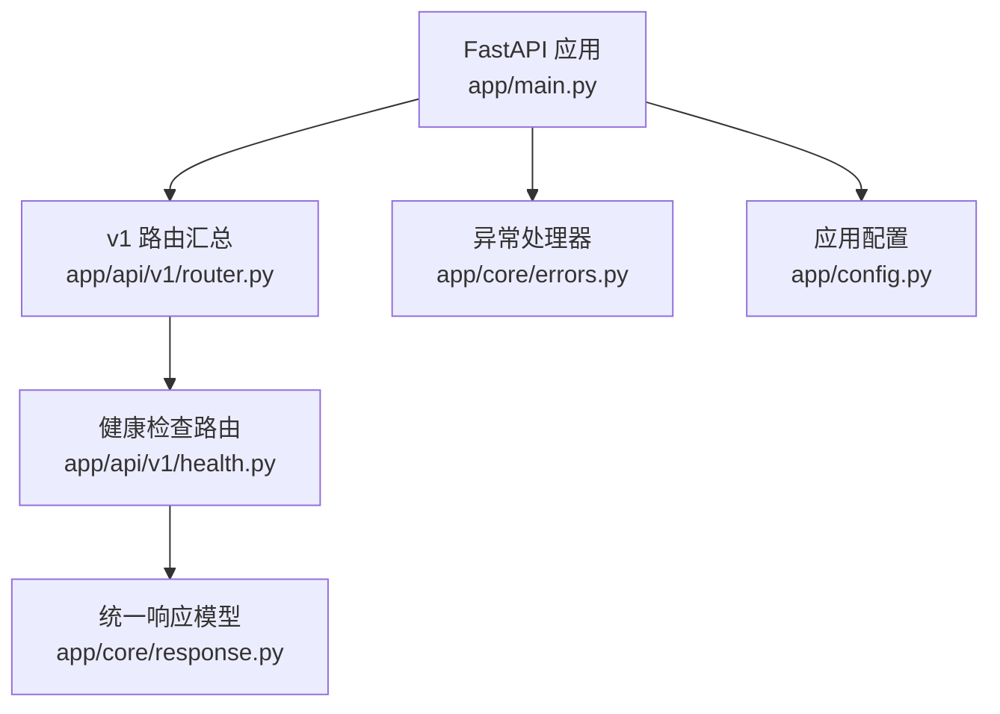
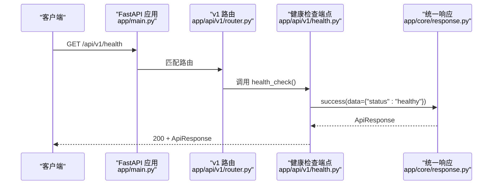
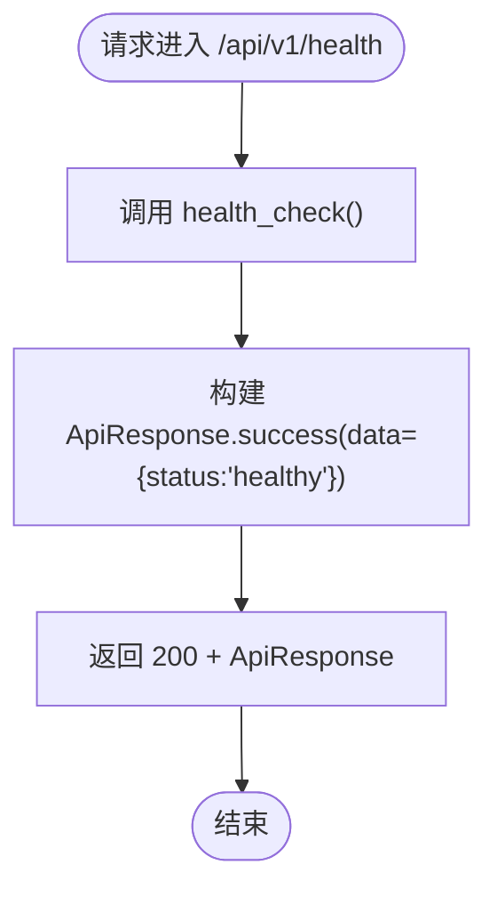
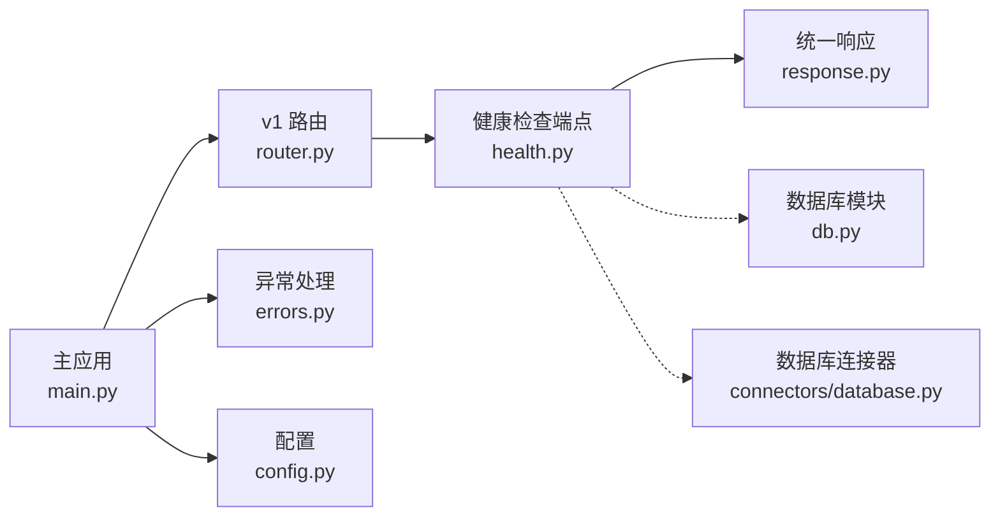

# 健康检查 API

<cite>
**本文引用的文件**
- [app/api/v1/health.py](file://app/api/v1/health.py)
- [app/api/v1/router.py](file://app/api/v1/router.py)
- [app/main.py](file://app/main.py)
- [app/core/response.py](file://app/core/response.py)
- [app/core/errors.py](file://app/core/errors.py)
- [app/config.py](file://app/config.py)
- [app/core/db.py](file://app/core/db.py)
- [app/core/connectors/database.py](file://app/core/connectors/database.py)
</cite>

## 目录
1. [简介](#简介)
2. [项目结构](#项目结构)
3. [核心组件](#核心组件)
4. [架构总览](#架构总览)
5. [详细组件分析](#详细组件分析)
6. [依赖关系分析](#依赖关系分析)
7. [性能考量](#性能考量)
8. [故障排查指南](#故障排查指南)
9. [结论](#结论)
10. [附录](#附录)

## 简介
本文件为“健康检查 API”的详细技术文档，覆盖服务状态监控接口的设计、实现与使用方式。当前仓库实现了基础的健康检查端点，用于快速验证服务进程是否存活并可响应请求；同时提供了扩展建议，以便后续接入系统健康状态、依赖服务连接状态（如数据库）和资源使用情况等更丰富的健康指标。

## 项目结构
健康检查相关代码位于 v1 API 路由中，并通过主应用入口注册到 FastAPI 应用中。统一响应模型和错误处理由 core 层提供，配置项通过 settings 集中管理。

图表来源
- [app/main.py:46-95](file://app/main.py#L46-L95)
- [app/api/v1/router.py:1-18](file://app/api/v1/router.py#L1-L18)
- [app/api/v1/health.py:1-13](file://app/api/v1/health.py#L1-L13)
- [app/core/response.py:71-103](file://app/core/response.py#L71-L103)
- [app/core/errors.py:30-74](file://app/core/errors.py#L30-L74)
- [app/config.py:6-22](file://app/config.py#L6-L22)

章节来源
- [app/main.py:46-95](file://app/main.py#L46-L95)
- [app/api/v1/router.py:1-18](file://app/api/v1/router.py#L1-L18)
- [app/api/v1/health.py:1-13](file://app/api/v1/health.py#L1-L13)
- [app/core/response.py:71-103](file://app/core/response.py#L71-L103)
- [app/core/errors.py:30-74](file://app/core/errors.py#L30-L74)
- [app/config.py:6-22](file://app/config.py#L6-L22)

## 核心组件
- 健康检查端点：GET /api/v1/health，返回统一成功响应体，data.status 表示健康状态。
- 统一响应模型：ApiResponse，包含 code、message、data、request_id。
- 全局异常处理：将业务异常转换为统一响应格式，并设置合适的 HTTP 状态码。
- 应用生命周期：启动时初始化 SQLite 数据集库，便于后续健康检查可探测数据库可用性。

章节来源
- [app/api/v1/health.py:10-12](file://app/api/v1/health.py#L10-L12)
- [app/core/response.py:71-103](file://app/core/response.py#L71-L103)
- [app/core/errors.py:30-74](file://app/core/errors.py#L30-L74)
- [app/main.py:29-43](file://app/main.py#L29-L43)

## 架构总览
健康检查请求从客户端进入 FastAPI，经中间件注入 request_id，命中 v1 路由中的 health 端点，调用 ApiResponse.success 构造响应并返回。异常路径由全局异常处理器捕获并返回统一错误格式。

图表来源
- [app/main.py:64-79](file://app/main.py#L64-L79)
- [app/api/v1/router.py:11-17](file://app/api/v1/router.py#L11-L17)
- [app/api/v1/health.py:10-12](file://app/api/v1/health.py#L10-L12)
- [app/core/response.py:79-86](file://app/core/response.py#L79-L86)

## 详细组件分析

### 健康检查端点
- 端点：GET /api/v1/health
- 功能：返回服务基本健康状态，当前固定返回 data.status = "healthy"。
- 认证：无需认证。
- 响应体：遵循统一 ApiResponse 格式。

图表来源
- [app/api/v1/health.py:10-12](file://app/api/v1/health.py#L10-L12)
- [app/core/response.py:79-86](file://app/core/response.py#L79-L86)

章节来源
- [app/api/v1/health.py:1-13](file://app/api/v1/health.py#L1-L13)

### 统一响应模型与错误码
- ApiResponse：包含 code、message、data、request_id。
- ErrorCode：定义业务错误码枚举，健康检查成功时使用 SUCCESS。
- 全局异常处理器：将业务异常映射为 ApiResponse，并设置合适的 HTTP 状态码（例如参数校验失败 422、服务器内部错误 500）。

章节来源
- [app/core/response.py:12-103](file://app/core/response.py#L12-L103)
- [app/core/errors.py:30-74](file://app/core/errors.py#L30-L74)

### 应用生命周期与数据库初始化
- 启动流程：在 lifespan 中初始化 SQLite 数据集库，并启动后台清理任务。
- 健康检查可扩展：可在健康检查中增加对数据库连通性的探测，以反映依赖服务状态。

章节来源
- [app/main.py:29-43](file://app/main.py#L29-L43)
- [app/core/db.py:59-84](file://app/core/db.py#L59-L84)

## 依赖关系分析
健康检查端点直接依赖统一响应模型；应用整体依赖路由聚合、异常处理和配置模块。数据库连接器与数据库模块可用于扩展健康检查的依赖探测能力。

图表来源
- [app/api/v1/health.py:1-13](file://app/api/v1/health.py#L1-L13)
- [app/api/v1/router.py:1-18](file://app/api/v1/router.py#L1-L18)
- [app/main.py:46-95](file://app/main.py#L46-L95)
- [app/core/response.py:71-103](file://app/core/response.py#L71-L103)
- [app/core/errors.py:30-74](file://app/core/errors.py#L30-L74)
- [app/config.py:6-22](file://app/config.py#L6-L22)
- [app/core/db.py:59-84](file://app/core/db.py#L59-L84)
- [app/core/connectors/database.py:19-112](file://app/core/connectors/database.py#L19-L112)

章节来源
- [app/api/v1/health.py:1-13](file://app/api/v1/health.py#L1-L13)
- [app/api/v1/router.py:1-18](file://app/api/v1/router.py#L1-L18)
- [app/main.py:46-95](file://app/main.py#L46-L95)
- [app/core/response.py:71-103](file://app/core/response.py#L71-L103)
- [app/core/errors.py:30-74](file://app/core/errors.py#L30-L74)
- [app/config.py:6-22](file://app/config.py#L6-L22)
- [app/core/db.py:59-84](file://app/core/db.py#L59-L84)
- [app/core/connectors/database.py:19-112](file://app/core/connectors/database.py#L19-L112)

## 性能考量
- 当前健康检查端点无外部依赖调用，开销极低，适合作为存活探针或就绪探针。
- 若扩展为依赖健康检查（如数据库连通性），应控制超时与重试策略，避免影响上游调度器判断。
- 建议在健康检查中加入轻量级指标（如内存占用、线程数、最近错误计数），但需确保不引入阻塞 IO。

[本节为通用指导，不涉及具体文件]

## 故障排查指南
- 如果健康检查返回非 200 状态码，请检查全局异常处理器是否正确捕获异常并返回统一响应格式。
- 若需要探测数据库可用性，可参考数据库模块的初始化与查询逻辑，并在健康检查中执行轻量级 SELECT 测试。
- 若出现参数校验失败或服务器内部错误，查看异常处理器对应的 HTTP 状态码与错误消息字段。

章节来源
- [app/core/errors.py:30-74](file://app/core/errors.py#L30-L74)
- [app/core/db.py:59-84](file://app/core/db.py#L59-L84)

## 结论
当前健康检查 API 提供了最小可用的存活检测能力，返回统一的 ApiResponse 格式，便于监控系统集成。未来可按需扩展为综合健康检查，包括依赖服务连接状态与资源使用情况，以满足生产环境的监控与告警需求。

[本节为总结性内容，不涉及具体文件]

## 附录

### 端点规范
- 方法：GET
- 路径：/api/v1/health
- 认证：无需
- 成功响应体（HTTP 200）：
  - code: 0（成功）
  - message: "success"
  - data:
    - status: "healthy"
  - request_id: 字符串（由中间件注入或生成）

章节来源
- [app/api/v1/health.py:10-12](file://app/api/v1/health.py#L10-L12)
- [app/core/response.py:71-103](file://app/core/response.py#L71-L103)
- [app/main.py:64-71](file://app/main.py#L64-L71)

### 监控集成示例
- Kubernetes LivenessProbe：
  - httpGet: /api/v1/health
  - initialDelaySeconds: 5
  - periodSeconds: 10
- Prometheus 抓取：
  - 暴露 /metrics 端点（如需自定义指标）
  - 健康检查可作为 readiness/liveness 探针

[本节为概念性说明，不涉及具体文件]

### 告警配置建议
- 基于探针失败次数：连续 N 次健康检查失败触发告警。
- 基于响应时间：健康检查响应超过阈值（如 500ms）触发告警。
- 基于依赖健康：当扩展为依赖健康检查后，可对数据库连通性失败进行告警。

[本节为概念性说明，不涉及具体文件]

### 扩展设计（可选）
- 依赖健康检查：
  - 数据库连通性：执行轻量级 SELECT 1 或读取元数据表。
  - 外部服务：对关键下游服务发起短超时探测。
- 资源使用情况：
  - 内存、CPU、磁盘空间、打开文件句柄数等。
- 指标上报：
  - 将健康检查结果与指标上报至监控系统（如 Prometheus）。

章节来源
- [app/core/db.py:59-84](file://app/core/db.py#L59-L84)
- [app/core/connectors/database.py:19-112](file://app/core/connectors/database.py#L19-L112)