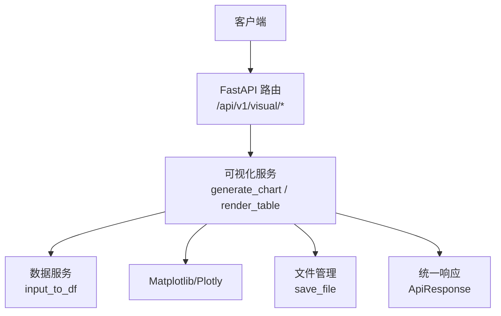
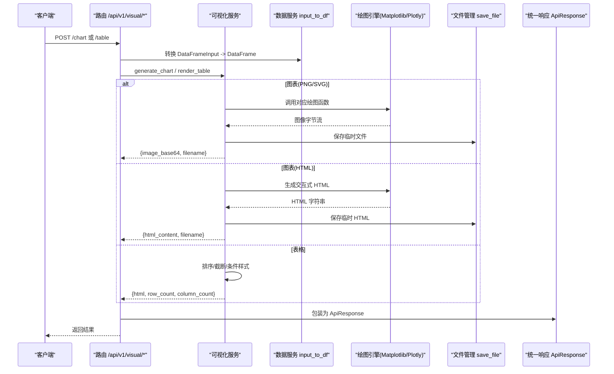
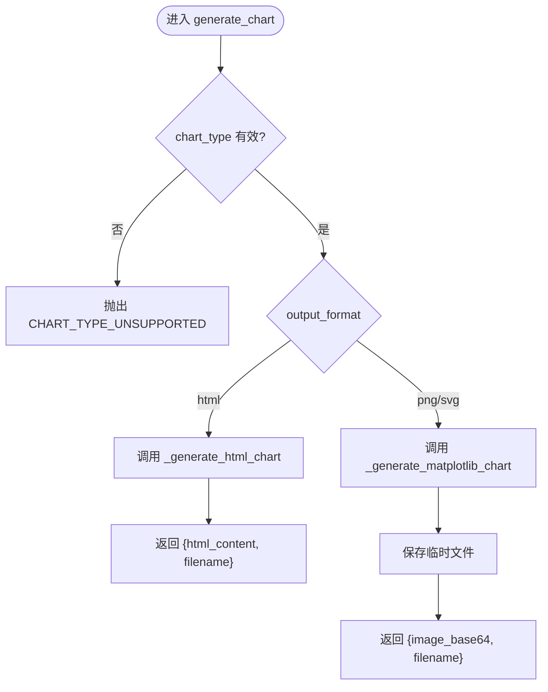
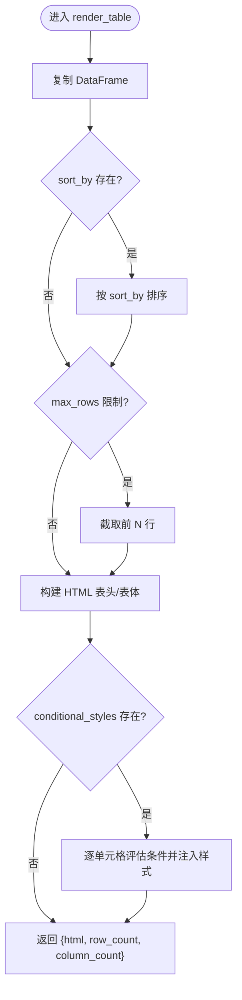
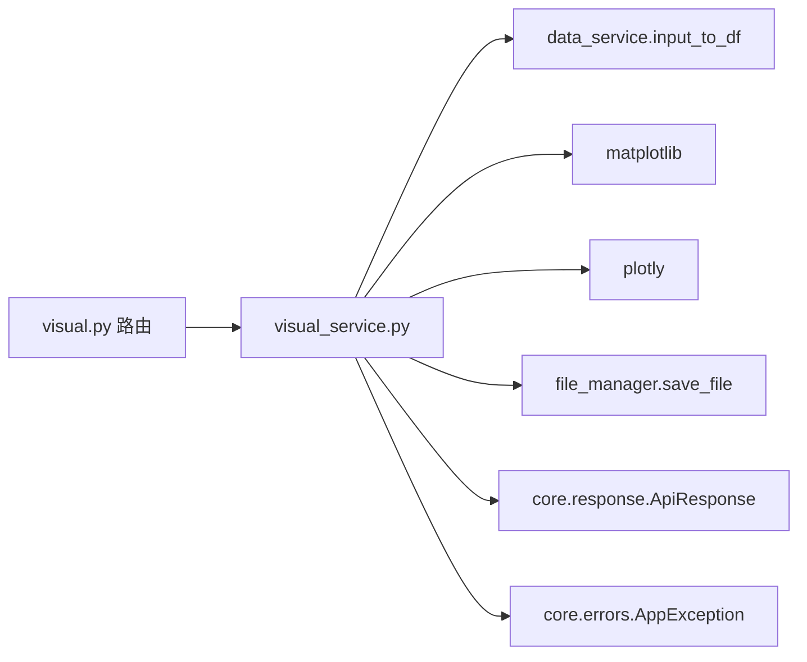

# 可视化 API

<cite>
**本文引用的文件**
- [app/api/v1/visual.py](file://app/api/v1/visual.py)
- [app/services/visual_service.py](file://app/services/visual_service.py)
- [app/models/visual_models.py](file://app/models/visual_models.py)
- [app/models/data_models.py](file://app/models/data_models.py)
- [app/core/response.py](file://app/core/response.py)
- [app/core/errors.py](file://app/core/errors.py)
- [app/services/data_service.py](file://app/services/data_service.py)
- [tests/test_visual_api.py](file://tests/test_visual_api.py)
</cite>

## 目录
1. [简介](#简介)
2. [项目结构](#项目结构)
3. [核心组件](#核心组件)
4. [架构总览](#架构总览)
5. [详细接口说明](#详细接口说明)
6. [依赖关系分析](#依赖关系分析)
7. [性能与可用性](#性能与可用性)
8. [故障排查指南](#故障排查指南)
9. [结论](#结论)
10. [附录：配置示例与输出格式](#附录配置示例与输出格式)

## 简介
本文档面向“可视化 API”，覆盖图表生成与表格渲染两大能力。支持的图表类型包括柱状图、折线图、饼图、散点图、热力图、雷达图、面积图、直方图、箱线图；支持 PNG/SVG/HTML 三种输出格式，并提供 HTML 表格的排序、条件着色、列宽控制等样式能力。所有接口通过 FastAPI 暴露，统一响应体封装错误码与请求 ID，便于集成与排障。

## 项目结构
可视化功能由路由层、服务层、模型层与通用基础设施组成：
- 路由层：定义 /api/v1/visual/chart 与 /api/v1/visual/table 两个端点
- 服务层：实现图表绘制（matplotlib/plotly）与 HTML 表格渲染
- 模型层：定义请求/响应的 Pydantic 模型，约束参数与返回结构
- 基础设施：统一响应体、错误码、异常处理器、数据输入转换

**图示来源**
- [app/api/v1/visual.py:13-29](file://app/api/v1/visual.py#L13-L29)
- [app/services/visual_service.py:51-205](file://app/services/visual_service.py#L51-L205)
- [app/services/data_service.py:35-45](file://app/services/data_service.py#L35-L45)
- [app/core/response.py:71-103](file://app/core/response.py#L71-L103)

**章节来源**
- [app/api/v1/visual.py:1-29](file://app/api/v1/visual.py#L1-L29)
- [app/services/visual_service.py:1-205](file://app/services/visual_service.py#L1-L205)
- [app/models/visual_models.py:13-107](file://app/models/visual_models.py#L13-L107)
- [app/models/data_models.py:13-18](file://app/models/data_models.py#L13-L18)
- [app/core/response.py:12-103](file://app/core/response.py#L12-L103)

## 核心组件
- 路由模块：提供 /chart 与 /table 两个 POST 接口，接收 DataFrameInput 与配置对象，调用服务层并返回 ApiResponse
- 可视化服务：根据 ChartType 选择绘图函数，按 OutputFormat 决定使用 matplotlib（PNG/SVG）或 plotly（HTML），并持久化临时文件
- 表格渲染：基于 Pandas 构建 HTML 表格，支持排序、最大行数、条件样式、列宽、索引显示
- 数据输入转换：将 JSON 形式的 DataFrameInput 转为 pandas.DataFrame，支持可选 dtypes 提示
- 统一响应与异常：业务异常携带错误码，全局异常处理器将其转换为 ApiResponse

**章节来源**
- [app/api/v1/visual.py:13-29](file://app/api/v1/visual.py#L13-L29)
- [app/services/visual_service.py:51-205](file://app/services/visual_service.py#L51-L205)
- [app/services/visual_service.py:333-401](file://app/services/visual_service.py#L333-L401)
- [app/services/data_service.py:35-45](file://app/services/data_service.py#L35-L45)
- [app/core/errors.py:15-74](file://app/core/errors.py#L15-L74)
- [app/core/response.py:71-103](file://app/core/response.py#L71-L103)

## 架构总览
下图展示从请求到响应的完整流程，包括图表与表格两条路径。

**图示来源**
- [app/api/v1/visual.py:13-29](file://app/api/v1/visual.py#L13-L29)
- [app/services/visual_service.py:51-205](file://app/services/visual_service.py#L51-L205)
- [app/services/visual_service.py:333-401](file://app/services/visual_service.py#L333-L401)
- [app/services/data_service.py:35-45](file://app/services/data_service.py#L35-L45)
- [app/core/response.py:71-103](file://app/core/response.py#L71-L103)

## 详细接口说明

### 接口一：生成图表
- 路径：POST /api/v1/visual/chart
- 功能：根据配置生成图表，支持 PNG/SVG/HTML 输出
- 请求体字段
  - dataframe：DataFrameInput（columns, data, dtypes 可选）
  - config：ChartConfig（见下）
  - output_format：OutputFormat（png/svg/html）
- 响应体：ApiResponse.data 包含 image_base64 或 html_content、filename、output_format

#### ChartConfig 字段说明
- chart_type：bar/line/pie/scatter/heatmap/radar/area/histogram/box
- x：X 轴列名（部分图表必需）
- y：Y 轴列名，可为单列或多列（多系列）
- title：标题
- xlabel/ylabel：坐标轴标签
- colors：颜色列表（按系列顺序）
- width/height：画布宽高（像素）
- x_axis/y_axis：AxisConfig（label、tick_rotation、min_value、max_value）
- extra：扩展参数（如直方图的 bins）

#### 各图表类型要点
- 柱状图 bar：支持多系列分组；x 为分类，y 可为单列或多列
- 折线图 line：支持多系列；自动网格线
- 饼图 pie：需要 x（标签列）和 y（数值列）
- 散点图 scatter：需要 x 和 y 两列
- 热力图 heatmap：对数值列计算相关系数矩阵并可视化
- 雷达图 radar：数值列作为维度，每行一个系列
- 面积图 area：支持多系列填充区域
- 直方图 histogram：需指定 x 列，extra.bins 控制分箱数
- 箱线图 box：y 为数值列列表，按列绘制箱线

#### 输出格式
- png：返回 base64 编码的图片与临时文件名
- svg：返回 SVG 文本与临时文件名
- html：返回可嵌入页面的 Plotly 交互 HTML 与临时文件名

**图示来源**
- [app/services/visual_service.py:51-87](file://app/services/visual_service.py#L51-L87)
- [app/services/visual_service.py:90-147](file://app/services/visual_service.py#L90-L147)
- [app/services/visual_service.py:150-205](file://app/services/visual_service.py#L150-L205)

**章节来源**
- [app/api/v1/visual.py:13-21](file://app/api/v1/visual.py#L13-L21)
- [app/models/visual_models.py:15-66](file://app/models/visual_models.py#L15-L66)
- [app/services/visual_service.py:51-205](file://app/services/visual_service.py#L51-L205)
- [tests/test_visual_api.py:5-116](file://tests/test_visual_api.py#L5-L116)

### 接口二：渲染数据表格
- 路径：POST /api/v1/visual/table
- 功能：将 DataFrame 渲染为带样式的 HTML 表格，支持排序、条件着色、列宽、索引显示、最大行数
- 请求体字段
  - dataframe：DataFrameInput
  - config：TableConfig（可选）
- 响应体：ApiResponse.data 包含 html、row_count、column_count

#### TableConfig 字段说明
- title：表格标题
- sort_by：排序列名
- sort_ascending：是否升序
- max_rows：最大显示行数
- conditional_styles：条件样式列表（column、condition、style）
- column_widths：列宽映射（列名 -> CSS 宽度）
- show_index：是否显示行索引列

#### 条件样式规则
- condition 支持比较运算符：>, <, >=, <=, ==, !=
- 值可为数字或字符串；NaN 不参与匹配
- style 为 CSS 键值对，直接注入单元格样式

**图示来源**
- [app/services/visual_service.py:333-401](file://app/services/visual_service.py#L333-L401)
- [app/services/visual_service.py:404-430](file://app/services/visual_service.py#L404-L430)

**章节来源**
- [app/api/v1/visual.py:24-29](file://app/api/v1/visual.py#L24-L29)
- [app/models/visual_models.py:78-107](file://app/models/visual_models.py#L78-L107)
- [app/services/visual_service.py:333-430](file://app/services/visual_service.py#L333-L430)
- [tests/test_visual_api.py:119-166](file://tests/test_visual_api.py#L119-L166)

## 依赖关系分析
- 路由依赖服务：/chart 与 /table 均调用 visual_service
- 服务依赖数据服务：input_to_df 将 JSON 数据转为 DataFrame
- 服务依赖绘图库：matplotlib 用于 PNG/SVG，plotly 用于 HTML 交互图
- 服务依赖文件管理：save_file 用于保存临时文件（PNG/SVG/HTML）
- 异常与响应：AppException 与 ErrorCode 统一错误处理，ApiResponse 统一返回结构

**图示来源**
- [app/api/v1/visual.py:13-29](file://app/api/v1/visual.py#L13-L29)
- [app/services/visual_service.py:51-205](file://app/services/visual_service.py#L51-L205)
- [app/services/data_service.py:35-45](file://app/services/data_service.py#L35-L45)
- [app/core/response.py:71-103](file://app/core/response.py#L71-L103)
- [app/core/errors.py:15-74](file://app/core/errors.py#L15-L74)

**章节来源**
- [app/api/v1/visual.py:1-29](file://app/api/v1/visual.py#L1-L29)
- [app/services/visual_service.py:1-205](file://app/services/visual_service.py#L1-L205)
- [app/services/data_service.py:35-45](file://app/services/data_service.py#L35-L45)
- [app/core/response.py:12-103](file://app/core/response.py#L12-L103)
- [app/core/errors.py:15-74](file://app/core/errors.py#L15-L74)

## 性能与可用性
- 中文字体：启动时尝试设置常用中文字体，避免中文乱码
- 无头模式：matplotlib 使用 Agg 后端，适合服务器环境
- 内存与并发：图表生成会创建临时文件，建议合理设置并发与清理策略
- 大数据集：表格渲染支持 max_rows 限制，避免超大表格导致前端卡顿
- 交互图表：HTML 输出依赖 CDN 加载 plotly.js，确保网络可达

[本节为通用指导，不直接分析具体文件]

## 故障排查指南
- 参数校验失败：检查 DataFrameInput 的 columns/data 长度一致，dtypes 类型合法；ChartConfig 的 chart_type 必须为枚举值
- 图表类型不支持：确认 chart_type 在支持的集合内；HTML 模式下某些类型可能受限
- 渲染失败：捕获绘图过程中的异常，查看日志中的错误信息；检查数据列是否存在且类型正确
- SQL/数据处理错误：非可视化模块但影响数据准备，注意错误码区分
- 常见状态码
  - 200：成功，code=0
  - 422：参数校验失败（Pydantic）
  - 500：未预期异常（已统一封装）

**章节来源**
- [app/core/errors.py:15-74](file://app/core/errors.py#L15-L74)
- [app/core/response.py:12-103](file://app/core/response.py#L12-L103)
- [app/services/visual_service.py:69-87](file://app/services/visual_service.py#L69-L87)
- [tests/test_visual_api.py:78-93](file://tests/test_visual_api.py#L78-L93)

## 结论
本可视化 API 提供了统一的图表与表格渲染能力，覆盖主流图表类型与多种输出格式，并通过严格的模型校验与统一响应体保障稳定性与可维护性。结合条件样式与主题配置，可满足多样化的报表与看板需求。

[本节为总结，不直接分析具体文件]

## 附录：配置示例与输出格式

### 图表生成请求示例（描述性）
- 柱状图 PNG
  - dataframe：columns=["product","sales"], data=[["A",100],["B",200],["C",150]]
  - config：chart_type="bar", x="product", y="sales", title="Sales by Product"
  - output_format="png"
  - 期望响应：image_base64 非空，output_format="png"，filename 非空
- 折线图 SVG
  - dataframe：columns=["month","value"], data=[["Jan",10],["Feb",20],["Mar",15],["Apr",30]]
  - config：chart_type="line", x="month", y="value", title="Monthly Trend"
  - output_format="svg"
  - 期望响应：image_base64 包含 "<svg"，output_format="svg"
- 饼图 PNG
  - dataframe：columns=["category","amount"], data=[["Food",40],["Transport",20],["Other",15]]
  - config：chart_type="pie", x="category", y="amount", title="Expense Distribution"
  - output_format="png"
- HTML 交互图
  - dataframe：columns=["name","value"], data=[["A",10],["B",20],["C",30]]
  - config：chart_type="bar", x="name", y="value", title="HTML Chart"
  - output_format="html"
  - 期望响应：html_content 非空，包含 plotly 内容

以上用例可在测试文件中找到对应断言与构造方式。

**章节来源**
- [tests/test_visual_api.py:5-116](file://tests/test_visual_api.py#L5-L116)

### 表格渲染请求示例（描述性）
- 基础表格
  - dataframe：columns=["name","score"], data=[["Alice",88.5],["Bob",92.0],["Charlie",76.3]]
  - 期望响应：html 包含 "<table"，row_count=3
- 带配置的表格
  - config：title="Score Report", sort_by="score", sort_ascending=false
  - conditional_styles：[{column="score", condition="> 90", style={"background-color":"green","color":"white"}}]
  - 期望响应：html 包含标题与绿色背景样式

**章节来源**
- [tests/test_visual_api.py:119-166](file://tests/test_visual_api.py#L119-L166)

### 自定义样式与主题设置方法
- 图表主题与颜色
  - colors：传入颜色数组，按系列顺序生效
  - width/height：调整画布尺寸
  - x_axis/y_axis：设置坐标轴标签、刻度旋转、范围限制
  - title/xlabel/ylabel：设置标题与坐标轴名称
- 表格主题与样式
  - conditional_styles：按列与条件注入 CSS 样式
  - column_widths：控制列宽
  - show_index：显示行索引列
  - sort_by/sort_ascending/max_rows：控制排序与显示规模

**章节来源**
- [app/models/visual_models.py:35-66](file://app/models/visual_models.py#L35-L66)
- [app/models/visual_models.py:78-107](file://app/models/visual_models.py#L78-L107)
- [app/services/visual_service.py:90-147](file://app/services/visual_service.py#L90-L147)
- [app/services/visual_service.py:150-205](file://app/services/visual_service.py#L150-L205)
- [app/services/visual_service.py:333-401](file://app/services/visual_service.py#L333-L401)