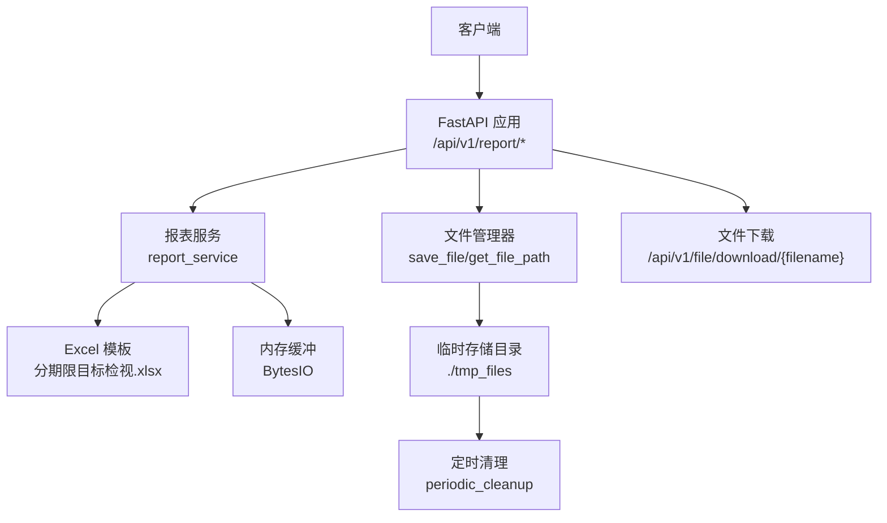
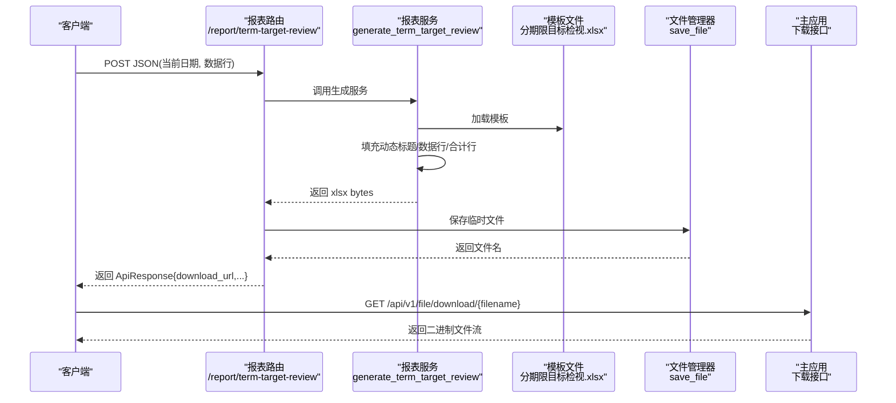
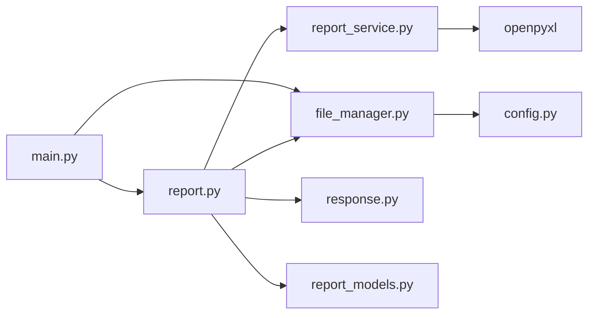

# 报表 API

<cite>
**本文引用的文件**
- [app/api/v1/report.py](file://app/api/v1/report.py)
- [app/services/report_service.py](file://app/services/report_service.py)
- [app/models/report_models.py](file://app/models/report_models.py)
- [app/core/file_manager.py](file://app/core/file_manager.py)
- [app/config.py](file://app/config.py)
- [app/core/response.py](file://app/core/response.py)
- [app/main.py](file://app/main.py)
- [app/api/v1/router.py](file://app/api/v1/router.py)
- [tests/test_report.py](file://tests/test_report.py)
</cite>

## 目录
1. [简介](#简介)
2. [项目结构](#项目结构)
3. [核心组件](#核心组件)
4. [架构总览](#架构总览)
5. [详细组件分析](#详细组件分析)
6. [依赖关系分析](#依赖关系分析)
7. [性能与扩展性](#性能与扩展性)
8. [故障排查指南](#故障排查指南)
9. [结论](#结论)
10. [附录：接口规范与示例](#附录接口规范与示例)

## 简介
本章节面向“报表 API”，聚焦 Excel 报表生成、模板填充与文件下载。系统通过 FastAPI 暴露统一接口，接收结构化数据后加载预置的 Excel 模板，按行映射写入数据并计算合计，最终将生成的 xlsx 保存到临时目录并提供下载链接。同时提供后台定时清理机制，自动清理过期临时文件，保障磁盘空间稳定。

## 项目结构
报表相关代码主要分布在以下模块：
- API 路由层：定义报表生成接口与下载接口
- 服务层：负责模板加载、数据填充、合计计算与字节流输出
- 模型层：定义请求参数与响应结构
- 文件管理：负责临时文件的保存、读取、删除与定时清理
- 配置：存储路径、清理周期等运行期配置
- 主应用：挂载路由并实现文件下载端点

图表来源
- [app/api/v1/report.py:15-34](file://app/api/v1/report.py#L15-L34)
- [app/services/report_service.py:21-32](file://app/services/report_service.py#L21-L32)
- [app/core/file_manager.py:22-78](file://app/core/file_manager.py#L22-L78)
- [app/main.py:81-93](file://app/main.py#L81-L93)

章节来源
- [app/api/v1/router.py:1-18](file://app/api/v1/router.py#L1-L18)
- [app/main.py:77-93](file://app/main.py#L77-L93)

## 核心组件
- 报表生成接口：POST /api/v1/report/term-target-review
  - 输入：当前日期与多行结构化数据（产品类型、期限分类、当日规模、较上月末变化、销量分析）
  - 处理：加载模板、填充动态标题、写入数据行、计算合计行
  - 输出：返回文件名、格式、下载 URL、行列数等信息
- 模板填充服务：基于 openpyxl 操作工作簿，按索引映射写入单元格，支持部分填充与合计计算
- 文件管理：保存为临时文件，提供下载；按配置周期清理过期文件
- 下载接口：GET /api/v1/file/download/{filename}，返回二进制文件流

章节来源
- [app/api/v1/report.py:15-34](file://app/api/v1/report.py#L15-L34)
- [app/services/report_service.py:21-77](file://app/services/report_service.py#L21-L77)
- [app/core/file_manager.py:22-78](file://app/core/file_manager.py#L22-L78)
- [app/main.py:81-93](file://app/main.py#L81-L93)

## 架构总览
报表生成与下载的端到端流程如下：

图表来源
- [app/api/v1/report.py:15-34](file://app/api/v1/report.py#L15-L34)
- [app/services/report_service.py:21-32](file://app/services/report_service.py#L21-L32)
- [app/core/file_manager.py:22-27](file://app/core/file_manager.py#L22-L27)
- [app/main.py:81-93](file://app/main.py#L81-L93)

## 详细组件分析

### 报表生成接口
- 路由与标签：/api/v1/report/term-target-review，标签“报表生成”
- 请求体：包含 current_date 与 rows 数组，rows 支持 1-5 行
- 响应体：统一 ApiResponse，data 中包含 filename、format、download_url、row_count、column_count
- 行为：
  - 调用报表服务生成 xlsx 字节流
  - 使用文件管理器保存为临时文件
  - 拼接 base_url 构造 download_url
  - 返回 row_count 与 column_count 用于前端展示

章节来源
- [app/api/v1/report.py:15-34](file://app/api/v1/report.py#L15-L34)
- [app/core/response.py:71-103](file://app/core/response.py#L71-L103)

### 模板填充服务
- 模板路径：位于 app/templates/分期限目标检视.xlsx
- 动态标题：
  - C2：月份规模（如“6月规模”）
  - C3：具体日期规模（如“6/22规模”）
  - E3：周期说明（最近 7 天工作日区间与工作天数）
- 数据行映射：
  - 使用索引到行号的映射表，将 rows 写入对应模板行
  - 写入列：C（当日规模）、D（较上月末变化）、E（销量分析文本）
- 合计行：
  - 固定行号合计 C/D 列数值，E 列保持“-”
- 内存输出：
  - 使用 BytesIO 保存 workbook，返回 bytes 供后续持久化

复杂度与优化：
- 时间复杂度 O(n)，n 为数据行数
- 空间复杂度 O(1) 额外空间（除 workbook 本身）
- 可优化点：
  - 若模板较大或并发高，可考虑复用 workbook 对象或使用只读模式减少开销
  - 对超大 rows 列表进行分批写入以降低峰值内存

章节来源
- [app/services/report_service.py:13-32](file://app/services/report_service.py#L13-L32)
- [app/services/report_service.py:38-77](file://app/services/report_service.py#L38-L77)

### 数据模型
- TermTargetRow：单行数据，包含产品类型、期限分类、当日规模、较上月末变化、销量分析
- TermTargetReviewRequest：请求体，包含当前日期与 rows 数组（1-5 行）
- ReportFileResult：生成结果，包含文件名、格式、下载 URL、行列数

校验与约束：
- Pydantic 校验确保必填字段、长度限制、类型正确
- 非法输入返回 422 参数校验错误

章节来源
- [app/models/report_models.py:11-36](file://app/models/report_models.py#L11-L36)

### 文件存储与下载
- 存储策略：
  - 临时目录由配置 file_storage_path 指定，默认 ./tmp_files
  - 文件名前缀 + UUID + 后缀，避免冲突
- 下载接口：
  - GET /api/v1/file/download/{filename}
  - 若文件不存在，抛出未找到异常
  - 以 application/octet-stream 返回二进制流
- 清理机制：
  - 后台任务 periodic_cleanup 每 30 分钟执行一次
  - 根据 file_cleanup_interval_hours 配置判断是否过期并删除
  - 记录清理日志与异常

章节来源
- [app/core/file_manager.py:15-78](file://app/core/file_manager.py#L15-L78)
- [app/config.py:6-22](file://app/config.py#L6-L22)
- [app/main.py:81-93](file://app/main.py#L81-L93)

### 批量导出能力
- 当前接口支持一次性提交多条数据（最多 5 行），在服务层逐行写入模板
- 合计行自动对所有传入行求和，便于快速汇总
- 如需更大批量导出，可在服务层增加分页或分批写入逻辑，并在响应中提供分页信息

章节来源
- [app/models/report_models.py:21-26](file://app/models/report_models.py#L21-L26)
- [app/services/report_service.py:61-77](file://app/services/report_service.py#L61-L77)

## 依赖关系分析
- 路由依赖：
  - report.py 依赖 report_service、file_manager、response、models
- 服务依赖：
  - report_service 依赖 openpyxl、models
- 文件管理依赖：
  - file_manager 依赖 config
- 主应用依赖：
  - main.py 挂载 v1 路由并实现下载接口

图表来源
- [app/api/v1/report.py:1-34](file://app/api/v1/report.py#L1-L34)
- [app/services/report_service.py:1-32](file://app/services/report_service.py#L1-L32)
- [app/core/file_manager.py:1-27](file://app/core/file_manager.py#L1-L27)
- [app/config.py:6-22](file://app/config.py#L6-L22)
- [app/main.py:77-93](file://app/main.py#L77-L93)

章节来源
- [app/api/v1/router.py:1-18](file://app/api/v1/router.py#L1-L18)
- [app/main.py:77-93](file://app/main.py#L77-L93)

## 性能与扩展性
- 性能特征：
  - 单次请求处理时间受模板大小与数据行数影响
  - 使用内存缓冲减少 I/O 开销
  - 后台清理避免磁盘膨胀
- 扩展建议：
  - 模板样式定制：在模板中预设样式（字体、边框、对齐、条件格式），服务层仅填充值，不修改样式，保证一致性
  - 多模板支持：按业务维度拆分模板文件，服务层根据参数选择模板路径
  - 并发与缓存：在高并发场景下，可对常用模板进行只读缓存，降低 load_workbook 开销
  - 大文件导出：引入异步任务队列（如 Celery）生成并通知下载，避免长连接阻塞

[本节为通用指导，不直接分析具体文件]

## 故障排查指南
- 常见错误与定位：
  - 422 参数校验失败：检查 current_date 格式与 rows 必填字段
  - 404 文件不存在：确认 download_url 中的 filename 是否存在于临时目录
  - 报表生成失败：检查模板路径与权限，确认模板存在且可读
- 日志与调试：
  - 清理任务会记录删除数量与异常堆栈
  - 可通过日志级别调整观察更多细节
- 验证方法：
  - 使用测试用例验证 Excel 内容、合并单元格、动态日期与合计行
  - 下载文件后用 openpyxl 解析校验关键单元格

章节来源
- [tests/test_report.py:63-284](file://tests/test_report.py#L63-L284)
- [app/core/file_manager.py:64-78](file://app/core/file_manager.py#L64-L78)
- [app/core/response.py:12-68](file://app/core/response.py#L12-L68)

## 结论
报表 API 提供了稳定的 Excel 模板填充与下载能力，具备清晰的请求/响应模型、完善的参数校验与后台清理机制。通过模板与数据分离的设计，既保证了报表格式的一致性，又提升了扩展性与可维护性。建议在后续迭代中引入多模板支持与异步任务以提升大规模导出能力。

[本节为总结性内容，不直接分析具体文件]

## 附录：接口规范与示例

### 接口清单
- 生成报表
  - 方法：POST
  - 路径：/api/v1/report/term-target-review
  - 请求体：current_date（YYYY-MM-DD）、rows（1-5 行）
  - 响应：ApiResponse.data 包含 filename、format、download_url、row_count、column_count
- 下载文件
  - 方法：GET
  - 路径：/api/v1/file/download/{filename}
  - 响应：二进制文件流

章节来源
- [app/api/v1/report.py:15-34](file://app/api/v1/report.py#L15-L34)
- [app/main.py:81-93](file://app/main.py#L81-L93)

### 模板格式与数据绑定
- 模板位置：app/templates/分期限目标检视.xlsx
- 动态标题：
  - C2：月份规模
  - C3：具体日期规模
  - E3：周期说明（最近 7 天工作日区间与工作天数）
- 数据绑定：
  - 行映射：索引 0-4 对应模板第 4-8 行
  - 列绑定：C（当日规模）、D（较上月末变化）、E（销量分析文本）
- 合计行：
  - 固定第 9 行，C/D 列求和，E 列显示“-”

章节来源
- [app/services/report_service.py:13-32](file://app/services/report_service.py#L13-L32)
- [app/services/report_service.py:38-77](file://app/services/report_service.py#L38-L77)

### 样式定制选项
- 建议在模板中预设样式（字体、边框、对齐、条件格式），服务层仅填充值
- 如需动态样式，可在服务层扩展样式写入逻辑，但需评估性能与一致性风险

[本节为通用指导，不直接分析具体文件]

### 批量导出功能
- 当前支持一次性提交最多 5 行数据
- 合计行自动计算所有传入行的总和
- 如需更大批量，可扩展服务层分批写入并在响应中提供分页信息

章节来源
- [app/models/report_models.py:21-26](file://app/models/report_models.py#L21-L26)
- [app/services/report_service.py:61-77](file://app/services/report_service.py#L61-L77)

### 文件存储策略与清理机制
- 存储目录：由配置 file_storage_path 指定，默认 ./tmp_files
- 命名规则：前缀 + UUID + 后缀，避免冲突
- 清理策略：
  - 后台任务每 30 分钟执行一次
  - 超过 file_cleanup_interval_hours 小时的临时文件将被删除
  - 记录清理日志与异常

章节来源
- [app/core/file_manager.py:15-78](file://app/core/file_manager.py#L15-L78)
- [app/config.py:6-22](file://app/config.py#L6-L22)

### 报表生成示例与下载使用说明
- 示例请求体：参考测试用例中的 FULL_PAYLOAD，包含 current_date 与 rows 数组
- 下载步骤：
  - 调用生成接口获取 download_url
  - 使用 GET 请求该 URL 下载 xlsx 文件
  - 使用任意 Excel 工具打开查看内容与合计行

章节来源
- [tests/test_report.py:13-52](file://tests/test_report.py#L13-L52)
- [tests/test_report.py:83-91](file://tests/test_report.py#L83-L91)