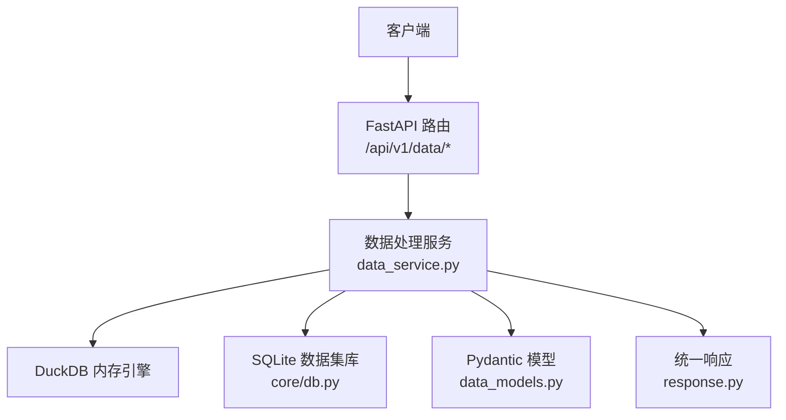
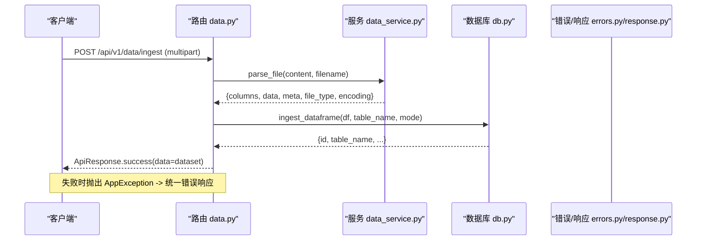
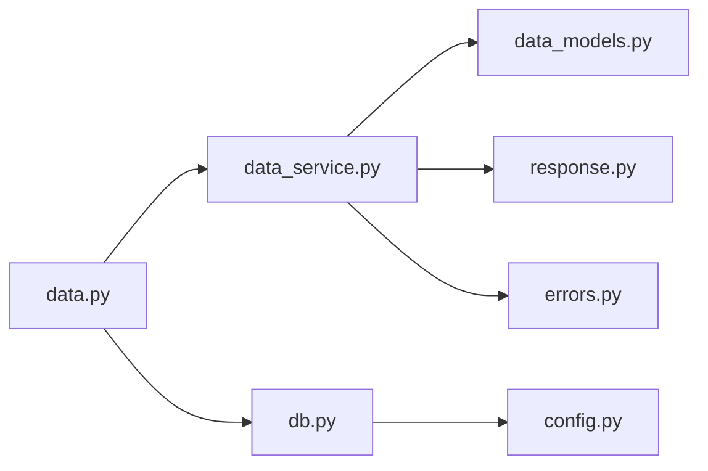

# 数据处理 API

<cite>
**本文引用的文件**
- [app/api/v1/data.py](file://app/api/v1/data.py)
- [app/services/data_service.py](file://app/services/data_service.py)
- [app/models/data_models.py](file://app/models/data_models.py)
- [app/core/db.py](file://app/core/db.py)
- [app/core/response.py](file://app/core/response.py)
- [app/core/errors.py](file://app/core/errors.py)
- [app/config.py](file://app/config.py)
- [tests/test_data_api.py](file://tests/test_data_api.py)
</cite>

## 目录
1. [简介](#简介)
2. [项目结构](#项目结构)
3. [核心组件](#核心组件)
4. [架构总览](#架构总览)
5. [接口详细文档](#接口详细文档)
6. [依赖关系分析](#依赖关系分析)
7. [性能与扩展性](#性能与扩展性)
8. [故障排查指南](#故障排查指南)
9. [结论](#结论)
10. [附录：请求/响应示例](#附录请求响应示例)

## 简介
本 API 提供统一的数据处理与查询能力，支持 CSV/Excel/JSON 文件解析入库、SQLite 数据集管理、DuckDB SQL 查询、数据筛选、聚合统计、透视表生成、排序去重、数据清洗和统计分析等。所有接口采用统一的响应格式与错误码体系，便于集成与排错。

## 项目结构
- 路由层：FastAPI 路由定义在 v1 下，按功能拆分模块（data、visual、pipeline、report）。
- 服务层：业务逻辑集中在 services/data_service.py，封装 DataFrame 操作、SQL 执行、清洗与统计。
- 模型层：Pydantic 模型集中定义请求/响应结构，保证参数校验与类型安全。
- 存储层：SQLite 数据集管理与查询封装在 core/db.py。
- 通用层：统一响应体与错误码、异常处理器、配置项。

图表来源
- [app/api/v1/data.py:1-201](file://app/api/v1/data.py#L1-L201)
- [app/services/data_service.py:1-447](file://app/services/data_service.py#L1-L447)
- [app/core/db.py:1-324](file://app/core/db.py#L1-L324)
- [app/models/data_models.py:1-145](file://app/models/data_models.py#L1-L145)
- [app/core/response.py:1-103](file://app/core/response.py#L1-L103)

章节来源
- [app/api/v1/router.py:1-18](file://app/api/v1/router.py#L1-L18)
- [app/config.py:1-23](file://app/config.py#L1-L23)

## 核心组件
- 路由与控制器：定义 /api/v1/data/* 的 HTTP 端点，负责参数接收与调用服务层。
- 数据处理服务：实现文件解析、SQL 查询、筛选、聚合、透视、排序、去重、清洗、统计分析。
- 数据模型：定义 DataFrameInput、QueryRequest、FilterRequest、AggregateRequest、PivotRequest、SortRequest、DedupRequest、CleanRequest、StatisticsRequest 等。
- 数据库管理：SQLite 数据集的入库、查询、删除与元数据管理。
- 统一响应与错误：ApiResponse、ErrorCode、AppException 及全局异常处理器。

章节来源
- [app/api/v1/data.py:1-201](file://app/api/v1/data.py#L1-L201)
- [app/services/data_service.py:1-447](file://app/services/data_service.py#L1-L447)
- [app/models/data_models.py:1-145](file://app/models/data_models.py#L1-L145)
- [app/core/db.py:1-324](file://app/core/db.py#L1-L324)
- [app/core/response.py:1-103](file://app/core/response.py#L1-L103)
- [app/core/errors.py:1-74](file://app/core/errors.py#L1-L74)

## 架构总览

图表来源
- [app/api/v1/data.py:39-83](file://app/api/v1/data.py#L39-L83)
- [app/services/data_service.py:77-117](file://app/services/data_service.py#L77-L117)
- [app/core/db.py:89-189](file://app/core/db.py#L89-L189)
- [app/core/errors.py:15-42](file://app/core/errors.py#L15-L42)
- [app/core/response.py:71-103](file://app/core/response.py#L71-L103)

## 接口详细文档

### 通用约定
- 基础路径：/api/v1/data
- 成功响应：{ code: 0, message: "success", data: ..., request_id: "uuid" }
- 错误响应：{ code: <错误码>, message: "<消息>", data: null|any, request_id: "uuid" }
- 常见错误码
  - 1001 参数校验失败
  - 1003 资源不存在
  - 2001 文件解析失败
  - 2002 SQL 执行错误
  - 2003 数据为空
  - 2004 数据类型错误
  - 2005 数据集操作错误

章节来源
- [app/core/response.py:12-68](file://app/core/response.py#L12-L68)
- [app/core/response.py:71-103](file://app/core/response.py#L71-L103)
- [app/core/errors.py:15-74](file://app/core/errors.py#L15-L74)

---

### 文件解析与入库

#### 上传并解析为 DataFrame
- 方法：POST
- 路径：/api/v1/data/parse
- 请求体：multipart/form-data
  - file: 必填，CSV/Excel/JSON 文件
- 响应：
  - columns: 列名列表
  - data: 二维数组（行优先）
  - meta: { row_count, column_count, columns, dtypes }
  - file_type: csv/excel/json
  - encoding: 检测到的编码（CSV/JSON）
- 错误：
  - 不支持的文件格式 -> 2001
  - 文件内容为空 -> 2003

章节来源
- [app/api/v1/data.py:139-144](file://app/api/v1/data.py#L139-L144)
- [app/services/data_service.py:77-117](file://app/services/data_service.py#L77-L117)

#### 数据文件入库（SQLite）
- 方法：POST
- 路径：/api/v1/data/ingest
- 请求体：multipart/form-data
  - file: 必填，CSV/Excel/JSON
  - table_name: 可选，append 模式必填
  - description: 可选，描述
  - mode: 可选，create（默认）或 append
- 行为：
  - create：新建表，若表名已存在报错
  - append：追加到已有表，需指定 table_name，列不匹配报错
- 响应：数据集元信息（id、table_name、filename、description、row_count、column_count、columns、dtypes、file_type、mode）
- 错误：
  - 不支持的模式 -> 2005
  - 文件解析失败 -> 2001
  - 数据为空 -> 2003

章节来源
- [app/api/v1/data.py:39-83](file://app/api/v1/data.py#L39-L83)
- [app/core/db.py:89-189](file://app/core/db.py#L89-L189)

#### 列出数据集
- 方法：GET
- 路径：/api/v1/data/datasets
- 响应：数据集元信息列表

章节来源
- [app/api/v1/data.py:86-90](file://app/api/v1/data.py#L86-L90)
- [app/core/db.py:194-207](file://app/core/db.py#L194-L207)

#### 获取数据集详情（可预览）
- 方法：GET
- 路径：/api/v1/data/datasets/{dataset_id}?preview=N
- 说明：N>0 时返回前 N 行预览
- 响应：数据集元信息 + 可选 preview
- 错误：不存在 -> 1003

章节来源
- [app/api/v1/data.py:93-105](file://app/api/v1/data.py#L93-L105)
- [app/core/db.py:210-236](file://app/core/db.py#L210-L236)

#### SQL 查询已入库数据
- 方法：POST
- 路径：/api/v1/data/datasets/{dataset_id}/query
- 请求体：
  - sql: SELECT 语句（表名使用 ingest 返回的 table_name）
- 安全限制：仅允许 SELECT/WITH 开头；禁止危险关键字
- 响应：{ columns, data, row_count }
- 错误：
  - 数据集不存在 -> 1003
  - SQL 非法 -> 2002

章节来源
- [app/api/v1/data.py:108-122](file://app/api/v1/data.py#L108-L122)
- [app/core/db.py:256-296](file://app/core/db.py#L256-L296)

#### 删除数据集
- 方法：DELETE
- 路径：/api/v1/data/datasets/{dataset_id}
- 响应：{ deleted: true, id: dataset_id }
- 错误：不存在 -> 1003

章节来源
- [app/api/v1/data.py:125-134](file://app/api/v1/data.py#L125-L134)
- [app/core/db.py:301-323](file://app/core/db.py#L301-L323)

---

### 单步数据处理接口

以下接口均接收 JSON 请求体，包含 dataframe 字段（DataFrameInput），以及各自的操作参数。统一返回 { columns, data, meta }。

#### SQL 查询（DuckDB）
- 方法：POST
- 路径：/api/v1/data/query
- 请求体：
  - dataframe: { columns, data[, dtypes] }
  - sql: SELECT 语句（虚拟表名为 df 或自定义 table_name）
  - table_name: 可选，默认 df
- 安全限制：仅允许 SELECT/WITH 开头；禁止危险关键字
- 响应：查询结果
- 错误：
  - SQL 非法 -> 2002
  - 执行异常 -> 2002

章节来源
- [app/api/v1/data.py:147-151](file://app/api/v1/data.py#L147-L151)
- [app/services/data_service.py:128-158](file://app/services/data_service.py#L128-L158)
- [app/models/data_models.py:48-53](file://app/models/data_models.py#L48-L53)

#### 数据筛选
- 方法：POST
- 路径：/api/v1/data/filter
- 请求体：
  - dataframe: { columns, data[, dtypes] }
  - conditions: 条件列表 [{ column, operator, value }]
    - operator 支持：eq, ne, gt, ge, lt, le, in, not_in, contains, startswith, endswith
  - logic: and/or（默认 and）
- 响应：筛选后的数据
- 错误：
  - 列不存在 -> 1001
  - 不支持的运算符 -> 1001

章节来源
- [app/api/v1/data.py:154-158](file://app/api/v1/data.py#L154-L158)
- [app/services/data_service.py:178-210](file://app/services/data_service.py#L178-L210)
- [app/models/data_models.py:57-69](file://app/models/data_models.py#L57-L69)

#### 聚合统计
- 方法：POST
- 路径：/api/v1/data/aggregate
- 请求体：
  - dataframe: { columns, data[, dtypes] }
  - group_by: 分组列
  - agg_columns: 目标数值列
  - agg_funcs: 聚合函数列表（sum, mean, count, min, max, median, std, var）
- 响应：聚合结果（列名扁平化，如 score_sum）
- 错误：
  - 不支持的聚合函数 -> 1001
  - 执行异常 -> 2004

章节来源
- [app/api/v1/data.py:161-165](file://app/api/v1/data.py#L161-L165)
- [app/services/data_service.py:218-243](file://app/services/data_service.py#L218-L243)
- [app/models/data_models.py:73-82](file://app/models/data_models.py#L73-L82)

#### 透视表
- 方法：POST
- 路径：/api/v1/data/pivot
- 请求体：
  - dataframe: { columns, data[, dtypes] }
  - index: 行索引列
  - columns: 列展开列
  - values: 值列
  - agg_func: 聚合函数（默认 sum）
- 响应：透视表结果（MultiIndex 列名被扁平化）
- 错误：生成失败 -> 2004

章节来源
- [app/api/v1/data.py:168-172](file://app/api/v1/data.py#L168-L172)
- [app/services/data_service.py:248-272](file://app/services/data_service.py#L248-L272)
- [app/models/data_models.py:86-93](file://app/models/data_models.py#L86-L93)

#### 排序
- 方法：POST
- 路径：/api/v1/data/sort
- 请求体：
  - dataframe: { columns, data[, dtypes] }
  - sort_by: 排序列
  - ascending: 是否升序（bool 或 bool 列表）
- 响应：排序后数据

章节来源
- [app/api/v1/data.py:175-179](file://app/api/v1/data.py#L175-L179)
- [app/services/data_service.py:277-284](file://app/services/data_service.py#L277-L284)
- [app/models/data_models.py:97-102](file://app/models/data_models.py#L97-L102)

#### 去重
- 方法：POST
- 路径：/api/v1/data/dedup
- 请求体：
  - dataframe: { columns, data[, dtypes] }
  - subset: 去重依据列（可选，None 表示全列）
  - keep: first/last/false（默认 first）
- 响应：去重后数据

章节来源
- [app/api/v1/data.py:182-186](file://app/api/v1/data.py#L182-L186)
- [app/services/data_service.py:289-295](file://app/services/data_service.py#L289-L295)
- [app/models/data_models.py:106-110](file://app/models/data_models.py#L106-L110)

#### 数据清洗
- 方法：POST
- 路径：/api/v1/data/clean
- 请求体：
  - dataframe: { columns, data[, dtypes] }
  - operations: 清洗操作列表
    - fill_na: 填充空值（params.value 默认 0；column 为空则全列）
    - drop_na: 删除空值（params.how: any/all；column 为空则全列）
    - cast_type: 类型转换（params.type: int/int64/float/float64/str/string/datetime/bool/自定义；datetime 可带 format）
    - strip_text: 去除空白（column 为空则对所有字符串列）
    - replace_text: 文本替换（params.pattern/replacement/regex）
    - drop_outliers: 基于 IQR 剔除异常值（params.factor 默认 1.5；必须指定 column）
- 响应：清洗后数据
- 错误：
  - 不支持的操作 -> 1001
  - 必需参数缺失 -> 1001
  - 类型转换失败 -> 2004

章节来源
- [app/api/v1/data.py:189-193](file://app/api/v1/data.py#L189-L193)
- [app/services/data_service.py:300-395](file://app/services/data_service.py#L300-L395)
- [app/models/data_models.py:115-129](file://app/models/data_models.py#L115-L129)

#### 统计分析
- 方法：POST
- 路径：/api/v1/data/statistics
- 请求体：
  - dataframe: { columns, data[, dtypes] }
  - stat_type: descriptive/correlation/frequency
  - columns: 目标列（为空时自动选择数值列；frequency 至少需要 1 列）
  - params: 额外参数（如 frequency 的 bins）
- 响应：
  - descriptive: 描述统计（index 列名为 stat）
  - correlation: 相关性矩阵（index 列名为 column）
  - frequency: 频率分布（含 count 与 percentage）
- 错误：
  - 无可用数值列 -> 2003
  - 相关性至少需要 2 个数值列 -> 1001
  - 频率分布至少需要 1 列 -> 1001
  - 不支持的统计类型 -> 1001

章节来源
- [app/api/v1/data.py:196-200](file://app/api/v1/data.py#L196-L200)
- [app/services/data_service.py:400-446](file://app/services/data_service.py#L400-L446)
- [app/models/data_models.py:133-145](file://app/models/data_models.py#L133-L145)

## 依赖关系分析

图表来源
- [app/api/v1/data.py:1-201](file://app/api/v1/data.py#L1-L201)
- [app/services/data_service.py:1-447](file://app/services/data_service.py#L1-L447)
- [app/core/db.py:1-324](file://app/core/db.py#L1-L324)
- [app/models/data_models.py:1-145](file://app/models/data_models.py#L1-L145)
- [app/core/response.py:1-103](file://app/core/response.py#L1-L103)
- [app/core/errors.py:1-74](file://app/core/errors.py#L1-L74)
- [app/config.py:1-23](file://app/config.py#L1-L23)

章节来源
- [app/api/v1/data.py:1-201](file://app/api/v1/data.py#L1-L201)
- [app/services/data_service.py:1-447](file://app/services/data_service.py#L1-L447)
- [app/core/db.py:1-324](file://app/core/db.py#L1-L324)

## 性能与扩展性
- 文件解析：对 CSV/JSON 使用 chardet 自动检测编码，减少乱码问题；Excel 直接读取。
- SQL 查询：DuckDB 内存引擎，适合中小规模数据快速分析；SQLite 用于持久化数据集。
- 大数据集建议：分页查询、限制返回行数、避免复杂 JOIN；必要时将中间结果落库复用。
- 并发与线程：SQLite 通过独立连接与异步任务执行，避免跨线程问题。
- 可扩展点：新增 action/清洗操作只需在服务层扩展映射与校验；可通过场景编排组合多个步骤。

[本节为通用指导，无需特定文件引用]

## 故障排查指南
- 参数校验失败（1001）：检查 Pydantic 模型字段类型与必填项；确保列名存在且运算符合法。
- 资源不存在（1003）：确认 dataset_id 有效；或删除前确保存在。
- 文件解析失败（2001）：确认文件格式受支持（csv/xlsx/xls/json）；检查文件内容是否为空。
- SQL 执行错误（2002）：确保 SQL 以 SELECT/WITH 开头；避免危险关键字；检查表名与列名。
- 数据为空（2003）：输入数据非空；统计时需有数值列。
- 数据类型错误（2004）：聚合/透视/清洗的类型要求；cast_type 转换失败会抛错。
- 数据集操作错误（2005）：入库模式不正确或 append 缺少必要列。

章节来源
- [app/core/response.py:12-68](file://app/core/response.py#L12-L68)
- [app/core/errors.py:15-74](file://app/core/errors.py#L15-L74)
- [app/services/data_service.py:77-117](file://app/services/data_service.py#L77-L117)
- [app/services/data_service.py:128-158](file://app/services/data_service.py#L128-L158)
- [app/services/data_service.py:178-210](file://app/services/data_service.py#L178-L210)
- [app/services/data_service.py:218-243](file://app/services/data_service.py#L218-L243)
- [app/services/data_service.py:248-272](file://app/services/data_service.py#L248-L272)
- [app/services/data_service.py:300-395](file://app/services/data_service.py#L300-L395)
- [app/services/data_service.py:400-446](file://app/services/data_service.py#L400-L446)
- [app/core/db.py:89-189](file://app/core/db.py#L89-L189)
- [app/core/db.py:256-296](file://app/core/db.py#L256-L296)

## 结论
该数据处理 API 提供了从文件解析、入库、查询到多种数据处理与分析的一站式能力。通过严格的参数校验与安全限制，结合统一响应与错误码，便于上层系统稳定集成。建议在大规模数据场景下合理使用分页与中间结果落库，以提升性能与可维护性。

[本节为总结，无需特定文件引用]

## 附录：请求/响应示例

以下示例基于测试用例与模型定义整理，展示典型成功与失败场景的请求与响应结构。为避免泄露具体代码，仅提供结构与要点。

- 文件解析（CSV）
  - 请求：multipart/form-data，file=test.csv
  - 成功响应：code=0，data.file_type="csv"，data.meta.row_count>0
  - 失败响应：code=2001（不支持格式）

- 文件解析（JSON）
  - 请求：multipart/form-data，file=test.json
  - 成功响应：code=0，data.meta.row_count>0

- SQL 查询（DuckDB）
  - 请求：{ dataframe:{...}, sql:"SELECT * FROM df LIMIT 10" }
  - 成功响应：code=0，data.columns 包含查询列
  - 失败响应：code=2002（SQL 注入或非法语句）

- 数据筛选
  - 请求：{ dataframe:{...}, conditions:[{column:"city",operator:"eq",value:"Beijing"}], logic:"and" }
  - 成功响应：code=0，data.meta.row_count 符合预期

- 聚合统计
  - 请求：{ dataframe:{...}, group_by:["city"], agg_columns:["score"], agg_funcs:["sum","mean"] }
  - 成功响应：code=0，data.columns 包含 score_sum、score_mean

- 排序
  - 请求：{ dataframe:{...}, sort_by:["score"], ascending:false }
  - 成功响应：code=0，第一行分数最高

- 去重
  - 请求：{ dataframe:{...}, subset:["city"], keep:"first" }
  - 成功响应：code=0，去重后行数等于唯一城市数

- 清洗（填充空值）
  - 请求：{ dataframe:{...}, operations:[{operation:"fill_na",column:null,params:{value:0}}] }
  - 成功响应：code=0，无空值

- 统计分析（描述性）
  - 请求：{ dataframe:{...}, stat_type:"descriptive" }
  - 成功响应：code=0，data.columns 包含 stat

- 统计分析（相关性）
  - 请求：{ dataframe:{...}, stat_type:"correlation", columns:["age","score"] }
  - 成功响应：code=0，data.columns 包含 column

章节来源
- [tests/test_data_api.py:16-174](file://tests/test_data_api.py#L16-L174)
- [app/models/data_models.py:13-145](file://app/models/data_models.py#L13-L145)
- [app/core/response.py:71-103](file://app/core/response.py#L71-L103)