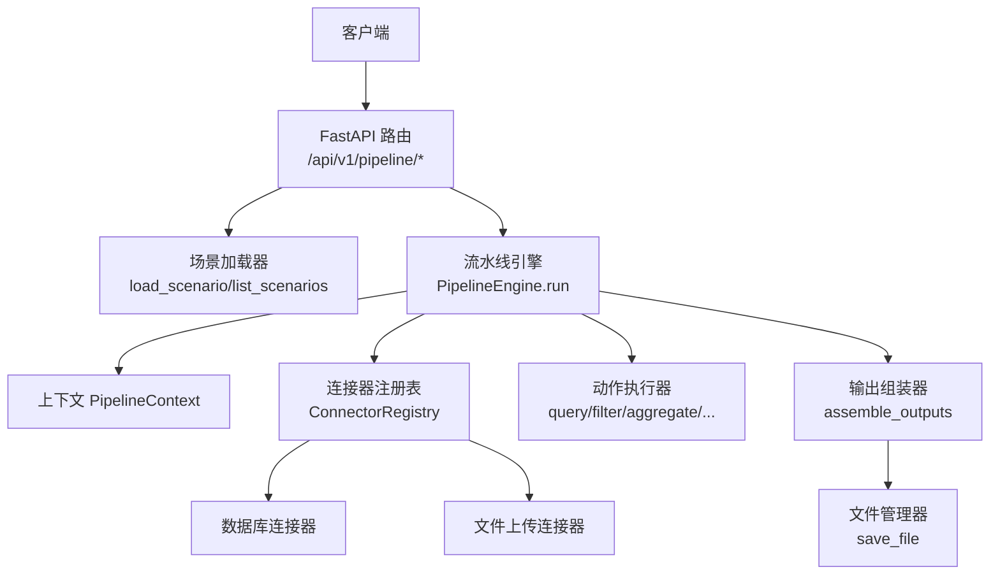
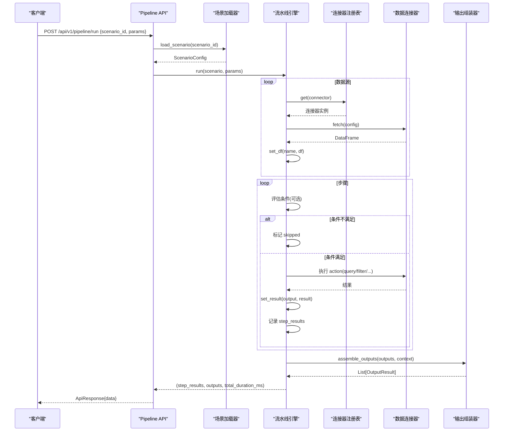
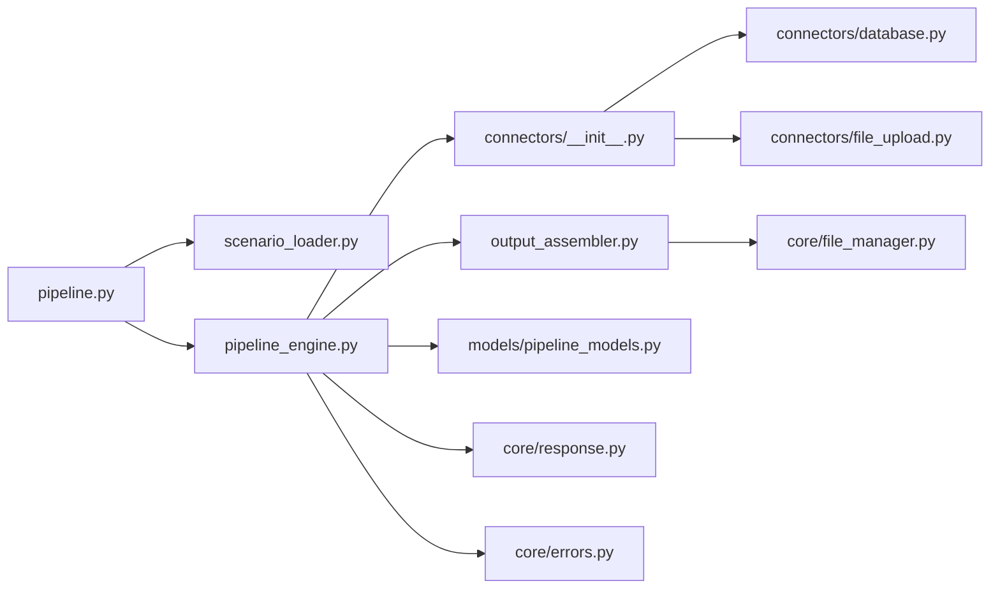
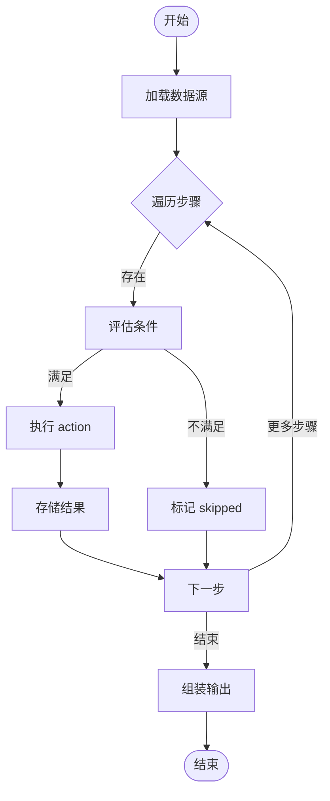

# 流水线 API

<cite>
**本文引用的文件**
- [app/api/v1/pipeline.py](file://app/api/v1/pipeline.py)
- [app/core/pipeline_engine.py](file://app/core/pipeline_engine.py)
- [app/core/scenario_loader.py](file://app/core/scenario_loader.py)
- [app/core/output_assembler.py](file://app/core/output_assembler.py)
- [app/models/pipeline_models.py](file://app/models/pipeline_models.py)
- [app/core/connectors/__init__.py](file://app/core/connectors/__init__.py)
- [app/core/connectors/database.py](file://app/core/connectors/database.py)
- [app/core/connectors/file_upload.py](file://app/core/connectors/file_upload.py)
- [app/core/errors.py](file://app/core/errors.py)
- [app/core/response.py](file://app/core/response.py)
- [app/scenarios/product_increment_analysis.yaml](file://app/scenarios/product_increment_analysis.yaml)
- [app/scenarios/sample_analysis.yaml](file://app/scenarios/sample_analysis.yaml)
- [tests/test_pipeline.py](file://tests/test_pipeline.py)
</cite>

## 目录
1. [简介](#简介)
2. [项目结构](#项目结构)
3. [核心组件](#核心组件)
4. [架构总览](#架构总览)
5. [详细组件分析](#详细组件分析)
6. [依赖关系分析](#依赖关系分析)
7. [性能考量](#性能考量)
8. [故障排查指南](#故障排查指南)
9. [结论](#结论)
10. [附录](#附录)

## 简介
本文档面向“场景驱动的自动化数据处理”流水线 API，覆盖以下能力：
- 场景执行：通过 YAML 配置定义数据源、步骤编排与输出，调用统一接口即可运行。
- 状态查询：返回每个步骤的执行状态（success/skipped/failed）与耗时。
- 结果获取：支持表格、图表、文件导出、摘要等多种输出类型。
- 条件分支：在步骤级别支持简单条件表达式，实现按需跳过或继续。
- 错误处理：支持 on_error 策略（skip/abort），以及全局异常处理器。
- 上下文管理：PipelineContext 统一管理中间 DataFrame 与非 DataFrame 结果，并支持输入参数注入。
- 中间结果存储：步骤 output 字段将结果写入上下文，供后续步骤或输出阶段消费。

## 项目结构
该流水线由“API 层 + 引擎层 + 连接器 + 场景配置 + 输出组装”构成，采用分层与注册表模式组织代码，便于扩展新的数据源与动作。

图示来源
- [app/api/v1/pipeline.py:1-48](file://app/api/v1/pipeline.py#L1-L48)
- [app/core/pipeline_engine.py:249-357](file://app/core/pipeline_engine.py#L249-L357)
- [app/core/scenario_loader.py:68-128](file://app/core/scenario_loader.py#L68-L128)
- [app/core/connectors/__init__.py:13-60](file://app/core/connectors/__init__.py#L13-L60)
- [app/core/output_assembler.py:19-38](file://app/core/output_assembler.py#L19-L38)

章节来源
- [app/api/v1/pipeline.py:1-48](file://app/api/v1/pipeline.py#L1-L48)
- [app/core/pipeline_engine.py:249-357](file://app/core/pipeline_engine.py#L249-L357)
- [app/core/scenario_loader.py:68-128](file://app/core/scenario_loader.py#L68-L128)
- [app/core/connectors/__init__.py:13-60](file://app/core/connectors/__init__.py#L13-L60)
- [app/core/output_assembler.py:19-38](file://app/core/output_assembler.py#L19-L38)

## 核心组件
- 场景加载器：负责从 YAML 文件加载并校验场景配置，提供场景列表能力。
- 流水线引擎：编排数据源加载、步骤执行、条件判断、错误处理与输出组装。
- 上下文对象：维护输入参数、中间 DataFrame、非 DataFrame 结果与步骤执行记录。
- 连接器注册表：以单例注册表管理多种数据源连接器（数据库、文件上传、URL、API）。
- 输出组装器：根据输出配置生成表格、图表、文件与摘要等最终结果。
- 模型与响应：统一的请求/响应模型与错误码体系。

章节来源
- [app/core/scenario_loader.py:19-56](file://app/core/scenario_loader.py#L19-L56)
- [app/core/pipeline_engine.py:37-70](file://app/core/pipeline_engine.py#L37-L70)
- [app/core/connectors/__init__.py:13-60](file://app/core/connectors/__init__.py#L13-L60)
- [app/core/output_assembler.py:19-38](file://app/core/output_assembler.py#L19-L38)
- [app/models/pipeline_models.py:11-46](file://app/models/pipeline_models.py#L11-L46)
- [app/core/response.py:12-103](file://app/core/response.py#L12-L103)

## 架构总览
下图展示了从 HTTP 请求到场景执行的完整时序，包括数据源加载、步骤执行、条件分支、错误处理与输出组装。

图示来源
- [app/api/v1/pipeline.py:14-48](file://app/api/v1/pipeline.py#L14-L48)
- [app/core/pipeline_engine.py:252-357](file://app/core/pipeline_engine.py#L252-L357)
- [app/core/scenario_loader.py:68-128](file://app/core/scenario_loader.py#L68-L128)
- [app/core/connectors/__init__.py:13-60](file://app/core/connectors/__init__.py#L13-L60)
- [app/core/output_assembler.py:19-38](file://app/core/output_assembler.py#L19-L38)

## 详细组件分析

### 场景配置与 YAML 语法
- 顶层字段
  - scenario_id：场景标识，对应 YAML 文件名（不含扩展名）。
  - name/description/version：元信息。
- data_sources：数据源数组
  - name：数据源名称，用于后续 input 引用。
  - connector：连接器类型（database/file_upload/file_url/api）。
  - config：连接器特定配置，可包含 param_mapping 将 $input.xxx 映射为实际值。
- pipeline：步骤数组
  - name：步骤名。
  - action：动作类型（query/filter/aggregate/pivot/sort/dedup/clean/statistics）。
  - input：上游数据源或步骤输出名称。
  - params：动作参数，支持 $input.xxx 占位符解析。
  - output：将结果写入上下文（DataFrame 或非 DataFrame）。
  - condition：条件表达式（has:ref / not_empty:ref）。
  - on_error：错误策略（skip/abort）。
- outputs：输出定义
  - type：table/chart/file/summary。
  - source：引用上下文中的名称。
  - config：输出相关配置（如标题、格式、行列限制等）。

章节来源
- [app/core/scenario_loader.py:21-56](file://app/core/scenario_loader.py#L21-L56)
- [app/scenarios/product_increment_analysis.yaml:1-126](file://app/scenarios/product_increment_analysis.yaml#L1-L126)
- [app/scenarios/sample_analysis.yaml:1-68](file://app/scenarios/sample_analysis.yaml#L1-L68)

### 步骤编排与动作执行
- 数据源加载：按顺序遍历 data_sources，通过 ConnectorRegistry 获取对应连接器并 fetch，结果以 name 存入上下文。
- 步骤执行：
  - 条件检查：若 condition 不满足，标记 skipped 并继续。
  - 输入解析：从上下文读取 input 对应的 DataFrame。
  - 参数解析：将 $input.xxx 替换为实际输入参数。
  - 动作执行：根据 action 路由至具体处理函数，调用服务层完成数据处理。
  - 结果存储：若定义了 output，将结果写入上下文（DataFrame 或非 DataFrame）。
  - 错误处理：依据 on_error 决定 skip 或 abort。
- 输出组装：遍历 outputs，按类型渲染为表格、图表、文件或摘要。

章节来源
- [app/core/pipeline_engine.py:266-357](file://app/core/pipeline_engine.py#L266-L357)
- [app/core/pipeline_engine.py:131-234](file://app/core/pipeline_engine.py#L131-L234)
- [app/core/output_assembler.py:19-189](file://app/core/output_assembler.py#L19-L189)

### 条件分支处理
- 支持两种简单条件：
  - has:ref：检查上下文中是否存在 ref（DataFrame 或非 DataFrame 结果）。
  - not_empty:ref：检查 ref 是否存在且 DataFrame 非空。
- 条件不满足时，步骤状态为 skipped，不影响后续步骤执行。

章节来源
- [app/core/pipeline_engine.py:100-119](file://app/core/pipeline_engine.py#L100-L119)
- [app/core/pipeline_engine.py:278-288](file://app/core/pipeline_engine.py#L278-L288)

### 错误处理机制
- 步骤级错误：
  - AppException：业务异常，携带错误码与消息。
  - on_error=skip：记录失败并继续执行后续步骤。
  - on_error=abort：记录失败并终止流程，直接返回已执行步骤结果。
- 全局异常：
  - 自定义异常处理器：将 AppException 转换为统一 ApiResponse。
  - 参数校验异常：返回 422 与校验错误详情。
  - 未预期异常：返回 500 与通用错误信息。

章节来源
- [app/core/pipeline_engine.py:317-349](file://app/core/pipeline_engine.py#L317-L349)
- [app/core/errors.py:15-74](file://app/core/errors.py#L15-L74)
- [app/core/response.py:12-103](file://app/core/response.py#L12-L103)

### 上下文管理与中间结果存储
- PipelineContext：
  - 输入参数：input_params，支持 $input.xxx 占位符解析。
  - 中间数据：_data 字典，键为名称，值为 DataFrame。
  - 中间结果：_results 字典，键为名称，值为任意对象。
  - 步骤结果：step_results 列表，记录每步状态与耗时。
- 访问方法：
  - set_df/get_df：存取 DataFrame。
  - set_result/get_result：存取非 DataFrame 结果。
  - has：判断名称是否存在于 _data 或 _results。
  - get_input：读取输入参数。

章节来源
- [app/core/pipeline_engine.py:37-70](file://app/core/pipeline_engine.py#L37-L70)
- [app/core/pipeline_engine.py:266-307](file://app/core/pipeline_engine.py#L266-L307)

### 连接器与数据源
- 连接器注册表：
  - 单例模式，集中管理所有连接器类型。
  - 提供 register/get/list_types/has 等方法。
- 内置连接器：
  - 数据库连接器：支持 SQLite（DuckDB）、MySQL/PostgreSQL（SQLAlchemy）。
  - 文件上传连接器：接收 base64 编码内容，解析为 DataFrame。
  - URL 与 API 连接器：通过注册表扩展。
- 使用方式：
  - 在 data_sources 中指定 connector 与 config。
  - 可通过 param_mapping 将 $input.xxx 映射到 config 字段。

章节来源
- [app/core/connectors/__init__.py:13-60](file://app/core/connectors/__init__.py#L13-L60)
- [app/core/connectors/database.py:19-112](file://app/core/connectors/database.py#L19-L112)
- [app/core/connectors/file_upload.py:18-64](file://app/core/connectors/file_upload.py#L18-L64)
- [app/scenarios/sample_analysis.yaml:10-17](file://app/scenarios/sample_analysis.yaml#L10-L17)

### 输出类型与示例
- table：表格输出，返回格式化数据。
- chart：图表输出，支持多种图表类型与格式。
- file：文件导出，支持 csv/xlsx/json，返回下载链接与元信息。
- summary：摘要输出，包含行数、列数、数据类型、数值列统计与前 N 行预览。

章节来源
- [app/core/output_assembler.py:62-189](file://app/core/output_assembler.py#L62-L189)
- [app/scenarios/product_increment_analysis.yaml:101-126](file://app/scenarios/product_increment_analysis.yaml#L101-L126)
- [app/scenarios/sample_analysis.yaml:50-68](file://app/scenarios/sample_analysis.yaml#L50-L68)

## 依赖关系分析
- API 层依赖场景加载器与引擎；引擎依赖连接器注册表与服务层；输出组装器依赖可视化服务与文件管理器。
- 连接器通过注册表解耦，新增连接器只需实现基类并注册。
- 错误处理贯穿全链路，统一通过 ApiResponse 返回。

图示来源
- [app/api/v1/pipeline.py:1-48](file://app/api/v1/pipeline.py#L1-L48)
- [app/core/pipeline_engine.py:249-357](file://app/core/pipeline_engine.py#L249-L357)
- [app/core/connectors/__init__.py:13-60](file://app/core/connectors/__init__.py#L13-L60)
- [app/core/output_assembler.py:19-38](file://app/core/output_assembler.py#L19-L38)

章节来源
- [app/api/v1/pipeline.py:1-48](file://app/api/v1/pipeline.py#L1-L48)
- [app/core/pipeline_engine.py:249-357](file://app/core/pipeline_engine.py#L249-L357)
- [app/core/connectors/__init__.py:13-60](file://app/core/connectors/__init__.py#L13-L60)
- [app/core/output_assembler.py:19-38](file://app/core/output_assembler.py#L19-L38)

## 性能考量
- 数据源加载并行化：当前为串行加载，可根据场景并发优化（注意连接池与资源竞争）。
- 条件短路：合理使用 condition 减少不必要计算。
- 中间结果复用：通过 output 缓存中间结果，避免重复计算。
- 输出裁剪：summary 的 max_rows 控制预览大小，降低传输开销。
- 文件导出：大文件建议流式导出或异步任务，避免阻塞请求。

[本节为通用指导，无需源码引用]

## 故障排查指南
- 场景不存在：检查 scenario_id 与 YAML 文件名是否一致，确认 scenarios_dir 路径正确。
- 连接器错误：检查 connector 类型与 config 字段是否齐全（如 database 的 driver/sql/path）。
- 步骤失败：查看 step_results 中 status 与 message，结合 on_error 策略定位问题。
- 参数解析失败：确认 $input.xxx 是否在 params 中存在，且类型匹配。
- 输出组装失败：检查 outputs.source 是否存在于上下文，type 是否受支持。

章节来源
- [app/core/scenario_loader.py:68-105](file://app/core/scenario_loader.py#L68-L105)
- [app/core/connectors/database.py:43-68](file://app/core/connectors/database.py#L43-L68)
- [app/core/connectors/file_upload.py:31-64](file://app/core/connectors/file_upload.py#L31-L64)
- [app/core/pipeline_engine.py:317-349](file://app/core/pipeline_engine.py#L317-L349)
- [app/core/output_assembler.py:19-38](file://app/core/output_assembler.py#L19-L38)

## 结论
该流水线 API 通过 YAML 驱动的场景配置，实现了数据源接入、步骤编排、条件分支、错误处理与多类型输出的完整闭环。其模块化设计与注册表模式便于扩展新连接器与新动作，适合构建可复用的数据分析与报表生成流程。

[本节为总结性内容，无需源码引用]

## 附录

### API 端点说明
- POST /api/v1/pipeline/run
  - 请求体：{ scenario_id, params }
  - 响应：ApiResponse{ data: { scenario_id, steps, outputs, total_duration_ms } }
- GET /api/v1/pipeline/scenarios
  - 响应：ApiResponse{ data: [ { scenario_id, name, description, version } ] }

章节来源
- [app/api/v1/pipeline.py:14-48](file://app/api/v1/pipeline.py#L14-L48)
- [tests/test_pipeline.py:34-108](file://tests/test_pipeline.py#L34-L108)

### 场景配置示例
- 产品增量分析：从 SQLite 加载三张基础表，进行余额汇总、增量汇总与目标对比，输出表格与摘要。
- 示例分析场景：上传 CSV，清洗、排序、统计，输出表格、文件与摘要。

章节来源
- [app/scenarios/product_increment_analysis.yaml:1-126](file://app/scenarios/product_increment_analysis.yaml#L1-L126)
- [app/scenarios/sample_analysis.yaml:1-68](file://app/scenarios/sample_analysis.yaml#L1-L68)

### 执行流程图（算法视角）

图示来源
- [app/core/pipeline_engine.py:266-357](file://app/core/pipeline_engine.py#L266-L357)
- [app/core/output_assembler.py:19-38](file://app/core/output_assembler.py#L19-L38)