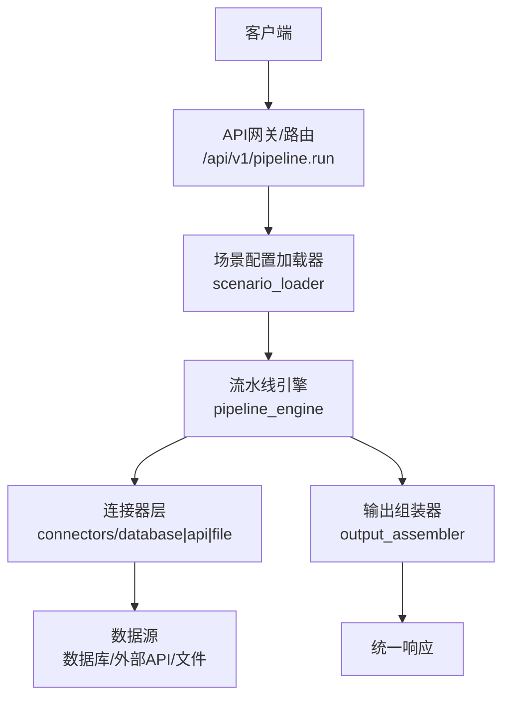
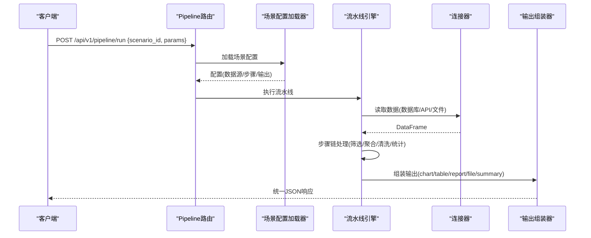
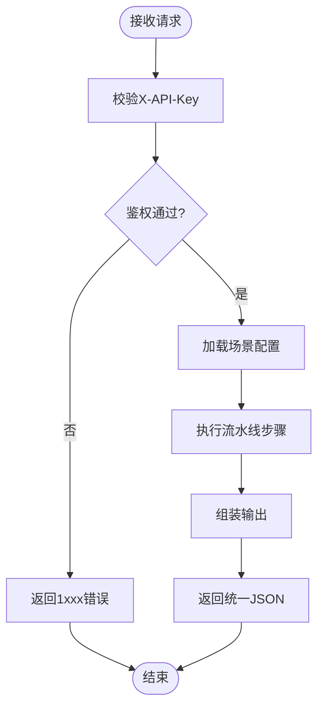
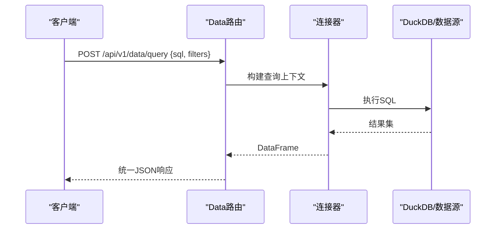
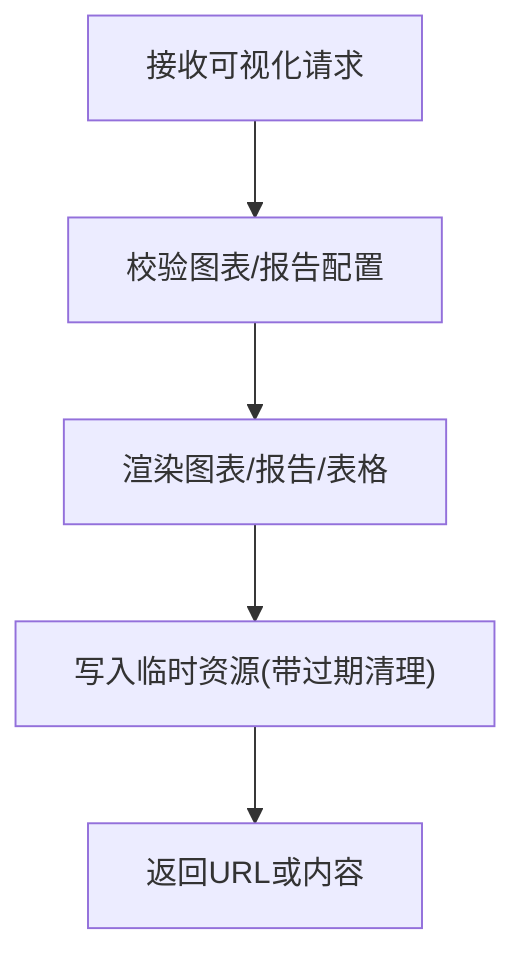
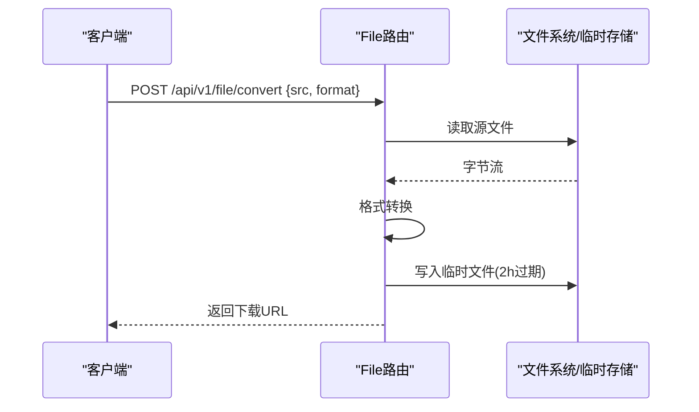
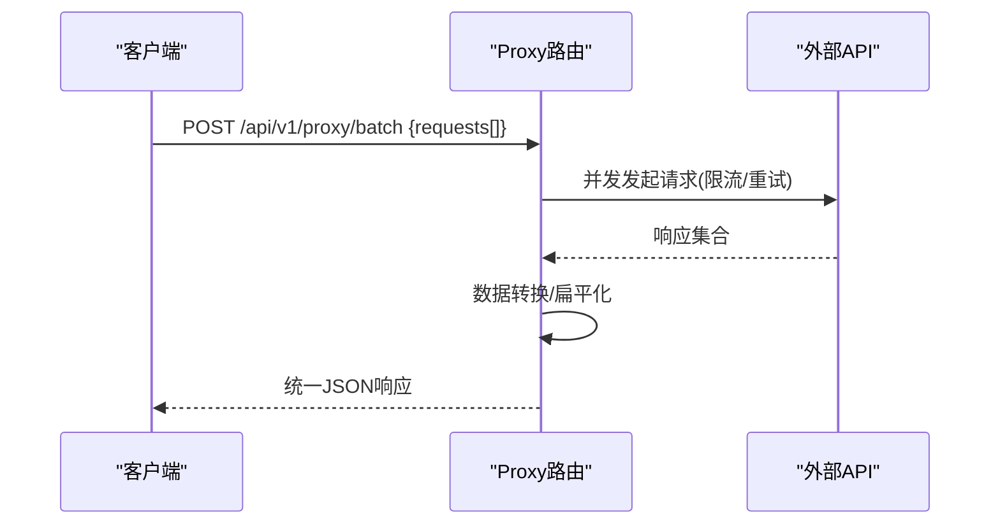
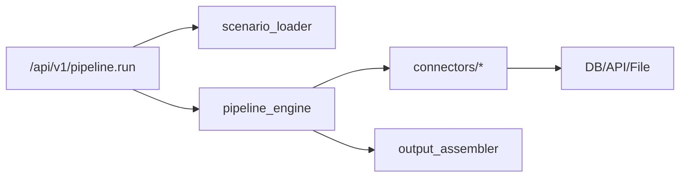

# API接口文档

<cite>
**本文引用的文件**
- [hiagent_辅助_Web_服务需求说明_task-242.md](file://docs\hiagent_辅助_Web_服务需求说明_task-242.md)
</cite>

## 目录
1. [简介](#简介)
2. [项目结构](#项目结构)
3. [核心组件](#核心组件)
4. [架构总览](#架构总览)
5. [详细组件分析](#详细组件分析)
6. [依赖关系分析](#依赖关系分析)
7. [性能考虑](#性能考虑)
8. [故障排查指南](#故障排查指南)
9. [结论](#结论)
10. [附录](#附录)

## 简介
本文件为 hiagent 辅助 Web 服务的完整API接口文档，面向Agent与外部系统对接。文档覆盖统一响应格式、认证方式、版本管理、速率限制与安全策略，并重点文档化以下两类能力：
- Pipeline入口API：POST /api/v1/pipeline/run（场景驱动的一次性全流程执行）
- 原子API：/api/v1/data/*、/api/v1/visual/*、/api/v1/file/*、/api/v1/proxy/*（可组合编排的细粒度能力）

所有接口遵循统一的JSON响应结构与错误码规范，便于上层Agent稳定集成与排障。

## 项目结构
根据需求说明，项目采用“场景配置 + 流水线引擎 + 连接器 + 输出组装器”的分层设计，关键新增目录与职责如下：
- app/core/pipeline_engine.py：流水线引擎，负责步骤顺序执行、上下文传递、条件分支与步骤级错误处理
- app/core/scenario_loader.py：场景配置加载器，从YAML加载数据源、流水线步骤与输出定义
- app/core/connectors/：数据连接器（database/api/file等），统一返回DataFrame
- app/core/output_assembler.py：输出组装器，生成chart/table/report/file/summary
- app/scenarios/*.yaml：场景配置文件，描述数据源、处理步骤与输出
- app/api/v1/pipeline.py：Pipeline路由，暴露POST /api/v1/pipeline/run

图表来源
- [hiagent_辅助_Web_服务需求说明_task-242.md:33-68](file://docs\hiagent_辅助_Web_服务需求说明_task-242.md#L33-L68)

章节来源
- [hiagent_辅助_Web_服务需求说明_task-242.md:106-115](file://docs\hiagent_辅助_Web_服务需求说明_task-242.md#L106-L115)

## 核心组件
- 统一响应格式：code/message/data/request_id
- 错误码分段：1xxx通用、2xxx数据处理、3xxx可视化、4xxx文件文档、5xxx API编排、6xxx Pipeline引擎
- 认证：X-API-Key请求头
- 两种调用模式：
  - Pipeline API：传入scenario_id与参数，一次完成全流程
  - 原子API：逐步调用，由Agent自行编排

章节来源
- [hiagent_辅助_Web_服务需求说明_task-242.md:25-31](file://docs\hiagent_辅助_Web_服务需求说明_task-242.md#L25-L31)
- [hiagent_辅助_Web_服务需求说明_task-242.md:65-68](file://docs\hiagent_辅助_Web_服务需求说明_task-242.md#L65-L68)

## 架构总览
下图展示从请求到响应的端到端流程，包括场景配置加载、连接器获取数据、流水线步骤处理与输出组装。

图表来源
- [hiagent_辅助_Web_服务需求说明_task-242.md:33-68](file://docs\hiagent_辅助_Web_服务需求说明_task-242.md#L33-L68)

## 详细组件分析

### Pipeline入口API：POST /api/v1/pipeline/run
- 功能：基于scenario_id与入参，一次性完成数据获取、处理与输出组装
- 认证：请求头 X-API-Key
- 请求体字段（示例）：
  - scenario_id：string，必填，场景标识
  - params：object，可选，场景参数映射（如时间范围、指标维度等）
- 响应体字段（统一格式）：
  - code：int，错误码
  - message：string，消息
  - data：object，业务数据（可能包含图表URL、表格数据、报告链接或摘要）
  - request_id：string，请求追踪ID
- 错误码参考：
  - 1xxx：通用错误（如参数缺失、鉴权失败）
  - 6xxx：Pipeline引擎错误（如步骤执行失败、配置解析异常）
- 典型使用场景：
  - 竞品分析：传入scenario_id与对比维度，返回排名图表与报告
  - 机构行为分析：传入机构ID与时间窗口，返回资金流向与画像摘要
  - 产品规模增量分析：传入产品ID与区间，返回趋势图与归因表

图表来源
- [hiagent_辅助_Web_服务需求说明_task-242.md:25-31](file://docs\hiagent_辅助_Web_服务需求说明_task-242.md#L25-L31)
- [hiagent_辅助_Web_服务需求说明_task-242.md:33-68](file://docs\hiagent_辅助_Web_服务需求说明_task-242.md#L33-L68)

章节来源
- [hiagent_辅助_Web_服务需求说明_task-242.md:25-31](file://docs\hiagent_辅助_Web_服务需求说明_task-242.md#L25-L31)
- [hiagent_辅助_Web_服务需求说明_task-242.md:65-68](file://docs\hiagent_辅助_Web_服务需求说明_task-242.md#L65-L68)

### 原子API：/api/v1/data/*
- 能力范围：
  - 数据导入解析：CSV/Excel/JSON，自动编码检测、类型推断
  - SQL查询：DuckDB；筛选、聚合、透视、排序、去重
  - 数据清洗：空值处理、类型转换、文本清洗、异常值处理
  - 统计分析：描述性统计、相关性、频率分布
- 典型端点（命名约定）：
  - POST /api/v1/data/import：导入文件并解析
  - POST /api/v1/data/query：执行SQL或结构化查询
  - POST /api/v1/data/clean：数据清洗
  - POST /api/v1/data/analyze：统计分析
- 认证：X-API-Key
- 请求体：按具体操作定义（如query需包含sql或查询条件）
- 响应体：统一JSON，data中包含DataFrame序列化结果或统计指标
- 错误码：2xxx（数据处理相关）

图表来源
- [hiagent_辅助_Web_服务需求说明_task-242.md:73-78](file://docs\hiagent_辅助_Web_服务需求说明_task-242.md#L73-L78)

章节来源
- [hiagent_辅助_Web_服务需求说明_task-242.md:73-78](file://docs\hiagent_辅助_Web_服务需求说明_task-242.md#L73-L78)

### 原子API：/api/v1/visual/*
- 能力范围：
  - 图表生成：柱状图/折线图/饼图/散点图/热力图/雷达图等，支持PNG/SVG/HTML
  - 报告渲染：Jinja2 HTML模板、Markdown转HTML
  - 数据表格渲染：条件着色、排序
- 典型端点（命名约定）：
  - POST /api/v1/visual/chart：生成图表并返回URL或二进制
  - POST /api/v1/visual/report：渲染报告
  - POST /api/v1/visual/table：渲染表格
- 认证：X-API-Key
- 请求体：图表配置（类型、数据引用、样式）、报告模板与变量、表格列与规则
- 响应体：统一JSON，data中可能包含资源URL或HTML内容
- 错误码：3xxx（可视化相关）

图表来源
- [hiagent_辅助_Web_服务需求说明_task-242.md:79-83](file://docs\hiagent_辅助_Web_服务需求说明_task-242.md#L79-L83)

章节来源
- [hiagent_辅助_Web_服务需求说明_task-242.md:79-83](file://docs\hiagent_辅助_Web_服务需求说明_task-242.md#L79-L83)

### 原子API：/api/v1/file/*
- 能力范围：
  - 格式转换：CSV/Excel/JSON/Markdown/HTML互转
  - 文档生成：PDF/Word/Excel/PPT，支持模板
  - 文件打包解压、元信息查询
  - 临时文件管理：2小时自动清理、流式下载
- 典型端点（命名约定）：
  - POST /api/v1/file/convert：格式转换
  - POST /api/v1/file/generate：文档生成
  - POST /api/v1/file/archive：打包/解压
  - GET /api/v1/file/{id}/download：流式下载
- 认证：X-API-Key
- 请求体：源文件、目标格式、模板ID等
- 响应体：统一JSON，data中包含文件URL或二进制
- 错误码：4xxx（文件文档相关）

图表来源
- [hiagent_辅助_Web_服务需求说明_task-242.md:84-89](file://docs\hiagent_辅助_Web_服务需求说明_task-242.md#L84-L89)

章节来源
- [hiagent_辅助_Web_服务需求说明_task-242.md:84-89](file://docs\hiagent_辅助_Web_服务需求说明_task-242.md#L84-L89)

### 原子API：/api/v1/proxy/*
- 能力范围：
  - HTTP代理：单次/批量并发/链式请求
  - 数据转换：jq风格、XML-JSON、扁平化
  - 超时重试、速率限制、鉴权模板
- 典型端点（命名约定）：
  - POST /api/v1/proxy/single：单次HTTP请求
  - POST /api/v1/proxy/batch：批量并发请求
  - POST /api/v1/proxy/chain：链式请求
  - POST /api/v1/proxy/transform：数据转换
- 认证：X-API-Key
- 请求体：目标URL、方法、头部、体、转换规则、重试策略
- 响应体：统一JSON，data中包含响应体或转换结果
- 错误码：5xxx（API编排相关）

图表来源
- [hiagent_辅助_Web_服务需求说明_task-242.md:90-94](file://docs\hiagent_辅助_Web_服务需求说明_task-242.md#L90-L94)

章节来源
- [hiagent_辅助_Web_服务需求说明_task-242.md:90-94](file://docs\hiagent_辅助_Web_服务需求说明_task-242.md#L90-L94)

## 依赖关系分析
- 模块耦合：
  - Pipeline路由依赖场景配置加载器与流水线引擎
  - 流水线引擎依赖连接器层与输出组装器
  - 连接器层依赖外部数据源（数据库、REST API、文件）
- 外部依赖：
  - FastAPI、pandas/numpy、DuckDB、matplotlib/plotly、WeasyPrint、httpx、Pydantic、PyYAML、SQLAlchemy
- 潜在循环依赖：无（分层清晰，单向依赖）

图表来源
- [hiagent_辅助_Web_服务需求说明_task-242.md:106-115](file://docs\hiagent_辅助_Web_服务需求说明_task-242.md#L106-L115)

章节来源
- [hiagent_辅助_Web_服务需求说明_task-242.md:106-115](file://docs\hiagent_辅助_Web_服务需求说明_task-242.md#L106-L115)

## 性能考虑
- 简单接口 < 500ms，数据处理 < 3s，Pipeline全流程 < 10s
- 建议：
  - 使用连接池与缓存减少重复IO
  - 对大数据集进行分页与流式处理
  - 合理设置超时与重试次数，避免雪崩
  - 使用DuckDB提升查询性能
  - 图表与报告异步生成，返回任务ID供轮询

[本节为通用指导，不直接分析具体文件]

## 故障排查指南
- 常见问题定位：
  - 鉴权失败：检查X-API-Key是否正确配置
  - 场景配置错误：确认scenario_id存在且YAML语法正确
  - 数据源连接失败：检查环境变量凭据与网络连通性
  - 步骤执行失败：查看步骤日志与耗时，定位具体步骤
- 可观测性：
  - 结构化日志包含scenario_id与步骤耗时
  - 提供/health健康检查与/api/v1/pipeline/scenarios场景列表接口

章节来源
- [hiagent_辅助_Web_服务需求说明_task-242.md:97-102](file://docs\hiagent_辅助_Web_服务需求说明_task-242.md#L97-L102)

## 结论
本API文档基于需求说明梳理了hiagent辅助Web服务的统一接口规范、Pipeline入口与原子API的能力边界、错误码体系与安全策略。通过场景配置驱动的流水线与可复用的连接器，既能满足Agent一键式分析需求，又保留细粒度编排灵活性。建议在集成时严格遵循统一响应格式与认证要求，并结合健康检查与结构化日志进行监控与排障。

[本节为总结性内容，不直接分析具体文件]

## 附录

### 统一响应格式
- 字段：
  - code：int，错误码
  - message：string，消息
  - data：object，业务数据
  - request_id：string，请求追踪ID
- 错误码分段：
  - 1xxx：通用
  - 2xxx：数据处理
  - 3xxx：可视化
  - 4xxx：文件文档
  - 5xxx：API编排
  - 6xxx：Pipeline引擎

章节来源
- [hiagent_辅助_Web_服务需求说明_task-242.md:25-31](file://docs\hiagent_辅助_Web_服务需求说明_task-242.md#L25-L31)

### 认证与版本管理
- 认证：X-API-Key请求头
- 版本：/api/v1/*，后续扩展在路径中体现
- 速率限制：在proxy与高负载场景启用限流与退避策略

章节来源
- [hiagent_辅助_Web_服务需求说明_task-242.md:25-31](file://docs\hiagent_辅助_Web_服务需求说明_task-242.md#L25-L31)
- [hiagent_辅助_Web_服务需求说明_task-242.md:90-94](file://docs\hiagent_辅助_Web_服务需求说明_task-242.md#L90-L94)

### 客户端集成指南与最佳实践
- 集成步骤：
  - 配置X-API-Key
  - 选择调用模式：Pipeline一次性执行或原子API组合
  - 处理统一响应，依据code判断成功与否
  - 记录request_id用于问题追踪
- 最佳实践：
  - 对大文件与复杂计算使用异步与重试
  - 对图表与报告使用URL回调或轮询
  - 结合健康检查与场景列表接口做可用性探测

[本节为通用指导，不直接分析具体文件]