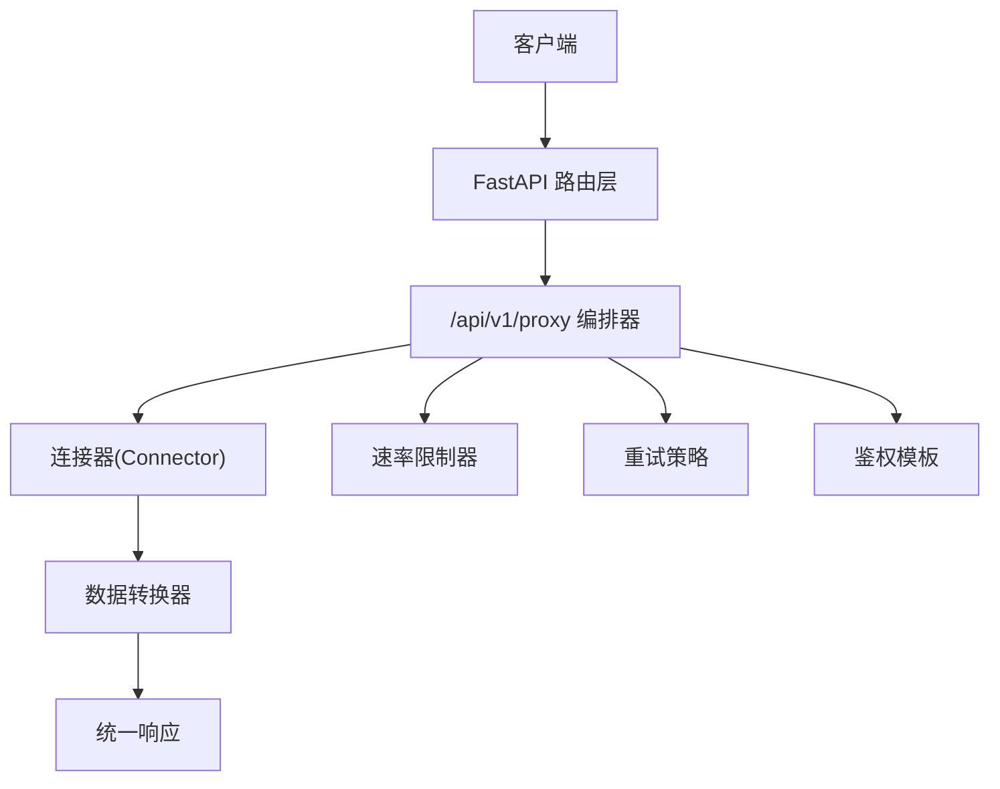
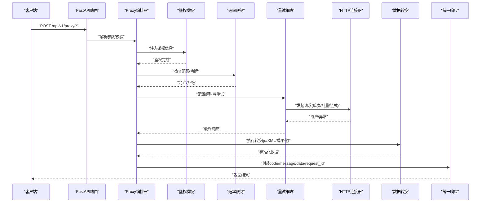
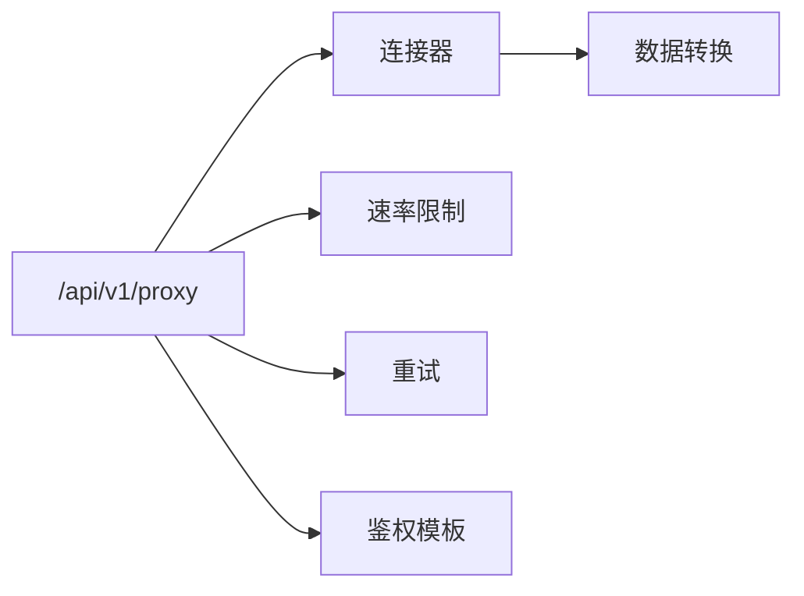

# API编排接口

<cite>
**本文引用的文件**
- [需求说明文档](file://docs/20260821100000_hiagent辅助Web服务_需求说明.md)
</cite>

## 目录
1. [简介](#简介)
2. [项目结构](#项目结构)
3. [核心组件](#核心组件)
4. [架构总览](#架构总览)
5. [详细组件分析](#详细组件分析)
6. [依赖关系分析](#依赖关系分析)
7. [性能考量](#性能考量)
8. [故障排查指南](#故障排查指南)
9. [结论](#结论)
10. [附录：端点清单与请求示例](#附录端点清单与请求示例)

## 简介
本章节面向API编排模块，聚焦于 /api/v1/proxy/* 下的HTTP代理能力，包括单次、批量并发、链式请求；数据转换（jq风格、XML转JSON、扁平化）；超时重试、速率限制与鉴权模板。该模块作为统一的数据获取与编排层，为上层场景提供稳定、可观测、可扩展的外部系统接入能力。

## 项目结构
根据需求说明，API编排位于 /api/v1/proxy，与数据处理、可视化、文件等模块并列，共同构成统一的FastAPI服务。整体采用无状态、单一职责、输入输出标准化、容错优先的设计原则，并通过统一JSON响应格式和API Key认证保障一致性与安全性。

图表来源
- [需求说明文档:33-67](file://docs/20260821100000_hiagent辅助Web服务_需求说明.md#L33-L67)
- [需求说明文档:90-93](file://docs/20260821100000_hiagent辅助Web服务_需求说明.md#L90-L93)

章节来源
- [需求说明文档:25-31](file://docs/20260821100000_hiagent辅助Web服务_需求说明.md#L25-L31)
- [需求说明文档:90-93](file://docs/20260821100000_hiagent辅助Web服务_需求说明.md#L90-L93)

## 核心组件
- HTTP代理：支持单次请求、批量并发请求、链式请求三种模式，用于调用外部REST API。
- 数据转换：提供jq风格查询、XML到JSON转换、扁平化能力，实现多源数据标准化。
- 超时重试：对上游调用进行超时控制与可配置的重试策略，提升鲁棒性。
- 速率限制：基于令牌桶或滑动窗口的限流机制，保护上游与自身资源。
- 鉴权模板：集中管理认证头、签名、Token刷新等逻辑，避免硬编码凭据。

章节来源
- [需求说明文档:90-93](file://docs/20260821100000_hiagent辅助Web服务_需求说明.md#L90-L93)

## 架构总览
API编排模块通过统一入口接收请求，按模式路由至对应处理器，依次经过鉴权、限流、重试、连接与转换，最终返回标准化结果。所有步骤具备独立日志与耗时记录，便于问题定位与性能优化。

图表来源
- [需求说明文档:25-31](file://docs/20260821100000_hiagent辅助Web服务_需求说明.md#L25-L31)
- [需求说明文档:90-93](file://docs/20260821100000_hiagent辅助Web服务_需求说明.md#L90-L93)

## 详细组件分析

### HTTP代理：单次/批量并发/链式请求
- 单次请求：适用于简单透传或轻量转换场景，低延迟、低开销。
- 批量并发：支持多目标并行调用，内置并发度控制与熔断降级，避免雪崩。
- 链式请求：将多个上游调用串联，前一步输出可作为下一步输入，适合复杂编排。

关键要点
- 并发控制：最大并发数、队列长度、背压策略。
- 错误处理：部分失败时可选择继续或中止，聚合错误上下文。
- 可观测性：每步耗时、成功率、错误码分布。

章节来源
- [需求说明文档:90-93](file://docs/20260821100000_hiagent辅助Web服务_需求说明.md#L90-L93)

### 数据转换：jq风格、XML-JSON、扁平化
- jq风格：使用表达式对JSON进行筛选、映射、聚合，减少后端计算压力。
- XML-JSON：将XML响应转换为结构化JSON，便于后续处理。
- 扁平化：将嵌套结构展平为一维键值，利于表格化展示与存储。

注意事项
- 类型安全：转换前后字段类型校验，缺失字段默认值或报错策略。
- 性能：大对象转换需考虑内存占用与分块处理。
- 可配置：转换规则以声明式方式定义，便于版本管理与复用。

章节来源
- [需求说明文档:90-93](file://docs/20260821100000_hiagent辅助Web服务_需求说明.md#L90-L93)

### 超时重试
- 超时：针对网络、上游处理慢等场景设置合理超时阈值。
- 重试：指数退避、抖动、最大重试次数、重试条件（如特定HTTP状态码）。
- 幂等性：确保GET等幂等方法可安全重试，非幂等方法需谨慎。

章节来源
- [需求说明文档:90-93](file://docs/20260821100000_hiagent辅助Web服务_需求说明.md#L90-L93)

### 速率限制
- 算法：令牌桶或滑动窗口，支持全局与租户级限流。
- 策略：突发流量削峰、排队等待、快速失败。
- 监控：QPS、拒绝率、平均延迟。

章节来源
- [需求说明文档:90-93](file://docs/20260821100000_hiagent辅助Web服务_需求说明.md#L90-L93)

### 鉴权模板
- 模板化：支持Header注入、签名生成、Token刷新、证书管理等。
- 隔离：不同场景/租户使用不同鉴权模板，避免交叉污染。
- 安全：敏感信息从环境变量读取，不落盘、不打印。

章节来源
- [需求说明文档:90-93](file://docs/20260821100000_hiagent辅助Web服务_需求说明.md#L90-L93)

## 依赖关系分析
- 外部依赖：httpx用于HTTP通信，PyYAML用于配置加载，jsonpath-ng用于JSON路径查询。
- 内部依赖：连接器层、流水线引擎、输出组装器。
- 耦合与内聚：各组件通过明确接口交互，降低耦合；同一职责内聚，便于测试与维护。

图表来源
- [需求说明文档:90-93](file://docs/20260821100000_hiagent辅助Web服务_需求说明.md#L90-L93)

章节来源
- [需求说明文档:90-93](file://docs/20260821100000_hiagent辅助Web服务_需求说明.md#L90-L93)

## 性能考量
- 简单接口 < 500ms，数据处理 < 3s，Pipeline 全流程 < 10s。
- 建议：
  - 合理设置并发度与超时，避免资源耗尽。
  - 使用连接池与缓存减少重复请求。
  - 对热点数据进行本地缓存或CDN加速。
  - 监控关键指标：延迟、吞吐、错误率、CPU/内存使用。

章节来源
- [需求说明文档:97-102](file://docs/20260821100000_hiagent辅助Web服务_需求说明.md#L97-L102)

## 故障排查指南
- 常见问题：
  - 上游超时：检查超时配置与上游负载。
  - 限流触发：查看QPS与配额，调整限流策略。
  - 鉴权失败：确认模板配置与环境变量。
  - 转换错误：验证jq表达式与XML结构。
- 诊断手段：
  - 查看结构化日志（含scenario_id、步骤耗时）。
  - 启用调试模式，捕获请求/响应体（脱敏后）。
  - 使用健康检查与健康探针。

章节来源
- [需求说明文档:97-102](file://docs/20260821100000_hiagent辅助Web服务_需求说明.md#L97-L102)

## 结论
API编排模块通过HTTP代理、数据转换、超时重试、速率限制与鉴权模板，提供了强大而灵活的外部系统集成能力。结合统一响应格式与安全策略，可在保证稳定性的同时支撑复杂的多源数据聚合与编排场景。

## 附录：端点清单与请求示例

### 端点概览
- POST /api/v1/proxy/single
  - 功能：单次HTTP请求代理
  - 用途：简单透传或轻量转换
- POST /api/v1/proxy/batch
  - 功能：批量并发请求代理
  - 用途：多目标并行调用，支持并发度控制
- POST /api/v1/proxy/chain
  - 功能：链式请求代理
  - 用途：串联多个上游调用，前一步输出作为下一步输入
- POST /api/v1/proxy/transform
  - 功能：数据转换
  - 用途：jq风格查询、XML转JSON、扁平化

注意：以上端点为概念性设计，具体实现以实际代码为准。

### 请求与响应规范
- 认证：通过X-API-Key Header传递API Key。
- 响应格式：统一JSON，包含code、message、data、request_id。
- 错误码：5xxx段用于API编排相关错误。

章节来源
- [需求说明文档:25-31](file://docs/20260821100000_hiagent辅助Web服务_需求说明.md#L25-L31)
- [需求说明文档:90-93](file://docs/20260821100000_hiagent辅助Web服务_需求说明.md#L90-L93)

### 典型编排场景示例

#### 多源数据聚合
- 步骤：
  - 并发调用多个上游API获取原始数据。
  - 使用jq表达式筛选与映射字段。
  - 合并结果并去重，输出标准化表。
- 关键点：
  - 并发度与超时配置。
  - 部分失败时的容错策略。
  - 转换规则的可配置与版本管理。

#### API调用链编排
- 步骤：
  - 第一步获取基础信息。
  - 第二步基于第一步结果获取详情。
  - 第三步进行数据整合与格式化。
- 关键点：
  - 链式依赖的健壮性。
  - 中间结果的缓存与失效策略。
  - 错误传播与回滚。

#### 数据格式标准化
- 步骤：
  - 接收多种格式（JSON/XML/CSV）。
  - 转换为统一JSON结构。
  - 扁平化以便下游消费。
- 关键点：
  - 类型推断与校验。
  - 缺失字段默认值。
  - 大对象处理的内存优化。

### 安全考虑
- 鉴权传递：在鉴权模板中集中管理认证头与签名，避免泄露。
- 敏感信息保护：凭据从环境变量读取，不落盘、不打印。
- 请求限流：防止滥用与DDoS攻击。
- 监控日志：结构化日志记录关键操作，便于审计与排障。

章节来源
- [需求说明文档:25-31](file://docs/20260821100000_hiagent辅助Web服务_需求说明.md#L25-L31)
- [需求说明文档:90-93](file://docs/20260821100000_hiagent辅助Web服务_需求说明.md#L90-L93)

### 与外部系统集成最佳实践
- 使用连接器抽象，屏蔽上游差异。
- 配置驱动：通过YAML描述数据源与处理流程。
- 灰度发布：对新上游逐步放量，观察指标。
- 熔断降级：当上游不稳定时快速失败或返回缓存。

章节来源
- [需求说明文档:90-93](file://docs/20260821100000_hiagent辅助Web服务_需求说明.md#L90-L93)

### 性能优化建议
- 连接池与复用：减少握手开销。
- 缓存热点数据：降低重复请求。
- 异步处理：对耗时任务采用异步或队列。
- 监控告警：设置延迟、错误率阈值，及时预警。

章节来源
- [需求说明文档:97-102](file://docs/20260821100000_hiagent辅助Web服务_需求说明.md#L97-L102)