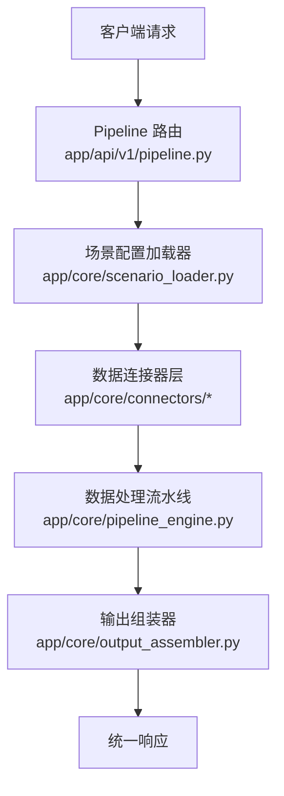
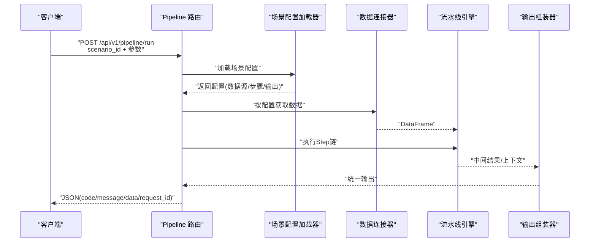
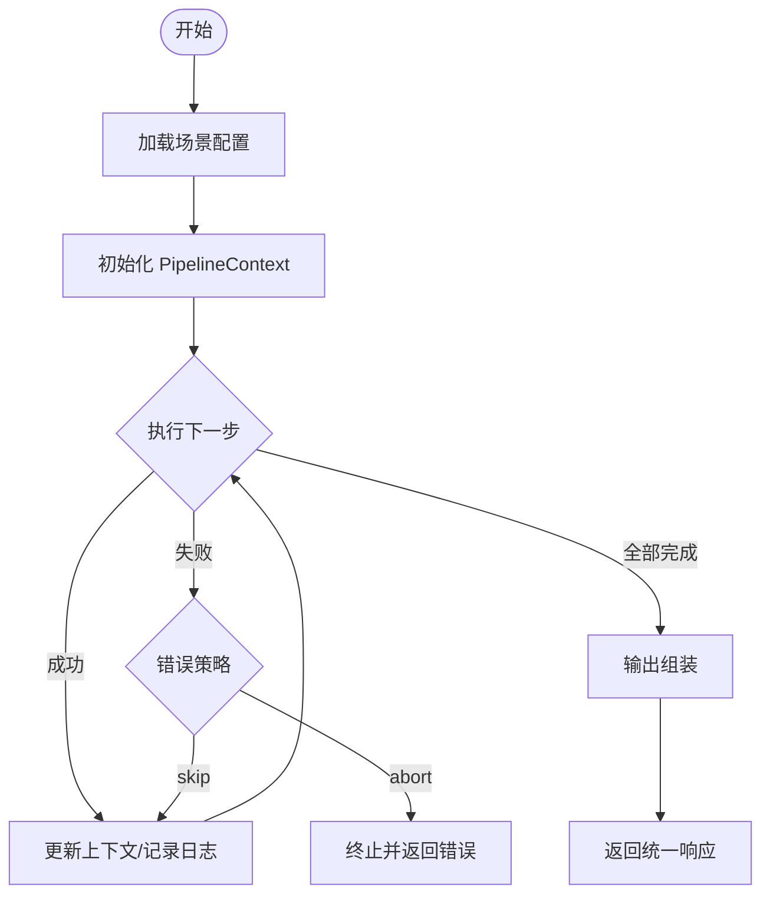
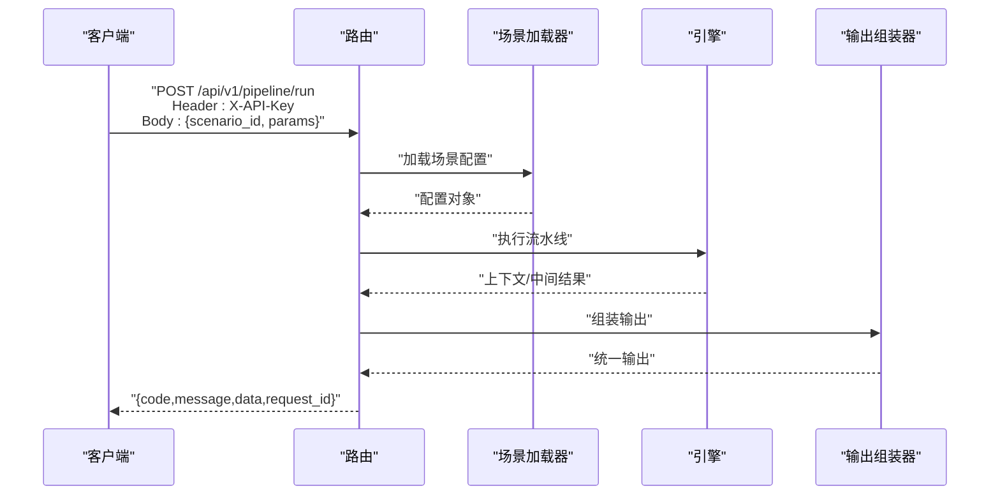
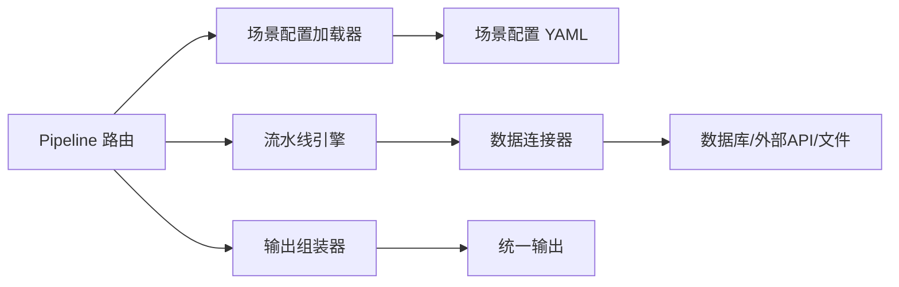

# Pipeline接口

<cite>
**本文引用的文件**
- [需求说明文档](file://docs/hiagent_辅助_Web_服务需求说明_task-242.md)
</cite>

## 目录
1. [简介](#简介)
2. [项目结构](#项目结构)
3. [核心组件](#核心组件)
4. [架构总览](#架构总览)
5. [详细组件分析](#详细组件分析)
6. [依赖关系分析](#依赖关系分析)
7. [性能与可观测性](#性能与可观测性)
8. [故障排查指南](#故障排查指南)
9. [结论](#结论)
10. [附录：API 参考与示例](#附录api-参考与示例)

## 简介
本文件面向使用 hiagent 辅助 Web 服务的开发者，聚焦于 Pipeline 接口的 API 文档与实现要点。重点覆盖以下方面：
- POST /api/v1/pipeline/run 端点的参数、请求映射、响应格式与错误处理
- Pipeline 模式的工作流程：从场景配置加载到数据获取、处理流水线执行、输出组装的完整链路
- 三种业务场景（竞品分析、机构行为分析、产品规模增量分析）的使用方法
- Pipeline 引擎的配置选项、步骤执行逻辑、条件分支与错误处理策略
- 认证方式（X-API-Key Header）、速率限制与性能优化建议

该文档基于仓库中的需求说明文档进行整理与扩展，确保内容与实际设计一致，便于快速上手与排障。

## 项目结构
根据需求说明，Pipeline 相关的关键新增目录与文件如下：
- app/core/pipeline_engine.py — 流水线引擎
- app/core/scenario_loader.py — 场景配置加载器
- app/core/connectors/ — 数据连接器（base/database/api/file）
- app/core/output_assembler.py — 输出组装器
- app/scenarios/*.yaml — 场景配置文件目录
- app/api/v1/pipeline.py — Pipeline 路由

这些模块共同构成“场景驱动”的流水线能力：通过 YAML 配置描述数据源、处理步骤与输出，由引擎顺序执行并产出统一结果。

**图示来源**
- [需求说明文档:35-67](file://docs/hiagent_辅助_Web_服务需求说明_task-242.md#L35-L67)
- [需求说明文档:109-114](file://docs/hiagent_辅助_Web_服务需求说明_task-242.md#L109-L114)

**章节来源**
- [需求说明文档:106-114](file://docs/hiagent_辅助_Web_服务需求说明_task-242.md#L106-L114)

## 核心组件
- 场景配置加载器：负责读取 YAML 场景配置，解析 data_sources、pipeline、outputs 等元信息
- 数据连接器：封装数据库、REST API、文件上传/下载等数据获取能力，统一返回 DataFrame
- 流水线引擎：按顺序执行 Step 链，通过命名引用在步骤间传递中间数据（PipelineContext），支持条件分支与步骤级错误处理（skip/abort）
- 输出组装器：将最终数据组装为 chart/table/report/file/summary 等类型，其中 summary 专为 Agent 消费设计
- Pipeline 路由：暴露 POST /api/v1/pipeline/run，接收 scenario_id 与参数，协调上述组件完成全流程

**章节来源**
- [需求说明文档:40-67](file://docs/hiagent_辅助_Web_服务需求说明_task-242.md#L40-L67)
- [需求说明文档:109-114](file://docs/hiagent_辅助_Web_服务需求说明_task-242.md#L109-L114)

## 架构总览
整体调用链路遵循“无状态、单一职责、输入输出标准化、容错优先、安全隔离、场景可配置、组件可复用”的原则。Agent 或外部系统通过 Pipeline API 传入 scenario_id 与参数，系统加载对应场景配置，依次执行数据获取与处理步骤，最后输出统一格式的响应。

**图示来源**
- [需求说明文档:35-67](file://docs/hiagent_辅助_Web_服务需求说明_task-242.md#L35-L67)

## 详细组件分析

### 场景配置模型（YAML）
- data_sources：定义 connector 类型（database/api/file_upload/file_url/file_s3）、连接配置、SQL/API 参数以及请求参数映射
- pipeline：处理流水线步骤，每个 step 调用原子能力，并通过 input/output 命名引用传递数据
- outputs：定义输出类型（chart/table/report/file/summary）及数据来源引用

该模型使不同业务场景以声明式方式编排，降低硬编码复杂度，提升可维护性与可复用性。

**章节来源**
- [需求说明文档:40-44](file://docs/hiagent_辅助_Web_服务需求说明_task-242.md#L40-L44)

### 数据连接器（Connector Layer）
- 支持的连接器类型：database、api、file_upload、file_url、file_s3
- 所有连接器返回统一的 DataFrame，凭据从环境变量读取，采用注册表模式扩展
- 适用于多源数据接入，屏蔽底层差异，便于后续替换与升级

**章节来源**
- [需求说明文档:46-55](file://docs/hiagent_辅助_Web_服务需求说明_task-242.md#L46-L55)

### 流水线引擎（Pipeline Engine）
- 步骤顺序执行，通过命名引用在步骤间传递中间数据（PipelineContext）
- 支持条件分支与步骤级错误处理（skip/abort）
- 每步独立记录日志和耗时，便于定位瓶颈与问题

**图示来源**
- [需求说明文档:57-61](file://docs/hiagent_辅助_Web_服务需求说明_task-242.md#L57-L61)

**章节来源**
- [需求说明文档:57-61](file://docs/hiagent_辅助_Web_服务需求说明_task-242.md#L57-L61)

### 输出组装器（Output Assembler）
- 支持五种输出类型：chart、table、report、file、summary
- summary 专为 Agent 消费设计，便于上层自动化处理
- 将中间结果与模板结合，生成结构化输出

**章节来源**
- [需求说明文档:62-64](file://docs/hiagent_辅助_Web_服务需求说明_task-242.md#L62-L64)

### Pipeline 路由（POST /api/v1/pipeline/run）
- 入口：POST /api/v1/pipeline/run
- 入参：scenario_id + 业务参数（用于数据源参数映射）
- 流程：加载场景配置 -> 数据获取 -> 执行流水线 -> 输出组装 -> 统一响应
- 认证：X-API-Key Header
- 响应：统一 JSON 格式（code/message/data/request_id）

**图示来源**
- [需求说明文档:66-67](file://docs/hiagent_辅助_Web_服务需求说明_task-242.md#L66-L67)
- [需求说明文档:25-30](file://docs/hiagent_辅助_Web_服务需求说明_task-242.md#L25-L30)

**章节来源**
- [需求说明文档:25-30](file://docs/hiagent_辅助_Web_服务需求说明_task-242.md#L25-L30)
- [需求说明文档:66-67](file://docs/hiagent_辅助_Web_服务需求说明_task-242.md#L66-L67)

## 依赖关系分析
- 路由依赖场景配置加载器与输出组装器
- 场景配置加载器依赖 YAML 配置与数据源定义
- 数据连接器依赖环境变量中的凭据与外部系统（数据库/REST API/文件存储）
- 流水线引擎依赖连接器与原子能力，管理步骤执行与错误策略
- 输出组装器依赖引擎产出的上下文与模板

**图示来源**
- [需求说明文档:109-114](file://docs/hiagent_辅助_Web_服务需求说明_task-242.md#L109-L114)
- [需求说明文档:46-55](file://docs/hiagent_辅助_Web_服务需求说明_task-242.md#L46-L55)

**章节来源**
- [需求说明文档:109-114](file://docs/hiagent_辅助_Web_服务需求说明_task-242.md#L109-L114)

## 性能与可观测性
- 性能目标：简单接口 < 500ms，数据处理 < 3s，Pipeline 全流程 < 10s
- 可观测性：结构化日志包含 scenario_id 与步骤耗时；提供 /health 与 /api/v1/pipeline/scenarios 列表接口
- 建议：
  - 合理拆分 Step，避免单步过长
  - 对 I/O 密集操作启用并发与重试
  - 使用缓存减少重复查询
  - 监控各阶段耗时，定位瓶颈

**章节来源**
- [需求说明文档:97-102](file://docs/hiagent_辅助_Web_服务需求说明_task-242.md#L97-L102)

## 故障排查指南
- 认证失败：检查 X-API-Key Header 是否正确设置
- 场景未找到：确认 scenario_id 是否存在且已加载
- 数据源错误：检查连接器配置与凭据，验证 SQL/API 参数映射
- 步骤失败：查看步骤日志与错误策略（skip/abort），必要时调整条件分支
- 超时与限流：关注外部系统响应时间与速率限制，适当调整重试与退避策略

**章节来源**
- [需求说明文档:25-30](file://docs/hiagent_辅助_Web_服务需求说明_task-242.md#L25-L30)
- [需求说明文档:57-61](file://docs/hiagent_辅助_Web_服务需求说明_task-242.md#L57-L61)

## 结论
Pipeline 接口通过“场景配置 + 连接器 + 引擎 + 输出组装”的解耦设计，实现了多业务场景的统一编排与高效执行。借助 YAML 配置与注册表模式，系统具备良好的可扩展性与可维护性。配合统一认证、错误码与可观测性，能够满足高可用与高性能的生产要求。

## 附录：API 参考与示例

### 端点：POST /api/v1/pipeline/run
- 路径：/api/v1/pipeline/run
- 方法：POST
- 认证：X-API-Key Header
- 请求体字段：
  - scenario_id：string，必填，标识要执行的场景
  - params：object，可选，用于数据源参数映射（如时间范围、筛选条件等）
- 响应体字段：
  - code：int，统一错误码（1xxx 通用、2xxx 数据处理、3xxx 可视化、4xxx 文件文档、5xxx API 编排、6xxx Pipeline 引擎）
  - message：string，人类可读的错误或提示信息
  - data：object，业务数据（可能为空）
  - request_id：string，请求追踪 ID

#### 请求示例
- 头部：
  - X-API-Key: your_api_key
- 主体：
  - scenario_id: "competitor_analysis"
  - params:
    - start_date: "2024-01-01"
    - end_date: "2024-03-31"
    - competitors: ["A公司","B公司","C公司"]

#### 响应示例
- 成功：
  - code: 0
  - message: "success"
  - data:
    - summary: "竞品对比报告摘要"
    - chart: "图表URL或二进制数据"
    - table: "表格数据"
  - request_id: "req_abc123"
- 失败：
  - code: 6001
  - message: "流水线步骤执行失败"
  - data: null
  - request_id: "req_def456"

### 业务场景使用方法
- 竞品分析：
  - 场景：对比多个竞品的规模、收益、费率等指标，输出对比报告和排名图表
  - 关键参数：时间范围、竞品列表
  - 输出：summary/chart/table
- 机构行为分析：
  - 场景：分析机构的申赎行为、持仓变化、资金流向，输出行为画像
  - 关键参数：机构ID、时间范围
  - 输出：summary/chart/table
- 产品规模增量分析：
  - 场景：追踪产品规模变动、增量归因、趋势预测，输出趋势图表和归因表
  - 关键参数：产品ID、时间范围
  - 输出：summary/chart/table

### Pipeline 引擎配置选项
- 步骤顺序执行：通过 YAML 中 pipeline 数组定义步骤顺序
- 命名引用：input/output 字段用于在步骤间传递数据
- 条件分支：在步骤中定义条件，控制是否执行某一步骤
- 错误处理：步骤级 skip/abort 策略，保证整体流程可控
- 日志与耗时：每步记录日志与耗时，便于诊断与优化

### 认证与速率限制
- 认证：X-API-Key Header，服务端校验后放行
- 速率限制：建议在网关或服务端对同一 Key 或 IP 实施限流，避免滥用
- 建议：结合请求 ID 与结构化日志，实现全链路追踪

### 性能优化建议
- 数据层：
  - 使用 DuckDB 进行高效查询
  - 对常用查询建立索引或物化视图
- 流水线层：
  - 拆分长步骤，提高并行度
  - 缓存中间结果，减少重复计算
- 输出层：
  - 按需生成图表与报告，避免不必要渲染
  - 使用分页与流式传输处理大数据集

**章节来源**
- [需求说明文档:25-30](file://docs/hiagent_辅助_Web_服务需求说明_task-242.md#L25-L30)
- [需求说明文档:40-67](file://docs/hiagent_辅助_Web_服务需求说明_task-242.md#L40-L67)
- [需求说明文档:97-102](file://docs/hiagent_辅助_Web_服务需求说明_task-242.md#L97-L102)
- [需求说明文档:109-114](file://docs/hiagent_辅助_Web_服务需求说明_task-242.md#L109-L114)