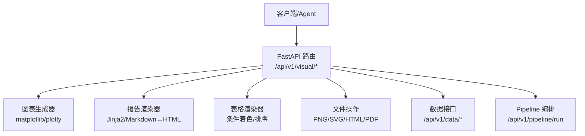
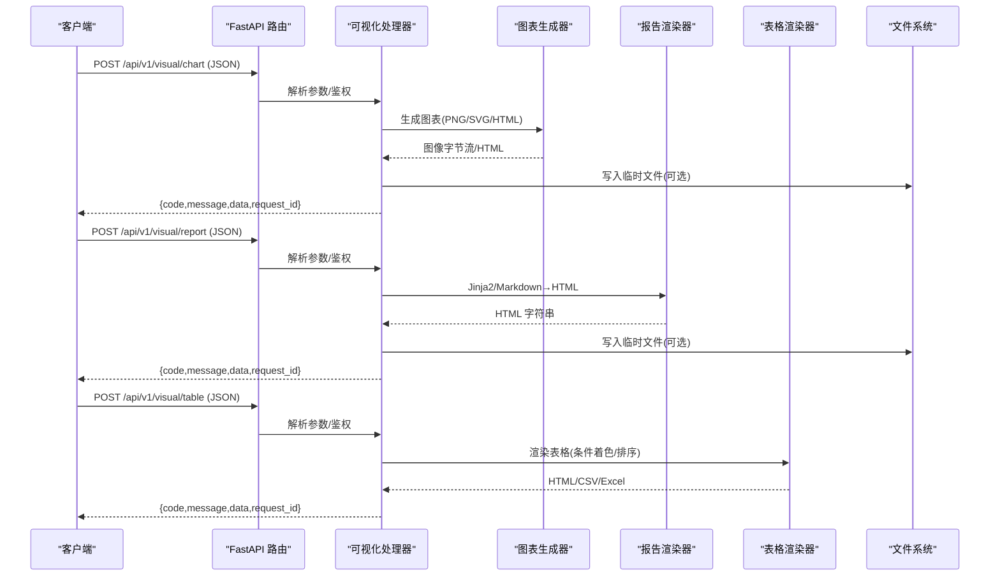
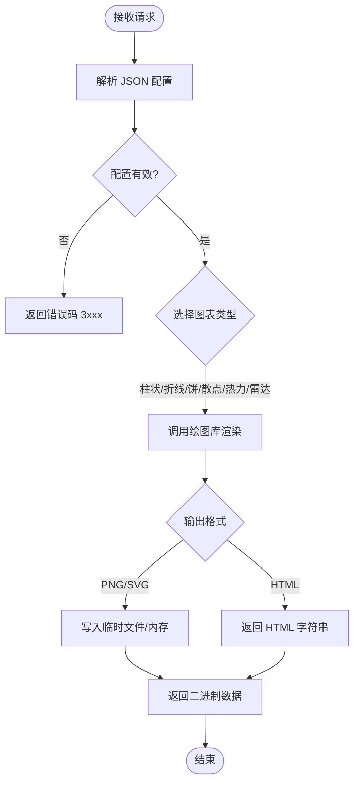
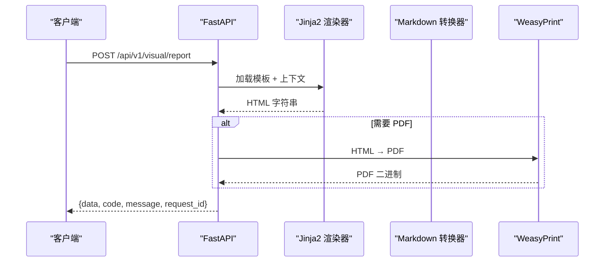
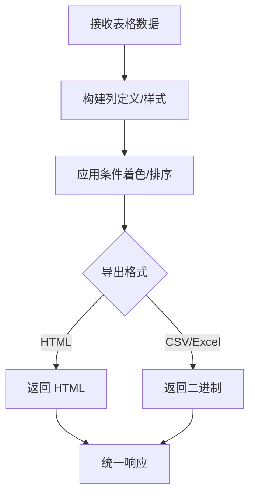
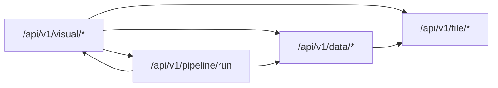

# 可视化接口

<cite>
**本文引用的文件**
- [hiagent_辅助_Web_服务需求说明_task-242.md](file://docs\hiagent_辅助_Web_服务需求说明_task-242.md)
</cite>

## 目录
1. [简介](#简介)
2. [项目结构](#项目结构)
3. [核心组件](#核心组件)
4. [架构总览](#架构总览)
5. [详细组件分析](#详细组件分析)
6. [依赖关系分析](#依赖关系分析)
7. [性能考虑](#性能考虑)
8. [故障排查指南](#故障排查指南)
9. [结论](#结论)
10. [附录](#附录)

## 简介
本章节面向“可视化与渲染模块”的 API 接口文档，聚焦 /api/v1/visual/* 下的能力边界、输入输出规范、图表类型、样式配置、输出格式以及模板渲染机制。该模块基于 FastAPI 提供原子化能力，配合统一 JSON 响应格式与 API Key 认证，支持在 Agent 编排中灵活调用。

- 技术栈：FastAPI + matplotlib/plotly + WeasyPrint（用于 PDF/HTML 报告）+ Pydantic（请求/响应校验）+ PyYAML（场景配置）
- 统一响应：code/message/data/request_id
- 认证方式：X-API-Key Header
- 错误码分段：1xxx 通用、2xxx 数据处理、3xxx 可视化、4xxx 文件文档、5xxx API 编排、6xxx Pipeline 引擎

**章节来源**
- [hiagent_辅助_Web_服务需求说明_task-242.md:25-30](file://docs\hiagent_辅助_Web_服务需求说明_task-242.md#L25-L30)
- [hiagent_辅助_Web_服务需求说明_task-242.md:19-22](file://docs\hiagent_辅助_Web_服务需求说明_task-242.md#L19-L22)

## 项目结构
当前仓库以需求说明为主，未包含具体实现代码。根据需求文档，可视化与渲染属于 /api/v1/visual/* 原子 API 的一部分，并与数据、文件、Pipeline 等模块协同工作。

**图示来源**
- [hiagent_辅助_Web_服务需求说明_task-242.md:65-68](file://docs\hiagent_辅助_Web_服务需求说明_task-242.md#L65-L68)
- [hiagent_辅助_Web_服务需求说明_task-242.md:79-82](file://docs\hiagent_辅助_Web_服务需求说明_task-242.md#L79-L82)

**章节来源**
- [hiagent_辅助_Web_服务需求说明_task-242.md:65-82](file://docs\hiagent_辅助_Web_服务需求说明_task-242.md#L65-L82)

## 核心组件
- 图表生成器：支持柱状图、折线图、饼图、散点图、热力图、雷达图等；输出 PNG/SVG/HTML
- 报告渲染器：Jinja2 HTML 模板渲染、Markdown 转 HTML
- 表格渲染器：数据表格渲染，支持条件着色、排序
- 文件操作：图表与报告的持久化与下载（PNG/SVG/HTML/PDF）
- 数据接口：为可视化提供数据源（CSV/Excel/JSON、DuckDB SQL、清洗/统计）
- Pipeline 编排：将多个原子 API 串联执行，返回统一结果

**章节来源**
- [hiagent_辅助_Web_服务需求说明_task-242.md:73-82](file://docs\hiagent_辅助_Web_服务需求说明_task-242.md#L73-L82)

## 架构总览
可视化模块通过 FastAPI 暴露原子 API，供上层 Agent 或 Pipeline 调用。请求经认证后进入对应处理器，调用图表/报告/表格渲染组件，最终返回二进制文件或 HTML 内容，并附带统一响应元信息。

**图示来源**
- [hiagent_辅助_Web_服务需求说明_task-242.md:25-30](file://docs\hiagent_辅助_Web_服务需求说明_task-242.md#L25-L30)
- [hiagent_辅助_Web_服务需求说明_task-242.md:79-82](file://docs\hiagent_辅助_Web_服务需求说明_task-242.md#L79-L82)

## 详细组件分析

### 图表生成 API（/api/v1/visual/chart）
- 功能：根据 JSON 配置生成多种图表，支持 PNG/SVG/HTML 输出
- 支持的图表类型：柱状图、折线图、饼图、散点图、热力图、雷达图
- 典型入参字段（概念性说明）：
  - chart_type：图表类型枚举
  - data：数据绑定（二维表/时间序列/多维指标）
  - style：主题、颜色、字体、尺寸、坐标轴、图例、提示框等
  - output_format：png/svg/html
  - options：交互配置（缩放、悬停、点击事件等）
- 出参：
  - data：二进制文件（PNG/SVG）或 HTML 字符串
  - code/message/request_id：统一响应元信息

**图示来源**
- [hiagent_辅助_Web_服务需求说明_task-242.md:79-82](file://docs\hiagent_辅助_Web_服务需求说明_task-242.md#L79-L82)

**章节来源**
- [hiagent_辅助_Web_服务需求说明_task-242.md:79-82](file://docs\hiagent_辅助_Web_服务需求说明_task-242.md#L79-L82)

### 报告渲染 API（/api/v1/visual/report）
- 功能：使用 Jinja2 模板渲染 HTML 报告，或将 Markdown 转换为 HTML
- 典型入参字段（概念性说明）：
  - template：模板名称或路径
  - context：模板上下文数据（标题、摘要、图表引用、表格数据）
  - format：html/pdf（PDF 由 WeasyPrint 生成）
  - markdown：是否将 Markdown 转为 HTML
- 出参：
  - data：HTML 字符串或 PDF 二进制
  - code/message/request_id

**图示来源**
- [hiagent_辅助_Web_服务需求说明_task-242.md:79-82](file://docs\hiagent_辅助_Web_服务需求说明_task-242.md#L79-L82)

**章节来源**
- [hiagent_辅助_Web_服务需求说明_task-242.md:79-82](file://docs\hiagent_辅助_Web_服务需求说明_task-242.md#L79-L82)

### 数据表格渲染 API（/api/v1/visual/table）
- 功能：将结构化数据渲染为可交互的表格（HTML/CSV/Excel），支持条件着色与排序
- 典型入参字段（概念性说明）：
  - columns：列定义（名称、类型、格式化规则）
  - rows：数据行
  - styles：条件着色规则（阈值、区间、文本高亮）
  - sort：排序字段与顺序
  - export：导出格式（html/csv/excel）
- 出参：
  - data：HTML/CSV/Excel 二进制或字符串
  - code/message/request_id

**图示来源**
- [hiagent_辅助_Web_服务需求说明_task-242.md:79-82](file://docs\hiagent_辅助_Web_服务需求说明_task-242.md#L79-L82)

**章节来源**
- [hiagent_辅助_Web_服务需求说明_task-242.md:79-82](file://docs\hiagent_辅助_Web_服务需求说明_task-242.md#L79-L82)

### 业务场景示例
- 竞品对比图：多系列柱状图/折线图，展示规模、收益、费率等指标对比
- 趋势分析图：时间序列折线图，叠加移动平均/置信区间
- 机构行为画像：雷达图/堆叠柱状图，展示申赎行为、持仓变化、资金流向

上述场景均可通过 /api/v1/visual/chart 传入不同 chart_type、data、style 与 options 实现。

**章节来源**
- [hiagent_辅助_Web_服务需求说明_task-242.md:7-11](file://docs\hiagent_辅助_Web_服务需求说明_task-242.md#L7-L11)
- [hiagent_辅助_Web_服务需求说明_task-242.md:79-82](file://docs\hiagent_辅助_Web_服务需求说明_task-242.md#L79-L82)

## 依赖关系分析
可视化模块依赖以下能力：
- 数据层：/api/v1/data/* 提供数据导入、查询、清洗、统计
- 文件层：/api/v1/file/* 提供格式转换、文档生成、临时文件管理
- 编排层：/api/v1/pipeline/run 将多个原子 API 串联执行

**图示来源**
- [hiagent_辅助_Web_服务需求说明_task-242.md:65-82](file://docs\hiagent_辅助_Web_服务需求说明_task-242.md#L65-L82)

**章节来源**
- [hiagent_辅助_Web_服务需求说明_task-242.md:65-82](file://docs\hiagent_辅助_Web_服务需求说明_task-242.md#L65-L82)

## 性能考虑
- 简单接口 < 500ms，数据处理 < 3s，Pipeline 全流程 < 10s
- 建议：
  - 图表渲染时控制数据量与分辨率，避免大图导致内存峰值
  - 对重复图表启用缓存（按配置哈希）
  - 报告渲染时拆分模板片段，减少重绘
  - 使用异步任务处理大文件生成，前端轮询状态

**章节来源**
- [hiagent_辅助_Web_服务需求说明_task-242.md:97-102](file://docs\hiagent_辅助_Web_服务需求说明_task-242.md#L97-L102)

## 故障排查指南
- 认证失败：检查 X-API-Key 是否正确传递
- 配置错误：确认 JSON 结构与字段类型符合预期
- 渲染异常：检查数据维度与图表类型匹配（如饼图需单维分类+数值）
- 资源不足：监控内存/CPU，限制并发与数据量
- 日志定位：结合 request_id 追踪请求链路

**章节来源**
- [hiagent_辅助_Web_服务需求说明_task-242.md:25-30](file://docs\hiagent_辅助_Web_服务需求说明_task-242.md#L25-L30)
- [hiagent_辅助_Web_服务需求说明_task-242.md:97-102](file://docs\hiagent_辅助_Web_服务需求说明_task-242.md#L97-L102)

## 结论
可视化与渲染模块通过原子 API 提供灵活的图表生成、报告渲染与表格处理能力，配合统一响应与认证机制，可在 Agent 编排中高效复用。后续可按路线图逐步完善模板库、预置场景与性能优化。

## 附录

### 图表配置 JSON 结构（概念性说明）
以下为概念性字段说明，实际字段以最终实现为准：
- chart_type：枚举值（bar/line/pie/scatter/heatmap/radar）
- data：对象或数组，包含 x/y/series/group 等键
- style：主题、颜色、字体、尺寸、坐标轴、图例、提示框
- options：交互（缩放、悬停、点击）、动画、导出
- output_format：png/svg/html
- meta：request_id、trace_id、scenario_id（用于追踪）

### 模板渲染机制
- Jinja2 模板：支持变量注入、循环、条件、过滤器
- Markdown 转 HTML：自动转换语法，嵌入图表 HTML 片段
- 报告输出：HTML 可直接预览，或通过 WeasyPrint 生成 PDF

### 自定义模板开发建议
- 将图表以 HTML 片段形式注入到模板中
- 使用 CSS 变量统一管理主题色与字号
- 对大数据集采用分页或懒加载策略

[本节为概念性说明，不直接分析具体文件]