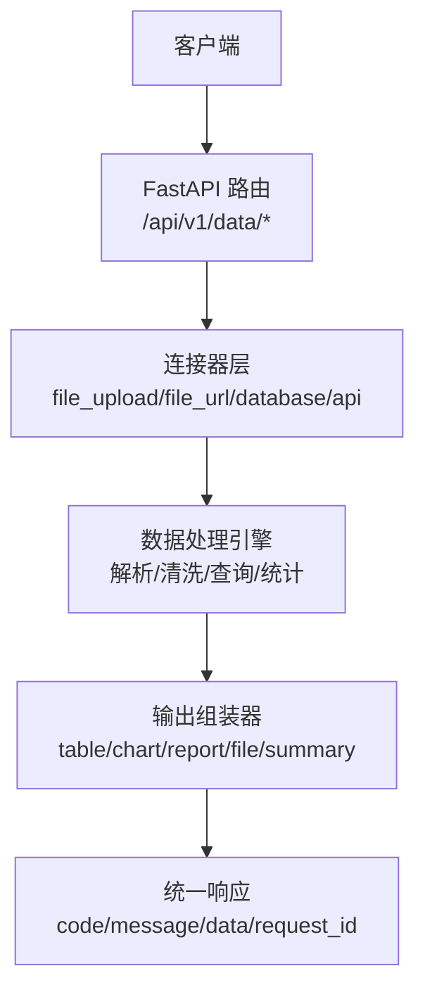
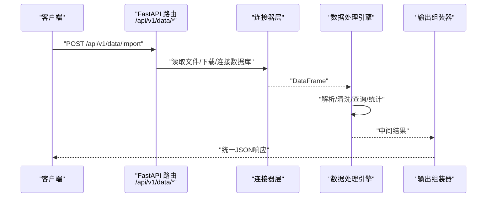
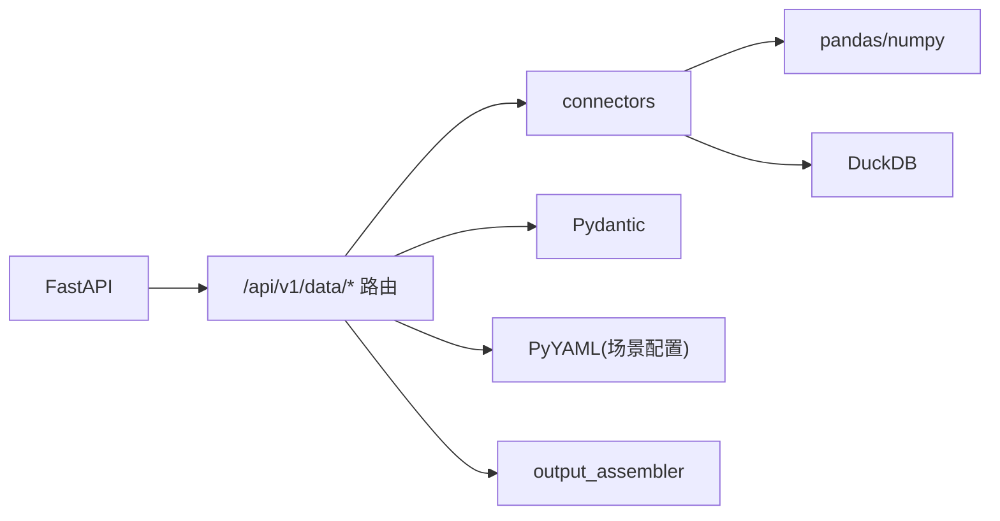

# 数据处理接口

<cite>
**本文引用的文件**
- [hiagent_辅助_Web_服务需求说明_task-242.md](file://docs\hiagent_辅助_Web_服务需求说明_task-242.md)
</cite>

## 目录
1. [简介](#简介)
2. [项目结构](#项目结构)
3. [核心组件](#核心组件)
4. [架构总览](#架构总览)
5. [详细组件分析](#详细组件分析)
6. [依赖关系分析](#依赖关系分析)
7. [性能考虑](#性能考虑)
8. [故障排查指南](#故障排查指南)
9. [结论](#结论)
10. [附录：API 端点清单与示例](#附录api-端点清单与示例)

## 简介
本文件为 hiagent 辅助 Web 服务的“数据处理模块”API 接口文档，聚焦 /api/v1/data/* 原子能力。该模块提供数据导入解析（CSV/Excel/JSON）、SQL 查询（DuckDB）、筛选、聚合、透视、排序、去重、清洗与统计分析等能力，并以统一 JSON 响应格式对外暴露。认证采用 X-API-Key 请求头，错误码按模块分段，其中数据处理相关错误码以 2xxx 表示。

## 项目结构
根据需求说明书，数据处理属于“原子 API”模式，位于 /api/v1/data/*；同时存在 Pipeline 编排入口 /api/v1/pipeline/run，用于场景化端到端流程。关键新增目录包括 pipeline_engine、scenario_loader、connectors、output_assembler 以及 scenarios/*.yaml 配置。

图表来源
- [hiagent_辅助_Web_服务需求说明_task-242.md:33-67](file://docs\hiagent_辅助_Web_服务需求说明_task-242.md#L33-L67)

章节来源
- [hiagent_辅助_Web_服务需求说明_task-242.md:33-67](file://docs\hiagent_辅助_Web_服务需求说明_task-242.md#L33-L67)
- [hiagent_辅助_Web_服务需求说明_task-242.md:106-115](file://docs\hiagent_辅助_Web_服务需求说明_task-242.md#L106-L115)

## 核心组件
- 统一接口规范：所有接口返回统一 JSON 结构（code/message/data/request_id），并支持 X-API-Key 鉴权。
- 连接器层：支持 file_upload、file_url、database、api 等多种数据源，统一返回 DataFrame。
- 数据处理引擎：负责导入解析（自动编码检测、类型推断）、SQL 查询（DuckDB）、筛选、聚合、透视、排序、去重、清洗、统计分析。
- 输出组装器：将处理结果封装为 table/chart/report/file/summary 等输出类型。

章节来源
- [hiagent_辅助_Web_服务需求说明_task-242.md:25-29](file://docs\hiagent_辅助_Web_服务需求说明_task-242.md#L25-L29)
- [hiagent_辅助_Web_服务需求说明_task-242.md:46-63](file://docs\hiagent_辅助_Web_服务需求说明_task-242.md#L46-L63)
- [hiagent_辅助_Web_服务需求说明_task-242.md:73-77](file://docs\hiagent_辅助_Web_服务需求说明_task-242.md#L73-L77)

## 架构总览
数据处理模块遵循“原子 API + 流水线编排”的双模式设计。原子 API 面向逐步调用，便于 Agent 灵活编排；Pipeline 则通过 YAML 场景配置串联多个步骤，实现端到端自动化。

图表来源
- [hiagent_辅助_Web_服务需求说明_task-242.md:33-67](file://docs\hiagent_辅助_Web_服务需求说明_task-242.md#L33-L67)
- [hiagent_辅助_Web_服务需求说明_task-242.md:73-77](file://docs\hiagent_辅助_Web_服务需求说明_task-242.md#L73-L77)

## 详细组件分析

### 数据导入与解析（CSV/Excel/JSON）
- 功能要点
  - 支持 CSV、Excel、JSON 三种格式导入。
  - 自动编码检测：在导入时自动识别文本编码，避免乱码。
  - 类型推断：对列进行智能类型推断（数值、日期、布尔等）。
  - 批量与流式：大文件建议流式读取，分批处理以降低内存占用。
- 典型端点
  - POST /api/v1/data/import
    - 请求体：multipart/form-data，字段包含 file、format、encoding_hint（可选）、infer_types（默认 true）。
    - 响应：data 中包含表头、行数、列类型推断结果及预览数据。
- 错误处理
  - 非法文件格式或损坏文件：返回 2xxx 错误码。
  - 编码无法识别：提示指定 encoding_hint。
- 安全与性能
  - 限制单文件大小与最大行数，防止资源耗尽。
  - 使用流式解析降低峰值内存。

章节来源
- [hiagent_辅助_Web_服务需求说明_task-242.md:73-77](file://docs\hiagent_辅助_Web_服务需求说明_task-242.md#L73-L77)

### SQL 查询（DuckDB）
- 功能要点
  - 基于 DuckDB 的 SQL 查询，支持筛选、聚合、透视、排序、去重等。
  - 安全防护：仅允许只读操作，禁止写/删/改等危险语句；对输入进行白名单校验与参数化绑定。
  - 性能优化：利用 DuckDB 向量化执行、列存特性；对常用查询建立临时索引或物化视图。
- 典型端点
  - POST /api/v1/data/query
    - 请求体：{ "sql": "...", "params": {...}, "limit": 1000 }
    - 响应：data 中包含列名、数据类型、行数据与元信息（如行数、耗时）。
- 错误处理
  - SQL 语法错误或越权操作：返回 2xxx 错误码，并附带简要原因。
- 最佳实践
  - 使用参数化查询避免注入。
  - 合理设置 limit，避免一次性返回超大结果集。

章节来源
- [hiagent_辅助_Web_服务需求说明_task-242.md:73-77](file://docs\hiagent_辅助_Web_服务需求说明_task-242.md#L73-L77)

### 数据清洗
- 功能要点
  - 空值处理：填充、删除、插值。
  - 类型转换：字符串转数值/日期、枚举映射。
  - 文本清洗：去除空白、正则替换、标准化。
  - 异常值处理：基于分位数或业务规则剔除/修正。
- 典型端点
  - POST /api/v1/data/clean
    - 请求体：{ "rules": [...] }，rules 中定义各列清洗策略。
    - 响应：data 中包含清洗后的表结构与样本数据。
- 错误处理
  - 规则不合法或目标列不存在：返回 2xxx 错误码。

章节来源
- [hiagent_辅助_Web_服务需求说明_task-242.md:73-77](file://docs\hiagent_辅助_Web_服务需求说明_task-242.md#L73-L77)

### 统计分析
- 功能要点
  - 描述性统计：均值、中位数、标准差、分位数等。
  - 相关性分析：数值列之间的相关系数矩阵。
  - 频率分布：类别列的频次与占比。
- 典型端点
  - POST /api/v1/data/statistics
    - 请求体：{ "columns": [...], "methods": ["desc","corr","freq"] }
    - 响应：data 中包含统计结果对象。
- 错误处理
  - 列类型不支持或数据为空：返回 2xxx 错误码。

章节来源
- [hiagent_辅助_Web_服务需求说明_task-242.md:73-77](file://docs\hiagent_辅助_Web_服务需求说明_task-242.md#L73-L77)

### 筛选、聚合、透视、排序、去重
- 功能要点
  - 筛选：条件表达式过滤行。
  - 聚合：分组求和、计数、平均、极值等。
  - 透视：行列转置与交叉汇总。
  - 排序：多列升/降序。
  - 去重：基于单列或多列去重。
- 典型端点
  - POST /api/v1/data/transform
    - 请求体：{ "ops": [{"type":"filter|groupby|pivot|sort|dedup", ...}] }
    - 响应：data 中包含变换后的表结构与样本数据。
- 错误处理
  - 非法操作或参数缺失：返回 2xxx 错误码。

章节来源
- [hiagent_辅助_Web_服务需求说明_task-242.md:73-77](file://docs\hiagent_辅助_Web_服务需求说明_task-242.md#L73-L77)

### 文件上传与批量/流式处理集成
- 文件上传
  - 使用 multipart/form-data 上传本地文件至服务器，由连接器层读取并转为 DataFrame。
- 批量处理
  - 通过多次调用 transform/statistics 等操作组合完成复杂任务；或使用 Pipeline 编排。
- 流式处理
  - 对大文件采用流式读取与分批处理，减少内存峰值。
- 安全隔离
  - 文件沙箱与临时目录管理，定时清理。

章节来源
- [hiagent_辅助_Web_服务需求说明_task-242.md:46-63](file://docs\hiagent_辅助_Web_服务需求说明_task-242.md#L46-L63)
- [hiagent_辅助_Web_服务需求说明_task-242.md:84-88](file://docs\hiagent_辅助_Web_服务需求说明_task-242.md#L84-L88)

## 依赖关系分析
- 外部依赖
  - FastAPI：HTTP 框架与路由。
  - pandas/numpy：数据处理与分析。
  - DuckDB：高性能 SQL 查询引擎。
  - Pydantic：请求/响应模型校验。
  - PyYAML：场景配置加载。
  - SQLAlchemy：数据库连接（若使用 database 连接器）。
  - httpx：外部 API 调用（若使用 api 连接器）。
- 内部依赖
  - connectors：统一数据接入抽象。
  - pipeline_engine：步骤顺序执行与上下文传递。
  - output_assembler：结果封装与格式化。

图表来源
- [hiagent_辅助_Web_服务需求说明_task-242.md:19-21](file://docs\hiagent_辅助_Web_服务需求说明_task-242.md#L19-L21)
- [hiagent_辅助_Web_服务需求说明_task-242.md:106-115](file://docs\hiagent_辅助_Web_服务需求说明_task-242.md#L106-L115)

章节来源
- [hiagent_辅助_Web_服务需求说明_task-242.md:19-21](file://docs\hiagent_辅助_Web_服务需求说明_task-242.md#L19-L21)
- [hiagent_辅助_Web_服务需求说明_task-242.md:106-115](file://docs\hiagent_辅助_Web_服务需求说明_task-242.md#L106-L115)

## 性能考虑
- 简单接口 < 500ms，数据处理 < 3s，Pipeline 全流程 < 10s。
- 使用 DuckDB 的向量化执行与列存优势提升查询性能。
- 大文件采用流式读取与分批处理，控制内存峰值。
- 对频繁查询的中间结果可物化为临时表或缓存。

章节来源
- [hiagent_辅助_Web_服务需求说明_task-242.md:97-102](file://docs\hiagent_辅助_Web_服务需求说明_task-242.md#L97-L102)

## 故障排查指南
- 认证失败
  - 检查请求头是否包含有效的 X-API-Key。
- 导入失败
  - 确认文件格式与编码；必要时传入 encoding_hint。
  - 检查文件是否损坏或为空。
- SQL 查询报错
  - 检查 SQL 语法与权限；确保仅允许只读操作。
  - 查看错误消息中的具体原因。
- 清洗/统计异常
  - 检查列类型与数据质量；必要时先做类型转换或空值处理。
- 超时或内存不足
  - 缩小查询范围或分批处理；调整 limit 与批大小。

章节来源
- [hiagent_辅助_Web_服务需求说明_task-242.md:25-29](file://docs\hiagent_辅助_Web_服务需求说明_task-242.md#L25-L29)
- [hiagent_辅助_Web_服务需求说明_task-242.md:97-102](file://docs\hiagent_辅助_Web_服务需求说明_task-242.md#L97-L102)

## 结论
数据处理模块以原子 API 形式提供强大的数据导入、查询、清洗与统计分析能力，并通过统一响应与鉴权机制保障一致性与安全性。结合 Pipeline 编排，可实现从数据接入到结果输出的端到端自动化。建议在工程落地时严格遵循安全与性能要求，充分利用 DuckDB 与流式处理能力，构建稳定高效的数据处理链路。

## 附录：API 端点清单与示例

### 通用约定
- 认证：请求头 X-API-Key
- 响应格式：{ "code": number, "message": string, "data": any, "request_id": string }
- 错误码：2xxx 表示数据处理相关错误

### 端点清单
- POST /api/v1/data/import
  - 用途：导入 CSV/Excel/JSON，自动编码检测与类型推断
  - 请求：multipart/form-data（file、format、encoding_hint、infer_types）
  - 响应：data 包含表头、行数、列类型、预览数据
  - 错误：2xxx（格式/编码/损坏）

- POST /api/v1/data/query
  - 用途：使用 DuckDB 执行 SQL 查询
  - 请求：{ "sql": string, "params": object, "limit": number }
  - 响应：data 包含列名、数据类型、行数据、元信息
  - 错误：2xxx（语法/越权）

- POST /api/v1/data/clean
  - 用途：数据清洗（空值、类型转换、文本清洗、异常值）
  - 请求：{ "rules": array }
  - 响应：data 包含清洗后表结构与样本
  - 错误：2xxx（规则/列不存在）

- POST /api/v1/data/statistics
  - 用途：统计分析（描述性统计、相关性、频率分布）
  - 请求：{ "columns": array, "methods": array }
  - 响应：data 包含统计结果对象
  - 错误：2xxx（类型/空数据）

- POST /api/v1/data/transform
  - 用途：筛选、聚合、透视、排序、去重
  - 请求：{ "ops": array }
  - 响应：data 包含变换后表结构与样本
  - 错误：2xxx（非法操作/参数缺失）

### 常见业务场景示例
- 竞品规模对比
  - 导入竞品规模数据 -> 清洗空值与异常值 -> 聚合计算指标 -> 生成表格输出
- 机构行为画像
  - 导入交易流水 -> 筛选特定时间段 -> 透视分析持仓变化 -> 输出摘要
- 产品规模增量归因
  - 导入规模序列 -> 计算增量与归因 -> 相关性分析驱动因素 -> 报告输出

### 高级功能集成指南
- 文件上传
  - 使用 multipart/form-data 上传本地文件，由连接器层读取并转换为 DataFrame。
- 批量处理
  - 通过多次调用 transform/statistics 组合完成复杂任务；或使用 Pipeline 编排。
- 流式处理
  - 对大文件采用流式读取与分批处理，降低内存峰值。
- 安全隔离
  - 文件沙箱与临时目录管理，定时清理。

章节来源
- [hiagent_辅助_Web_服务需求说明_task-242.md:25-29](file://docs\hiagent_辅助_Web_服务需求说明_task-242.md#L25-L29)
- [hiagent_辅助_Web_服务需求说明_task-242.md:73-77](file://docs\hiagent_辅助_Web_服务需求说明_task-242.md#L73-L77)
- [hiagent_辅助_Web_服务需求说明_task-242.md:84-88](file://docs\hiagent_辅助_Web_服务需求说明_task-242.md#L84-L88)