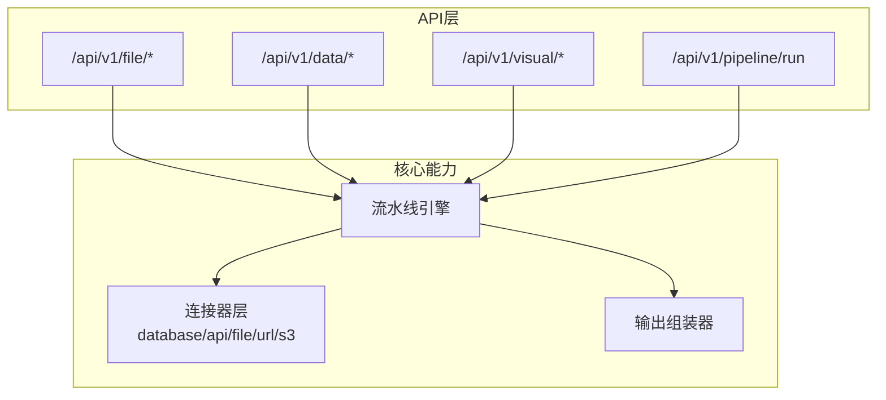
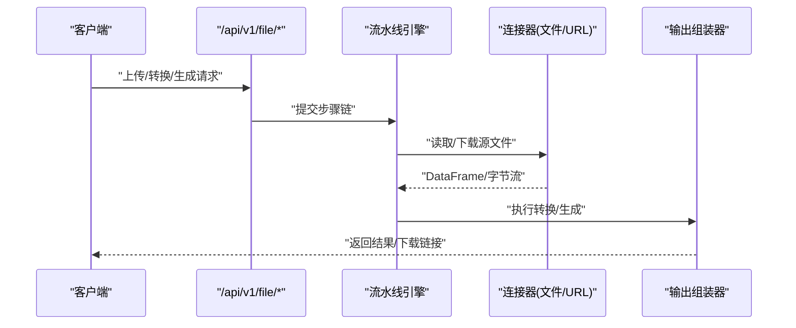
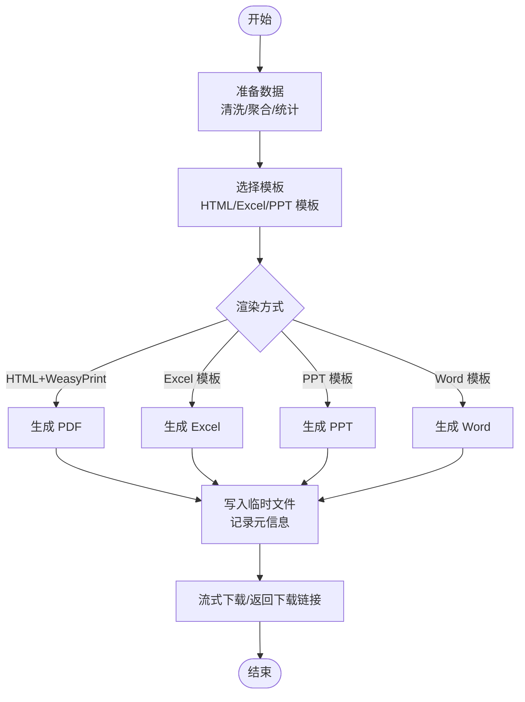
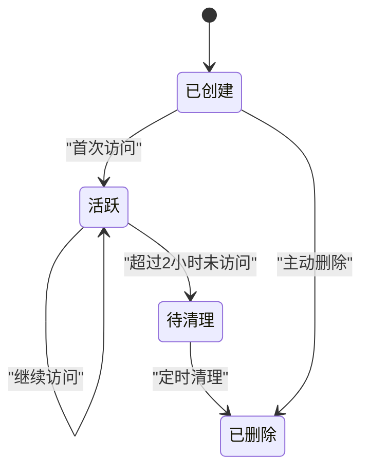
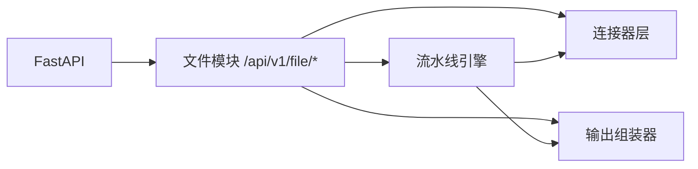

# 文件操作接口

<cite>
**本文引用的文件**
- [hiagent_辅助_Web_服务需求说明_task-242.md](file://docs\hiagent_辅助_Web_服务需求说明_task-242.md)
</cite>

## 目录
1. [简介](#简介)
2. [项目结构](#项目结构)
3. [核心组件](#核心组件)
4. [架构总览](#架构总览)
5. [详细组件分析](#详细组件分析)
6. [依赖关系分析](#依赖关系分析)
7. [性能考虑](#性能考虑)
8. [故障排查指南](#故障排查指南)
9. [结论](#结论)
10. [附录](#附录)

## 简介
本文件面向 /api/v1/file/* 下的“文件与文档操作”能力，基于需求说明书中的模块设计进行整理与扩展说明。该模块提供：
- 格式转换：CSV/Excel/JSON/Markdown/HTML 互转
- 文档生成：PDF/Word/Excel/PPT（支持模板）
- 文件打包解压、元信息查询
- 临时文件管理：2 小时自动清理、流式下载
- 统一认证与安全：API Key 认证、文件沙箱、错误码按模块分段（4xxx 文件文档）

说明：当前仓库未包含具体实现代码，本文档以需求说明书为依据，给出接口规范、数据流、流程与最佳实践建议，便于后续开发与集成。

章节来源
- [hiagent_辅助_Web_服务需求说明_task-242.md:25-29](file://docs\hiagent_辅助_Web_服务需求说明_task-242.md#L25-L29)
- [hiagent_辅助_Web_服务需求说明_task-242.md:84-88](file://docs\hiagent_辅助_Web_服务需求说明_task-242.md#L84-L88)

## 项目结构
根据需求说明书，文件与文档操作属于 /api/v1/file 模块，并与数据处理、可视化渲染、Pipeline 编排协同工作。整体工程关键目录包括：
- app/core/pipeline_engine.py — 流水线引擎
- app/core/scenario_loader.py — 场景配置加载器
- app/core/connectors/ — 数据连接器（base/database/api/file）
- app/core/output_assembler.py — 输出组装器
- app/scenarios/*.yaml — 场景配置文件
- app/api/v1/pipeline.py — Pipeline 路由

文件模块在流水线中作为输入或输出环节参与端到端的数据处理与报告生成。

图表来源
- [hiagent_辅助_Web_服务需求说明_task-242.md:33-68](file://docs\hiagent_辅助_Web_服务需求说明_task-242.md#L33-L68)
- [hiagent_辅助_Web_服务需求说明_task-242.md:106-114](file://docs\hiagent_辅助_Web_服务需求说明_task-242.md#L106-L114)

章节来源
- [hiagent_辅助_Web_服务需求说明_task-242.md:106-114](file://docs\hiagent_辅助_Web_服务需求说明_task-242.md#L106-L114)

## 核心组件
- 格式转换器：负责 CSV/Excel/JSON/Markdown/HTML 之间的相互转换，需保证编码检测、类型推断与表头一致性。
- 文档生成器：基于模板生成 PDF/Word/Excel/PPT，支持 Jinja2 等模板引擎与样式控制。
- 打包解压器：对多文件进行归档压缩与解包，支持常见格式（如 zip/tar）。
- 元信息提取器：读取文件的 MIME、大小、创建时间、作者、页数等元数据。
- 临时文件管理器：为中间产物与下载内容提供生命周期管理（2 小时自动清理），并提供流式下载。

章节来源
- [hiagent_辅助_Web_服务需求说明_task-242.md:84-88](file://docs\hiagent_辅助_Web_服务需求说明_task-242.md#L84-L88)

## 架构总览
文件与文档操作在整体架构中承担“输入解析—处理—输出”的关键角色，既可作为原子 API 被调用，也可嵌入 Pipeline 完成端到端任务。

图表来源
- [hiagent_辅助_Web_服务需求说明_task-242.md:33-68](file://docs\hiagent_辅助_Web_服务需求说明_task-242.md#L33-L68)

## 详细组件分析

### 接口清单与行为说明
以下列出 /api/v1/file/* 的规划端点与职责。实际路径以最终实现为准。

- 上传与存储
  - POST /api/v1/file/upload
    - 功能：接收单文件或分片上传，落盘到临时目录，返回 file_id 与访问信息
    - 限制：文件大小限制由服务端策略决定；支持断点续传（可选）
    - 安全：校验 MIME、病毒扫描（可选）、沙箱隔离
  - GET /api/v1/file/{file_id}
    - 功能：获取文件元信息（名称、大小、MIME、创建时间等）
  - DELETE /api/v1/file/{file_id}
    - 功能：主动删除临时文件

- 格式转换
  - POST /api/v1/file/convert
    - 功能：将源文件转换为指定目标格式（CSV/Excel/JSON/Markdown/HTML）
    - 参数：source_file_id、target_format、options（如 sheet_name、encoding、include_index 等）
    - 规则：
      - CSV↔Excel：列名映射、空值处理、数值类型推断
      - JSON↔CSV/Excel：扁平化/嵌套展开策略可配置
      - Markdown↔HTML：保留表格、列表、图片引用
  - GET /api/v1/file/convert/status?task_id=...
    - 功能：查询异步转换任务状态与进度

- 文档生成
  - POST /api/v1/file/generate
    - 功能：基于模板与数据生成 PDF/Word/Excel/PPT
    - 参数：template_id、data、output_format、options（页眉页脚、样式、分页等）
    - 模板：Jinja2 HTML 模板用于 PDF/Word；Excel 使用模板工作簿；PPT 使用占位符替换
  - GET /api/v1/file/generate/status?task_id=...
    - 功能：查询生成任务状态

- 打包与解压
  - POST /api/v1/file/archive
    - 功能：将多个 file_id 打包为 zip/tar
  - POST /api/v1/file/unarchive
    - 功能：解压压缩包，返回子文件列表

- 元信息查询
  - GET /api/v1/file/metadata
    - 功能：批量查询文件元信息（size、mime、pages、author 等）

- 临时文件管理
  - GET /api/v1/file/temp/list
    - 功能：列出当前会话或全局的临时文件
  - GET /api/v1/file/temp/stream?file_id=...&range=...
    - 功能：流式下载大文件，支持 Range 头断点续传
  - 清理策略：2 小时自动清理未访问的临时文件

章节来源
- [hiagent_辅助_Web_服务需求说明_task-242.md:84-88](file://docs\hiagent_辅助_Web_服务需求说明_task-242.md#L84-L88)

### 格式转换规则与约束
- 编码与类型
  - 自动编码检测（UTF-8/GBK/GB2312 等）
  - 数值/日期/布尔类型推断，异常值回退为字符串
- 表结构与对齐
  - 列名规范化（去空白、下划线命名）
  - 缺失列填充默认值或忽略
- 大型文件
  - 流式读写，避免一次性加载至内存
  - 分块处理与增量写入
- 兼容性
  - Excel 多 sheet 选择与合并策略
  - JSON 数组/对象展开与层级控制

章节来源
- [hiagent_辅助_Web_服务需求说明_task-242.md:73-77](file://docs\hiagent_辅助_Web_服务需求说明_task-242.md#L73-L77)

### 文档生成工作流程（从数据到报告）

图表来源
- [hiagent_辅助_Web_服务需求说明_task-242.md:79-82](file://docs\hiagent_辅助_Web_服务需求说明_task-242.md#L79-L82)
- [hiagent_辅助_Web_服务需求说明_task-242.md:84-88](file://docs\hiagent_辅助_Web_服务需求说明_task-242.md#L84-L88)

### 临时文件生命周期与流式下载
- 生命周期
  - 创建：上传/转换/生成时产生临时文件，分配唯一 ID
  - 访问：通过 file_id 访问，更新最后访问时间
  - 清理：超过 2 小时未访问则自动回收
- 流式下载
  - 支持 HTTP Range 头，实现断点续传
  - 分块读取与发送，降低内存占用
  - 并发下载限流与队列控制

图表来源
- [hiagent_辅助_Web_服务需求说明_task-242.md:84-88](file://docs\hiagent_辅助_Web_服务需求说明_task-242.md#L84-L88)

### 安全与权限
- 认证：所有接口需携带 X-API-Key 头部
- 沙箱：文件读写限制在受控目录，禁止路径穿越
- 校验：MIME 白名单、大小上限、恶意内容检测（可选）
- 审计：记录操作日志（用户、IP、动作、耗时）

章节来源
- [hiagent_辅助_Web_服务需求说明_task-242.md:25-29](file://docs\hiagent_辅助_Web_服务需求说明_task-242.md#L25-L29)
- [hiagent_辅助_Web_服务需求说明_task-242.md:97-102](file://docs\hiagent_辅助_Web_服务需求说明_task-242.md#L97-L102)

## 依赖关系分析
- 外部库与技术栈
  - FastAPI 提供 Web 框架与路由
  - pandas/numpy 用于数据解析与处理
  - DuckDB 用于 SQL 查询与高性能计算
  - WeasyPrint 用于 HTML→PDF 渲染
  - httpx 用于网络请求（下载/代理）
  - Pydantic/PyYAML/SQLAlchemy/jsonpath-ng 用于模型、配置与数据访问
- 内部模块耦合
  - /api/v1/file/* 依赖连接器层读取/下载数据
  - 依赖输出组装器统一封装结果
  - 与 Pipeline 引擎协作完成端到端任务

图表来源
- [hiagent_辅助_Web_服务需求说明_task-242.md:19-21](file://docs\hiagent_辅助_Web_服务需求说明_task-242.md#L19-L21)
- [hiagent_辅助_Web_服务需求说明_task-242.md:33-68](file://docs\hiagent_辅助_Web_服务需求说明_task-242.md#L33-L68)

章节来源
- [hiagent_辅助_Web_服务需求说明_task-242.md:19-21](file://docs\hiagent_辅助_Web_服务需求说明_task-242.md#L19-L21)
- [hiagent_辅助_Web_服务需求说明_task-242.md:33-68](file://docs\hiagent_辅助_Web_服务需求说明_task-242.md#L33-L68)

## 性能考虑
- 简单接口响应 < 500ms，数据处理 < 3s，Pipeline 全流程 < 10s
- 大文件处理采用流式 I/O 与分块处理，避免内存峰值
- 转换与生成任务可异步化，提供任务状态查询
- 连接池与缓存：数据库连接、模板缓存、中间结果缓存
- 限流与熔断：防止突发流量导致资源耗尽

章节来源
- [hiagent_辅助_Web_服务需求说明_task-242.md:97-102](file://docs\hiagent_辅助_Web_服务需求说明_task-242.md#L97-L102)

## 故障排查指南
- 认证失败
  - 检查 X-API-Key 是否正确传递
  - 确认服务端密钥配置一致
- 文件格式不支持
  - 核对 MIME 白名单与扩展名
  - 查看错误码段 4xxx（文件文档）
- 转换失败
  - 检查源文件编码、表头、数据类型
  - 查看中间日志与堆栈
- 生成超时
  - 调整模板复杂度与数据量
  - 启用异步任务与重试机制
- 临时文件丢失
  - 确认是否超过 2 小时未访问
  - 检查磁盘空间与权限

章节来源
- [hiagent_辅助_Web_服务需求说明_task-242.md:25-29](file://docs\hiagent_辅助_Web_服务需求说明_task-242.md#L25-L29)
- [hiagent_辅助_Web_服务需求说明_task-242.md:84-88](file://docs\hiagent_辅助_Web_服务需求说明_task-242.md#L84-L88)

## 结论
本模块围绕 /api/v1/file/* 提供完整的文件与文档处理能力，覆盖格式转换、文档生成、打包解压、元信息查询与临时文件管理。结合 Pipeline 与连接器层，可实现从数据准备到最终文档输出的端到端自动化。建议在实现阶段强化流式处理、异步任务、安全校验与可观测性，以满足高可用与高性能要求。

## 附录
- 统一响应格式：code/message/data/request_id
- 错误码：4xxx 表示文件文档相关错误
- 认证：X-API-Key 头部
- 部署：Docker、环境变量配置、场景配置热加载

章节来源
- [hiagent_辅助_Web_服务需求说明_task-242.md:25-29](file://docs\hiagent_辅助_Web_服务需求说明_task-242.md#L25-L29)
- [hiagent_辅助_Web_服务需求说明_task-242.md:97-102](file://docs\hiagent_辅助_Web_服务需求说明_task-242.md#L97-L102)