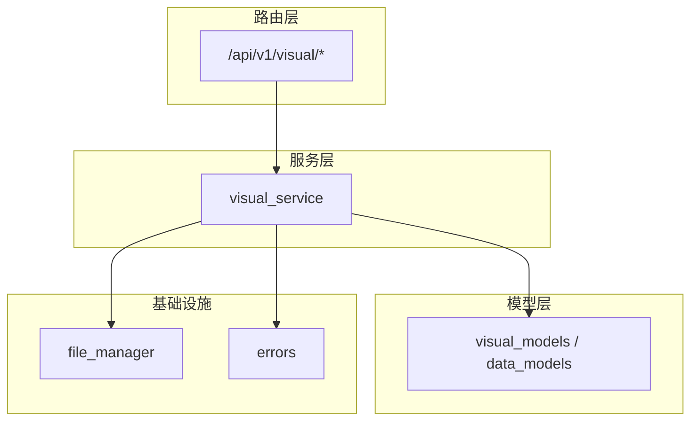
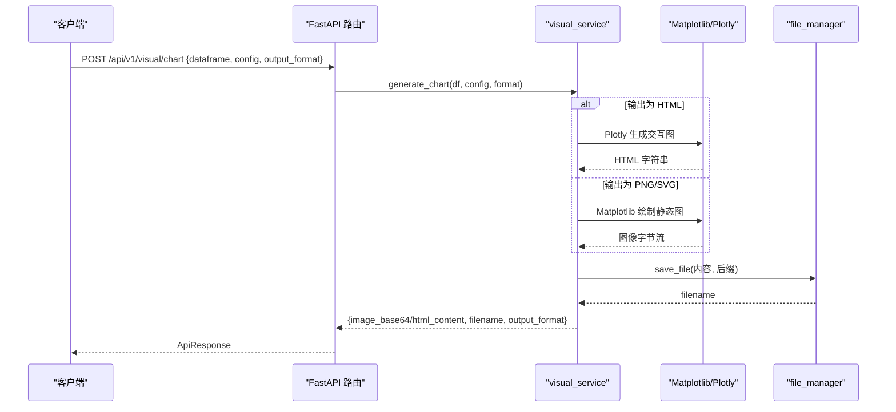
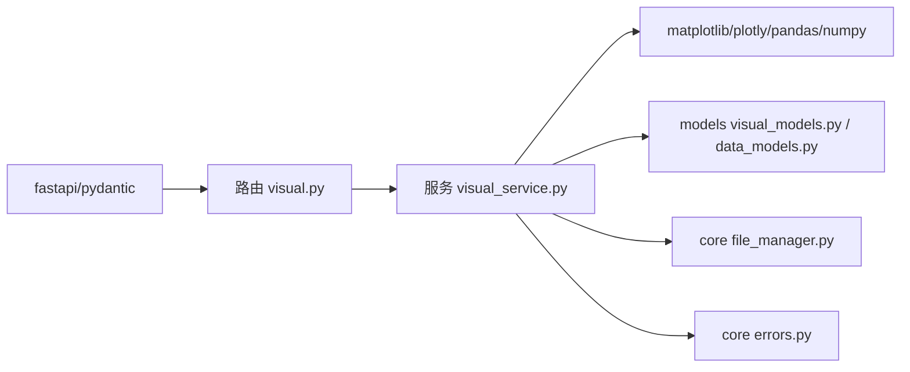
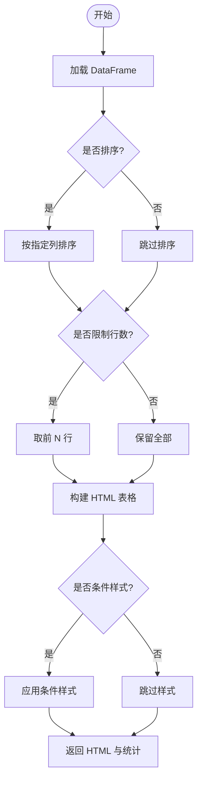

# 可视化功能

<cite>
**本文引用的文件**
- [app/api/v1/visual.py](file://app/api/v1/visual.py)
- [app/services/visual_service.py](file://app/services/visual_service.py)
- [app/models/visual_models.py](file://app/models/visual_models.py)
- [app/models/data_models.py](file://app/models/data_models.py)
- [app/core/file_manager.py](file://app/core/file_manager.py)
- [app/core/errors.py](file://app/core/errors.py)
- [tests/test_visual_api.py](file://tests/test_visual_api.py)
- [requirements.txt](file://requirements.txt)
</cite>

## 目录
1. [简介](#简介)
2. [项目结构](#项目结构)
3. [核心组件](#核心组件)
4. [架构总览](#架构总览)
5. [详细组件分析](#详细组件分析)
6. [依赖关系分析](#依赖关系分析)
7. [性能考虑](#性能考虑)
8. [故障排查指南](#故障排查指南)
9. [结论](#结论)
10. [附录：API 与配置参考](#附录api-与配置参考)

## 简介
本模块提供统一的可视化能力，支持通过 API 生成多种图表（柱状图、折线图、饼图、散点图、热力图、雷达图、面积图、直方图、箱线图），并输出 PNG/SVG 图片（base64）或交互式 HTML（Plotly）。同时提供 HTML 表格渲染能力，支持排序、条件着色、列宽控制等。系统基于 Matplotlib 与 Plotly 双引擎：静态图使用 Matplotlib（无头模式 Agg），交互图使用 Plotly 生成可嵌入的 HTML。

## 项目结构
可视化相关代码按“路由层 → 服务层 → 模型层”组织，数据以 DataFrameInput JSON 形式传入，内部转换为 pandas.DataFrame 后交由服务层处理。

**图示来源**
- [app/api/v1/visual.py:1-30](file://app/api/v1/visual.py#L1-L30)
- [app/services/visual_service.py:1-430](file://app/services/visual_service.py#L1-L430)
- [app/models/visual_models.py:1-107](file://app/models/visual_models.py#L1-L107)
- [app/models/data_models.py:1-145](file://app/models/data_models.py#L1-L145)
- [app/core/file_manager.py:1-78](file://app/core/file_manager.py#L1-L78)
- [app/core/errors.py:1-74](file://app/core/errors.py#L1-L74)

**章节来源**
- [app/api/v1/visual.py:1-30](file://app/api/v1/visual.py#L1-L30)
- [app/models/data_models.py:13-18](file://app/models/data_models.py#L13-L18)

## 核心组件
- 路由层
  - POST /api/v1/visual/chart：接收 DataFrame + ChartConfig + OutputFormat，返回图表结果（PNG/SVG base64 或 HTML）。
  - POST /api/v1/visual/table：接收 DataFrame + TableConfig，返回 HTML 表格及行列统计。
- 服务层
  - generate_chart：根据 chart_type 选择具体绘制函数；HTML 模式走 Plotly，否则走 Matplotlib。
  - render_table：构建带样式和条件的 HTML 表格。
- 模型层
  - ChartType、OutputFormat、ChartConfig、TableConfig 等 Pydantic 模型用于参数校验与文档生成。
- 基础设施
  - file_manager：保存临时文件（PNG/SVG/HTML），支持定时清理。
  - errors：统一异常与错误码，便于前端处理。

**章节来源**
- [app/api/v1/visual.py:13-29](file://app/api/v1/visual.py#L13-L29)
- [app/services/visual_service.py:51-205](file://app/services/visual_service.py#L51-L205)
- [app/models/visual_models.py:15-107](file://app/models/visual_models.py#L15-L107)
- [app/core/file_manager.py:22-27](file://app/core/file_manager.py#L22-L27)
- [app/core/errors.py:15-42](file://app/core/errors.py#L15-L42)

## 架构总览
请求进入 FastAPI 路由，解析为 Pydantic 模型后调用服务层。服务层将 JSON 数据转为 DataFrame，再根据配置选择 Matplotlib 或 Plotly 进行渲染，最终返回 base64 图片或 HTML 内容，并持久化到临时文件以便下载。

**图示来源**
- [app/api/v1/visual.py:13-21](file://app/api/v1/visual.py#L13-L21)
- [app/services/visual_service.py:51-205](file://app/services/visual_service.py#L51-L205)
- [app/core/file_manager.py:22-27](file://app/core/file_manager.py#L22-L27)

## 详细组件分析

### 图表类型与配置
- 支持的图表类型
  - 柱状图（bar）、折线图（line）、饼图（pie）、散点图（scatter）、热力图（heatmap）、雷达图（radar）、面积图（area）、直方图（histogram）、箱线图（box）
- 输出格式
  - PNG：返回 base64 图片，适合直接嵌入页面
  - SVG：返回矢量图 base64，适合缩放不失真
  - HTML：返回 Plotly 交互式 HTML，适合在线预览与交互
- 关键配置项
  - x/y：X/Y 轴列名，y 可为单列或多列（多系列）
  - title/xlabel/ylabel：标题与坐标轴标签
  - colors：颜色序列（Matplotlib/Plotly 均支持）
  - width/height：画布尺寸（像素）
  - x_axis/y_axis：刻度旋转、范围限制等
  - extra：扩展参数（如直方图的 bins）

**章节来源**
- [app/models/visual_models.py:15-57](file://app/models/visual_models.py#L15-L57)
- [app/services/visual_service.py:51-88](file://app/services/visual_service.py#L51-L88)

### Matplotlib 集成（PNG/SVG）
- 无头模式：使用 Agg 后端，避免 GUI 依赖
- 中文字体：自动检测并设置常用中文字体，解决中文显示问题
- 绘图流程
  - 创建 Figure/Axes，根据 chart_type 调用对应绘制函数
  - 应用标题、坐标轴标签、刻度旋转、Y 轴范围等
  - 导出为 PNG/SVG，并保存到临时文件
- 各图表实现要点
  - 柱状图：支持多系列并列
  - 折线图：支持多系列，网格线
  - 饼图：需指定 x（标签）与 y（数值）
  - 散点图：支持透明度与边框
  - 热力图：计算数值列相关系数矩阵并展示
  - 雷达图：极坐标系，多行数据作为多系列
  - 面积图：填充区域+线条
  - 直方图：通过 extra.bins 控制分箱数
  - 箱线图：多列分布对比

**章节来源**
- [app/services/visual_service.py:31-46](file://app/services/visual_service.py#L31-L46)
- [app/services/visual_service.py:90-147](file://app/services/visual_service.py#L90-L147)
- [app/services/visual_service.py:210-329](file://app/services/visual_service.py#L210-L329)

### Plotly 集成（HTML）
- 交互能力：悬停、缩放、图例切换等
- 映射规则
  - bar/line/area：支持单/多系列
  - pie：names=分类列，values=数值列
  - scatter：x/y 两列
  - heatmap：对数值列计算相关系数矩阵
  - histogram：单列分布
  - box：单/多列分布
- 样式定制
  - 宽度/高度、坐标轴标题、颜色主题（colorway）
- 输出
  - 生成完整 HTML（包含 CDN 加载的 Plotly JS），并保存为 .html 临时文件

**章节来源**
- [app/services/visual_service.py:150-205](file://app/services/visual_service.py#L150-L205)

### 表格渲染与自定义样式
- 功能
  - 排序（升/降序）
  - 最大行数限制
  - 条件样式：基于简单表达式（>=、<=、==、!=、>、<）对单元格应用 CSS
  - 列宽控制、索引显示
- 输出
  - 返回 HTML 片段与行列统计信息

**章节来源**
- [app/services/visual_service.py:333-430](file://app/services/visual_service.py#L333-L430)
- [app/models/visual_models.py:78-107](file://app/models/visual_models.py#L78-L107)

### 端到端示例（从数据准备到渲染）
以下示例描述典型调用流程，不直接粘贴代码，仅给出步骤与字段说明。

- 生成柱状图（PNG）
  - 输入：DataFrameInput（columns=["product","sales"], data=[...], dtypes可选）
  - 配置：chart_type="bar", x="product", y="sales", title="产品销量", width/height 可选
  - 输出：image_base64（PNG）、filename（临时文件）、output_format="png"
- 生成折线图（SVG）
  - 输入：columns=["month","value"], data=[...]
  - 配置：chart_type="line", x="month", y="value", title="月度趋势"
  - 输出：image_base64（SVG 文本）、filename、output_format="svg"
- 生成交互式 HTML 图表
  - 输入：任意数值/分类数据
  - 配置：chart_type="bar"/"line"/"pie"/"scatter"/"area"/"histogram"/"box"，title、colors 等
  - 输出：html_content（含 Plotly JS CDN）、filename=".html"、output_format="html"
- 渲染表格
  - 输入：columns=["name","score"], data=[...]
  - 配置：sort_by="score", sort_ascending=False, conditional_styles=[{column:"score", condition:"> 90", style:{...}}]
  - 输出：html（表格片段）、row_count、column_count

**章节来源**
- [tests/test_visual_api.py:5-117](file://tests/test_visual_api.py#L5-L117)
- [tests/test_visual_api.py:120-166](file://tests/test_visual_api.py#L120-L166)
- [app/models/data_models.py:13-18](file://app/models/data_models.py#L13-L18)

## 依赖关系分析
- 外部库
  - matplotlib：静态图表渲染（Agg 后端）
  - plotly：交互式 HTML 图表
  - pandas/numpy：数据处理与数值计算
  - fastapi/pydantic：路由与参数校验
- 内部模块耦合
  - 路由层依赖服务层与模型层
  - 服务层依赖模型层（配置/输入输出）、文件管理（临时文件）、错误处理（业务异常）
  - 文件管理独立，提供通用存储与清理能力

**图示来源**
- [requirements.txt:1-30](file://requirements.txt#L1-L30)
- [app/api/v1/visual.py:1-30](file://app/api/v1/visual.py#L1-L30)
- [app/services/visual_service.py:1-430](file://app/services/visual_service.py#L1-L430)

**章节来源**
- [requirements.txt:1-30](file://requirements.txt#L1-L30)
- [app/services/visual_service.py:10-28](file://app/services/visual_service.py#L10-L28)

## 性能考虑
- 渲染模式选择
  - PNG/SVG：适合批量导出与离线报告，体积小、易嵌入
  - HTML：适合在线预览与交互，但体积较大且依赖浏览器渲染
- 资源释放
  - Matplotlib 在每次渲染后关闭图形对象，避免内存泄漏
- 字体与布局
  - 启动时一次性设置中文字体，减少重复开销
  - 合理设置 width/height，避免过大画布导致内存压力
- 数据规模
  - 大数据集建议先聚合/采样后再绘图
  - 热力图会计算相关系数矩阵，注意列数量
- 临时文件
  - 启用后台定时清理任务，避免磁盘占用
  - 按需下载后及时删除临时文件

[本节为通用指导，无需特定文件引用]

## 故障排查指南
- 参数校验失败（422）
  - 检查 chart_type、x/y 列是否存在、数据类型是否符合预期
  - 参考测试用例中的请求体结构
- 不支持的图表类型
  - 确认枚举值与当前实现是否匹配
- 渲染失败
  - 捕获 AppException 并查看 message，定位具体原因（如缺少必要列）
- 中文显示异常
  - 确保系统已安装中文字体，服务会在启动时尝试自动配置
- 临时文件未清理
  - 检查后台清理任务是否运行，以及配置的时间间隔

**章节来源**
- [app/core/errors.py:30-74](file://app/core/errors.py#L30-L74)
- [app/services/visual_service.py:69-87](file://app/services/visual_service.py#L69-L87)
- [app/core/file_manager.py:47-78](file://app/core/file_manager.py#L47-L78)

## 结论
本可视化模块以清晰的三层架构提供了稳定的图表与表格渲染能力，兼顾静态与交互两种场景。通过统一的配置模型与严格的参数校验，降低了使用门槛；结合 Matplotlib 与 Plotly 的优势，满足多样化需求。配合临时文件管理与异常处理，具备较好的工程可用性。

[本节为总结性内容，无需特定文件引用]

## 附录：API 与配置参考

### API 定义
- POST /api/v1/visual/chart
  - 请求体：dataframe（DataFrameInput）、config（ChartConfig）、output_format（png/svg/html）
  - 响应：ApiResponse.data 包含 image_base64 或 html_content、filename、output_format
- POST /api/v1/visual/table
  - 请求体：dataframe（DataFrameInput）、config（TableConfig，可选）
  - 响应：ApiResponse.data 包含 html、row_count、column_count

**章节来源**
- [app/api/v1/visual.py:13-29](file://app/api/v1/visual.py#L13-L29)
- [app/models/visual_models.py:61-107](file://app/models/visual_models.py#L61-L107)

### 配置项速查
- ChartConfig
  - chart_type：bar/line/pie/scatter/heatmap/radar/area/histogram/box
  - x/y：列名，y 可为单列或多列
  - title/xlabel/ylabel：标题与轴标签
  - colors：颜色列表
  - width/height：画布尺寸（像素）
  - x_axis/y_axis：tick_rotation、min_value、max_value、label
  - extra：扩展参数（如 histogram 的 bins）
- TableConfig
  - sort_by/sort_ascending：排序字段与方向
  - max_rows：最大显示行数
  - conditional_styles：[{column, condition, style}]
  - column_widths：列宽映射
  - show_index：是否显示行索引

**章节来源**
- [app/models/visual_models.py:35-57](file://app/models/visual_models.py#L35-L57)
- [app/models/visual_models.py:78-107](file://app/models/visual_models.py#L78-L107)

### 使用流程图（表格渲染）

**图示来源**
- [app/services/visual_service.py:333-430](file://app/services/visual_service.py#L333-L430)