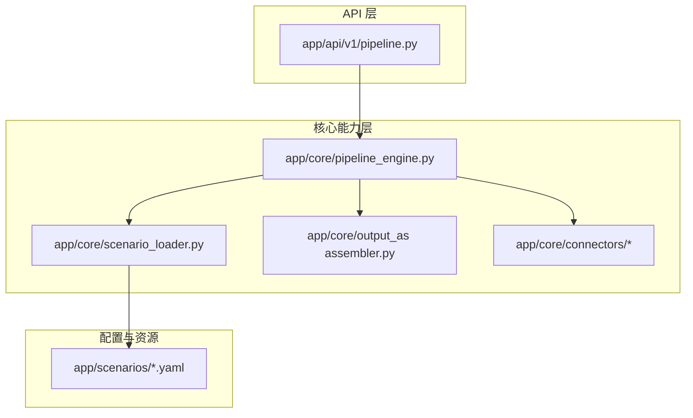
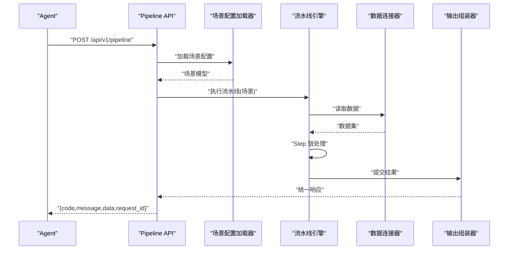
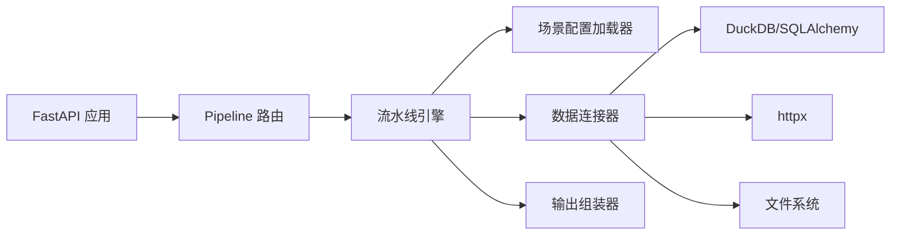

# 代码规范

<cite>
**本文引用的文件**
- [需求说明](file://docs/20260821100000_hiagent辅助Web服务_需求说明.md)
</cite>

## 目录
1. [简介](#简介)
2. [项目结构](#项目结构)
3. [核心组件](#核心组件)
4. [架构总览](#架构总览)
5. [详细组件分析](#详细组件分析)
6. [依赖关系分析](#依赖关系分析)
7. [性能考虑](#性能考虑)
8. [故障排查指南](#故障排查指南)
9. [结论](#结论)
10. [附录](#附录)

## 简介
本规范面向 hiagent 辅助 Web 服务，基于统一接口与场景驱动的流水线引擎，覆盖命名约定、代码风格、模块组织与导入、错误处理与日志记录、代码审查清单与质量保证流程，并提供常用模板与最佳实践示例。目标是确保多场景（竞品分析、机构行为分析、产品规模增量分析等）在一致、可维护、可扩展的代码体系下高效交付。

## 项目结构
根据需求说明，项目采用“原子 API + Pipeline 引擎”的双模式架构，关键目录包括：
- app/core/pipeline_engine.py — 流水线引擎
- app/core/scenario_loader.py — 场景配置加载器
- app/core/connectors/ — 数据连接器（base/database/api/file）
- app/core/output_assembler.py — 输出组装器
- app/scenarios/*.yaml — 场景配置文件
- app/api/v1/pipeline.py — Pipeline 路由

建议的目录组织原则：
- 按职责分层：API 层、核心能力层、基础设施层、配置与资源
- 单一职责：每个模块仅承担一个清晰职责
- 配置驱动：场景通过 YAML 配置，避免硬编码逻辑
- 无状态设计：请求级上下文传递，便于水平扩展

图表来源
- [需求说明:106-115](file://docs/20260821100000_hiagent辅助Web服务_需求说明.md#L106-L115)

章节来源
- [需求说明:106-115](file://docs/20260821100000_hiagent辅助Web服务_需求说明.md#L106-L115)

## 核心组件
- 流水线引擎：负责编排 Step 链，管理执行顺序、错误传播与耗时统计
- 场景配置加载器：从 YAML 加载场景定义，校验并转换为内部模型
- 数据连接器：抽象数据库/API/文件访问，提供统一读取接口
- 输出组装器：将处理结果标准化为统一 JSON 响应格式
- Pipeline 路由：暴露 /api/v1/pipeline 入口，承载认证、参数校验与调用引擎

章节来源
- [需求说明:106-115](file://docs/20260821100000_hiagent辅助Web服务_需求说明.md#L106-L115)

## 架构总览
整体流程：Agent 请求进入 Pipeline API 入口，由场景配置加载器解析场景，数据获取层通过 Connector 拉取数据，数据处理流水线执行 Step 链，输出组装器生成统一响应。

图表来源
- [需求说明:33-38](file://docs/20260821100000_hiagent辅助Web服务_需求说明.md#L33-L38)
- [需求说明:106-115](file://docs/20260821100000_hiagent辅助Web服务_需求说明.md#L106-L115)

## 详细组件分析

### 命名约定
- 变量与函数
  - 使用小写蛇形命名（snake_case），如 data_frame、load_scenario
  - 布尔变量以 is_/has_/can_ 前缀，如 is_valid、has_next
- 类
  - 使用大驼峰命名（PascalCase），如 PipelineEngine、ScenarioLoader
- 文件与模块
  - 使用小写蛇形命名，如 pipeline_engine.py、scenario_loader.py
  - 包名全小写，如 app.core.connectors
- 常量
  - 全大写蛇形命名，如 MAX_RETRIES、DEFAULT_TIMEOUT

章节来源
- [需求说明:106-115](file://docs/20260821100000_hiagent辅助Web服务_需求说明.md#L106-L115)

### 代码风格
- 缩进与换行
  - 使用 4 空格缩进；每行不超过 120 字符；函数签名与长表达式合理换行
- 注释格式
  - 模块级 docstring 描述职责与用法；函数级 docstring 包含参数、返回值与异常
  - 复杂逻辑添加行内注释解释意图而非复述代码
- 类型注解
  - 函数签名与变量声明使用类型注解，提升可读性与工具支持

章节来源
- [需求说明:106-115](file://docs/20260821100000_hiagent辅助Web服务_需求说明.md#L106-L115)

### 模块组织与导入规范
- 模块职责边界
  - API 层仅负责路由、鉴权、参数校验与响应包装
  - 核心层实现业务编排与数据处理
  - 连接器层屏蔽外部差异，提供统一接口
- 导入顺序
  - 标准库 -> 第三方库 -> 本地模块；禁止循环导入
- 公共接口
  - 通过 __init__.py 暴露稳定 API；内部实现以下划线前缀隐藏

章节来源
- [需求说明:106-115](file://docs/20260821100000_hiagent辅助Web服务_需求说明.md#L106-L115)

### 错误处理与日志记录标准
- 统一响应格式
  - code/message/data/request_id；错误码按模块分段：1xxx 通用、2xxx 数据处理、3xxx 可视化、4xxx 文件文档、5xxx API 编排、6xxx Pipeline 引擎
- 异常分类
  - 输入校验失败、数据处理异常、外部依赖超时、权限不足等分别捕获并映射到错误码
- 日志规范
  - 结构化日志，包含 scenario_id、request_id、步骤耗时；关键路径打点记录
  - 敏感信息脱敏，避免记录凭据或完整请求体

章节来源
- [需求说明:25-30](file://docs/20260821100000_hiagent辅助Web服务_需求说明.md#L25-L30)
- [需求说明:97-102](file://docs/20260821100000_hiagent辅助Web服务_需求说明.md#L97-L102)

### 认证与安全
- API Key 认证
  - 通过 X-API-Key Header 进行鉴权；未通过则返回 401
- 安全隔离
  - 文件沙箱、SQL 注入防护、凭据不硬编码（使用环境变量或密钥管理服务）

章节来源
- [需求说明:25-30](file://docs/20260821100000_hiagent辅助Web服务_需求说明.md#L25-L30)
- [需求说明:97-102](file://docs/20260821100000_hiagent辅助Web服务_需求说明.md#L97-L102)

### 常用代码模板与最佳实践
- 统一响应模板
  - 成功：{code: 0, message: "ok", data: {...}, request_id: "..."}
  - 失败：{code: 非0, message: "错误描述", data: null, request_id: "..."}
- 场景配置模板（YAML）
  - 字段：scenario_id、name、steps[]、connectors{}、output_schema{}
- 连接器基类模板
  - 方法：read()、validate()、close()；子类实现具体数据源读取
- 流水线 Step 模板
  - 方法：execute(context) -> context；错误时抛出领域异常并记录日志

章节来源
- [需求说明:25-30](file://docs/20260821100000_hiagent辅助Web服务_需求说明.md#L25-L30)
- [需求说明:106-115](file://docs/20260821100000_hiagent辅助Web服务_需求说明.md#L106-L115)

## 依赖关系分析
- 技术栈
  - FastAPI、pandas/numpy、DuckDB、matplotlib/plotly、WeasyPrint、httpx、Pydantic、PyYAML、SQLAlchemy、jsonpath-ng、Docker/uvicorn
- 模块耦合
  - API 层依赖 Pipeline 路由与认证中间件
  - 核心层依赖场景加载器、连接器与输出组装器
  - 连接器依赖外部数据源（数据库、HTTP API、文件系统）

图表来源
- [需求说明:19-22](file://docs/20260821100000_hiagent辅助Web服务_需求说明.md#L19-L22)
- [需求说明:106-115](file://docs/20260821100000_hiagent辅助Web服务_需求说明.md#L106-L115)

章节来源
- [需求说明:19-22](file://docs/20260821100000_hiagent辅助Web服务_需求说明.md#L19-L22)
- [需求说明:106-115](file://docs/20260821100000_hiagent辅助Web服务_需求说明.md#L106-L115)

## 性能考虑
- 目标指标
  - 简单接口 < 500ms；数据处理 < 3s；Pipeline 全流程 < 10s
- 优化建议
  - 使用 DuckDB 进行高效 SQL 查询与聚合
  - 批量操作与流式处理减少内存峰值
  - 连接池复用数据库与 HTTP 连接
  - 缓存热点配置与结果（注意失效策略）
  - 监控与告警：对慢接口与高错误率进行追踪

章节来源
- [需求说明:97-102](file://docs/20260821100000_hiagent辅助Web服务_需求说明.md#L97-L102)

## 故障排查指南
- 常见问题定位
  - 认证失败：检查 X-API-Key 是否正确配置与生效
  - 场景加载失败：校验 YAML 语法与必填字段
  - 连接器异常：确认数据源连通性与权限
  - 流水线步骤失败：查看结构化日志中的 scenario_id 与步骤耗时
- 诊断手段
  - 启用调试日志级别；导出 request_id 链路
  - 使用 /health 与健康检查端点验证服务状态
  - 使用 /api/v1/pipeline/scenarios 列表确认场景注册情况

章节来源
- [需求说明:97-102](file://docs/20260821100000_hiagent辅助Web服务_需求说明.md#L97-L102)

## 结论
本规范围绕 hiagent 辅助 Web 服务的统一接口与场景驱动流水线，明确了命名、风格、模块组织、错误处理与日志标准，以及性能与安全要求。遵循本规范可显著提升代码一致性、可维护性与可观测性，支撑多场景快速落地与持续演进。

## 附录

### 代码审查检查清单
- 命名与风格
  - 是否符合命名约定与 PEP8 风格？
  - 是否添加必要类型注解与 docstring？
- 模块与导入
  - 是否遵循导入顺序与避免循环导入？
  - 是否通过 __init__.py 暴露稳定接口？
- 错误处理与日志
  - 是否使用统一响应格式与错误码？
  - 是否记录结构化日志（含 scenario_id、request_id、耗时）？
- 安全与合规
  - 是否避免硬编码凭据与敏感信息？
  - 是否启用 API Key 认证与输入校验？
- 性能与可维护性
  - 是否满足性能目标与资源使用约束？
  - 是否具备单元测试与集成测试覆盖？

### 质量保证流程
- 静态检查
  - 使用 linter 与类型检查（如 ruff、mypy）
- 自动化测试
  - 单元/集成测试覆盖率阈值；CI 流水线自动执行
- 代码评审
  - 双人评审；关注设计合理性、错误处理与安全性
- 发布前检查
  - 性能基准回归；安全扫描；文档更新

### 常用模板与最佳实践示例（路径指引）
- 统一响应封装：参考 app/core/output_assembler.py
- 场景配置模型与校验：参考 app/core/scenario_loader.py
- 连接器基类与实现：参考 app/core/connectors/base.py 及子模块
- Pipeline 步骤定义与执行：参考 app/core/pipeline_engine.py
- API 路由与认证：参考 app/api/v1/pipeline.py

章节来源
- [需求说明:106-115](file://docs/20260821100000_hiagent辅助Web服务_需求说明.md#L106-L115)