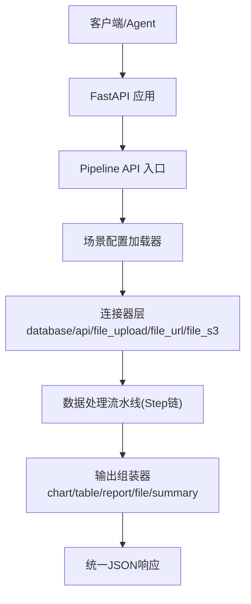
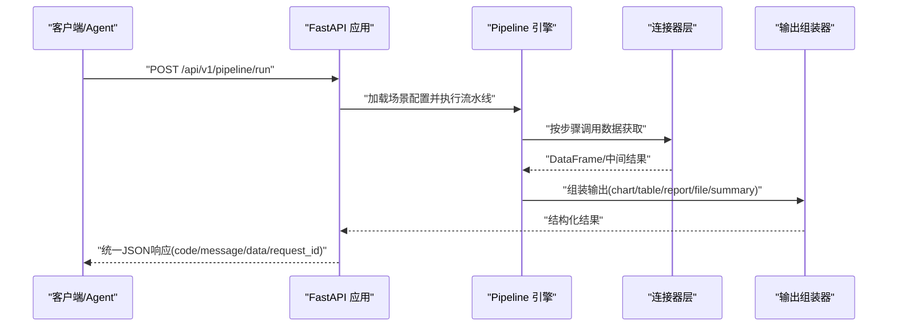

# 开发环境搭建

<cite>
**本文引用的文件**
- [hiagent_辅助_Web_服务需求说明_task-242.md](file://docs\hiagent_辅助_Web_服务需求说明_task-242.md)
</cite>

## 目录
1. [简介](#简介)
2. [项目结构](#项目结构)
3. [核心组件](#核心组件)
4. [架构总览](#架构总览)
5. [详细组件分析](#详细组件分析)
6. [依赖分析](#依赖分析)
7. [性能考虑](#性能考虑)
8. [故障排除指南](#故障排除指南)
9. [结论](#结论)
10. [附录：环境与IDE配置建议](#附录环境与ide配置建议)

## 简介
本指南面向 hiagent 辅助 Web 服务的开发与调试，目标是帮助你在本地快速搭建可运行的开发环境。根据需求说明书，该项目采用 FastAPI + pandas/numpy + DuckDB + matplotlib/plotly + WeasyPrint + httpx + Pydantic + PyYAML + SQLAlchemy + jsonpath-ng + Docker/uvicorn 的技术栈，提供统一接口规范、场景驱动的流水线引擎与多种原子能力（数据处理、可视化、文件与文档、API编排）。本文将基于该技术选型与环境要求，给出完整的安装步骤、IDE推荐配置、测试环境搭建以及常见问题排查方法。

## 项目结构
当前仓库仅包含需求说明文档，尚未包含源代码与配置文件。因此，本节以“预期结构”的方式描述，便于后续落地实现时对照。

- 应用入口与路由：FastAPI 应用、API 路由（数据、可视化、文件、代理、Pipeline）
- 核心模块：连接器层（Connector）、流水线引擎（Pipeline Engine）、输出组装器（Output Assembler）、场景加载器（Scenario Loader）
- 配置与资源：场景 YAML 配置、模板（Jinja2）、静态资源
- 部署与运行：Docker 镜像、环境变量、启动脚本（uvicorn）

[此图为概念性结构图，不直接映射具体源码文件]

## 核心组件
- 统一接口规范：统一的 JSON 响应格式、错误码分段、API Key 认证头
- 场景驱动流水线：通过 YAML 配置描述数据源、处理步骤与输出类型，支持条件分支与步骤级错误处理
- 连接器层：多类型数据源接入，返回统一 DataFrame，凭据从环境变量读取
- 输出组装器：将中间结果渲染为图表、表格、报告或摘要等
- 双模式调用：Pipeline API（一次性全流程）与原子 API（逐步调用）

**章节来源**
- [hiagent_辅助_Web_服务需求说明_task-242.md:25-68](file://docs\hiagent_辅助_Web_服务需求说明_task-242.md#L25-L68)

## 架构总览
下图展示了请求从进入 FastAPI 到最终返回的完整流程，包括 Pipeline 与原子 API 两种模式。

[此图为概念性流程图，不直接映射具体源码文件]

## 详细组件分析
- 连接器层（Connector Layer）
  - 支持数据库直连、外部 REST API、文件上传、URL 下载、对象存储等
  - 所有连接器返回统一 DataFrame；凭据从环境变量读取；注册表模式扩展新连接器
- 流水线引擎（Pipeline Engine）
  - 顺序执行步骤，通过命名引用传递中间数据（PipelineContext）
  - 支持条件分支、步骤级错误处理（skip/abort），每步记录日志与耗时
- 输出组装器（Output Assembler）
  - 支持 chart/table/report/file/summary 五种输出类型，其中 summary 专为 Agent 设计
- 场景配置模型（YAML）
  - data_sources：数据源定义（connector 类型 + 连接配置 + SQL/API 参数 + 请求参数映射）
  - pipeline：处理流水线步骤（action 调用原子能力 + input/output 命名引用）
  - outputs：输出定义（类型 + 数据源引用）

**章节来源**
- [hiagent_辅助_Web_服务需求说明_task-242.md:40-64](file://docs\hiagent_辅助_Web_服务需求说明_task-242.md#L40-L64)

## 依赖分析
根据需求说明书，项目依赖如下：
- Web 框架与服务器：FastAPI、uvicorn
- 数据处理与分析：pandas、numpy、DuckDB、SQLAlchemy
- 可视化与报告：matplotlib、plotly、WeasyPrint、Jinja2（用于 HTML 报告）
- HTTP 客户端：httpx
- 数据校验与配置：Pydantic、PyYAML
- 查询与转换：jsonpath-ng

建议在虚拟环境中安装这些依赖，并通过环境变量管理敏感配置（如数据库连接、API Key）。

**章节来源**
- [hiagent_辅助_Web_服务需求说明_task-242.md:19-22](file://docs\hiagent_辅助_Web_服务需求说明_task-242.md#L19-L22)

## 性能考虑
- 简单接口 < 500ms，数据处理 < 3s，Pipeline 全流程 < 10s
- 使用 DuckDB 提升 DataFrame 查询性能
- 步骤级日志与耗时记录，便于定位瓶颈
- 临时文件流式下载与自动清理，减少磁盘占用

**章节来源**
- [hiagent_辅助_Web_服务需求说明_task-242.md:97-102](file://docs\hiagent_辅助_Web_服务需求说明_task-242.md#L97-L102)

## 故障排除指南
- API Key 认证失败
  - 检查请求头是否携带 X-API-Key
  - 确认服务端已正确配置并校验该密钥
- 数据源连接失败
  - 检查环境变量中的凭据是否正确
  - 验证数据库/外部 API 可达性与权限
- 流水线步骤异常
  - 查看步骤级日志与耗时，定位失败步骤
  - 根据错误码分段（2xxx 数据处理、3xxx 可视化、4xxx 文件文档、5xxx API 编排、6xxx Pipeline 引擎）进行排查
- 性能不达标
  - 检查数据量与查询复杂度
  - 评估是否需要分页、缓存或异步化
- 文件与报告生成问题
  - 确认依赖库（如 WeasyPrint）安装成功
  - 检查模板路径与权限

**章节来源**
- [hiagent_辅助_Web_服务需求说明_task-242.md:25-31](file://docs\hiagent_辅助_Web_服务需求说明_task-242.md#L25-L31)
- [hiagent_辅助_Web_服务需求说明_task-242.md:97-102](file://docs\hiagent_辅助_Web_服务需求说明_task-242.md#L97-L102)

## 结论
基于需求说明书，hiagent 辅助 Web 服务采用 FastAPI 作为核心框架，结合 pandas/numpy/DuckDB 进行数据处理，使用 matplotlib/plotly/WeasyPrint 完成可视化与报告生成，并通过 YAML 配置驱动的场景流水线实现灵活可扩展的业务编排。按照本文的环境搭建与配置建议，可在本地快速构建可运行的开发环境，并进行单元测试与集成测试。

## 附录：环境与IDE配置建议
- Python 版本
  - 建议使用 Python 3.10+（确保与 FastAPI、Pandas、DuckDB 等依赖兼容）
- 依赖安装
  - 使用 pip 在虚拟环境中安装：FastAPI、uvicorn、pandas、numpy、DuckDB、matplotlib、plotly、WeasyPrint、httpx、Pydantic、PyYAML、SQLAlchemy、jsonpath-ng
  - 若使用 Docker，参考 uvicorn 启动方式与镜像基础版本
- IDE 推荐配置
  - VS Code
    - 安装 Python、Pylance、Flask/FastAPI 相关插件
    - 设置解释器为虚拟环境中的 Python
    - 格式化：black/isort（可选），Linting：flake8/pylint（可选）
    - 调试：创建 launch.json，使用 uvicorn 启动 FastAPI 应用，设置断点调试
  - PyCharm
    - 配置 Project Interpreter 指向虚拟环境
    - 添加 Run Configuration：Python 脚本或 Uvicorn Server
    - 启用 Linting 与 Formatting（PEP8/black）
    - 调试：Remote Debug 或本地断点
- 代码规范与质量
  - 统一 JSON 响应格式与错误码分段
  - 使用 Pydantic 进行请求/响应模型校验
  - 使用 PyYAML 解析场景配置，保持可读性与注释支持
- 测试环境搭建
  - 单元测试：使用 pytest，针对数据处理、连接器、输出组装器等模块编写用例
  - 集成测试：模拟外部数据源（如内存 DuckDB、Mock HTTP 服务），端到端验证 Pipeline 流程
  - 覆盖率与报告：pytest-cov 生成覆盖率报告
- 常见环境问题
  - 依赖冲突：优先使用虚拟环境，固定依赖版本
  - 平台差异：Windows/macOS/Linux 下 WeasyPrint 与字体依赖可能不同，需按平台安装系统依赖
  - 环境变量：确保数据库连接、API Key 等通过环境变量注入，避免硬编码

[本节为通用指导，不直接分析具体源码文件]