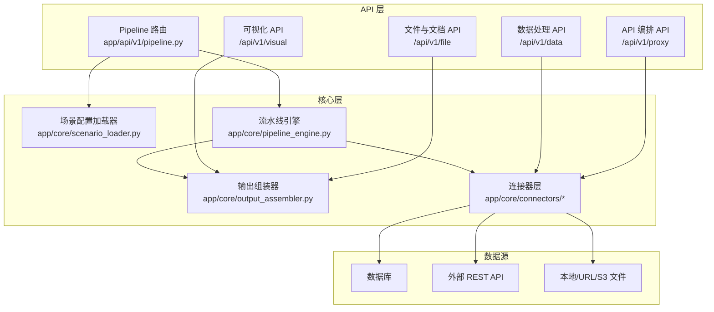
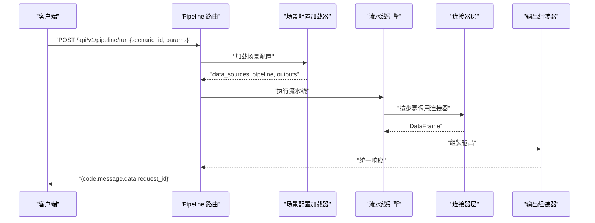
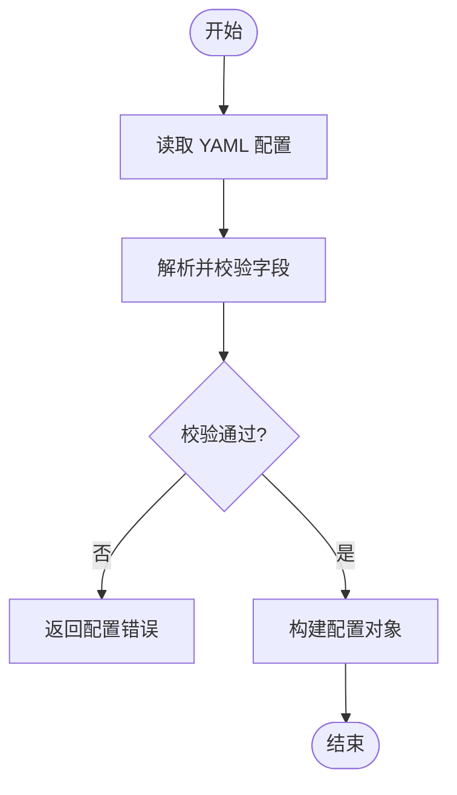
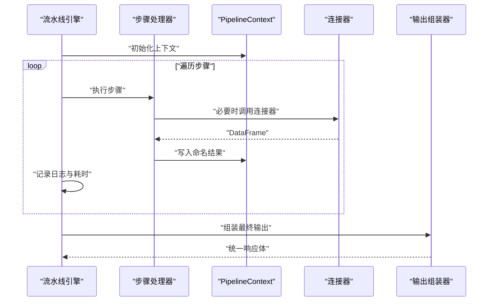
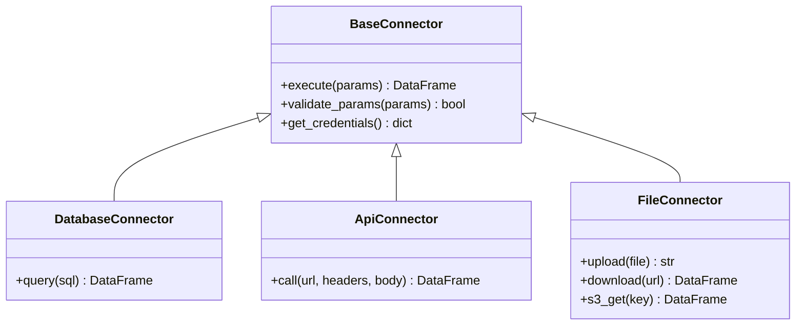
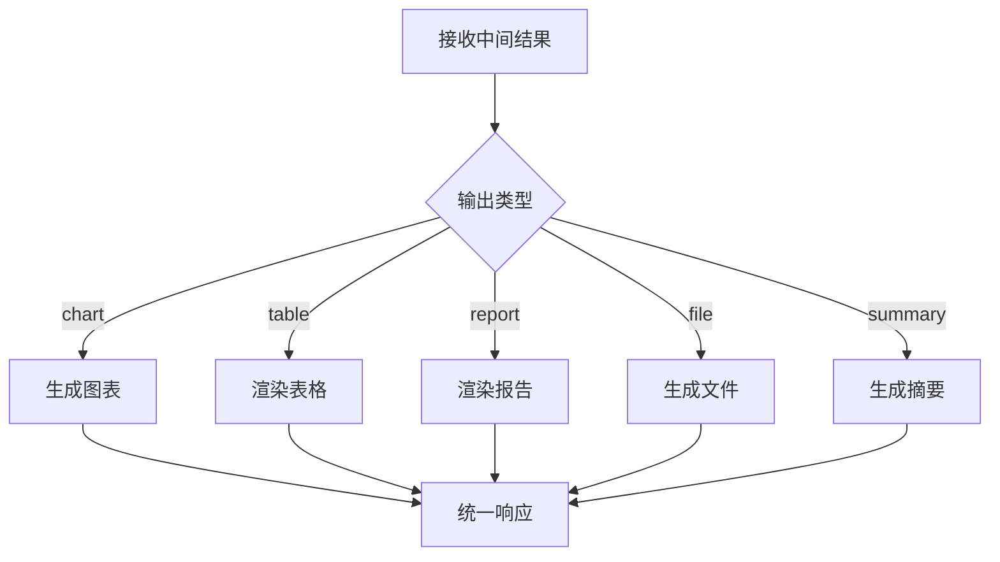
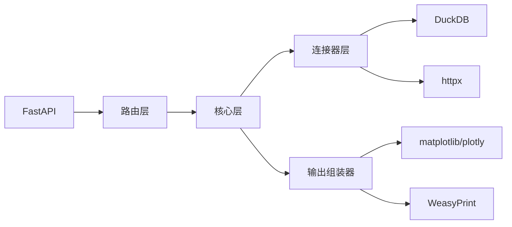

# 开发者指南

<cite>
**本文引用的文件**
- [hiagent_辅助_Web_服务需求说明_task-242.md](file://docs/hiagent_辅助_Web_服务需求说明_task-242.md)
</cite>

## 目录
1. [简介](#简介)
2. [项目结构](#项目结构)
3. [核心组件](#核心组件)
4. [架构总览](#架构总览)
5. [详细组件分析](#详细组件分析)
6. [依赖关系分析](#依赖关系分析)
7. [性能考虑](#性能考虑)
8. [故障诊断与排错](#故障诊断与排错)
9. [结论](#结论)
10. [附录](#附录)

## 简介
本指南面向 hiagent 辅助 Web 服务的开发者，目标是帮助你在理解统一接口、场景驱动流水线引擎和模块化设计的基础上，快速完成环境搭建、功能扩展、测试编写、代码审查与质量保障，以及常见任务的实践与优化。

本项目采用无状态、单一职责、输入输出标准化、容错优先、安全隔离、场景可配置、组件可复用的设计原则，通过 YAML 配置驱动不同业务场景（如竞品分析、机构行为分析、产品规模增量分析），并以“Pipeline API + 原子 API”双模式对外提供服务。

## 项目结构
根据需求说明，项目的关键新增目录与文件如下：
- app/core/pipeline_engine.py — 流水线引擎，负责步骤顺序执行、命名引用传递中间数据、条件分支与步骤级错误处理、日志与耗时记录
- app/core/scenario_loader.py — 场景配置加载器，负责读取并解析 YAML 场景配置，构建 Pipeline 上下文
- app/core/connectors/ — 数据连接器层，包含 base/database/api/file 等实现，统一返回 DataFrame，凭据从环境变量读取，采用注册表模式扩展
- app/core/output_assembler.py — 输出组装器，支持 chart/table/report/file/summary 五种输出类型
- app/scenarios/*.yaml — 场景配置文件，描述 data_sources、pipeline、outputs
- app/api/v1/pipeline.py — Pipeline 路由，提供 POST /api/v1/pipeline/run 等入口

此外，项目还包含以下能力模块：
- 数据处理 /api/v1/data：导入解析、SQL 查询、清洗、统计分析
- 可视化与渲染 /api/v1/visual：图表生成、报告渲染、表格渲染
- 文件与文档操作 /api/v1/file：格式转换、文档生成、打包解压、临时文件管理
- API 编排 /api/v1/proxy：HTTP 代理、数据转换、超时重试、速率限制、鉴权模板

**图示来源**
- [hiagent_辅助_Web_服务需求说明_task-242.md:106-115](file://docs/hiagent_辅助_Web_服务需求说明_task-242.md#L106-L115)

**章节来源**
- [hiagent_辅助_Web_服务需求说明_task-242.md:106-115](file://docs/hiagent_辅助_Web_服务需求说明_task-242.md#L106-L115)

## 核心组件
- 场景配置加载器（scenario_loader）
  - 职责：读取 YAML 场景配置，校验并转换为内部模型；为 Pipeline 引擎提供 data_sources、pipeline、outputs 的元信息
  - 关键点：YAML 可读性好、支持注释；配置热加载在部署阶段启用
- 流水线引擎（pipeline_engine）
  - 职责：按步骤顺序执行，通过 PipelineContext 以命名引用传递中间数据；支持条件分支、步骤级 skip/abort；每步记录日志与耗时
  - 关键点：无状态执行、可观测性（结构化日志）、容错优先
- 连接器层（connectors）
  - 职责：封装数据库直连、REST API 调用、文件上传/下载/对象存储等数据获取逻辑，统一返回 DataFrame；凭据从环境变量读取
  - 关键点：注册表模式扩展，新增连接器改动最小
- 输出组装器（output_assembler）
  - 职责：将中间结果组装为 chart/table/report/file/summary 等标准输出；summary 专为 Agent 设计
  - 关键点：输出标准化，便于上层消费

**章节来源**
- [hiagent_辅助_Web_服务需求说明_task-242.md:33-68](file://docs/hiagent_辅助_Web_服务需求说明_task-242.md#L33-L68)
- [hiagent_辅助_Web_服务需求说明_task-242.md:106-115](file://docs/hiagent_辅助_Web_服务需求说明_task-242.md#L106-L115)

## 架构总览
系统采用“场景驱动的流水线引擎”为核心，结合“原子 API”形成双模式调用：
- 模式 A：Pipeline API（POST /api/v1/pipeline/run）— 传入 scenario_id 与参数，一次完成全流程
- 模式 B：原子 API（/api/v1/data、/api/v1/visual 等）— 逐步调用，Agent 自行编排

统一 JSON 响应格式（code/message/data/request_id），API Key 认证（X-API-Key Header）。错误码按模块分段：1xxx 通用、2xxx 数据处理、3xxx 可视化、4xxx 文件文档、5xxx API 编排、6xxx Pipeline 引擎。

**图示来源**
- [hiagent_辅助_Web_服务需求说明_task-242.md:25-31](file://docs/hiagent_辅助_Web_服务需求说明_task-242.md#L25-L31)
- [hiagent_辅助_Web_服务需求说明_task-242.md:33-68](file://docs/hiagent_辅助_Web_服务需求说明_task-242.md#L33-L68)

**章节来源**
- [hiagent_辅助_Web_服务需求说明_task-242.md:25-31](file://docs/hiagent_辅助_Web_服务需求说明_task-242.md#L25-L31)
- [hiagent_辅助_Web_服务需求说明_task-242.md:33-68](file://docs/hiagent_辅助_Web_服务需求说明_task-242.md#L33-L68)

## 详细组件分析

### 场景配置加载器（scenario_loader）
- 输入：YAML 场景文件路径或内容
- 处理：解析 YAML，校验字段完整性，映射到内部模型（data_sources、pipeline、outputs）
- 输出：供 Pipeline 引擎使用的配置对象
- 扩展点：新增场景只需新增 YAML 文件，无需修改核心代码

**图示来源**
- [hiagent_辅助_Web_服务需求说明_task-242.md:40-44](file://docs/hiagent_辅助_Web_服务需求说明_task-242.md#L40-L44)

**章节来源**
- [hiagent_辅助_Web_服务需求说明_task-242.md:40-44](file://docs/hiagent_辅助_Web_服务需求说明_task-242.md#L40-L44)

### 流水线引擎（pipeline_engine）
- 执行模型：步骤顺序执行，通过 PipelineContext 以命名引用传递中间数据
- 控制流：支持条件分支、步骤级错误处理（skip/abort）
- 可观测性：每步独立记录日志与耗时
- 集成点：与连接器层、输出组装器协作

**图示来源**
- [hiagent_辅助_Web_服务需求说明_task-242.md:57-64](file://docs/hiagent_辅助_Web_服务需求说明_task-242.md#L57-L64)

**章节来源**
- [hiagent_辅助_Web_服务需求说明_task-242.md:57-64](file://docs/hiagent_辅助_Web_服务需求说明_task-242.md#L57-L64)

### 连接器层（connectors）
- 类型：database、api、file_upload、file_url、file_s3（后期扩展）
- 规范：统一返回 DataFrame；凭据从环境变量读取；注册表模式扩展
- 使用：由 Pipeline 引擎或原子 API 按需调用

**图示来源**
- [hiagent_辅助_Web_服务需求说明_task-242.md:46-55](file://docs/hiagent_辅助_Web_服务需求说明_task-242.md#L46-L55)

**章节来源**
- [hiagent_辅助_Web_服务需求说明_task-242.md:46-55](file://docs/hiagent_辅助_Web_服务需求说明_task-242.md#L46-L55)

### 输出组装器（output_assembler）
- 类型：chart、table、report、file、summary
- 职责：将中间结果转换为标准输出；summary 专为 Agent 设计
- 集成：接收 Pipeline 引擎的结果，返回统一响应体

**图示来源**
- [hiagent_辅助_Web_服务需求说明_task-242.md:62-64](file://docs/hiagent_辅助_Web_服务需求说明_task-242.md#L62-L64)

**章节来源**
- [hiagent_辅助_Web_服务需求说明_task-242.md:62-64](file://docs/hiagent_辅助_Web_服务需求说明_task-242.md#L62-L64)

## 依赖关系分析
- 技术栈：FastAPI + pandas/numpy + DuckDB + matplotlib/plotly + WeasyPrint + httpx + Pydantic + PyYAML + SQLAlchemy + jsonpath-ng + Docker/uvicorn
- 模块耦合：
  - API 层依赖核心层（场景加载器、流水线引擎、输出组装器）
  - 核心层依赖连接器层（数据库、API、文件）
  - 输出组装器依赖可视化与文档库
- 外部依赖：DuckDB（SQL 引擎）、httpx（HTTP 客户端）、PyYAML（配置解析）、WeasyPrint（PDF 生成）

**图示来源**
- [hiagent_辅助_Web_服务需求说明_task-242.md:19-21](file://docs/hiagent_辅助_Web_服务需求说明_task-242.md#L19-L21)

**章节来源**
- [hiagent_辅助_Web_服务需求说明_task-242.md:19-21](file://docs/hiagent_辅助_Web_服务需求说明_task-242.md#L19-L21)

## 性能考虑
- 简单接口 < 500ms，数据处理 < 3s，Pipeline 全流程 < 10s
- 建议：
  - 使用 DuckDB 进行高效 SQL 查询
  - 对大数据集进行分页与流式处理
  - 合理设置超时与重试策略
  - 利用连接池与缓存减少重复开销
  - 监控步骤耗时与错误率，定位瓶颈

[本节为通用指导，不直接分析具体文件]

## 故障诊断与排错
- 统一错误码：1xxx 通用、2xxx 数据处理、3xxx 可视化、4xxx 文件文档、5xxx API 编排、6xxx Pipeline 引擎
- 可观测性：结构化日志含 scenario_id + 步骤耗时；提供 /health 健康检查与 /api/v1/pipeline/scenarios 列表
- 常见问题：
  - 配置错误：检查 YAML 字段完整性与类型
  - 连接器失败：检查凭据与环境变量
  - 步骤异常：查看步骤日志与耗时，确认 skip/abort 策略
  - 输出异常：确认输出类型与数据源引用

**章节来源**
- [hiagent_辅助_Web_服务需求说明_task-242.md:25-31](file://docs/hiagent_辅助_Web_服务需求说明_task-242.md#L25-L31)
- [hiagent_辅助_Web_服务需求说明_task-242.md:97-102](file://docs/hiagent_辅助_Web_服务需求说明_task-242.md#L97-L102)

## 结论
hiagent 辅助 Web 服务通过“场景驱动 + 流水线引擎 + 连接器注册表”的设计，实现了高内聚、低耦合、可扩展的架构。开发者可基于 YAML 配置快速接入新场景，并通过原子 API 灵活编排复杂流程。遵循统一接口规范与错误码体系，配合完善的可观测性与性能目标，能够支撑多种业务分析场景的稳定运行。

[本节为总结性内容，不直接分析具体文件]

## 附录

### 开发环境搭建指南
- IDE 配置：建议使用支持 Python 与 FastAPI 的 IDE（如 VS Code、PyCharm），安装相关插件与调试工具
- 调试环境：启用 uvicorn 调试模式，配置环境变量（如 API Key、数据库连接串）
- 测试环境：准备测试用 YAML 场景、Mock 外部 API、本地 DuckDB 数据

[本节为通用指导，不直接分析具体文件]

### 如何扩展新功能
- 添加新的连接器：
  - 在 app/core/connectors/ 下新增实现类，继承 BaseConnector
  - 实现 execute、validate_params、get_credentials 等方法
  - 在注册表中注册新连接器类型
- 添加新的处理器：
  - 在流水线步骤中定义新的 action，实现输入/输出命名引用
  - 确保步骤可独立记录日志与耗时
- 添加新的输出格式化器：
  - 在 output_assembler 中新增类型处理逻辑
  - 确保输出符合统一响应格式

**章节来源**
- [hiagent_辅助_Web_服务需求说明_task-242.md:46-64](file://docs/hiagent_辅助_Web_服务需求说明_task-242.md#L46-L64)

### 代码规范、命名约定与注释标准
- 命名约定：模块与函数使用小写下划线，类名使用大驼峰，常量使用全大写
- 注释标准：公共接口需包含参数、返回值、异常说明；复杂逻辑需添加行内注释
- 代码风格：遵循 PEP8，使用类型注解与 Pydantic 模型校验

[本节为通用指导，不直接分析具体文件]

### 单元测试与集成测试编写指南
- 单元测试：针对连接器、处理器、输出组装器的单个函数进行测试，覆盖正常与异常路径
- 集成测试：模拟完整 Pipeline 执行，验证 YAML 配置与端到端流程
- 测试数据：使用 Mock 外部依赖，准备最小化数据集

[本节为通用指导，不直接分析具体文件]

### 代码审查与质量保证
- 审查要点：单一职责、输入输出标准化、错误处理、性能与安全性
- 自动化：引入静态检查、覆盖率统计、依赖漏洞扫描
- 发布前：回归测试、性能基准测试、文档更新

[本节为通用指导，不直接分析具体文件]

### 常见开发任务示例与最佳实践
- 新增场景：编写 YAML 配置，定义 data_sources、pipeline、outputs
- 调用 Pipeline API：POST /api/v1/pipeline/run，传入 scenario_id 与参数
- 使用原子 API：逐步调用 /api/v1/data、/api/v1/visual 等，组合复杂流程

**章节来源**
- [hiagent_辅助_Web_服务需求说明_task-242.md:65-68](file://docs/hiagent_辅助_Web_服务需求说明_task-242.md#L65-L68)