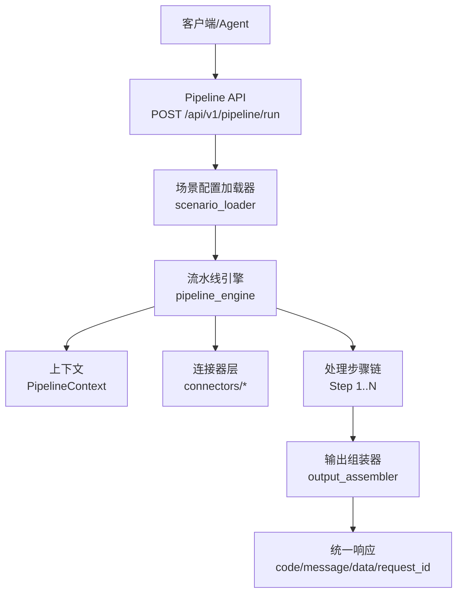
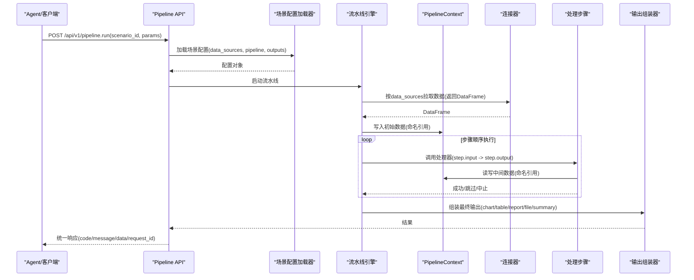
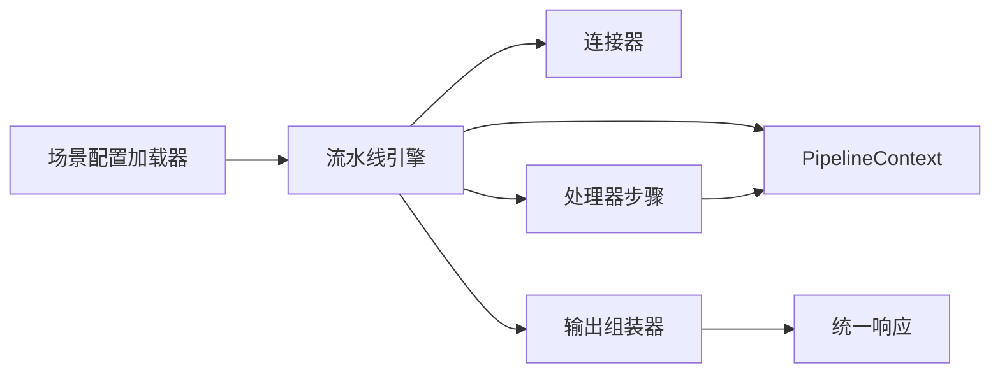
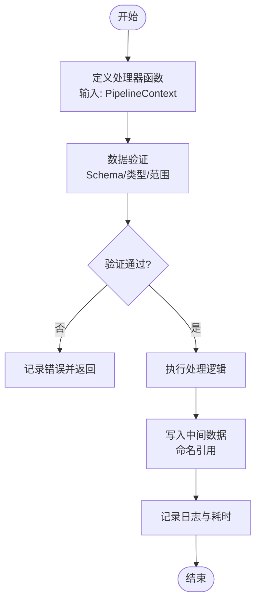
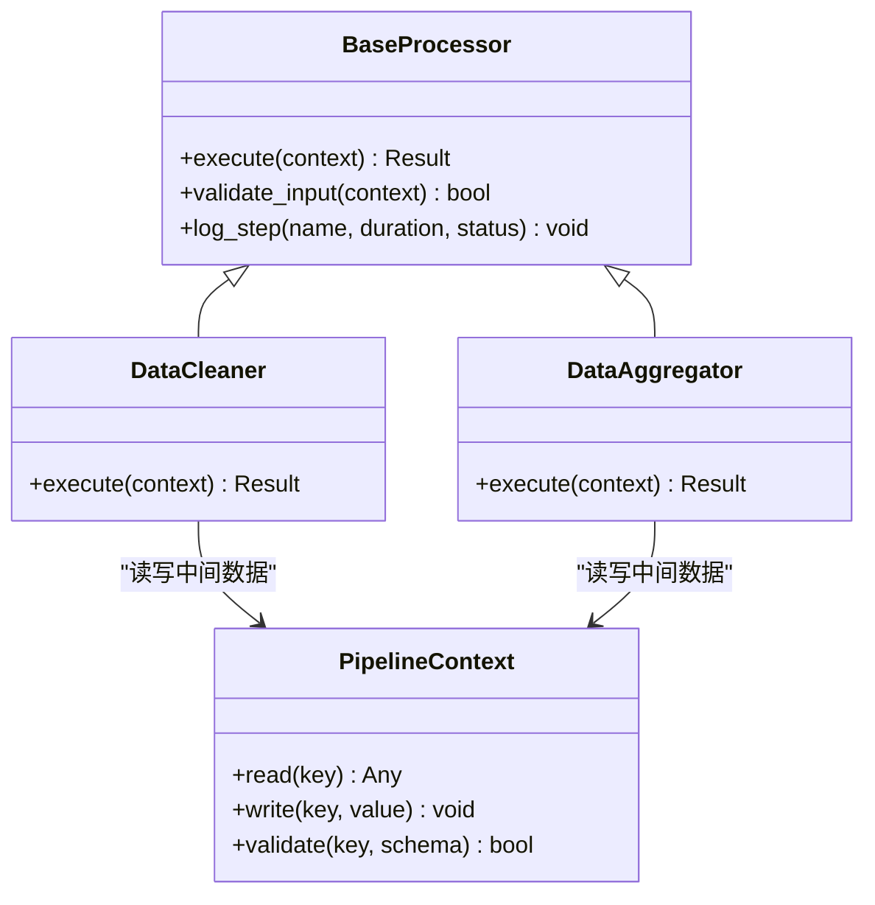

# 处理器扩展

<cite>
**本文引用的文件**
- [需求说明文档](file://docs/20260821100000_hiagent辅助Web服务_需求说明.md)
</cite>

## 目录
1. [简介](#简介)
2. [项目结构](#项目结构)
3. [核心组件](#核心组件)
4. [架构总览](#架构总览)
5. [详细组件分析](#详细组件分析)
6. [依赖关系分析](#依赖关系分析)
7. [性能考虑](#性能考虑)
8. [故障排查指南](#故障排查指南)
9. [结论](#结论)
10. [附录](#附录)

## 简介
本章节面向“如何扩展数据处理步骤”的目标，基于需求说明书中定义的流水线引擎与场景驱动架构，给出创建自定义处理器、定义输入输出规范、实现处理逻辑、注册到Pipeline引擎、支持条件分支与错误处理、以及多种数据处理场景示例的系统化指导。同时涵盖中间数据与上下文传递、执行顺序与依赖管理、性能优化策略，以及数据验证、异常处理和日志记录的最佳实践。

## 项目结构
根据需求说明书，系统采用“场景配置 + Pipeline 引擎 + 连接器 + 输出组装器”的通用架构。关键新增目录与职责如下：
- app/core/pipeline_engine.py：流水线引擎，负责步骤顺序执行、命名引用传递中间数据、条件分支、步骤级错误处理、每步日志与耗时统计
- app/core/scenario_loader.py：场景配置加载器，解析YAML场景配置（data_sources、pipeline、outputs）
- app/core/connectors/*：数据连接器层（database/api/file等），统一返回DataFrame，凭据从环境变量读取，注册表模式扩展
- app/core/output_assembler.py：输出组装器，支持chart/table/report/file/summary五种输出类型
- app/scenarios/*.yaml：场景配置文件，描述数据源、处理步骤与输出
- app/api/v1/pipeline.py：Pipeline API路由，暴露POST /api/v1/pipeline/run

图表来源
- [需求说明文档:33-68](file://docs/20260821100000_hiagent辅助Web服务_需求说明.md#L33-L68)
- [需求说明文档:106-115](file://docs/20260821100000_hiagent辅助Web服务_需求说明.md#L106-L115)

章节来源
- [需求说明文档:33-68](file://docs/20260821100000_hiagent辅助Web服务_需求说明.md#L33-L68)
- [需求说明文档:106-115](file://docs/20260821100000_hiagent辅助Web服务_需求说明.md#L106-L115)

## 核心组件
- 流水线引擎（Pipeline Engine）
  - 步骤顺序执行，通过命名引用在步骤间传递中间数据（PipelineContext）
  - 支持条件分支与步骤级错误处理（skip/abort）
  - 每步独立记录日志和耗时
- 场景配置加载器（Scenario Loader）
  - 解析YAML场景配置，包含data_sources、pipeline、outputs三部分
- 连接器层（Connectors）
  - 数据库、API、文件上传/URL/S3等连接器，统一返回DataFrame
  - 凭据从环境变量读取，注册表模式便于扩展
- 输出组装器（Output Assembler）
  - 生成chart/table/report/file/summary等输出，其中summary专为Agent设计

章节来源
- [需求说明文档:40-68](file://docs/20260821100000_hiagent辅助Web服务_需求说明.md#L40-L68)

## 架构总览
整体流程为：Agent请求进入Pipeline API入口，加载场景配置，依次执行数据获取与数据处理流水线（Step链），最后由输出组装器生成结果并返回统一JSON格式响应。

图表来源
- [需求说明文档:33-68](file://docs/20260821100000_hiagent辅助Web服务_需求说明.md#L33-L68)

## 详细组件分析

### 自定义处理器函数与输入输出规范
- 处理器接口约定
  - 每个处理步骤对应一个处理器函数，接收PipelineContext作为上下文，可读取/写入命名引用的中间数据
  - 输入输出通过YAML中的input/output字段进行命名引用，确保步骤间解耦
- 输入输出规范建议
  - 输入：以命名引用指向上游步骤的输出或连接器返回的DataFrame
  - 输出：将处理结果写入PipelineContext的指定键，供下游步骤引用
- 最佳实践
  - 单一职责：每个处理器只完成一项明确的数据处理任务
  - 幂等性：相同输入产生相同输出，便于重试与缓存
  - 可观测性：记录步骤名称、输入摘要、输出摘要、耗时与状态码

章节来源
- [需求说明文档:40-60](file://docs/20260821100000_hiagent辅助Web服务_需求说明.md#L40-L60)

### 注册处理器到Pipeline引擎
- 注册方式
  - 使用注册表模式将处理器函数映射到步骤action名称，便于YAML配置中直接引用
  - 支持动态加载与热更新，减少重启成本
- 依赖管理
  - 步骤声明依赖关系（如step B依赖step A的输出），引擎自动解析拓扑顺序
  - 循环依赖检测与报错，避免死锁
- 执行顺序
  - 默认顺序执行；可通过条件表达式控制分支跳转
  - 支持并行执行无依赖的步骤以提升吞吐

章节来源
- [需求说明文档:40-60](file://docs/20260821100000_hiagent辅助Web服务_需求说明.md#L40-L60)

### 条件分支与错误处理
- 条件分支
  - 在YAML中为步骤添加条件表达式，满足时执行，否则跳过
  - 支持多分支与嵌套，形成决策树
- 错误处理
  - 步骤级错误处理策略：skip（跳过当前步骤继续）、abort（终止流水线）
  - 捕获异常并记录结构化日志，包含scenario_id、步骤名、错误堆栈、上下文快照
- 容错优先
  - 对不可恢复错误立即中止，对可恢复错误尝试降级或回退

章节来源
- [需求说明文档:57-60](file://docs/20260821100000_hiagent辅助Web服务_需求说明.md#L57-L60)

### 中间数据与上下文传递
- PipelineContext
  - 提供命名空间化的数据存储，步骤通过键名读写中间数据
  - 支持类型校验与版本兼容，避免上下游契约不一致
- 数据流
  - 连接器返回DataFrame写入Context；各步骤读取/转换后写回；输出组装器从Context提取最终数据

章节来源
- [需求说明文档:57-60](file://docs/20260821100000_hiagent辅助Web服务_需求说明.md#L57-L60)

### 执行顺序、依赖管理与性能优化
- 执行顺序
  - 基于依赖图拓扑排序，保证先执行被依赖步骤
  - 条件分支影响实际执行路径，引擎需动态计算
- 依赖管理
  - 显式声明步骤依赖，隐式通过命名引用推断
  - 冲突检测与提示，帮助定位配置问题
- 性能优化策略
  - 批量操作：尽量合并多次小查询为大查询
  - 惰性计算：仅在需要时触发计算
  - 缓存：对昂贵且稳定的中间结果进行缓存（按输入签名）
  - 资源隔离：限制CPU/内存使用，防止单步骤拖垮整体

章节来源
- [需求说明文档:57-60](file://docs/20260821100000_hiagent辅助Web服务_需求说明.md#L57-L60)

### 数据验证、异常处理与日志记录最佳实践
- 数据验证
  - 在进入处理器前对输入Schema进行校验（字段、类型、范围）
  - 对输出进行断言，确保下游消费安全
- 异常处理
  - 统一异常分类（参数错误、数据错误、外部依赖错误）
  - 失败时返回标准错误码与消息，便于上层重试或降级
- 日志记录
  - 结构化日志：包含scenario_id、request_id、步骤名、输入摘要、输出摘要、耗时、状态
  - 分级日志：DEBUG/INFO/WARN/ERROR，便于不同环境切换

章节来源
- [需求说明文档:25-31](file://docs/20260821100000_hiagent辅助Web服务_需求说明.md#L25-L31)
- [需求说明文档:57-60](file://docs/20260821100000_hiagent辅助Web服务_需求说明.md#L57-L60)

### 多种数据处理场景示例
以下为常见数据处理场景及在Pipeline中的编排思路（不展示具体代码，仅给出步骤与数据流）：
- 数据清洗
  - 步骤：读取原始数据 -> 空值填充/删除 -> 类型转换 -> 文本清洗 -> 异常值处理
  - 输出：干净的DataFrame，供后续步骤使用
- 数据转换
  - 步骤：字段映射 -> 维度建模 -> 指标计算 -> 时间序列对齐
  - 输出：标准化后的数据集
- 数据聚合
  - 步骤：分组聚合 -> 透视表 -> 汇总统计
  - 输出：聚合结果表
- 统计分析
  - 步骤：描述性统计 -> 相关性分析 -> 频率分布
  - 输出：统计摘要与可视化数据

章节来源
- [需求说明文档:73-78](file://docs/20260821100000_hiagent辅助Web服务_需求说明.md#L73-L78)

## 依赖关系分析
- 组件耦合
  - Pipeline引擎依赖场景配置加载器与连接器；处理器通过PipelineContext解耦
  - 输出组装器依赖上下文中的最终数据
- 外部依赖
  - 数据库、API、文件系统等外部资源通过连接器访问
  - 第三方库（pandas/numpy/DuckDB等）用于数据处理与分析
- 潜在循环依赖
  - 通过依赖图检测与禁止，确保DAG结构

图表来源
- [需求说明文档:33-68](file://docs/20260821100000_hiagent辅助Web服务_需求说明.md#L33-L68)

章节来源
- [需求说明文档:33-68](file://docs/20260821100000_hiagent辅助Web服务_需求说明.md#L33-L68)

## 性能考虑
- 简单接口 < 500ms，数据处理 < 3s，Pipeline全流程 < 10s（目标）
- 优化手段
  - 批量化与向量化操作
  - 惰性计算与按需物化
  - 中间结果缓存（按输入签名）
  - 资源限流与并发控制
  - 监控与告警（步骤耗时、错误率）

章节来源
- [需求说明文档:97-102](file://docs/20260821100000_hiagent辅助Web服务_需求说明.md#L97-L102)

## 故障排查指南
- 常见问题
  - 步骤执行失败：检查输入Schema、依赖是否就绪、外部依赖可用性
  - 条件分支未生效：核对条件表达式与上下文变量
  - 性能退化：定位耗时步骤，优化查询与计算
- 诊断方法
  - 查看结构化日志（scenario_id、request_id、步骤名、耗时、状态）
  - 启用调试日志，捕获上下文快照与错误堆栈
  - 逐步执行原子API，隔离问题步骤

章节来源
- [需求说明文档:25-31](file://docs/20260821100000_hiagent辅助Web服务_需求说明.md#L25-L31)
- [需求说明文档:57-60](file://docs/20260821100000_hiagent辅助Web服务_需求说明.md#L57-L60)

## 结论
通过场景驱动的Pipeline引擎与注册表模式的处理器扩展机制，系统能够以最小改动接入新的数据处理能力。遵循统一的输入输出规范、条件分支与错误处理策略，结合数据验证、异常处理与结构化日志，可实现高内聚、低耦合、可观测、可扩展的数据处理流水线。

## 附录

### 处理器开发流程图

图表来源
- [需求说明文档:57-60](file://docs/20260821100000_hiagent辅助Web服务_需求说明.md#L57-L60)

### 处理器类图（概念）

图表来源
- [需求说明文档:57-60](file://docs/20260821100000_hiagent辅助Web服务_需求说明.md#L57-L60)