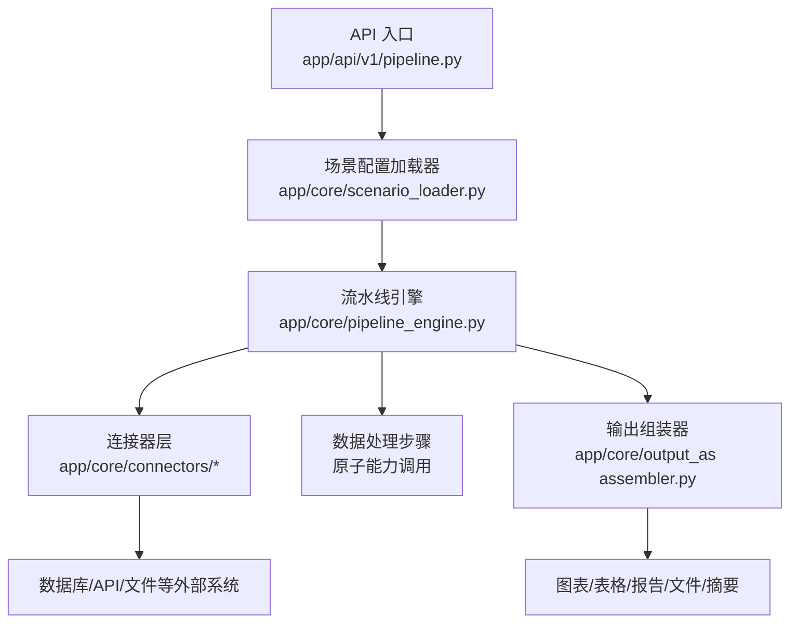
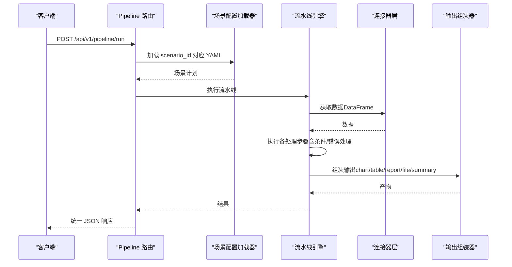
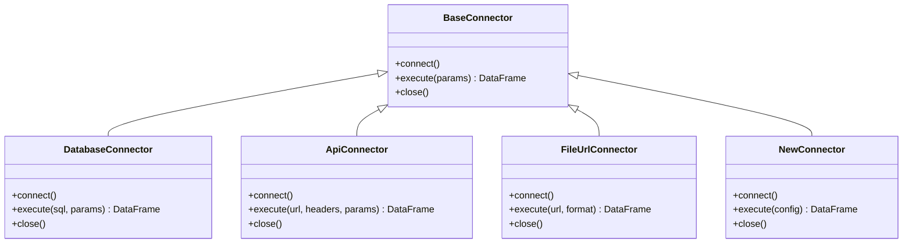
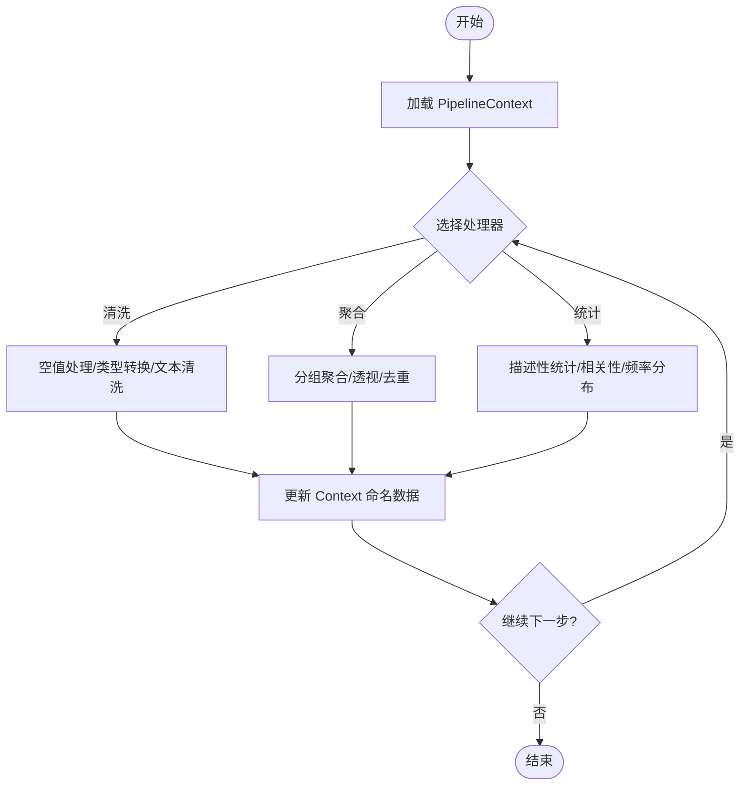
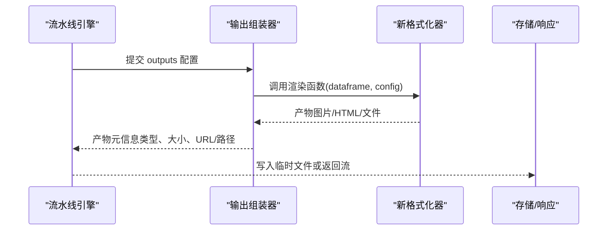
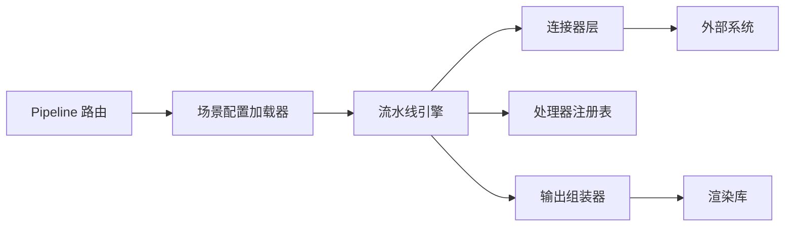

# 扩展开发指南

<cite>
**本文引用的文件**
- [hiagent_辅助_Web_服务需求说明_task-242.md](file://docs\hiagent_辅助_Web_服务需求说明_task-242.md)
</cite>

## 目录
1. [简介](#简介)
2. [项目结构](#项目结构)
3. [核心组件](#核心组件)
4. [架构总览](#架构总览)
5. [详细组件分析](#详细组件分析)
6. [依赖关系分析](#依赖关系分析)
7. [性能考虑](#性能考虑)
8. [故障排查指南](#故障排查指南)
9. [结论](#结论)
10. [附录：最佳实践清单](#附录最佳实践清单)

## 简介
本指南面向需要在 hiagent 辅助 Web 服务中扩展能力的开发者，重点覆盖以下目标：
- 如何添加新的数据连接器（继承 BaseConnector、实现必要方法、注册到连接器注册表）
- 如何扩展数据处理步骤（自定义处理器函数的编写与注册）
- 如何添加新的输出格式化器（支持新文件格式或图表类型）
- 提供完整示例路径指引与最佳实践（错误处理、日志记录、性能优化建议）

本指南基于需求说明书中的架构设计进行展开，确保新增能力与现有 Pipeline 引擎、连接器层、输出组装器保持一致。

## 项目结构
根据需求文档，关键新增目录与职责如下：
- app/core/pipeline_engine.py — 流水线引擎：负责按配置顺序执行步骤、管理上下文、条件分支与错误处理
- app/core/scenario_loader.py — 场景配置加载器：解析 YAML 场景配置，生成可执行的流水线计划
- app/core/connectors/ — 数据连接器：统一抽象 BaseConnector 及具体实现（database/api/file_upload/file_url/file_s3）
- app/core/output_assembler.py — 输出组装器：将中间结果渲染为 chart/table/report/file/summary
- app/scenarios/*.yaml — 场景配置文件：描述 data_sources、pipeline、outputs
- app/api/v1/pipeline.py — Pipeline 路由：暴露 /api/v1/pipeline/run 等接口

图示来源
- [hiagent_辅助_Web_服务需求说明_task-242.md:106-114](file://docs\hiagent_辅助_Web_服务需求说明_task-242.md#L106-L114)

章节来源
- [hiagent_辅助_Web_服务需求说明_task-242.md:106-114](file://docs\hiagent_辅助_Web_服务需求说明_task-242.md#L106-L114)

## 核心组件
- 连接器层（Connector Layer）
  - 统一返回 DataFrame，凭据从环境变量读取
  - 通过注册表模式扩展，新增连接器改动最小
  - 支持 database、api、file_upload、file_url、file_s3 等类型
- 流水线引擎（Pipeline Engine）
  - 步骤顺序执行，通过命名引用传递中间数据（PipelineContext）
  - 支持条件分支、步骤级错误处理（skip/abort）
  - 每步独立记录日志和耗时
- 输出组装器（Output Assembler）
  - 支持 chart/table/report/file/summary 五种输出类型
  - summary 专为 Agent 设计

章节来源
- [hiagent_辅助_Web_服务需求说明_task-242.md:46-67](file://docs\hiagent_辅助_Web_服务需求说明_task-242.md#L46-L67)

## 架构总览
整体流程遵循“场景驱动”的流水线模式：
- 请求进入 Pipeline API
- 加载场景配置（YAML）
- 通过连接器获取数据（DataFrame）
- 在流水线中依次执行数据处理步骤
- 由输出组装器生成最终产物
- 统一 JSON 响应格式返回

图示来源
- [hiagent_辅助_Web_服务需求说明_task-242.md:33-67](file://docs\hiagent_辅助_Web_服务需求说明_task-242.md#L33-L67)

## 详细组件分析

### 添加新的数据连接器
目标：在不修改核心逻辑的前提下，新增一种数据源接入方式（例如新的数据库或新的文件协议）。

步骤概览
- 继承 BaseConnector 基类
- 实现必要方法（如连接建立、查询/下载、关闭资源）
- 将新连接器注册到连接器注册表（以 type 键映射）
- 在场景 YAML 的 data_sources 中使用新 type 并配置连接参数

图示来源
- [hiagent_辅助_Web_服务需求说明_task-242.md:46-55](file://docs\hiagent_辅助_Web_服务需求说明_task-242.md#L46-L55)

实现要点
- 统一返回 DataFrame，便于后续步骤复用
- 凭据从环境变量读取，避免硬编码
- 错误处理：网络异常、认证失败、超时重试、限流退避
- 日志记录：连接建立、查询/下载耗时、错误堆栈（脱敏）
- 性能优化：连接池、分页拉取、列裁剪、并发控制

注册到注册表
- 在连接器模块初始化时，将新连接器类型名映射到实现类
- 确保 type 与 YAML 配置一致

章节来源
- [hiagent_辅助_Web_服务需求说明_task-242.md:46-55](file://docs\hiagent_辅助_Web_服务需求说明_task-242.md#L46-L55)

### 扩展数据处理步骤
目标：在流水线中插入自定义处理步骤，对 DataFrame 进行清洗、转换、统计等操作。

步骤概览
- 编写处理器函数：输入为 PipelineContext（包含命名数据），输出更新 Context
- 注册处理器：将 action 名称映射到处理器函数
- 在场景 YAML 的 pipeline 中引用该 action，并通过 input/output 命名引用串联数据

图示来源
- [hiagent_辅助_Web_服务需求说明_task-242.md:57-67](file://docs\hiagent_辅助_Web_服务需求说明_task-242.md#L57-L67)

实现要点
- 每个步骤独立记录日志与耗时
- 支持条件分支：根据上下文状态决定是否跳过或中止
- 错误处理：步骤级 skip/abort，保证流水线健壮性
- 性能优化：向量化操作、避免不必要拷贝、合理分块处理大数据集

章节来源
- [hiagent_辅助_Web_服务需求说明_task-242.md:57-67](file://docs\hiagent_辅助_Web_服务需求说明_task-242.md#L57-L67)

### 添加新的输出格式化器
目标：支持新的文件格式或图表类型（例如新增图表类型或导出格式）。

步骤概览
- 在输出组装器中注册新的 formatter（type -> 渲染函数）
- 实现渲染函数：接收 DataFrame 与配置，产出二进制或 HTML/Markdown 等
- 在场景 YAML 的 outputs 中声明新类型与参数

图示来源
- [hiagent_辅助_Web_服务需求说明_task-242.md:62-67](file://docs\hiagent_辅助_Web_服务需求说明_task-242.md#L62-L67)

实现要点
- 统一产物结构：类型、内容、元数据
- 错误处理：渲染失败回退策略（如降级为 CSV）
- 日志记录：渲染耗时、文件大小、异常信息
- 性能优化：按需渲染、缓存中间结果、限制最大尺寸

章节来源
- [hiagent_辅助_Web_服务需求说明_task-242.md:62-67](file://docs\hiagent_辅助_Web_服务需求说明_task-242.md#L62-L67)

### 场景配置模型与调用模式
- 场景配置（YAML）
  - data_sources：connector 类型 + 连接配置 + SQL/API 参数 + 请求参数映射
  - pipeline：处理流水线步骤（action 调用原子能力 + input/output 命名引用）
  - outputs：输出定义（chart/table/report/file/summary 类型 + 数据源引用）
- 两种调用模式
  - 模式 A：Pipeline API（POST /api/v1/pipeline/run）— 传入 scenario_id + 参数，一次完成全流程
  - 模式 B：原子 API（/api/v1/data/*、/api/v1/visual/* 等）— 逐步调用，Agent 自行编排

章节来源
- [hiagent_辅助_Web_服务需求说明_task-242.md:40-67](file://docs\hiagent_辅助_Web_服务需求说明_task-242.md#L40-L67)

## 依赖关系分析
- 连接器层依赖外部系统（数据库、HTTP 服务、对象存储、文件系统）
- 流水线引擎依赖场景配置加载器与处理器注册表
- 输出组装器依赖渲染库（matplotlib/plotly、WeasyPrint 等）
- 所有组件通过统一 JSON 响应格式与上游 API 交互

图示来源
- [hiagent_辅助_Web_服务需求说明_task-242.md:106-114](file://docs\hiagent_辅助_Web_服务需求说明_task-242.md#L106-L114)

## 性能考虑
- 简单接口 < 500ms，数据处理 < 3s，Pipeline 全流程 < 10s
- 使用连接池、分页拉取、列裁剪减少 I/O 与内存占用
- 对大数据集采用分块处理与向量化计算
- 启用步骤级耗时统计与结构化日志，便于定位瓶颈
- 对 HTTP 请求设置超时与重试，避免雪崩

章节来源
- [hiagent_辅助_Web_服务需求说明_task-242.md:97-102](file://docs\hiagent_辅助_Web_服务需求说明_task-242.md#L97-L102)

## 故障排查指南
- 统一错误码按模块分段：1xxx 通用、2xxx 数据处理、3xxx 可视化、4xxx 文件文档、5xxx API 编排、6xxx Pipeline 引擎
- 常见问题定位
  - 连接器连接失败：检查环境变量凭据、网络连通性、权限
  - 数据处理异常：查看步骤日志、输入数据形状、类型推断结果
  - 输出渲染失败：确认模板与依赖库版本、输入字段是否满足要求
  - Pipeline 超时：拆分步骤、增加并行度、优化 SQL/查询
- 可观测性
  - 结构化日志包含 scenario_id 与步骤耗时
  - 提供 /health 健康检查与 /api/v1/pipeline/scenarios 列表接口

章节来源
- [hiagent_辅助_Web_服务需求说明_task-242.md:25-30](file://docs\hiagent_辅助_Web_服务需求说明_task-242.md#L25-L30)
- [hiagent_辅助_Web_服务需求说明_task-242.md:97-102](file://docs\hiagent_辅助_Web_服务需求说明_task-242.md#L97-L102)

## 结论
通过在连接器层、数据处理步骤与输出格式化器三个维度进行扩展，hiagent 辅助 Web 服务能够以最小改动支撑更多数据源、更丰富的处理逻辑与多样化的输出形式。结合场景驱动的 YAML 配置与 Pipeline 引擎，可实现高内聚、低耦合的可扩展架构。

## 附录：最佳实践清单
- 连接器
  - 始终返回 DataFrame；凭据来自环境变量；实现 connect/close 生命周期管理
  - 错误处理：区分网络、认证、超时、限流；提供重试与退避
  - 日志：记录连接、查询/下载耗时、错误堆栈（脱敏）
  - 性能：连接池、分页、列裁剪、并发控制
- 数据处理步骤
  - 每个步骤独立日志与耗时；支持条件分支与 skip/abort
  - 向量化操作；避免不必要的数据拷贝；大文件分块处理
- 输出格式化器
  - 统一产物结构；支持降级策略；限制输出大小
  - 渲染失败时记录原因与建议
- 场景配置
  - 清晰命名 input/output；避免循环依赖；保持步骤粒度适中
- 安全与可观测性
  - API Key 认证；SQL 注入防护；文件沙箱
  - 结构化日志与健康检查；监控关键指标