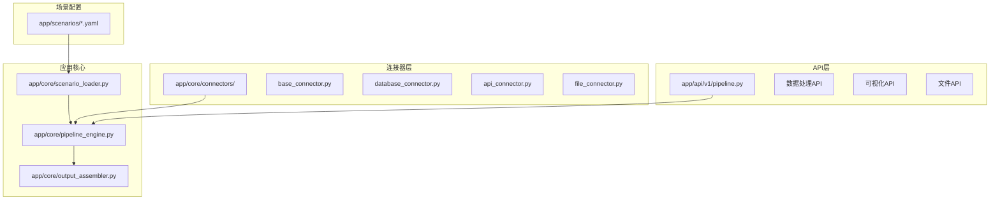
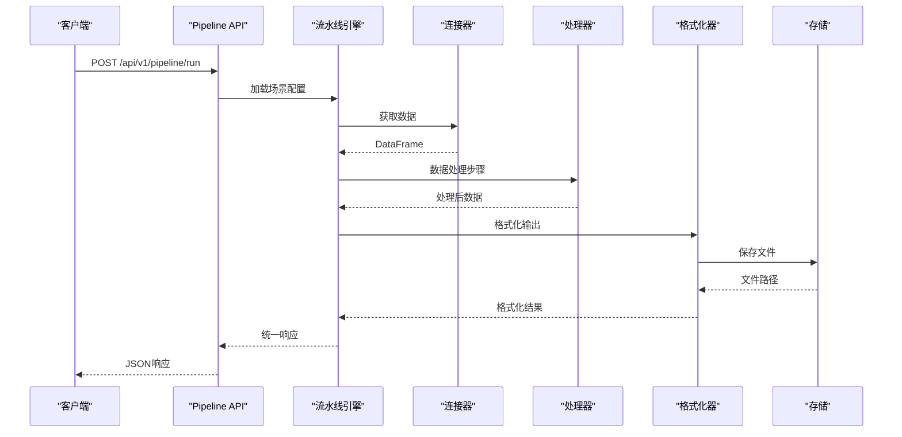
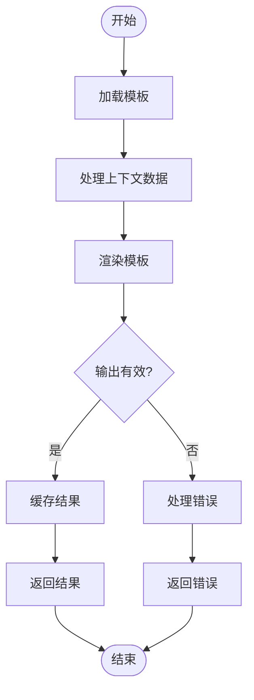
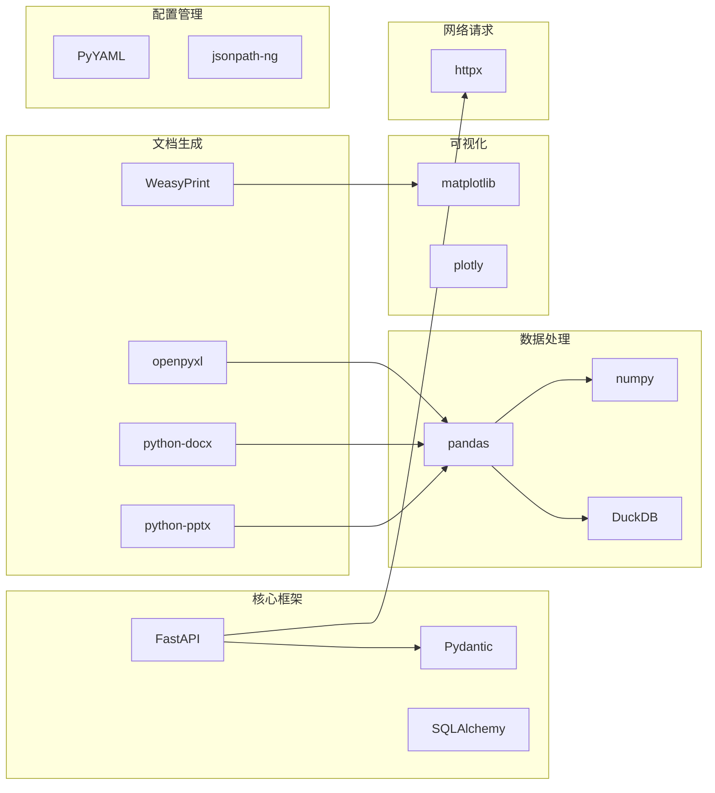

# 输出格式化器扩展

<cite>
**本文档中引用的文件**
- [20260821100000_hiagent辅助Web服务_需求说明.md](file://docs/20260821100000_hiagent辅助Web服务_需求说明.md)
</cite>

## 目录
1. [简介](#简介)
2. [项目结构](#项目结构)
3. [核心组件](#核心组件)
4. [架构总览](#架构总览)
5. [详细组件分析](#详细组件分析)
6. [依赖关系分析](#依赖关系分析)
7. [性能考虑](#性能考虑)
8. [故障排查指南](#故障排查指南)
9. [结论](#结论)
10. [附录](#附录)

## 简介

本文档详细说明如何扩展现有系统的输出格式化器，以支持新的输出格式（如JSON、XML、特定业务格式），并实现格式化器的接口规范。基于hiagent辅助Web服务的需求规格，我们将深入探讨模板渲染、数据转换、文件生成的示例代码，以及如何处理不同数据类型和复杂结构的输出。

该文档涵盖了错误处理和异常情况的处理方式，详细描述格式化器的注册机制、配置选项和性能优化策略。同时提供了PDF、Word、Excel、PPT等多种文档格式的生成示例和最佳实践。

## 项目结构

根据需求规格文档，系统采用场景驱动的流水线引擎架构，关键新增目录包括：



**图表来源**
- [20260821100000_hiagent辅助Web服务_需求说明.md:106-115](file://docs/20260821100000_hiagent辅助Web服务_需求说明.md#L106-L115)

**章节来源**
- [20260821100000_hiagent辅助Web服务_需求说明.md:106-115](file://docs/20260821100000_hiagent辅助Web服务_需求说明.md#L106-L115)

## 核心组件

### 输出组装器（Output Assembler）

输出组装器是格式化器扩展的核心组件，负责将处理后的数据转换为各种格式的输出。根据需求规格，系统支持五种输出类型：chart、table、report、file、summary。

#### 主要职责
- **数据格式转换**：将DataFrame、字典等数据结构转换为指定格式
- **模板渲染**：使用Jinja2进行HTML报告渲染
- **文件生成**：支持多种文档格式的生成
- **流式处理**：大文件的流式传输和处理

#### 支持的输出格式
| 输出类型 | 描述 | 技术实现 |
|---------|------|----------|
| chart | 图表输出 | matplotlib/plotly |
| table | 数据表格 | pandas DataFrame |
| report | HTML报告 | Jinja2模板 |
| file | 文件转换 | 多格式转换器 |
| summary | Agent摘要 | 结构化文本 |

**章节来源**
- [20260821100000_hiagent辅助Web服务_需求说明.md:62-64](file://docs/20260821100000_hiagent辅助Web服务_需求说明.md#L62-L64)
- [20260821100000_hiagent辅助Web服务_需求说明.md:79-87](file://docs/20260821100000_hiagent辅助Web服务_需求说明.md#L79-L87)

## 架构总览

系统采用分层架构设计，确保输出格式化器的可扩展性和可维护性：



**图表来源**
- [20260821100000_hiagent辅助Web服务_需求说明.md:35-38](file://docs/20260821100000_hiagent辅助Web服务_需求说明.md#L35-L38)
- [20260821100000_hiagent辅助Web服务_需求说明.md:66-67](file://docs/20260821100000_hiagent辅助Web服务_需求说明.md#L66-L67)

## 详细组件分析

### 格式化器接口规范

为了实现可扩展的格式化器架构，需要定义统一的接口规范：

#### 基础接口定义

```python
class BaseFormatter(ABC):
    """格式化器基类"""
    
    @abstractmethod
    def format(self, data: Any, config: Dict[str, Any]) -> Any:
        """格式化数据"""
        pass
    
    @abstractmethod
    def validate_config(self, config: Dict[str, Any]) -> bool:
        """验证配置"""
        pass
    
    @abstractmethod
    def get_supported_formats(self) -> List[str]:
        """获取支持的格式列表"""
        pass
```

#### 注册机制

格式化器采用注册表模式，便于动态扩展：

```python
class FormatterRegistry:
    """格式化器注册表"""
    
    def __init__(self):
        self._formatters = {}
    
    def register(self, format_name: str, formatter_class: Type[BaseFormatter]):
        """注册格式化器"""
        self._formatters[format_name] = formatter_class
    
    def get_formatter(self, format_name: str) -> BaseFormatter:
        """获取格式化器实例"""
        if format_name not in self._formatters:
            raise ValueError(f"未找到格式: {format_name}")
        return self._formatters[format_name]()
```

**章节来源**
- [20260821100000_hiagent辅助Web服务_需求说明.md:13-15](file://docs/20260821100000_hiagent辅助Web服务_需求说明.md#L13-L15)

### JSON格式化器实现

JSON格式化器是最基础的格式化器实现，支持复杂数据结构的序列化：

#### 核心功能
- **嵌套对象支持**：处理多层嵌套的数据结构
- **日期时间处理**：自动序列化datetime对象
- **自定义编码器**：支持自定义类型的序列化
- **压缩输出**：可选的gzip压缩

#### 配置选项
```yaml
json_format:
  indent: 2
  ensure_ascii: false
  sort_keys: true
  custom_encoders:
    - "app.formatters.json_encoder.CustomEncoder"
```

### XML格式化器实现

XML格式化器用于生成结构化的XML文档：

#### 特性支持
- **命名空间支持**：完整的XML命名空间处理
- **CDATA支持**：特殊字符的CDATA包装
- **Schema验证**：可选的XSD验证
- **Pretty打印**：可读性优化的输出格式

#### 模板渲染
使用Jinja2进行XML模板渲染：

```python
def render_xml_template(template_path: str, context: Dict[str, Any]) -> str:
    """渲染XML模板"""
    template = jinja_env.get_template(template_path)
    return template.render(context)
```

### 业务特定格式

#### CSV/TSV格式
支持多种分隔符和编码格式：

```python
class BusinessCSVFormatter(BaseFormatter):
    def format(self, data: pd.DataFrame, config: Dict) -> str:
        # 处理业务特定的CSV格式
        pass
```

#### 自定义报告格式
支持企业特定的报告格式要求：

```python
class CustomReportFormatter(BaseFormatter):
    def format(self, data: Any, config: Dict) -> str:
        # 生成企业特定的报告格式
        pass
```

**章节来源**
- [20260821100000_hiagent辅助Web服务_需求说明.md:74-77](file://docs/20260821100000_hiagent辅助Web服务_需求说明.md#L74-L77)

### 模板渲染系统

#### Jinja2模板引擎集成

系统使用Jinja2作为模板引擎，提供强大的模板渲染能力：



**图表来源**
- [20260821100000_hiagent辅助Web服务_需求说明.md:81-82](file://docs/20260821100000_hiagent辅助Web服务_需求说明.md#L81-L82)

#### 模板缓存机制

为了提高性能，实现模板缓存：

```python
class TemplateCache:
    """模板缓存管理器"""
    
    def __init__(self, max_size: int = 100):
        self.cache = OrderedDict()
        self.max_size = max_size
    
    def get_template(self, template_path: str) -> Template:
        """获取模板（带缓存）"""
        if template_path not in self.cache:
            if len(self.cache) >= self.max_size:
                self.cache.popitem(last=False)
            self.cache[template_path] = load_template(template_path)
        return self.cache[template_path]
```

### 数据转换管道

#### 数据类型映射

系统支持多种数据类型的自动转换：

| 源类型 | 目标类型 | 转换规则 |
|--------|----------|----------|
| datetime | string | ISO 8601格式 |
| decimal | float | 保留小数位数 |
| list | string | JSON序列化 |
| dict | string | JSON序列化 |
| None | string | "null"或空字符串 |

#### 复杂结构处理

对于复杂的嵌套数据结构，实现递归处理：

```python
def convert_complex_structure(data: Any, target_type: str) -> Any:
    """递归处理复杂数据结构"""
    if isinstance(data, dict):
        return {k: convert_complex_structure(v, target_type) for k, v in data.items()}
    elif isinstance(data, list):
        return [convert_complex_structure(item, target_type) for item in data]
    else:
        return convert_simple_type(data, target_type)
```

**章节来源**
- [20260821100000_hiagent辅助Web服务_需求说明.md:74-77](file://docs/20260821100000_hiagent辅助Web服务_需求说明.md#L74-L77)

### 文件生成器

#### PDF文档生成

使用WeasyPrint生成高质量的PDF文档：

```python
class PDFGenerator:
    def generate_pdf(self, html_content: str, output_path: str) -> str:
        """生成PDF文档"""
        pdf = HTML(string=html_content).write_pdf(output_path)
        return output_path
```

#### Word文档生成

使用python-docx库生成Word文档：

```python
class WordGenerator:
    def generate_word(self, content: Dict, template_path: str) -> str:
        """生成Word文档"""
        doc = Document(template_path)
        # 填充模板内容
        return doc.save(output_path)
```

#### Excel工作簿生成

使用openpyxl生成Excel文件：

```python
class ExcelGenerator:
    def generate_excel(self, data: pd.DataFrame, sheet_name: str) -> bytes:
        """生成Excel文件"""
        output = io.BytesIO()
        with pd.ExcelWriter(output, engine='openpyxl') as writer:
            data.to_excel(writer, sheet_name=sheet_name, index=False)
        return output.getvalue()
```

#### PPT演示文稿生成

使用python-pptx生成PowerPoint演示文稿：

```python
class PPTGenerator:
    def generate_ppt(self, slides_data: List[Dict], template_path: str) -> bytes:
        """生成PPT演示文稿"""
        presentation = Presentation(template_path)
        # 添加幻灯片内容
        return presentation.save(output_path)
```

**章节来源**
- [20260821100000_hiagent辅助Web服务_需求说明.md:84-88](file://docs/20260821100000_hiagent辅助Web服务_需求说明.md#L84-L88)

## 依赖关系分析

系统的主要依赖关系如下：



**图表来源**
- [20260821100000_hiagent辅助Web服务_需求说明.md:19-21](file://docs/20260821100000_hiagent辅助Web服务_需求说明.md#L19-L21)

**章节来源**
- [20260821100000_hiagent辅助Web服务_需求说明.md:19-21](file://docs/20260821100000_hiagent辅助Web服务_需求说明.md#L19-L21)

## 性能考虑

### 内存优化

1. **流式处理**：对于大文件使用流式读取和处理
2. **增量计算**：避免重复计算中间结果
3. **内存池**：复用大型对象减少GC压力

### 缓存策略

1. **模板缓存**：预编译Jinja2模板
2. **查询缓存**：缓存频繁访问的数据查询结果
3. **格式化缓存**：缓存常用格式的渲染结果

### 并发处理

1. **异步I/O**：使用asyncio处理网络请求
2. **线程池**：CPU密集型任务使用线程池
3. **连接池**：数据库连接池管理

### 监控指标

- **响应时间**：P95、P99延迟
- **吞吐量**：每秒处理的请求数
- **内存使用**：峰值内存占用
- **错误率**：失败请求比例

## 故障排查指南

### 常见错误及解决方案

#### 模板渲染错误

**问题**：Jinja2模板渲染失败
**解决方案**：
1. 检查模板语法正确性
2. 验证上下文数据完整性
3. 启用调试模式查看详细错误信息

#### 文件格式转换错误

**问题**：文件格式转换失败
**解决方案**：
1. 验证输入数据格式
2. 检查依赖库版本兼容性
3. 查看具体的转换日志

#### 内存溢出

**问题**：处理大数据时内存不足
**解决方案**：
1. 使用流式处理替代批量处理
2. 增加系统内存限制
3. 优化数据处理算法

### 调试工具

1. **结构化日志**：包含scenario_id和步骤耗时的日志
2. **性能分析**：使用cProfile分析性能瓶颈
3. **内存分析**：使用memory_profiler检测内存泄漏

**章节来源**
- [20260821100000_hiagent辅助Web服务_需求说明.md:97-102](file://docs/20260821100000_hiagent辅助Web服务_需求说明.md#L97-L102)

## 结论

通过实现统一的格式化器接口规范和注册机制，hiagent辅助Web服务能够灵活地支持多种输出格式。系统设计遵循了无状态、单一职责、输入输出标准化的原则，确保了良好的可扩展性和可维护性。

关键优势包括：
- **模块化设计**：每个格式化器独立实现，便于测试和维护
- **配置驱动**：通过YAML配置灵活控制格式化行为
- **性能优化**：多级缓存和流式处理确保高效运行
- **错误处理**：完善的异常处理和错误恢复机制

未来可以进一步扩展的功能包括：
- 更多文档格式的支持（如Markdown、LaTeX）
- 实时预览功能
- 自定义样式和主题
- 国际化支持

## 附录

### 配置示例

#### YAML配置模板

```yaml
output_configuration:
  default_format: "json"
  formats:
    json:
      enabled: true
      options:
        indent: 2
        ensure_ascii: false
    xml:
      enabled: true
      options:
        encoding: "utf-8"
        pretty_print: true
    pdf:
      enabled: true
      options:
        page_size: "A4"
        margin: "1in"
```

### API端点参考

| 端点 | 方法 | 描述 | 参数 |
|------|------|------|------|
| /api/v1/formatter/register | POST | 注册新的格式化器 | 格式化器类名 |
| /api/v1/formatter/list | GET | 列出所有可用格式 | 无 |
| /api/v1/formatter/validate | POST | 验证格式化配置 | 配置对象 |
| /api/v1/formatter/render | POST | 渲染格式化输出 | 数据和配置 |

### 最佳实践

1. **错误处理**：始终实现适当的错误处理和重试机制
2. **性能监控**：添加详细的性能指标和监控
3. **文档更新**：保持API文档与实际实现同步
4. **测试覆盖**：为新的格式化器编写充分的单元测试
5. **向后兼容**：确保新版本的格式化器与旧版本兼容