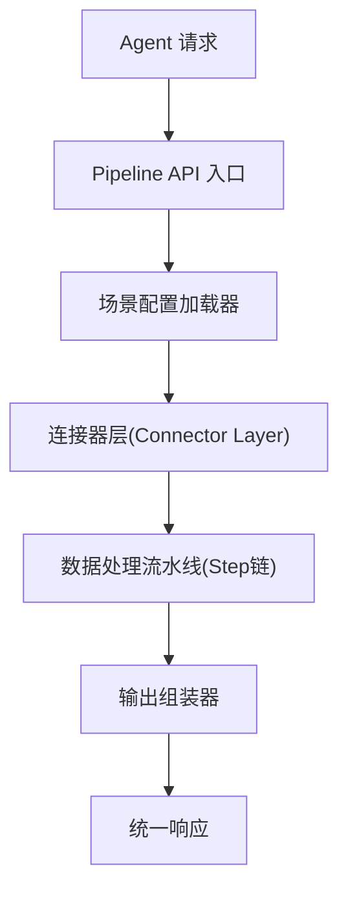
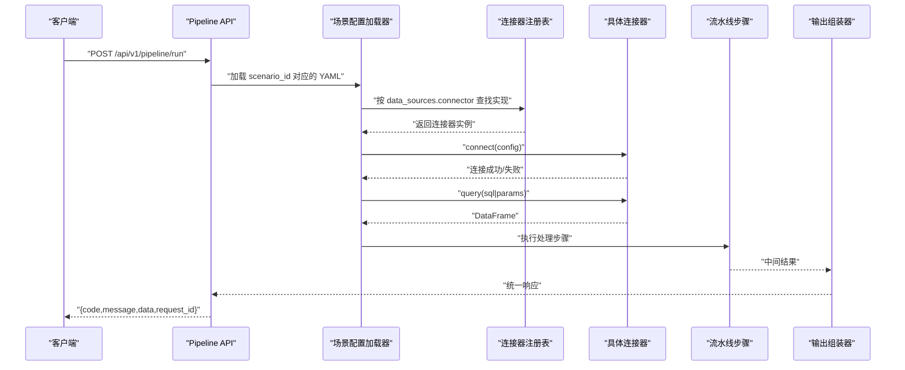
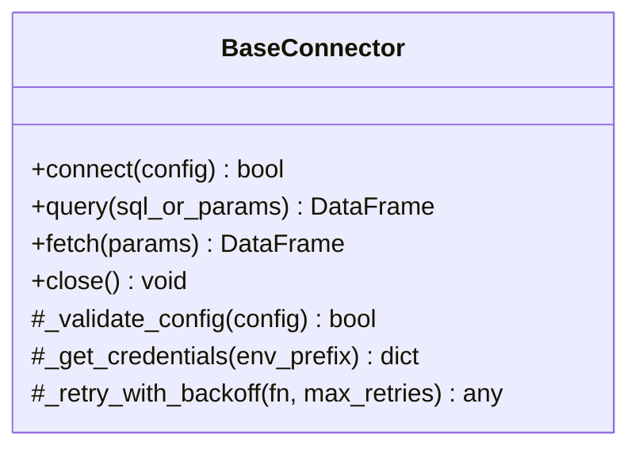
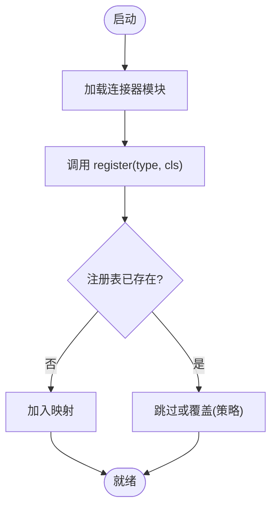
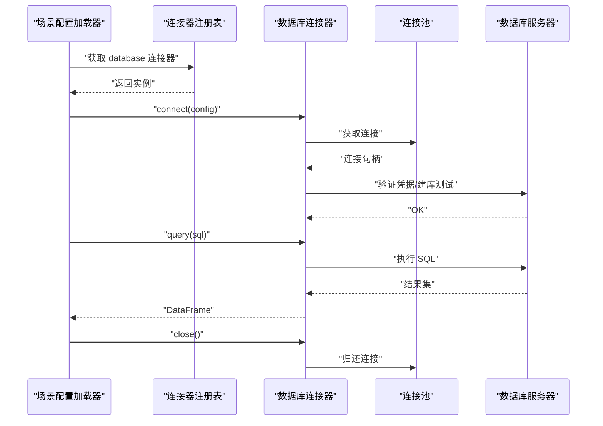
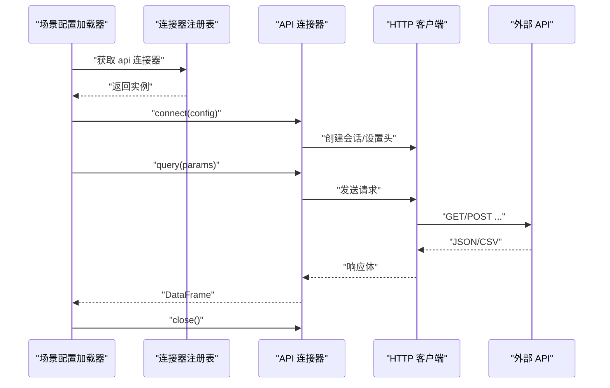
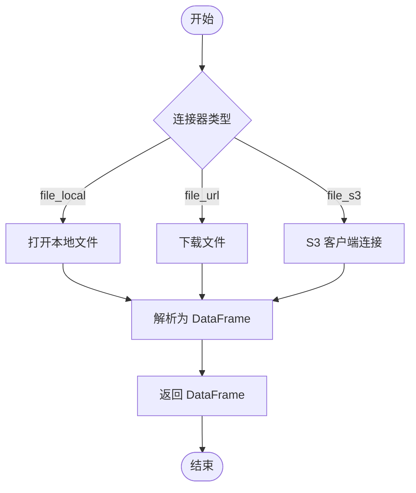
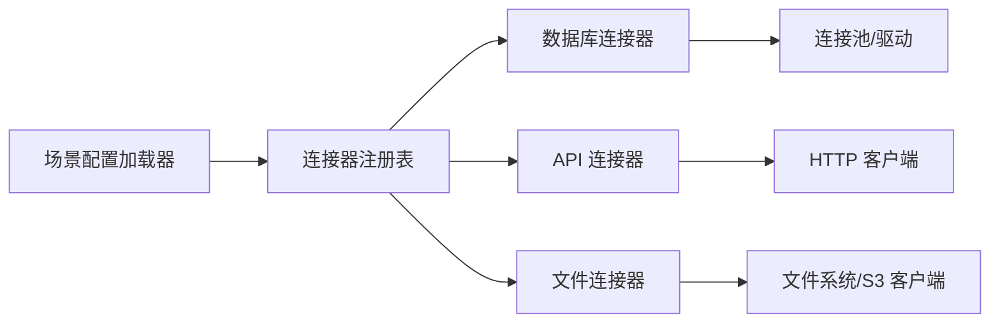

# 连接器扩展

<cite>
**本文引用的文件**
- [需求说明文档](file://docs\20260821100000_hiagent辅助Web服务_需求说明.md)
</cite>

## 目录
1. [引言](#引言)
2. [项目结构](#项目结构)
3. [核心组件](#核心组件)
4. [架构总览](#架构总览)
5. [详细组件分析](#详细组件分析)
6. [依赖关系分析](#依赖关系分析)
7. [性能考虑](#性能考虑)
8. [故障排查指南](#故障排查指南)
9. [结论](#结论)
10. [附录](#附录)

## 引言
本文件面向需要在现有 hiagent 辅助 Web 服务中扩展现有数据连接器能力的工程师。基于需求说明书中的“注册表模式（BaseConnector）”设计，本文将系统阐述如何新增并集成新的连接器类型（如 file_s3、file_local、database、api），实现 connect()、query()、fetch() 等核心方法，确保统一返回 DataFrame；完成连接器的注册、配置与凭据管理；并提供错误处理、连接池管理、性能优化、生命周期管理与并发安全的实践建议。同时给出数据库连接器、API 连接器、文件连接器的具体实现思路与示例路径指引。

## 项目结构
根据需求说明书，项目的关键新增目录包括：
- app/core/pipeline_engine.py — 流水线引擎
- app/core/scenario_loader.py — 场景配置加载器
- app/core/connectors/ — 数据连接器（base/database/api/file）
- app/core/output_assembler.py — 输出组装器
- app/scenarios/*.yaml — 场景配置文件目录
- app/api/v1/pipeline.py — Pipeline 路由

连接器层采用注册表模式，所有连接器返回统一的 DataFrame，凭据从环境变量读取，便于扩展与维护。

图表来源
- [需求说明文档:33-67](file://docs\20260821100000_hiagent辅助Web服务_需求说明.md#L33-L67)

章节来源
- [需求说明文档:106-115](file://docs\20260821100000_hiagent辅助Web服务_需求说明.md#L106-L115)

## 核心组件
- BaseConnector（基类）：定义统一接口 connect()、query()、fetch()，负责连接建立、查询执行、结果获取与资源清理。
- 连接器注册表：集中管理连接器类型到实现的映射，支持动态注册与查找。
- 场景配置加载器：解析 YAML 中的 data_sources，将 connector 类型与连接参数注入对应连接器实例。
- 流水线引擎：按步骤顺序执行，通过命名引用传递中间数据，支持条件分支与步骤级错误处理。
- 输出组装器：将最终数据转换为 chart/table/report/file/summary 等输出格式。

章节来源
- [需求说明文档:40-67](file://docs\20260821100000_hiagent辅助Web服务_需求说明.md#L40-L67)
- [需求说明文档:106-115](file://docs\20260821100000_hiagent辅助Web服务_需求说明.md#L106-L115)

## 架构总览
连接器层位于“数据获取层”，上游为场景配置加载器，下游为数据处理流水线。所有连接器对外暴露统一接口，内部可复用连接池、重试、限流、超时控制等通用能力。

图表来源
- [需求说明文档:33-67](file://docs\20260821100000_hiagent辅助Web服务_需求说明.md#L33-L67)

## 详细组件分析

### BaseConnector 基类与统一接口
- 职责
  - 定义 connect()、query()、fetch() 的抽象方法与默认行为。
  - 提供连接状态、上下文信息、日志与指标埋点。
  - 封装连接池、重试、超时、鉴权等通用逻辑。
- 关键约定
  - query() 与 fetch() 必须返回统一的 DataFrame。
  - 凭据从环境变量读取，避免硬编码。
  - 异常需规范化，便于上层统一处理。

图表来源
- [需求说明文档:46-55](file://docs\20260821100000_hiagent辅助Web服务_需求说明.md#L46-L55)

章节来源
- [需求说明文档:46-55](file://docs\20260821100000_hiagent辅助Web服务_需求说明.md#L46-L55)

### 连接器注册表
- 职责
  - 维护 connector_type -> ConnectorClass 的映射。
  - 提供 register(type_name, cls) 与 get(type_name) 接口。
  - 支持热更新与版本兼容。
- 使用方式
  - 在模块导入时自动注册各连接器实现。
  - 场景配置加载器通过 type_name 获取具体实例。

图表来源
- [需求说明文档:46-55](file://docs\20260821100000_hiagent辅助Web服务_需求说明.md#L46-L55)

章节来源
- [需求说明文档:46-55](file://docs\20260821100000_hiagent辅助Web服务_需求说明.md#L46-L55)

### 数据库连接器（以 MySQL/PostgreSQL/ClickHouse 为例）
- 适用场景
  - 直连数据库进行 SQL 查询与批量数据拉取。
- 关键实现要点
  - connect(): 建立连接或从连接池获取连接；校验凭据与网络连通性。
  - query(): 执行 SQL，将结果集转为 DataFrame；支持分页与大结果集流式处理。
  - fetch(): 按参数获取指定数据集，支持过滤、投影、排序。
  - close(): 释放连接或归还连接池。
- 连接池管理
  - 使用线程安全连接池，限制最大连接数与空闲超时。
  - 支持连接健康检查与自动重连。
- 并发安全
  - 每个线程/协程独立连接或使用连接池分配。
  - 避免跨线程共享连接对象。
- 错误处理
  - 区分网络错误、认证失败、SQL 语法错误、权限不足等。
  - 重试策略针对幂等读操作，写操作谨慎重试。

图表来源
- [需求说明文档:46-55](file://docs\20260821100000_hiagent辅助Web服务_需求说明.md#L46-L55)

章节来源
- [需求说明文档:46-55](file://docs\20260821100000_hiagent辅助Web服务_需求说明.md#L46-L55)

### API 连接器（REST API）
- 适用场景
  - 调用外部 REST API 获取结构化数据。
- 关键实现要点
  - connect(): 初始化会话、设置鉴权头、基础 URL、超时与重试策略。
  - query(): 构造请求参数，发送请求，解析响应为 DataFrame。
  - fetch(): 支持分页、增量拉取、字段映射与清洗。
  - close(): 关闭会话，释放资源。
- 并发与限流
  - 使用异步或线程池并发请求，配合速率限制与退避重试。
  - 对第三方 API 遵守其 QPS 限制与缓存策略。
- 错误处理
  - 区分 4xx/5xx、超时、解析失败、签名错误等。
  - 记录请求上下文以便排查。

图表来源
- [需求说明文档:46-55](file://docs\20260821100000_hiagent辅助Web服务_需求说明.md#L46-L55)

章节来源
- [需求说明文档:46-55](file://docs\20260821100000_hiagent辅助Web服务_需求说明.md#L46-L55)

### 文件连接器（file_local、file_url、file_s3）
- 适用场景
  - 本地文件、URL 下载、对象存储（S3/OSS）等。
- 关键实现要点
  - connect(): 初始化文件系统访问、鉴权（如 S3）、代理与超时。
  - query(): 将文件内容解析为 DataFrame（CSV/Excel/JSON）。
  - fetch(): 按路径/键名获取数据，支持分块读取与内存优化。
  - close(): 关闭流、释放临时文件。
- 性能优化
  - 大文件流式解析，避免一次性加载。
  - 压缩传输与并行分片读取（S3）。
  - 合理设置缓冲区与数据类型推断策略。
- 错误处理
  - 文件不存在、权限不足、格式不匹配、网络中断等。

图表来源
- [需求说明文档:46-55](file://docs\20260821100000_hiagent辅助Web服务_需求说明.md#L46-L55)

章节来源
- [需求说明文档:46-55](file://docs\20260821100000_hiagent辅助Web服务_需求说明.md#L46-L55)

### 生命周期管理与资源清理
- 生命周期阶段
  - 初始化：加载配置、校验参数、建立连接。
  - 运行：执行 query/fetch，返回 DataFrame。
  - 清理：关闭连接、释放资源、回收临时文件。
- 最佳实践
  - 使用上下文管理器或 try/finally 确保资源释放。
  - 连接池需设置最大连接数与空闲超时。
  - 对长连接进行健康检查与自动重连。
- 并发安全
  - 每个任务使用独立连接或从连接池获取。
  - 避免共享可变状态；必要时加锁保护。

章节来源
- [需求说明文档:46-55](file://docs\20260821100000_hiagent辅助Web服务_需求说明.md#L46-L55)

### 错误处理与重试策略
- 分类处理
  - 网络错误：指数退避重试，限制最大重试次数。
  - 认证错误：快速失败，提示配置问题。
  - 数据错误：记录上下文，允许跳过或中止。
- 可观测性
  - 记录请求 ID、耗时、错误码、堆栈摘要。
  - 暴露健康检查端点与指标。

章节来源
- [需求说明文档:97-102](file://docs\20260821100000_hiagent辅助Web服务_需求说明.md#L97-L102)

### 配置与环境变量
- 配置来源
  - 场景 YAML 中的 data_sources 定义 connector 类型与连接参数。
  - 环境变量存放敏感凭据（如数据库密码、API Key、S3 密钥）。
- 安全要求
  - 禁止硬编码凭据。
  - 最小权限原则，按需授予访问权限。
- 热加载
  - 支持配置热更新，重新加载后生效。

章节来源
- [需求说明文档:40-45](file://docs\20260821100000_hiagent辅助Web服务_需求说明.md#L40-L45)
- [需求说明文档:97-102](file://docs\20260821100000_hiagent辅助Web服务_需求说明.md#L97-L102)

## 依赖关系分析
- 组件耦合
  - 场景配置加载器依赖连接器注册表。
  - 连接器依赖连接池、HTTP 客户端、文件系统或数据库驱动。
  - 流水线引擎依赖连接器返回的统一 DataFrame。
- 外部依赖
  - FastAPI、pandas/numpy、DuckDB、httpx、PyYAML、SQLAlchemy 等。
- 潜在循环依赖
  - 通过注册表解耦连接器与调用方，避免直接 import 耦合。

图表来源
- [需求说明文档:106-115](file://docs\20260821100000_hiagent辅助Web服务_需求说明.md#L106-L115)

章节来源
- [需求说明文档:106-115](file://docs\20260821100000_hiagent辅助Web服务_需求说明.md#L106-L115)

## 性能考虑
- 连接池
  - 合理设置最大连接数，避免资源耗尽。
  - 启用连接复用与健康检查。
- 数据读取
  - 大文件流式解析，减少内存占用。
  - 选择性列与过滤下推，降低数据传输量。
- 并发
  - 使用异步或线程池并发请求，配合速率限制。
  - 对 CPU 密集任务进行分片与并行处理。
- 缓存
  - 对频繁访问且变化小的数据进行缓存。
  - 设置合理的过期策略与失效机制。

[本节为通用指导，无需特定文件来源]

## 故障排查指南
- 常见问题
  - 连接失败：检查网络、防火墙、凭据与端口。
  - 认证失败：核对 API Key、Token、证书与权限。
  - 数据解析错误：确认文件格式、编码、字段映射。
  - 超时与限流：调整超时时间、重试策略与速率限制。
- 诊断手段
  - 查看结构化日志（含 scenario_id、步骤耗时）。
  - 检查健康检查端点与指标。
  - 复现最小用例，逐步定位问题。

章节来源
- [需求说明文档:97-102](file://docs\20260821100000_hiagent辅助Web服务_需求说明.md#L97-L102)

## 结论
通过 BaseConnector 基类与注册表模式，hiagent 的连接器层具备良好的可扩展性与一致性。新增连接器只需实现统一接口并完成注册，即可无缝接入场景配置与流水线引擎。结合连接池、重试、限流、缓存与完善的错误处理，可在保证性能与安全的前提下，支撑多种数据源的稳定接入。

[本节为总结性内容，无需特定文件来源]

## 附录
- 连接器类型参考
  - database：直连数据库（MySQL/PostgreSQL/ClickHouse）
  - api：调用外部 REST API
  - file_upload：Agent 上传文件
  - file_url：从 URL 下载文件
  - file_s3：对象存储（后期扩展）
- 统一响应格式
  - code/message/data/request_id
- 两种调用模式
  - Pipeline API：POST /api/v1/pipeline/run
  - 原子 API：/api/v1/data/*、/api/v1/visual/* 等

章节来源
- [需求说明文档:46-55](file://docs\20260821100000_hiagent辅助Web服务_需求说明.md#L46-L55)
- [需求说明文档:25-31](file://docs\20260821100000_hiagent辅助Web服务_需求说明.md#L25-L31)
- [需求说明文档:65-67](file://docs\20260821100000_hiagent辅助Web服务_需求说明.md#L65-L67)