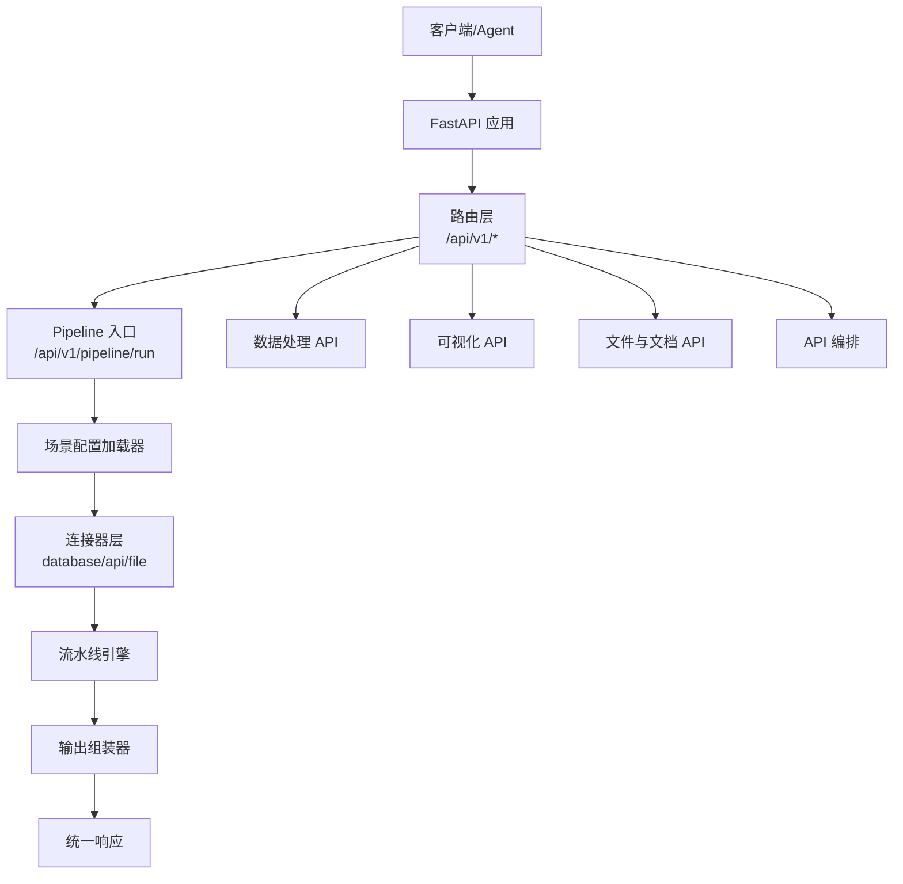
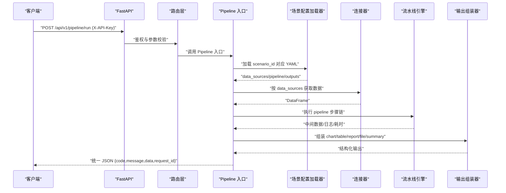
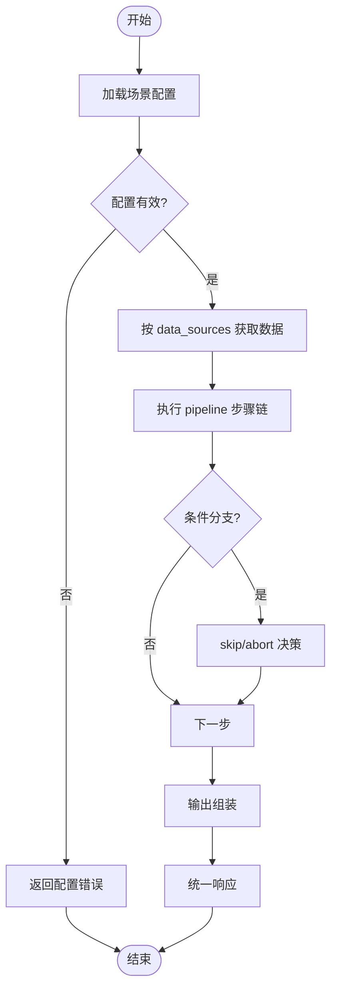

# 测试指南

<cite>
**本文引用的文件**
- [需求说明文档](file://docs/20260821100000_hiagent辅助Web服务_需求说明.md)
</cite>

## 目录
1. [引言](#引言)
2. [项目结构](#项目结构)
3. [核心组件](#核心组件)
4. [架构总览](#架构总览)
5. [详细组件分析](#详细组件分析)
6. [依赖关系分析](#依赖关系分析)
7. [性能考虑](#性能考虑)
8. [故障排查指南](#故障排查指南)
9. [结论](#结论)
10. [附录](#附录)

## 引言
本测试指南面向 hiagent 辅助 Web 服务，目标是帮助开发者与测试工程师编写高质量的单元测试、集成测试、Pipeline 流程测试，并搭建可复用的测试环境与数据准备方案。同时提供性能与压力测试方法、覆盖率要求以及持续集成配置建议，确保服务在“无状态、单一职责、输入输出标准化、容错优先、安全隔离、场景可配置、组件可复用”的原则下稳定交付。

## 项目结构
根据需求说明，hiagent 采用“场景驱动的流水线引擎”架构，关键新增目录与模块如下：
- app/core/pipeline_engine.py — 流水线引擎
- app/core/scenario_loader.py — 场景配置加载器
- app/core/connectors/ — 数据连接器（base/database/api/file）
- app/core/output_assembler.py — 输出组装器
- app/scenarios/*.yaml — 场景配置文件
- app/api/v1/pipeline.py — Pipeline 路由

图表来源
- [需求说明文档:33-68](file://docs/20260821100000_hiagent辅助Web服务_需求说明.md#L33-L68)

章节来源
- [需求说明文档:106-115](file://docs/20260821100000_hiagent辅助Web服务_需求说明.md#L106-L115)

## 核心组件
- 流水线引擎：顺序执行步骤，通过命名引用传递中间数据；支持条件分支、步骤级错误处理（skip/abort），每步记录日志与耗时。
- 场景配置加载器：从 YAML 读取 data_sources、pipeline、outputs 等配置，驱动连接器与输出组装。
- 连接器层：统一 DataFrame 返回，凭据从环境变量读取，注册表模式扩展。
- 输出组装器：chart/table/report/file/summary 五种输出类型，summary 专为 Agent 设计。
- API 路由：统一 JSON 响应格式（code/message/data/request_id），API Key 认证（X-API-Key Header）。

章节来源
- [需求说明文档:25-31](file://docs/20260821100000_hiagent辅助Web服务_需求说明.md#L25-L31)
- [需求说明文档:40-68](file://docs/20260821100000_hiagent辅助Web服务_需求说明.md#L40-L68)

## 架构总览
下图展示请求从进入 FastAPI 到 Pipeline 执行与结果返回的端到端流程，强调认证、配置加载、连接器、引擎与输出组装的关键交互点。

图表来源
- [需求说明文档:25-31](file://docs/20260821100000_hiagent辅助Web服务_需求说明.md#L25-L31)
- [需求说明文档:40-68](file://docs/20260821100000_hiagent辅助Web服务_需求说明.md#L40-L68)

## 详细组件分析

### 单元测试：设计与实现要点
- 测试范围
  - 场景配置加载器：验证 YAML 解析、字段校验、默认值填充、异常路径（缺失字段、非法类型）。
  - 连接器：数据库/API/文件上传/URL 下载等连接器的输入校验、错误处理、超时重试、凭据读取。
  - 流水线引擎：步骤顺序执行、条件分支、skip/abort、上下文传递、日志与耗时统计。
  - 输出组装器：chart/table/report/file/summary 生成逻辑、模板渲染、异常回退。
  - API 路由：统一响应格式、API Key 认证、参数校验、错误码分段。
- Mock 策略
  - 使用标准库或第三方库对 I/O 与外部依赖进行替换：网络请求、文件系统、数据库连接、时间/随机数。
  - 针对连接器：Mock 外部 API 与数据库查询，返回固定 DataFrame 或异常以覆盖边界。
  - 针对输出组装器：Mock 模板渲染与绘图后端，仅断言入参与输出结构。
- 断言方法
  - 断言 HTTP 状态码、JSON 结构（code/message/data/request_id）、业务错误码分段。
  - 断言 DataFrame 形状、列名、数据类型、空值与异常值处理结果。
  - 断言日志包含 scenario_id、步骤耗时、关键上下文信息。
- 用例设计建议
  - 正向用例：最小可用配置、典型数据、常见聚合与可视化。
  - 反向用例：非法输入、缺失必填项、权限不足、下游超时/失败、磁盘空间不足。
  - 边界用例：超大 DataFrame、特殊字符、编码问题、并发访问临时文件。

章节来源
- [需求说明文档:25-31](file://docs/20260821100000_hiagent辅助Web服务_需求说明.md#L25-L31)
- [需求说明文档:40-68](file://docs/20260821100000_hiagent辅助Web服务_需求说明.md#L40-L68)

### 集成测试：数据库、API、Pipeline 流程
- 数据库测试
  - 使用独立测试数据库实例（如内存 DuckDB 或测试环境 MySQL/PostgreSQL/ClickHouse）。
  - 初始化测试数据后执行 SQL 查询与清洗逻辑，断言结果集一致性与性能阈值。
  - 验证凭据从环境变量读取，避免硬编码。
- API 接口测试
  - 覆盖 /api/v1/data、/api/v1/visual、/api/v1/file、/api/v1/proxy 等原子接口。
  - 验证统一响应格式、错误码分段、API Key 认证、速率限制与超时重试。
- Pipeline 流程测试
  - 基于 YAML 场景配置，端到端执行 /api/v1/pipeline/run。
  - 断言各步骤日志、耗时、中间数据、最终输出（chart/table/report/file/summary）。
  - 验证条件分支与 skip/abort 行为是否符合预期。

章节来源
- [需求说明文档:73-94](file://docs/20260821100000_hiagent辅助Web服务_需求说明.md#L73-L94)
- [需求说明文档:40-68](file://docs/20260821100000_hiagent辅助Web服务_需求说明.md#L40-L68)

### 测试环境搭建与数据准备
- 环境要求
  - Python 环境、FastAPI、pandas/numpy、DuckDB、matplotlib/plotly、WeasyPrint、httpx、Pydantic、PyYAML、SQLAlchemy、jsonpath-ng、uvicorn。
  - Docker 容器化部署，环境变量配置（数据库连接、API Key、临时目录等）。
- 测试数据
  - 预置 CSV/Excel/JSON 样例文件，覆盖编码检测、类型推断、空值与异常值。
  - 准备最小数据集与大数据集，用于性能与稳定性验证。
  - 为外部 API 准备 Mock 响应或本地回放文件。
- 配置管理
  - 使用 .env 或 CI 密钥管理工具注入敏感信息。
  - 场景 YAML 分离测试与生产配置，支持热加载验证。

章节来源
- [需求说明文档:19-23](file://docs/20260821100000_hiagent辅助Web服务_需求说明.md#L19-L23)
- [需求说明文档:97-103](file://docs/20260821100000_hiagent辅助Web服务_需求说明.md#L97-L103)

### 性能测试与压力测试
- 目标与指标
  - 简单接口 < 500ms，数据处理 < 3s，Pipeline 全流程 < 10s。
  - 吞吐、延迟分布、错误率、资源占用（CPU/内存/IO）。
- 方法与工具
  - 使用压测工具模拟并发请求，覆盖原子 API 与 Pipeline 入口。
  - 监控链路日志与指标，定位瓶颈（I/O、序列化、绘图渲染、模板渲染）。
  - 对大 DataFrame 与复杂可视化进行专项压测。
- 优化建议
  - 缓存热点数据与模板渲染结果。
  - 异步化非阻塞操作（网络请求、文件 IO）。
  - 合理分页与流式处理，降低内存峰值。

章节来源
- [需求说明文档:97-102](file://docs/20260821100000_hiagent辅助Web服务_需求说明.md#L97-L102)

### 测试覆盖率与持续集成
- 覆盖率要求
  - 核心模块（pipeline_engine、scenario_loader、connectors、output_assembler、API 路由）行覆盖率 ≥ 80%，分支覆盖率 ≥ 70%。
  - 关键路径（认证、错误处理、异常回退）必须全覆盖。
- 持续集成
  - 在 CI 中执行单元测试、集成测试、覆盖率报告与质量门禁。
  - 构建 Docker 镜像并运行冒烟测试，验证健康检查与健康端点。
  - 发布前执行性能基线对比，防止回归。

章节来源
- [需求说明文档:97-103](file://docs/20260821100000_hiagent辅助Web服务_需求说明.md#L97-L103)

## 依赖关系分析
- 组件耦合与内聚
  - 流水线引擎与连接器通过统一 DataFrame 解耦，便于替换与扩展。
  - 输出组装器与渲染后端（matplotlib/plotly/WeasyPrint）通过配置与模板解耦。
- 外部依赖
  - 数据库（MySQL/PostgreSQL/ClickHouse/DuckDB）、HTTP 客户端（httpx）、模板引擎（Jinja2）、绘图与文档生成库。
- 潜在风险
  - 外部 API 不稳定导致 Pipeline 失败，需增强重试与降级策略。
  - 大文件与复杂图表渲染可能成为性能瓶颈，需监控与限流。

章节来源
- [需求说明文档:40-68](file://docs/20260821100000_hiagent辅助Web服务_需求说明.md#L40-L68)
- [需求说明文档:73-94](file://docs/20260821100000_hiagent辅助Web服务_需求说明.md#L73-L94)

## 性能考虑
- 数据层面
  - 使用 DuckDB 进行高效查询与聚合，减少 pandas 中间对象创建。
  - 对大表进行分区与索引优化，避免全表扫描。
- 渲染层面
  - 按需启用图表类型与分辨率，避免不必要的重绘。
  - 模板渲染缓存，减少重复计算。
- 系统层面
  - 设置合理的超时与重试策略，避免雪崩。
  - 监控与告警：慢请求、错误率突增、资源耗尽。

[本节为通用指导，不直接分析具体文件]

## 故障排查指南
- 常见问题
  - API Key 认证失败：检查 X-API-Key 头与环境变量配置。
  - 连接器连接失败：核对凭据、网络连通性、防火墙策略。
  - Pipeline 步骤失败：查看步骤日志与耗时，确认输入数据与依赖是否就绪。
  - 渲染失败：检查模板语法、字体与依赖库安装。
- 诊断手段
  - 启用结构化日志，包含 scenario_id、步骤耗时、上下文信息。
  - 使用 /health 与健康检查端点验证服务可用性。
  - 收集错误堆栈与请求 ID，便于追踪定位。

章节来源
- [需求说明文档:25-31](file://docs/20260821100000_hiagent辅助Web服务_需求说明.md#L25-L31)
- [需求说明文档:97-102](file://docs/20260821100000_hiagent辅助Web服务_需求说明.md#L97-L102)

## 结论
本测试指南围绕 hiagent 的流水线引擎与原子 API，提供了从单元到集成、从功能到性能的完整测试策略。通过严格的用例设计、Mock 策略、覆盖率要求与持续集成实践，确保服务在高可用、高性能与安全隔离的前提下稳定演进。建议在迭代过程中持续完善测试套件与监控体系，保障质量与效率双提升。

[本节为总结性内容，不直接分析具体文件]

## 附录

### 测试流程图（Pipeline 步骤执行）

图表来源
- [需求说明文档:40-68](file://docs/20260821100000_hiagent辅助Web服务_需求说明.md#L40-L68)