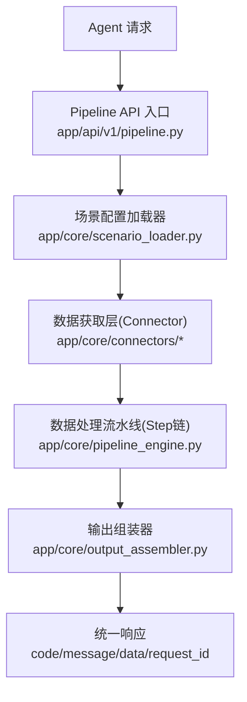
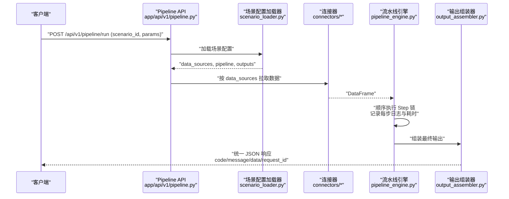
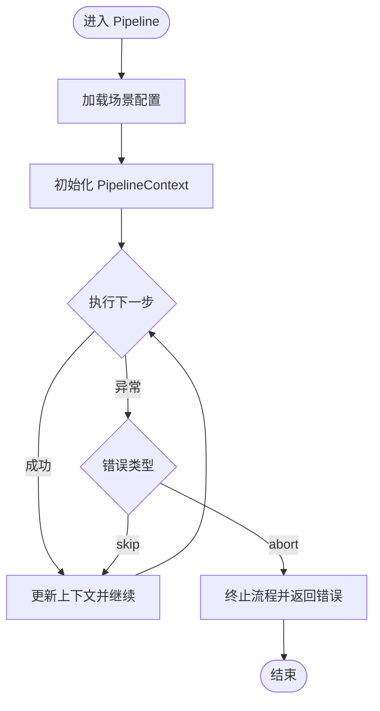
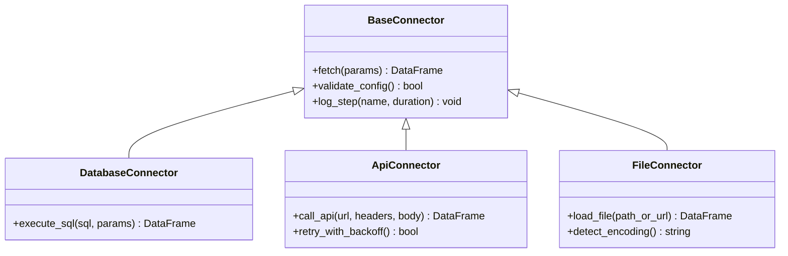
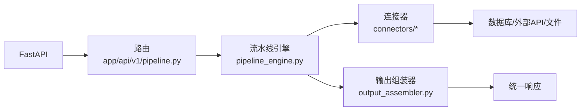

# 调试与故障排除

<cite>
**本文引用的文件**
- [需求说明书](file://docs/20260821100000_hiagent辅助Web服务_需求说明.md)
</cite>

## 目录
1. [简介](#简介)
2. [项目结构](#项目结构)
3. [核心组件](#核心组件)
4. [架构总览](#架构总览)
5. [详细组件分析](#详细组件分析)
6. [依赖关系分析](#依赖关系分析)
7. [性能考虑](#性能考虑)
8. [故障排除指南](#故障排除指南)
9. [结论](#结论)
10. [附录](#附录)

## 简介
本指南面向 hiagent 辅助 Web 服务的开发与运维人员，聚焦于调试与故障排除。内容覆盖日志分析、错误追踪、性能监控、常见问题诊断（数据库连接、API 调用失败、数据处理异常）、慢查询与内存优化，以及调试技巧与最佳实践。所有建议均基于项目的统一接口规范、Pipeline 引擎设计与非功能性需求，确保在现有架构下可落地执行。

## 项目结构
根据需求文档，hiagent 采用“场景驱动的流水线引擎”架构，关键新增目录与职责如下：
- app/core/pipeline_engine.py：流水线引擎，负责步骤顺序执行、上下文传递、条件分支与步骤级错误处理
- app/core/scenario_loader.py：场景配置加载器，从 YAML 加载 data_sources、pipeline、outputs
- app/core/connectors/：数据连接器（base/database/api/file），统一返回 DataFrame
- app/core/output_assembler.py：输出组装器，生成 chart/table/report/file/summary
- app/scenarios/*.yaml：场景配置文件
- app/api/v1/pipeline.py：Pipeline API 路由，暴露 /api/v1/pipeline/run

图表来源
- [需求说明书:33-68](file://docs/20260821100000_hiagent辅助Web服务_需求说明.md#L33-L68)

章节来源
- [需求说明书:33-68](file://docs/20260821100000_hiagent辅助Web服务_需求说明.md#L33-L68)
- [需求说明书:106-114](file://docs/20260821100000_hiagent辅助Web服务_需求说明.md#L106-L114)

## 核心组件
- Pipeline 引擎：顺序执行 Step 链，通过 PipelineContext 传递中间数据；支持条件分支、步骤级 skip/abort；每步独立记录日志和耗时
- 场景配置加载器：解析 YAML，构建 data_sources、pipeline、outputs 模型
- 连接器层：database/api/file_upload/file_url/file_s3，统一返回 DataFrame；凭据来自环境变量；注册表模式扩展
- 输出组装器：chart/table/report/file/summary，其中 summary 专为 Agent 设计
- API 路由：提供 Pipeline 模式（/api/v1/pipeline/run）与原子 API（/api/v1/data/*、/api/v1/visual/* 等）

章节来源
- [需求说明书:33-68](file://docs/20260821100000_hiagent辅助Web服务_需求说明.md#L33-L68)
- [需求说明书:71-94](file://docs/20260821100000_hiagent辅助Web服务_需求说明.md#L71-L94)

## 架构总览
hiagent 的请求流遵循“无状态、单一职责、输入输出标准化、容错优先”的原则，并通过结构化日志实现可观测性。

图表来源
- [需求说明书:33-68](file://docs/20260821100000_hiagent辅助Web服务_需求说明.md#L33-L68)
- [需求说明书:71-94](file://docs/20260821100000_hiagent辅助Web服务_需求说明.md#L71-L94)

## 详细组件分析

### Pipeline 引擎（步骤执行与错误处理）
- 执行策略：顺序执行，通过命名引用传递中间数据；支持条件分支与步骤级错误处理（skip/abort）
- 可观测性：每步独立记录日志与耗时，便于定位瓶颈与异常
- 调试要点：
  - 检查步骤入参/出参命名是否一致
  - 关注 skip/abort 触发条件
  - 结合 request_id 与 scenario_id 关联全链路日志

图表来源
- [需求说明书:33-68](file://docs/20260821100000_hiagent辅助Web服务_需求说明.md#L33-L68)

章节来源
- [需求说明书:33-68](file://docs/20260821100000_hiagent辅助Web服务_需求说明.md#L33-L68)

### 连接器层（数据库/API/文件）
- 统一返回 DataFrame，屏蔽底层差异
- 凭据从环境变量读取，避免硬编码
- 注册表模式便于扩展新连接器
- 调试要点：
  - 校验环境变量与连接参数
  - 针对 database 连接器，检查 SQL 注入防护与查询计划
  - 针对 api 连接器，检查超时重试、速率限制与鉴权模板

图表来源
- [需求说明书:46-55](file://docs/20260821100000_hiagent辅助Web服务_需求说明.md#L46-L55)

章节来源
- [需求说明书:46-55](file://docs/20260821100000_hiagent辅助Web服务_需求说明.md#L46-L55)

### 输出组装器（chart/table/report/file/summary）
- 将中间结果渲染为多种输出类型，其中 summary 专为 Agent 设计
- 调试要点：
  - 确认输出定义与数据源引用正确
  - 对 report/file 类型，检查模板与资源路径
  - 对 chart 类型，验证数据维度与样式参数

章节来源
- [需求说明书:62-64](file://docs/20260821100000_hiagent辅助Web服务_需求说明.md#L62-L64)

### API 路由与统一响应
- 提供 Pipeline 模式与原子 API 两种调用方式
- 统一 JSON 响应格式：code/message/data/request_id
- 认证：X-API-Key Header
- 调试要点：
  - 校验请求头中的 API Key
  - 使用 request_id 追踪跨模块调用
  - 根据 code 分段快速定位问题域（1xxx 通用、2xxx 数据处理、3xxx 可视化、4xxx 文件文档、5xxx API 编排、6xxx Pipeline 引擎）

章节来源
- [需求说明书:25-30](file://docs/20260821100000_hiagent辅助Web服务_需求说明.md#L25-L30)
- [需求说明书:65-68](file://docs/20260821100000_hiagent辅助Web服务_需求说明.md#L65-L68)

## 依赖关系分析
- 技术栈：FastAPI、pandas/numpy、DuckDB、matplotlib/plotly、WeasyPrint、httpx、Pydantic、PyYAML、SQLAlchemy、jsonpath-ng、Docker/uvicorn
- 外部依赖：数据库（MySQL/PostgreSQL/ClickHouse）、对象存储（后期扩展）、HTTP 外部 API
- 耦合点：
  - 连接器与数据源配置强相关
  - Pipeline 步骤与中间数据命名约定紧密耦合
  - 输出组装器依赖上游步骤产出的数据结构

图表来源
- [需求说明书:19-22](file://docs/20260821100000_hiagent辅助Web服务_需求说明.md#L19-L22)
- [需求说明书:33-68](file://docs/20260821100000_hiagent辅助Web服务_需求说明.md#L33-L68)

章节来源
- [需求说明书:19-22](file://docs/20260821100000_hiagent辅助Web服务_需求说明.md#L19-L22)
- [需求说明书:33-68](file://docs/20260821100000_hiagent辅助Web服务_需求说明.md#L33-L68)

## 性能考虑
- 目标性能：简单接口 < 500ms，数据处理 < 3s，Pipeline 全流程 < 10s
- 慢查询优化：
  - 使用 DuckDB 进行高效 SQL 查询；避免全表扫描与大表 join
  - 在连接器层增加查询计划分析与索引建议
- 内存使用优化：
  - 控制 DataFrame 大小，及时释放中间变量
  - 对大文件采用分块读取与流式处理
- 并发与限流：
  - 对外部 API 调用启用超时重试与速率限制
  - 合理设置 uvicorn 工作进程数与线程池
- 可观测性：
  - 结构化日志包含 scenario_id、request_id、步骤耗时
  - 暴露 /health 与健康指标用于监控

章节来源
- [需求说明书:97-102](file://docs/20260821100000_hiagent辅助Web服务_需求说明.md#L97-L102)

## 故障排除指南

### 日志分析与错误追踪
- 日志要求：结构化日志含 scenario_id + 步骤耗时；每个请求分配唯一 request_id
- 追踪方法：
  - 通过 request_id 聚合一次请求的全链路日志
  - 通过 scenario_id 聚合同一场景的多次运行，观察稳定性
  - 关注步骤级耗时分布，识别瓶颈步骤
- 工具建议：
  - 集中式日志系统（如 ELK/Loki）
  - 指标采集（Prometheus/Grafana）
  - 分布式追踪（可选）

章节来源
- [需求说明书:97-102](file://docs/20260821100000_hiagent辅助Web服务_需求说明.md#L97-L102)

### 数据库连接问题
- 症状：连接器无法建立连接、查询超时、权限不足
- 排查步骤：
  - 校验环境变量中的数据库凭据与连接串
  - 检查网络连通性与防火墙规则
  - 验证用户权限与库/表访问范围
  - 使用最小化 SQL 复现问题
- 修复建议：
  - 修正连接参数或权限
  - 调整超时与重试策略
  - 对复杂查询添加索引或改写

章节来源
- [需求说明书:46-55](file://docs/20260821100000_hiagent辅助Web服务_需求说明.md#L46-L55)

### API 调用失败
- 症状：外部 API 返回错误、超时、鉴权失败
- 排查步骤：
  - 检查鉴权模板与签名算法
  - 查看速率限制与配额
  - 捕获并重试带退避策略
- 修复建议：
  - 修正鉴权参数或证书
  - 降低并发或增加重试上限
  - 增加熔断与降级逻辑

章节来源
- [需求说明书:90-94](file://docs/20260821100000_hiagent辅助Web服务_需求说明.md#L90-L94)

### 数据处理异常
- 症状：类型推断失败、空值/异常值导致计算错误、透视/聚合结果异常
- 排查步骤：
  - 检查输入数据的编码与类型
  - 在清洗步骤中补齐缺失值与转换类型
  - 对异常值进行过滤或替换
- 修复建议：
  - 增强数据校验与断言
  - 增加单元测试覆盖边界情况
  - 对关键步骤增加告警

章节来源
- [需求说明书:71-78](file://docs/20260821100000_hiagent辅助Web服务_需求说明.md#L71-L78)

### 可视化与报告异常
- 症状：图表渲染失败、PDF/Word/Excel 生成错误
- 排查步骤：
  - 检查模板路径与依赖字体
  - 验证数据维度与样式参数
  - 确认 WeasyPrint 等渲染环境依赖
- 修复建议：
  - 安装缺失依赖或更新版本
  - 简化模板以定位问题
  - 增加渲染前的数据自检

章节来源
- [需求说明书:79-88](file://docs/20260821100000_hiagent辅助Web服务_需求说明.md#L79-L88)

### 安全相关问题
- 症状：未授权访问、SQL 注入风险、凭据泄露
- 排查步骤：
  - 校验 X-API-Key 头部
  - 审查 SQL 拼接与参数化查询
  - 检查环境变量与密钥管理
- 修复建议：
  - 强制鉴权与最小权限原则
  - 使用参数化查询与白名单
  - 使用密钥管理服务

章节来源
- [需求说明书:97-102](file://docs/20260821100000_hiagent辅助Web服务_需求说明.md#L97-L102)

## 结论
hiagent 的调试与故障排除应围绕“结构化日志 + 统一响应 + 步骤级可观测性”展开。通过规范化 request_id 与 scenario_id 追踪、连接器层的健壮性与可观测性、Pipeline 引擎的步骤级日志与错误处理，能够快速定位并解决数据库连接、API 调用失败、数据处理异常等问题。同时，结合慢查询优化与内存使用优化，保障系统在性能目标内稳定运行。

## 附录

### 调试技巧与最佳实践
- 始终携带 request_id 与 scenario_id 进行全链路追踪
- 在关键步骤增加断言与度量指标
- 使用最小复现实例隔离问题
- 对第三方依赖进行版本锁定与兼容性测试
- 定期演练故障注入与恢复流程

章节来源
- [需求说明书:97-102](file://docs/20260821100000_hiagent辅助Web服务_需求说明.md#L97-L102)