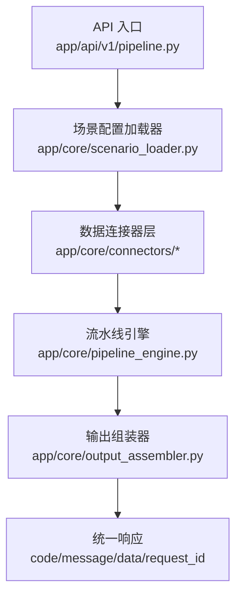
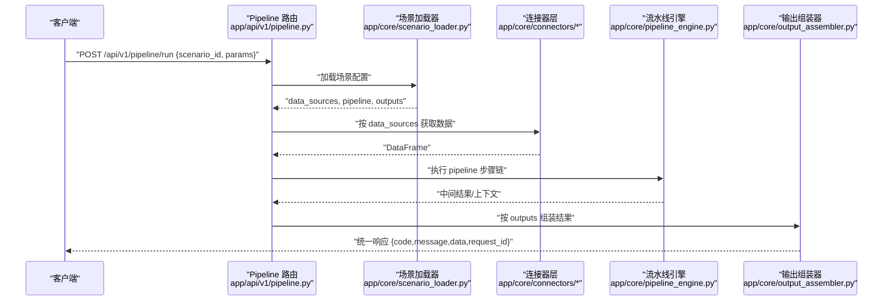
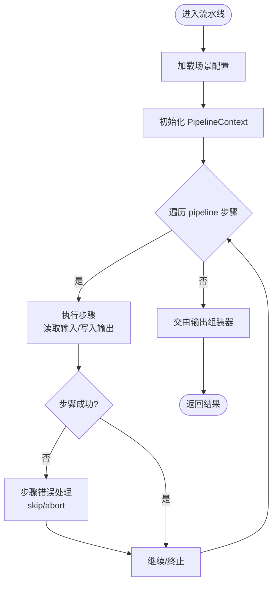
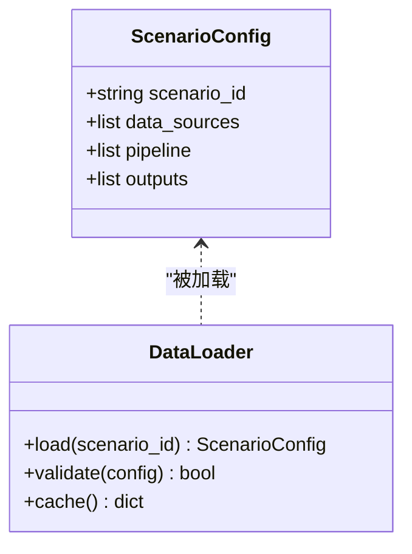
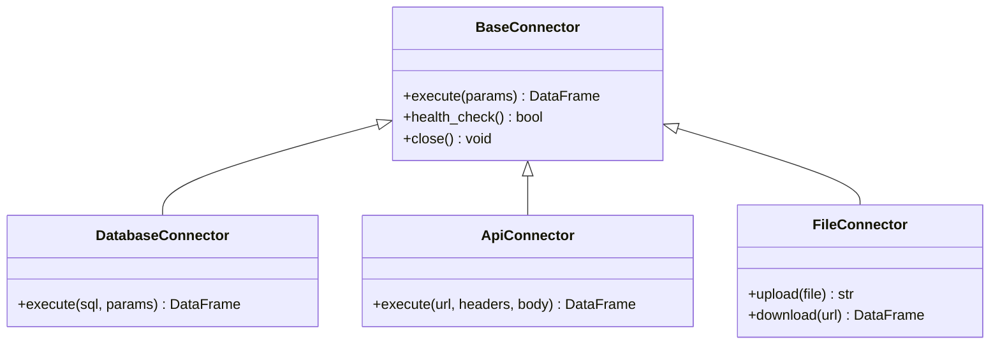
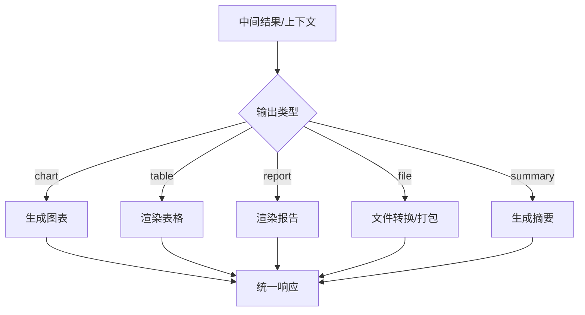
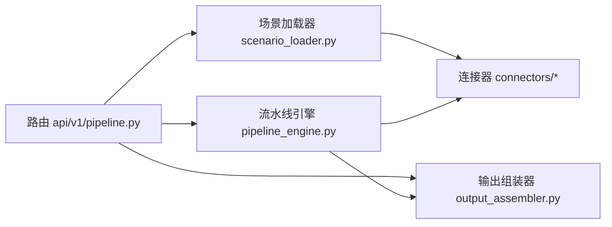

# 项目结构说明

<cite>
**本文引用的文件**
- [hiagent_辅助_Web_服务需求说明_task-242.md](file://docs/hiagent_辅助_Web_服务需求说明_task-242.md)
</cite>

## 目录
1. [简介](#简介)
2. [项目结构](#项目结构)
3. [核心组件](#核心组件)
4. [架构总览](#架构总览)
5. [详细组件分析](#详细组件分析)
6. [依赖关系与数据流](#依赖关系与数据流)
7. [性能与可观测性](#性能与可观测性)
8. [故障排查指南](#故障排查指南)
9. [结论](#结论)
10. [附录：场景配置示例要点](#附录：场景配置示例要点)

## 简介
本说明面向新加入的开发者，聚焦 hiagent 辅助 Web 服务的“场景驱动 + 流水线引擎”架构。该服务以 YAML 场景配置为核心，通过统一的连接器层获取数据，经流水线步骤处理，最终由输出组装器生成图表、表格、报告等结果。整体遵循无状态、单一职责、输入输出标准化、容错优先、安全隔离、场景可配置、组件可复用的设计原则。

## 项目结构
根据需求文档，项目的关键新增目录与文件如下：
- app/core/pipeline_engine.py：流水线引擎，负责按顺序执行步骤、传递上下文、记录日志与耗时、支持条件分支与步骤级错误处理。
- app/core/scenario_loader.py：场景配置加载器，负责读取并校验 YAML 场景配置，提供 data_sources、pipeline、outputs 的结构化模型。
- app/core/connectors/：数据连接器目录，包含 base/database/api/file 等连接器实现，统一返回 DataFrame，凭据从环境变量读取，采用注册表模式扩展。
- app/core/output_assembler.py：输出组装器，负责将中间结果渲染为 chart/table/report/file/summary 五种输出类型。
- app/scenarios/*.yaml：场景配置文件，描述数据源、处理步骤与输出定义。
- app/api/v1/pipeline.py：Pipeline 路由，暴露 POST /api/v1/pipeline/run 等接口，串联场景加载、连接器、流水线与输出组装。

图示来源
- [hiagent_辅助_Web_服务需求说明_task-242.md:33-68](file://docs/hiagent_辅助_Web_服务需求说明_task-242.md#L33-L68)

章节来源
- [hiagent_辅助_Web_服务需求说明_task-242.md:106-115](file://docs/hiagent_辅助_Web_服务需求说明_task-242.md#L106-L115)

## 核心组件
- 流水线引擎（pipeline_engine.py）
  - 职责：顺序执行 pipeline 步骤，基于命名引用在步骤间传递中间数据；支持条件分支、步骤级 skip/abort；每步独立记录日志与耗时。
  - 关键点：上下文对象（PipelineContext）承载步骤间数据；错误处理策略保证流程健壮性。
- 场景配置加载器（scenario_loader.py）
  - 职责：加载并解析 YAML 场景配置，提供 data_sources、pipeline、outputs 的强类型模型；校验必填字段与依赖关系。
  - 关键点：支持热加载与缓存，便于部署期快速切换场景。
- 数据连接器（connectors/*）
  - 职责：封装数据库直连、REST API 调用、文件上传/下载/对象存储等能力，统一返回 DataFrame；凭据来自环境变量；采用注册表模式扩展新连接器。
  - 关键点：连接池、超时重试、限流、鉴权模板、错误码标准化。
- 输出组装器（output_assembler.py）
  - 职责：将中间结果渲染为 chart/table/report/file/summary 五种输出；summary 专为 Agent 消费设计。
  - 关键点：模板化渲染、格式转换（PNG/SVG/HTML）、临时文件管理。
- Pipeline 路由（api/v1/pipeline.py）
  - 职责：接收 scenario_id 与参数，协调场景加载、连接器、流水线与输出组装，返回统一 JSON 响应。
  - 关键点：认证（X-API-Key）、请求 ID 追踪、结构化日志。

章节来源
- [hiagent_辅助_Web_服务需求说明_task-242.md:33-68](file://docs/hiagent_辅助_Web_服务需求说明_task-242.md#L33-L68)
- [hiagent_辅助_Web_服务需求说明_task-242.md:106-115](file://docs/hiagent_辅助_Web_服务需求说明_task-242.md#L106-L115)

## 架构总览
服务采用“场景驱动 + 流水线引擎”的双模式架构：
- 模式 A：Pipeline API（POST /api/v1/pipeline/run），传入 scenario_id 与参数，一次完成全流程。
- 模式 B：原子 API（/api/v1/data/*、/api/v1/visual/* 等），逐步调用，Agent 自行编排。

图示来源
- [hiagent_辅助_Web_服务需求说明_task-242.md:33-68](file://docs/hiagent_辅助_Web_服务需求说明_task-242.md#L33-L68)

## 详细组件分析

### 流水线引擎（pipeline_engine.py）
- 执行模型：步骤顺序执行，通过命名引用在步骤间传递数据；支持条件分支与步骤级错误处理（skip/abort）。
- 上下文对象：PipelineContext 维护步骤间共享数据、元信息（如 request_id、scenario_id）与日志。
- 可观测性：每步记录开始/结束时间、耗时、异常堆栈，便于定位瓶颈与问题。
- 扩展点：新增步骤只需实现标准接口并注册到步骤工厂或映射表。

图示来源
- [hiagent_辅助_Web_服务需求说明_task-242.md:57-63](file://docs/hiagent_辅助_Web_服务需求说明_task-242.md#L57-L63)

章节来源
- [hiagent_辅助_Web_服务需求说明_task-242.md:57-63](file://docs/hiagent_辅助_Web_服务需求说明_task-242.md#L57-L63)

### 场景配置加载器（scenario_loader.py）
- 配置模型：YAML 中声明 data_sources（connector 类型 + 连接配置 + SQL/API 参数 + 请求参数映射）、pipeline（action 调用原子能力 + input/output 命名引用）、outputs（chart/table/report/file/summary + 数据源引用）。
- 校验与缓存：对必填字段、依赖关系进行校验；支持热加载与内存缓存，减少 I/O 开销。
- 多场景管理：提供场景列表与详情查询接口，便于运维与调试。

图示来源
- [hiagent_辅助_Web_服务需求说明_task-242.md:40-45](file://docs/hiagent_辅助_Web_服务需求说明_task-242.md#L40-L45)

章节来源
- [hiagent_辅助_Web_服务需求说明_task-242.md:40-45](file://docs/hiagent_辅助_Web_服务需求说明_task-242.md#L40-L45)

### 数据连接器（connectors/*）
- 连接器类型：database、api、file_upload、file_url、file_s3（后期扩展）。
- 统一契约：所有连接器返回 DataFrame；凭据从环境变量读取；错误码与异常标准化。
- 扩展方式：注册表模式，新增连接器仅需实现基类接口并注册。

图示来源
- [hiagent_辅助_Web_服务需求说明_task-242.md:46-55](file://docs/hiagent_辅助_Web_服务需求说明_task-242.md#L46-L55)

章节来源
- [hiagent_辅助_Web_服务需求说明_task-242.md:46-55](file://docs/hiagent_辅助_Web_服务需求说明_task-242.md#L46-L55)

### 输出组装器（output_assembler.py）
- 输出类型：chart、table、report、file、summary。其中 summary 专为 Agent 消费设计，便于后续编排。
- 渲染能力：图表 PNG/SVG/HTML、Markdown 转 HTML、表格条件着色与排序、PDF/Word/Excel 生成（结合 WeasyPrint 等）。
- 资源管理：临时文件生命周期管理（2 小时自动清理）、流式下载。

图示来源
- [hiagent_辅助_Web_服务需求说明_task-242.md:62-63](file://docs/hiagent_辅助_Web_服务需求说明_task-242.md#L62-L63)

章节来源
- [hiagent_辅助_Web_服务需求说明_task-242.md:62-63](file://docs/hiagent_辅助_Web_服务需求说明_task-242.md#L62-L63)

### Pipeline 路由（api/v1/pipeline.py）
- 接口：POST /api/v1/pipeline/run，接收 scenario_id 与参数，返回统一 JSON 响应。
- 认证与安全：X-API-Key 认证；SQL 注入防护；文件沙箱；凭据不硬编码。
- 可观测性：request_id 贯穿全链路；结构化日志含 scenario_id、步骤耗时。

章节来源
- [hiagent_辅助_Web_服务需求说明_task-242.md:25-31](file://docs/hiagent_辅助_Web_服务需求说明_task-242.md#L25-L31)
- [hiagent_辅助_Web_服务需求说明_task-242.md:97-103](file://docs/hiagent_辅助_Web_服务需求说明_task-242.md#L97-L103)
- [hiagent_辅助_Web_服务需求说明_task-242.md:106-115](file://docs/hiagent_辅助_Web_服务需求说明_task-242.md#L106-L115)

## 依赖关系与数据流
- 模块耦合：
  - 路由依赖场景加载器与输出组装器；
  - 场景加载器仅依赖 YAML 解析与校验库；
  - 连接器与引擎解耦，通过 DataFrame 与上下文通信；
  - 输出组装器依赖渲染与文件处理库。
- 数据流向：
  - 请求进入路由 -> 加载场景配置 -> 连接器获取数据 -> 流水线步骤处理 -> 输出组装 -> 统一响应。
- 外部依赖：
  - FastAPI、pandas/numpy、DuckDB、matplotlib/plotly、WeasyPrint、httpx、Pydantic、PyYAML、SQLAlchemy、jsonpath-ng、uvicorn。

图示来源
- [hiagent_辅助_Web_服务需求说明_task-242.md:33-68](file://docs/hiagent_辅助_Web_服务需求说明_task-242.md#L33-L68)

章节来源
- [hiagent_辅助_Web_服务需求说明_task-242.md:19-22](file://docs/hiagent_辅助_Web_服务需求说明_task-242.md#L19-L22)
- [hiagent_辅助_Web_服务需求说明_task-242.md:33-68](file://docs/hiagent_辅助_Web_服务需求说明_task-242.md#L33-L68)

## 性能与可观测性
- 性能目标：简单接口 < 500ms，数据处理 < 3s，Pipeline 全流程 < 10s。
- 优化建议：
  - 使用连接池与查询缓存；
  - 大表查询走 DuckDB 并限制扫描范围；
  - 图表渲染按需生成与缓存；
  - 临时文件及时清理。
- 可观测性：
  - 结构化日志包含 scenario_id、步骤耗时、错误码；
  - 健康检查 /health；
  - 场景列表 /api/v1/pipeline/scenarios。

章节来源
- [hiagent_辅助_Web_服务需求说明_task-242.md:97-103](file://docs/hiagent_辅助_Web_服务需求说明_task-242.md#L97-L103)

## 故障排查指南
- 常见问题定位：
  - 场景配置错误：检查 YAML 必填字段与依赖关系；
  - 连接器失败：核对凭据、网络连通性与权限；
  - 流水线步骤异常：查看步骤日志与耗时，确认输入输出命名是否正确；
  - 输出渲染失败：检查模板与依赖库版本。
- 错误码规范：
  - 1xxx 通用、2xxx 数据处理、3xxx 可视化、4xxx 文件文档、5xxx API 编排、6xxx Pipeline 引擎。
- 建议工具：
  - 启用详细日志与请求追踪（request_id）；
  - 使用 /health 与服务端监控指标。

章节来源
- [hiagent_辅助_Web_服务需求说明_task-242.md:25-31](file://docs/hiagent_辅助_Web_服务需求说明_task-242.md#L25-L31)
- [hiagent_辅助_Web_服务需求说明_task-242.md:97-103](file://docs/hiagent_辅助_Web_服务需求说明_task-242.md#L97-L103)

## 结论
本方案通过“场景配置 + 流水线引擎 + 连接器 + 输出组装”的分层架构，实现了高内聚、低耦合、可扩展的 AI Agent 数据处理管线。新开发者可依据本说明快速理解各模块职责、依赖关系与数据流向，并按需扩展连接器与场景配置，支撑多种业务分析场景。

## 附录：场景配置示例要点
- data_sources：定义 connector 类型、连接配置、SQL/API 参数与请求参数映射；
- pipeline：定义步骤链，每个步骤调用原子能力并通过命名引用传递输入输出；
- outputs：定义 chart/table/report/file/summary 及其数据来源与渲染参数。

章节来源
- [hiagent_辅助_Web_服务需求说明_task-242.md:40-45](file://docs/hiagent_辅助_Web_服务需求说明_task-242.md#L40-L45)