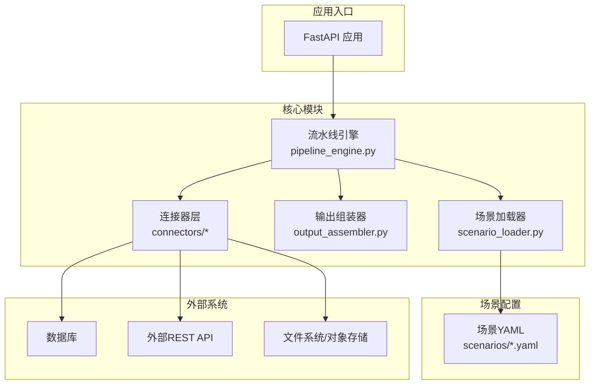
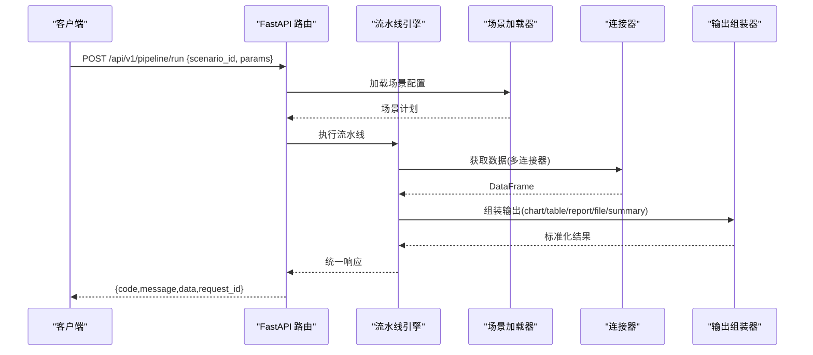
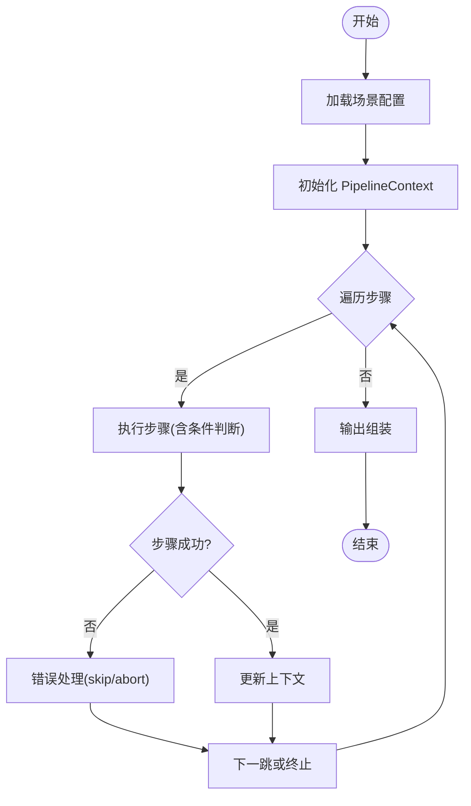

# 快速开始

<cite>
**本文引用的文件**
- [hiagent_辅助_Web_服务需求说明_task-242.md](file://docs/hiagent_辅助_Web_服务需求说明_task-242.md)
</cite>

## 目录
1. [简介](#简介)
2. [项目结构](#项目结构)
3. [核心组件](#核心组件)
4. [架构总览](#架构总览)
5. [详细组件分析](#详细组件分析)
6. [依赖关系分析](#依赖关系分析)
7. [性能与部署建议](#性能与部署建议)
8. [故障排除指南](#故障排除指南)
9. [结论](#结论)
10. [附录：API 参考与使用示例](#附录api-参考与使用示例)

## 简介
本快速开始指南面向首次接触 hiagent 辅助 Web 服务的开发者，目标是帮助你在最短时间内完成环境准备、安装配置，并通过 Pipeline 模式与原子 API 两种调用方式验证基本功能。该服务基于 FastAPI 构建，提供统一 JSON 响应、API Key 认证、场景驱动的流水线引擎（Pipeline）以及数据、可视化、文件、代理编排等原子能力。

## 项目结构
根据需求说明，项目采用“场景驱动 + 流水线引擎”的架构，关键新增目录与职责如下：
- app/core/pipeline_engine.py：流水线引擎，负责步骤顺序执行、上下文传递、条件分支与错误处理
- app/core/scenario_loader.py：场景配置加载器，从 YAML 读取并解析场景定义
- app/core/connectors/：连接器层，封装数据库、API、文件上传/下载/对象存储等数据源接入
- app/core/output_assembler.py：输出组装器，将中间结果渲染为 chart/table/report/file/summary
- app/scenarios/*.yaml：场景配置文件，描述 data_sources、pipeline、outputs
- app/api/v1/pipeline.py：Pipeline 路由，暴露 /api/v1/pipeline/run 等接口

图表来源
- [hiagent_辅助_Web_服务需求说明_task-242.md:33-68](file://docs/hiagent_辅助_Web_服务需求说明_task-242.md#L33-L68)
- [hiagent_辅助_Web_服务需求说明_task-242.md:106-115](file://docs/hiagent_辅助_Web_服务需求说明_task-242.md#L106-L115)

章节来源
- [hiagent_辅助_Web_服务需求说明_task-242.md:33-68](file://docs/hiagent_辅助_Web_服务需求说明_task-242.md#L33-L68)
- [hiagent_辅助_Web_服务需求说明_task-242.md:106-115](file://docs/hiagent_辅助_Web_服务需求说明_task-242.md#L106-L115)

## 核心组件
- 流水线引擎（Pipeline Engine）
  - 按 YAML 中 pipeline 定义的步骤顺序执行，通过命名引用在步骤间传递中间数据（PipelineContext）
  - 支持条件分支、步骤级错误处理（skip/abort），每步记录日志与耗时
- 场景配置加载器（Scenario Loader）
  - 解析 YAML 中的 data_sources、pipeline、outputs 三部分，生成可执行的流水线计划
- 连接器层（Connector Layer）
  - 统一抽象 database、api、file_upload、file_url、file_s3 等数据源，返回标准 DataFrame
  - 凭据从环境变量读取，扩展新连接器只需注册表模式
- 输出组装器（Output Assembler）
  - 将中间结果渲染为 chart/table/report/file/summary，其中 summary 专为 Agent 设计

章节来源
- [hiagent_辅助_Web_服务需求说明_task-242.md:40-68](file://docs/hiagent_辅助_Web_服务需求说明_task-242.md#L40-L68)

## 架构总览
服务对外暴露两类调用模式：
- Pipeline 模式：POST /api/v1/pipeline/run，传入 scenario_id 与参数，一次完成全流程
- 原子 API 模式：逐步调用 /api/v1/data/*、/api/v1/visual/*、/api/v1/file/*、/api/v1/proxy/*，由上层自行编排

统一响应格式包含 code/message/data/request_id；所有请求需携带 X-API-Key 进行鉴权。

图表来源
- [hiagent_辅助_Web_服务需求说明_task-242.md:25-31](file://docs/hiagent_辅助_Web_服务需求说明_task-242.md#L25-L31)
- [hiagent_辅助_Web_服务需求说明_task-242.md:65-68](file://docs/hiagent_辅助_Web_服务需求说明_task-242.md#L65-L68)
- [hiagent_辅助_Web_服务需求说明_task-242.md:33-68](file://docs/hiagent_辅助_Web_服务需求说明_task-242.md#L33-L68)

## 详细组件分析

### 流水线引擎（Pipeline Engine）
- 执行模型：步骤顺序执行，通过命名引用传递中间数据；支持条件分支与步骤级错误处理（skip/abort）
- 可观测性：每步独立记录日志与耗时，便于定位瓶颈与问题
- 扩展点：新增步骤可通过注册表模式接入，保持最小改动

图表来源
- [hiagent_辅助_Web_服务需求说明_task-242.md:57-64](file://docs/hiagent_辅助_Web_服务需求说明_task-242.md#L57-L64)

章节来源
- [hiagent_辅助_Web_服务需求说明_task-242.md:57-64](file://docs/hiagent_辅助_Web_服务需求说明_task-242.md#L57-L64)

### 连接器层（Connector Layer）
- 类型覆盖：database、api、file_upload、file_url、file_s3
- 统一返回：DataFrame，屏蔽底层差异
- 安全与扩展：凭据从环境变量读取；新增连接器通过注册表模式扩展

章节来源
- [hiagent_辅助_Web_服务需求说明_task-242.md:46-56](file://docs/hiagent_辅助_Web_服务需求说明_task-242.md#L46-L56)

### 输出组装器（Output Assembler）
- 输出类型：chart、table、report、file、summary
- 用途：将中间结果渲染为可视化图表、表格、报告文档或结构化摘要（summary 专为 Agent 设计）

章节来源
- [hiagent_辅助_Web_服务需求说明_task-242.md:62-64](file://docs/hiagent_辅助_Web_服务需求说明_task-242.md#L62-L64)

### 原子 API 能力
- 数据处理：/api/v1/data/*（导入解析、SQL 查询、清洗、统计）
- 可视化与渲染：/api/v1/visual/*（图表、报告、表格）
- 文件与文档：/api/v1/file/*（格式转换、文档生成、临时文件管理）
- API 编排：/api/v1/proxy/*（HTTP 代理、并发、重试、速率限制、鉴权模板）

章节来源
- [hiagent_辅助_Web_服务需求说明_task-242.md:73-94](file://docs/hiagent_辅助_Web_服务需求说明_task-242.md#L73-L94)

## 依赖关系分析
- 技术栈：FastAPI、pandas/numpy、DuckDB、matplotlib/plotly、WeasyPrint、httpx、Pydantic、PyYAML、SQLAlchemy、jsonpath-ng、uvicorn、Docker
- 运行时依赖：Python（见下文环境要求）、系统库（如 WeasyPrint 所需的系统字体/浏览器引擎）
- 部署形态：容器化（Docker）+ 进程管理器（uvicorn）

章节来源
- [hiagent_辅助_Web_服务需求说明_task-242.md:19-22](file://docs/hiagent_辅助_Web_服务需求说明_task-242.md#L19-L22)

## 性能与部署建议
- 性能目标：简单接口 < 500ms，数据处理 < 3s，Pipeline 全流程 < 10s
- 可观测性：结构化日志（含 scenario_id、步骤耗时）、健康检查 /health、场景列表 /api/v1/pipeline/scenarios
- 部署要点：Docker 镜像、环境变量配置、场景配置热加载

章节来源
- [hiagent_辅助_Web_服务需求说明_task-242.md:97-103](file://docs/hiagent_辅助_Web_服务需求说明_task-242.md#L97-L103)

## 故障排除指南
- 认证失败
  - 现象：请求被拒绝
  - 排查：确认请求头包含正确的 X-API-Key；检查服务端环境变量是否已配置对应密钥
- 场景未找到或配置错误
  - 现象：Pipeline 执行失败
  - 排查：确认 scenario_id 存在且 YAML 语法正确；检查 data_sources、pipeline、outputs 字段是否完整
- 数据源连接失败
  - 现象：连接器报错
  - 排查：核对数据库/外部 API 的连接信息、网络连通性与凭据；查看连接器日志
- 可视化/报告渲染失败
  - 现象：图表或 PDF 生成失败
  - 排查：确认系统依赖（如 WeasyPrint 所需系统库/字体）已安装；检查输入数据格式
- 性能不达标
  - 现象：接口超时或慢
  - 排查：检查 SQL 查询与索引；评估数据量与内存占用；考虑分片或分页；查看步骤耗时日志定位瓶颈

[本节为通用指导，不直接分析具体代码文件]

## 结论
通过场景驱动的流水线引擎与原子 API 双模式，hiagent 辅助 Web 服务能够以配置化的方式快速支撑多种业务分析场景。按照本指南完成环境准备与基础调用后，即可在此基础上扩展更多场景与连接器，实现高效的数据分析与可视化交付。

## 附录：API 参考与使用示例

### 环境要求
- Python：建议使用 3.9 及以上版本（确保兼容 Pydantic、FastAPI、DuckDB 等依赖）
- 操作系统：Linux/macOS/Windows（容器化部署时以镜像为准）
- 系统依赖：若启用 PDF 报告，需安装 WeasyPrint 所需系统库与字体（例如 Linux 上的 pango、cairo 等）

### 安装步骤
- 创建并激活虚拟环境
  - 推荐使用 venv 或 conda 创建隔离环境
- 安装依赖包
  - 依据技术选型安装：FastAPI、uvicorn、pandas、numpy、DuckDB、matplotlib、plotly、WeasyPrint、httpx、Pydantic、PyYAML、SQLAlchemy、jsonpath-ng
  - 若使用 Docker，可直接拉取官方镜像并按需挂载配置与环境变量
- 配置环境变量
  - 设置 API Key 及数据源凭据（数据库连接串、外部 API 密钥等）
- 启动服务
  - 使用 uvicorn 启动 FastAPI 应用，监听默认端口（如 8000）

### 基本使用示例
- Pipeline 模式（推荐）
  - 调用 POST /api/v1/pipeline/run，传入 scenario_id 与参数，一次性完成数据获取、处理、可视化与输出组装
  - 适用于端到端流程自动化，减少上层编排复杂度
- 原子 API 模式（灵活编排）
  - 逐步调用 /api/v1/data/*、/api/v1/visual/*、/api/v1/file/*、/api/v1/proxy/*，适合需要细粒度控制的场景
  - 结合上游 Agent 或工作流平台，按需组合各原子能力

### 常见使用场景
- 竞品分析：对比多个竞品的规模、收益、费率等指标，输出对比报告与排名图表
- 机构行为分析：分析机构的申赎行为、持仓变化、资金流向，输出行为画像
- 产品规模增量分析：追踪产品规模变动、增量归因、趋势预测，输出趋势图表与归因表

### 统一响应与鉴权
- 统一响应格式：{code, message, data, request_id}
- 鉴权方式：请求头 X-API-Key 携带 API Key

章节来源
- [hiagent_辅助_Web_服务需求说明_task-242.md:25-31](file://docs/hiagent_辅助_Web_服务需求说明_task-242.md#L25-L31)
- [hiagent_辅助_Web_服务需求说明_task-242.md:65-68](file://docs/hiagent_辅助_Web_服务需求说明_task-242.md#L65-L68)
- [hiagent_辅助_Web_服务需求说明_task-242.md:73-94](file://docs/hiagent_辅助_Web_服务需求说明_task-242.md#L73-L94)
- [hiagent_辅助_Web_服务需求说明_task-242.md:19-22](file://docs/hiagent_辅助_Web_服务需求说明_task-242.md#L19-L22)