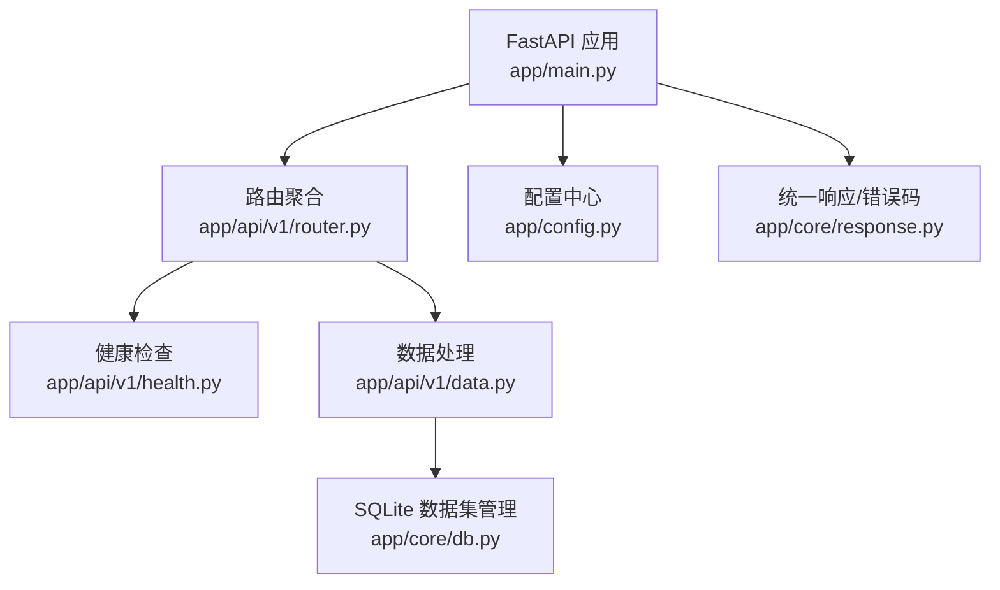
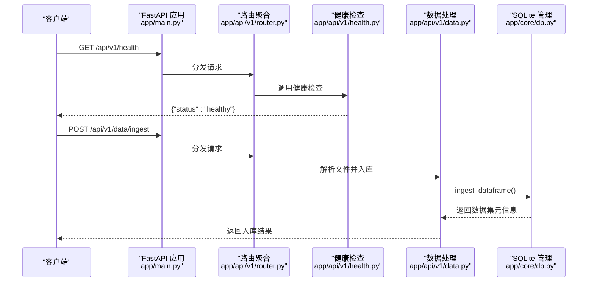
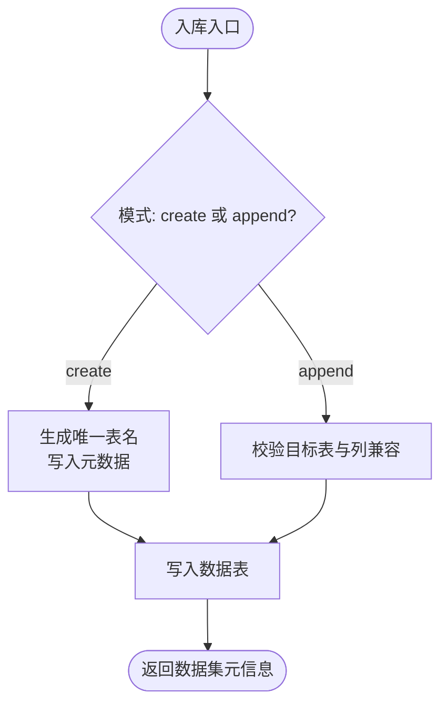
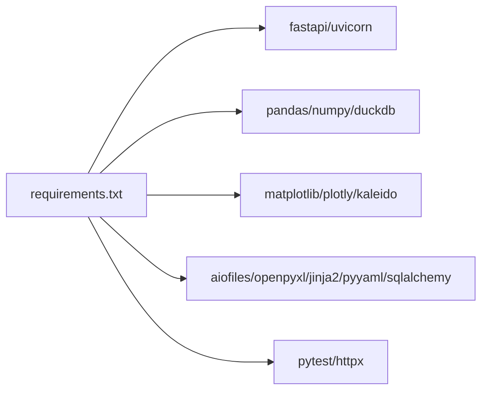

# 快速开始

<cite>
**本文引用的文件**
- [requirements.txt](file://requirements.txt)
- [Dockerfile](file://Dockerfile)
- [app/main.py](file://app/main.py)
- [app/config.py](file://app/config.py)
- [start.sh](file://start.sh)
- [start.ps1](file://start.ps1)
- [app/api/v1/router.py](file://app/api/v1/router.py)
- [app/api/v1/health.py](file://app/api/v1/health.py)
- [app/api/v1/data.py](file://app/api/v1/data.py)
- [app/core/db.py](file://app/core/db.py)
- [app/core/response.py](file://app/core/response.py)
</cite>

## 目录
1. [简介](#简介)
2. [项目结构](#项目结构)
3. [环境要求](#环境要求)
4. [安装与启动](#安装与启动)
5. [配置与环境变量](#配置与环境变量)
6. [第一个 API 调用示例](#第一个-api-调用示例)
7. [架构总览](#架构总览)
8. [详细组件分析](#详细组件分析)
9. [依赖关系分析](#依赖关系分析)
10. [性能注意事项](#性能注意事项)
11. [故障排除指南](#故障排除指南)
12. [结论](#结论)

## 简介
本指南帮助你在 30 分钟内完成 hiagent 辅助 Web 服务的本地搭建、运行与验证。服务基于 FastAPI + Uvicorn，提供数据处理、可视化、报表生成等能力，并内置 SQLite 数据集管理与临时文件清理机制。你可以通过一键脚本（Linux/macOS 或 Windows）或 Docker 快速启动，并通过 /api/v1/health 健康检查接口验证服务是否正常运行。

## 项目结构
- 应用入口与生命周期管理：app/main.py
- 配置加载：app/config.py（支持 .env 环境变量）
- API 路由聚合：app/api/v1/router.py
- 健康检查：app/api/v1/health.py
- 数据入库与查询：app/api/v1/data.py
- SQLite 数据集管理：app/core/db.py
- 统一响应模型与错误码：app/core/response.py
- 依赖清单：requirements.txt
- 容器镜像构建：Dockerfile
- 一键启动脚本：start.sh（Linux/macOS）、start.ps1（Windows）

图表来源
- [app/main.py:46-98](file://app/main.py#L46-L98)
- [app/api/v1/router.py:1-18](file://app/api/v1/router.py#L1-L18)
- [app/api/v1/health.py:1-13](file://app/api/v1/health.py#L1-L13)
- [app/api/v1/data.py:1-201](file://app/api/v1/data.py#L1-L201)
- [app/core/db.py:1-324](file://app/core/db.py#L1-L324)
- [app/config.py:1-23](file://app/config.py#L1-L23)
- [app/core/response.py:1-103](file://app/core/response.py#L1-L103)

章节来源
- [app/main.py:46-98](file://app/main.py#L46-L98)
- [app/api/v1/router.py:1-18](file://app/api/v1/router.py#L1-L18)

## 环境要求
- Python 版本：>= 3.10（启动脚本会检测并提示安装）
- 系统依赖（Docker 镜像中已包含 gcc、libffi-dev 等）
- 推荐工具：pip、uvicorn（通过 requirements.txt 安装）

章节来源
- [start.sh:48-81](file://start.sh#L48-L81)
- [start.ps1:23-62](file://start.ps1#L23-L62)
- [Dockerfile:1-24](file://Dockerfile#L1-L24)
- [requirements.txt:1-31](file://requirements.txt#L1-L31)

## 安装与启动
### 方式一：使用一键脚本（推荐）
- Linux/macOS
  - 赋予执行权限后运行：chmod +x start.sh && ./start.sh
  - 可选参数：--port 端口 --host 地址 --reload 开发热重载 --no-check 跳过环境检查
- Windows
  - PowerShell 中运行：.\start.ps1
  - 可选参数：-Port 端口 -Host 地址 -Reload 开发热重载 -NoCheck 跳过环境检查

说明：
- 脚本会自动创建虚拟环境、安装依赖、初始化 .env（若存在 .env.example）、创建 tmp_files 与 data 目录，并检查端口占用后启动服务。
- 默认监听 0.0.0.0:8080，API 文档在 http://localhost:8080/docs。

章节来源
- [start.sh:1-240](file://start.sh#L1-L240)
- [start.ps1:1-220](file://start.ps1#L1-L220)

### 方式二：手动安装与启动
- 创建并激活虚拟环境（Python >= 3.10）
- 安装依赖：pip install -r requirements.txt
- 启动服务：python -m uvicorn app.main:app --host 0.0.0.0 --port 8080
- 开发模式可加 --reload

章节来源
- [requirements.txt:1-31](file://requirements.txt#L1-L31)
- [app/main.py:101-109](file://app/main.py#L101-L109)

### 方式三：Docker 部署
- 构建镜像：docker build -t hiagent-web-service .
- 运行容器：docker run -p 8080:8080 hiagent-web-service
- 访问：http://localhost:8080/docs

说明：
- 镜像基于 python:3.10-slim，预装必要系统依赖，暴露 8080 端口。
- 如需持久化数据或临时文件，可将 /app/data 和 /app/tmp_files 挂载到宿主机目录。

章节来源
- [Dockerfile:1-24](file://Dockerfile#L1-L24)

## 配置与环境变量
应用通过 pydantic-settings 从 .env 文件与环境变量加载配置，关键项如下：
- APP_NAME：应用名称（默认 hiagent-web-service）
- FILE_STORAGE_PATH：临时文件存储路径（默认 ./tmp_files）
- FILE_CLEANUP_INTERVAL_HOURS：临时文件清理间隔小时数（默认 2）
- APP_PORT：服务端口（默认 8080）
- LOG_LEVEL：日志级别（默认 INFO）
- SCENARIOS_DIR：场景配置文件目录（默认 ./app/scenarios）
- DB_PATH：SQLite 数据库文件路径（默认 ./data/hiagent.db）

注意：
- 启动脚本会在首次运行时根据 .env.example（如存在）生成 .env；若不存在则跳过。
- 启动时会自动创建 tmp_files 与 data 目录。

章节来源
- [app/config.py:1-23](file://app/config.py#L1-L23)
- [start.sh:151-173](file://start.sh#L151-L173)
- [start.ps1:132-157](file://start.ps1#L132-L157)

## 第一个 API 调用示例
启动成功后，建议按以下顺序验证：

1) 健康检查
- 请求：GET /api/v1/health
- 预期：返回成功状态 {"status": "healthy"}

2) 查看 API 文档
- 浏览器访问：http://localhost:8080/docs

3) 上传数据并入库（示例）
- 请求：POST /api/v1/data/ingest
- 表单字段：
  - file：CSV/Excel/JSON 文件
  - table_name：可选，自定义表名（append 模式下必填）
  - description：可选，描述
  - mode：create（新建）或 append（追加），默认 create
- 成功后会返回 dataset id、table_name、行列数等信息

4) 列出已入库数据集
- 请求：GET /api/v1/datasets
- 用于确认数据已成功入库

5) SQL 查询（只读）
- 请求：POST /api/v1/datasets/{dataset_id}/query
- 请求体：{"sql": "SELECT * FROM <table_name> LIMIT 10"}
- 安全限制：仅允许 SELECT 或 WITH 开头的语句

6) 下载生成的文件（如有）
- 请求：GET /api/v1/file/download/{filename}
- 用于下载由服务生成的文件

章节来源
- [app/api/v1/health.py:1-13](file://app/api/v1/health.py#L1-L13)
- [app/api/v1/data.py:39-134](file://app/api/v1/data.py#L39-L134)
- [app/main.py:81-93](file://app/main.py#L81-L93)

## 架构总览
服务采用分层设计：
- 入口层：FastAPI 应用负责中间件、异常处理、路由注册与生命周期管理
- API 层：按功能划分路由模块（健康检查、数据处理、可视化、Pipeline、报表）
- 服务层：业务逻辑封装（数据处理、报表、可视化）
- 数据层：SQLite 数据集管理（元数据表 _datasets + 数据表）
- 配置层：集中式配置加载（pydantic-settings）

图表来源
- [app/main.py:46-98](file://app/main.py#L46-L98)
- [app/api/v1/router.py:1-18](file://app/api/v1/router.py#L1-L18)
- [app/api/v1/health.py:1-13](file://app/api/v1/health.py#L1-L13)
- [app/api/v1/data.py:39-83](file://app/api/v1/data.py#L39-L83)
- [app/core/db.py:59-189](file://app/core/db.py#L59-L189)

## 详细组件分析
### 应用入口与生命周期
- 创建 FastAPI 应用，注册 CORS、request_id 注入中间件、统一异常处理器
- 生命周期：启动时初始化 SQLite 数据集库并启动后台临时文件清理任务；关闭时取消任务
- 内置文件下载接口 /api/v1/file/download/{filename}

章节来源
- [app/main.py:29-98](file://app/main.py#L29-L98)

### 配置管理
- 通过 pydantic-settings 读取 .env 与环境变量
- 默认值覆盖，便于本地开发与生产环境切换

章节来源
- [app/config.py:1-23](file://app/config.py#L1-L23)

### 健康检查
- 无需认证的健康检查接口，返回服务状态

章节来源
- [app/api/v1/health.py:1-13](file://app/api/v1/health.py#L1-L13)

### 数据处理与入库
- 支持 CSV/Excel/JSON 文件解析与入库 SQLite
- 提供筛选、聚合、透视、排序、去重、清洗、统计分析等单步处理能力
- 提供只读 SQL 查询（仅 SELECT/WITH）

章节来源
- [app/api/v1/data.py:1-201](file://app/api/v1/data.py#L1-L201)

### SQLite 数据集管理
- 启动时创建 _datasets 元数据表
- 支持 create/append 两种入库模式
- 提供列表、详情（含预览）、删除、只读查询等功能
- 安全限制：SQL 白名单校验，防止危险操作

图表来源
- [app/core/db.py:59-189](file://app/core/db.py#L59-L189)

章节来源
- [app/core/db.py:1-324](file://app/core/db.py#L1-L324)

### 统一响应与错误码
- 统一 ApiResponse 模型，包含 code、message、data、request_id
- 定义分模块的错误码与默认消息，便于前端处理

章节来源
- [app/core/response.py:1-103](file://app/core/response.py#L1-L103)

## 依赖关系分析
- 框架与服务器：fastapi、uvicorn、python-multipart、pydantic、pydantic-settings、python-dotenv
- 数据处理：pandas、numpy、duckdb、chardet
- 可视化：matplotlib、plotly、kaleido
- 文件与模板：aiofiles、openpyxl、jinja2、pyyaml、sqlalchemy
- 测试：pytest、pytest-asyncio、httpx

图表来源
- [requirements.txt:1-31](file://requirements.txt#L1-L31)

章节来源
- [requirements.txt:1-31](file://requirements.txt#L1-L31)

## 性能注意事项
- 使用 SQLite 作为轻量级数据存储，适合中小规模数据；大数据量建议评估外部数据库方案
- 临时文件定期清理，避免磁盘占用增长
- 开发模式启用热重载（--reload），生产环境建议关闭以提升性能
- 合理设置 APP_PORT 与并发策略（Uvicorn 多进程可通过命令行参数调整）

[本节为通用指导，不直接分析具体文件]

## 故障排除指南
常见问题与解决思路：
- 未检测到 Python >= 3.10
  - 现象：启动脚本报错提示未检测到 Python 或版本过低
  - 解决：安装 Python 3.10+，并确保 pip 可用
  - 参考：启动脚本的环境检测逻辑
- 端口被占用
  - 现象：启动时报端口占用错误
  - 解决：更换端口或关闭占用进程；脚本支持 --port/-Port 指定端口
- 依赖安装失败
  - 现象：pip 安装报错或网络超时
  - 解决：检查网络与镜像源；必要时手动安装依赖
  - 参考：requirements.txt 中的依赖列表
- 缺少 .env 或配置项
  - 现象：服务行为不符合预期
  - 解决：根据 .env.example（如存在）生成 .env，或设置对应环境变量
- 数据入库失败
  - 现象：文件解析错误或数据集为空
  - 解决：检查文件格式与编码；确保非空数据；查看错误码与消息
- SQL 查询受限
  - 现象：仅允许 SELECT/WITH 开头语句
  - 解决：修改查询语句以符合安全限制

章节来源
- [start.sh:48-81](file://start.sh#L48-L81)
- [start.ps1:23-62](file://start.ps1#L23-L62)
- [requirements.txt:1-31](file://requirements.txt#L1-L31)
- [app/core/db.py:256-296](file://app/core/db.py#L256-L296)
- [app/core/response.py:12-68](file://app/core/response.py#L12-L68)

## 结论
通过本指南，你可以在 30 分钟内完成 hiagent 辅助 Web 服务的本地搭建与运行，并使用健康检查与数据入库接口验证服务是否正常。推荐使用一键脚本简化环境准备与启动流程；生产环境建议使用 Docker 部署并合理配置环境变量。遇到问题时，可依据故障排除指南定位并解决。