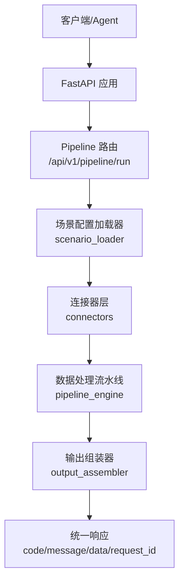
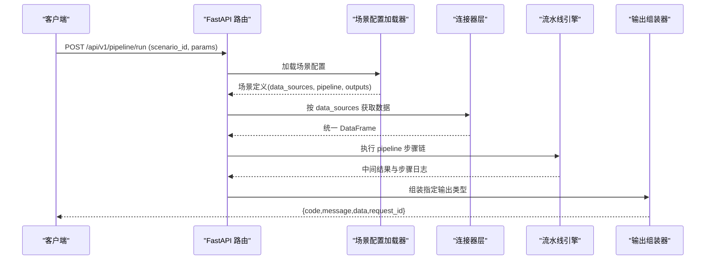
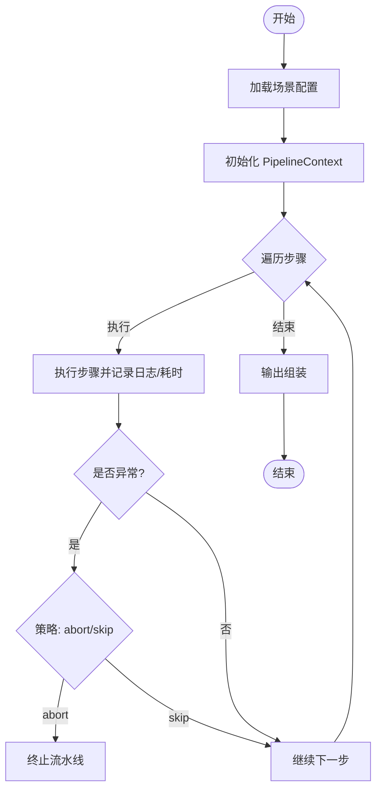
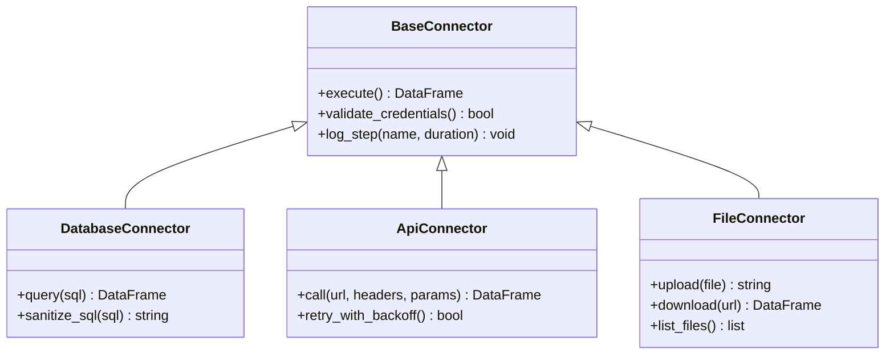
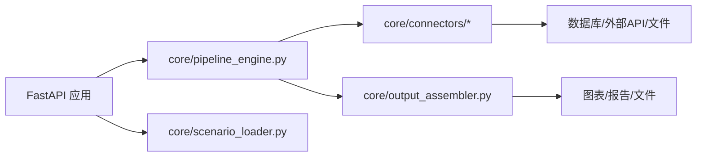

# 故障排除

<cite>
**本文档引用的文件**
- [hiagent_辅助_Web_服务需求说明_task-242.md](file://docs\hiagent_辅助_Web_服务需求说明_task-242.md)
</cite>

## 目录
1. [简介](#简介)
2. [项目结构](#项目结构)
3. [核心组件](#核心组件)
4. [架构总览](#架构总览)
5. [详细组件分析](#详细组件分析)
6. [依赖关系分析](#依赖关系分析)
7. [性能注意事项](#性能注意事项)
8. [故障排除指南](#故障排除指南)
9. [结论](#结论)
10. [附录](#附录)

## 简介
本指南面向 hiagent 辅助 Web 服务的运维与开发人员，聚焦安装部署、配置校验、API 调用失败、错误码定位、日志与监控、性能诊断与优化、数据库/文件/API 模块问题定位、常见问题解答（FAQ）、技术支持与 Bug 报告流程，以及系统健康检查方法与工具。内容严格依据项目需求说明书中的架构与接口规范进行组织，便于快速定位与解决问题。

## 项目结构
根据需求说明，项目采用“场景驱动的流水线引擎”架构，关键新增目录与职责如下：
- app/core/pipeline_engine.py：流水线引擎，负责步骤顺序执行、上下文传递、条件分支与步骤级错误处理
- app/core/scenario_loader.py：场景配置加载器，负责 YAML 场景配置的解析与热加载
- app/core/connectors/：数据连接器层，包含 base/database/api/file 等类型，统一返回 DataFrame
- app/core/output_assembler.py：输出组装器，支持 chart/table/report/file/summary 五种输出
- app/scenarios/*.yaml：场景配置文件，描述 data_sources、pipeline、outputs
- app/api/v1/pipeline.py：Pipeline API 路由，暴露 /api/v1/pipeline/run 等入口

图表来源
- [hiagent_辅助_Web_服务需求说明_task-242.md:33-68](file://docs\hiagent_辅助_Web_服务需求说明_task-242.md#L33-L68)

章节来源
- [hiagent_辅助_Web_服务需求说明_task-242.md:106-115](file://docs\hiagent_辅助_Web_服务需求说明_task-242.md#L106-L115)

## 核心组件
- 统一接口规范：所有 API 返回统一 JSON 格式 {code, message, data, request_id}；错误码按模块分段（1xxx 通用、2xxx 数据处理、3xxx 可视化、4xxx 文件文档、5xxx API 编排、6xxx Pipeline 引擎）；认证使用 X-API-Key Header。
- 连接器层：database、api、file_upload、file_url、file_s3，均返回统一 DataFrame，凭据从环境变量读取，采用注册表模式扩展。
- 流水线引擎：步骤顺序执行，通过 PipelineContext 命名引用传递中间数据；支持条件分支、步骤级错误处理（skip/abort），每步记录日志与耗时。
- 输出组装器：chart/table/report/file/summary，其中 summary 专为 Agent 设计。
- 两种调用模式：
  - 模式 A：Pipeline API（POST /api/v1/pipeline/run），传入 scenario_id + 参数，一次完成全流程
  - 模式 B：原子 API（/api/v1/data/*、/api/v1/visual/* 等），逐步调用，由 Agent 自行编排

章节来源
- [hiagent_辅助_Web_服务需求说明_task-242.md:25-68](file://docs\hiagent_辅助_Web_服务需求说明_task-242.md#L25-L68)

## 架构总览
下图展示了请求从进入 FastAPI 到最终返回统一响应的完整链路，包括场景配置加载、连接器数据获取、流水线处理与输出组装。

图表来源
- [hiagent_辅助_Web_服务需求说明_task-242.md:33-68](file://docs\hiagent_辅助_Web_服务需求说明_task-242.md#L33-L68)

## 详细组件分析

### 流水线引擎（Pipeline Engine）
- 执行模型：步骤顺序执行，通过 PipelineContext 以命名引用传递中间数据
- 控制流：支持条件分支与步骤级错误处理（skip/abort）
- 可观测性：每步独立记录日志与耗时，便于定位瓶颈与异常
- 典型问题：
  - 步骤间数据键名不匹配导致 KeyError
  - 某步骤抛出异常但配置为 skip，后续步骤仍期望该数据导致失败
  - 长耗时步骤未设置超时或重试策略导致整体超时

图表来源
- [hiagent_辅助_Web_服务需求说明_task-242.md:57-63](file://docs\hiagent_辅助_Web_服务需求说明_task-242.md#L57-L63)

章节来源
- [hiagent_辅助_Web_服务需求说明_task-242.md:57-63](file://docs\hiagent_辅助_Web_服务需求说明_task-242.md#L57-L63)

### 连接器层（Connector Layer）
- 类型覆盖：database、api、file_upload、file_url、file_s3
- 统一契约：所有连接器返回 DataFrame；凭据从环境变量读取；采用注册表模式扩展
- 典型问题：
  - 环境变量缺失或格式错误导致连接失败
  - SQL 注入防护未生效导致查询被拒绝
  - 外部 API 鉴权模板配置错误导致 401/403
  - 文件上传/下载路径权限不足或临时目录空间不足

图表来源
- [hiagent_辅助_Web_服务需求说明_task-242.md:46-55](file://docs\hiagent_辅助_Web_服务需求说明_task-242.md#L46-L55)

章节来源
- [hiagent_辅助_Web_服务需求说明_task-242.md:46-55](file://docs\hiagent_辅助_Web_服务需求说明_task-242.md#L46-L55)

### 输出组装器（Output Assembler）
- 输出类型：chart、table、report、file、summary
- 典型问题：
  - 模板变量缺失导致渲染失败
  - 图表数据维度不匹配导致生成失败
  - 文件打包时磁盘空间不足或权限不足

章节来源
- [hiagent_辅助_Web_服务需求说明_task-242.md:62-64](file://docs\hiagent_辅助_Web_服务需求说明_task-242.md#L62-L64)

### 场景配置（YAML）
- 字段：data_sources、pipeline、outputs
- 典型问题：
  - YAML 语法错误或缩进错误导致加载失败
  - pipeline 步骤引用了不存在的中间数据键
  - outputs 引用了不存在的数据源或模板

章节来源
- [hiagent_辅助_Web_服务需求说明_task-242.md:40-45](file://docs\hiagent_辅助_Web_服务需求说明_task-242.md#L40-L45)

## 依赖关系分析
- 技术栈：FastAPI、pandas/numpy、DuckDB、matplotlib/plotly、WeasyPrint、httpx、Pydantic、PyYAML、SQLAlchemy、jsonpath-ng、Docker/uvicorn
- 运行时依赖：
  - 数据库驱动（MySQL/PostgreSQL/ClickHouse）
  - 文件存储（本地临时目录，后期可扩展 OSS）
  - 网络访问（外部 REST API）
- 潜在耦合点：
  - 连接器与数据库/外部 API 的强耦合
  - 流水线步骤对中间数据结构的隐式约定
  - 输出模板与数据结构的绑定

图表来源
- [hiagent_辅助_Web_服务需求说明_task-242.md:19-21](file://docs\hiagent_辅助_Web_服务需求说明_task-242.md#L19-L21)
- [hiagent_辅助_Web_服务需求说明_task-242.md:106-115](file://docs\hiagent_辅助_Web_服务需求说明_task-242.md#L106-L115)

章节来源
- [hiagent_辅助_Web_服务需求说明_task-242.md:19-21](file://docs\hiagent_辅助_Web_服务需求说明_task-242.md#L19-L21)
- [hiagent_辅助_Web_服务需求说明_task-242.md:106-115](file://docs\hiagent_辅助_Web_服务需求说明_task-242.md#L106-L115)

## 性能注意事项
- 目标性能：简单接口 < 500ms，数据处理 < 3s，Pipeline 全流程 < 10s
- 建议：
  - 使用 DuckDB 进行高效 SQL 查询与聚合
  - 在流水线步骤中避免全量复制 DataFrame，尽量使用视图或惰性计算
  - 对外部 API 调用启用并发与退避重试，限制速率
  - 对大文件处理采用流式读写，避免一次性加载到内存
  - 对图表渲染按需选择轻量库或缓存结果

章节来源
- [hiagent_辅助_Web_服务需求说明_task-242.md:97-102](file://docs\hiagent_辅助_Web_服务需求说明_task-242.md#L97-L102)

## 故障排除指南

### 安装与启动问题
- 症状：容器无法启动、端口占用、依赖缺失
- 排查要点：
  - 确认 Docker 镜像构建成功且 uvicorn 监听端口可用
  - 检查环境变量是否齐全（数据库连接、API Key、文件路径等）
  - 查看容器日志中是否有 ImportError 或驱动缺失
- 解决建议：
  - 补齐依赖（如数据库驱动、WeasyPrint 系统依赖）
  - 调整端口映射与资源限制
  - 使用最小化镜像并预装必要系统库

章节来源
- [hiagent_辅助_Web_服务需求说明_task-242.md:19-21](file://docs\hiagent_辅助_Web_服务需求说明_task-242.md#L19-L21)
- [hiagent_辅助_Web_服务需求说明_task-242.md:97-102](file://docs\hiagent_辅助_Web_服务需求说明_task-242.md#L97-L102)

### 配置错误
- 症状：场景加载失败、Pipeline 执行中断、输出为空
- 排查要点：
  - YAML 语法与缩进是否正确
  - data_sources、pipeline、outputs 字段是否完整且引用有效
  - 环境变量与凭据是否配置正确
- 解决建议：
  - 使用 YAML 校验工具验证配置
  - 在 scenario_loader 中增加配置 Schema 校验（Pydantic）
  - 将凭据集中管理并通过环境变量注入

章节来源
- [hiagent_辅助_Web_服务需求说明_task-242.md:40-45](file://docs\hiagent_辅助_Web_服务需求说明_task-242.md#L40-L45)
- [hiagent_辅助_Web_服务需求说明_task-242.md:46-55](file://docs\hiagent_辅助_Web_服务需求说明_task-242.md#L46-L55)

### API 调用失败
- 症状：401/403、超时、5xx 错误、响应格式不符
- 排查要点：
  - 请求头是否包含正确的 X-API-Key
  - 是否调用正确的端点（Pipeline 或原子 API）
  - 外部 API 是否可达、鉴权是否有效
  - 响应是否符合统一 JSON 格式 {code, message, data, request_id}
- 解决建议：
  - 在客户端侧打印 request_id 以便追踪
  - 对不稳定外部 API 启用重试与退避
  - 在服务端增加限流与熔断保护

章节来源
- [hiagent_辅助_Web_服务需求说明_task-242.md:25-31](file://docs\hiagent_辅助_Web_服务需求说明_task-242.md#L25-L31)
- [hiagent_辅助_Web_服务需求说明_task-242.md:65-68](file://docs\hiagent_辅助_Web_服务需求说明_task-242.md#L65-L68)

### 错误码参考与解决方法
- 1xxx 通用错误：认证失败、参数校验错误、请求格式错误
  - 解决：检查 X-API-Key、必填参数、JSON 结构
- 2xxx 数据处理错误：SQL 执行失败、DataFrame 操作异常、类型转换错误
  - 解决：校验 SQL、检查数据类型与空值、使用 DuckDB 调试查询
- 3xxx 可视化错误：图表渲染失败、模板变量缺失
  - 解决：核对数据维度与模板变量、降级为文本摘要
- 4xxx 文件文档错误：上传/下载失败、权限不足、空间不足
  - 解决：检查文件系统权限与容量、使用流式处理
- 5xxx API 编排错误：外部 API 调用失败、超时、限流
  - 解决：配置重试与退避、调整并发与速率限制
- 6xxx Pipeline 引擎错误：步骤执行失败、上下文键缺失、分支逻辑错误
  - 解决：检查步骤顺序与依赖、配置 skip/abort 策略、增加步骤级日志

章节来源
- [hiagent_辅助_Web_服务需求说明_task-242.md:25-31](file://docs\hiagent_辅助_Web_服务需求说明_task-242.md#L25-L31)
- [hiagent_辅助_Web_服务需求说明_task-242.md:57-63](file://docs\hiagent_辅助_Web_服务需求说明_task-242.md#L57-L63)

### 调试技巧与工具使用
- 日志分析：
  - 启用结构化日志，包含 scenario_id、步骤名、耗时、错误堆栈
  - 对关键步骤（连接器、SQL、外部 API）打点记录
- 性能监控：
  - 使用 Prometheus 指标暴露接口耗时、错误率、队列长度
  - 对 Pipeline 步骤级耗时进行汇总与告警
- 问题定位：
  - 通过 request_id 串联请求链路
  - 使用分布式追踪（可选）关联上游下游调用

章节来源
- [hiagent_辅助_Web_服务需求说明_task-242.md:97-102](file://docs\hiagent_辅助_Web_服务需求说明_task-242.md#L97-L102)

### 常见性能问题的诊断与优化
- 诊断方法：
  - 分析 Pipeline 各步骤耗时，识别瓶颈步骤
  - 检查数据库查询计划与索引使用情况
  - 监控外部 API 延迟与错误率
- 优化建议：
  - 使用 DuckDB 进行高效聚合与过滤
  - 对重复计算结果进行缓存
  - 合理设置并发与超时，避免雪崩
  - 对大文件与大图渲染采用异步与分页

章节来源
- [hiagent_辅助_Web_服务需求说明_task-242.md:97-102](file://docs\hiagent_辅助_Web_服务需求说明_task-242.md#L97-L102)

### 数据库连接故障排除
- 症状：连接失败、查询超时、SQL 注入拦截
- 排查要点：
  - 环境变量中的连接串、用户名、密码是否正确
  - 网络连通性与防火墙规则
  - SQL 是否经过安全清洗
- 解决建议：
  - 使用连接池与重试机制
  - 对慢查询添加索引或改写
  - 启用只读账号与最小权限原则

章节来源
- [hiagent_辅助_Web_服务需求说明_task-242.md:46-55](file://docs\hiagent_辅助_Web_服务需求说明_task-242.md#L46-L55)

### 文件处理故障排除
- 症状：上传失败、下载超时、打包失败
- 排查要点：
  - 临时目录权限与剩余空间
  - 文件格式与编码检测
  - 大文件是否采用流式处理
- 解决建议：
  - 限制单文件大小与并发数
  - 使用压缩与分片传输
  - 定期清理过期临时文件（2 小时自动清理）

章节来源
- [hiagent_辅助_Web_服务需求说明_task-242.md:84-89](file://docs\hiagent_辅助_Web_服务需求说明_task-242.md#L84-L89)

### API 调用模块故障排除
- 症状：401/403、超时、限流、响应解析失败
- 排查要点：
  - 鉴权模板与签名是否正确
  - 重试次数与退避策略是否合理
  - 响应结构与 jsonpath 提取是否匹配
- 解决建议：
  - 增加重试与熔断
  - 对第三方 API 变更进行适配与版本隔离
  - 使用 mock 服务进行回归测试

章节来源
- [hiagent_辅助_Web_服务需求说明_task-242.md:90-94](file://docs\hiagent_辅助_Web_服务需求说明_task-242.md#L90-L94)

### 用户反馈常见问题（FAQ）
- 问：为什么我的 Pipeline 执行很快但结果为空？
  - 答：检查 outputs 配置是否引用了正确的数据源；确认步骤是否因 skip 策略跳过了关键数据
- 问：如何快速定位某个步骤的性能瓶颈？
  - 答：查看步骤级日志与耗时；对慢步骤增加采样与 profiling
- 问：外部 API 频繁超时如何处理？
  - 答：配置重试与退避；降低并发；考虑缓存或降级策略
- 问：如何验证场景配置的正确性？
  - 答：使用 YAML 校验与 Pydantic Schema；在沙箱环境先运行最小用例

[本节为概念性内容，无需列出具体文件来源]

### 技术支持与 Bug 报告流程
- 收集信息：
  - request_id、scenario_id、时间戳、请求体与响应体（脱敏）
  - 相关日志片段（含步骤名与耗时）
  - 环境信息（版本、依赖、操作系统）
- 提交渠道：
  - 内部工单系统或 Issue 跟踪平台
  - 附上复现步骤与预期行为
- 跟进与闭环：
  - 维护者确认问题并分配优先级
  - 提供临时规避方案与修复计划
  - 发布补丁并验证回归

[本节为概念性内容，无需列出具体文件来源]

### 系统健康检查方法与工具
- 健康端点：
  - /health：服务存活与基本依赖状态
  - /api/v1/pipeline/scenarios：场景列表与可用性
- 检查项：
  - 数据库连接、外部 API 可达性、文件存储可用
  - 内存/CPU/磁盘使用率与告警阈值
- 工具建议：
  - 使用健康探针（Kubernetes liveness/readiness）
  - 结合监控与告警平台（Prometheus + Alertmanager）

章节来源
- [hiagent_辅助_Web_服务需求说明_task-242.md:97-102](file://docs\hiagent_辅助_Web_服务需求说明_task-242.md#L97-L102)

## 结论
本指南围绕 hiagent 辅助 Web 服务的架构与接口规范，提供了从安装部署、配置校验、API 调用、错误码定位、日志与监控、性能优化到模块级故障排除的系统化方法。建议在实际环境中结合结构化日志、指标监控与健康检查，形成闭环的问题发现与修复机制，持续提升服务稳定性与可观测性。

## 附录
- 术语表：
  - Pipeline：按配置顺序执行的步骤链，用于组合数据获取、处理与输出
  - Connector：数据连接器，统一抽象数据库、API、文件等数据源
  - Output Assembler：将中间结果组装为图表、表格、报告、文件或摘要
- 参考链接：
  - 项目需求说明书（见本文引用）

[本节为概念性内容，无需列出具体文件来源]