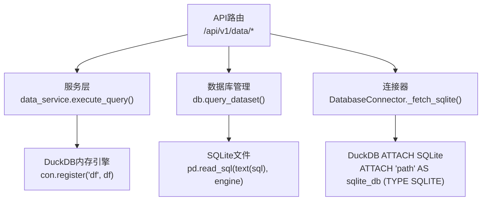
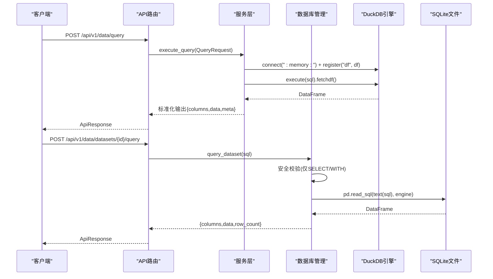
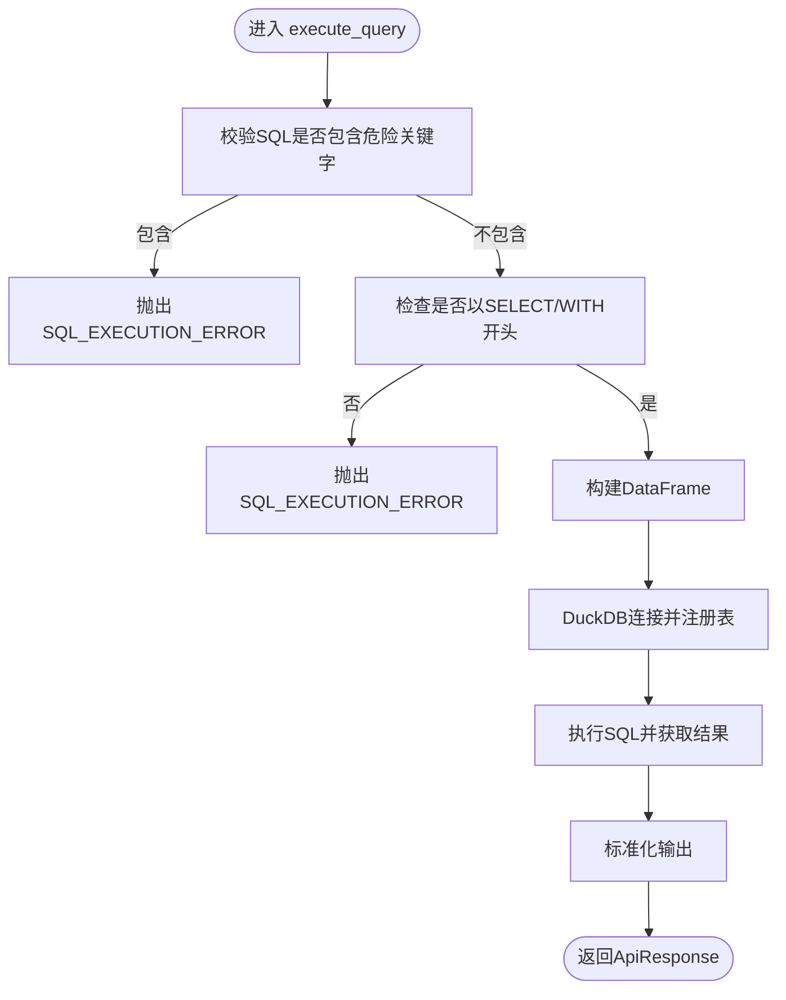
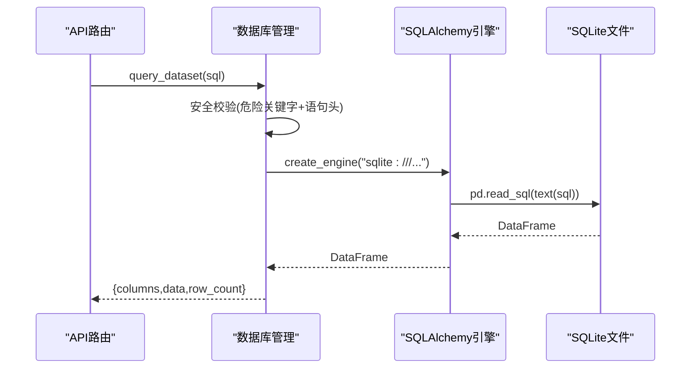
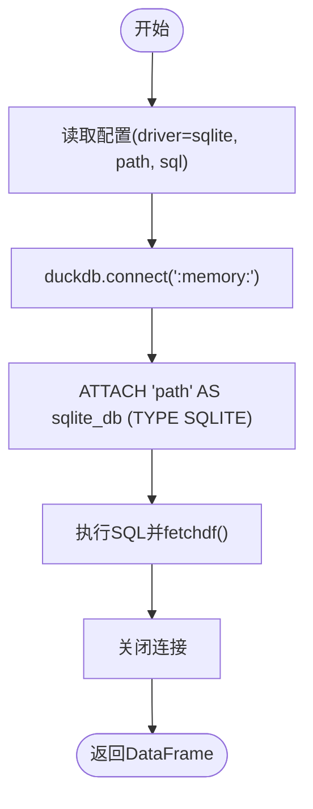
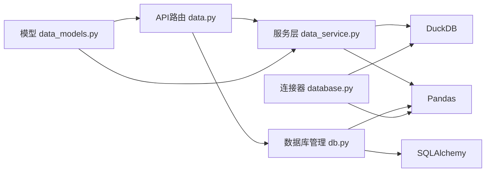

# SQL查询

<cite>
**本文引用的文件**
- [app/services/data_service.py](file://app/services/data_service.py)
- [app/core/db.py](file://app/core/db.py)
- [app/core/connectors/database.py](file://app/core/connectors/database.py)
- [app/api/v1/data.py](file://app/api/v1/data.py)
- [app/models/data_models.py](file://app/models/data_models.py)
- [tests/test_data_api.py](file://tests/test_data_api.py)
- [tests/test_dataset_api.py](file://tests/test_dataset_api.py)
</cite>

## 目录
1. [简介](#简介)
2. [项目结构](#项目结构)
3. [核心组件](#核心组件)
4. [架构总览](#架构总览)
5. [详细组件分析](#详细组件分析)
6. [依赖关系分析](#依赖关系分析)
7. [性能考量](#性能考量)
8. [故障排查指南](#故障排查指南)
9. [结论](#结论)
10. [附录：SQL示例与最佳实践](#附录sql示例与最佳实践)

## 简介
本模块提供基于 DuckDB 的 SQL 查询能力，支持两类场景：
- 对内存中的 Pandas DataFrame 执行 SQL（表名默认 df，可自定义）
- 对已入库 SQLite 数据集执行只读 SELECT/WITH 查询

系统通过严格的白名单校验（仅允许 SELECT、WITH 开头），并屏蔽危险关键字，确保查询安全。同时提供丰富的数据处理接口（筛选、聚合、透视、排序、去重、清洗、统计分析），便于在 API 层组合使用。

## 项目结构
围绕 SQL 查询的核心路径如下：
- API 路由：接收请求、参数校验、调用服务层
- 服务层：实现 DuckDB 查询、数据转换、错误处理
- 连接器：支持通过 DuckDB 直接查询 SQLite 文件
- 数据库管理：负责 SQLite 数据集的入库、元数据管理与只读查询
- 模型定义：统一的数据载体与请求模型

图表来源
- [app/api/v1/data.py:147-151](file://app/api/v1/data.py#L147-L151)
- [app/services/data_service.py:128-158](file://app/services/data_service.py#L128-L158)
- [app/core/db.py:262-296](file://app/core/db.py#L262-L296)
- [app/core/connectors/database.py:70-83](file://app/core/connectors/database.py#L70-L83)

章节来源
- [app/api/v1/data.py:108-151](file://app/api/v1/data.py#L108-L151)
- [app/services/data_service.py:120-158](file://app/services/data_service.py#L120-L158)
- [app/core/db.py:256-296](file://app/core/db.py#L256-L296)
- [app/core/connectors/database.py:19-83](file://app/core/connectors/database.py#L19-L83)

## 核心组件
- 服务层 SQL 执行：将传入的 DataFrame 注册为 DuckDB 虚拟表，执行 SQL 并返回结构化结果
- 数据库管理：对 SQLite 数据集进行只读查询，严格限制语句类型
- 连接器：通过 DuckDB 直接 ATTACH SQLite 文件执行 SQL
- 模型：统一的输入输出结构，保证序列化一致性

章节来源
- [app/services/data_service.py:128-158](file://app/services/data_service.py#L128-L158)
- [app/core/db.py:262-296](file://app/core/db.py#L262-L296)
- [app/core/connectors/database.py:70-83](file://app/core/connectors/database.py#L70-L83)
- [app/models/data_models.py:13-53](file://app/models/data_models.py#L13-L53)

## 架构总览
下图展示了从 API 到执行引擎的完整调用链，包括两种查询路径：内存 DataFrame 查询与 SQLite 数据集查询。

图表来源
- [app/api/v1/data.py:147-151](file://app/api/v1/data.py#L147-L151)
- [app/services/data_service.py:128-158](file://app/services/data_service.py#L128-L158)
- [app/core/db.py:262-296](file://app/core/db.py#L262-L296)

## 详细组件分析

### 组件A：服务层 DuckDB SQL 执行
- 功能：接收 DataFrameInput 与 SQL，注册为 DuckDB 表后执行查询，返回标准化输出
- 安全策略：正则屏蔽危险关键字；强制以 SELECT 或 WITH 开头
- 错误处理：捕获 DuckDB 异常并转换为应用异常
- 数据转换：将 NaN/Inf 转为 None，numpy 类型转 Python 原生类型，附带元信息

图表来源
- [app/services/data_service.py:122-158](file://app/services/data_service.py#L122-L158)

章节来源
- [app/services/data_service.py:120-158](file://app/services/data_service.py#L120-L158)
- [app/models/data_models.py:13-53](file://app/models/data_models.py#L13-L53)

### 组件B：SQLite 数据集只读查询
- 功能：对持久化的 SQLite 数据集执行只读查询，返回列名、数据与行数
- 安全策略：正则屏蔽危险关键字；强制以 SELECT 或 WITH 开头
- 执行方式：通过 SQLAlchemy 创建 SQLite 引擎，使用 pandas read_sql 执行
- 资源管理：每次查询独立引擎并释放

图表来源
- [app/core/db.py:256-296](file://app/core/db.py#L256-L296)
- [app/api/v1/data.py:108-122](file://app/api/v1/data.py#L108-L122)

章节来源
- [app/core/db.py:256-296](file://app/core/db.py#L256-L296)
- [app/api/v1/data.py:108-122](file://app/api/v1/data.py#L108-L122)

### 组件C：连接器 DuckDB 直连 SQLite
- 功能：通过 DuckDB 的 ATTACH 语法直接读取外部 SQLite 文件并执行 SQL
- 适用场景：Pipeline 或连接器配置中指定 SQLite 路径与 SQL
- 注意：该路径未在服务层做额外的 SQL 白名单校验，建议在调用方或上层进行安全控制

图表来源
- [app/core/connectors/database.py:70-83](file://app/core/connectors/database.py#L70-L83)

章节来源
- [app/core/connectors/database.py:19-83](file://app/core/connectors/database.py#L19-L83)

## 依赖关系分析
- API 路由依赖服务层与数据库管理模块
- 服务层依赖 DuckDB 与 Pandas
- 数据库管理依赖 SQLAlchemy 与 Pandas
- 连接器依赖 DuckDB 与 Pandas
- 模型定义被 API 与服务层共同使用

图表来源
- [app/api/v1/data.py:147-151](file://app/api/v1/data.py#L147-L151)
- [app/services/data_service.py:128-158](file://app/services/data_service.py#L128-L158)
- [app/core/db.py:262-296](file://app/core/db.py#L262-L296)
- [app/core/connectors/database.py:70-83](file://app/core/connectors/database.py#L70-L83)
- [app/models/data_models.py:13-53](file://app/models/data_models.py#L13-L53)

章节来源
- [app/api/v1/data.py:108-151](file://app/api/v1/data.py#L108-L151)
- [app/services/data_service.py:120-158](file://app/services/data_service.py#L120-L158)
- [app/core/db.py:256-296](file://app/core/db.py#L256-L296)
- [app/core/connectors/database.py:19-83](file://app/core/connectors/database.py#L19-L83)
- [app/models/data_models.py:13-53](file://app/models/data_models.py#L13-L53)

## 性能考量
- 内存查询（DuckDB）：适合中小规模数据，避免频繁创建连接，尽量复用连接或在单次请求内完成多次计算
- SQLite 查询：通过 SQLAlchemy 引擎执行，建议合理选择 WHERE/LIMIT 减少结果集大小
- 结果序列化：服务层将 numpy 类型转换为 Python 原生类型，避免 JSON 序列化开销过大
- 并发与线程：SQLite 查询在子线程中执行，避免阻塞事件循环
- 连接器 ATTACH：适用于一次性读取外部 SQLite，注意路径权限与文件锁

[本节为通用指导，不直接分析具体文件]

## 故障排查指南
- SQL 注入防护失败：检查是否包含危险关键字或被绕过；确认必须以 SELECT/WITH 开头
- 表不存在：确认 table_name 是否正确；对于 SQLite 查询需使用 ingest 返回的 table_name
- 数据类型错误：检查 DataFrame dtypes 提示与实际数据是否匹配；必要时在清洗阶段处理
- 连接错误：检查 SQLite 文件路径是否存在且可读；连接器配置是否完整
- 结果空：确认 SQL 条件是否过严；可使用 LIMIT 先验证结果集结构

章节来源
- [app/services/data_service.py:122-158](file://app/services/data_service.py#L122-L158)
- [app/core/db.py:256-296](file://app/core/db.py#L256-L296)
- [app/core/connectors/database.py:70-83](file://app/core/connectors/database.py#L70-L83)

## 结论
本模块提供了安全、易用的 SQL 查询能力，覆盖内存 DataFrame 与持久化 SQLite 数据集两类场景。通过严格的白名单校验与错误处理，保障查询安全与稳定性。结合 Pandas 的数据处理能力，可在 API 层灵活组合多种数据处理操作，满足复杂分析需求。

[本节为总结性内容，不直接分析具体文件]

## 附录：SQL示例与最佳实践

### 基础查询
- 选择列并过滤：SELECT name, score FROM df WHERE score > 85 ORDER BY score DESC
- 限制行数：SELECT * FROM df LIMIT 10

章节来源
- [tests/test_data_api.py:45-54](file://tests/test_data_api.py#L45-L54)
- [app/models/data_models.py:48-53](file://app/models/data_models.py#L48-L53)

### 复杂查询
- 多条件组合：SELECT name, age FROM df WHERE age > 27 AND city = 'Beijing'
- 子查询与别名：SELECT a.name, b.score FROM df a JOIN df b ON a.id = b.id
- 窗口函数：SELECT name, score, ROW_NUMBER() OVER(ORDER BY score DESC) AS rn FROM df

章节来源
- [tests/test_dataset_api.py:218-238](file://tests/test_dataset_api.py#L218-L238)
- [app/services/data_service.py:128-158](file://app/services/data_service.py#L128-L158)

### 聚合函数
- 分组求和与均值：SELECT city, SUM(score) AS score_sum, AVG(score) AS score_avg FROM df GROUP BY city
- 计数与极值：SELECT COUNT(*) AS cnt, MIN(score) AS min_score, MAX(score) AS max_score FROM df

章节来源
- [tests/test_data_api.py:91-104](file://tests/test_data_api.py#L91-L104)
- [app/services/data_service.py:218-243](file://app/services/data_service.py#L218-L243)

### 连接操作
- 自连接：SELECT a.name, b.score FROM df a JOIN df b ON a.city = b.city
- 多表连接（SQLite 数据集）：SELECT t1.name, t2.score FROM "table_a" t1 JOIN "table_b" t2 ON t1.id = t2.id

章节来源
- [app/core/db.py:262-296](file://app/core/db.py#L262-L296)
- [tests/test_dataset_api.py:218-238](file://tests/test_dataset_api.py#L218-L238)

### 与 Pandas DataFrame 集成
- 输入：DataFrameInput(columns, data, dtypes)
- 输出：DataFrameOutput(columns, data, meta)，其中 meta 包含 row_count、column_count、dtypes
- 转换：服务层将 NaN/Inf 转为 None，numpy 类型转 Python 原生类型

章节来源
- [app/models/data_models.py:13-33](file://app/models/data_models.py#L13-L33)
- [app/services/data_service.py:35-72](file://app/services/data_service.py#L35-L72)

### 错误处理与安全最佳实践
- 安全限制：仅允许 SELECT/WITH 开头；屏蔽 INSERT/UPDATE/DELETE/DROP/CREATE/ALTER/TRUNCATE/EXEC/EXPORT/IMPORT 等关键字
- 常见错误码：SQL_EXECUTION_ERROR、PARAM_VALIDATION_ERROR、RESOURCE_NOT_FOUND、DATASET_ERROR
- 建议：始终使用白名单校验；对大结果集使用 LIMIT；避免在 SQL 中拼接用户输入

章节来源
- [app/services/data_service.py:122-158](file://app/services/data_service.py#L122-L158)
- [app/core/db.py:256-296](file://app/core/db.py#L256-L296)
- [tests/test_data_api.py:56-63](file://tests/test_data_api.py#L56-L63)
- [tests/test_dataset_api.py:240-248](file://tests/test_dataset_api.py#L240-L248)