# 数据处理功能

<cite>
**本文引用的文件**
- [app/main.py](file://app/main.py)
- [app/config.py](file://app/config.py)
- [app/core/db.py](file://app/core/db.py)
- [app/services/data_service.py](file://app/services/data_service.py)
- [app/models/data_models.py](file://app/models/data_models.py)
- [app/api/v1/data.py](file://app/api/v1/data.py)
- [app/core/errors.py](file://app/core/errors.py)
- [app/core/file_manager.py](file://app/core/file_manager.py)
- [requirements.txt](file://requirements.txt)
</cite>

## 目录
1. [简介](#简介)
2. [项目结构](#项目结构)
3. [核心组件](#核心组件)
4. [架构总览](#架构总览)
5. [详细组件分析](#详细组件分析)
6. [依赖关系分析](#依赖关系分析)
7. [性能与内存管理](#性能与内存管理)
8. [故障排查指南](#故障排查指南)
9. [结论](#结论)
10. [附录：API 参考与最佳实践](#附录api-参考与最佳实践)

## 简介
本模块提供面向 AI Agent 的通用数据处理能力，覆盖文件解析（CSV、Excel、JSON）、SQL 查询执行（DuckDB 内存数据库）、数据筛选、聚合统计、透视表生成、排序去重、数据清洗与转换、统计分析等。同时支持将解析后的数据持久化到 SQLite，并通过只读 SQL 进行安全查询。系统基于 FastAPI 暴露 RESTful API，使用 Pydantic 模型进行请求/响应校验，结合 Pandas DataFrame 完成高效的数据处理流程。

## 项目结构
- 入口与生命周期：应用启动时初始化 SQLite 数据集库并启动临时文件清理任务；注册中间件、异常处理器与路由。
- 配置：集中管理路径、端口、日志级别、数据库路径等。
- 数据服务：封装文件解析、SQL 查询、筛选、聚合、透视、排序、去重、清洗、统计分析等核心逻辑。
- 数据模型：统一的 DataFrame 输入输出结构与各类请求模型。
- API 路由：对外暴露 /data/* 接口，包括入库、查询、单步数据处理等。
- 数据库层：SQLite 元数据管理与只读查询执行。
- 错误处理：统一业务异常与全局异常处理器。
- 文件管理：临时文件存储、下载与定时清理。

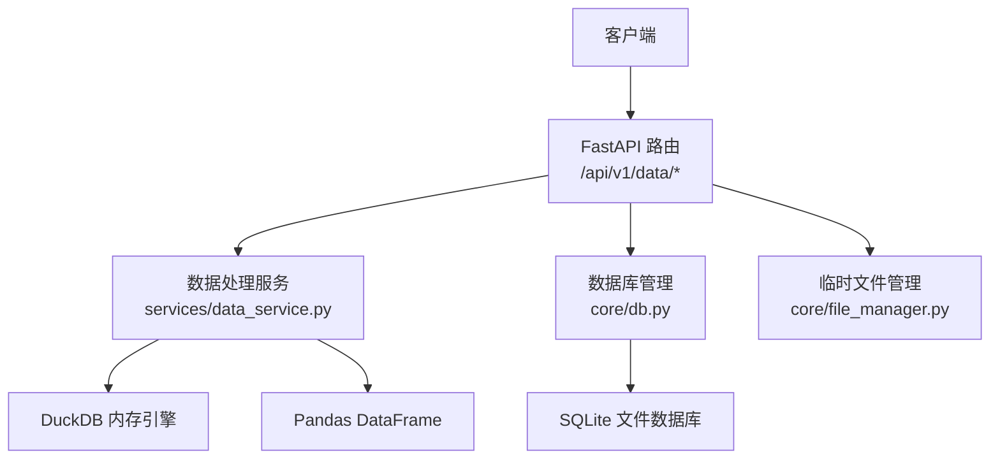

图表来源
- [app/main.py:29-95](file://app/main.py#L29-L95)
- [app/api/v1/data.py:27-201](file://app/api/v1/data.py#L27-L201)
- [app/services/data_service.py:77-447](file://app/services/data_service.py#L77-L447)
- [app/core/db.py:59-296](file://app/core/db.py#L59-L296)
- [app/core/file_manager.py:15-78](file://app/core/file_manager.py#L15-L78)

章节来源
- [app/main.py:29-95](file://app/main.py#L29-L95)
- [app/config.py:6-22](file://app/config.py#L6-L22)
- [app/api/v1/data.py:27-201](file://app/api/v1/data.py#L27-L201)

## 核心组件
- 文件解析：自动编码检测，支持 CSV/Excel/JSON，返回标准化 DataFrame 输出。
- SQL 查询：基于 DuckDB 内存数据库的安全 SELECT/WITH 查询。
- 数据筛选：多条件组合（AND/OR），支持多种运算符。
- 聚合统计：groupby + 多函数聚合，列名扁平化。
- 透视表：行列展开与聚合，支持 MultiIndex 列名扁平化。
- 排序与去重：按列排序、保留策略控制。
- 数据清洗：空值填充/删除、类型转换、文本清洗、异常值过滤。
- 统计分析：描述性统计、相关性矩阵、频率分布。
- 数据集入库与查询：DataFrame 持久化为 SQLite 表，只读 SQL 查询。

章节来源
- [app/services/data_service.py:77-447](file://app/services/data_service.py#L77-L447)
- [app/core/db.py:89-296](file://app/core/db.py#L89-L296)
- [app/models/data_models.py:13-145](file://app/models/data_models.py#L13-L145)

## 架构总览
整体采用“路由 -> 服务 -> 工具/引擎”的分层设计：
- 路由层负责参数校验、调用服务、统一响应封装。
- 服务层实现具体数据处理逻辑，使用 Pandas 与 DuckDB。
- 数据库层通过 SQLAlchemy 与 sqlite3 管理 SQLite 数据集与元数据。
- 异常与配置贯穿各层，保证一致性与可维护性。

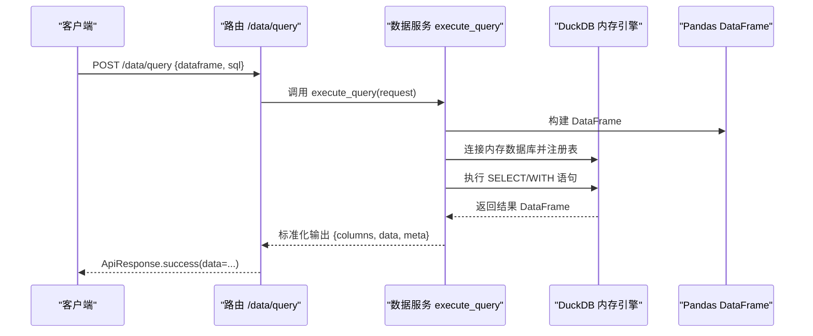

图表来源
- [app/api/v1/data.py:147-151](file://app/api/v1/data.py#L147-L151)
- [app/services/data_service.py:128-158](file://app/services/data_service.py#L128-L158)

章节来源
- [app/api/v1/data.py:147-151](file://app/api/v1/data.py#L147-L151)
- [app/services/data_service.py:128-158](file://app/services/data_service.py#L128-L158)

## 详细组件分析

### 文件解析（CSV、Excel、JSON）
- 自动编码检测：对 CSV/JSON 使用 chardet 检测编码，提升兼容性。
- 解析流程：根据扩展名选择 pandas 读取器，转换为统一输出格式。
- 错误处理：不支持格式或解析失败抛出统一业务异常。

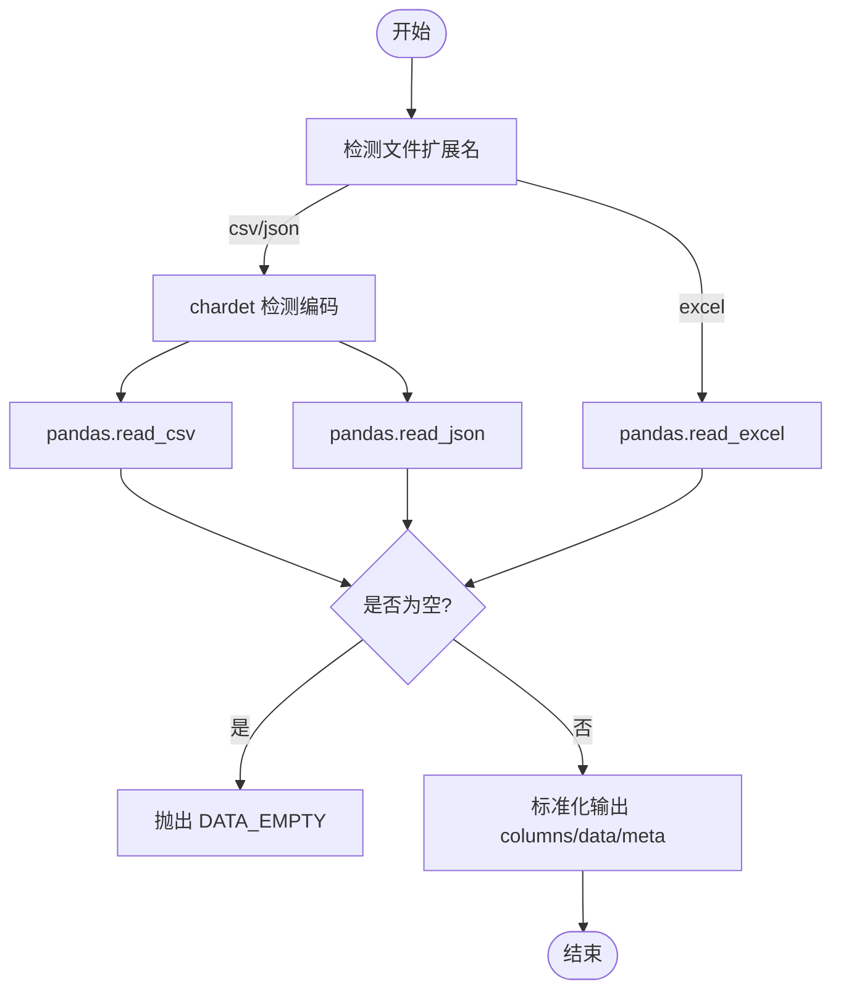

图表来源
- [app/services/data_service.py:77-117](file://app/services/data_service.py#L77-L117)

章节来源
- [app/services/data_service.py:77-117](file://app/services/data_service.py#L77-L117)

### SQL 查询执行（DuckDB 内存数据库）
- 安全限制：仅允许 SELECT/WITH 开头，拦截危险关键字。
- 执行流程：将 DataFrame 注册为内存表，执行 SQL 后取回结果。
- 错误处理：捕获 DuckDB 错误并转为业务异常。

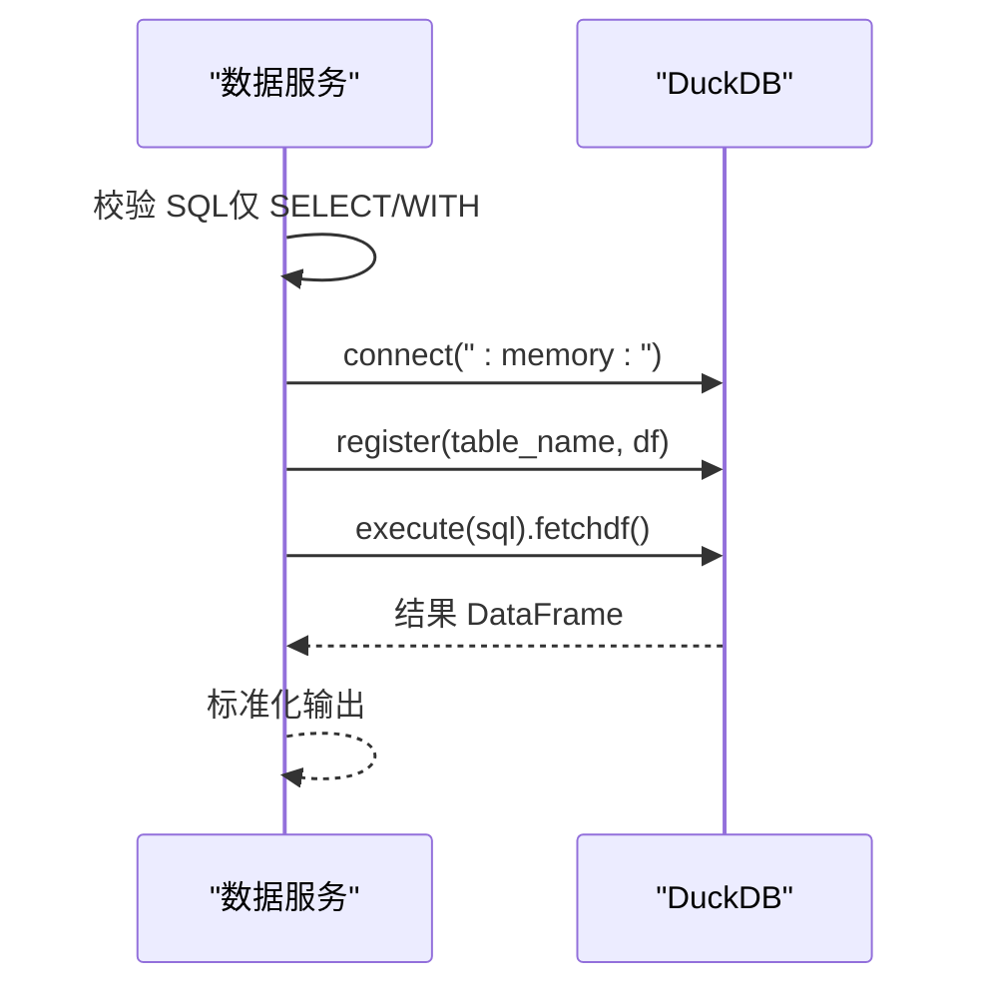

图表来源
- [app/services/data_service.py:128-158](file://app/services/data_service.py#L128-L158)

章节来源
- [app/services/data_service.py:128-158](file://app/services/data_service.py#L128-L158)

### 数据筛选
- 支持运算符：eq、ne、gt、ge、lt、le、in、not_in、contains、startswith、endswith。
- 逻辑组合：AND/OR 多条件组合。
- 错误处理：列不存在或运算符不支持时报错。

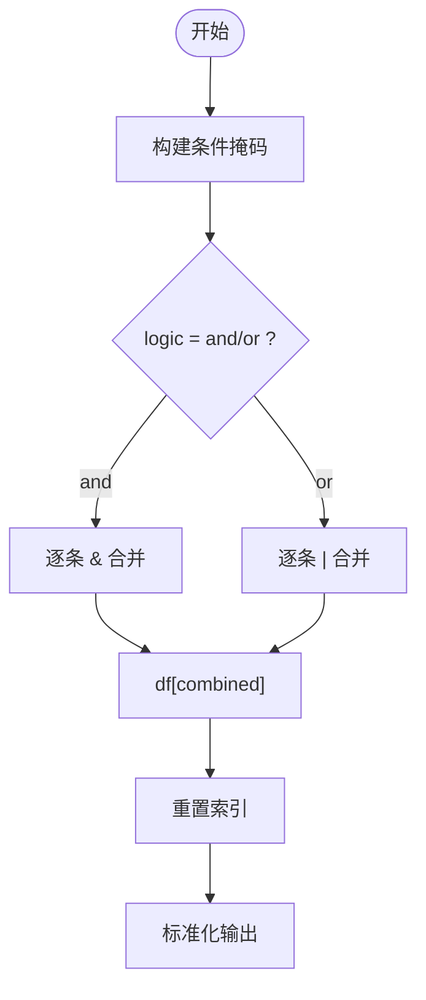

图表来源
- [app/services/data_service.py:178-210](file://app/services/data_service.py#L178-L210)

章节来源
- [app/services/data_service.py:178-210](file://app/services/data_service.py#L178-L210)

### 聚合统计
- 分组聚合：group_by + agg_columns + 多函数（sum/mean/count/min/max/median/std/var）。
- 列名扁平化：MultiIndex 列名拼接为 col_func 形式。
- 错误处理：聚合失败转为数据类型错误。

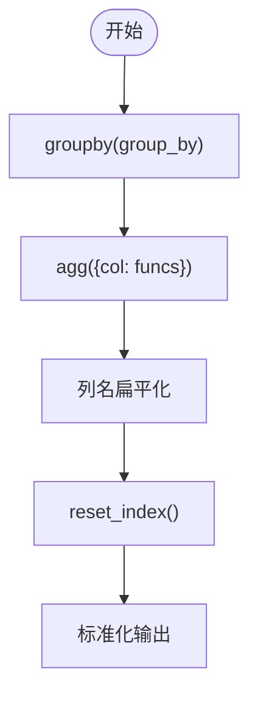

图表来源
- [app/services/data_service.py:218-243](file://app/services/data_service.py#L218-L243)

章节来源
- [app/services/data_service.py:218-243](file://app/services/data_service.py#L218-L243)

### 透视表生成
- 行列展开：index/columns/values 指定，默认聚合函数 sum。
- 列名扁平化：MultiIndex 列名拼接去除多余下划线。
- 错误处理：生成失败转为数据类型错误。

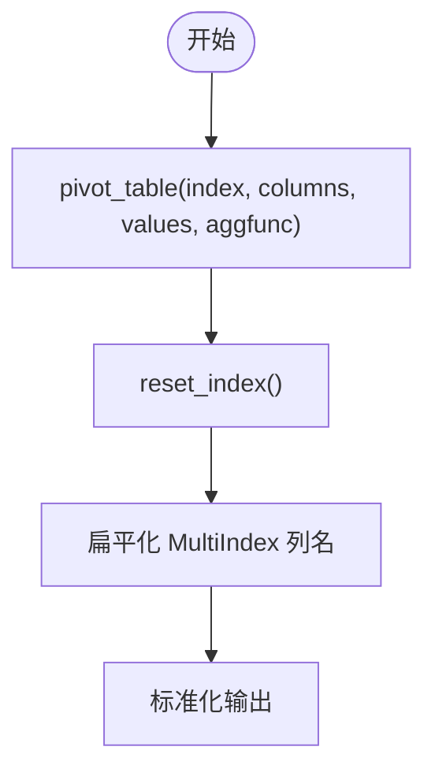

图表来源
- [app/services/data_service.py:248-272](file://app/services/data_service.py#L248-L272)

章节来源
- [app/services/data_service.py:248-272](file://app/services/data_service.py#L248-L272)

### 排序与去重
- 排序：支持多列排序与升/降序控制。
- 去重：支持 subset 列去重与 keep 策略（first/last/false）。
- 错误处理：无特殊异常，保持幂等。

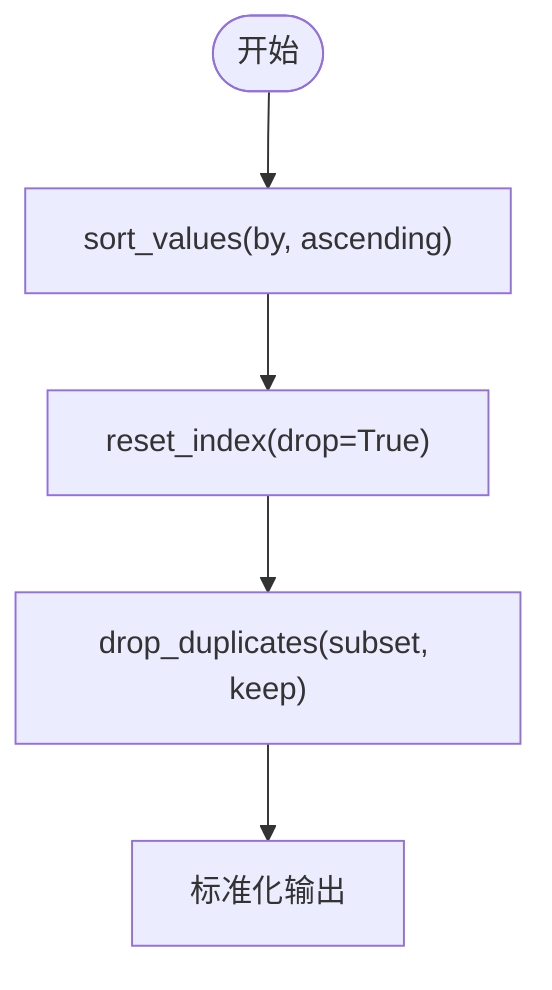

图表来源
- [app/services/data_service.py:277-295](file://app/services/data_service.py#L277-L295)

章节来源
- [app/services/data_service.py:277-295](file://app/services/data_service.py#L277-L295)

### 数据清洗与转换
- 空值处理：fill_na/drop_na，支持全列或指定列。
- 类型转换：cast_type 支持 int/float/str/datetime/bool 及自定义类型。
- 文本清洗：strip_text/replace_text，支持正则替换。
- 异常值过滤：基于 IQR 方法 drop_outliers。
- 错误处理：参数缺失或类型转换失败抛出业务异常。

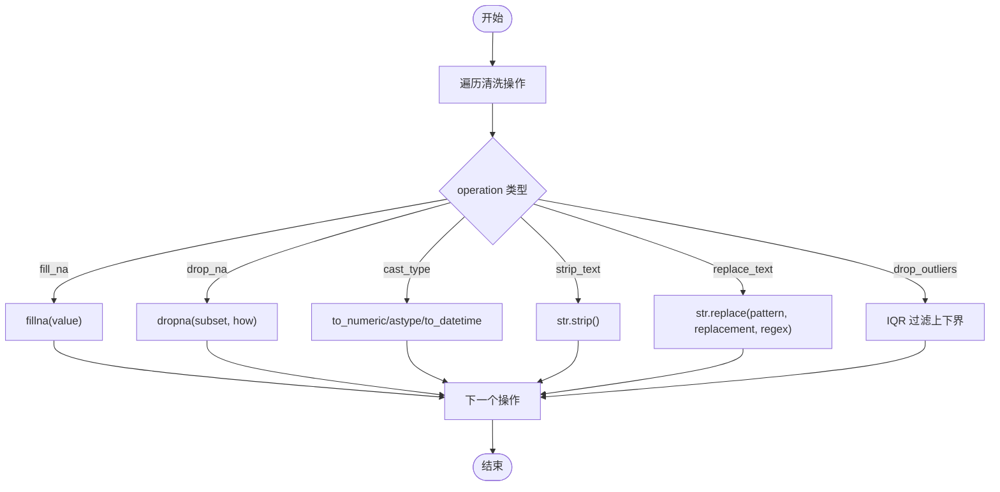

图表来源
- [app/services/data_service.py:300-395](file://app/services/data_service.py#L300-L395)

章节来源
- [app/services/data_service.py:300-395](file://app/services/data_service.py#L300-L395)

### 统计分析
- 描述性统计：describe，返回常用统计指标。
- 相关性矩阵：corr，至少需要两个数值列。
- 频率分布：value_counts 或 cut 分箱，计算百分比。
- 错误处理：无数值列或参数不合法时报错。

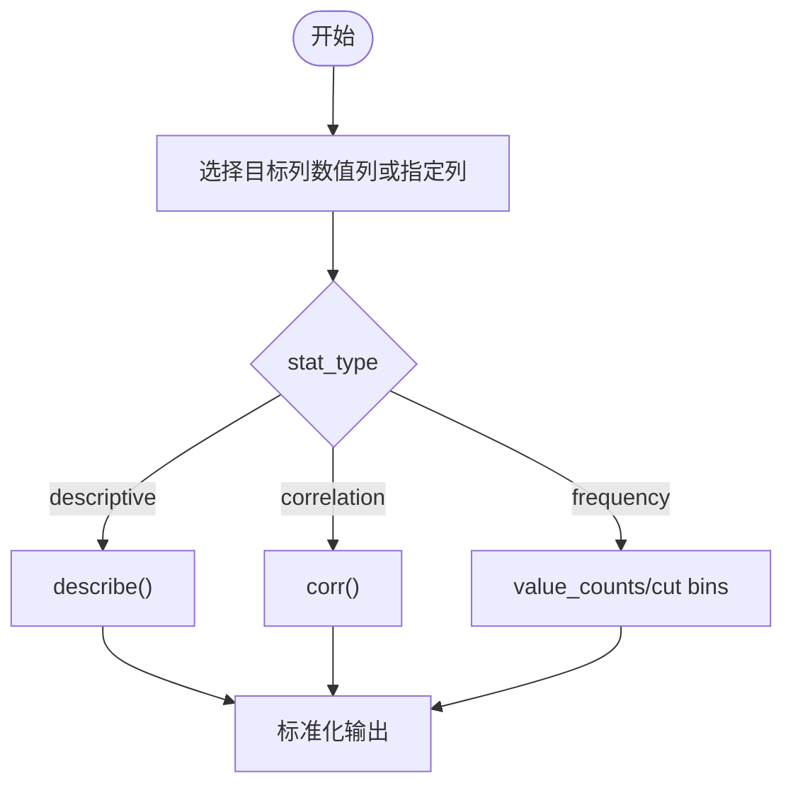

图表来源
- [app/services/data_service.py:400-446](file://app/services/data_service.py#L400-L446)

章节来源
- [app/services/data_service.py:400-446](file://app/services/data_service.py#L400-L446)

### 数据集入库与只读 SQL 查询（SQLite）
- 入库模式：create（新建表）与 append（追加行），列兼容校验。
- 元数据管理：_datasets 表记录表名、文件名、行列数、列名、类型、文件类型等。
- 只读查询：仅允许 SELECT/WITH，防止写入操作。
- 删除：删除元数据与对应表。

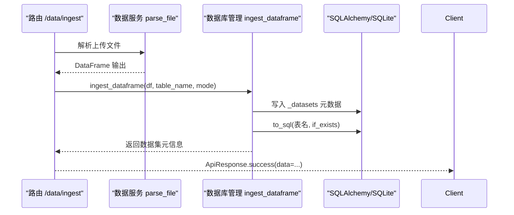

图表来源
- [app/api/v1/data.py:39-83](file://app/api/v1/data.py#L39-L83)
- [app/core/db.py:89-189](file://app/core/db.py#L89-L189)

章节来源
- [app/api/v1/data.py:39-83](file://app/api/v1/data.py#L39-L83)
- [app/core/db.py:89-189](file://app/core/db.py#L89-L189)

## 依赖关系分析
- 外部依赖：FastAPI、Uvicorn、Pydantic、Pandas、NumPy、DuckDB、Chardet、SQLAlchemy、Openpyxl、Matplotlib、Plotly、Kaleido、Jinja2、PyYAML、aiofiles、pytest、httpx。
- 内部耦合：路由层依赖服务层与数据库层；服务层依赖 Pandas/DuckDB；数据库层依赖 SQLAlchemy/sqlite3。
- 潜在循环依赖：未发现明显循环导入；各模块职责清晰。

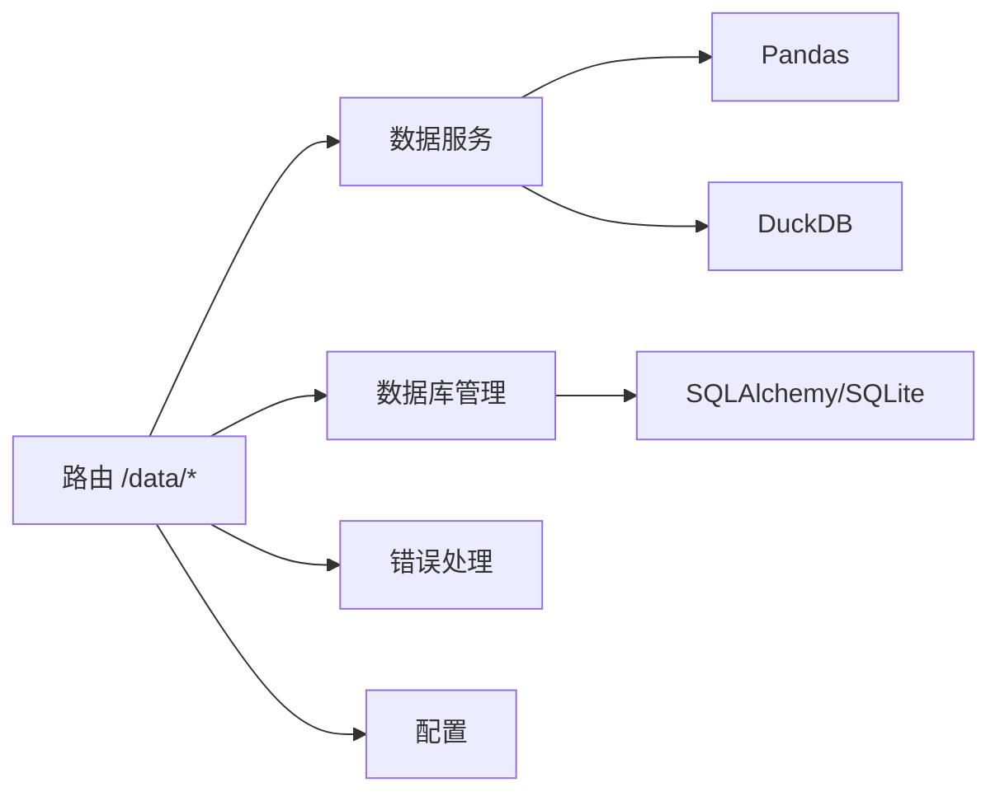

图表来源
- [requirements.txt:1-31](file://requirements.txt#L1-L31)
- [app/api/v1/data.py:1-201](file://app/api/v1/data.py#L1-L201)
- [app/services/data_service.py:1-447](file://app/services/data_service.py#L1-L447)
- [app/core/db.py:1-324](file://app/core/db.py#L1-L324)

章节来源
- [requirements.txt:1-31](file://requirements.txt#L1-L31)
- [app/api/v1/data.py:1-201](file://app/api/v1/data.py#L1-L201)

## 性能与内存管理
- 内存数据库：DuckDB 使用 :memory: 引擎，适合中等规模数据的快速分析与查询，避免磁盘 IO 开销。
- 批量操作：Pandas 向量化操作减少 Python 层循环，提高性能。
- 列名扁平化：避免 MultiIndex 带来的序列化与传输成本。
- 类型转换优化：使用 pd.to_numeric(errors="coerce") 与 Int64/Float64 扩展类型，降低转换失败风险。
- 并发与线程：数据库操作通过 asyncio.to_thread 在阻塞线程中执行，避免阻塞事件循环。
- 内存释放：DuckDB 连接使用后显式 close；SQLAlchemy 引擎 dispose 释放资源。
- 大文件建议：对于超大文件，考虑分块读取与流式处理；或使用 DuckDB 直接读取 CSV/Parquet 文件以提升性能。

[本节为通用指导，不直接分析具体文件]

## 故障排查指南
- 文件解析失败：检查文件格式与编码；确认 CSV/JSON/Excel 内容完整且非空。
- SQL 执行错误：确保 SQL 以 SELECT/WITH 开头；避免危险关键字；检查列名与数据类型。
- 筛选/聚合/透视失败：确认列存在且类型匹配；聚合函数受支持；透视表 index/columns/values 合理。
- 清洗操作失败：检查 cast_type 目标类型是否合法；datetime 格式化是否正确；replace_text 正则表达式是否有效。
- 数据集入库失败：append 模式下需指定 table_name；列名必须与已有表兼容；create 模式下表名不能冲突。
- 统一异常：所有异常均通过 AppException 抛出，并由全局异常处理器返回结构化响应。

章节来源
- [app/core/errors.py:15-74](file://app/core/errors.py#L15-L74)
- [app/services/data_service.py:77-447](file://app/services/data_service.py#L77-L447)
- [app/core/db.py:262-296](file://app/core/db.py#L262-L296)

## 结论
该数据处理模块提供了从文件解析到复杂数据分析的一站式能力，结合 Pandas 与 DuckDB 实现了高性能、可扩展的数据处理流程。通过严格的 SQL 安全限制与统一的异常处理机制，确保了系统的稳定性与安全性。配合 SQLite 持久化与只读查询，满足常见的数据集管理与分析需求。建议在大数据场景下结合分块读取与流式处理进一步优化性能。

[本节为总结，不直接分析具体文件]

## 附录：API 参考与最佳实践

### API 概览
- 文件入库：POST /data/ingest
- 列出数据集：GET /data/datasets
- 获取数据集详情：GET /data/datasets/{dataset_id}?preview=N
- 查询已入库数据：POST /data/datasets/{dataset_id}/query
- 删除数据集：DELETE /data/datasets/{dataset_id}
- 文件解析：POST /data/parse
- SQL 查询：POST /data/query
- 数据筛选：POST /data/filter
- 聚合统计：POST /data/aggregate
- 透视表：POST /data/pivot
- 排序：POST /data/sort
- 去重：POST /data/dedup
- 数据清洗：POST /data/clean
- 统计分析：POST /data/statistics

章节来源
- [app/api/v1/data.py:39-201](file://app/api/v1/data.py#L39-L201)

### 最佳实践
- 文件解析：优先使用 UTF-8 编码；CSV 注意分隔符与转义字符；Excel 注意日期与数字格式。
- SQL 查询：尽量使用索引列与必要字段；避免 SELECT *；合理使用 WITH 子句组织复杂查询。
- 筛选与聚合：先筛选再聚合以减少计算量；选择合适的聚合函数与分组列。
- 透视表：合理设置 index/columns/values；必要时进行后续重塑与列名规范化。
- 清洗与转换：尽早进行类型转换与空值处理；使用正则替换时谨慎测试。
- 性能优化：批量操作优先；避免不必要的复制与中间对象；及时释放数据库连接与引擎。
- 错误处理：捕获并记录异常上下文；返回结构化错误信息便于前端展示与调试。

[本节为通用指导，不直接分析具体文件]