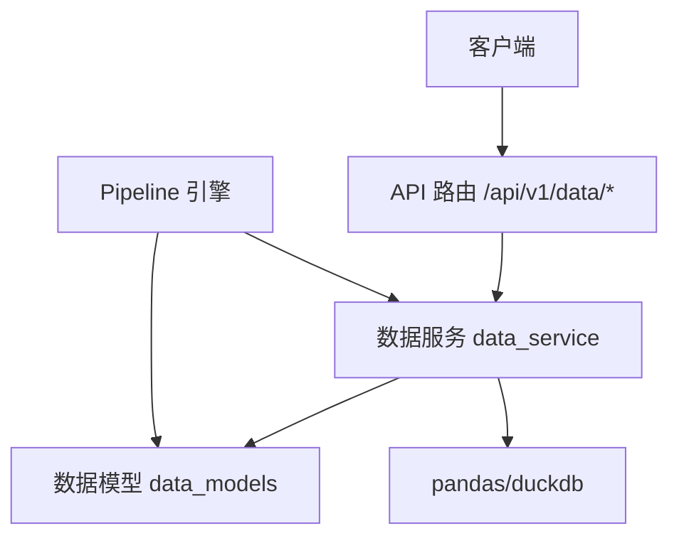
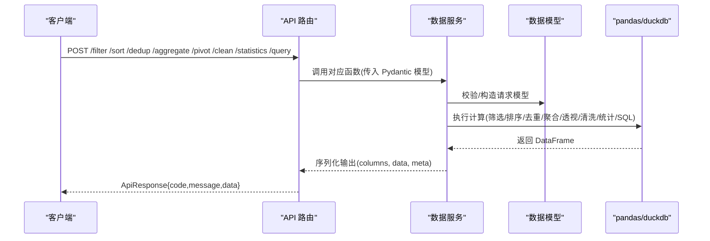
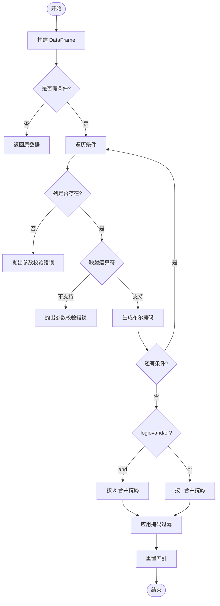
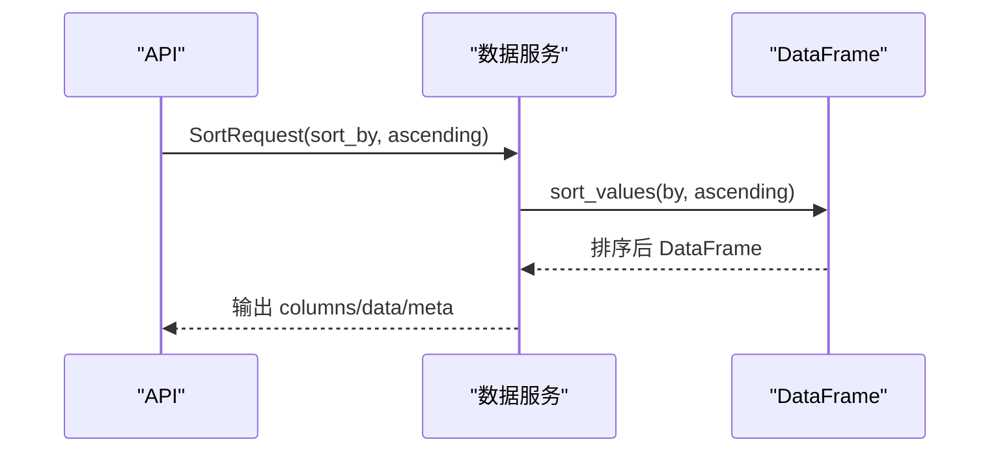
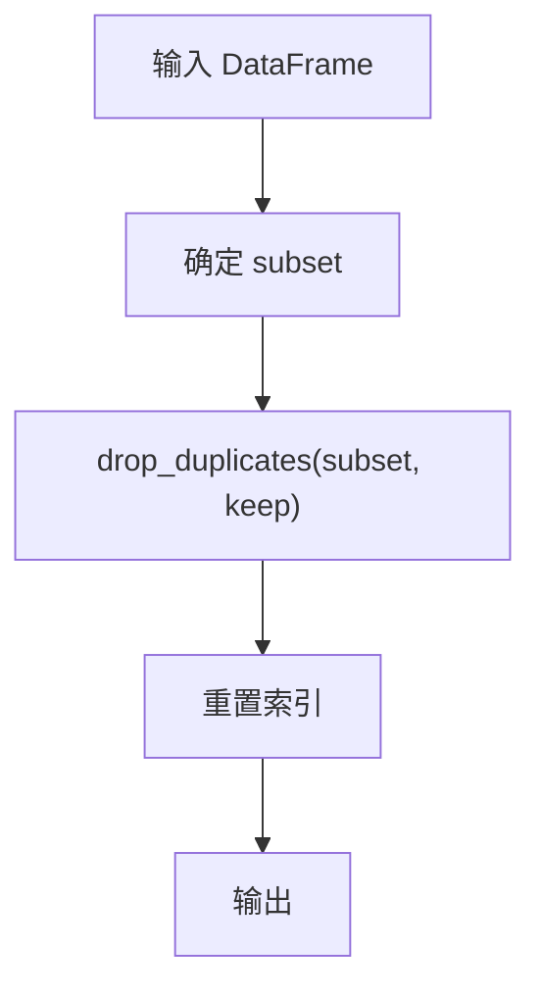
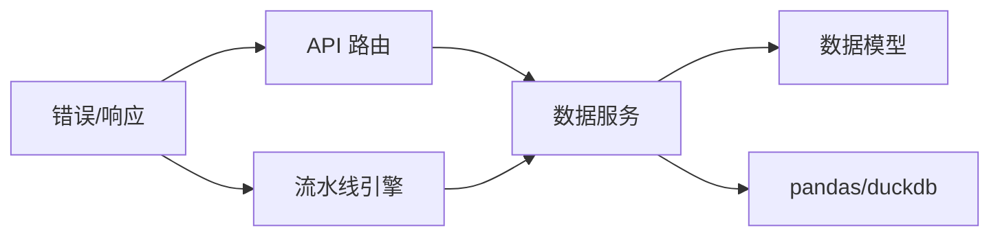

# 数据操作

<cite>
**本文引用的文件**
- [app/services/data_service.py](file://app/services/data_service.py)
- [app/models/data_models.py](file://app/models/data_models.py)
- [app/api/v1/data.py](file://app/api/v1/data.py)
- [app/core/pipeline_engine.py](file://app/core/pipeline_engine.py)
- [app/core/errors.py](file://app/core/errors.py)
- [app/core/response.py](file://app/core/response.py)
- [tests/test_data_api.py](file://tests/test_data_api.py)
</cite>

## 目录
1. [简介](#简介)
2. [项目结构](#项目结构)
3. [核心组件](#核心组件)
4. [架构总览](#架构总览)
5. [详细组件分析](#详细组件分析)
6. [依赖关系分析](#依赖关系分析)
7. [性能考虑与优化](#性能考虑与优化)
8. [故障排查指南](#故障排查指南)
9. [结论](#结论)
10. [附录：使用示例与最佳实践](#附录使用示例与最佳实践)

## 简介
本章节面向“数据操作”能力，系统性地说明筛选、排序、去重等核心操作的实现方式、参数配置与使用场景。文档覆盖以下要点：
- 筛选条件的构建方式（支持多种运算符与逻辑组合）
- 排序规则的配置方法
- 去重策略的选择与行为
- 复杂业务场景的处理思路
- 大数据集的性能考量与优化技巧
- 错误处理与可观测性

## 项目结构
数据操作功能由 API 层、服务层、模型层与流水线引擎共同组成：
- API 层：定义 REST 接口，接收请求并调用服务层
- 服务层：封装数据处理逻辑（筛选、聚合、透视、排序、去重、清洗、统计、SQL 查询）
- 模型层：统一的数据结构与请求/响应模型
- 流水线引擎：将多个数据处理步骤编排为可配置的流程，复用上述能力

图表来源
- [app/api/v1/data.py:1-201](file://app/api/v1/data.py#L1-L201)
- [app/services/data_service.py:1-447](file://app/services/data_service.py#L1-L447)
- [app/models/data_models.py:1-145](file://app/models/data_models.py#L1-L145)
- [app/core/pipeline_engine.py:1-357](file://app/core/pipeline_engine.py#L1-L357)

章节来源
- [app/api/v1/data.py:1-201](file://app/api/v1/data.py#L1-L201)
- [app/services/data_service.py:1-447](file://app/services/data_service.py#L1-L447)
- [app/models/data_models.py:1-145](file://app/models/data_models.py#L1-L145)
- [app/core/pipeline_engine.py:1-357](file://app/core/pipeline_engine.py#L1-L357)

## 核心组件
- 数据载体与元信息：DataFrameInput、DataFrameMeta、DataFrameOutput
- 筛选：FilterRequest、FilterCondition，支持多条件与 and/or 组合
- 排序：SortRequest，支持多列与升/降序
- 去重：DedupRequest，支持 subset 与 keep 策略
- 聚合与透视：AggregateRequest、PivotRequest
- 清洗：CleanRequest、CleanOperation，支持 fill_na/drop_na/cast_type/strip_text/replace_text/drop_outliers
- 统计分析：StatisticsRequest，支持 descriptive/correlation/frequency
- SQL 查询：QueryRequest，基于 DuckDB 的安全执行

章节来源
- [app/models/data_models.py:13-145](file://app/models/data_models.py#L13-L145)
- [app/services/data_service.py:35-73](file://app/services/data_service.py#L35-L73)

## 架构总览
数据操作从 API 进入，服务层完成具体计算，返回统一的 DataFrame 输出格式；流水线引擎可将多个步骤串联，复用同一套能力。

图表来源
- [app/api/v1/data.py:139-201](file://app/api/v1/data.py#L139-L201)
- [app/services/data_service.py:128-447](file://app/services/data_service.py#L128-L447)
- [app/models/data_models.py:13-145](file://app/models/data_models.py#L13-L145)

## 详细组件分析

### 筛选（Filter）
- 支持的运算符：eq、ne、gt、ge、lt、le、in、not_in、contains、startswith、endswith
- 逻辑组合：logic 支持 and/or，默认 and
- 条件校验：列必须存在，运算符需合法
- 结果：返回满足条件的行，重置索引

图表来源
- [app/services/data_service.py:163-210](file://app/services/data_service.py#L163-L210)
- [app/models/data_models.py:57-69](file://app/models/data_models.py#L57-L69)

章节来源
- [app/services/data_service.py:163-210](file://app/services/data_service.py#L163-L210)
- [app/models/data_models.py:57-69](file://app/models/data_models.py#L57-L69)
- [tests/test_data_api.py:66-89](file://tests/test_data_api.py#L66-L89)

### 排序（Sort）
- 支持多列排序：sort_by 为列表
- 升/降序：ascending 可为 bool 或列表（与 sort_by 一一对应）
- 结果：返回排序后的 DataFrame，重置索引

图表来源
- [app/services/data_service.py:277-284](file://app/services/data_service.py#L277-L284)
- [app/models/data_models.py:97-102](file://app/models/data_models.py#L97-L102)
- [tests/test_data_api.py:107-120](file://tests/test_data_api.py#L107-L120)

章节来源
- [app/services/data_service.py:277-284](file://app/services/data_service.py#L277-L284)
- [app/models/data_models.py:97-102](file://app/models/data_models.py#L97-L102)
- [tests/test_data_api.py:107-120](file://tests/test_data_api.py#L107-L120)

### 去重（Dedup）
- subset：指定去重依据的列，为空则全列去重
- keep：保留策略 first/last/false（false 表示删除所有重复项）
- 结果：返回去重后的 DataFrame，重置索引

图表来源
- [app/services/data_service.py:289-295](file://app/services/data_service.py#L289-L295)
- [app/models/data_models.py:106-111](file://app/models/data_models.py#L106-L111)
- [tests/test_data_api.py:122-133](file://tests/test_data_api.py#L122-L133)

章节来源
- [app/services/data_service.py:289-295](file://app/services/data_service.py#L289-L295)
- [app/models/data_models.py:106-111](file://app/models/data_models.py#L106-L111)
- [tests/test_data_api.py:122-133](file://tests/test_data_api.py#L122-L133)

### 聚合（Aggregate）
- group_by：分组列
- agg_columns：目标数值列
- agg_funcs：支持的函数 sum/mean/count/min/max/median/std/var
- 结果：扁平化 MultiIndex 列名，返回聚合后的 DataFrame

章节来源
- [app/services/data_service.py:218-243](file://app/services/data_service.py#L218-L243)
- [app/models/data_models.py:73-82](file://app/models/data_models.py#L73-L82)
- [tests/test_data_api.py:91-105](file://tests/test_data_api.py#L91-L105)

### 透视（Pivot）
- index/columns/values：行列与值列
- agg_func：聚合函数（默认 sum）
- 结果：扁平化列名，返回透视表

章节来源
- [app/services/data_service.py:248-272](file://app/services/data_service.py#L248-L272)
- [app/models/data_models.py:86-93](file://app/models/data_models.py#L86-L93)

### 清洗（Clean）
- 支持操作：fill_na、drop_na、cast_type、strip_text、replace_text、drop_outliers
- 参数：column（可选）、params（可选）
- 异常值剔除：基于 IQR 方法，factor 可配置

章节来源
- [app/services/data_service.py:300-395](file://app/services/data_service.py#L300-L395)
- [app/models/data_models.py:115-129](file://app/models/data_models.py#L115-L129)

### 统计分析（Statistics）
- 类型：descriptive（描述性统计）、correlation（相关性矩阵）、frequency（频率分布）
- 自动选择数值列或指定列
- 频率分布：数值型按 bins 分箱，分类型按类别计数，附带百分比

章节来源
- [app/services/data_service.py:400-447](file://app/services/data_service.py#L400-L447)
- [app/models/data_models.py:133-145](file://app/models/data_models.py#L133-L145)
- [tests/test_data_api.py:153-174](file://tests/test_data_api.py#L153-L174)

### SQL 查询（Query）
- 安全限制：仅允许 SELECT/WITH 开头，禁止危险关键字
- 执行：将 DataFrame 注册为内存表，使用 DuckDB 执行
- 结果：返回查询结果的 DataFrame 输出

章节来源
- [app/services/data_service.py:122-158](file://app/services/data_service.py#L122-L158)
- [app/models/data_models.py:48-53](file://app/models/data_models.py#L48-L53)
- [tests/test_data_api.py:44-64](file://tests/test_data_api.py#L44-L64)

### 流水线编排（Pipeline）
- 通过 YAML 场景配置驱动，自动加载数据源、执行步骤、组装输出
- 支持条件跳过、错误处理（skip/abort）
- 复用数据服务的 filter/sort/dedup/aggregate/pivot/clean/statistics/query 能力

章节来源
- [app/core/pipeline_engine.py:39-357](file://app/core/pipeline_engine.py#L39-L357)

## 依赖关系分析
- API 路由依赖数据服务与模型，负责入参校验与响应封装
- 数据服务依赖 pandas/duckdb 进行计算，依赖模型进行结构化约束
- 流水线引擎依赖连接器与数据服务，实现步骤编排
- 错误与响应统一由 core 模块提供

图表来源
- [app/api/v1/data.py:1-201](file://app/api/v1/data.py#L1-L201)
- [app/services/data_service.py:1-447](file://app/services/data_service.py#L1-L447)
- [app/core/pipeline_engine.py:1-357](file://app/core/pipeline_engine.py#L1-L357)
- [app/core/errors.py:1-74](file://app/core/errors.py#L1-L74)
- [app/core/response.py:1-103](file://app/core/response.py#L1-L103)

章节来源
- [app/api/v1/data.py:1-201](file://app/api/v1/data.py#L1-L201)
- [app/services/data_service.py:1-447](file://app/services/data_service.py#L1-L447)
- [app/core/pipeline_engine.py:1-357](file://app/core/pipeline_engine.py#L1-L357)
- [app/core/errors.py:1-74](file://app/core/errors.py#L1-L74)
- [app/core/response.py:1-103](file://app/core/response.py#L1-L103)

## 性能考虑与优化
- 内存与数据量
  - 服务层使用 pandas 在内存中处理数据，适合中小规模数据集；对于大数据集建议结合 DuckDB SQL 进行过滤与投影，减少内存占用
  - 在 pipeline 中可通过先执行 SQL 筛选再后续处理的顺序降低中间结果大小
- 筛选与排序
  - 优先使用 SQL 的 WHERE/ORDER BY 做粗筛与排序，再将小结果集交给 pandas 做精细处理
  - 避免在 Python 层对超大列进行字符串转换（如 contains/startswith），必要时在 SQL 层完成
- 聚合与透视
  - 合理选择 group_by 列数量与维度，避免高基数导致的爆炸式结果
  - 使用合适的 agg_func，避免不必要的计算
- 去重
  - 明确 subset 以减少比较开销；keep=false 会删除所有重复项，谨慎使用
- 清洗
  - cast_type 时尽量批量转换，避免逐行转换
  - drop_outliers 前确保数值列已转换为数值类型
- 序列化开销
  - df_to_output 会将 numpy 类型转为原生 Python 类型，注意在大结果集时的序列化成本

[本节为通用性能指导，不直接分析具体文件]

## 故障排查指南
- 常见错误与定位
  - 参数校验失败：检查列名、运算符、必填字段是否完整
  - SQL 执行错误：确认语句以 SELECT/WITH 开头，且不含危险关键字
  - 数据类型错误：清洗或聚合前确保列类型正确
  - 资源不存在：数据集 ID 无效或未入库
- 错误处理机制
  - 自定义异常 AppException 携带 code/message/data
  - 全局异常处理器统一封装为 ApiResponse，便于前端识别与提示
- 日志与可观测性
  - 流水线引擎记录每步耗时与状态，便于定位瓶颈与失败点

章节来源
- [app/core/errors.py:15-74](file://app/core/errors.py#L15-L74)
- [app/core/response.py:12-103](file://app/core/response.py#L12-L103)
- [app/core/pipeline_engine.py:274-357](file://app/core/pipeline_engine.py#L274-L357)

## 结论
数据操作模块提供了完整的筛选、排序、去重、聚合、透视、清洗与统计分析能力，并通过统一的 API 与模型暴露。配合流水线引擎，可实现场景化的自动化数据处理。针对大数据集，建议优先利用 SQL 进行高效筛选与投影，并结合合理的聚合与清洗策略，以获得更好的性能与稳定性。

[本节为总结性内容，不直接分析具体文件]

## 附录：使用示例与最佳实践
- 筛选
  - 单条件：按城市等于某值筛选
  - 多条件：年龄大于阈值且分数在某范围内，逻辑 or/and 组合
  - 文本匹配：包含、前缀、后缀匹配
- 排序
  - 单列降序：按分数从高到低
  - 多列排序：先按城市升序，再按分数降序
- 去重
  - 按城市去重，保留首次出现
  - 按多列组合去重，保留最后一次
- 聚合
  - 按城市分组，求和与均值
- 透视
  - 以城市为行、月份为列、销售额为值，聚合函数 sum
- 清洗
  - 空值填充、缺失行删除、类型转换、文本去空格、正则替换、异常值剔除
- 统计分析
  - 描述性统计、相关性矩阵、频率分布（数值分箱/分类频次）
- 复杂场景
  - 先用 SQL 做粗筛与投影，再用筛选/排序细化，最后聚合/透视出报表
  - 在流水线中串联多个步骤，设置条件与错误处理策略

章节来源
- [tests/test_data_api.py:44-174](file://tests/test_data_api.py#L44-L174)
- [app/api/v1/data.py:139-201](file://app/api/v1/data.py#L139-L201)
- [app/services/data_service.py:128-447](file://app/services/data_service.py#L128-L447)