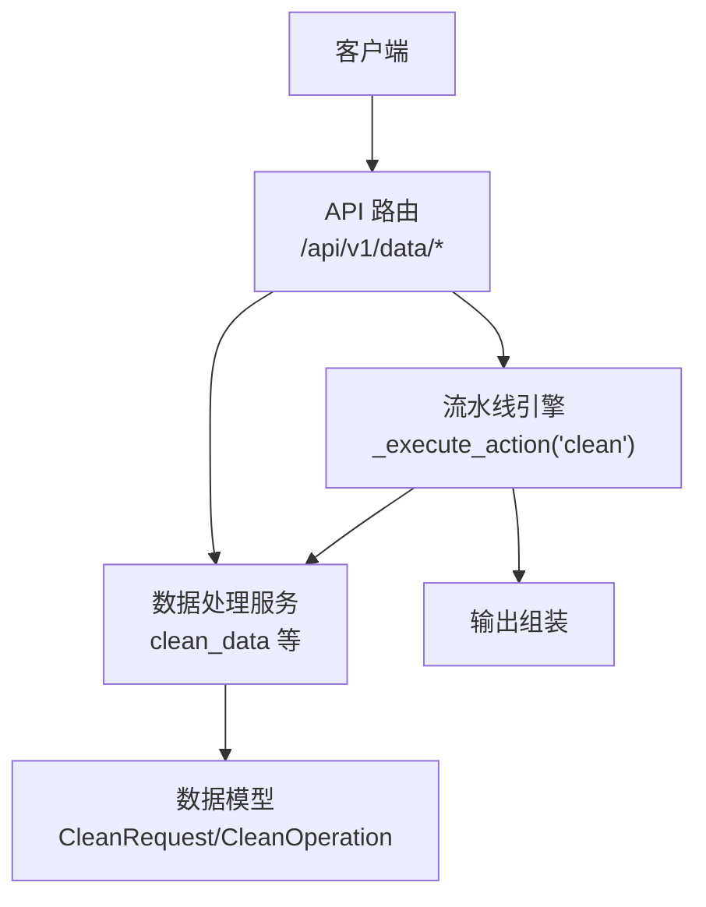
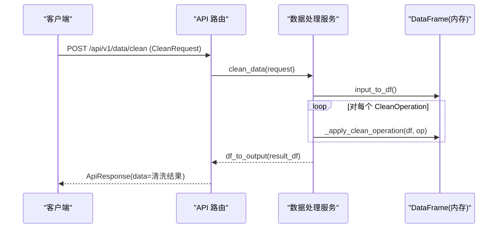
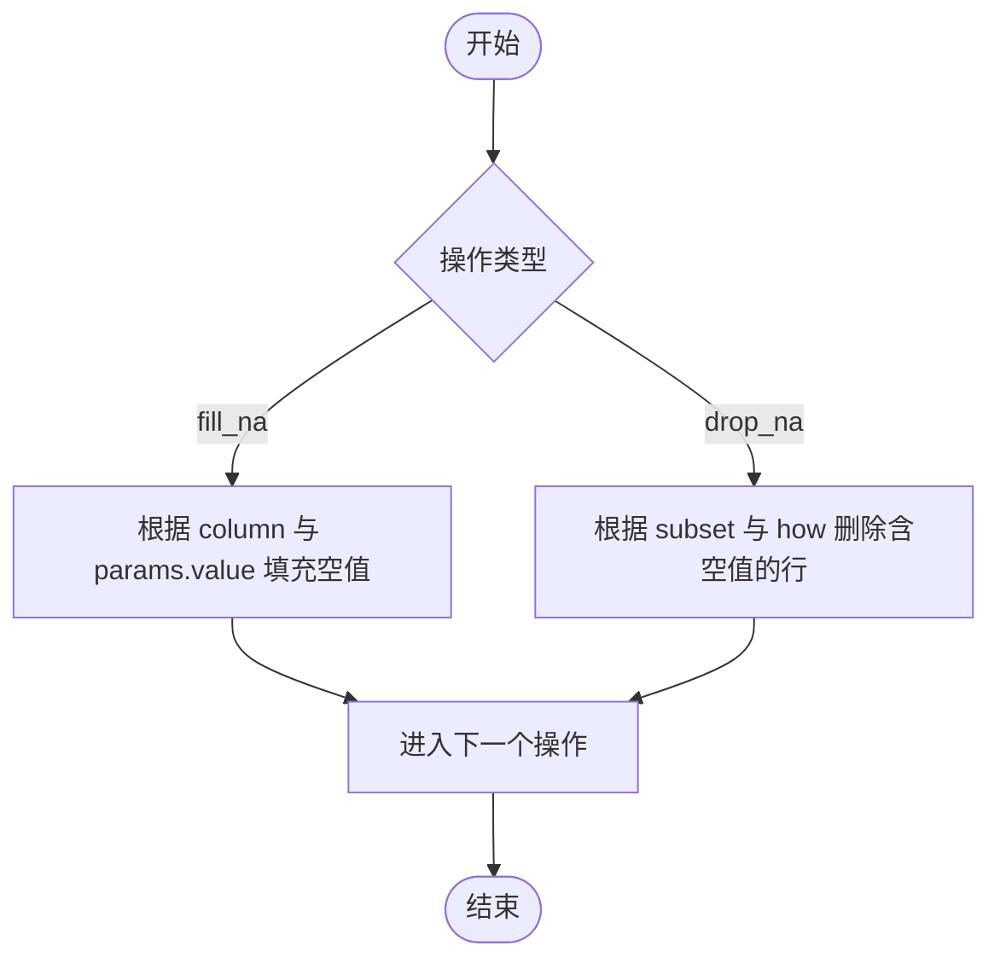
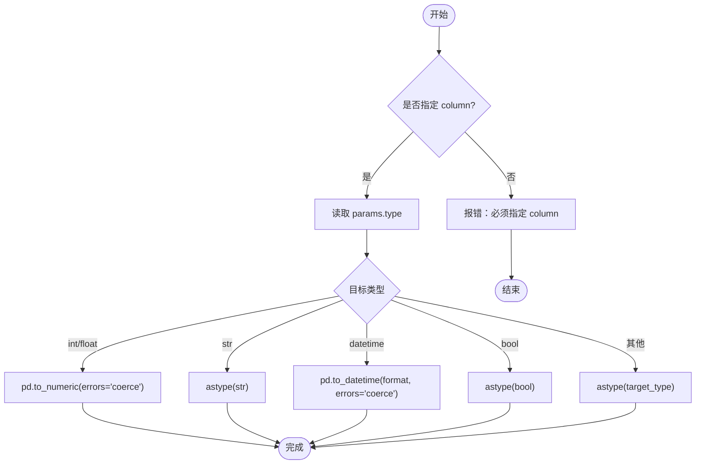
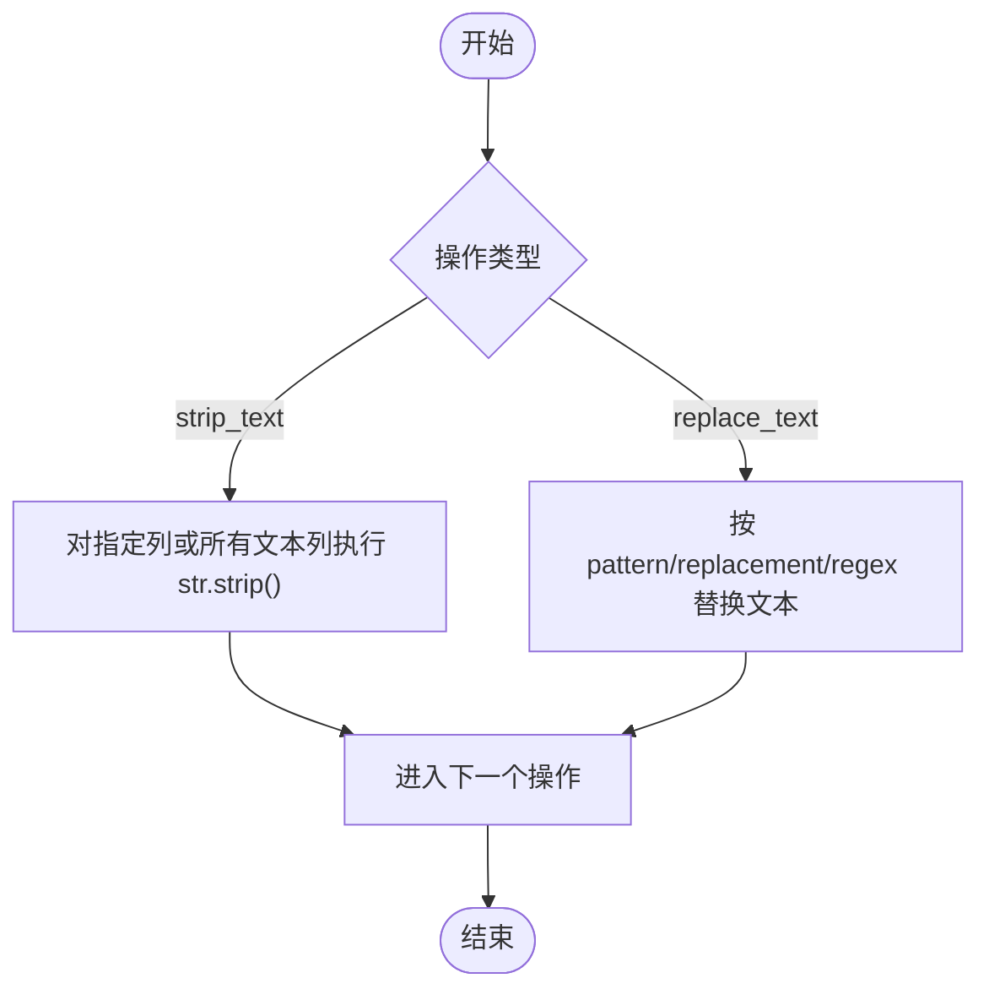
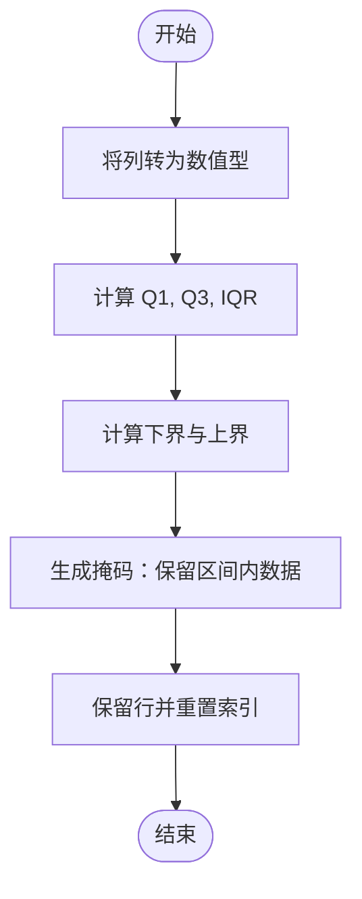
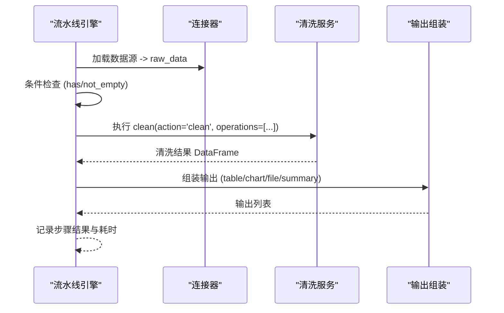
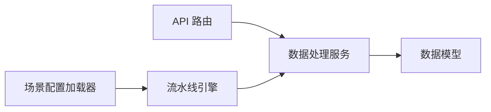

# 数据清洗

<cite>
**本文引用的文件**
- [pipeline_engine.py](file://app/core/pipeline_engine.py)
- [data_models.py](file://app/models/data_models.py)
- [data_service.py](file://app/services/data_service.py)
- [data.py](file://app/api/v1/data.py)
- [scenario_loader.py](file://app/core/scenario_loader.py)
- [pipeline_models.py](file://app/models/pipeline_models.py)
</cite>

## 目录
1. [简介](#简介)
2. [项目结构](#项目结构)
3. [核心组件](#核心组件)
4. [架构总览](#架构总览)
5. [详细组件分析](#详细组件分析)
6. [依赖关系分析](#依赖关系分析)
7. [性能考虑](#性能考虑)
8. [故障排查指南](#故障排查指南)
9. [结论](#结论)
10. [附录：清洗操作参数与使用场景](#附录清洗操作参数与使用场景)

## 简介
本章节面向“数据清洗”能力，系统性地介绍缺失值处理（填充或删除）、数据类型转换、文本清理（去除空格、替换字符）、异常值检测和处理等操作的实现方式与使用方法。文档同时提供完整的清洗流程示例，展示如何构建复杂的数据清洗管道，并给出每种操作的参数配置、适用场景与性能优化建议。

## 项目结构
数据清洗功能贯穿 API 层、服务层与模型层，并通过流水线引擎进行编排执行：
- API 层：暴露 /api/v1/data/clean 等接口，接收清洗请求并返回结果。
- 服务层：实现具体清洗逻辑，包括缺失值处理、类型转换、文本清洗、异常值过滤等。
- 模型层：定义清洗操作与请求/响应的数据结构。
- 流水线引擎：将清洗作为可编排的 action，支持条件执行、错误处理与输出组装。

**图表来源**
- [data.py:189-193](file://app/api/v1/data.py#L189-L193)
- [data_service.py:300-307](file://app/services/data_service.py#L300-L307)
- [data_models.py:115-128](file://app/models/data_models.py#L115-L128)
- [pipeline_engine.py:207-217](file://app/core/pipeline_engine.py#L207-L217)

**章节来源**
- [data.py:189-193](file://app/api/v1/data.py#L189-L193)
- [data_service.py:300-307](file://app/services/data_service.py#L300-L307)
- [data_models.py:115-128](file://app/models/data_models.py#L115-L128)
- [pipeline_engine.py:207-217](file://app/core/pipeline_engine.py#L207-L217)

## 核心组件
- 清洗请求与操作模型：CleanRequest、CleanOperation，用于声明要执行的清洗步骤及参数。
- 清洗服务：clean_data 与 _apply_clean_operation，负责解析输入 DataFrame 并顺序应用各清洗操作。
- 流水线引擎：将 clean 作为 action 之一，支持在场景中组合多个清洗步骤与其他数据处理动作。

关键职责划分：
- 模型层：约束请求结构与字段含义，确保参数校验。
- 服务层：实现清洗算法与容错策略（如 coerce 转换、IQR 异常值过滤）。
- 引擎层：编排步骤、管理上下文、记录执行结果与耗时。

**章节来源**
- [data_models.py:115-128](file://app/models/data_models.py#L115-L128)
- [data_service.py:300-395](file://app/services/data_service.py#L300-L395)
- [pipeline_engine.py:207-217](file://app/core/pipeline_engine.py#L207-L217)

## 架构总览
清洗功能的调用链如下：
- 客户端通过 REST API 提交 CleanRequest。
- API 路由调用 data_service.clean_data。
- 服务层将 JSON 数据转为 pandas DataFrame，依次执行每个 CleanOperation。
- 最终将清洗后的 DataFrame 序列化为统一输出格式返回。

**图表来源**
- [data.py:189-193](file://app/api/v1/data.py#L189-L193)
- [data_service.py:35-72](file://app/services/data_service.py#L35-L72)
- [data_service.py:300-395](file://app/services/data_service.py#L300-L395)

## 详细组件分析

### 缺失值处理（填充或删除）
- 填充空值（fill_na）
  - 作用：将指定列或全表的空值替换为给定值。
  - 参数：column（可选，为空则作用于所有列），params.value（默认 0）。
  - 行为：若 column 存在，仅对该列 fillna；否则对整个 DataFrame fillna。
  - 适用场景：数值型指标缺失时以 0 或均值填充；文本列缺失时以占位符填充。
  - 注意事项：填充会改变统计分布，需谨慎选择填充策略。

- 删除空值（drop_na）
  - 作用：删除包含空值的行。
  - 参数：column（可选，指定列子集），params.how（默认 any，即任一列为空即删）。
  - 行为：按 subset 与 how 规则删除后重置索引。
  - 适用场景：样本质量要求高、缺失会导致后续分析错误的情况。
  - 注意事项：大量删除可能影响样本量，需评估数据完整性。

**图表来源**
- [data_service.py:314-324](file://app/services/data_service.py#L314-L324)

**章节来源**
- [data_service.py:314-324](file://app/services/data_service.py#L314-L324)
- [data_models.py:115-128](file://app/models/data_models.py#L115-L128)

### 数据类型转换（cast_type）
- 作用：将指定列转换为目标类型，支持 int、float、str、datetime、bool 以及任意可被 pandas 识别的类型。
- 参数：column（必填），params.type（目标类型），params.format（datetime 时使用）。
- 行为：
  - 数值类型：先尝试 pd.to_numeric(errors="coerce") 再转换，无法转换的值会被置为 NaN 或对应类型的缺失值。
  - 字符串类型：直接 astype(str)。
  - 日期时间：使用 pd.to_datetime(format=..., errors="coerce")。
  - 布尔类型：astype(bool)。
  - 其他类型：直接 astype(target_type)。
- 适用场景：统一字段类型以便聚合、透视或建模；将文本数字转为数值型参与计算。
- 注意事项：强制转换失败会抛出类型错误，建议在转换前做文本清洗或预处理。

**图表来源**
- [data_service.py:326-351](file://app/services/data_service.py#L326-L351)

**章节来源**
- [data_service.py:326-351](file://app/services/data_service.py#L326-L351)
- [data_models.py:115-128](file://app/models/data_models.py#L115-L128)

### 文本清理（strip_text、replace_text）
- 去除空格（strip_text）
  - 作用：去除字符串首尾空白字符。
  - 参数：column（可选，为空时对 object/string 类型列全部 strip）。
  - 行为：先将列转为 str，再调用 str.strip()。
  - 适用场景：导入数据中常见的多余空格、制表符等。

- 替换字符（replace_text）
  - 作用：按模式替换文本内容，支持正则表达式。
  - 参数：column（必填），params.pattern（匹配模式），params.replacement（替换内容），params.regex（是否正则）。
  - 行为：将列转为 str 后调用 str.replace(pattern, replacement, regex=...)。
  - 适用场景：标准化文本格式、移除无关符号、统一命名规范。

**图表来源**
- [data_service.py:353-371](file://app/services/data_service.py#L353-L371)

**章节来源**
- [data_service.py:353-371](file://app/services/data_service.py#L353-L371)
- [data_models.py:115-128](file://app/models/data_models.py#L115-L128)

### 异常值检测和处理（drop_outliers）
- 作用：基于 IQR（四分位距）方法检测并删除数值列中的异常值。
- 参数：column（必填），params.factor（默认 1.5，控制上下界范围）。
- 行为：
  - 将列转为数值型（errors="coerce"）。
  - 计算 Q1、Q3 与 IQR = Q3 - Q1。
  - 下界 = Q1 - factor * IQR，上界 = Q3 + factor * IQR。
  - 保留落在区间内的行，删除超出区间的行并重置索引。
- 适用场景：数值型指标存在极端值影响统计或模型训练的情况。
- 注意事项：factor 越大越保守；对于偏态分布可考虑分位数法或业务阈值。

**图表来源**
- [data_service.py:373-387](file://app/services/data_service.py#L373-L387)

**章节来源**
- [data_service.py:373-387](file://app/services/data_service.py#L373-L387)
- [data_models.py:115-128](file://app/models/data_models.py#L115-L128)

### 完整清洗流程示例（构建复杂清洗管道）
以下示例展示如何在流水线中组合多种清洗操作，形成端到端的数据清洗管道：

- 步骤设计思路
  1) 加载数据源（connector 获取原始数据）。
  2) 文本清理：strip_text 去除空格，replace_text 标准化文本。
  3) 类型转换：cast_type 统一字段类型（如数值、日期、布尔）。
  4) 缺失值处理：fill_na 填充必要缺失，drop_na 删除严重缺失行。
  5) 异常值处理：drop_outliers 过滤极端值。
  6) 输出：将清洗后的数据写入下游分析或可视化。

- 流水线编排要点
  - 每个步骤可设置 condition（如 has:raw_data、not_empty:raw_data）控制执行。
  - on_error 支持 skip 或 abort，便于容错与快速失败。
  - 中间结果可通过 context 传递，供后续步骤引用。

**图表来源**
- [pipeline_engine.py:252-356](file://app/core/pipeline_engine.py#L252-L356)
- [scenario_loader.py:28-55](file://app/core/scenario_loader.py#L28-L55)
- [data_service.py:300-395](file://app/services/data_service.py#L300-L395)

**章节来源**
- [pipeline_engine.py:252-356](file://app/core/pipeline_engine.py#L252-L356)
- [scenario_loader.py:28-55](file://app/core/scenario_loader.py#L28-L55)
- [data_service.py:300-395](file://app/services/data_service.py#L300-L395)

## 依赖关系分析
- API 层依赖服务层：/api/v1/data/clean 调用 data_service.clean_data。
- 服务层依赖模型层：CleanRequest、CleanOperation 定义清洗操作的结构与参数。
- 流水线引擎依赖服务层：action='clean' 时构造 CleanRequest 并调用清洗服务。
- 场景加载器提供 PipelineStepConfig，允许在 YAML 中声明清洗步骤及其参数。

**图表来源**
- [data.py:189-193](file://app/api/v1/data.py#L189-L193)
- [data_service.py:300-395](file://app/services/data_service.py#L300-L395)
- [data_models.py:115-128](file://app/models/data_models.py#L115-L128)
- [pipeline_engine.py:207-217](file://app/core/pipeline_engine.py#L207-L217)
- [scenario_loader.py:28-55](file://app/core/scenario_loader.py#L28-L55)

**章节来源**
- [data.py:189-193](file://app/api/v1/data.py#L189-L193)
- [data_service.py:300-395](file://app/services/data_service.py#L300-L395)
- [data_models.py:115-128](file://app/models/data_models.py#L115-L128)
- [pipeline_engine.py:207-217](file://app/core/pipeline_engine.py#L207-L217)
- [scenario_loader.py:28-55](file://app/core/scenario_loader.py#L28-L55)

## 性能考虑
- 批量操作优先：尽量将多个清洗操作合并为一个 CleanRequest 的 operations 列表，减少多次往返与序列化开销。
- 列级操作：尽可能指定 column 缩小处理范围，避免全表扫描。
- 类型转换策略：使用 errors="coerce" 避免转换中断，但需注意无效值可能被置空，应在前后步骤补充缺失值处理。
- 异常值过滤：IQR 方法对大表计算分位数有一定开销，可在小样本上验证 factor 后再应用于全量数据。
- 文本处理：strip_text 与 replace_text 涉及字符串转换与正则匹配，注意正则复杂度与数据规模。
- 流水线编排：利用 condition 与 on_error 跳过不必要步骤，降低整体耗时。

[本节为通用性能建议，不直接分析具体文件]

## 故障排查指南
- 常见错误与定位
  - 不支持的清洗操作：检查 operation 是否为枚举值之一（fill_na、drop_na、cast_type、strip_text、replace_text、drop_outliers）。
  - 缺少必填参数：如 cast_type 与 replace_text、drop_outliers 需要 column；cast_type 需要 type。
  - 类型转换失败：确认目标类型与数据内容兼容，必要时先做文本清洗或数值化。
  - SQL 安全限制：非 SELECT/WITH 语句将被拒绝（与清洗无直接关系，但在查询步骤中需注意）。

- 调试建议
  - 逐步执行：将清洗步骤拆分为多个步骤，分别观察每步输出。
  - 日志与耗时：关注流水线步骤的 duration_ms 与 message，定位瓶颈与失败点。
  - 条件控制：使用 condition 控制步骤执行，避免无效计算。

**章节来源**
- [data_service.py:326-395](file://app/services/data_service.py#L326-L395)
- [pipeline_engine.py:317-349](file://app/core/pipeline_engine.py#L317-L349)

## 结论
本系统提供了完善的数据清洗能力，覆盖缺失值处理、类型转换、文本清理与异常值过滤等核心场景。通过统一的 CleanRequest/CleanOperation 模型与服务层实现，结合流水线引擎的编排能力，用户可灵活构建从数据接入到清洗输出的端到端管道。建议在实际使用中遵循参数最小化、列级操作、合理异常值阈值与条件控制等最佳实践，以获得稳定高效的清洗效果。

[本节为总结性内容，不直接分析具体文件]

## 附录：清洗操作参数与使用场景
- fill_na
  - 参数：column（可选），params.value（默认 0）
  - 场景：数值指标缺失用 0 或均值填充；文本缺失用占位符填充
  - 注意：填充会影响统计分布，谨慎选择策略

- drop_na
  - 参数：column（可选），params.how（默认 any）
  - 场景：严格质量要求，缺失行不可接受
  - 注意：可能导致样本量下降

- cast_type
  - 参数：column（必填），params.type（目标类型），params.format（datetime 使用）
  - 场景：统一字段类型，便于聚合、透视与建模
  - 注意：转换失败会抛错，建议前置文本清洗

- strip_text
  - 参数：column（可选，为空时对文本列全部 strip）
  - 场景：去除首尾空白字符
  - 注意：会将列转为 str

- replace_text
  - 参数：column（必填），params.pattern，params.replacement，params.regex
  - 场景：标准化文本格式、移除无关符号
  - 注意：正则表达式需控制复杂度

- drop_outliers
  - 参数：column（必填），params.factor（默认 1.5）
  - 场景：数值极端值影响分析或模型
  - 注意：IQR 方法对偏态分布敏感，可调整 factor

**章节来源**
- [data_models.py:115-128](file://app/models/data_models.py#L115-L128)
- [data_service.py:314-395](file://app/services/data_service.py#L314-L395)