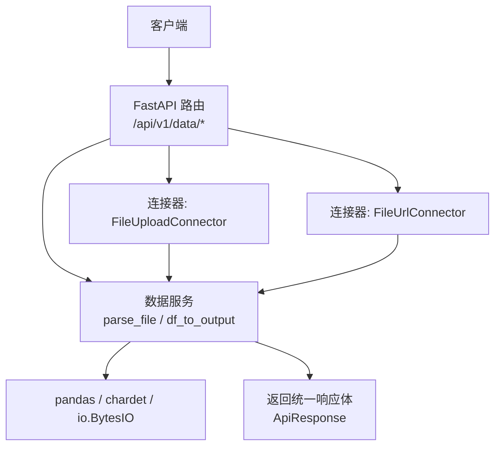
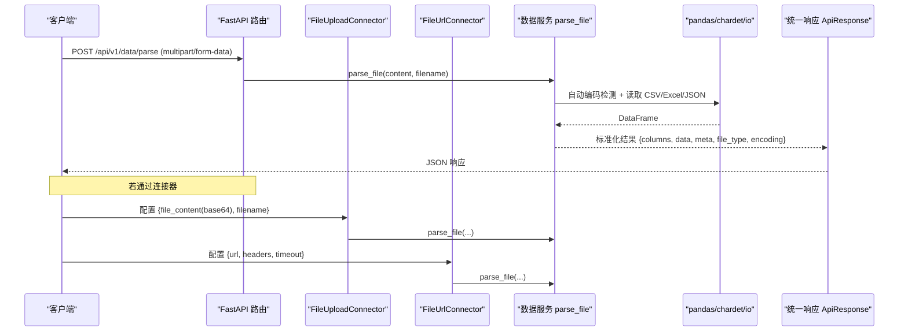
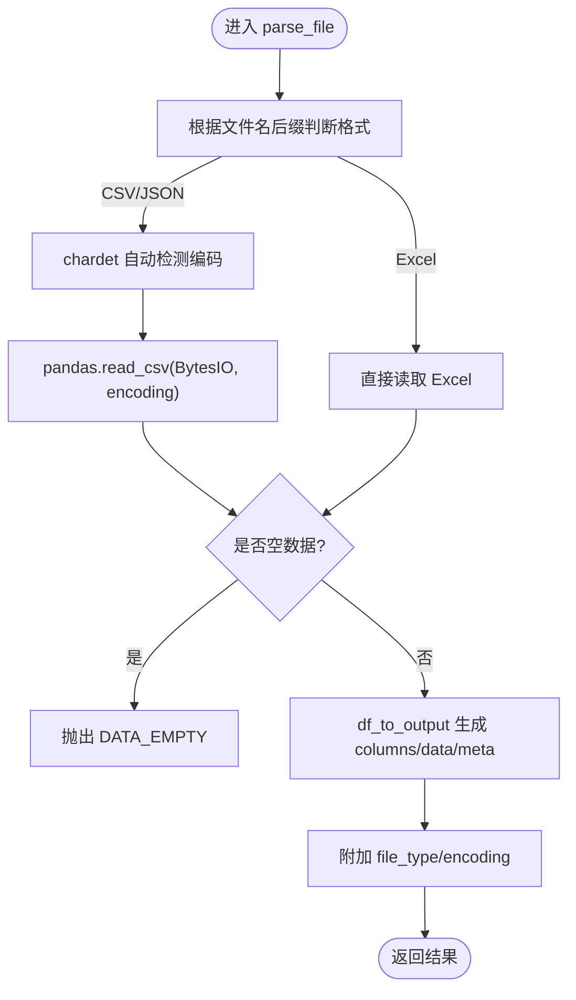
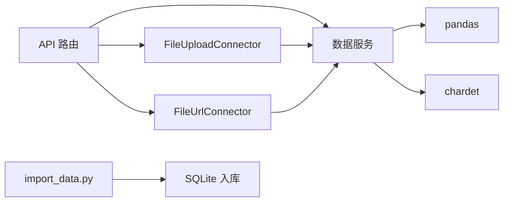

# 文件解析

<cite>
**本文引用的文件**
- [app/services/data_service.py](file://app/services/data_service.py)
- [app/core/connectors/file_upload.py](file://app/core/connectors/file_upload.py)
- [app/core/connectors/file_url.py](file://app/core/connectors/file_url.py)
- [app/api/v1/data.py](file://app/api/v1/data.py)
- [app/models/data_models.py](file://app/models/data_models.py)
- [app/core/errors.py](file://app/core/errors.py)
- [app/core/response.py](file://app/core/response.py)
- [scripts/import_data.py](file://scripts/import_data.py)
- [tests/test_data_api.py](file://tests/test_data_api.py)
</cite>

## 目录
1. [简介](#简介)
2. [项目结构](#项目结构)
3. [核心组件](#核心组件)
4. [架构总览](#架构总览)
5. [详细组件分析](#详细组件分析)
6. [依赖关系分析](#依赖关系分析)
7. [性能与内存优化](#性能与内存优化)
8. [故障排查指南](#故障排查指南)
9. [结论](#结论)
10. [附录：使用示例与最佳实践](#附录使用示例与最佳实践)

## 简介
本模块提供统一的数据文件解析能力，支持 CSV、Excel（xlsx/xls）、JSON 三种格式。核心特性包括：
- 自动编码检测：对 CSV/JSON 通过 chardet 推断编码，避免乱码问题。
- 数据类型推断：借助 pandas 读取时自动推断列类型；同时提供清洗与转换能力。
- 错误处理机制：统一的异常与响应封装，便于前端或调用方定位问题。
- 多入口接入：既可通过 HTTP 接口上传解析，也可通过连接器从 URL 下载并解析，或通过 base64 上传解析。

## 项目结构
文件解析相关代码主要分布在服务层、连接器层、API 路由层以及数据模型中：
- 服务层：实现核心解析逻辑与数据处理函数。
- 连接器层：封装不同来源（本地上传、URL 下载）的获取与复用解析逻辑。
- API 路由层：暴露 RESTful 接口供外部调用。
- 数据模型：定义请求/响应结构与元信息。

图表来源
- [app/api/v1/data.py:39-144](file://app/api/v1/data.py#L39-L144)
- [app/services/data_service.py:77-117](file://app/services/data_service.py#L77-L117)
- [app/core/connectors/file_upload.py:18-63](file://app/core/connectors/file_upload.py#L18-L63)
- [app/core/connectors/file_url.py:19-83](file://app/core/connectors/file_url.py#L19-L83)

章节来源
- [app/api/v1/data.py:39-144](file://app/api/v1/data.py#L39-L144)
- [app/services/data_service.py:77-117](file://app/services/data_service.py#L77-L117)
- [app/core/connectors/file_upload.py:18-63](file://app/core/connectors/file_upload.py#L18-L63)
- [app/core/connectors/file_url.py:19-83](file://app/core/connectors/file_url.py#L19-L83)

## 核心组件
- 解析服务：负责根据文件名后缀选择解析器，自动编码检测，构建 DataFrame，并输出标准化结果。
- 连接器：
  - 文件上传连接器：接收 base64 编码的文件内容，解码后复用解析服务。
  - URL 文件连接器：从指定 URL 下载文件，复用解析服务。
- API 路由：提供 /data/parse、/data/ingest 等接口，封装请求参数与响应。
- 数据模型：定义 DataFrameInput、DataFrameMeta、ParseResult 等结构，保证序列化一致性。
- 错误处理：统一业务异常与全局异常处理器，返回标准错误码与消息。

章节来源
- [app/services/data_service.py:77-117](file://app/services/data_service.py#L77-L117)
- [app/core/connectors/file_upload.py:18-63](file://app/core/connectors/file_upload.py#L18-L63)
- [app/core/connectors/file_url.py:19-83](file://app/core/connectors/file_url.py#L19-L83)
- [app/api/v1/data.py:39-144](file://app/api/v1/data.py#L39-L144)
- [app/models/data_models.py:13-44](file://app/models/data_models.py#L13-L44)
- [app/core/errors.py:15-42](file://app/core/errors.py#L15-L42)

## 架构总览
下图展示了从请求到解析再到响应的完整流程，涵盖多种输入方式与统一的服务层处理。

图表来源
- [app/api/v1/data.py:139-144](file://app/api/v1/data.py#L139-L144)
- [app/services/data_service.py:77-117](file://app/services/data_service.py#L77-L117)
- [app/core/connectors/file_upload.py:31-63](file://app/core/connectors/file_upload.py#L31-L63)
- [app/core/connectors/file_url.py:34-72](file://app/core/connectors/file_url.py#L34-L72)

## 详细组件分析

### 解析服务（parse_file）
- 功能要点
  - 根据文件名后缀判断格式：csv、excel、json。
  - 对 csv/json 使用 chardet 自动检测编码，默认 utf-8。
  - 使用 pandas 读取为 DataFrame，并校验非空。
  - 将 DataFrame 转换为可序列化的字典，包含列名、数据、元信息（行数、列数、列类型）。
  - 附加 file_type 与 encoding 字段，便于上层使用。
- 复杂度与行为
  - 时间复杂度：O(N) 行扫描（由 pandas 内部实现决定）。
  - 空间复杂度：O(N×M) 存储 DataFrame（N 行 M 列）。
- 错误处理
  - 不支持的格式抛出业务异常。
  - 解析失败捕获并包装为统一错误码。
  - 空数据抛出“数据为空”错误。

图表来源
- [app/services/data_service.py:77-117](file://app/services/data_service.py#L77-L117)

章节来源
- [app/services/data_service.py:77-117](file://app/services/data_service.py#L77-L117)

### 文件上传连接器（FileUploadConnector）
- 功能要点
  - 接收 base64 编码的文件内容与文件名。
  - 解码 base64 后调用解析服务。
  - 将解析结果转为 DataFrame 返回给调用方。
- 错误处理
  - base64 解码失败、解析失败均抛出统一业务异常。

章节来源
- [app/core/connectors/file_upload.py:18-63](file://app/core/connectors/file_upload.py#L18-L63)

### URL 文件连接器（FileUrlConnector）
- 功能要点
  - 从 URL 下载文件，支持自定义请求头与超时。
  - 若未提供文件名，则从 URL 路径推断。
  - 复用解析服务进行解析。
- 错误处理
  - 网络请求失败、解析失败均抛出统一业务异常。

章节来源
- [app/core/connectors/file_url.py:19-83](file://app/core/connectors/file_url.py#L19-L83)

### API 路由（/api/v1/data/*）
- 关键接口
  - POST /data/parse：上传文件并解析，返回标准化结果。
  - POST /data/ingest：解析并入库 SQLite，支持 create/append 模式。
  - 其他数据处理接口：query、filter、aggregate、pivot、sort、dedup、clean、statistics。
- 安全与校验
  - SQL 查询仅允许 SELECT/WITH 开头，防止注入。
  - 入库模式限制为 create/append，非法值抛错。

章节来源
- [app/api/v1/data.py:39-144](file://app/api/v1/data.py#L39-L144)

### 数据模型（models）
- ParseResult：包含 columns、data、meta、file_type、encoding。
- DataFrameInput/DataFrameMeta：描述数据载体与元信息。
- 其他请求模型：用于筛选、聚合、透视、排序、去重、清洗、统计等。

章节来源
- [app/models/data_models.py:13-44](file://app/models/data_models.py#L13-L44)

### 错误处理（errors & response）
- AppException：携带 code、message、data 的业务异常。
- 全局异常处理器：将业务异常与验证异常转换为统一 ApiResponse。
- ErrorCode：集中管理错误码与消息映射。

章节来源
- [app/core/errors.py:15-42](file://app/core/errors.py#L15-L42)
- [app/core/response.py:54-93](file://app/core/response.py#L54-L93)

## 依赖关系分析
- 解析服务依赖 pandas、chardet、io.BytesIO 完成读取与编码检测。
- 连接器依赖 httpx（URL 下载）、base64（上传解码），并复用解析服务。
- API 路由依赖 FastAPI 框架与 Pydantic 模型进行参数校验与响应封装。
- 脚本 import_data.py 演示了批量导入 Excel 到 SQLite 的流程。

图表来源
- [app/services/data_service.py:77-117](file://app/services/data_service.py#L77-L117)
- [app/core/connectors/file_upload.py:18-63](file://app/core/connectors/file_upload.py#L18-L63)
- [app/core/connectors/file_url.py:19-83](file://app/core/connectors/file_url.py#L19-L83)
- [scripts/import_data.py:84-123](file://scripts/import_data.py#L84-L123)

章节来源
- [app/services/data_service.py:77-117](file://app/services/data_service.py#L77-L117)
- [app/core/connectors/file_upload.py:18-63](file://app/core/connectors/file_upload.py#L18-L63)
- [app/core/connectors/file_url.py:19-83](file://app/core/connectors/file_url.py#L19-L83)
- [scripts/import_data.py:84-123](file://scripts/import_data.py#L84-L123)

## 性能与内存优化
- 大文件处理建议
  - 分块读取：对于超大 CSV/JSON，建议使用分块读取策略（如 pandas read_csv chunksize），以降低内存峰值。
  - 列裁剪：仅选择必要列，减少内存占用。
  - 类型预声明：在解析前指定 dtypes，避免二次转换开销。
- 编码检测成本
  - chardet 会扫描部分字节以推断编码，建议在已知编码场景下显式传入 encoding，跳过检测。
- 序列化开销
  - df_to_output 会将 numpy 类型转换为 Python 原生类型，适合 JSON 传输；若仅需内存内处理，可直接返回 DataFrame。
- 并发与连接池
  - URL 下载使用 httpx 异步客户端，合理设置超时与连接池大小，避免资源耗尽。

[本节为通用指导，不直接分析具体文件]

## 故障排查指南
- 编码问题
  - 现象：中文乱码或解析失败。
  - 原因：CSV/JSON 编码未被正确识别。
  - 解决：确保文件名后缀正确；必要时在调用端显式指定 encoding；检查源文件编码是否与 chardet 推断一致。
- 文件格式不支持
  - 现象：返回 FILE_PARSE_ERROR。
  - 原因：文件名后缀不在支持列表（csv/xlsx/xls/json）。
  - 解决：修正文件扩展名或使用支持的格式。
- 数据为空
  - 现象：返回 DATA_EMPTY。
  - 原因：解析后的 DataFrame 为空。
  - 解决：检查源文件内容是否为空或仅有表头无数据。
- SQL 执行错误
  - 现象：返回 SQL_EXECUTION_ERROR。
  - 原因：SQL 语句不安全或非 SELECT/WITH 开头。
  - 解决：仅使用只读查询，并确保语句合法。
- 连接器错误
  - 现象：CONNECTOR_ERROR。
  - 原因：base64 解码失败、网络请求失败、解析失败。
  - 解决：检查 base64 字符串有效性、URL 可达性与权限、超时设置。

章节来源
- [app/services/data_service.py:77-117](file://app/services/data_service.py#L77-L117)
- [app/core/connectors/file_upload.py:31-63](file://app/core/connectors/file_upload.py#L31-L63)
- [app/core/connectors/file_url.py:34-72](file://app/core/connectors/file_url.py#L34-L72)
- [app/core/errors.py:15-42](file://app/core/errors.py#L15-L42)
- [app/core/response.py:54-93](file://app/core/response.py#L54-L93)

## 结论
该文件解析模块提供了稳定、可扩展的数据接入能力，覆盖常见数据格式与多种来源。通过自动编码检测、统一错误处理与标准化输出，降低了集成复杂度。结合性能优化与故障排查指南，可在生产环境中可靠运行。

[本节为总结性内容，不直接分析具体文件]

## 附录：使用示例与最佳实践

- 通过 HTTP 接口解析文件
  - 接口：POST /api/v1/data/parse
  - 参数：multipart/form-data 中的 file 字段（CSV/Excel/JSON）
  - 返回：包含 columns、data、meta、file_type、encoding 的统一响应
  - 参考测试用例：
    - CSV 解析断言 file_type 与行数
    - JSON 解析断言行数
    - 不支持格式返回特定错误码

章节来源
- [app/api/v1/data.py:139-144](file://app/api/v1/data.py#L139-L144)
- [tests/test_data_api.py:16-42](file://tests/test_data_api.py#L16-L42)

- 通过连接器解析
  - FileUploadConnector：配置 file_content（base64）、filename，返回 DataFrame
  - FileUrlConnector：配置 url、headers、timeout，返回 DataFrame

章节来源
- [app/core/connectors/file_upload.py:18-63](file://app/core/connectors/file_upload.py#L18-L63)
- [app/core/connectors/file_url.py:19-83](file://app/core/connectors/file_url.py#L19-L83)

- 批量导入 Excel 到 SQLite
  - 脚本：scripts/import_data.py
  - 步骤：初始化数据库 -> 读取 Excel -> 预处理 -> 入库 -> 验证与抽样

章节来源
- [scripts/import_data.py:84-123](file://scripts/import_data.py#L84-L123)

- 最佳实践
  - 明确文件扩展名，避免误判格式。
  - 对已知编码的 CSV/JSON，显式传入 encoding，提升性能与稳定性。
  - 对大文件采用分块读取与列裁剪，控制内存使用。
  - 使用清洗操作（fill_na、cast_type、drop_outliers 等）提升数据质量。
  - 对 SQL 查询严格限制为只读语句，保障数据安全。

[本节为实践指导，不直接分析具体文件]