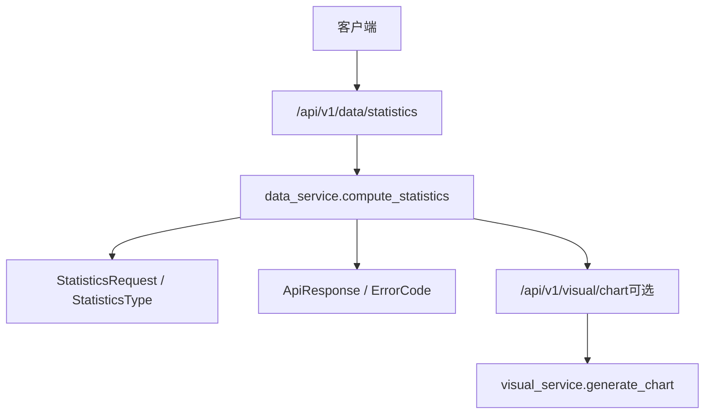
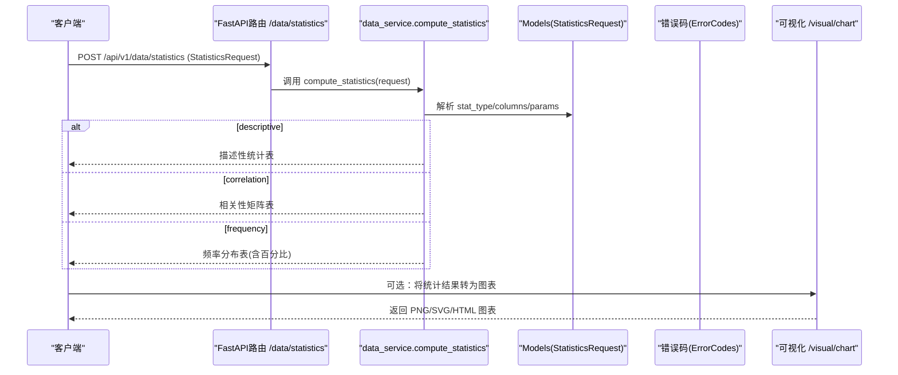
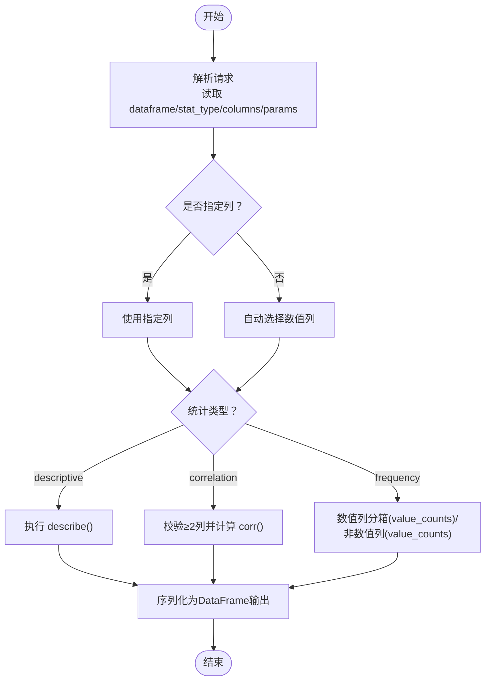
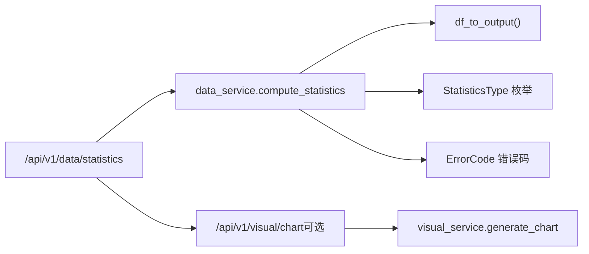

# 统计分析

<cite>
**本文引用的文件**
- [app/services/data_service.py](file://app/services/data_service.py)
- [app/api/v1/data.py](file://app/api/v1/data.py)
- [app/models/data_models.py](file://app/models/data_models.py)
- [app/core/response.py](file://app/core/response.py)
- [app/scenarios/sample_analysis.yaml](file://app/scenarios/sample_analysis.yaml)
- [app/api/v1/visual.py](file://app/api/v1/visual.py)
- [app/services/visual_service.py](file://app/services/visual_service.py)
- [docs/openai_tools_schema.json](file://docs/openai_tools_schema.json)
</cite>

## 目录
1. [简介](#简介)
2. [项目结构](#项目结构)
3. [核心组件](#核心组件)
4. [架构总览](#架构总览)
5. [详细组件分析](#详细组件分析)
6. [依赖关系分析](#依赖关系分析)
7. [性能与可扩展性](#性能与可扩展性)
8. [故障排查指南](#故障排查指南)
9. [结论](#结论)
10. [附录：使用示例与可视化建议](#附录使用示例与可视化建议)

## 简介
本章节面向“统计分析”能力，覆盖描述性统计、相关性矩阵与频率分布三类分析。文档说明各统计类型的适用场景、配置参数、调用方式、结果解读方法与可视化建议，帮助从数据中快速提取有价值的洞察。

## 项目结构
统计分析功能位于数据处理模块，通过 REST API 暴露，服务层实现具体计算逻辑，模型层定义请求/响应结构，错误码统一由响应模块管理；同时提供可视化接口用于图表输出。

图示来源
- [app/api/v1/data.py:196-200](file://app/api/v1/data.py#L196-L200)
- [app/services/data_service.py:400-446](file://app/services/data_service.py#L400-L446)
- [app/models/data_models.py:131-145](file://app/models/data_models.py#L131-L145)
- [app/core/response.py:12-103](file://app/core/response.py#L12-L103)
- [app/api/v1/visual.py:13-21](file://app/api/v1/visual.py#L13-L21)
- [app/services/visual_service.py:123-161](file://app/services/visual_service.py#L123-L161)

章节来源
- [app/api/v1/data.py:196-200](file://app/api/v1/data.py#L196-L200)
- [app/services/data_service.py:400-446](file://app/services/data_service.py#L400-L446)
- [app/models/data_models.py:131-145](file://app/models/data_models.py#L131-L145)
- [app/core/response.py:12-103](file://app/core/response.py#L12-L103)
- [app/api/v1/visual.py:13-21](file://app/api/v1/visual.py#L13-L21)
- [app/services/visual_service.py:123-161](file://app/services/visual_service.py#L123-L161)

## 核心组件
- 请求模型：StatisticsRequest 支持指定统计类型、目标列与扩展参数。
- 统计类型枚举：descriptive（描述性统计）、correlation（相关性矩阵）、frequency（频率分布）。
- 服务实现：compute_statistics 根据类型执行不同统计逻辑并返回 DataFrame 序列化结果。
- 统一响应：ApiResponse 封装成功/失败响应体，ErrorCode 定义错误码。
- 可视化接口：/api/v1/visual/chart 可将统计结果进一步渲染为图表。

章节来源
- [app/models/data_models.py:131-145](file://app/models/data_models.py#L131-L145)
- [app/services/data_service.py:400-446](file://app/services/data_service.py#L400-L446)
- [app/core/response.py:12-103](file://app/core/response.py#L12-L103)
- [app/api/v1/visual.py:13-21](file://app/api/v1/visual.py#L13-L21)

## 架构总览
统计分析的端到端流程如下：

图示来源
- [app/api/v1/data.py:196-200](file://app/api/v1/data.py#L196-L200)
- [app/services/data_service.py:400-446](file://app/services/data_service.py#L400-L446)
- [app/models/data_models.py:131-145](file://app/models/data_models.py#L131-L145)
- [app/api/v1/visual.py:13-21](file://app/api/v1/visual.py#L13-L21)

## 详细组件分析

### 描述性统计（describe）
- 适用场景
  - 快速了解数值型变量的集中趋势与离散程度（均值、标准差、最小/最大值、分位数等）。
  - 数据概览、质量检查、异常值初筛。
- 配置参数
  - dataframe：二维表格数据（列名 + 行数据）。
  - stat_type：descriptive。
  - columns：可选，指定要统计的列；为空时自动选择数值列。
  - params：描述性统计无需额外参数。
- 处理逻辑
  - 若未指定列，则自动筛选数值列。
  - 对选定列执行 describe，并将索引列重命名为“stat”，便于后续展示。
- 结果解读
  - count：非空样本数。
  - mean/std：均值与标准差，衡量中心与波动。
  - min/max：极值范围。
  - 25%/50%/75%：四分位数，辅助识别偏态与异常值。
- 可视化建议
  - 直方图/核密度图：观察分布形态与峰值。
  - 箱线图：识别离群点与四分位范围。
  - 热力图：多变量时可用相关系数热力图辅助理解。

章节来源
- [app/services/data_service.py:400-415](file://app/services/data_service.py#L400-L415)
- [app/models/data_models.py:131-145](file://app/models/data_models.py#L131-L145)

### 相关性矩阵（corr）
- 适用场景
  - 探索多个数值变量之间的线性相关强度与方向。
  - 特征工程前的共线性检测、关键因子筛选。
- 配置参数
  - dataframe：二维表格数据。
  - stat_type：correlation。
  - columns：可选，指定参与相关的列；为空时自动选择数值列。
  - params：无。
- 处理逻辑
  - 至少需要 2 个数值列，否则报错。
  - 计算相关系数矩阵，重置索引并重命名列以便展示。
- 结果解读
  - 取值范围 [-1, 1]，正值正相关，负值负相关，绝对值越大线性关系越强。
  - 接近 0 表示线性相关性弱（不代表无线性关系）。
- 可视化建议
  - 热力图：颜色深浅表示相关性强弱。
  - 散点图矩阵：直观查看两两变量关系。
  - 网络图：高相关变量连线突出。

章节来源
- [app/services/data_service.py:417-424](file://app/services/data_service.py#L417-L424)
- [app/models/data_models.py:131-145](file://app/models/data_models.py#L131-L145)

### 频率分布（value_counts）
- 适用场景
  - 分类变量或离散型变量的类别占比分析。
  - 数值变量可分箱后观察区间分布。
- 配置参数
  - dataframe：二维表格数据。
  - stat_type：frequency。
  - columns：必须指定至少 1 列（可为单列列表）。
  - params：bins（仅数值列有效），默认 10，控制分箱数量。
- 处理逻辑
  - 数值列：按 bins 进行等宽分箱，统计每箱频数并排序。
  - 非数值列：直接 value_counts 统计频次。
  - 计算百分比列，保留两位小数。
- 结果解读
  - count：各类别/区间的频数。
  - percentage：占比，便于横向比较。
- 可视化建议
  - 柱状图：分类变量频数对比。
  - 饼图/环形图：占比构成。
  - 直方图：数值变量分箱后的分布形态。

章节来源
- [app/services/data_service.py:426-441](file://app/services/data_service.py#L426-L441)
- [app/models/data_models.py:131-145](file://app/models/data_models.py#L131-L145)

### 统计流程图（通用）

图示来源
- [app/services/data_service.py:400-446](file://app/services/data_service.py#L400-L446)
- [app/models/data_models.py:131-145](file://app/models/data_models.py#L131-L145)

## 依赖关系分析
- API 层：/api/v1/data/statistics 接收 StatisticsRequest 并调用服务层。
- 服务层：依据统计类型执行对应逻辑，统一通过 df_to_output 返回结构化结果。
- 模型层：定义请求结构与统计类型枚举。
- 错误处理：统一 ErrorCode，如参数校验失败、数据类型错误、数据为空等。
- 可视化：可选调用 /api/v1/visual/chart 生成图表，支持 PNG/SVG/HTML。

图示来源
- [app/api/v1/data.py:196-200](file://app/api/v1/data.py#L196-L200)
- [app/services/data_service.py:400-446](file://app/services/data_service.py#L400-L446)
- [app/models/data_models.py:131-145](file://app/models/data_models.py#L131-L145)
- [app/core/response.py:12-103](file://app/core/response.py#L12-L103)
- [app/api/v1/visual.py:13-21](file://app/api/v1/visual.py#L13-L21)
- [app/services/visual_service.py:123-161](file://app/services/visual_service.py#L123-L161)

章节来源
- [app/api/v1/data.py:196-200](file://app/api/v1/data.py#L196-L200)
- [app/services/data_service.py:400-446](file://app/services/data_service.py#L400-L446)
- [app/models/data_models.py:131-145](file://app/models/data_models.py#L131-L145)
- [app/core/response.py:12-103](file://app/core/response.py#L12-L103)
- [app/api/v1/visual.py:13-21](file://app/api/v1/visual.py#L13-L21)
- [app/services/visual_service.py:123-161](file://app/services/visual_service.py#L123-L161)

## 性能与可扩展性
- 性能要点
  - 自动列选择基于数值类型过滤，避免对非数值列做无意义计算。
  - 相关性矩阵复杂度随列数平方增长，建议限制参与列的数量。
  - 频率分布的分箱 bins 越大，计算与存储开销越高，需权衡精度与性能。
- 可扩展建议
  - 增加更多统计指标（如偏度、峰度）可通过扩展 describe 的输出或新增统计类型实现。
  - 支持分组统计（groupby + 聚合）可与现有 aggregate/pivot 能力组合使用。
  - 可视化模板化：为不同统计结果预设推荐图表模板，提升易用性。

[本节为通用指导，不直接分析具体文件]

## 故障排查指南
- 常见错误与定位
  - 参数校验失败：统计类型不支持、缺少必要列、运算符非法等。
  - 数据为空：输入 DataFrame 为空或未包含数值列。
  - 数据类型错误：聚合/清洗/统计过程中类型不兼容。
  - SQL 执行错误：仅允许 SELECT/WITH 开头语句，其他将被拒绝。
- 排查步骤
  - 检查请求体字段是否符合模型定义（columns、stat_type、params）。
  - 确认目标列存在且类型匹配（数值列用于 describe/corr，任意列用于 frequency）。
  - 查看返回的错误码与消息，定位到具体环节（API/Service/Model）。
  - 如需调试，先以小规模数据验证，逐步扩大规模。

章节来源
- [app/core/response.py:12-103](file://app/core/response.py#L12-L103)
- [app/services/data_service.py:120-158](file://app/services/data_service.py#L120-L158)
- [app/services/data_service.py:218-243](file://app/services/data_service.py#L218-L243)
- [app/services/data_service.py:248-272](file://app/services/data_service.py#L248-L272)
- [app/services/data_service.py:300-395](file://app/services/data_service.py#L300-L395)
- [app/services/data_service.py:400-446](file://app/services/data_service.py#L400-L446)

## 结论
本系统提供了完整的统计分析能力：描述性统计用于数据概览，相关性矩阵用于变量关系探索，频率分布用于类别占比与区间分布分析。配合可视化接口，可将统计结果转化为直观的图表，帮助快速发现数据中的模式与异常。建议在业务场景中结合清洗、聚合、透视等能力，构建端到端的分析流水线。

[本节为总结性内容，不直接分析具体文件]

## 附录：使用示例与可视化建议

### 示例一：描述性统计
- 目标：获取所有数值列的均值、标准差、分位数等。
- 配置要点
  - stat_type: descriptive
  - columns: 可选，留空则自动选择数值列
  - params: 无
- 结果解读：关注均值与标准差反映的中心与波动，分位数识别偏态与异常值。
- 可视化建议：直方图、箱线图。

章节来源
- [app/services/data_service.py:400-415](file://app/services/data_service.py#L400-L415)
- [app/models/data_models.py:131-145](file://app/models/data_models.py#L131-L145)

### 示例二：相关性矩阵
- 目标：评估多个数值变量之间的线性相关强度。
- 配置要点
  - stat_type: correlation
  - columns: 可选，留空则自动选择数值列
  - params: 无
- 结果解读：绝对值越接近 1，线性关系越强；注意区分相关性与因果性。
- 可视化建议：热力图、散点图矩阵。

章节来源
- [app/services/data_service.py:417-424](file://app/services/data_service.py#L417-L424)
- [app/models/data_models.py:131-145](file://app/models/data_models.py#L131-L145)

### 示例三：频率分布
- 目标：分析分类变量类别占比或数值变量区间分布。
- 配置要点
  - stat_type: frequency
  - columns: 必填，至少 1 列
  - params: bins（数值列有效，默认 10）
- 结果解读：count 与 percentage 共同反映分布形态与集中度。
- 可视化建议：柱状图、饼图、直方图。

章节来源
- [app/services/data_service.py:426-441](file://app/services/data_service.py#L426-L441)
- [app/models/data_models.py:131-145](file://app/models/data_models.py#L131-L145)

### 可视化接口与输出格式
- 接口：POST /api/v1/visual/chart
- 支持输出：PNG（base64）、SVG、HTML（交互式）
- 常用图表：柱状图、折线图、饼图、散点图、热力图、雷达图、面积图、直方图、箱线图
- 使用建议：将统计结果作为输入，选择合适的 x/y 轴与标题，生成易于理解的图表。

章节来源
- [app/api/v1/visual.py:13-21](file://app/api/v1/visual.py#L13-L21)
- [app/services/visual_service.py:123-161](file://app/services/visual_service.py#L123-L161)

### 在流水线中使用统计分析
- 场景：上传 CSV -> 清洗 -> 描述性统计 -> 输出表格/文件/摘要
- 参考配置：sample_analysis.yaml 展示了如何在 Pipeline 中串联 clean、statistics 等步骤。

章节来源
- [app/scenarios/sample_analysis.yaml:1-68](file://app/scenarios/sample_analysis.yaml#L1-L68)