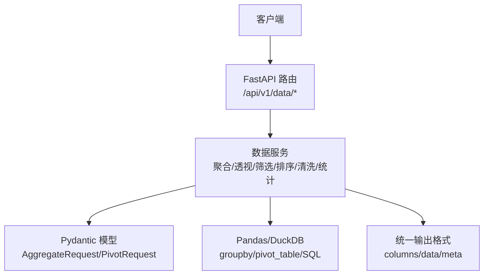
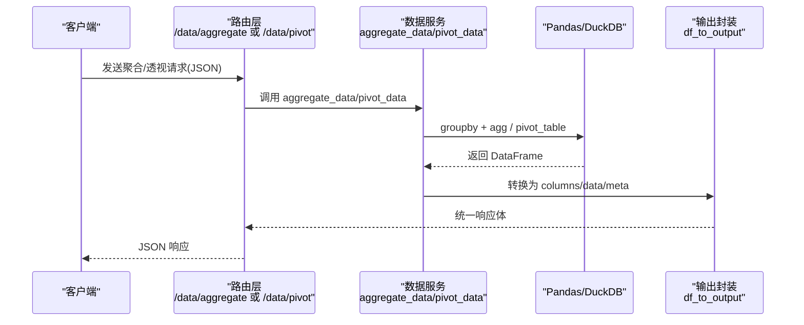
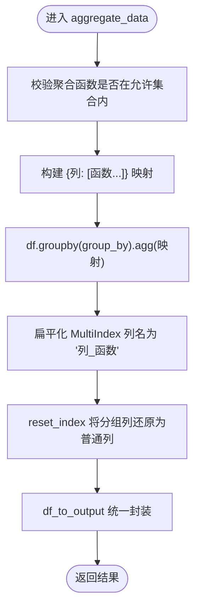
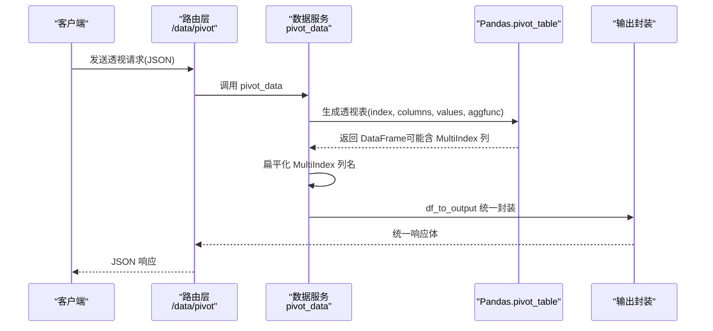
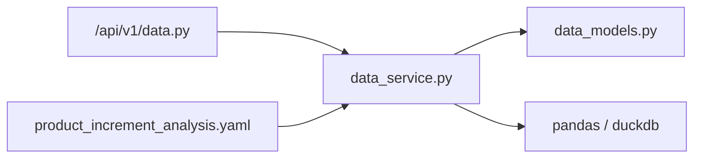

# 聚合分析

<cite>
**本文引用的文件**
- [app/services/data_service.py](file://app/services/data_service.py)
- [app/api/v1/data.py](file://app/api/v1/data.py)
- [app/models/data_models.py](file://app/models/data_models.py)
- [app/scenarios/product_increment_analysis.yaml](file://app/scenarios/product_increment_analysis.yaml)
- [tests/test_data_api.py](file://tests/test_data_api.py)
</cite>

## 目录
1. [简介](#简介)
2. [项目结构](#项目结构)
3. [核心组件](#核心组件)
4. [架构总览](#架构总览)
5. [详细组件分析](#详细组件分析)
6. [依赖关系分析](#依赖关系分析)
7. [性能与扩展性](#性能与扩展性)
8. [故障排查指南](#故障排查指南)
9. [结论](#结论)
10. [附录：业务场景示例](#附录业务场景示例)

## 简介
本章节聚焦于“聚合分析”和“透视表”两大能力，覆盖 groupby 配置、支持的聚合函数（sum、mean、count、min、max、median、std、var）、多列聚合、嵌套分组、结果格式化以及透视表的生成方法。文档同时提供销售数据分析、用户行为统计等实际业务场景的调用思路与步骤说明，帮助读者快速上手并落地到生产环境。

## 项目结构
围绕聚合与透视的核心代码主要分布在以下位置：
- 数据服务层：实现聚合、透视、筛选、排序、清洗、统计分析等数据处理逻辑
- API 路由层：暴露 HTTP 接口，接收请求并调用服务层
- 数据模型层：定义请求/响应结构，约束字段类型与校验
- 场景编排：通过 YAML 描述 Pipeline，串联多个处理步骤（含聚合）
- 测试用例：验证聚合、筛选、排序等接口的正确性

图表来源
- [app/api/v1/data.py:161-172](file://app/api/v1/data.py#L161-L172)
- [app/services/data_service.py:218-272](file://app/services/data_service.py#L218-L272)
- [app/models/data_models.py:73-93](file://app/models/data_models.py#L73-L93)

章节来源
- [app/api/v1/data.py:161-172](file://app/api/v1/data.py#L161-L172)
- [app/services/data_service.py:218-272](file://app/services/data_service.py#L218-L272)
- [app/models/data_models.py:73-93](file://app/models/data_models.py#L73-L93)

## 核心组件
- 聚合接口
  - 路由：POST /api/v1/data/aggregate
  - 服务：按 group_by 分组，对 agg_columns 应用一组聚合函数（sum、mean、count、min、max、median、std、var），并将 MultiIndex 列名扁平化为“列_函数”形式
- 透视表接口
  - 路由：POST /api/v1/data/pivot
  - 服务：基于 index、columns、values、agg_func 生成透视表，并对 MultiIndex 列进行扁平化处理
- 数据模型
  - AggregateRequest：包含 dataframe、group_by、agg_columns、agg_funcs
  - PivotRequest：包含 dataframe、index、columns、values、agg_func
- 输出封装
  - 将 DataFrame 转为 columns/data/meta 的统一结构，便于前端展示与序列化

章节来源
- [app/api/v1/data.py:161-172](file://app/api/v1/data.py#L161-L172)
- [app/services/data_service.py:218-272](file://app/services/data_service.py#L218-L272)
- [app/models/data_models.py:73-93](file://app/models/data_models.py#L73-L93)

## 架构总览
聚合与透视在系统中的调用链路如下：

图表来源
- [app/api/v1/data.py:161-172](file://app/api/v1/data.py#L161-L172)
- [app/services/data_service.py:218-272](file://app/services/data_service.py#L218-L272)

## 详细组件分析

### 聚合分析（groupby + 多聚合函数）
- 支持聚合函数集合：sum、mean、count、min、max、median、std、var
- 多列聚合：对 agg_columns 中的每一列应用同一组聚合函数
- 嵌套分组：group_by 为列表时，按多列层级分组
- 结果格式化：MultiIndex 列名被扁平化为“列_函数”，并通过 reset_index 将分组列恢复为普通列

图表来源
- [app/services/data_service.py:218-243](file://app/services/data_service.py#L218-L243)

章节来源
- [app/services/data_service.py:218-243](file://app/services/data_service.py#L218-L243)
- [app/models/data_models.py:73-82](file://app/models/data_models.py#L73-L82)
- [tests/test_data_api.py:91-105](file://tests/test_data_api.py#L91-L105)

### 透视表（pivot_table）
- 参数：index（行索引列）、columns（列展开列）、values（值列）、agg_func（聚合函数）
- 结果格式化：若列是 MultiIndex，则拼接为字符串列名；reset_index 将 index 列还原为普通列

图表来源
- [app/api/v1/data.py:168-172](file://app/api/v1/data.py#L168-L172)
- [app/services/data_service.py:248-272](file://app/services/data_service.py#L248-L272)
- [app/models/data_models.py:86-93](file://app/models/data_models.py#L86-L93)

章节来源
- [app/services/data_service.py:248-272](file://app/services/data_service.py#L248-L272)
- [app/models/data_models.py:86-93](file://app/models/data_models.py#L86-L93)

### 数据模型与输入输出
- 输入载体：DataFrameInput（columns、data、dtypes）
- 聚合请求：AggregateRequest（group_by、agg_columns、agg_funcs）
- 透视请求：PivotRequest（index、columns、values、agg_func）
- 输出结构：columns、data、meta（行列数、列名、数据类型）

章节来源
- [app/models/data_models.py:13-33](file://app/models/data_models.py#L13-L33)
- [app/models/data_models.py:73-93](file://app/models/data_models.py#L73-L93)
- [app/services/data_service.py:35-72](file://app/services/data_service.py#L35-L72)

### 错误处理与边界情况
- 聚合函数白名单校验：不支持的函数会抛出参数校验错误
- 聚合执行异常：捕获并返回数据类型的错误码
- 透视表生成异常：捕获并返回数据类型的错误码
- SQL 安全限制：仅允许 SELECT/WITH 开头的查询（与聚合无关但同属数据服务）

章节来源
- [app/services/data_service.py:218-243](file://app/services/data_service.py#L218-L243)
- [app/services/data_service.py:248-272](file://app/services/data_service.py#L248-L272)
- [app/services/data_service.py:128-158](file://app/services/data_service.py#L128-L158)

## 依赖关系分析
- 路由层依赖数据服务层，数据服务层依赖 Pydantic 模型与 Pandas/DuckDB
- 场景编排通过 YAML 声明 pipeline，其中可包含聚合步骤，复用同一聚合能力

图表来源
- [app/api/v1/data.py:161-172](file://app/api/v1/data.py#L161-L172)
- [app/services/data_service.py:218-272](file://app/services/data_service.py#L218-L272)
- [app/models/data_models.py:73-93](file://app/models/data_models.py#L73-L93)
- [app/scenarios/product_increment_analysis.yaml:67-87](file://app/scenarios/product_increment_analysis.yaml#L67-L87)

章节来源
- [app/api/v1/data.py:161-172](file://app/api/v1/data.py#L161-L172)
- [app/services/data_service.py:218-272](file://app/services/data_service.py#L218-L272)
- [app/scenarios/product_increment_analysis.yaml:67-87](file://app/scenarios/product_increment_analysis.yaml#L67-L87)

## 性能与扩展性
- 聚合复杂度：groupby + agg 的时间复杂度近似 O(N)，N 为行数；多列聚合会增加计算量
- 内存占用：透视表可能产生稀疏矩阵，注意控制 columns 的唯一值数量
- 优化建议：
  - 在聚合前进行必要的筛选与去重，减少参与计算的行数
  - 合理选择 agg_func，避免不必要的复杂计算
  - 对大数据集考虑使用 DuckDB SQL 进行预聚合后再导入 pandas
- 扩展点：
  - 可在数据服务层增加自定义聚合函数映射
  - 在透视表中支持更多 agg_func（如 quantile、first、last 等）

[本节为通用指导，不直接分析具体文件]

## 故障排查指南
- 聚合函数不支持：检查传入的 agg_funcs 是否在允许集合内
- 列不存在：确保 group_by、agg_columns、index/columns/values 指向的列存在
- 数据类型错误：数值列用于 sum/mean/std/var 等，非数值列可能导致异常
- 透视表维度爆炸：columns 唯一值过多会导致结果列膨胀，建议先做过滤或分桶
- SQL 注入防护：若使用 SQL 查询，请确保语句以 SELECT 或 WITH 开头

章节来源
- [app/services/data_service.py:218-243](file://app/services/data_service.py#L218-L243)
- [app/services/data_service.py:248-272](file://app/services/data_service.py#L248-L272)
- [app/services/data_service.py:128-158](file://app/services/data_service.py#L128-L158)

## 结论
本系统提供了标准化的聚合分析与透视表能力，通过清晰的请求模型与服务实现，支持多列聚合、嵌套分组与结果格式化。结合场景编排与测试用例，能够快速构建面向业务的分析流程。建议在大数据场景下结合 SQL 预聚合与合理的维度控制，以获得更好的性能与稳定性。

[本节为总结性内容，不直接分析具体文件]

## 附录：业务场景示例

### 销售数据分析（按产品系列与期限分类汇总净增长）
- 目标：按“产品系列”“期限分类”对每日增量明细进行求和汇总
- 步骤：
  - 使用聚合接口，设置 group_by 为 ["产品系列", "期限分类"]
  - 设置 agg_columns 为 ["增长(元)", "流失(元)", "净增长(元)"]
  - 设置 agg_funcs 为 ["sum"]
- 参考：场景文件中已给出聚合步骤的配置方式

章节来源
- [app/scenarios/product_increment_analysis.yaml:67-87](file://app/scenarios/product_increment_analysis.yaml#L67-L87)

### 用户行为统计（按城市统计分数均值与总和）
- 目标：按城市对用户分数进行 sum 与 mean 统计
- 步骤：
  - 使用聚合接口，设置 group_by 为 ["city"]
  - 设置 agg_columns 为 ["score"]
  - 设置 agg_funcs 为 ["sum", "mean"]
- 验证：测试用例中覆盖了该场景，并断言结果列名包含 score_sum、score_mean

章节来源
- [tests/test_data_api.py:91-105](file://tests/test_data_api.py#L91-L105)

### 透视表示例（按日期与渠道汇总销售额）
- 目标：以“日期”为行、“渠道”为列、“销售额”为值，按渠道汇总销售额
- 步骤：
  - 使用透视接口，设置 index 为 ["日期"]
  - 设置 columns 为 ["渠道"]
  - 设置 values 为 ["销售额"]
  - 设置 agg_func 为 "sum"
- 结果：得到以日期为行、渠道为列的汇总表，列名为“渠道_值”的扁平化形式

章节来源
- [app/services/data_service.py:248-272](file://app/services/data_service.py#L248-L272)
- [app/models/data_models.py:86-93](file://app/models/data_models.py#L86-L93)