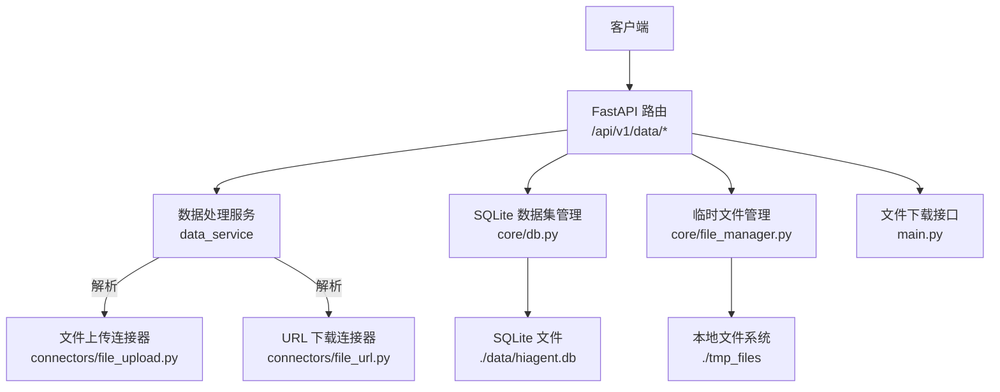
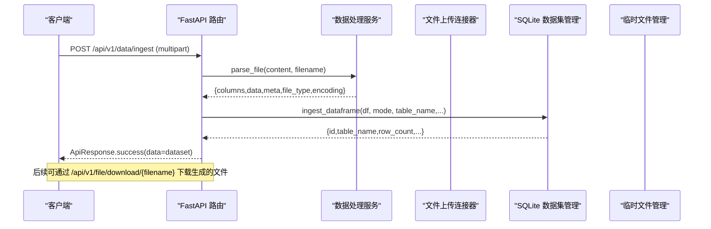
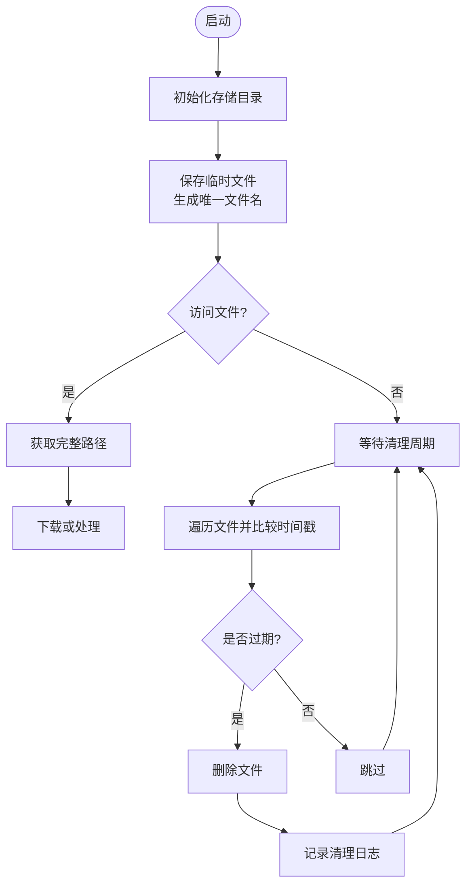
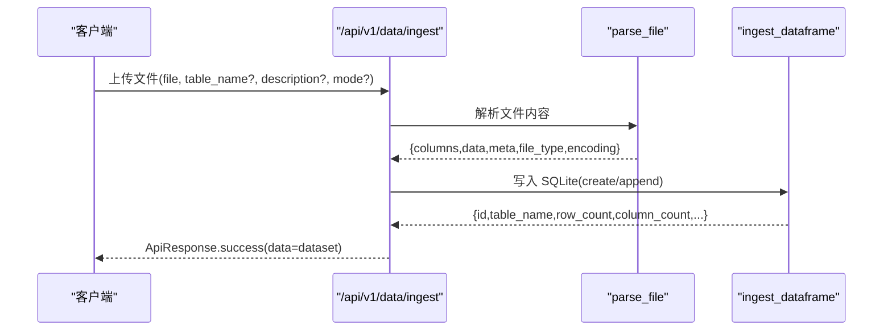
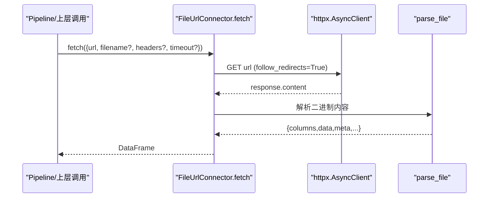
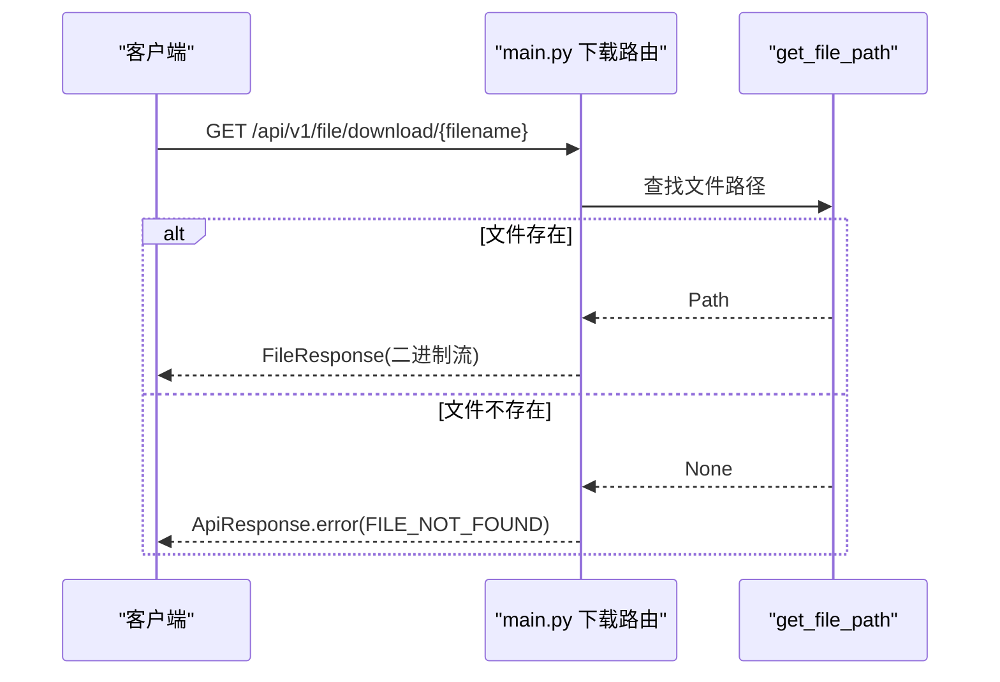
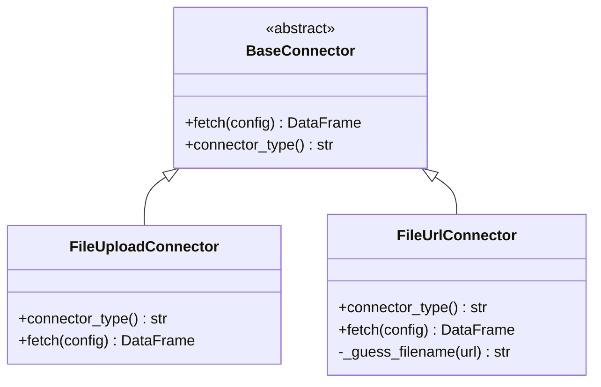
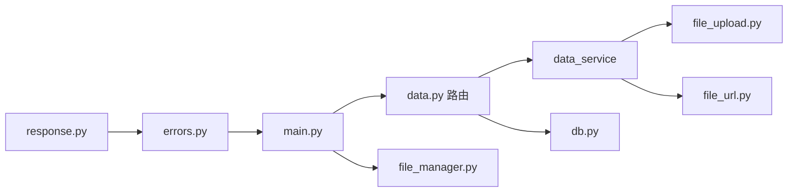

# 文件管理

<cite>
**本文引用的文件**
- [app/main.py](file://app/main.py)
- [app/config.py](file://app/config.py)
- [app/core/file_manager.py](file://app/core/file_manager.py)
- [app/api/v1/data.py](file://app/api/v1/data.py)
- [app/services/data_service.py](file://app/services/data_service.py)
- [app/core/connectors/file_upload.py](file://app/core/connectors/file_upload.py)
- [app/core/connectors/file_url.py](file://app/core/connectors/file_url.py)
- [app/core/connectors/base.py](file://app/core/connectors/base.py)
- [app/core/db.py](file://app/core/db.py)
- [app/core/response.py](file://app/core/response.py)
- [app/core/errors.py](file://app/core/errors.py)
- [tests/test_pipeline.py](file://tests/test_pipeline.py)
</cite>

## 目录
1. [简介](#简介)
2. [项目结构](#项目结构)
3. [核心组件](#核心组件)
4. [架构总览](#架构总览)
5. [详细组件分析](#详细组件分析)
6. [依赖关系分析](#依赖关系分析)
7. [性能与扩展性](#性能与扩展性)
8. [故障排查指南](#故障排查指南)
9. [结论](#结论)
10. [附录：接口清单与使用示例](#附录接口清单与使用示例)

## 简介
本文件系统面向数据处理与报表生成场景，提供统一的文件上传、解析、存储、下载与清理能力。系统支持直接上传（multipart/form-data）和 URL 导入两种方式，自动识别 CSV/Excel/JSON 格式并解析为 DataFrame；通过 SQLite 持久化数据集并提供只读 SQL 查询；内置临时文件定时清理机制，保障磁盘空间安全。

## 项目结构
- 入口与生命周期：FastAPI 应用启动时初始化数据库并启动后台清理任务，同时挂载路由与全局异常处理。
- 数据接入层：提供“直接上传”和“URL 导入”两种连接器，统一返回 DataFrame。
- 业务服务层：封装文件解析、SQL 执行、筛选、聚合、透视、排序、去重、清洗、统计分析等能力。
- 存储层：SQLite 作为数据集持久化存储，维护元数据表与数据表；临时文件落盘到配置路径。
- API 层：暴露 /api/v1/data/* 系列接口用于入库、查询、解析与数据处理；提供文件下载接口。

图表来源
- [app/main.py:29-95](file://app/main.py#L29-L95)
- [app/api/v1/data.py:39-144](file://app/api/v1/data.py#L39-L144)
- [app/services/data_service.py:77-117](file://app/services/data_service.py#L77-L117)
- [app/core/connectors/file_upload.py:18-64](file://app/core/connectors/file_upload.py#L18-L64)
- [app/core/connectors/file_url.py:19-83](file://app/core/connectors/file_url.py#L19-L83)
- [app/core/file_manager.py:15-78](file://app/core/file_manager.py#L15-L78)
- [app/core/db.py:59-189](file://app/core/db.py#L59-L189)

章节来源
- [app/main.py:29-95](file://app/main.py#L29-L95)
- [app/config.py:6-22](file://app/config.py#L6-L22)

## 核心组件
- 临时文件管理：负责临时文件的保存、获取、删除与过期清理。
- 数据解析服务：统一解析 CSV/Excel/JSON，自动编码检测，输出结构化结果。
- 连接器体系：抽象基类 + 具体实现（文件上传、URL 下载），便于扩展新数据源。
- 数据集管理：SQLite 持久化，支持 create/append 模式、元数据记录、只读查询与删除。
- API 路由：提供文件入库、解析、查询、下载等 HTTP 接口。
- 错误与响应：统一错误码、异常处理器与响应模型。

章节来源
- [app/core/file_manager.py:15-78](file://app/core/file_manager.py#L15-L78)
- [app/services/data_service.py:77-117](file://app/services/data_service.py#L77-L117)
- [app/core/connectors/base.py:11-24](file://app/core/connectors/base.py#L11-L24)
- [app/core/connectors/file_upload.py:18-64](file://app/core/connectors/file_upload.py#L18-L64)
- [app/core/connectors/file_url.py:19-83](file://app/core/connectors/file_url.py#L19-L83)
- [app/core/db.py:59-189](file://app/core/db.py#L59-L189)
- [app/api/v1/data.py:39-144](file://app/api/v1/data.py#L39-L144)
- [app/core/response.py:12-103](file://app/core/response.py#L12-L103)
- [app/core/errors.py:15-74](file://app/core/errors.py#L15-L74)

## 架构总览
系统采用分层设计：
- 接入层：FastAPI 路由接收请求，进行参数校验与异常捕获。
- 服务层：业务逻辑集中在 data_service，屏蔽底层细节。
- 连接层：BaseConnector 抽象出 fetch 接口，FileUploadConnector 与 FileUrlConnector 分别实现不同数据源。
- 存储层：SQLite 持久化数据集；临时文件落盘到配置目录，由后台任务定期清理。

图表来源
- [app/api/v1/data.py:39-83](file://app/api/v1/data.py#L39-L83)
- [app/services/data_service.py:77-117](file://app/services/data_service.py#L77-L117)
- [app/core/db.py:89-189](file://app/core/db.py#L89-L189)
- [app/main.py:82-93](file://app/main.py#L82-L93)

## 详细组件分析

### 临时文件管理与自动清理
- 存储路径：从配置读取 file_storage_path，不存在则创建。
- 保存/获取/删除：基于文件名唯一标识（UUID），提供原子写入与存在性检查。
- 过期清理：按 st_mtime 计算文件年龄，超过配置的清理周期（小时）即删除，并统计删除数量。
- 后台任务：应用启动后创建异步任务，周期性调用清理函数，失败时记录日志。

图表来源
- [app/core/file_manager.py:15-78](file://app/core/file_manager.py#L15-L78)
- [app/main.py:29-43](file://app/main.py#L29-L43)
- [app/config.py:6-22](file://app/config.py#L6-L22)

章节来源
- [app/core/file_manager.py:15-78](file://app/core/file_manager.py#L15-L78)
- [app/main.py:29-43](file://app/main.py#L29-L43)
- [app/config.py:6-22](file://app/config.py#L6-L22)

### 文件上传流程（直接上传）
- 接口：POST /api/v1/data/ingest，支持 multipart/form-data 上传 CSV/Excel/JSON。
- 解析：调用 data_service.parse_file，自动编码检测，返回列名、数据与元信息。
- 入库：根据 mode（create/append）将 DataFrame 写入 SQLite，并更新元数据表。
- 响应：返回数据集 id、表名、行列数、类型等信息。

图表来源
- [app/api/v1/data.py:39-83](file://app/api/v1/data.py#L39-L83)
- [app/services/data_service.py:77-117](file://app/services/data_service.py#L77-L117)
- [app/core/db.py:89-189](file://app/core/db.py#L89-L189)

章节来源
- [app/api/v1/data.py:39-83](file://app/api/v1/data.py#L39-L83)
- [app/services/data_service.py:77-117](file://app/services/data_service.py#L77-L117)
- [app/core/db.py:89-189](file://app/core/db.py#L89-L189)

### URL 导入流程
- 连接器：FileUrlConnector 通过 httpx 异步下载文件，支持自定义 headers 与超时。
- 文件名推断：若未显式指定 filename，则从 URL 路径中解析。
- 解析复用：下载完成后复用 data_service.parse_file 进行解析。

图表来源
- [app/core/connectors/file_url.py:19-83](file://app/core/connectors/file_url.py#L19-L83)
- [app/services/data_service.py:77-117](file://app/services/data_service.py#L77-L117)

章节来源
- [app/core/connectors/file_url.py:19-83](file://app/core/connectors/file_url.py#L19-L83)
- [app/services/data_service.py:77-117](file://app/services/data_service.py#L77-L117)

### 文件下载流程
- 接口：GET /api/v1/file/download/{filename}
- 逻辑：根据文件名查找临时文件路径，不存在则返回资源未找到；存在则返回文件流。

图表来源
- [app/main.py:82-93](file://app/main.py#L82-L93)
- [app/core/file_manager.py:30-44](file://app/core/file_manager.py#L30-L44)
- [app/core/response.py:12-103](file://app/core/response.py#L12-L103)

章节来源
- [app/main.py:82-93](file://app/main.py#L82-L93)
- [app/core/file_manager.py:30-44](file://app/core/file_manager.py#L30-L44)
- [app/core/response.py:12-103](file://app/core/response.py#L12-L103)

### 连接器抽象与扩展
- BaseConnector：定义 fetch 与 connector_type 两个抽象方法，确保所有连接器具备统一行为。
- FileUploadConnector：接收 base64 编码的文件内容与文件名，解码后调用 parse_file。
- FileUrlConnector：从 URL 下载文件，支持 headers 与超时，解析后返回 DataFrame。

图表来源
- [app/core/connectors/base.py:11-24](file://app/core/connectors/base.py#L11-L24)
- [app/core/connectors/file_upload.py:18-64](file://app/core/connectors/file_upload.py#L18-L64)
- [app/core/connectors/file_url.py:19-83](file://app/core/connectors/file_url.py#L19-L83)

章节来源
- [app/core/connectors/base.py:11-24](file://app/core/connectors/base.py#L11-L24)
- [app/core/connectors/file_upload.py:18-64](file://app/core/connectors/file_upload.py#L18-L64)
- [app/core/connectors/file_url.py:19-83](file://app/core/connectors/file_url.py#L19-L83)

### 大文件处理策略
- 内存解析：当前 parse_file 将文件内容以 bytes 形式传入 pandas 读取，适合中小规模文件。
- 建议优化：对于超大文件，可考虑分块读取（如 chunksize）、流式解析或使用更高效的引擎（如 pyarrow/polars）。
- 并发限制：当前未实现分片与断点续传，高并发上传需结合网关限流与队列化处理。

章节来源
- [app/services/data_service.py:77-117](file://app/services/data_service.py#L77-L117)

### 并发与断点续传
- 现状：代码库未包含分片上传、断点续传与并发合并逻辑。
- 建议方案：引入对象存储（如 MinIO/S3）+ 分片上传协议（Multipart Upload），服务端记录分片状态并在完成时合并。

[本节为概念性说明，不直接分析具体文件]

### 安全验证与病毒扫描
- SQL 安全：对 DuckDB 与 SQLite 查询均做白名单校验，仅允许 SELECT/WITH 开头语句，防止注入。
- 文件格式：仅支持 CSV/Excel/JSON，其他格式将被拒绝。
- 病毒扫描：当前未集成外部病毒扫描服务，建议在接入层增加沙箱扫描或第三方扫描回调。

章节来源
- [app/services/data_service.py:122-158](file://app/services/data_service.py#L122-L158)
- [app/core/db.py:256-296](file://app/core/db.py#L256-L296)
- [app/services/data_service.py:77-117](file://app/services/data_service.py#L77-L117)

### 存储优化策略
- SQLite 表名清洗：去除非法字符并限制长度，避免命名冲突。
- append 模式：在追加模式下校验目标表是否存在与列兼容性，减少无效写入。
- 元数据追踪：_datasets 表记录行列数、列名、类型、文件类型等，便于审计与预览。

章节来源
- [app/core/db.py:44-55](file://app/core/db.py#L44-L55)
- [app/core/db.py:89-189](file://app/core/db.py#L89-L189)

## 依赖关系分析
- 路由依赖服务：data.py 调用 data_service 进行解析与处理，调用 db 进行持久化。
- 服务依赖连接器：data_service 被 connectors 复用，形成统一解析入口。
- 生命周期依赖：main.py 在启动时初始化数据库并启动清理任务。
- 错误与响应：errors.py 与 response.py 贯穿各层，保证一致的错误处理与响应格式。

图表来源
- [app/api/v1/data.py:39-144](file://app/api/v1/data.py#L39-L144)
- [app/services/data_service.py:77-117](file://app/services/data_service.py#L77-L117)
- [app/core/connectors/file_upload.py:18-64](file://app/core/connectors/file_upload.py#L18-L64)
- [app/core/connectors/file_url.py:19-83](file://app/core/connectors/file_url.py#L19-L83)
- [app/core/file_manager.py:15-78](file://app/core/file_manager.py#L15-L78)
- [app/core/db.py:59-189](file://app/core/db.py#L59-L189)
- [app/core/errors.py:15-74](file://app/core/errors.py#L15-L74)
- [app/core/response.py:12-103](file://app/core/response.py#L12-L103)

章节来源
- [app/api/v1/data.py:39-144](file://app/api/v1/data.py#L39-L144)
- [app/services/data_service.py:77-117](file://app/services/data_service.py#L77-L117)
- [app/core/file_manager.py:15-78](file://app/core/file_manager.py#L15-L78)
- [app/core/db.py:59-189](file://app/core/db.py#L59-L189)
- [app/core/errors.py:15-74](file://app/core/errors.py#L15-L74)
- [app/core/response.py:12-103](file://app/core/response.py#L12-L103)

## 性能与扩展性
- 解析性能：pandas 读取 CSV/Excel/JSON 在中小文件下表现良好；超大数据集建议分块或改用更高效引擎。
- I/O 瓶颈：SQLite 写入为同步操作，可通过异步线程池（已使用 asyncio.to_thread）降低阻塞。
- 清理策略：后台任务默认每 30 分钟清理一次，可按需调整 interval_seconds 与配置中的清理周期。
- 扩展点：新增数据源只需实现 BaseConnector 的 fetch 方法；新增文件格式需在 parse_file 中扩展分支。

[本节为通用指导，不直接分析具体文件]

## 故障排查指南
- 文件解析失败：检查文件格式与编码，确认是否为支持的 CSV/Excel/JSON；查看错误码 FILE_PARSE_ERROR。
- SQL 执行错误：确认 SQL 以 SELECT/WITH 开头，且不含危险关键字；查看错误码 SQL_EXECUTION_ERROR。
- 数据集不存在：检查 dataset_id 或 table_name 是否正确；查看错误码 RESOURCE_NOT_FOUND。
- 文件下载失败：确认临时文件是否存在；查看错误码 FILE_NOT_FOUND。
- 参数校验失败：检查请求体字段是否符合 Pydantic 模型定义；查看错误码 PARAM_VALIDATION_ERROR。

章节来源
- [app/services/data_service.py:77-117](file://app/services/data_service.py#L77-L117)
- [app/services/data_service.py:122-158](file://app/services/data_service.py#L122-L158)
- [app/core/db.py:256-296](file://app/core/db.py#L256-L296)
- [app/core/response.py:12-103](file://app/core/response.py#L12-L103)
- [app/core/errors.py:15-74](file://app/core/errors.py#L15-L74)

## 结论
本文件系统提供了完整的文件上传、解析、存储、下载与清理能力，并通过连接器抽象与统一错误处理提升了可扩展性与可维护性。当前版本聚焦于中小规模数据的快速处理与持久化，未来可在大文件分片、断点续传、并发控制与病毒扫描等方面进一步增强。

[本节为总结性内容，不直接分析具体文件]

## 附录：接口清单与使用示例
- 文件入库
  - POST /api/v1/data/ingest
  - 表单字段：file（CSV/Excel/JSON）、table_name（可选）、description（可选）、mode（create/append）
  - 参考：[app/api/v1/data.py:39-83](file://app/api/v1/data.py#L39-L83)
- 数据集列表与详情
  - GET /api/v1/data/datasets
  - GET /api/v1/data/datasets/{dataset_id}?preview=N
  - 参考：[app/api/v1/data.py:86-105](file://app/api/v1/data.py#L86-L105)
- 数据集查询
  - POST /api/v1/data/datasets/{dataset_id}/query
  - 请求体：{sql: "SELECT ..."}
  - 参考：[app/api/v1/data.py:108-122](file://app/api/v1/data.py#L108-L122)
- 数据集删除
  - DELETE /api/v1/data/datasets/{dataset_id}
  - 参考：[app/api/v1/data.py:125-134](file://app/api/v1/data.py#L125-L134)
- 文件解析
  - POST /api/v1/data/parse
  - 表单字段：file（CSV/Excel/JSON）
  - 参考：[app/api/v1/data.py:139-144](file://app/api/v1/data.py#L139-L144)
- 文件下载
  - GET /api/v1/file/download/{filename}
  - 参考：[app/main.py:82-93](file://app/main.py#L82-L93)
- URL 导入（通过 Pipeline/连接器）
  - 使用 FileUrlConnector.fetch({url, filename?, headers?, timeout?})
  - 参考：[app/core/connectors/file_url.py:19-83](file://app/core/connectors/file_url.py#L19-L83)
- 直接上传（base64）
  - 使用 FileUploadConnector.fetch({file_content, filename})
  - 参考：[app/core/connectors/file_upload.py:18-64](file://app/core/connectors/file_upload.py#L18-L64)
- 端到端测试示例（上传 CSV -> 清洗 -> 统计 -> 输出）
  - 参考：[tests/test_pipeline.py:44-95](file://tests/test_pipeline.py#L44-L95)

章节来源
- [app/api/v1/data.py:39-144](file://app/api/v1/data.py#L39-L144)
- [app/main.py:82-93](file://app/main.py#L82-L93)
- [app/core/connectors/file_url.py:19-83](file://app/core/connectors/file_url.py#L19-L83)
- [app/core/connectors/file_upload.py:18-64](file://app/core/connectors/file_upload.py#L18-L64)
- [tests/test_pipeline.py:44-95](file://tests/test_pipeline.py#L44-L95)