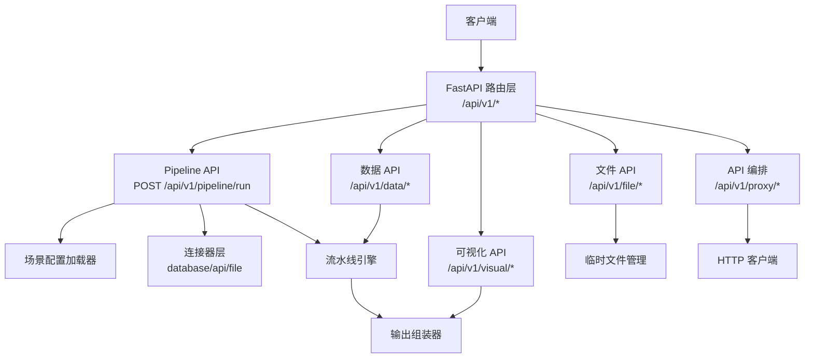
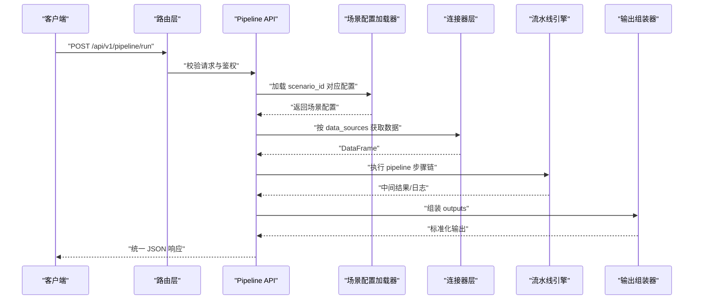
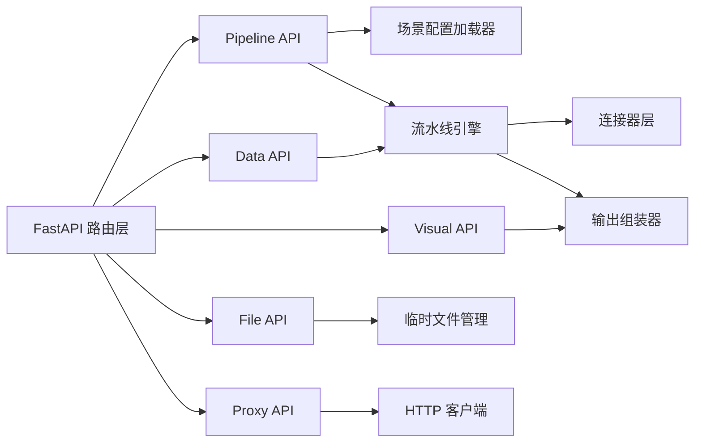

# API 接口设计

<cite>
**本文引用的文件**
- [需求说明文档](file://docs/20260821100000_hiagent辅助Web服务_需求说明.md)
</cite>

## 目录
1. [简介](#简介)
2. [项目结构](#项目结构)
3. [核心组件](#核心组件)
4. [架构总览](#架构总览)
5. [详细组件分析](#详细组件分析)
6. [依赖关系分析](#依赖关系分析)
7. [性能考虑](#性能考虑)
8. [故障排查指南](#故障排查指南)
9. [结论](#结论)
10. [附录：API 参考与集成指南](#附录api-参考与集成指南)

## 简介
本文件基于 hiagent 辅助 Web 服务的需求说明，系统化梳理并输出统一的 API 接口设计规范。内容涵盖统一响应格式、错误码分段、API Key 认证机制、两种调用模式（Pipeline API 与原子 API）、路由设计与版本控制策略、请求参数验证与响应序列化、安全考量（身份认证、权限控制、输入验证、SQL 注入防护），以及完整的 API 参考与客户端集成最佳实践。目标是让不同技术背景的读者都能快速理解并正确集成该服务。

## 项目结构
根据需求说明，系统采用 FastAPI 构建，围绕“场景驱动的流水线引擎”组织能力，关键新增目录包括：
- app/core/pipeline_engine.py：流水线引擎
- app/core/scenario_loader.py：场景配置加载器
- app/core/connectors/：数据连接器（base/database/api/file）
- app/core/output_assembler.py：输出组装器
- app/scenarios/*.yaml：场景配置文件
- app/api/v1/pipeline.py：Pipeline 路由

此外，功能模块按领域划分到 /api/v1/data、/api/v1/visual、/api/v1/file、/api/v1/proxy 等子域，形成清晰的模块化路由体系。

图表来源
- [需求说明文档:33-68](file://docs/20260821100000_hiagent辅助Web服务_需求说明.md#L33-L68)
- [需求说明文档:71-94](file://docs/20260821100000_hiagent辅助Web服务_需求说明.md#L71-L94)

章节来源
- [需求说明文档:106-115](file://docs/20260821100000_hiagent辅助Web服务_需求说明.md#L106-L115)

## 核心组件
- 统一响应体：所有接口返回 JSON，包含 code、message、data、request_id 四个字段，便于客户端统一处理成功与失败分支。
- 错误码分段：按模块划分错误码段，便于定位问题来源：
  - 1xxx 通用错误
  - 2xxx 数据处理错误
  - 3xxx 可视化错误
  - 4xxx 文件文档错误
  - 5xxx API 编排错误
  - 6xxx Pipeline 引擎错误
- 认证机制：通过请求头 X-API-Key 进行 API Key 认证，服务端校验通过后放行。
- 流水线引擎：以 YAML 配置驱动，串联数据获取、处理步骤、输出组装，支持条件分支与步骤级错误处理。
- 连接器层：抽象数据库、外部 API、文件上传/下载等数据源，统一返回 DataFrame，凭据从环境变量读取。
- 输出组装器：将中间结果渲染为 chart/table/report/file/summary 等标准化输出。

章节来源
- [需求说明文档:25-30](file://docs/20260821100000_hiagent辅助Web服务_需求说明.md#L25-L30)
- [需求说明文档:33-64](file://docs/20260821100000_hiagent辅助Web服务_需求说明.md#L33-L64)

## 架构总览
整体流程遵循“无状态、单一职责、输入输出标准化、容错优先、安全隔离、场景可配置、组件可复用”的原则。Agent 发起请求后，经路由层进入 Pipeline API 或原子 API；Pipeline 模式通过场景配置加载器解析 YAML，依次执行连接器与处理步骤，最终由输出组装器生成统一响应。

图表来源
- [需求说明文档:33-68](file://docs/20260821100000_hiagent辅助Web服务_需求说明.md#L33-L68)

## 详细组件分析

### 统一响应与错误码
- 响应字段
  - code：业务状态码，按模块分段
  - message：人类可读的错误或提示信息
  - data：业务数据负载（可为对象、数组或空）
  - request_id：本次请求唯一标识，用于追踪与排障
- 错误码分段
  - 1xxx：通用错误（如参数校验失败、未授权）
  - 2xxx：数据处理错误（如 SQL 执行失败、类型转换异常）
  - 3xxx：可视化错误（如图表渲染失败）
  - 4xxx：文件文档错误（如格式不支持、IO 异常）
  - 5xxx：API 编排错误（如代理请求失败、速率限制）
  - 6xxx：Pipeline 引擎错误（如步骤执行失败、配置缺失）

章节来源
- [需求说明文档:25-30](file://docs/20260821100000_hiagent辅助Web服务_需求说明.md#L25-L30)

### 认证与安全
- API Key 认证：客户端在请求头携带 X-API-Key，服务端校验通过后放行。
- 权限控制：建议结合 API Key 与角色/范围进行细粒度授权（例如仅允许访问特定 scenario_id）。
- 输入验证：使用 Pydantic 模型对请求体与查询参数进行强类型校验，拒绝非法输入。
- SQL 注入防护：所有 SQL 查询通过参数化或 DuckDB 安全接口执行，禁止拼接用户输入。
- 文件沙箱：文件操作限制在受控目录，避免路径穿越与越权访问。
- 凭据管理：数据库连接串、密钥等通过环境变量注入，不硬编码于代码中。

章节来源
- [需求说明文档:25-30](file://docs/20260821100000_hiagent辅助Web服务_需求说明.md#L25-L30)
- [需求说明文档:97-102](file://docs/20260821100000_hiagent辅助Web服务_需求说明.md#L97-L102)

### 路由设计与版本控制
- 路由前缀：/api/v1，便于未来升级至 v2 时保持向后兼容。
- 模块划分：
  - /api/v1/pipeline：Pipeline 编排入口
  - /api/v1/data：数据处理能力
  - /api/v1/visual：可视化与报告渲染
  - /api/v1/file：文件与文档操作
  - /api/v1/proxy：外部 API 编排
- 健康检查：提供 /health 端点用于存活与健康探测。
- 场景列表：提供 /api/v1/pipeline/scenarios 列出可用场景，便于客户端动态发现。

章节来源
- [需求说明文档:65-68](file://docs/20260821100000_hiagent辅助Web服务_需求说明.md#L65-L68)
- [需求说明文档:97-102](file://docs/20260821100000_hiagent辅助Web服务_需求说明.md#L97-L102)

### 请求参数验证与响应序列化
- 参数验证：使用 Pydantic 定义请求模型，强制类型检查与必填字段校验，减少无效请求进入处理链路。
- 响应序列化：统一使用 JSON 格式，确保跨语言兼容性；data 字段承载业务数据，message 描述状态信息。
- 日志与追踪：结构化日志记录 scenario_id、步骤耗时、错误堆栈，配合 request_id 实现端到端追踪。

章节来源
- [需求说明文档:25-30](file://docs/20260821100000_hiagent辅助Web服务_需求说明.md#L25-L30)
- [需求说明文档:97-102](file://docs/20260821100000_hiagent辅助Web服务_需求说明.md#L97-L102)

### Pipeline 引擎与连接器
- 流水线引擎：顺序执行步骤，通过命名引用传递中间数据（PipelineContext），支持条件分支与步骤级错误处理（skip/abort），每步独立记录日志与耗时。
- 连接器层：抽象 database、api、file_upload、file_url、file_s3 等数据源，统一返回 DataFrame；凭据从环境变量读取，注册表模式扩展新连接器。
- 输出组装器：将中间结果渲染为 chart/table/report/file/summary 五种输出类型，其中 summary 专为 Agent 设计。

章节来源
- [需求说明文档:33-64](file://docs/20260821100000_hiagent辅助Web服务_需求说明.md#L33-L64)

### 原子 API 模式
原子 API 暴露细粒度能力，供 Agent 自行编排复杂流程：
- /api/v1/data/*：数据导入解析、SQL 查询、筛选聚合、清洗统计等
- /api/v1/visual/*：图表生成、报告渲染、表格渲染等
- /api/v1/file/*：格式转换、文档生成、打包解压、元信息查询、临时文件管理等
- /api/v1/proxy/*：HTTP 代理、批量并发、链式请求、数据转换、超时重试、速率限制、鉴权模板等

章节来源
- [需求说明文档:71-94](file://docs/20260821100000_hiagent辅助Web服务_需求说明.md#L71-L94)

## 依赖关系分析
- 框架与库：FastAPI、pandas/numpy、DuckDB、matplotlib/plotly、WeasyPrint、httpx、Pydantic、PyYAML、SQLAlchemy、jsonpath-ng、uvicorn、Docker
- 模块耦合：
  - 路由层依赖认证与参数校验中间件
  - Pipeline API 依赖场景配置加载器与流水线引擎
  - 连接器层依赖数据库驱动与 HTTP 客户端
  - 输出组装器依赖可视化与报告渲染库
  - 文件 API 依赖临时存储与格式转换库

图表来源
- [需求说明文档:19-21](file://docs/20260821100000_hiagent辅助Web服务_需求说明.md#L19-L21)
- [需求说明文档:33-68](file://docs/20260821100000_hiagent辅助Web服务_需求说明.md#L33-L68)
- [需求说明文档:71-94](file://docs/20260821100000_hiagent辅助Web服务_需求说明.md#L71-L94)

## 性能考虑
- 简单接口响应时间 < 500ms
- 数据处理接口 < 3s
- Pipeline 全流程 < 10s
- 优化建议：
  - 使用连接池与缓存减少重复 IO
  - 对大数据集采用流式处理与分页
  - 合理设置超时与重试策略
  - 利用 DuckDB 的列式存储优势提升查询性能

章节来源
- [需求说明文档:97-102](file://docs/20260821100000_hiagent辅助Web服务_需求说明.md#L97-L102)

## 故障排查指南
- 定位问题：通过 response.request_id 与结构化日志中的 scenario_id、步骤耗时快速定位
- 常见错误：
  - 认证失败：检查 X-API-Key 是否正确配置
  - 参数校验失败：核对请求体字段类型与必填项
  - SQL 执行失败：检查参数化查询与权限
  - 连接器异常：确认环境变量凭据与网络连通性
  - 渲染失败：检查模板与数据格式
- 健康检查：调用 /health 确认服务可用性

章节来源
- [需求说明文档:97-102](file://docs/20260821100000_hiagent辅助Web服务_需求说明.md#L97-L102)

## 结论
本规范以统一响应、分段错误码、API Key 认证为核心，构建了面向多场景的 Pipeline + 原子 API 双模式架构。通过 YAML 配置驱动与连接器抽象，系统具备高可扩展性与可维护性。建议在集成过程中严格遵循参数验证与安全策略，并结合健康检查与结构化日志进行运维监控。

## 附录：API 参考与集成指南

### 统一响应格式
- 字段
  - code：业务状态码（按模块分段）
  - message：提示或错误信息
  - data：业务数据
  - request_id：请求唯一标识
- 示例说明：请参考各端点的响应示例（见下节）

章节来源
- [需求说明文档:25-30](file://docs/20260821100000_hiagent辅助Web服务_需求说明.md#L25-L30)

### 认证方式
- 请求头：X-API-Key
- 校验失败：返回 1xxx 通用错误码

章节来源
- [需求说明文档:25-30](file://docs/20260821100000_hiagent辅助Web服务_需求说明.md#L25-L30)

### 版本控制策略
- 路由前缀：/api/v1
- 升级策略：新增 v2 时保留 v1 兼容期，逐步迁移

章节来源
- [需求说明文档:65-68](file://docs/20260821100000_hiagent辅助Web服务_需求说明.md#L65-L68)

### Pipeline API 模式
- 端点：POST /api/v1/pipeline/run
- 用途：传入 scenario_id 与参数，一次完成全流程
- 请求体字段（示例）：
  - scenario_id：字符串，场景标识
  - params：对象，场景参数映射
- 响应：
  - code：业务状态码
  - message：提示或错误信息
  - data：包含 outputs 集合（chart/table/report/file/summary）
  - request_id：请求唯一标识
- 行为：
  - 加载场景配置
  - 执行连接器与处理步骤
  - 组装输出并返回

章节来源
- [需求说明文档:33-68](file://docs/20260821100000_hiagent辅助Web服务_需求说明.md#L33-L68)

### 原子 API 模式
- 数据 API：/api/v1/data/*
  - 能力：导入解析、SQL 查询、筛选聚合、清洗统计
  - 典型端点：
    - POST /api/v1/data/import：导入 CSV/Excel/JSON
    - POST /api/v1/data/query：执行 SQL 查询
    - POST /api/v1/data/clean：数据清洗
    - POST /api/v1/data/stat：统计分析
- 可视化 API：/api/v1/visual/*
  - 能力：图表生成、报告渲染、表格渲染
  - 典型端点：
    - POST /api/v1/visual/chart：生成图表（PNG/SVG/HTML）
    - POST /api/v1/visual/report：渲染报告（Jinja2/Markdown→HTML）
    - POST /api/v1/visual/table：渲染数据表格
- 文件 API：/api/v1/file/*
  - 能力：格式转换、文档生成、打包解压、元信息查询、临时文件管理
  - 典型端点：
    - POST /api/v1/file/convert：格式互转
    - POST /api/v1/file/generate：生成 PDF/Word/Excel/PPT
    - POST /api/v1/file/archive：打包/解压
    - GET /api/v1/file/meta：元信息查询
    - GET /api/v1/file/download：流式下载
- API 编排：/api/v1/proxy/*
  - 能力：HTTP 代理、批量并发、链式请求、数据转换、超时重试、速率限制、鉴权模板
  - 典型端点：
    - POST /api/v1/proxy/request：单次请求
    - POST /api/v1/proxy/batch：批量并发
    - POST /api/v1/proxy/chain：链式请求
    - POST /api/v1/proxy/transform：数据转换

章节来源
- [需求说明文档:71-94](file://docs/20260821100000_hiagent辅助Web服务_需求说明.md#L71-L94)

### 健康检查与场景列表
- 健康检查：GET /health
- 场景列表：GET /api/v1/pipeline/scenarios

章节来源
- [需求说明文档:97-102](file://docs/20260821100000_hiagent辅助Web服务_需求说明.md#L97-L102)

### 客户端集成指南与最佳实践
- 认证：在请求头添加 X-API-Key
- 参数校验：使用 Pydantic 模型构造请求体，确保类型与必填项正确
- 错误处理：根据 code 分段判断错误来源，结合 message 与 request_id 进行日志记录与上报
- 重试与限流：对 /api/v1/proxy/* 启用超时与重试，注意速率限制
- 资源清理：及时释放临时文件，避免磁盘占用
- 可观测性：记录 request_id 与关键指标，便于追踪与排障

章节来源
- [需求说明文档:97-102](file://docs/20260821100000_hiagent辅助Web服务_需求说明.md#L97-L102)