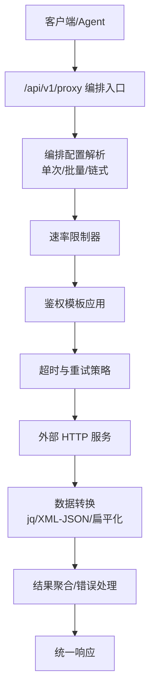
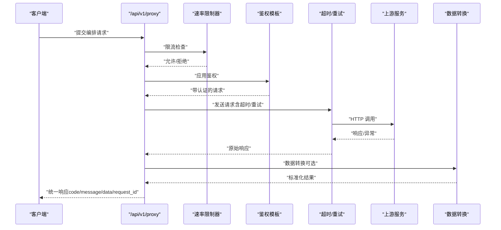
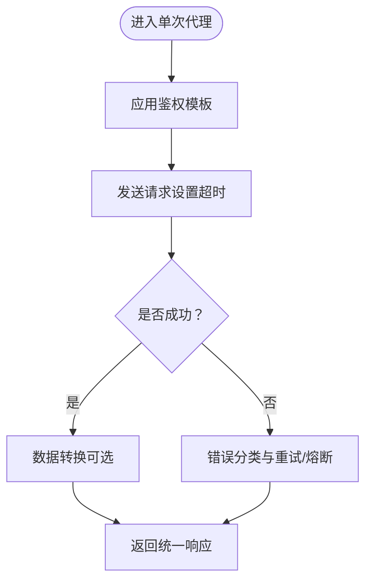
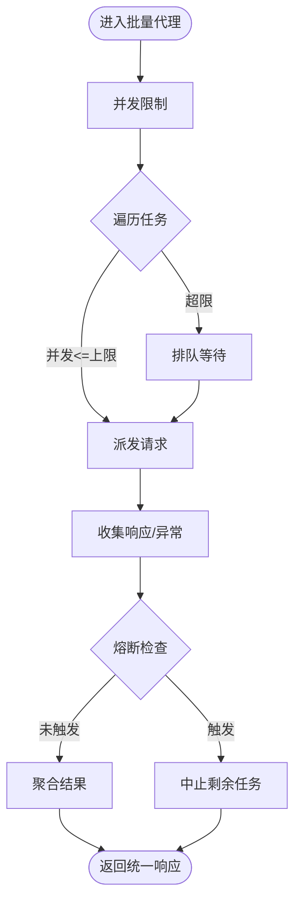
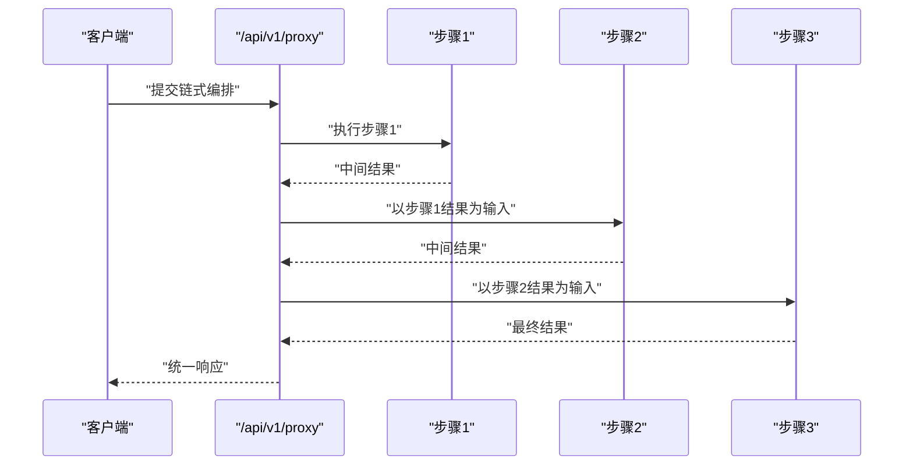
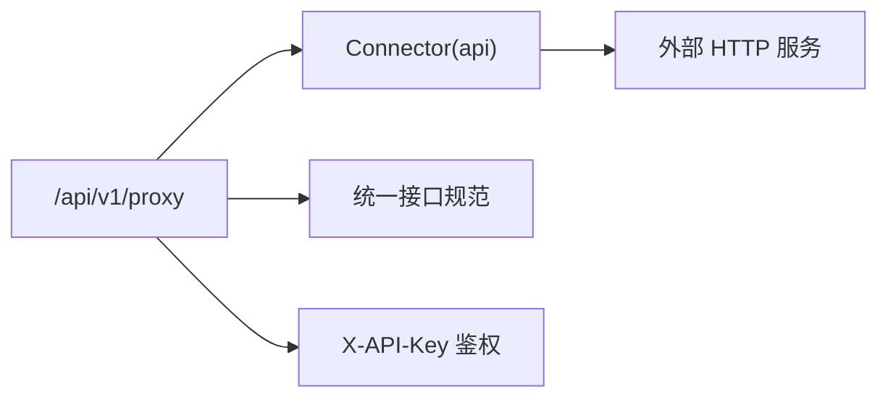

# API 编排 API

<cite>
**本文引用的文件**
- [需求说明文档](file://docs/20260821100000_hiagent辅助Web服务_需求说明.md)
</cite>

## 目录
1. [简介](#简介)
2. [项目结构](#项目结构)
3. [核心组件](#核心组件)
4. [架构总览](#架构总览)
5. [详细组件分析](#详细组件分析)
6. [依赖关系分析](#依赖关系分析)
7. [性能与可观测性](#性能与可观测性)
8. [故障排查指南](#故障排查指南)
9. [结论](#结论)
10. [附录：API 调用示例](#附录api-调用示例)

## 简介
本章节面向“API 编排”模块，聚焦 /api/v1/proxy/* 子接口能力，包括 HTTP 代理（单次、批量并发、链式请求）、数据转换（jq 风格、XML-JSON、扁平化）、超时重试、速率限制、鉴权模板等。该模块作为统一的数据获取与编排层，向上对接 Pipeline 引擎与 Agent，向下对接外部 REST API，提供高内聚、可配置、可观测的编排能力。

## 项目结构
根据需求说明书，API 编排属于整体架构中的“数据获取层(Connector)”与“流水线引擎(Pipeline Engine)”之间的关键枢纽。其职责是将上游传入的编排配置转换为对下游接口的受控访问，并在必要时进行数据格式转换与结果聚合。

图表来源
- [需求说明文档:33-68](file://docs/20260821100000_hiagent辅助Web服务_需求说明.md#L33-L68)
- [需求说明文档:90-94](file://docs/20260821100000_hiagent辅助Web服务_需求说明.md#L90-L94)

章节来源
- [需求说明文档:33-68](file://docs/20260821100000_hiagent辅助Web服务_需求说明.md#L33-L68)
- [需求说明文档:90-94](file://docs/20260821100000_hiagent辅助Web服务_需求说明.md#L90-L94)

## 核心组件
- 编排入口：接收并校验编排请求，识别模式（单次/批量/链式），加载对应策略。
- 速率限制器：基于令牌桶或滑动窗口控制并发与 QPS，避免压垮上游。
- 鉴权模板：注入认证头、签名、Token 刷新等，支持多种鉴权方式。
- 超时与重试：配置连接/读取超时、退避策略、熔断阈值与冷却时间。
- 数据转换：支持 jq 风格查询、XML 转 JSON、扁平化展开，保证输出稳定。
- 结果聚合与错误处理：汇总成功/失败项，按策略返回部分成功或整体失败。

章节来源
- [需求说明文档:90-94](file://docs/20260821100000_hiagent辅助Web服务_需求说明.md#L90-L94)

## 架构总览
API 编排位于 Pipeline 引擎与外部数据源之间，承担“受控访问 + 数据适配”的职责。通过统一的输入输出规范，屏蔽下游差异，提升上层编排的可复用性与稳定性。

图表来源
- [需求说明文档:25-30](file://docs/20260821100000_hiagent辅助Web服务_需求说明.md#L25-L30)
- [需求说明文档:90-94](file://docs/20260821100000_hiagent辅助Web服务_需求说明.md#L90-L94)

## 详细组件分析

### 单次请求代理
- 功能：将一次编排请求映射为一次对外部服务的 HTTP 调用，支持鉴权、超时、重试、转换。
- 关键点：
  - 鉴权模板：自动注入 Header/签名/Token。
  - 超时重试：连接/读取超时、指数退避、最大重试次数。
  - 数据转换：按需执行 jq 过滤、XML 转 JSON、扁平化。
  - 错误处理：区分网络错误、业务错误、超时错误，记录结构化日志。

图表来源
- [需求说明文档:90-94](file://docs/20260821100000_hiagent辅助Web服务_需求说明.md#L90-L94)

章节来源
- [需求说明文档:90-94](file://docs/20260821100000_hiagent辅助Web服务_需求说明.md#L90-L94)

### 批量并发请求
- 功能：对一组目标并行发起请求，支持并发度上限、整体超时、部分成功策略。
- 关键点：
  - 并发控制：令牌桶/信号量限制并发数，避免资源耗尽。
  - 熔断机制：当错误率超过阈值时快速失败，进入冷却期。
  - 结果聚合：合并成功项，收集失败项及原因，按策略决定整体状态。
  - 监控日志：记录每步耗时、错误码、QPS、并发度。

图表来源
- [需求说明文档:90-94](file://docs/20260821100000_hiagent辅助Web服务_需求说明.md#L90-L94)

章节来源
- [需求说明文档:90-94](file://docs/20260821100000_hiagent辅助Web服务_需求说明.md#L90-L94)

### 链式请求编排
- 功能：将多个上游接口串联，前一步的输出作为后一步的输入，形成数据处理流水线。
- 关键点：
  - 步骤间数据传递：命名引用中间结果，支持条件分支与跳过。
  - 单步容错：可配置 skip/abort 策略，保证链路弹性。
  - 全局超时与重试：整链超时、单步重试互不干扰。
  - 转换与清洗：在任意步骤插入数据转换节点。

图表来源
- [需求说明文档:57-63](file://docs/20260821100000_hiagent辅助Web服务_需求说明.md#L57-L63)
- [需求说明文档:90-94](file://docs/20260821100000_hiagent辅助Web服务_需求说明.md#L90-L94)

章节来源
- [需求说明文档:57-63](file://docs/20260821100000_hiagent辅助Web服务_需求说明.md#L57-L63)
- [需求说明文档:90-94](file://docs/20260821100000_hiagent辅助Web服务_需求说明.md#L90-L94)

### 数据转换能力
- jq 风格：使用表达式对 JSON 进行筛选、投影、聚合。
- XML-JSON：将 XML 响应转为 JSON，便于后续处理。
- 扁平化：将嵌套结构展平为一维键值，便于入库或报表展示。
- 错误处理：转换失败时保留原始响应并附带转换错误信息。

章节来源
- [需求说明文档:90-94](file://docs/20260821100000_hiagent辅助Web服务_需求说明.md#L90-L94)

### 鉴权模板
- 支持多种鉴权方式：Bearer Token、API Key、HMAC 签名、OAuth2 等。
- 模板变量：从环境变量或安全存储中注入凭据，避免硬编码。
- 动态刷新：支持 Token 过期自动刷新与缓存。

章节来源
- [需求说明文档:25-30](file://docs/20260821100000_hiagent辅助Web服务_需求说明.md#L25-L30)
- [需求说明文档:90-94](file://docs/20260821100000_hiagent辅助Web服务_需求说明.md#L90-L94)

### 超时与重试
- 超时：连接超时、读取超时分别配置，防止长尾阻塞。
- 重试：指数退避、抖动、最大重试次数；针对幂等方法更安全。
- 熔断：错误率/慢调用比例达到阈值时快速失败，冷却后恢复。

章节来源
- [需求说明文档:90-94](file://docs/20260821100000_hiagent辅助Web服务_需求说明.md#L90-L94)

### 速率限制
- 维度：全局、租户、IP、API 路径等多维度限流。
- 算法：令牌桶/滑动窗口，支持突发流量平滑。
- 降级：超限时返回友好提示或队列等待。

章节来源
- [需求说明文档:90-94](file://docs/20260821100000_hiagent辅助Web服务_需求说明.md#L90-L94)

## 依赖关系分析
- 与 Pipeline 引擎：通过 Connector 层接入，作为“api”连接器的一种实现。
- 与统一接口规范：遵循 code/message/data/request_id 的统一响应格式。
- 与认证体系：依赖 X-API-Key 头部进行鉴权。

图表来源
- [需求说明文档:25-30](file://docs/20260821100000_hiagent辅助Web服务_需求说明.md#L25-L30)
- [需求说明文档:46-55](file://docs/20260821100000_hiagent辅助Web服务_需求说明.md#L46-L55)
- [需求说明文档:90-94](file://docs/20260821100000_hiagent辅助Web服务_需求说明.md#L90-L94)

章节来源
- [需求说明文档:25-30](file://docs/20260821100000_hiagent辅助Web服务_需求说明.md#L25-L30)
- [需求说明文档:46-55](file://docs/20260821100000_hiagent辅助Web服务_需求说明.md#L46-L55)
- [需求说明文档:90-94](file://docs/20260821100000_hiagent辅助Web服务_需求说明.md#L90-L94)

## 性能与可观测性
- 性能目标：简单接口 < 500ms，数据处理 < 3s，Pipeline 全流程 < 10s。
- 并发与吞吐：通过并发控制与速率限制平衡上游压力与系统吞吐。
- 可观测性：结构化日志包含 scenario_id、步骤耗时、错误码；暴露健康检查端点。

章节来源
- [需求说明文档:97-102](file://docs/20260821100000_hiagent辅助Web服务_需求说明.md#L97-L102)

## 故障排查指南
- 常见问题定位：
  - 鉴权失败：检查 X-API-Key 是否正确注入，模板变量是否生效。
  - 超时/重试过多：调整超时阈值与重试策略，确认上游可用性。
  - 熔断触发：查看错误率与慢调用比例，评估上游负载。
  - 转换失败：核对 jq 表达式、XML 结构、扁平化规则。
- 建议操作：
  - 开启详细日志，记录 request_id、步骤耗时、错误堆栈。
  - 逐步缩小范围：先单次请求验证，再启用批量/链式。
  - 结合健康检查端点与监控指标，定位瓶颈。

章节来源
- [需求说明文档:25-30](file://docs/20260821100000_hiagent辅助Web服务_需求说明.md#L25-L30)
- [需求说明文档:97-102](file://docs/20260821100000_hiagent辅助Web服务_需求说明.md#L97-L102)

## 结论
API 编排模块通过“受控访问 + 数据适配”的设计，将复杂的外部 API 调用抽象为可配置、可观测、可复用的能力单元。配合 Pipeline 引擎，能够支撑多场景下的数据获取与处理流程，满足高性能、高可用与安全隔离的非功能性要求。

## 附录：API 调用示例
以下为典型调用示例（以描述为主，不包含具体代码片段）。所有接口遵循统一 JSON 响应格式（code/message/data/request_id），并通过 X-API-Key 进行鉴权。

- 单次请求
  - 目的：调用单一外部接口，进行鉴权、超时、重试与数据转换。
  - 要点：配置鉴权模板、超时与重试策略、可选的 jq/XML-JSON/扁平化转换。
  - 参考：[需求说明文档:90-94](file://docs/20260821100000_hiagent辅助Web服务_需求说明.md#L90-L94)

- 批量并发请求
  - 目的：对多个目标并行调用，控制并发度与整体超时，聚合部分成功结果。
  - 要点：设置并发上限、熔断阈值、错误聚合策略。
  - 参考：[需求说明文档:90-94](file://docs/20260821100000_hiagent辅助Web服务_需求说明.md#L90-L94)

- 链式请求编排
  - 目的：将多个上游接口串联，前一步输出作为后一步输入，形成数据处理流水线。
  - 要点：定义步骤顺序、中间数据命名引用、单步错误处理策略（skip/abort）。
  - 参考：[需求说明文档:57-63](file://docs/20260821100000_hiagent辅助Web服务_需求说明.md#L57-L63)

- 数据转换
  - jq 风格：用于筛选、投影、聚合 JSON。
  - XML-JSON：将 XML 响应转为 JSON。
  - 扁平化：将嵌套结构展平为一维键值。
  - 参考：[需求说明文档:90-94](file://docs/20260821100000_hiagent辅助Web服务_需求说明.md#L90-L94)

- 鉴权模板
  - 支持注入 Header、签名、Token 刷新等。
  - 参考：[需求说明文档:25-30](file://docs/20260821100000_hiagent辅助Web服务_需求说明.md#L25-L30)

- 超时重试与速率限制
  - 超时：连接/读取超时分别配置。
  - 重试：指数退避、最大重试次数。
  - 速率限制：令牌桶/滑动窗口，支持多维度限流。
  - 参考：[需求说明文档:90-94](file://docs/20260821100000_hiagent辅助Web服务_需求说明.md#L90-L94)