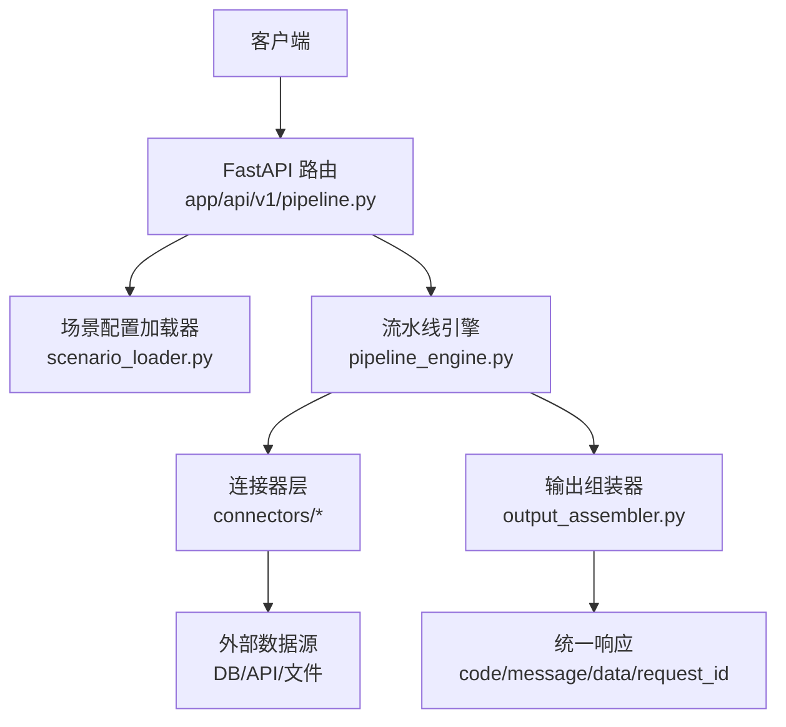
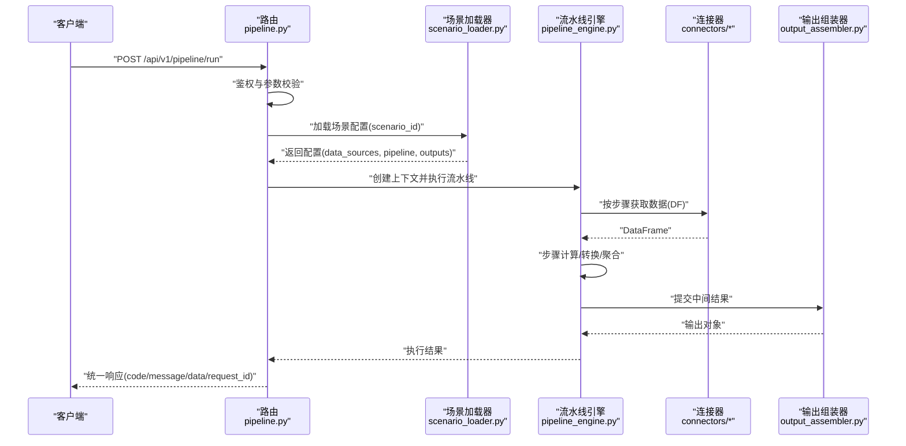
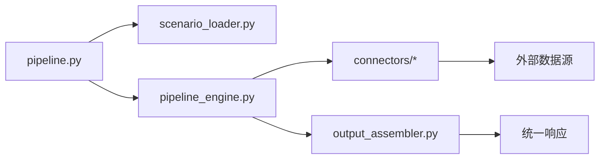

# Pipeline API 接口

<cite>
**本文引用的文件**
- [需求说明文档](file://docs\20260821100000_hiagent辅助Web服务_需求说明.md)
</cite>

## 目录
1. [简介](#简介)
2. [项目结构](#项目结构)
3. [核心组件](#核心组件)
4. [架构总览](#架构总览)
5. [详细组件分析](#详细组件分析)
6. [依赖关系分析](#依赖关系分析)
7. [性能与并发](#性能与并发)
8. [故障排查指南](#故障排查指南)
9. [结论](#结论)
10. [附录：API 规范示例](#附录api-规范示例)

## 简介
本文件面向“Pipeline API”的 POST /api/v1/pipeline/run 端点，提供从请求到响应的完整设计说明。该端点用于以场景驱动的方式一次性完成数据获取、处理流水线执行与输出组装，适用于需要端到端自动化处理的业务场景（如竞品分析、机构行为分析等）。与之相对的“原子 API”则适合细粒度、逐步编排的场景。

## 项目结构
根据需求文档，系统采用“场景驱动的流水线引擎”，关键新增目录与职责如下：
- app/core/pipeline_engine.py — 流水线引擎：负责步骤顺序执行、上下文传递、条件分支与错误处理
- app/core/scenario_loader.py — 场景配置加载器：解析 YAML 场景配置，构建 data_sources、pipeline、outputs
- app/core/connectors/ — 连接器层：统一数据库、API、文件等数据源接入，返回 DataFrame
- app/core/output_assembler.py — 输出组装器：生成 chart/table/report/file/summary 等输出
- app/scenarios/*.yaml — 场景配置文件：描述数据源、处理步骤与输出
- app/api/v1/pipeline.py — Pipeline 路由：暴露 /api/v1/pipeline/run 等接口

图表来源
- [需求说明文档:33-67](file://docs\20260821100000_hiagent辅助Web服务_需求说明.md#L33-L67)

章节来源
- [需求说明文档:106-114](file://docs\20260821100000_hiagent辅助Web服务_需求说明.md#L106-L114)

## 核心组件
- 场景配置模型（YAML）
  - data_sources：定义 connector 类型、连接参数、SQL/API 参数与请求参数映射
  - pipeline：步骤链，action 调用原子能力，通过命名引用传递中间数据
  - outputs：定义最终输出类型（chart/table/report/file/summary）及数据来源
- 连接器层（Connector Layer）
  - 支持 database、api、file_upload、file_url、file_s3 等类型
  - 凭据从环境变量读取，统一返回 DataFrame，便于后续处理
- 流水线引擎（Pipeline Engine）
  - 步骤顺序执行，使用 PipelineContext 在步骤间传递数据
  - 支持条件分支与步骤级错误处理（skip/abort）
  - 每步独立记录日志与耗时
- 输出组装器（Output Assembler）
  - 将中间结果渲染为 chart/table/report/file/summary
  - summary 专为 Agent 消费设计

章节来源
- [需求说明文档:40-67](file://docs\20260821100000_hiagent辅助Web服务_需求说明.md#L40-L67)

## 架构总览
Pipeline API 的请求进入 FastAPI 路由后，依次完成：
1. 鉴权（X-API-Key）
2. 校验请求体（scenario_id、parameters、options）
3. 加载场景配置（YAML），解析 data_sources、pipeline、outputs
4. 初始化 PipelineContext，按步骤执行流水线
5. 通过连接器获取数据并转换为 DataFrame
6. 执行步骤逻辑，产出中间结果
7. 组装最终输出（chart/table/report/file/summary）
8. 返回统一 JSON 响应（code/message/data/request_id）

图表来源
- [需求说明文档:33-67](file://docs\20260821100000_hiagent辅助Web服务_需求说明.md#L33-L67)

## 详细组件分析

### 端点：POST /api/v1/pipeline/run
- 功能：传入 scenario_id + parameters + options，一次完成全流程（数据获取、处理、输出）
- 适用场景：端到端自动化分析任务，减少上层编排复杂度
- 对比原子 API：原子 API（/api/v1/data/*、/api/v1/visual/* 等）适合细粒度、逐步编排；Pipeline API 适合整流程封装

章节来源
- [需求说明文档:65-67](file://docs\20260821100000_hiagent辅助Web服务_需求说明.md#L65-L67)

#### 请求参数
- scenario_id（必填）：场景标识，用于定位 YAML 场景配置
- parameters（可选）：运行时参数，用于替换 SQL/API 参数或步骤输入
- options（可选）：执行选项，如超时、重试策略、是否跳过某步骤等

章节来源
- [需求说明文档:40-44](file://docs\20260821100000_hiagent辅助Web服务_需求说明.md#L40-L44)

#### 响应格式
- code：状态码，按模块分段（通用/数据处理/可视化/文件/编排/Pipeline 引擎）
- message：人类可读的消息
- data：业务数据（例如输出对象、统计信息、文件链接等）
- request_id：请求追踪 ID，便于日志与可观测性

章节来源
- [需求说明文档:25-29](file://docs\20260821100000_hiagent辅助Web服务_需求说明.md#L25-L29)

#### 错误处理机制
- 统一错误码分段：1xxx 通用、2xxx 数据处理、3xxx 可视化、4xxx 文件文档、5xxx API 编排、6xxx Pipeline 引擎
- 步骤级错误处理：支持 skip（跳过当前步骤继续执行）与 abort（终止流水线）
- 可观测性：结构化日志包含 scenario_id 与步骤耗时

章节来源
- [需求说明文档:25-29](file://docs\20260821100000_hiagent辅助Web服务_需求说明.md#L25-L29)
- [需求说明文档:57-60](file://docs\20260821100000_hiagent辅助Web服务_需求说明.md#L57-L60)
- [需求说明文档:99-101](file://docs\20260821100000_hiagent辅助Web服务_需求说明.md#L99-L101)

#### 场景配置加载过程
- 通过 scenario_id 定位 YAML 配置
- 解析 data_sources：connector 类型、连接配置、SQL/API 参数、请求参数映射
- 解析 pipeline：步骤链、action、input/output 命名引用
- 解析 outputs：输出类型与数据来源

章节来源
- [需求说明文档:40-44](file://docs\20260821100000_hiagent辅助Web服务_需求说明.md#L40-L44)

#### 流水线执行流程
- 初始化 PipelineContext
- 按步骤顺序执行，通过命名引用传递中间数据
- 支持条件分支与步骤级错误处理（skip/abort）
- 每步记录日志与耗时

章节来源
- [需求说明文档:57-60](file://docs\20260821100000_hiagent辅助Web服务_需求说明.md#L57-L60)

#### 中间状态管理
- 使用 PipelineContext 在步骤间共享数据
- 中间结果为 DataFrame，便于后续步骤复用
- 步骤级日志与耗时便于问题定位

章节来源
- [需求说明文档:57-60](file://docs\20260821100000_hiagent辅助Web服务_需求说明.md#L57-L60)

#### 成功与失败示例（概念性）
- 成功：返回 code=0（或对应成功码）、message="success"、data 包含输出对象或文件链接、request_id 唯一
- 失败：返回对应错误码段（如 6xxx Pipeline 引擎错误）、message 描述错误原因、data 可为空或包含诊断信息、request_id 唯一

章节来源
- [需求说明文档:25-29](file://docs\20260821100000_hiagent辅助Web服务_需求说明.md#L25-L29)

### 与原子 API 的区别与适用场景
- Pipeline API：适合端到端自动化任务，减少上层编排复杂度；一次请求完成全流程
- 原子 API：适合细粒度、逐步编排；由 Agent 自行组合多个原子能力

章节来源
- [需求说明文档:65-67](file://docs\20260821100000_hiagent辅助Web服务_需求说明.md#L65-L67)

## 依赖关系分析
- 路由依赖场景加载器与流水线引擎
- 引擎依赖连接器层与输出组装器
- 连接器依赖外部数据源（数据库、REST API、文件存储）
- 输出组装器依赖中间结果（DataFrame）

图表来源
- [需求说明文档:106-114](file://docs\20260821100000_hiagent辅助Web服务_需求说明.md#L106-L114)

章节来源
- [需求说明文档:106-114](file://docs\20260821100000_hiagent辅助Web服务_需求说明.md#L106-L114)

## 性能与并发
- 性能目标：简单接口 < 500ms，数据处理 < 3s，Pipeline 全流程 < 10s
- 建议优化：
  - 合理设置超时与重试策略（options）
  - 使用 DuckDB 进行高效查询与聚合
  - 避免不必要的中间数据拷贝，尽量复用 DataFrame
  - 对 IO 密集型步骤启用异步或并发控制
  - 监控步骤耗时与错误率，及时定位瓶颈

章节来源
- [需求说明文档:99-101](file://docs\20260821100000_hiagent辅助Web服务_需求说明.md#L99-L101)

## 故障排查指南
- 检查 X-API-Key 是否正确
- 确认 scenario_id 是否存在且配置有效
- 查看步骤级日志与耗时，定位具体失败步骤
- 核对 parameters 与 options 是否符合场景要求
- 若为连接器错误，检查凭据与环境变量配置
- 若为输出组装错误，检查输出类型与数据来源

章节来源
- [需求说明文档:25-29](file://docs\20260821100000_hiagent辅助Web服务_需求说明.md#L25-L29)
- [需求说明文档:57-60](file://docs\20260821100000_hiagent辅助Web服务_需求说明.md#L57-L60)
- [需求说明文档:99-101](file://docs\20260821100000_hiagent辅助Web服务_需求说明.md#L99-L101)

## 结论
POST /api/v1/pipeline/run 提供了以场景驱动的一次性端到端处理能力，结合 YAML 配置、连接器层与输出组装器，能够灵活支撑多种业务分析场景。通过统一的错误码、结构化日志与可观测性指标，便于运维与排障。对于复杂编排需求，仍可使用原子 API 进行细粒度组合。

## 附录：API 规范示例
以下为概念性示例，实际字段与值需依据实现与场景配置确定：

- 请求示例（成功）
  - URL: POST /api/v1/pipeline/run
  - Header: X-API-Key: your_api_key
  - Body:
    - scenario_id: "competitor_analysis"
    - parameters: {"start_date": "2024-01-01", "end_date": "2024-12-31"}
    - options: {"timeout_seconds": 30, "retry_times": 2}

- 响应示例（成功）
  - code: 0
  - message: "success"
  - data: {
      "request_id": "req_abc123",
      "outputs": {
        "summary": "...",
        "chart": "https://.../chart.png",
        "table": "https://.../table.csv"
      }
    }

- 请求示例（失败）
  - scenario_id 不存在或参数不合法

- 响应示例（失败）
  - code: 6001（示例：Pipeline 引擎错误）
  - message: "场景配置加载失败"
  - data: null
  - request_id: "req_def456"

章节来源
- [需求说明文档:25-29](file://docs\20260821100000_hiagent辅助Web服务_需求说明.md#L25-L29)
- [需求说明文档:40-44](file://docs\20260821100000_hiagent辅助Web服务_需求说明.md#L40-L44)
- [需求说明文档:65-67](file://docs\20260821100000_hiagent辅助Web服务_需求说明.md#L65-L67)