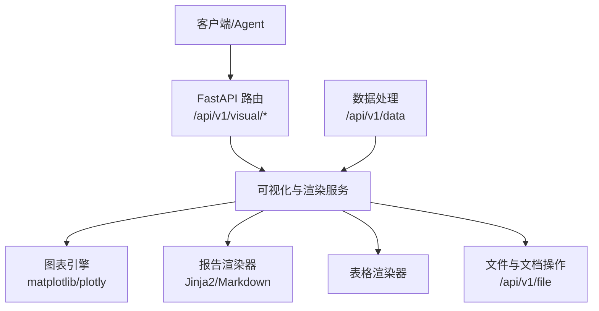
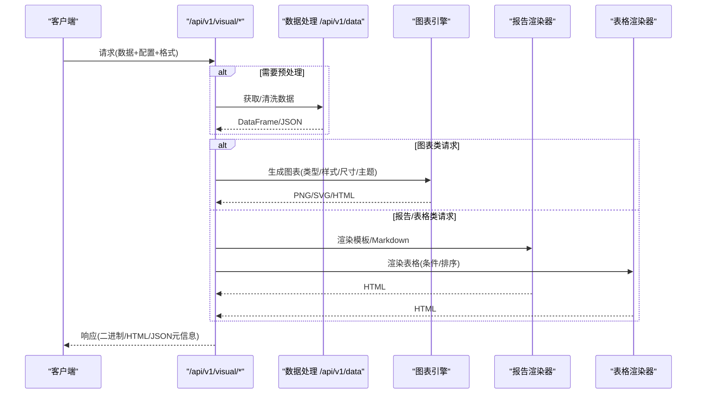
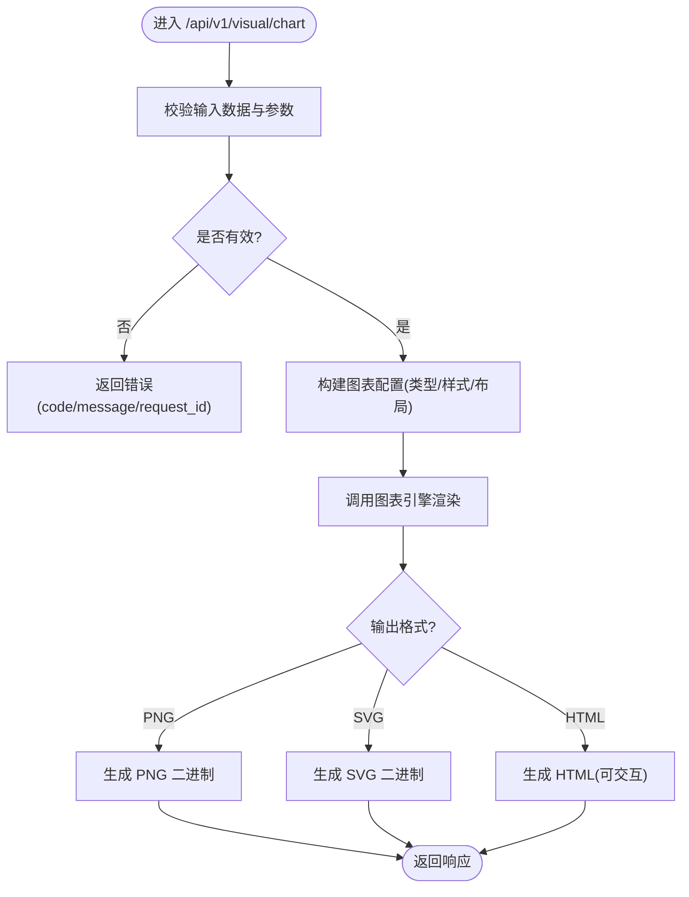
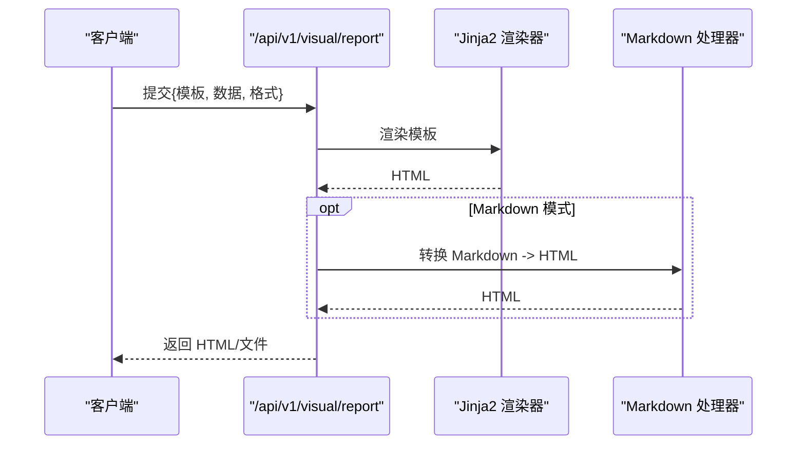
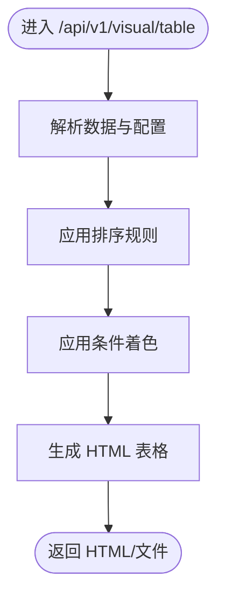
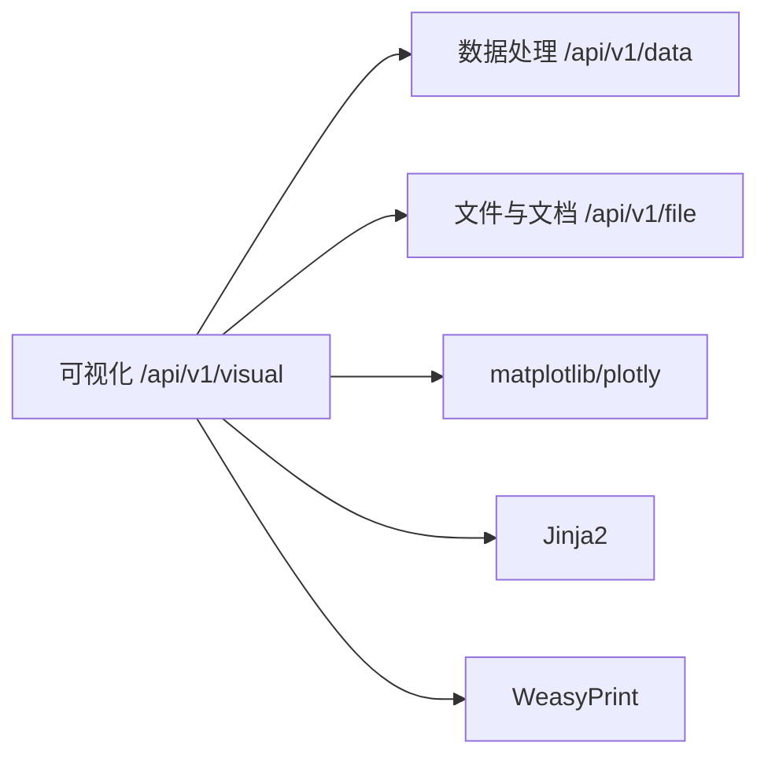

# 可视化 API

<cite>
**本文引用的文件**
- [需求说明文档](file://docs\20260821100000_hiagent辅助Web服务_需求说明.md)
</cite>

## 目录
1. [简介](#简介)
2. [项目结构](#项目结构)
3. [核心组件](#核心组件)
4. [架构总览](#架构总览)
5. [详细组件分析](#详细组件分析)
6. [依赖关系分析](#依赖关系分析)
7. [性能考虑](#性能考虑)
8. [故障排查指南](#故障排查指南)
9. [结论](#结论)
10. [附录](#附录)

## 简介
本章节面向 /api/v1/visual/* 下的可视化与渲染能力，涵盖图表生成（柱状图、折线图、饼图、散点图、热力图、雷达图等）、报告渲染（Jinja2 HTML 模板、Markdown 转 HTML）以及数据表格渲染（条件着色、排序）。该模块基于 FastAPI 提供原子接口，支持 PNG/SVG/HTML 多种输出格式，并与数据处理、文件与文档操作等模块协同工作。

## 项目结构
根据需求说明，可视化与渲染属于“原子 API”之一，位于 /api/v1/visual/*。整体系统采用“Pipeline + 原子 API”双模式：Pipeline 用于端到端场景编排，原子 API 用于逐步调用与灵活组合。可视化模块作为原子能力被 Pipeline 复用，也可独立使用。

图示来源
- [需求说明文档:71-83](file://docs\20260821100000_hiagent辅助Web服务_需求说明.md#L71-L83)

章节来源
- [需求说明文档:71-83](file://docs\20260821100000_hiagent辅助Web服务_需求说明.md#L71-L83)

## 核心组件
- 图表引擎：负责将结构化数据转换为可视化图形，支持多种图表类型与输出格式。
- 报告渲染器：基于 Jinja2 的 HTML 模板渲染，支持 Markdown 转 HTML。
- 表格渲染器：对数据进行格式化展示，支持条件着色与排序。
- 输出组装器：统一封装 chart/table/report/file/summary 等输出类型，供 Pipeline 或原子 API 消费。

章节来源
- [需求说明文档:62-68](file://docs\20260821100000_hiagent辅助Web服务_需求说明.md#L62-L68)
- [需求说明文档:79-82](file://docs\20260821100000_hiagent辅助Web服务_需求说明.md#L79-L82)

## 架构总览
可视化模块在系统中承担“数据到视觉表达”的转换职责，既可作为独立原子接口被调用，也可嵌入 Pipeline 流程中与其他步骤协作。其输入通常来自数据处理模块（DataFrame/JSON），输出为图片（PNG/SVG）或可交互页面（HTML）。

图示来源
- [需求说明文档:71-83](file://docs\20260821100000_hiagent辅助Web服务_需求说明.md#L71-L83)

## 详细组件分析

### 图表生成（柱状图/折线图/饼图/散点图/热力图/雷达图）
- 能力范围
  - 支持的图表类型：柱状图、折线图、饼图、散点图、热力图、雷达图等。
  - 输出格式：PNG、SVG、HTML（交互式）。
  - 技术栈：matplotlib/plotly。
- 典型配置项（概念性说明）
  - 数据源：字段映射（x/y/分组/颜色/标签等）。
  - 样式：主题、配色、字体、图例、网格线、坐标轴刻度与范围。
  - 布局：画布尺寸、边距、多子图排列。
  - 交互（HTML）：缩放、悬停提示、筛选。
- 处理流程
  - 接收请求参数（图表类型、数据、样式、输出格式）。
  - 校验数据与参数。
  - 调用图表引擎生成图像或 HTML。
  - 返回二进制或 HTML 内容，附带元信息（如 request_id）。
- 错误处理
  - 数据缺失/类型不匹配时返回明确错误码与消息。
  - 渲染失败时记录日志并返回友好错误。

图示来源
- [需求说明文档:79-82](file://docs\20260821100000_hiagent辅助Web服务_需求说明.md#L79-L82)

章节来源
- [需求说明文档:79-82](file://docs\20260821100000_hiagent辅助Web服务_需求说明.md#L79-L82)

### 报告渲染（Jinja2 HTML 模板、Markdown 转 HTML）
- 能力范围
  - 基于 Jinja2 的 HTML 模板渲染，支持变量注入、循环、条件分支。
  - Markdown 转 HTML，便于快速生成轻量报告。
- 典型配置项（概念性说明）
  - 模板路径/名称、上下文数据、过滤器、局部片段复用。
  - 资源引用（CSS/JS/图片）与相对路径策略。
- 处理流程
  - 加载模板与上下文数据。
  - 渲染 HTML 字符串。
  - 可选地结合 WeasyPrint 生成 PDF（通过文件与文档操作模块）。
  - 返回 HTML 或文件流。
- 错误处理
  - 模板不存在/语法错误时返回明确错误。
  - 资源加载失败时降级或报错。

图示来源
- [需求说明文档:79-82](file://docs\20260821100000_hiagent辅助Web服务_需求说明.md#L79-L82)

章节来源
- [需求说明文档:79-82](file://docs\20260821100000_hiagent辅助Web服务_需求说明.md#L79-L82)

### 表格渲染（条件着色、排序）
- 能力范围
  - 将结构化数据渲染为 HTML 表格，支持按列排序、条件着色（阈值/区间/分类）。
- 典型配置项（概念性说明）
  - 列定义（标题、类型、格式化规则）。
  - 排序键与方向。
  - 条件规则（高亮、图标、进度条等）。
- 处理流程
  - 解析数据与渲染配置。
  - 应用排序与条件规则。
  - 生成 HTML 表格片段或完整页面。
  - 返回 HTML 或文件。
- 错误处理
  - 列名不存在/类型不匹配时返回错误。
  - 条件表达式非法时返回错误。

图示来源
- [需求说明文档:79-82](file://docs\20260821100000_hiagent辅助Web服务_需求说明.md#L79-L82)

章节来源
- [需求说明文档:79-82](file://docs\20260821100000_hiagent辅助Web服务_需求说明.md#L79-L82)

### 模板系统与自定义样式
- 模板系统
  - 使用 Jinja2 进行 HTML 模板渲染，支持变量、控制流、宏与继承。
  - 可通过环境变量或配置中心管理模板路径与缓存策略。
- 自定义样式
  - 支持注入 CSS/JS 以定制外观与交互。
  - 图表主题与配色可通过配置覆盖默认样式。
- 响应式设计考虑
  - HTML 输出建议采用响应式布局（媒体查询、弹性布局），适配移动端与不同屏幕尺寸。
  - 图表 HTML（如 plotly）自带交互缩放，适合多端查看。

章节来源
- [需求说明文档:79-82](file://docs\20260821100000_hiagent辅助Web服务_需求说明.md#L79-L82)

### 输出格式与下载
- 支持格式
  - PNG：位图，适合静态展示与打印。
  - SVG：矢量图，适合缩放与二次编辑。
  - HTML：可交互页面，适合在线查看与嵌入。
- 下载策略
  - 大文件建议使用流式传输与临时文件管理（由 /api/v1/file 模块支持）。
  - 响应头设置合适的 Content-Type 与 Content-Disposition。

章节来源
- [需求说明文档:79-82](file://docs\20260821100000_hiagent辅助Web服务_需求说明.md#L79-L82)

## 依赖关系分析
- 外部库
  - matplotlib/plotly：图表绘制与交互。
  - Jinja2：模板渲染。
  - WeasyPrint：HTML 转 PDF（通过文件与文档操作模块）。
- 内部模块
  - 数据处理 /api/v1/data：提供清洗后的结构化数据。
  - 文件与文档操作 /api/v1/file：文件上传/下载、格式转换、临时文件管理。
  - 输出组装器：统一封装 chart/table/report/file/summary。

图示来源
- [需求说明文档:71-83](file://docs\20260821100000_hiagent辅助Web服务_需求说明.md#L71-L83)

章节来源
- [需求说明文档:71-83](file://docs\20260821100000_hiagent辅助Web服务_需求说明.md#L71-L83)

## 性能考虑
- 目标性能
  - 简单接口 < 500ms，数据处理 < 3s，Pipeline 全流程 < 10s。
- 优化建议
  - 图表渲染
    - 大数据集下优先使用 SVG 或降采样；必要时分片渲染与合并。
    - 启用缓存（模板、主题、字体）以减少重复开销。
    - 合理设置画布尺寸与分辨率，避免过大图片导致带宽与内存压力。
  - 报告与表格
    - 分页与懒加载；仅渲染可见区域。
    - 条件着色规则尽量向量化计算，减少 Python 层循环。
  - 并发与资源
    - 使用异步 I/O 与连接池；限制并发度防止资源耗尽。
    - 大文件流式传输，及时释放临时文件。
  - 监控与可观测性
    - 记录步骤耗时与错误率；暴露 /health 与健康检查指标。

章节来源
- [需求说明文档:97-102](file://docs\20260821100000_hiagent辅助Web服务_需求说明.md#L97-L102)

## 故障排查指南
- 常见问题
  - 数据缺失或类型不匹配：检查上游数据处理结果与字段映射。
  - 模板渲染失败：核对模板语法与变量名；确认模板路径与权限。
  - 图表渲染异常：检查数据维度与图表类型是否匹配；调整样式与布局参数。
  - 大文件下载卡顿：确认流式传输与临时文件清理策略。
- 定位方法
  - 查看结构化日志（包含 scenario_id、步骤耗时）。
  - 使用 /health 检查服务状态。
  - 复现最小化请求，逐步缩小问题范围。

章节来源
- [需求说明文档:97-102](file://docs\20260821100000_hiagent辅助Web服务_需求说明.md#L97-L102)

## 结论
可视化 API 模块以原子能力形式提供图表生成、报告渲染与表格渲染，支持 PNG/SVG/HTML 多种输出格式，并通过 Pipeline 与数据处理、文件与文档操作等模块协同工作。遵循统一 JSON 响应规范与错误码分段，具备良好的可扩展性与可维护性。建议在实现阶段结合具体业务数据规模与交互需求，选择合适的图表类型与输出格式，并落实性能优化与监控措施。

## 附录
- 统一接口规范
  - 响应格式：code/message/data/request_id。
  - 认证：X-API-Key Header。
- 错误码分段
  - 1xxx 通用、2xxx 数据处理、3xxx 可视化、4xxx 文件文档、5xxx API 编排、6xxx Pipeline 引擎。

章节来源
- [需求说明文档:25-30](file://docs\20260821100000_hiagent辅助Web服务_需求说明.md#L25-L30)