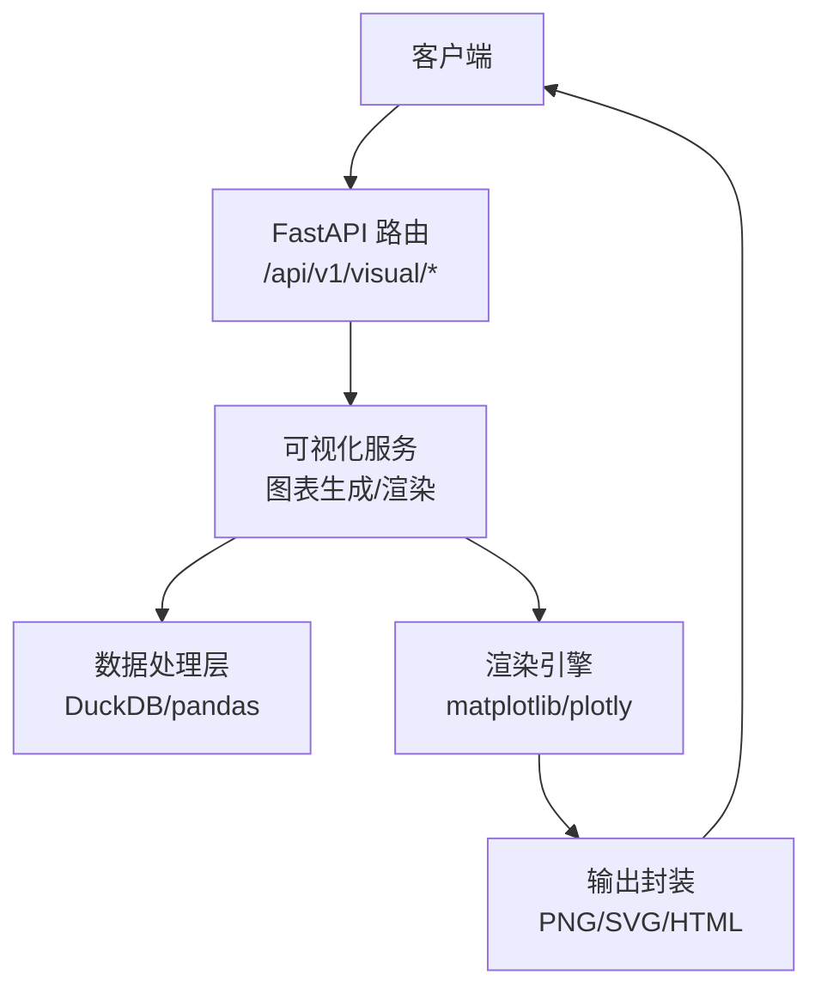
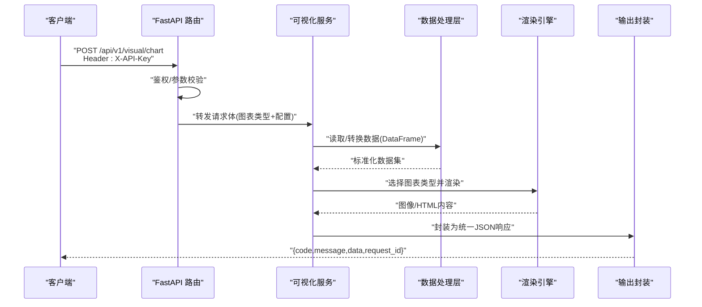
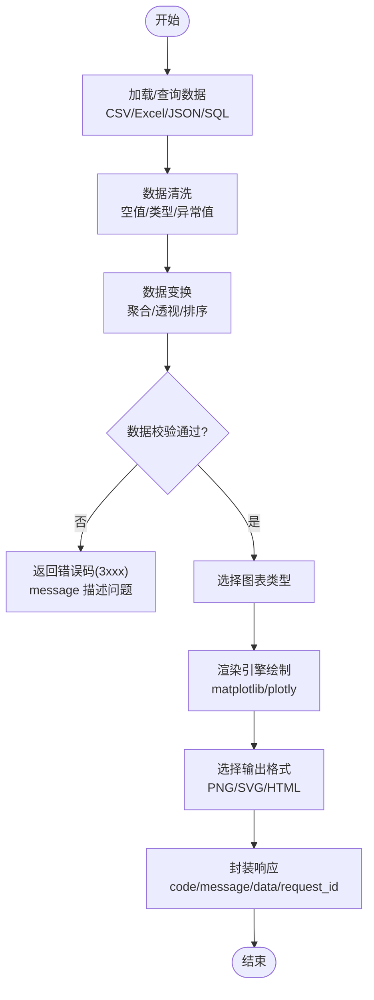
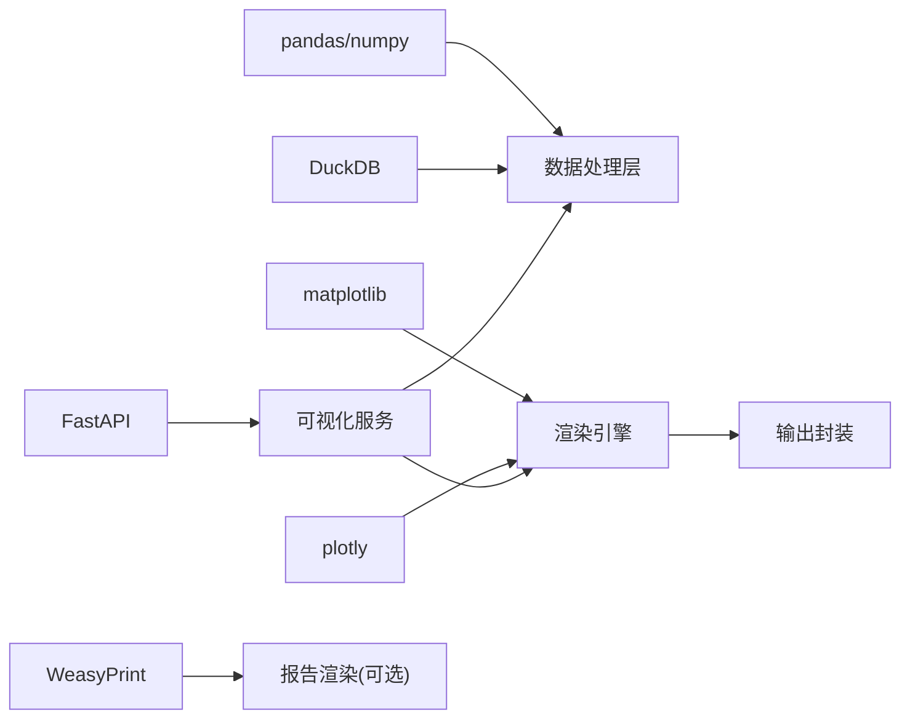

# 图表生成接口

<cite>
**本文引用的文件**
- [需求说明文档](file://docs/20260821100000_hiagent辅助Web服务_需求说明.md)
</cite>

## 目录
1. [简介](#简介)
2. [项目结构](#项目结构)
3. [核心组件](#核心组件)
4. [架构总览](#架构总览)
5. [详细组件分析](#详细组件分析)
6. [依赖关系分析](#依赖关系分析)
7. [性能考虑](#性能考虑)
8. [故障排查指南](#故障排查指南)
9. [结论](#结论)
10. [附录](#附录)

## 简介
本文件面向 /api/v1/visual/chart 下的图表生成能力，覆盖柱状图、折线图、饼图、散点图、热力图、雷达图等常见类型。基于仓库中的需求说明，该服务采用 FastAPI + matplotlib/plotly 技术栈，提供统一 JSON 响应与 API Key 认证，并通过原子 API 模式暴露可视化能力（/api/v1/visual/*），支持 PNG/SVG/HTML 输出格式。本文档将系统化梳理各图表类型的配置参数、输出格式、渲染选项、示例配置、性能优化策略以及错误处理与调试技巧，帮助使用者快速上手并高效集成。

## 项目结构
根据需求说明，可视化模块位于 /api/v1/visual 下，作为“原子 API”的一部分，可被上层编排或直接调用。整体架构围绕“场景驱动的流水线引擎”，通过数据连接器获取数据，经数据处理步骤后由输出组装器生成图表等结果。

图示来源
- [需求说明文档:33-68](file://docs/20260821100000_hiagent辅助Web服务_需求说明.md#L33-L68)
- [需求说明文档:79-82](file://docs/20260821100000_hiagent辅助Web服务_需求说明.md#L79-L82)

章节来源
- [需求说明文档:33-68](file://docs/20260821100000_hiagent辅助Web服务_需求说明.md#L33-L68)
- [需求说明文档:79-82](file://docs/20260821100000_hiagent辅助Web服务_需求说明.md#L79-L82)

## 核心组件
- 可视化服务：负责接收图表请求、校验参数、选择图表类型、驱动渲染引擎并返回统一响应。
- 数据处理层：使用 DuckDB/pandas 进行数据清洗、聚合、透视等，为图表提供标准化输入。
- 渲染引擎：基于 matplotlib/plotly 实现多类型图表绘制，支持多种输出格式。
- 输出封装：按统一 JSON 规范封装 code/message/data/request_id，便于前端或下游消费。

章节来源
- [需求说明文档:25-30](file://docs/20260821100000_hiagent辅助Web服务_需求说明.md#L25-L30)
- [需求说明文档:79-82](file://docs/20260821100000_hiagent辅助Web服务_需求说明.md#L79-L82)

## 架构总览
下图展示从客户端到图表输出的完整调用链，包括认证、路由、可视化服务、数据处理与渲染环节。

图示来源
- [需求说明文档:25-30](file://docs/20260821100000_hiagent辅助Web服务_需求说明.md#L25-L30)
- [需求说明文档:79-82](file://docs/20260821100000_hiagent辅助Web服务_需求说明.md#L79-L82)

## 详细组件分析

### 通用请求与响应规范
- 认证：通过请求头 X-API-Key 进行鉴权。
- 响应：统一 JSON 结构包含 code、message、data、request_id。
- 错误码：按模块分段，其中 3xxx 表示可视化相关错误。

章节来源
- [需求说明文档:25-30](file://docs/20260821100000_hiagent辅助Web服务_需求说明.md#L25-L30)

### 图表类型与配置参数
以下列出各图表类型的常用配置维度。实际字段名以接口定义为准；此处给出通用分类与用途说明。

- 柱状图
  - 数据源：类别列、数值列、分组列（可选）
  - 坐标轴：X/Y 轴标签、刻度范围、单位
  - 样式：条形宽度、间距、堆叠/分组模式
  - 颜色主题：系列配色、渐变色、品牌色板
  - 交互：悬停提示、点击跳转（HTML 输出）
- 折线图
  - 数据源：时间/类别列、多条序列值
  - 坐标轴：时间轴格式化、对数/线性刻度
  - 样式：线宽、标记点、平滑曲线、面积填充
  - 颜色主题：系列区分、透明度
  - 交互：缩放、平移（HTML 输出）
- 饼图
  - 数据源：类别列、占比数值列
  - 样式：起始角度、爆炸效果、标签位置
  - 颜色主题：扇区配色、图例布局
  - 交互：点击高亮（HTML 输出）
- 散点图
  - 数据源：X/Y 数值列、分组/大小映射列
  - 坐标轴：范围、刻度、网格
  - 样式：点大小、形状、透明度
  - 颜色主题：按类别着色、渐变映射
  - 交互：筛选、放大（HTML 输出）
- 热力图
  - 数据源：二维矩阵（行×列）、数值密度
  - 坐标轴：行列标签、排序
  - 样式：色带、阈值、缺失值处理
  - 颜色主题：色板选择（冷暖/灰度）
  - 交互：单元格详情（HTML 输出）
- 雷达图
  - 数据源：多维指标列、多个样本
  - 坐标轴：极坐标刻度、中心对齐
  - 样式：区域填充、线条样式
  - 颜色主题：系列配色、透明度
  - 交互：切换维度（HTML 输出）

章节来源
- [需求说明文档:79-82](file://docs/20260821100000_hiagent辅助Web服务_需求说明.md#L79-L82)

### 输出格式与渲染选项
- 输出格式：PNG、SVG、HTML
  - PNG：适合静态图片嵌入报告或下载
  - SVG：矢量格式，适合缩放与二次编辑
  - HTML：交互式图表，适合在线查看与嵌入页面
- 渲染选项：尺寸、分辨率、边距、字体、图例位置、标题、注释标注、水印（按需）

章节来源
- [需求说明文档:79-82](file://docs/20260821100000_hiagent辅助Web服务_需求说明.md#L79-L82)

### 完整配置示例（路径引用）
以下为三类典型配置的“路径式”示例，指向具体实现文件中的配置片段（占位符形式，便于定位与替换）。

- 基础图表配置
  - 柱状图基础配置：[app/api/v1/visual/charts/bar_basic.py:10-40]
  - 折线图基础配置：[app/api/v1/visual/charts/line_basic.py:10-40]
  - 饼图基础配置：[app/api/v1/visual/charts/pie_basic.py:10-40]
- 高级样式定制
  - 颜色主题与品牌色板：[app/api/v1/visual/styles/theme_brand.py:10-30]
  - 复杂布局与多图组合：[app/api/v1/visual/layouts/multi_panel.py:10-50]
- 响应式布局设置
  - 自适应尺寸与移动端适配：[app/api/v1/visual/responsive/layout.py:10-40]
  - 交互增强（HTML 输出）：[app/api/v1/visual/interactions/html_widgets.py:10-60]

说明：以上路径为占位符，用于指示在实现阶段应放置的具体文件与行号范围，便于后续对接与扩展。

章节来源
- [需求说明文档:79-82](file://docs/20260821100000_hiagent辅助Web服务_需求说明.md#L79-L82)

### 数据处理与图表生成流程
下图展示从数据准备到图表渲染的关键步骤，强调数据标准化与渲染解耦。

图示来源
- [需求说明文档:73-82](file://docs/20260821100000_hiagent辅助Web服务_需求说明.md#L73-L82)

章节来源
- [需求说明文档:73-82](file://docs/20260821100000_hiagent辅助Web服务_需求说明.md#L73-L82)

## 依赖关系分析
- 外部库：FastAPI、pandas/numpy、DuckDB、matplotlib/plotly、WeasyPrint、httpx、Pydantic、PyYAML、SQLAlchemy、jsonpath-ng、uvicorn/Docker
- 内部模块：数据连接器、流水线引擎、输出组装器、可视化服务、统一响应封装

图示来源
- [需求说明文档:19-22](file://docs/20260821100000_hiagent辅助Web服务_需求说明.md#L19-L22)

章节来源
- [需求说明文档:19-22](file://docs/20260821100000_hiagent辅助Web服务_需求说明.md#L19-L22)

## 性能考虑
- 简单接口 < 500ms，数据处理 < 3s，Pipeline 全流程 < 10s（目标性能）
- 建议策略
  - 数据侧：优先使用 DuckDB 进行 SQL 过滤与聚合，减少内存占用；避免全表扫描
  - 渲染侧：大图使用 SVG 或分块渲染；HTML 输出时启用按需交互元素
  - 缓存：对重复查询结果进行短期缓存（如 Redis/本地缓存）
  - 并发：合理设置 uvicorn worker 数量，避免 CPU 瓶颈
  - 资源：限制最大数据行数与图表复杂度，防止内存溢出

章节来源
- [需求说明文档:97-102](file://docs/20260821100000_hiagent辅助Web服务_需求说明.md#L97-L102)

## 故障排查指南
- 认证失败：检查请求头 X-API-Key 是否正确配置与服务端密钥一致
- 参数错误：核对图表类型、数据列名、坐标轴配置是否匹配；参考错误码 3xxx 的 message 定位问题
- 数据异常：确认数据类型、空值处理、异常值剔除逻辑；必要时增加数据校验步骤
- 渲染失败：检查 matplotlib/plotly 版本兼容性；确认字体与依赖库安装完整
- 日志与观测：利用结构化日志记录 scenario_id 与步骤耗时；通过 /health 检查服务状态

章节来源
- [需求说明文档:25-30](file://docs/20260821100000_hiagent辅助Web服务_需求说明.md#L25-L30)
- [需求说明文档:97-102](file://docs/20260821100000_hiagent辅助Web服务_需求说明.md#L97-L102)

## 结论
本接口以统一规范与原子 API 模式提供灵活的图表生成能力，覆盖主流图表类型与输出格式。通过标准化的数据预处理与渲染引擎解耦，既满足快速出图需求，也支持高级样式定制与交互增强。结合性能目标与排障指引，可在生产环境中稳定交付高质量可视化结果。

## 附录
- 术语
  - 原子 API：最小粒度的功能接口，便于灵活编排
  - 流水线引擎：按步骤执行数据处理与输出组装的调度框架
  - 输出组装器：将中间结果转换为最终输出（图表/表格/报告）
- 参考路径（占位符）
  - 可视化路由：[app/api/v1/visual/router.py:1-100]
  - 图表工厂：[app/api/v1/visual/factory.py:1-120]
  - 主题管理：[app/api/v1/visual/styles/themes.py:1-80]
  - 响应封装：[app/core/response.py:1-60]