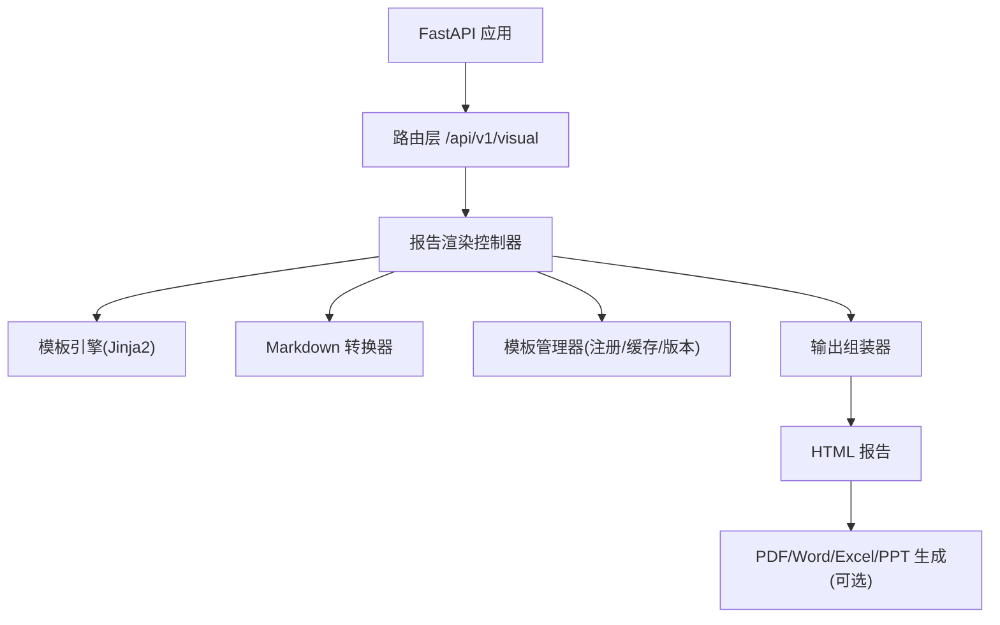
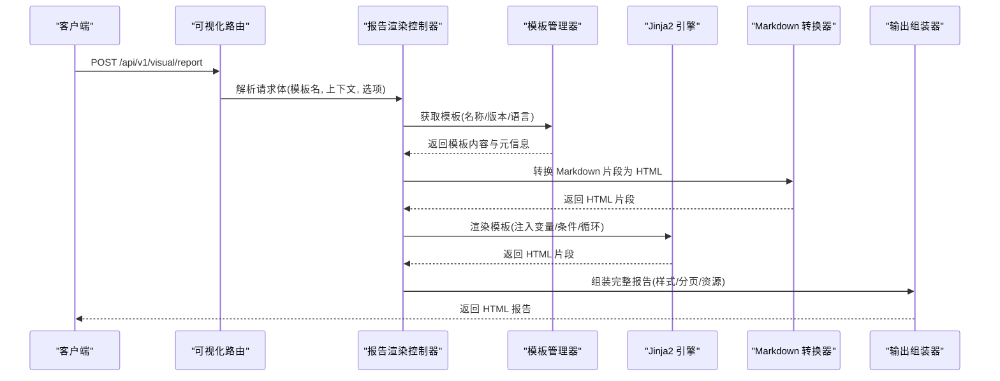
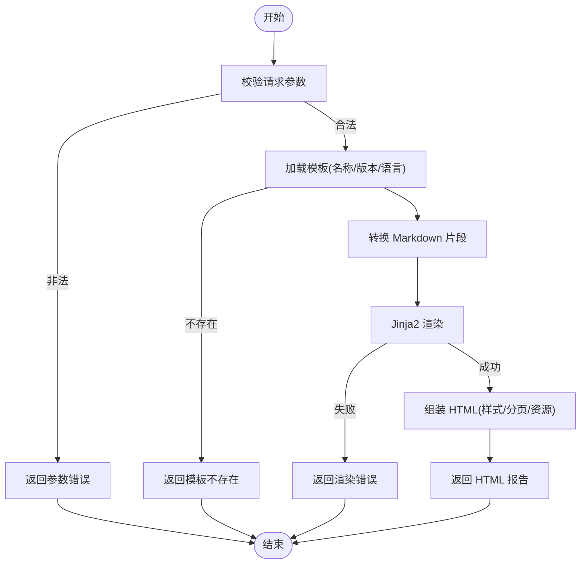
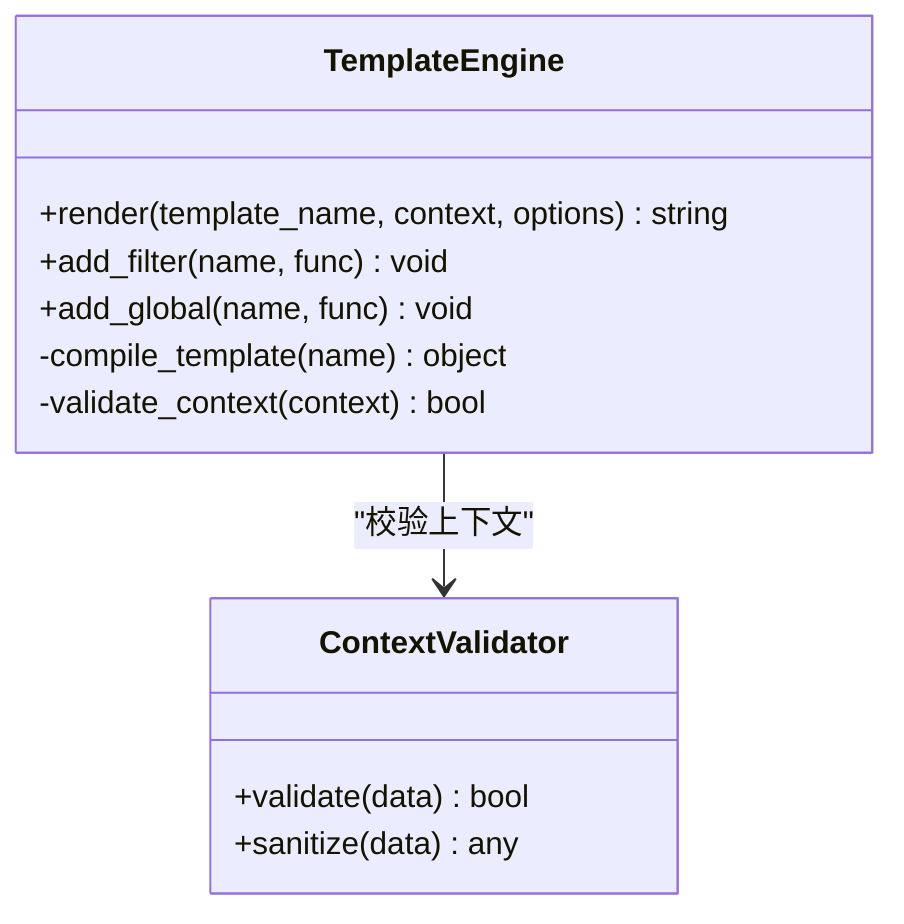
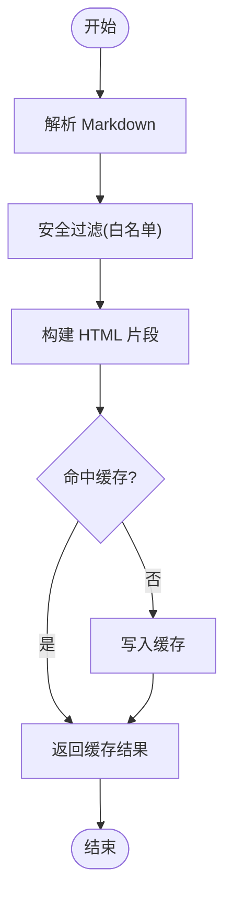
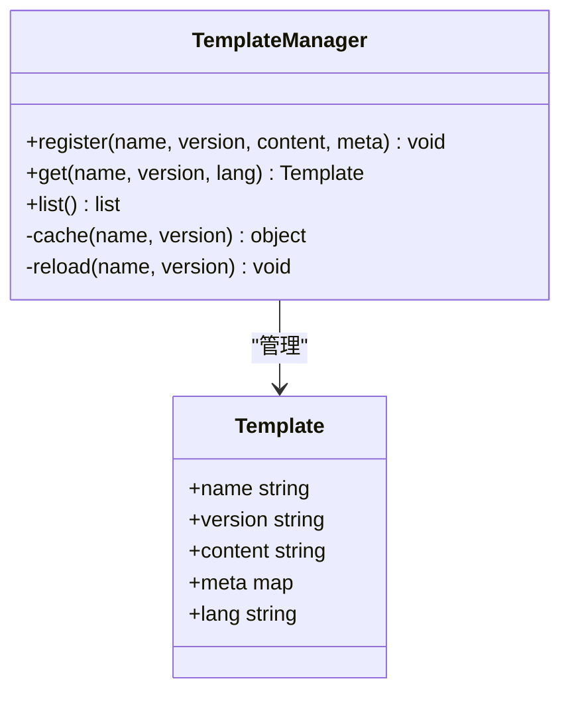
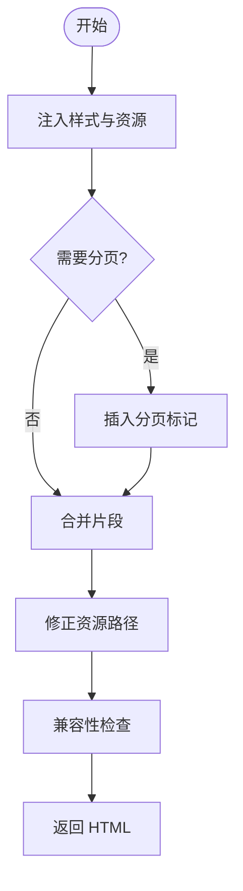
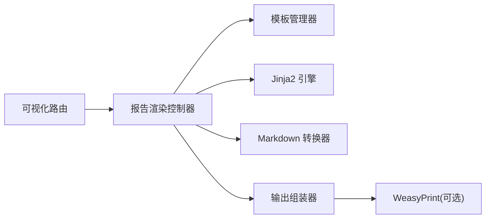

# 报告渲染接口

<cite>
**本文引用的文件**
- [需求说明.md](file://docs/20260821100000_hiagent辅助Web服务_需求说明.md)
</cite>

## 目录
1. [简介](#简介)
2. [项目结构](#项目结构)
3. [核心组件](#核心组件)
4. [架构总览](#架构总览)
5. [详细组件分析](#详细组件分析)
6. [依赖关系分析](#依赖关系分析)
7. [性能考虑](#性能考虑)
8. [故障排查指南](#故障排查指南)
9. [结论](#结论)
10. [附录](#附录)

## 简介
本章节面向 /api/v1/visual/report 下的“报告渲染”能力，围绕 Jinja2 HTML 模板渲染、Markdown 转 HTML、报告模板管理等主题进行系统化说明。该能力属于可视化与渲染模块的一部分，用于将结构化数据注入到模板中，生成可阅读、可打印的报告内容（HTML），并可进一步通过文档生成链路输出 PDF/Word/Excel/PPT 等格式。

- 目标读者：API 使用者、模板开发者、集成方工程师。
- 关键特性：Jinja2 模板变量注入、条件渲染、循环渲染、Markdown 转 HTML、模板管理、样式定制、分页与大文档优化、多语言支持。

## 项目结构
当前仓库以需求文档为主，未包含实现代码。以下结构为基于需求的推荐组织方式，便于后续落地实施。

说明
- 路由层负责接收请求参数（模板名、上下文数据、渲染选项）。
- 模板引擎负责解析并渲染 Jinja2 模板。
- Markdown 转换器负责将 Markdown 文本转为 HTML，以便嵌入报告。
- 模板管理器负责模板的加载、缓存、版本控制与多语言切换。
- 输出组装器负责拼装最终 HTML，并支持分页、样式注入、资源引用等。
- 可选的文档生成链路可将 HTML 转换为 PDF/Word/Excel/PPT。

[本节为概念性结构说明，不直接分析具体文件]

## 核心组件
- 报告渲染控制器
  - 职责：校验入参、选择模板、准备上下文、调用模板引擎、处理 Markdown、组装响应。
  - 关键点：错误码统一、超时控制、日志记录、安全过滤。
- 模板引擎（Jinja2）
  - 职责：加载模板、渲染变量、执行条件与循环、扩展过滤器与全局函数。
  - 关键点：沙箱化执行、模板缓存、国际化插值。
- Markdown 转换器
  - 职责：将 Markdown 文本转换为 HTML，支持表格、列表、链接、图片等。
  - 关键点：安全白名单、样式兼容、性能优化。
- 模板管理器
  - 职责：模板注册、版本管理、多语言切换、缓存策略。
  - 关键点：热更新、回滚机制、命名空间隔离。
- 输出组装器
  - 职责：合并多个片段、注入样式、分页处理、资源路径修正。
  - 关键点：流式拼接、内存占用控制、兼容性检查。

**章节来源**
- [需求说明.md:79-82](file://docs/20260821100000_hiagent辅助Web服务_需求说明.md#L79-L82)

## 架构总览
报告渲染的整体流程如下：客户端请求进入可视化路由，控制器根据模板名和上下文数据调用模板引擎进行渲染；若上下文包含 Markdown 片段，则先转换为 HTML 再注入模板；最终输出 HTML 报告，并可继续流转至文档生成环节。

**图表来源**
- [需求说明.md:79-82](file://docs/20260821100000_hiagent辅助Web服务_需求说明.md#L79-L82)

**章节来源**
- [需求说明.md:79-82](file://docs/20260821100000_hiagent辅助Web服务_需求说明.md#L79-L82)

## 详细组件分析

### 报告渲染控制器
- 输入参数
  - 模板名：字符串，唯一标识模板。
  - 上下文数据：JSON 对象，包含变量、列表、嵌套结构等。
  - 渲染选项：布尔或枚举，如是否启用 Markdown、是否分页、语言代码等。
- 处理逻辑
  - 校验参数合法性，缺失必填项返回错误。
  - 从模板管理器获取模板内容。
  - 对上下文中的 Markdown 字段进行转换。
  - 调用 Jinja2 引擎渲染，捕获异常并返回统一错误码。
  - 组装最终 HTML，附加元信息与请求 ID。
- 错误处理
  - 模板不存在：返回对应错误码。
  - 渲染失败：返回错误码与简要原因。
  - 超时/内存超限：中断并返回错误。

**图表来源**
- [需求说明.md:79-82](file://docs/20260821100000_hiagent辅助Web服务_需求说明.md#L79-L82)

**章节来源**
- [需求说明.md:79-82](file://docs/20260821100000_hiagent辅助Web服务_需求说明.md#L79-L82)

### 模板引擎（Jinja2）
- 变量注入
  - 支持标量、对象、数组、嵌套结构。
  - 提供常用过滤器（日期格式化、数值格式化、字符串处理）。
- 条件渲染
  - if/elif/else 分支控制显示逻辑。
- 循环渲染
  - for 循环遍历列表，支持索引、逆序、空集合处理。
- 安全与沙箱
  - 限制危险操作，仅允许白名单函数与过滤器。
- 性能优化
  - 模板编译缓存、片段复用、惰性求值。

**图表来源**
- [需求说明.md:79-82](file://docs/20260821100000_hiagent辅助Web服务_需求说明.md#L79-L82)

**章节来源**
- [需求说明.md:79-82](file://docs/20260821100000_hiagent辅助Web服务_需求说明.md#L79-L82)

### Markdown 转换器
- 功能范围
  - 标题、段落、列表、表格、链接、图片、代码块、引用等。
- 安全策略
  - 白名单标签与属性，移除脚本与事件处理器。
- 样式兼容
  - 输出标准 HTML 片段，适配报告样式表。
- 性能优化
  - 增量转换、缓存已转换片段、限制最大长度。

**图表来源**
- [需求说明.md:79-82](file://docs/20260821100000_hiagent辅助Web服务_需求说明.md#L79-L82)

**章节来源**
- [需求说明.md:79-82](file://docs/20260821100000_hiagent辅助Web服务_需求说明.md#L79-L82)

### 模板管理器
- 模板注册
  - 按命名空间注册模板，支持版本化。
- 缓存策略
  - 首次加载编译并缓存，支持热更新与回滚。
- 多语言支持
  - 按语言代码选择模板或翻译键值。
- 生命周期
  - 启动时预加载常用模板，运行时按需加载。

**图表来源**
- [需求说明.md:79-82](file://docs/20260821100000_hiagent辅助Web服务_需求说明.md#L79-L82)

**章节来源**
- [需求说明.md:79-82](file://docs/20260821100000_hiagent辅助Web服务_需求说明.md#L79-L82)

### 输出组装器
- 样式注入
  - 自动注入 CSS 与字体资源，确保跨环境一致。
- 分页处理
  - 按页大小拆分长文档，插入分页标记。
- 资源路径修正
  - 相对路径转绝对路径，保证离线可读。
- 兼容性检查
  - 检测浏览器/阅读器支持，降级处理。

**图表来源**
- [需求说明.md:79-82](file://docs/20260821100000_hiagent辅助Web服务_需求说明.md#L79-L82)

**章节来源**
- [需求说明.md:79-82](file://docs/20260821100000_hiagent辅助Web服务_需求说明.md#L79-L82)

## 依赖关系分析
- 外部依赖
  - FastAPI：路由与请求处理。
  - Jinja2：模板渲染。
  - Markdown 库：Markdown 转 HTML。
  - WeasyPrint（可选）：HTML 转 PDF。
- 内部依赖
  - 模板管理器：模板加载与缓存。
  - 输出组装器：样式与分页。
  - 错误码体系：统一错误响应。

**图表来源**
- [需求说明.md:79-82](file://docs/20260821100000_hiagent辅助Web服务_需求说明.md#L79-L82)

**章节来源**
- [需求说明.md:79-82](file://docs/20260821100000_hiagent辅助Web服务_需求说明.md#L79-L82)

## 性能考虑
- 模板缓存
  - 编译后的模板常驻内存，减少重复开销。
- 大文档优化
  - 分块渲染与流式拼接，避免一次性构建超大字符串。
  - 分页渲染，降低单次内存峰值。
- Markdown 转换优化
  - 片段级缓存，避免重复转换相同内容。
- 资源加载优化
  - 内联关键 CSS，延迟加载非关键资源。
- 并发与限流
  - 限制同时渲染任务数，防止资源耗尽。

[本节为通用性能建议，不直接分析具体文件]

## 故障排查指南
- 常见问题
  - 模板不存在：检查模板名与版本是否正确。
  - 渲染失败：查看上下文数据结构是否符合模板期望。
  - Markdown 转换异常：检查语法与白名单限制。
  - 样式错乱：确认样式注入顺序与资源路径。
  - 分页异常：调整页大小与分页标记位置。
- 诊断步骤
  - 开启调试日志，记录模板名、上下文摘要、错误堆栈。
  - 使用最小上下文复现问题，逐步缩小范围。
  - 检查缓存状态，必要时强制刷新模板缓存。
- 错误码参考
  - 遵循统一 JSON 响应格式（code/message/data/request_id）。
  - 可视化模块错误码段：3xxx。

**章节来源**
- [需求说明.md:25-30](file://docs/20260821100000_hiagent辅助Web服务_需求说明.md#L25-L30)
- [需求说明.md:79-82](file://docs/20260821100000_hiagent辅助Web服务_需求说明.md#L79-L82)

## 结论
报告渲染接口以 Jinja2 模板为核心，结合 Markdown 转换与模板管理，提供灵活、可扩展的报告生成能力。通过统一的错误码、缓存策略与分页优化，可在保证性能与安全的前提下，满足多种业务场景的报告输出需求。后续可按需接入 PDF/Word/Excel/PPT 生成链路，形成完整的文档生产闭环。

[本节为总结性内容，不直接分析具体文件]

## 附录

### 模板语法与示例
- 变量注入
  - 在模板中使用变量占位符，由上下文数据填充。
  - 示例路径：[模板变量用法:79-82](file://docs/20260821100000_hiagent辅助Web服务_需求说明.md#L79-L82)
- 条件渲染
  - 使用 if/elif/else 控制不同分支的显示。
  - 示例路径：[条件渲染示例:79-82](file://docs/20260821100000_hiagent辅助Web服务_需求说明.md#L79-L82)
- 循环渲染
  - 使用 for 遍历列表，支持索引与空集合处理。
  - 示例路径：[循环渲染示例:79-82](file://docs/20260821100000_hiagent辅助Web服务_需求说明.md#L79-L82)
- Markdown 转 HTML
  - 在上下文中传入 Markdown 文本，自动转换为 HTML 片段。
  - 示例路径：[Markdown 转换示例:79-82](file://docs/20260821100000_hiagent辅助Web服务_需求说明.md#L79-L82)

### 自定义模板开发指南
- 命名规范
  - 模板名采用小写字母与下划线，版本号语义化。
- 结构建议
  - 头部：标题、作者、时间。
  - 主体：指标、图表、表格、结论。
  - 尾部：附录、免责声明。
- 最佳实践
  - 保持模板简洁，复杂逻辑下沉到上下文预处理。
  - 使用过滤器与全局函数提升可读性。
  - 多语言键值分离，便于维护。

[本节为概念性指导，不直接分析具体文件]

### 模板缓存策略
- 缓存粒度
  - 按模板名+版本作为键，存储编译后对象。
- 失效策略
  - 支持热更新与回滚，变更版本后重新编译。
- 监控指标
  - 命中率、平均渲染耗时、内存占用。

[本节为概念性策略，不直接分析具体文件]

### 多语言支持
- 语言选择
  - 通过语言代码选择模板或翻译键值。
- 动态切换
  - 运行时切换语言，无需重启服务。
- 回退机制
  - 找不到翻译时回退到默认语言。

[本节为概念性方案，不直接分析具体文件]

### 报告样式定制
- 样式注入
  - 自动注入 CSS，支持主题切换。
- 资源管理
  - 字体与图标内联或 CDN 引用。
- 兼容性
  - 针对常见阅读器进行降级处理。

[本节为概念性方案，不直接分析具体文件]

### 分页处理
- 分页策略
  - 按页大小拆分，插入分页标记。
- 页眉页脚
  - 每页重复显示标题、页码、时间戳。
- 性能优化
  - 流式拼接，避免一次性构建超大文档。

[本节为概念性方案，不直接分析具体文件]

### 大文档渲染优化
- 分块渲染
  - 将长内容拆分为小块，逐块渲染并拼接。
- 内存控制
  - 限制单次渲染的数据量，及时释放中间对象。
- 异步处理
  - 对耗时任务采用异步队列，避免阻塞主线程。

[本节为概念性方案，不直接分析具体文件]