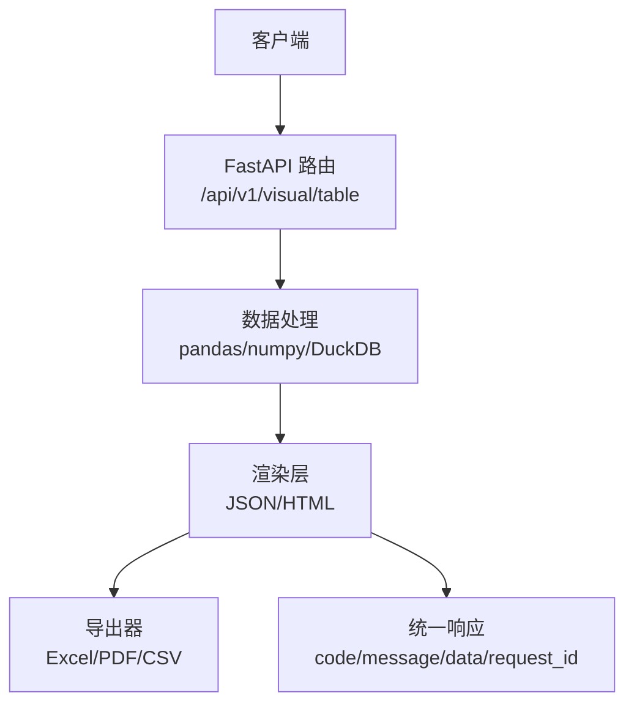
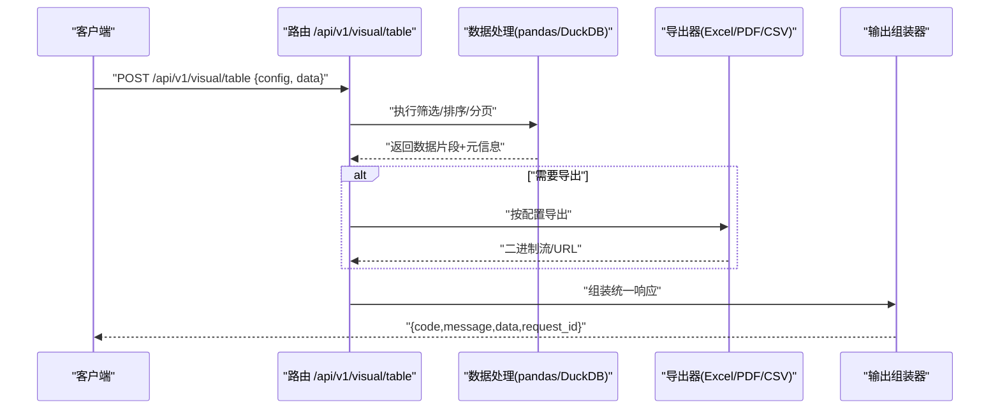
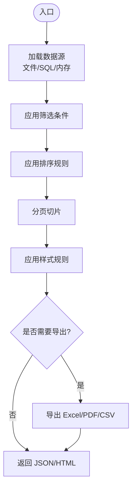
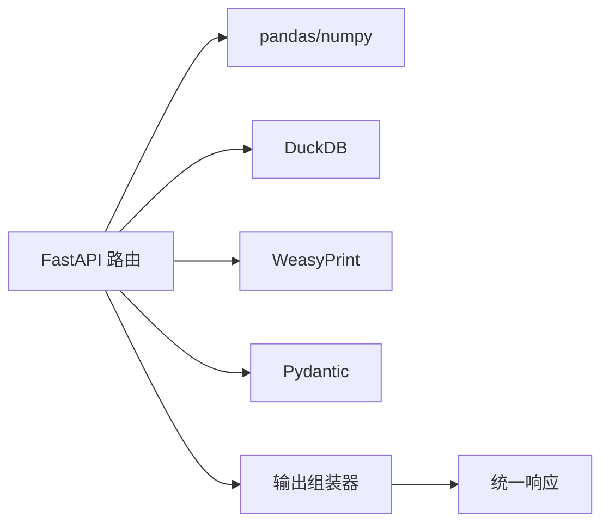

# 表格渲染接口

<cite>
**本文引用的文件**
- [需求说明文档](file://docs\20260821100000_hiagent辅助Web服务_需求说明.md)
</cite>

## 目录
1. [简介](#简介)
2. [项目结构](#项目结构)
3. [核心组件](#核心组件)
4. [架构总览](#架构总览)
5. [详细组件分析](#详细组件分析)
6. [依赖关系分析](#依赖关系分析)
7. [性能考虑](#性能考虑)
8. [故障排查指南](#故障排查指南)
9. [结论](#结论)
10. [附录](#附录)

## 简介
本文件面向 /api/v1/visual/table 数据表格渲染能力，围绕条件着色、排序、分页、筛选、导出与打印等交互进行系统化说明。由于当前仓库仅包含需求说明书，未提供具体实现代码，本文基于需求文档中的技术选型与模块设计，给出可落地的接口规范、配置模型、数据绑定方式、性能优化策略与示例方案，便于后续在 FastAPI + pandas/numpy/DuckDB 的技术栈中实现。

## 项目结构
根据需求文档，可视化与渲染位于 /api/v1/visual 模块，其中包含“数据表格渲染（条件着色、排序）”。结合整体架构，表格渲染通常由以下环节组成：
- 路由层：接收请求参数（列定义、样式规则、排序/分页/筛选/导出选项）
- 数据处理层：使用 pandas/numpy/DuckDB 完成筛选、聚合、排序、分页
- 渲染层：将处理后的数据与样式规则转换为前端可消费的 JSON（或 HTML），支持导出为 Excel/PDF/CSV
- 输出组装器：统一响应格式（code/message/data/request_id）

图表来源
- [需求说明文档:79-82](file://docs\20260821100000_hiagent辅助Web服务_需求说明.md#L79-L82)

章节来源
- [需求说明文档:79-82](file://docs\20260821100000_hiagent辅助Web服务_需求说明.md#L79-L82)

## 核心组件
- 表格配置对象
  - 列定义：字段名、标题、类型、格式化、对齐、宽度、是否可排序/筛选、可见性
  - 样式规则：条件着色（行/单元格）、高亮、主题
  - 交互行为：排序、分页、筛选、多选、展开、冻结列
  - 导出设置：格式（Excel/PDF/CSV）、页眉页脚、打印布局
- 数据绑定
  - 输入：DataFrame/SQL 查询结果；支持 CSV/Excel/JSON 导入
  - 输出：分页后的数据片段 + 元信息（总条数、总页数、排序/筛选状态）
- 渲染与导出
  - 渲染：生成前端表格所需 JSON（含样式规则与数据）或 HTML
  - 导出：通过 WeasyPrint 生成 PDF，pandas 导出 Excel/CSV

章节来源
- [需求说明文档:73-82](file://docs\20260821100000_hiagent辅助Web服务_需求说明.md#L73-L82)

## 架构总览
表格渲染在可视化模块中作为原子能力之一，既可直接调用，也可被 Pipeline 编排复用。

图表来源
- [需求说明文档:73-82](file://docs\20260821100000_hiagent辅助Web服务_需求说明.md#L73-L82)
- [需求说明文档:25-29](file://docs\20260821100000_hiagent辅助Web服务_需求说明.md#L25-L29)

## 详细组件分析

### 接口规范与请求/响应
- 路径：/api/v1/visual/table
- 方法：POST
- 认证：X-API-Key Header
- 请求体关键字段
  - table_config：列定义、样式规则、交互开关、导出选项
  - data_source：数据源引用或内联数据（DataFrame/JSON/SQL）
  - options：排序、分页、筛选、搜索、导出目标
- 响应体：遵循统一 JSON 格式（code/message/data/request_id）

章节来源
- [需求说明文档:25-29](file://docs\20260821100000_hiagent辅助Web服务_需求说明.md#L25-L29)
- [需求说明文档:79-82](file://docs\20260821100000_hiagent辅助Web服务_需求说明.md#L79-L82)

### 表格配置参数
- 列定义
  - 字段映射、标题、数据类型、格式化函数、对齐方式、列宽、是否可排序/筛选、是否固定列
- 样式规则
  - 条件着色：基于数值阈值、文本匹配、表达式计算
  - 单元格级样式：背景色、字体颜色、加粗、边框
  - 主题与全局样式：表头、斑马纹、悬停效果
- 交互行为
  - 排序：单列/多列、升序/降序、服务端排序
  - 分页：页大小、页码、是否启用虚拟滚动
  - 筛选：精确匹配、范围、模糊搜索、多选
  - 其他：行选择、展开详情、冻结列、列拖拽

章节来源
- [需求说明文档:79-82](file://docs\20260821100000_hiagent辅助Web服务_需求说明.md#L79-L82)

### 数据绑定与处理流程
- 数据源接入
  - 文件导入：CSV/Excel/JSON，自动编码检测与类型推断
  - SQL 查询：DuckDB 引擎，支持复杂查询与聚合
- 数据处理
  - 筛选：字段过滤、范围、模糊匹配
  - 排序：多列排序，优先在服务端完成
  - 分页：只返回当前页数据，附带 total/pageInfo
- 渲染输出
  - JSON：供前端表格组件直接消费
  - HTML：用于报告嵌入或预览

图表来源
- [需求说明文档:73-82](file://docs\20260821100000_hiagent辅助Web服务_需求说明.md#L73-L82)

章节来源
- [需求说明文档:73-82](file://docs\20260821100000_hiagent辅助Web服务_需求说明.md#L73-L82)

### 导出与打印
- 导出格式
  - Excel：保留列宽、样式、筛选、冻结列
  - PDF：通过 WeasyPrint 渲染 HTML 表格，支持页眉页脚、分页控制
  - CSV：扁平化导出，适合二次分析
- 打印优化
  - 页面尺寸与边距、表头重复、跨页断行、隐藏无关列
  - 大表分页导出，避免单次渲染过大

章节来源
- [需求说明文档:79-87](file://docs\20260821100000_hiagent辅助Web服务_需求说明.md#L79-L87)

### 完整配置示例（概念级）
以下为概念性配置项说明，实际字段以最终实现为准：
- 基础表格
  - 列定义：id、名称、金额、日期
  - 排序：默认按日期倒序
  - 分页：每页 50 条
- 复杂表格
  - 条件着色：金额大于阈值标红；日期为空高亮
  - 筛选：名称模糊、金额范围、日期区间
  - 导出：Excel（含冻结首行）、PDF（A4 横向）
- 交互式表格
  - 多选行、批量操作
  - 展开详情子表
  - 列拖拽与自定义显示

章节来源
- [需求说明文档:73-82](file://docs\20260821100000_hiagent辅助Web服务_需求说明.md#L73-L82)

## 依赖关系分析
- 外部依赖
  - FastAPI：路由与请求/响应
  - pandas/numpy：数据处理与转换
  - DuckDB：高性能 SQL 查询
  - WeasyPrint：PDF 渲染
  - Pydantic：请求/响应模型校验
  - PyYAML：场景配置解析（Pipeline 模式）
- 内部依赖
  - 输出组装器：统一响应封装
  - 连接器层：数据获取（数据库/API/文件）

图表来源
- [需求说明文档:19-21](file://docs\20260821100000_hiagent辅助Web服务_需求说明.md#L19-L21)
- [需求说明文档:73-87](file://docs\20260821100000_hiagent辅助Web服务_需求说明.md#L73-L87)

章节来源
- [需求说明文档:19-21](file://docs\20260821100000_hiagent辅助Web服务_需求说明.md#L19-L21)
- [需求说明文档:73-87](file://docs\20260821100000_hiagent辅助Web服务_需求说明.md#L73-L87)

## 性能考虑
- 大数据量处理
  - 服务端排序/筛选/分页：减少传输体积
  - 使用 DuckDB 执行复杂查询，提升聚合与过滤性能
  - 按需加载：懒加载列、延迟渲染
- 虚拟滚动
  - 前端虚拟滚动配合后端分页，降低 DOM 压力
  - 合理设置页大小（如 50-200 条）
- 内存优化
  - 及时释放中间 DataFrame，避免复制冗余
  - 使用向量化操作替代循环
  - 限制导出批次大小，分片写入
- 非功能性指标
  - 简单接口 < 500ms，数据处理 < 3s，Pipeline 全流程 < 10s

章节来源
- [需求说明文档:97-102](file://docs\20260821100000_hiagent辅助Web服务_需求说明.md#L97-L102)

## 故障排查指南
- 认证失败
  - 检查 X-API-Key 是否正确传递
- 数据异常
  - 确认数据源连接、SQL 语法、字段类型
  - 查看错误码分段（2xxx 数据处理、3xxx 可视化）
- 渲染/导出失败
  - 检查模板与样式兼容性（PDF）
  - 导出超时：分批导出或减小页大小
- 日志与可观测性
  - 结构化日志记录 scenario_id、步骤耗时
  - 健康检查 /health 与场景列表 /api/v1/pipeline/scenarios

章节来源
- [需求说明文档:25-29](file://docs\20260821100000_hiagent辅助Web服务_需求说明.md#L25-L29)
- [需求说明文档:97-102](file://docs\20260821100000_hiagent辅助Web服务_需求说明.md#L97-L102)

## 结论
表格渲染接口在 /api/v1/visual 下提供统一的配置驱动能力，覆盖条件着色、排序、分页、筛选、导出与打印。依托 FastAPI + pandas/numpy/DuckDB + WeasyPrint 的技术栈，可实现高性能、可扩展的表格服务。建议在生产环境中结合虚拟滚动、服务端分页与批处理导出，以满足大数据量场景的性能要求。

## 附录
- 术语
  - 条件着色：根据数据值动态改变行/单元格样式
  - 虚拟滚动：仅渲染可视区域行，提升长列表性能
  - 输出组装器：统一封装响应结构与元信息
- 参考
  - 统一接口规范与错误码
  - 可视化与渲染模块能力清单