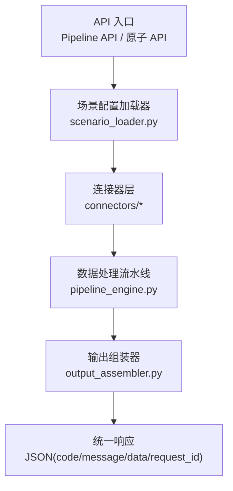
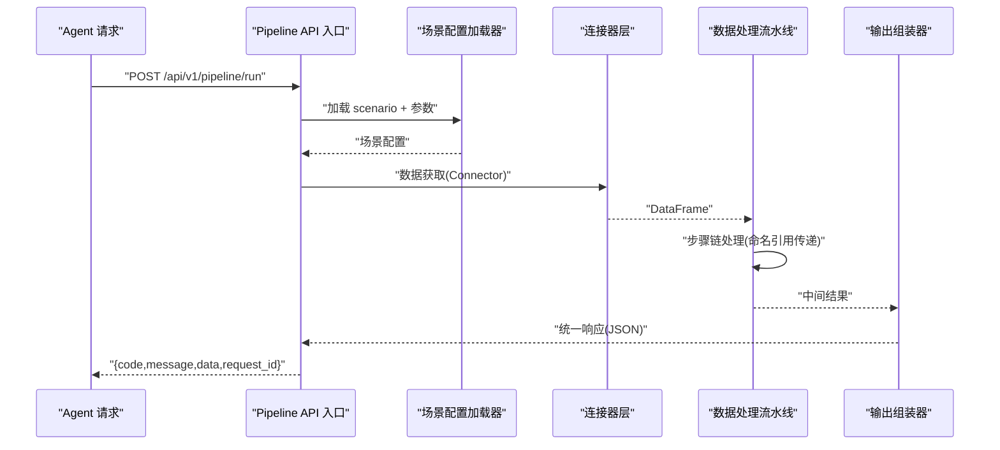
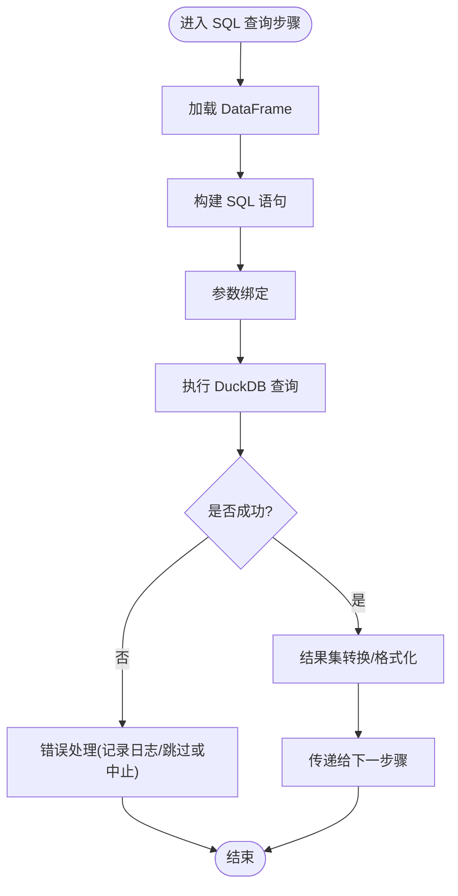
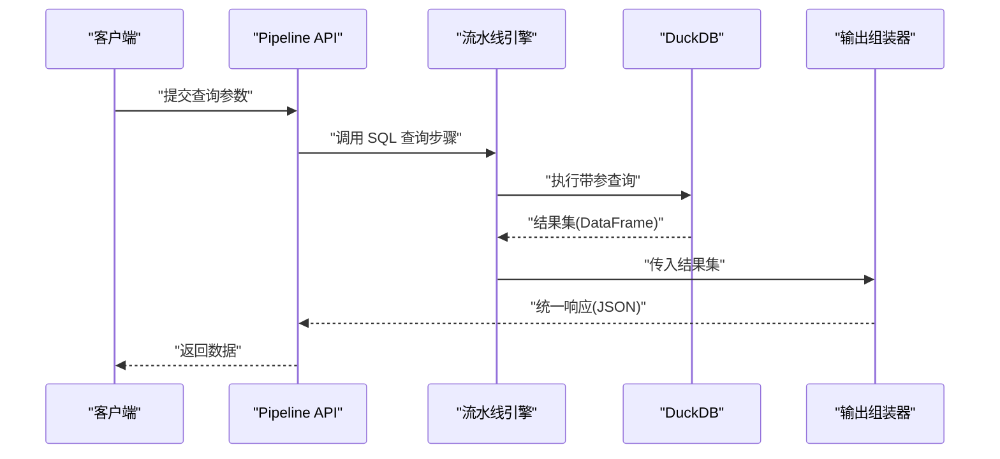
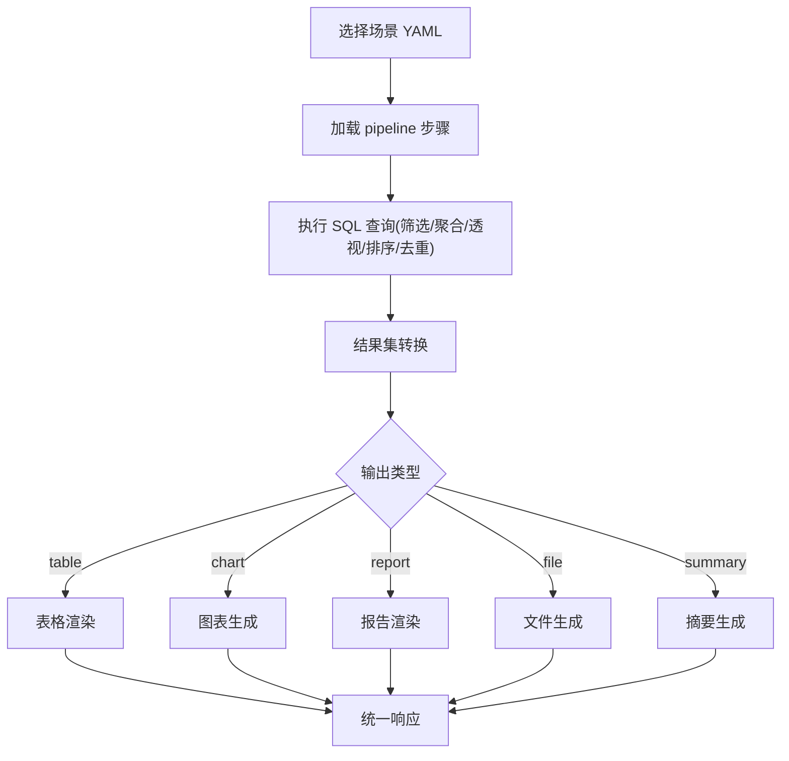
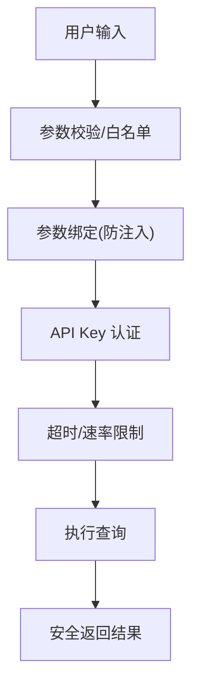
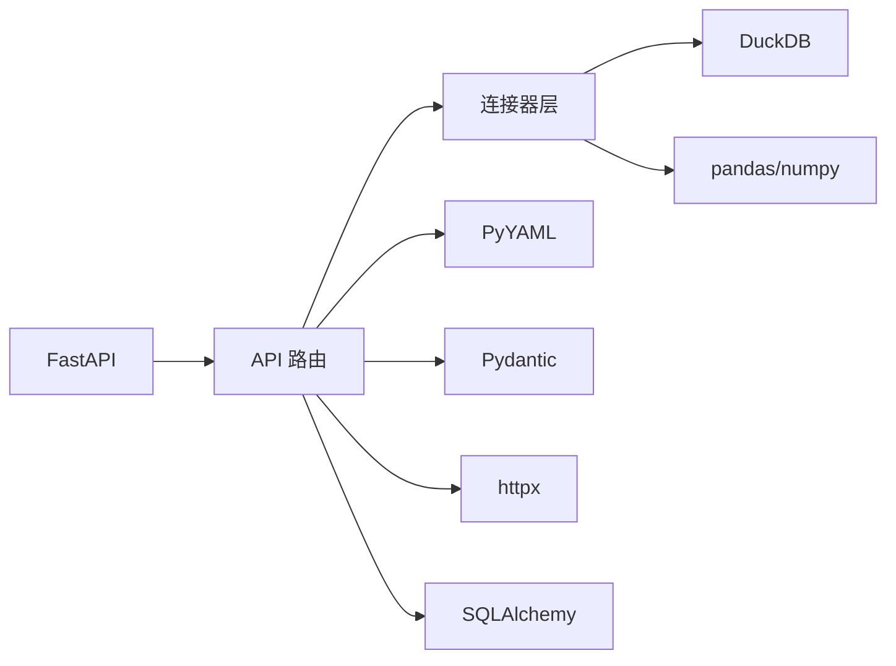

# SQL 查询与数据处理

<cite>
**本文档引用的文件**
- [20260821100000_hiagent辅助Web服务_需求说明.md](file://docs/20260821100000_hiagent辅助Web服务_需求说明.md)
</cite>

## 目录
1. [简介](#简介)
2. [项目结构](#项目结构)
3. [核心组件](#核心组件)
4. [架构总览](#架构总览)
5. [详细组件分析](#详细组件分析)
6. [依赖关系分析](#依赖关系分析)
7. [性能考虑](#性能考虑)
8. [故障排查指南](#故障排查指南)
9. [结论](#结论)
10. [附录](#附录)

## 简介
本文件面向“hiagent 辅助 Web 服务”的 SQL 查询与数据处理能力，聚焦于基于 DuckDB 的数据处理流水线与原子 API 能力。目标包括：
- 提供统一的 SQL 查询接口（筛选、聚合、透视、排序、去重等）
- 说明查询语法支持、参数绑定、结果集处理流程
- 给出复杂查询执行与结果处理的示例路径
- 总结性能优化策略（索引使用、查询计划分析、内存管理）
- 明确安全考虑（SQL 注入防护、权限控制、执行超时限制）

该能力服务于多种业务分析场景（竞品分析、机构行为分析、产品规模增量分析），通过配置驱动与可复用组件支撑不同数据源与输出形态。

**章节来源**
- [20260821100000_hiagent辅助Web服务_需求说明.md:1-142](file://docs/20260821100000_hiagent辅助Web服务_需求说明.md#L1-L142)

## 项目结构
根据需求文档，数据处理相关的关键新增目录与文件如下：
- app/core/pipeline_engine.py — 流水线引擎
- app/core/scenario_loader.py — 场景配置加载器
- app/core/connectors/ — 数据连接器（base/database/api/file）
- app/core/output_assembler.py — 输出组装器
- app/scenarios/*.yaml — 场景配置文件
- app/api/v1/pipeline.py — Pipeline 路由

这些模块共同构成“场景驱动的流水线引擎”，将数据获取、处理、输出标准化为统一流程，并通过原子 API 暴露基础能力。

**图表来源**
- [20260821100000_hiagent辅助Web服务_需求说明.md:33-68](file://docs/20260821100000_hiagent辅助Web服务_需求说明.md#L33-L68)

**章节来源**
- [20260821100000_hiagent辅助Web服务_需求说明.md:106-115](file://docs/20260821100000_hiagent辅助Web服务_需求说明.md#L106-L115)

## 核心组件
- 数据导入解析：CSV/Excel/JSON，自动编码检测、类型推断
- SQL 查询：DuckDB 引擎，支持筛选、聚合、透视、排序、去重
- 数据清洗：空值处理、类型转换、文本清洗、异常值处理
- 统计分析：描述性统计、相关性、频率分布
- 可视化与渲染：图表生成、报告渲染、表格渲染
- 文件与文档操作：格式转换、文档生成、临时文件管理
- API 编排：HTTP 代理、数据转换、超时重试、速率限制、鉴权模板

上述能力在“数据处理 /api/v1/data”和“可视化与渲染 /api/v1/visual”等模块中提供，并通过统一 JSON 响应格式对外暴露。

**章节来源**
- [20260821100000_hiagent辅助Web服务_需求说明.md:71-94](file://docs/20260821100000_hiagent辅助Web服务_需求说明.md#L71-L94)

## 架构总览
系统采用“无状态、单一职责、输入输出标准化、容错优先、安全隔离、场景可配置、组件可复用”的核心原则，构建通用架构以支撑多场景。

**图表来源**
- [20260821100000_hiagent辅助Web服务_需求说明.md:33-68](file://docs/20260821100000_hiagent辅助Web服务_需求说明.md#L33-L68)

**章节来源**
- [20260821100000_hiagent辅助Web服务_需求说明.md:5-16](file://docs/20260821100000_hiagent辅助Web服务_需求说明.md#L5-L16)

## 详细组件分析

### DuckDB SQL 查询接口
- 查询能力：筛选、聚合、透视、排序、去重
- 数据源：通过连接器返回统一 DataFrame，再交由 DuckDB 进行高效查询
- 集成点：数据处理流水线中的“SQL 查询”步骤，作为 Step 链中的一环

**图表来源**
- [20260821100000_hiagent辅助Web服务_需求说明.md:57-61](file://docs/20260821100000_hiagent辅助Web服务_需求说明.md#L57-L61)
- [20260821100000_hiagent辅助Web服务_需求说明.md:71-78](file://docs/20260821100000_hiagent辅助Web服务_需求说明.md#L71-L78)

**章节来源**
- [20260821100000_hiagent辅助Web服务_需求说明.md:71-78](file://docs/20260821100000_hiagent辅助Web服务_需求说明.md#L71-L78)

### 参数绑定与结果集处理
- 参数绑定：通过连接器与流水线上下文传递参数，避免字符串拼接，降低 SQL 注入风险
- 结果集处理：统一转换为 DataFrame，再由输出组装器按类型（chart/table/report/file/summary）进行封装

**图表来源**
- [20260821100000_hiagent辅助Web服务_需求说明.md:33-68](file://docs/20260821100000_hiagent辅助Web服务_需求说明.md#L33-L68)

**章节来源**
- [20260821100000_hiagent辅助Web服务_需求说明.md:33-68](file://docs/20260821100000_hiagent辅助Web服务_需求说明.md#L33-L68)

### 复杂查询执行示例（路径指引）
- 场景配置：在 app/scenarios/*.yaml 中定义 data_sources、pipeline、outputs
- 执行入口：POST /api/v1/pipeline/run 传入 scenario_id 与参数
- 步骤链：通过命名引用传递中间数据，逐步完成筛选、聚合、透视、排序、去重等操作
- 输出类型：chart/table/report/file/summary，其中 summary 专为 Agent 设计

**图表来源**
- [20260821100000_hiagent辅助Web服务_需求说明.md:40-68](file://docs/20260821100000_hiagent辅助Web服务_需求说明.md#L40-L68)

**章节来源**
- [20260821100000_hiagent辅助Web服务_需求说明.md:40-68](file://docs/20260821100000_hiagent辅助Web服务_需求说明.md#L40-L68)

### 安全考虑
- SQL 注入防护：使用参数绑定而非字符串拼接；对输入进行校验与白名单过滤
- 查询权限控制：通过 API Key 认证（X-API-Key Header）与角色/场景权限控制
- 执行超时限制：在 API 编排与流水线步骤中设置超时与重试策略，防止长时间阻塞

**图表来源**
- [20260821100000_hiagent辅助Web服务_需求说明.md:25-31](file://docs/20260821100000_hiagent辅助Web服务_需求说明.md#L25-L31)
- [20260821100000_hiagent辅助Web服务_需求说明.md:90-94](file://docs/20260821100000_hiagent辅助Web服务_需求说明.md#L90-L94)

**章节来源**
- [20260821100000_hiagent辅助Web服务_需求说明.md:25-31](file://docs/20260821100000_hiagent辅助Web服务_需求说明.md#L25-L31)
- [20260821100000_hiagent辅助Web服务_需求说明.md:90-94](file://docs/20260821100000_hiagent辅助Web服务_需求说明.md#L90-L94)

## 依赖关系分析
- 技术栈：FastAPI + pandas/numpy + DuckDB + matplotlib/plotly + WeasyPrint + httpx + Pydantic + PyYAML + SQLAlchemy + jsonpath-ng + Docker/uvicorn
- 关键依赖：
  - FastAPI：提供 HTTP 接口与异步处理能力
  - DuckDB：高性能列式数据库，用于 DataFrame 查询
  - pandas/numpy：数据处理与分析
  - PyYAML：场景配置读取
  - Pydantic：数据模型校验
  - httpx：外部 API 调用
  - SQLAlchemy：数据库连接抽象（可选）

**图表来源**
- [20260821100000_hiagent辅助Web服务_需求说明.md:19-23](file://docs/20260821100000_hiagent辅助Web服务_需求说明.md#L19-L23)

**章节来源**
- [20260821100000_hiagent辅助Web服务_需求说明.md:19-23](file://docs/20260821100000_hiagent辅助Web服务_需求说明.md#L19-L23)

## 性能考虑
- 简单接口 < 500ms，数据处理 < 3s，Pipeline 全流程 < 10s
- 使用 DuckDB 提升 DataFrame 查询性能（优于 pandasql）
- 建议实践：
  - 索引使用：在数据源侧建立合适索引，减少扫描开销
  - 查询计划分析：利用 DuckDB EXPLAIN 分析执行计划，识别瓶颈
  - 内存管理：合理分页与流式处理，避免一次性加载超大结果集
  - 步骤级耗时记录：每步独立记录日志和耗时，便于定位慢步骤

**章节来源**
- [20260821100000_hiagent辅助Web服务_需求说明.md:97-102](file://docs/20260821100000_hiagent辅助Web服务_需求说明.md#L97-L102)
- [20260821100000_hiagent辅助Web服务_需求说明.md:57-61](file://docs/20260821100000_hiagent辅助Web服务_需求说明.md#L57-L61)
- [20260821100000_hiagent辅助Web服务_需求说明.md:136-141](file://docs/20260821100000_hiagent辅助Web服务_需求说明.md#L136-L141)

## 故障排查指南
- 结构化日志：含 scenario_id + 步骤耗时，便于追踪问题
- 健康检查：/health 端点监控服务状态
- 场景列表：/api/v1/pipeline/scenarios 查看可用场景
- 常见错误：
  - 参数绑定失败：检查输入类型与白名单
  - 查询超时：调整超时阈值或优化 SQL
  - 连接器异常：检查凭据与环境变量配置

**章节来源**
- [20260821100000_hiagent辅助Web服务_需求说明.md:97-102](file://docs/20260821100000_hiagent辅助Web服务_需求说明.md#L97-L102)

## 结论
本方案通过“场景驱动的流水线引擎”与“原子 API”双模式，结合 DuckDB 的高性能查询能力，为 hiagent 提供统一、安全、可扩展的 SQL 查询与数据处理能力。通过参数绑定、权限控制与超时限制保障安全性；通过步骤级日志与性能目标保障可观测性与性能。后续可按路线图逐步完善报告生成、更多场景接入与性能优化。

## 附录
- 统一接口规范：JSON 响应格式（code/message/data/request_id）、错误码分段、API Key 认证
- 两种调用模式：
  - Pipeline API：POST /api/v1/pipeline/run
  - 原子 API：/api/v1/data/*、/api/v1/visual/* 等

**章节来源**
- [20260821100000_hiagent辅助Web服务_需求说明.md:25-31](file://docs/20260821100000_hiagent辅助Web服务_需求说明.md#L25-L31)
- [20260821100000_hiagent辅助Web服务_需求说明.md:65-68](file://docs/20260821100000_hiagent辅助Web服务_需求说明.md#L65-L68)