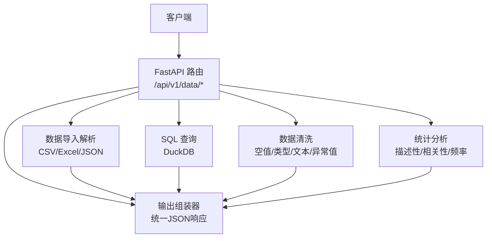
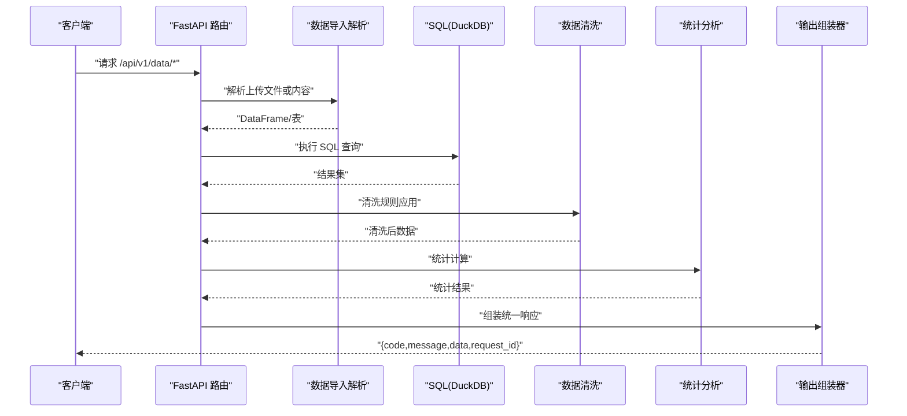
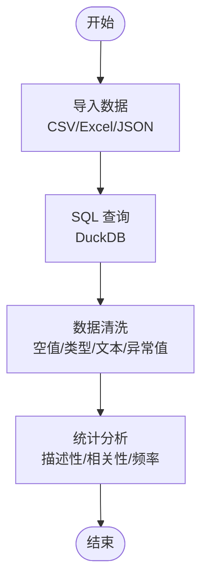
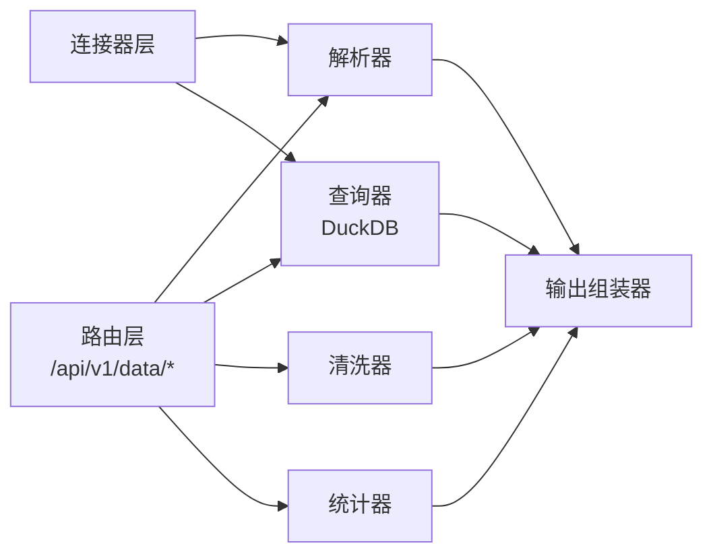

# 数据处理 API

<cite>
**本文引用的文件**
- [hiagent辅助Web服务_需求说明.md](file://docs/20260821100000_hiagent辅助Web服务_需求说明.md)
</cite>

## 目录
1. [简介](#简介)
2. [项目结构](#项目结构)
3. [核心组件](#核心组件)
4. [架构总览](#架构总览)
5. [详细接口规范（/api/v1/data/*）](#详细接口规范api_v1datapath)
6. [依赖关系分析](#依赖关系分析)
7. [性能考虑](#性能考虑)
8. [故障排查指南](#故障排查指南)
9. [结论](#结论)
10. [附录：使用示例与最佳实践](#附录使用示例与最佳实践)

## 简介
本模块面向 hiagent 辅助 Web 服务的“数据处理”能力，提供原子化 API 以支撑多种业务分析场景。根据需求文档，/api/v1/data 模块涵盖数据导入解析（CSV/Excel/JSON）、SQL 查询（DuckDB）、数据清洗、统计分析等能力，并遵循统一 JSON 响应格式与 API Key 认证机制。该模块既可作为 Pipeline 的原子步骤被编排调用，也可由客户端直接逐步调用完成端到端的数据处理流程。

## 项目结构
当前仓库包含需求规格文档，明确了 /api/v1/data 的能力边界与非功能性要求。后续实现将围绕以下关键位置展开（依据需求文档的项目结构规划）：
- app/api/v1/pipeline.py — Pipeline 路由（用于模式 A 的场景编排）
- 数据处理相关路由与处理器 — 位于 /api/v1/data/*（模式 B 的原子 API）
- 核心能力层 — 数据解析、SQL 引擎（DuckDB）、清洗、统计等
- 连接器层 — 支持 file_upload、database、api 等多种数据源
- 输出组装器 — 统一返回结果结构

图表来源
- [hiagent辅助Web服务_需求说明.md:71-77](file://docs/20260821100000_hiagent辅助Web服务_需求说明.md#L71-L77)

章节来源
- [hiagent辅助Web服务_需求说明.md:71-77](file://docs/20260821100000_hiagent辅助Web服务_需求说明.md#L71-L77)

## 核心组件
- 数据导入解析：支持 CSV、Excel、JSON；具备自动编码检测与类型推断能力。
- SQL 查询：基于 DuckDB 执行筛选、聚合、透视、排序、去重等操作。
- 数据清洗：处理空值、类型转换、文本清洗、异常值识别与处理。
- 统计分析：提供描述性统计、相关性分析、频率分布等常用统计能力。
- 统一响应：code/message/data/request_id 的标准 JSON 结构，错误码按模块分段（数据处理为 2xxx）。
- 安全认证：通过 X-API-Key Header 进行鉴权。

章节来源
- [hiagent辅助Web服务_需求说明.md:25-29](file://docs/20260821100000_hiagent辅助Web服务_需求说明.md#L25-L29)
- [hiagent辅助Web服务_需求说明.md:71-77](file://docs/20260821100000_hiagent辅助Web服务_需求说明.md#L71-L77)

## 架构总览
系统采用“Pipeline + 原子 API”双模式：
- 模式 A（Pipeline）：POST /api/v1/pipeline/run，传入 scenario_id 与参数，一次完成全流程。
- 模式 B（原子 API）：/api/v1/data/*、/api/v1/visual/* 等，逐步调用，Agent 自行编排。

图表来源
- [hiagent辅助Web服务_需求说明.md:65-67](file://docs/20260821100000_hiagent辅助Web服务_需求说明.md#L65-L67)
- [hiagent辅助Web服务_需求说明.md:71-77](file://docs/20260821100000_hiagent辅助Web服务_需求说明.md#L71-L77)

## 详细接口规范（/api/v1/data/*）
以下为 /api/v1/data 下各子接口的通用约定与具体定义。所有接口均遵循统一 JSON 响应格式与 API Key 认证。

### 通用约定
- 认证：请求头 X-API-Key
- 响应格式：{ code, message, data, request_id }
- 错误码：数据处理模块错误码为 2xxx
- 输入限制：建议对文件大小、字段长度、SQL 语句长度等进行限制（见“性能与安全”）

章节来源
- [hiagent辅助Web服务_需求说明.md:25-29](file://docs/20260821100000_hiagent辅助Web服务_需求说明.md#L25-L29)
- [hiagent辅助Web服务_需求说明.md:71-77](file://docs/20260821100000_hiagent辅助Web服务_需求说明.md#L71-L77)

### 接口清单
- POST /api/v1/data/import
  - 功能：导入并解析数据文件（CSV/Excel/JSON），自动编码检测与类型推断
  - 请求体：multipart/form-data 或 JSON（含文件内容与元信息）
  - 响应：data 中包含解析后的表结构与前若干行样例数据
  - 错误：2xxx 系列错误码（如文件格式不支持、解析失败）

- POST /api/v1/data/query
  - 功能：在内存表上执行 SQL 查询（DuckDB），支持筛选、聚合、透视、排序、去重
  - 请求体：{ table_name, sql, params? }
  - 响应：data 中为查询结果集（列名与数据类型）
  - 错误：2xxx（SQL 语法错误、权限不足、注入防护触发）

- POST /api/v1/data/clean
  - 功能：数据清洗（空值处理、类型转换、文本清洗、异常值处理）
  - 请求体：{ table_name, rules }，rules 定义清洗策略
  - 响应：data 中为清洗后的数据与清洗日志摘要
  - 错误：2xxx（规则非法、类型不兼容）

- POST /api/v1/data/stats
  - 功能：统计分析（描述性统计、相关性、频率分布）
  - 请求体：{ table_name, metrics }，metrics 指定统计指标
  - 响应：data 中为统计结果（数值型指标、分布表等）
  - 错误：2xxx（指标不存在、数据为空）

章节来源
- [hiagent辅助Web服务_需求说明.md:71-77](file://docs/20260821100000_hiagent辅助Web服务_需求说明.md#L71-L77)

### 接口流程图（导入→查询→清洗→统计）

图表来源
- [hiagent辅助Web服务_需求说明.md:71-77](file://docs/20260821100000_hiagent辅助Web服务_需求说明.md#L71-L77)

## 依赖关系分析
- 外部依赖：FastAPI、pandas/numpy、DuckDB、Pydantic、PyYAML、httpx、matplotlib/plotly、WeasyPrint、SQLAlchemy、jsonpath-ng
- 内部依赖：
  - 路由层 → 解析器/查询器/清洗器/统计器 → 输出组装器
  - 连接器层（file_upload/database/api）提供统一 DataFrame 输出
  - Pipeline 引擎协调多步骤顺序执行与错误处理

图表来源
- [hiagent辅助Web服务_需求说明.md:19-21](file://docs/20260821100000_hiagent辅助Web服务_需求说明.md#L19-L21)
- [hiagent辅助Web服务_需求说明.md:46-63](file://docs/20260821100000_hiagent辅助Web服务_需求说明.md#L46-L63)

章节来源
- [hiagent辅助Web服务_需求说明.md:19-21](file://docs/20260821100000_hiagent辅助Web服务_需求说明.md#L19-L21)
- [hiagent辅助Web服务_需求说明.md:46-63](file://docs/20260821100000_hiagent辅助Web服务_需求说明.md#L46-L63)

## 性能考虑
- 目标性能：简单接口 < 500ms，数据处理 < 3s，Pipeline 全流程 < 10s
- 优化建议：
  - 使用 DuckDB 执行复杂查询，避免全量 pandas 操作
  - 对大文件流式读取与分块处理，控制内存占用
  - 缓存中间结果（如清洗后的表）以减少重复计算
  - 合理设置超时与重试策略，避免长尾请求阻塞
  - 限制请求体大小与 SQL 语句长度，防止资源滥用

章节来源
- [hiagent辅助Web服务_需求说明.md:97-102](file://docs/20260821100000_hiagent辅助Web服务_需求说明.md#L97-L102)

## 故障排查指南
- 认证失败：检查 X-API-Key 是否正确配置
- 解析失败：确认文件格式与编码；查看错误码 2xxx 的具体原因
- SQL 错误：校验 SQL 语法与表结构；关注注入防护拦截
- 清洗失败：检查清洗规则是否合法、数据类型是否兼容
- 统计失败：确认指标是否存在、数据是否为空
- 可观测性：启用结构化日志，记录 scenario_id 与步骤耗时；通过 /health 检查服务状态

章节来源
- [hiagent辅助Web服务_需求说明.md:25-29](file://docs/20260821100000_hiagent辅助Web服务_需求说明.md#L25-L29)
- [hiagent辅助Web服务_需求说明.md:97-102](file://docs/20260821100000_hiagent辅助Web服务_需求说明.md#L97-L102)

## 结论
/api/v1/data 模块提供了完整的数据处理原子能力，覆盖导入解析、SQL 查询、清洗与统计分析，并通过统一响应与认证机制保障一致性与安全性。结合 Pipeline 模式，可实现复杂场景的一键执行；同时保留原子 API 供灵活编排。建议在实现阶段严格遵循性能与安全约束，完善错误码与日志体系，提升可维护性与可观测性。

## 附录：使用示例与最佳实践
- 导入文件
  - 使用 POST /api/v1/data/import 上传 CSV/Excel/JSON，确保文件编码正确且不超过大小限制
  - 解析成功后，获取表名与样例数据，便于后续查询与清洗
- 执行 SQL 查询
  - 使用 POST /api/v1/data/query 提交 SQL 语句，注意避免危险函数与注入风险
  - 对结果集进行分页与字段选择，减少传输开销
- 数据清洗
  - 使用 POST /api/v1/data/clean 定义清洗规则，优先处理空值与类型问题
  - 记录清洗日志，便于回溯与审计
- 统计分析
  - 使用 POST /api/v1/data/stats 选择所需指标，避免全量计算
  - 对高频指标建立缓存，提升响应速度
- 安全与性能
  - 始终携带 X-API-Key 进行认证
  - 限制请求体大小与 SQL 长度，启用超时与重试
  - 使用结构化日志记录关键步骤耗时与错误信息

章节来源
- [hiagent辅助Web服务_需求说明.md:25-29](file://docs/20260821100000_hiagent辅助Web服务_需求说明.md#L25-L29)
- [hiagent辅助Web服务_需求说明.md:71-77](file://docs/20260821100000_hiagent辅助Web服务_需求说明.md#L71-L77)
- [hiagent辅助Web服务_需求说明.md:97-102](file://docs/20260821100000_hiagent辅助Web服务_需求说明.md#L97-L102)