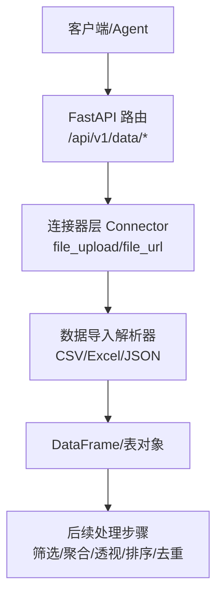
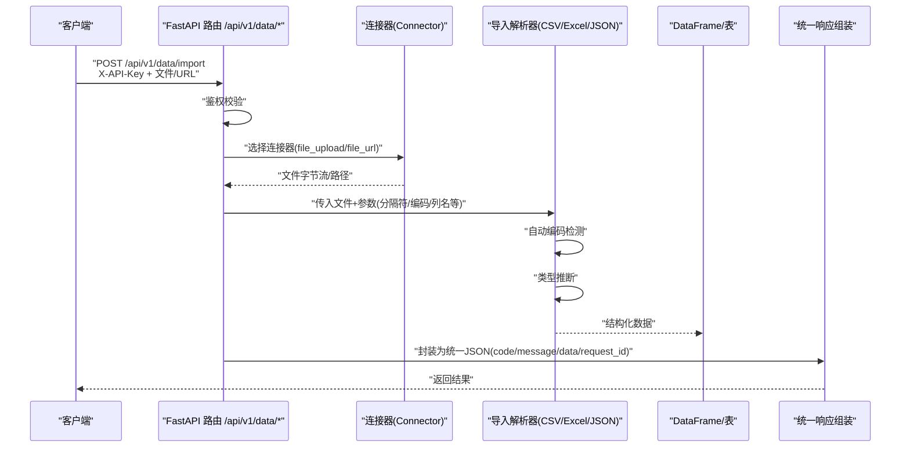
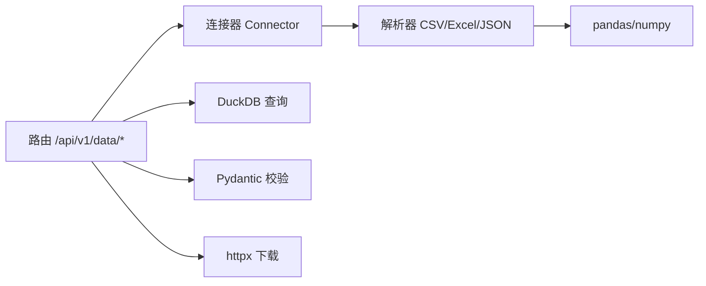
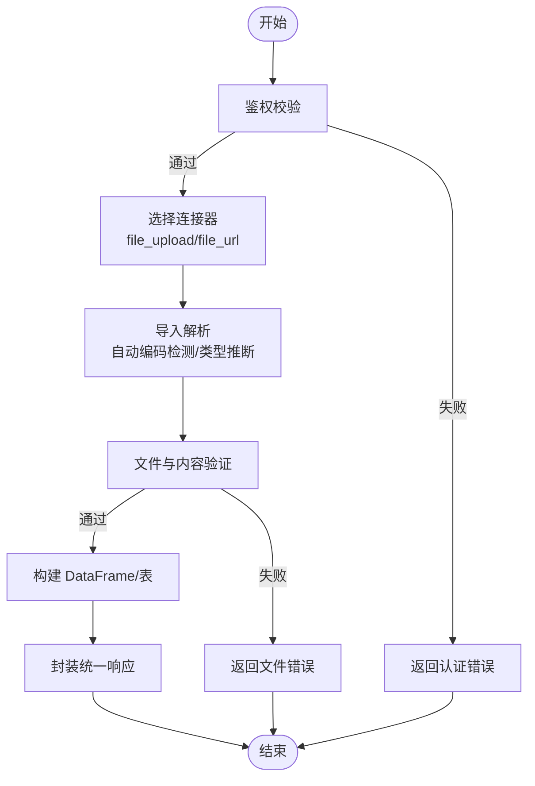

# 数据导入解析

<cite>
**本文引用的文件**
- [20260821100000_hiagent辅助Web服务_需求说明.md](file://docs\20260821100000_hiagent辅助Web服务_需求说明.md)
</cite>

## 目录
1. [简介](#简介)
2. [项目结构](#项目结构)
3. [核心组件](#核心组件)
4. [架构总览](#架构总览)
5. [详细组件分析](#详细组件分析)
6. [依赖关系分析](#依赖关系分析)
7. [性能与内存优化](#性能与内存优化)
8. [故障排查指南](#故障排查指南)
9. [结论](#结论)
10. [附录：接口规范与使用示例](#附录接口规范与使用示例)

## 简介
本章节面向“数据导入解析”能力，覆盖 CSV、Excel、JSON 三种格式的上传与解析。依据需求文档，该能力位于数据处理模块 /api/v1/data，具备自动编码检测、类型推断等特性；同时结合统一接口规范与安全要求，提供安全可控的导入体验。

## 项目结构
根据需求文档，数据处理模块位于 /api/v1/data，负责数据导入解析、SQL 查询、清洗、统计分析等。整体采用 FastAPI 框架，配合 pandas/numpy、DuckDB 等库实现高性能数据处理。

图表来源
- [20260821100000_hiagent辅助Web服务_需求说明.md:21-29](file://docs\20260821100000_hiagent辅助Web服务_需求说明.md#L21-L29)
- [20260821100000_hiagent辅助Web服务_需求说明.md:46-55](file://docs\20260821100000_hiagent辅助Web服务_需求说明.md#L46-L55)
- [20260821100000_hiagent辅助Web服务_需求说明.md:71-77](file://docs\20260821100000_hiagent辅助Web服务_需求说明.md#L71-L77)

章节来源
- [20260821100000_hiagent辅助Web服务_需求说明.md:21-29](file://docs\20260821100000_hiagent辅助Web服务_需求说明.md#L21-L29)
- [20260821100000_hiagent辅助Web服务_需求说明.md:46-55](file://docs\20260821100000_hiagent辅助Web服务_需求说明.md#L46-L55)
- [20260821100000_hiagent辅助Web服务_需求说明.md:71-77](file://docs\20260821100000_hiagent辅助Web服务_需求说明.md#L71-L77)

## 核心组件
- 数据导入解析：支持 CSV、Excel、JSON；具备自动编码检测与类型推断。
- 连接器层：通过 file_upload/file_url 等方式获取文件并返回统一 DataFrame。
- 统一响应：遵循 code/message/data/request_id 的统一 JSON 格式。
- 认证：通过 X-API-Key Header 进行 API Key 认证。

章节来源
- [20260821100000_hiagent辅助Web服务_需求说明.md:25-29](file://docs\20260821100000_hiagent辅助Web服务_需求说明.md#L25-L29)
- [20260821100000_hiagent辅助Web服务_需求说明.md:46-55](file://docs\20260821100000_hiagent辅助Web服务_需求说明.md#L46-L55)
- [20260821100000_hiagent辅助Web服务_需求说明.md:71-77](file://docs\20260821100000_hiagent辅助Web服务_需求说明.md#L71-L77)

## 架构总览
下图展示了从请求到数据导入解析的整体流程，包括认证、连接器选择、解析与后续处理。

图表来源
- [20260821100000_hiagent辅助Web服务_需求说明.md:25-29](file://docs\20260821100000_hiagent辅助Web服务_需求说明.md#L25-L29)
- [20260821100000_hiagent辅助Web服务_需求说明.md:46-55](file://docs\20260821100000_hiagent辅助Web服务_需求说明.md#L46-L55)
- [20260821100000_hiagent辅助Web服务_需求说明.md:71-77](file://docs\20260821100000_hiagent辅助Web服务_需求说明.md#L71-L77)

## 详细组件分析

### 数据导入解析（CSV/Excel/JSON）
- 功能要点
  - 支持 CSV、Excel、JSON 三种格式导入。
  - 自动编码检测：在解析前对文本编码进行识别，避免乱码。
  - 类型推断：对列数据进行智能类型推断，提升后续分析效率。
  - 文件验证：校验文件格式、大小、内容合法性。
- 输入参数（建议）
  - 文件：multipart/form-data 或 URL 地址。
  - 分隔符：CSV 专用，如逗号、制表符等。
  - 编码方式：UTF-8、GBK 等，若未指定则自动检测。
  - 列名行：首行是否为列名。
  - 空值策略：空值填充或忽略。
  - 类型推断开关：是否启用自动类型推断。
- 输出数据
  - 以 DataFrame/表形式进入后续处理链路（筛选、聚合、透视、排序、去重）。
- 错误处理
  - 非法文件类型、过大文件、编码无法识别、类型推断失败等场景需返回明确错误码与消息。

章节来源
- [20260821100000_hiagent辅助Web服务_需求说明.md:71-77](file://docs\20260821100000_hiagent辅助Web服务_需求说明.md#L71-L77)

### 连接器层（Connector）
- 作用
  - 抽象数据来源，统一返回 DataFrame。
  - 支持 file_upload（Agent 上传文件）、file_url（从 URL 下载文件）等。
- 优势
  - 新增数据源时改动最小，便于扩展。
  - 凭据从环境变量读取，避免硬编码。

章节来源
- [20260821100000_hiagent辅助Web服务_需求说明.md:46-55](file://docs\20260821100000_hiagent辅助Web服务_需求说明.md#L46-L55)

### 统一响应与认证
- 统一响应格式
  - code：状态码（按模块分段：1xxx 通用、2xxx 数据处理、3xxx 可视化、4xxx 文件文档、5xxx API 编排、6xxx Pipeline 引擎）。
  - message：人类可读的错误或成功信息。
  - data：业务数据（如解析后的元信息、统计摘要等）。
  - request_id：请求追踪 ID。
- 认证
  - 通过 X-API-Key Header 进行 API Key 认证。

章节来源
- [20260821100000_hiagent辅助Web服务_需求说明.md:25-29](file://docs\20260821100000_hiagent辅助Web服务_需求说明.md#L25-L29)

## 依赖关系分析
- 技术栈
  - FastAPI：Web 框架，提供路由与中间件能力。
  - pandas/numpy：数据处理与分析。
  - DuckDB：SQL 查询与高性能计算。
  - Pydantic：数据校验与模型定义。
  - PyYAML：场景配置加载。
  - SQLAlchemy：数据库访问（如需持久化）。
  - httpx：HTTP 客户端（用于 URL 下载）。
- 模块耦合
  - 路由层依赖连接器层，连接器层依赖解析器与存储/网络。
  - 解析器依赖 pandas/numpy，查询依赖 DuckDB。

图表来源
- [20260821100000_hiagent辅助Web服务_需求说明.md:21-29](file://docs\20260821100000_hiagent辅助Web服务_需求说明.md#L21-L29)
- [20260821100000_hiagent辅助Web服务_需求说明.md:46-55](file://docs\20260821100000_hiagent辅助Web服务_需求说明.md#L46-L55)

章节来源
- [20260821100000_hiagent辅助Web服务_需求说明.md:21-29](file://docs\20260821100000_hiagent辅助Web服务_需求说明.md#L21-L29)
- [20260821100000_hiagent辅助Web服务_需求说明.md:46-55](file://docs\20260821100000_hiagent辅助Web服务_需求说明.md#L46-L55)

## 性能与内存优化
- 性能目标
  - 简单接口 < 500ms，数据处理 < 3s，Pipeline 全流程 < 10s。
- 内存优化策略
  - 流式解析大文件，避免一次性加载至内存。
  - 分块读取与增量构建 DataFrame。
  - 合理设置数据类型，减少内存占用。
  - 使用 DuckDB 进行高效 SQL 查询与聚合。
- 并发与限流
  - 限制并发解析任务数，防止资源耗尽。
  - 对大文件解析增加超时保护。

章节来源
- [20260821100000_hiagent辅助Web服务_需求说明.md:97-102](file://docs\20260821100000_hiagent辅助Web服务_需求说明.md#L97-L102)

## 故障排查指南
- 常见问题
  - 编码错误：确认文件编码或使用自动编码检测；必要时显式指定编码。
  - 类型推断失败：检查列数据一致性，必要时手动指定类型。
  - 文件大小超限：调整限制或分批上传。
  - 认证失败：检查 X-API-Key 是否正确传递。
- 错误码定位
  - 参考统一错误码分段规则，快速定位问题模块。
- 日志与可观测性
  - 利用结构化日志记录 scenario_id 与步骤耗时，便于追踪。

章节来源
- [20260821100000_hiagent辅助Web服务_需求说明.md:25-29](file://docs\20260821100000_hiagent辅助Web服务_需求说明.md#L25-L29)
- [20260821100000_hiagent辅助Web服务_需求说明.md:97-102](file://docs\20260821100000_hiagent辅助Web服务_需求说明.md#L97-L102)

## 结论
数据导入解析能力以连接器模式抽象数据来源，结合自动编码检测与类型推断，提供稳定高效的 CSV/Excel/JSON 导入体验。通过统一响应与认证机制，保障接口一致性与安全性。配合性能目标与内存优化策略，满足大规模数据处理需求。

## 附录：接口规范与使用示例

### HTTP 方法与 URL
- 方法：POST
- 路径：/api/v1/data/import（基于 /api/v1/data 模块）
- 认证：请求头包含 X-API-Key

### 请求参数
- 文件：multipart/form-data 或 URL（通过连接器获取）
- 分隔符：CSV 专用，如逗号、制表符
- 编码方式：UTF-8、GBK 等；未指定时自动检测
- 列名行：布尔值，指示首行是否为列名
- 空值策略：字符串或枚举，定义空值处理方式
- 类型推断：布尔值，控制是否启用自动类型推断

### 响应格式
- code：状态码（按模块分段）
- message：描述信息
- data：解析结果元信息（如行数、列数、列类型、空值统计等）
- request_id：请求追踪 ID

### 使用示例（概念流程）
- 上传 CSV 文件
  - 发送 POST /api/v1/data/import，携带文件与分隔符、编码、列名行等参数。
  - 系统自动检测编码并进行类型推断，返回结构化数据元信息。
- 从 URL 导入 Excel
  - 发送 POST /api/v1/data/import，携带 URL 与解析参数。
  - 连接器下载文件后解析，返回结果。
- 导入 JSON
  - 发送 POST /api/v1/data/import，携带 JSON 文件或 URL。
  - 系统进行类型推断与清洗，返回结果。

图表来源
- [20260821100000_hiagent辅助Web服务_需求说明.md:25-29](file://docs\20260821100000_hiagent辅助Web服务_需求说明.md#L25-L29)
- [20260821100000_hiagent辅助Web服务_需求说明.md:46-55](file://docs\20260821100000_hiagent辅助Web服务_需求说明.md#L46-L55)
- [20260821100000_hiagent辅助Web服务_需求说明.md:71-77](file://docs\20260821100000_hiagent辅助Web服务_需求说明.md#L71-L77)

### 安全考虑
- 文件类型验证：仅允许 CSV、Excel、JSON 等白名单格式。
- 恶意内容检测：对文件内容进行扫描，拒绝潜在恶意载荷。
- 文件沙箱：在隔离环境中执行解析，避免影响主进程。
- SQL 注入防护：对后续查询进行严格校验与参数化。
- 凭据管理：凭据从环境变量读取，不硬编码。

章节来源
- [20260821100000_hiagent辅助Web服务_需求说明.md:97-102](file://docs\20260821100000_hiagent辅助Web服务_需求说明.md#L97-L102)