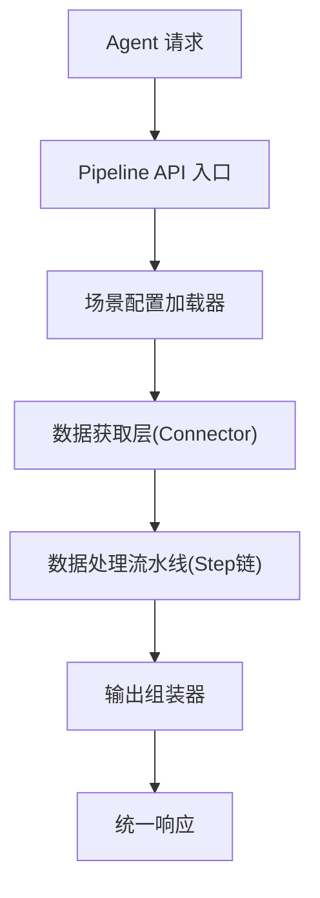
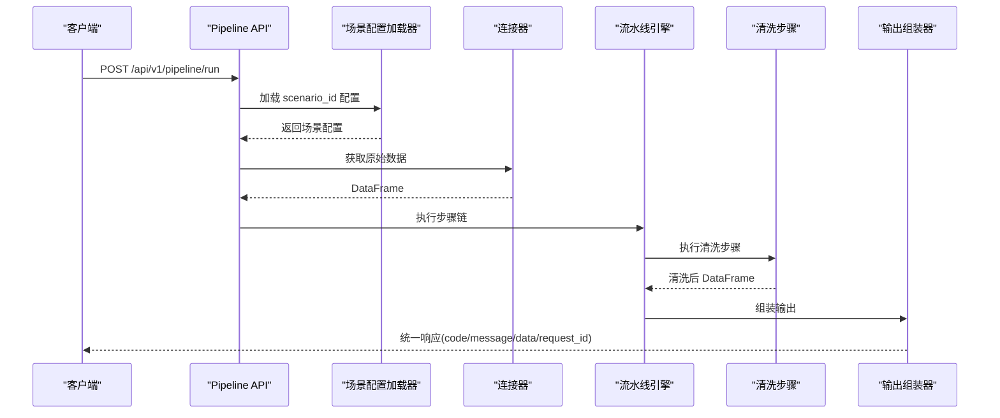

# 数据清洗

<cite>
**本文档引用的文件**
- [20260821100000_hiagent辅助Web服务_需求说明.md](file://docs/20260821100000_hiagent辅助Web服务_需求说明.md)
</cite>

## 目录
1. [简介](#简介)
2. [项目结构](#项目结构)
3. [核心组件](#核心组件)
4. [架构总览](#架构总览)
5. [详细组件分析](#详细组件分析)
6. [依赖关系分析](#依赖关系分析)
7. [性能考虑](#性能考虑)
8. [故障排查指南](#故障排查指南)
9. [结论](#结论)
10. [附录](#附录)

## 简介
本章节面向“hiagent 辅助 Web 服务”中的数据清洗能力，围绕空值处理、类型转换、文本清洗、异常值检测与处理等核心能力进行系统化说明。文档覆盖配置参数、处理规则、输出格式、使用示例、优先级策略、批量处理能力、性能优化以及错误处理机制（回滚、部分成功）等关键主题，帮助读者快速理解并正确使用该能力。

## 项目结构
当前仓库为需求文档阶段，尚未包含实现代码。数据清洗能力位于“数据处理”模块中，作为统一接口的一部分对外暴露。整体采用场景驱动的流水线引擎架构，数据清洗以步骤形式嵌入到 Pipeline 中执行。

图表来源
- [20260821100000_hiagent辅助Web服务_需求说明.md:33-67](file://docs/20260821100000_hiagent辅助Web服务_需求说明.md#L33-L67)

章节来源
- [20260821100000_hiagent辅助Web服务_需求说明.md:33-67](file://docs/20260821100000_hiagent辅助Web服务_需求说明.md#L33-L67)

## 核心组件
- 数据处理模块：提供数据导入解析、SQL 查询、筛选、聚合、透视、排序、去重以及数据清洗（空值、类型转换、文本清洗、异常值）和统计分析能力。
- 流水线引擎：顺序执行步骤，通过命名引用传递中间数据；支持条件分支与步骤级错误处理（skip/abort），每步独立记录日志与耗时。
- 连接器层：数据库、API、文件上传、URL 下载、对象存储等连接器，统一返回 DataFrame，凭据从环境变量读取，注册表模式扩展。
- 输出组装器：支持 chart/table/report/file/summary 五种输出类型，其中 summary 专为 Agent 设计。

章节来源
- [20260821100000_hiagent辅助Web服务_需求说明.md:57-67](file://docs/20260821100000_hiagent辅助Web服务_需求说明.md#L57-L67)
- [20260821100000_hiagent辅助Web服务_需求说明.md:73-77](file://docs/20260821100000_hiagent辅助Web服务_需求说明.md#L73-L77)

## 架构总览
数据清洗作为数据处理流水线中的一个或多个 Step 存在，可与其他步骤组合形成端到端的数据处理流程。每个 Step 具备输入/输出命名引用，便于在 YAML 场景中编排。

图表来源
- [20260821100000_hiagent辅助Web服务_需求说明.md:33-67](file://docs/20260821100000_hiagent辅助Web服务_需求说明.md#L33-L67)
- [20260821100000_hiagent辅助Web服务_需求说明.md:73-77](file://docs/20260821100000_hiagent辅助Web服务_需求说明.md#L73-L77)

## 详细组件分析

### 数据清洗能力
- 能力范围：空值处理、类型转换、文本清洗、异常值检测与处理。
- 集成方式：作为数据处理模块的清洗步骤，嵌入到 Pipeline 的步骤链中，按顺序执行。
- 上下文传递：通过 PipelineContext 在各步骤间传递中间数据。

章节来源
- [20260821100000_hiagent辅助Web服务_需求说明.md:73-77](file://docs/20260821100000_hiagent辅助Web服务_需求说明.md#L73-L77)
- [20260821100000_hiagent辅助Web服务_需求说明.md:57-60](file://docs/20260821100000_hiagent辅助Web服务_需求说明.md#L57-L60)

#### 空值处理
- 目标：识别并处理缺失值，确保后续分析与可视化稳定运行。
- 常见策略：填充（均值/中位数/众数/固定值）、删除（行/列）、插值（线性/时间序列）、标记（新增指示列）。
- 适用字段：数值型、分类型、日期时间型字段。
- 注意事项：避免引入偏差；对时间序列或分组统计需结合业务逻辑选择合适策略。

#### 类型转换
- 目标：将字段转换为期望的数据类型，保证计算与展示正确性。
- 常见转换：字符串转数值/日期、数值精度调整、枚举映射、时区归一化。
- 校验与容错：失败时可选择跳过、报错中止或降级处理（如保留原值并打标签）。

#### 文本清洗
- 目标：规范化文本内容，提升一致性与可比性。
- 常见操作：去除空白与不可见字符、大小写标准化、编码修复、标点与特殊符号处理、正则替换、敏感信息脱敏。
- 性能建议：批量向量化处理优先；复杂正则需谨慎评估性能。

#### 异常值检测与处理
- 目标：识别并合理处理离群点，避免对统计结果造成误导。
- 检测方法：Z-score、IQR、基于业务阈值的区间判断、孤立森林等。
- 处理方式：截断（Winsorize）、替换（中位数/分位数）、剔除、标记（新增异常标识列）。
- 业务对齐：不同指标与场景的阈值应可配置，避免一刀切。

章节来源
- [20260821100000_hiagent辅助Web服务_需求说明.md:73-77](file://docs/20260821100000_hiagent辅助Web服务_需求说明.md#L73-L77)

### 清洗规则配置与优先级
- 配置位置：场景 YAML 中的 pipeline 步骤定义，通过 action 调用原子能力，并以 input/output 命名引用串联。
- 优先级建议：
  - 先进行基础清洗（空值处理、类型转换），再进行高级清洗（文本清洗、异常值处理）。
  - 文本清洗应在类型转换之前完成，以避免因格式问题导致转换失败。
  - 异常值处理通常放在最后，确保在干净数据上进行检测与修正。
- 可配置项：字段名、策略、阈值、是否跳过、失败策略（abort/skip）、重试次数等。

章节来源
- [20260821100000_hiagent辅助Web服务_需求说明.md:40-44](file://docs/20260821100000_hiagent辅助Web服务_需求说明.md#L40-L44)
- [20260821100000_hiagent辅助Web服务_需求说明.md:57-60](file://docs/20260821100000_hiagent辅助Web服务_需求说明.md#L57-L60)

### 批量处理能力
- 批量执行：Pipeline 支持多步骤顺序执行，适合对大批量数据进行流水线式清洗。
- 并发与吞吐：可通过连接器层与下游输出组装器的批处理特性提升吞吐；必要时结合分页与流式处理。
- 资源控制：限制单次处理的批次大小，避免内存溢出；对大文件建议使用 DuckDB 进行高效查询与转换。

章节来源
- [20260821100000_hiagent辅助Web服务_需求说明.md:57-60](file://docs/20260821100000_hiagent辅助Web服务_需求说明.md#L57-L60)
- [20260821100000_hiagent辅助Web服务_需求说明.md:73-77](file://docs/20260821100000_hiagent辅助Web服务_需求说明.md#L73-L77)

### 输出格式
- 统一响应：code/message/data/request_id。
- 输出类型：chart/table/report/file/summary，其中 summary 专为 Agent 设计，便于后续编排。
- 清洗结果：通常以 table 或 summary 形式返回，包含清洗后的数据与元信息（如清洗统计、异常计数、字段类型变更等）。

章节来源
- [20260821100000_hiagent辅助Web服务_需求说明.md:25-30](file://docs/20260821100000_hiagent辅助Web服务_需求说明.md#L25-L30)
- [20260821100000_hiagent辅助Web服务_需求说明.md:62-67](file://docs/20260821100000_hiagent辅助Web服务_需求说明.md#L62-L67)

### 使用示例（概念性）
- 示例一：对含缺失值的数值列进行中位数填充，并对文本列进行空白与大小写标准化。
- 示例二：对日期字段进行类型转换与时区归一化，再对价格字段进行异常值截断。
- 示例三：对分类字段进行枚举映射与去重，生成 summary 供 Agent 消费。

[本节为概念性示例，不直接分析具体文件]

### 错误处理机制
- 步骤级错误处理：支持 skip（跳过当前步骤继续）与 abort（中止整个流水线）。
- 回滚策略：建议在关键步骤前保存快照，发生错误时回滚至最近可用状态。
- 部分成功：对于可分割的清洗任务，可按字段或批次粒度记录成功/失败，并返回明细以便重试。
- 日志与可观测性：每步独立记录日志与耗时，便于定位问题与性能分析。

章节来源
- [20260821100000_hiagent辅助Web服务_需求说明.md:57-60](file://docs/20260821100000_hiagent辅助Web服务_需求说明.md#L57-L60)
- [20260821100000_hiagent辅助Web服务_需求说明.md:97-102](file://docs/20260821100000_hiagent辅助Web服务_需求说明.md#L97-L102)

## 依赖关系分析
- 技术栈：FastAPI + pandas/numpy + DuckDB + matplotlib/plotly + WeasyPrint + httpx + Pydantic + PyYAML + SQLAlchemy + jsonpath-ng + Docker/uvicorn。
- 数据清洗依赖：pandas/numpy 用于数据处理，DuckDB 用于高效查询与转换，Pydantic/PyYAML 用于配置与校验。
- 连接器依赖：数据库/API/文件连接器统一返回 DataFrame，便于清洗步骤复用。

章节来源
- [20260821100000_hiagent辅助Web服务_需求说明.md:19-22](file://docs/20260821100000_hiagent辅助Web服务_需求说明.md#L19-L22)
- [20260821100000_hiagent辅助Web服务_需求说明.md:46-56](file://docs/20260821100000_hiagent辅助Web服务_需求说明.md#L46-L56)

## 性能考虑
- 简单接口 < 500ms，数据处理 < 3s，Pipeline 全流程 < 10s。
- 优化建议：
  - 使用 DuckDB 进行 SQL 查询与转换，减少内存占用并提升速度。
  - 批量向量化处理文本清洗，避免逐行循环。
  - 合理设置异常值检测阈值与窗口大小，避免过度计算。
  - 利用步骤级日志与耗时统计定位瓶颈。

章节来源
- [20260821100000_hiagent辅助Web服务_需求说明.md:97-102](file://docs/20260821100000_hiagent辅助Web服务_需求说明.md#L97-L102)
- [20260821100000_hiagent辅助Web服务_需求说明.md:73-77](file://docs/20260821100000_hiagent辅助Web服务_需求说明.md#L73-L77)

## 故障排查指南
- 常见问题：
  - 类型转换失败：检查字段编码、格式与区域设置；必要时增加预处理步骤。
  - 空值填充偏差：确认填充策略与业务含义一致；对时间序列使用插值更稳妥。
  - 异常值误判：调整阈值或检测方法；结合业务规则进行二次过滤。
  - 文本清洗性能低：改用向量化方法或简化正则表达式。
- 定位手段：
  - 查看步骤级日志与耗时，定位失败步骤。
  - 使用 summary 输出了解清洗统计与异常计数。
  - 通过 /health 与 /api/v1/pipeline/scenarios 检查服务状态与场景配置。

章节来源
- [20260821100000_hiagent辅助Web服务_需求说明.md:97-102](file://docs/20260821100000_hiagent辅助Web服务_需求说明.md#L97-L102)
- [20260821100000_hiagent辅助Web服务_需求说明.md:62-67](file://docs/20260821100000_hiagent辅助Web服务_需求说明.md#L62-L67)

## 结论
数据清洗是 hiagent 辅助 Web 服务数据处理流水线中的关键环节，通过空值处理、类型转换、文本清洗与异常值检测与处理，保障后续分析与可视化的准确性与稳定性。借助场景驱动的 YAML 配置与 Pipeline 引擎，可实现灵活、可复用、可观测的清洗流程。遵循优先级策略、批量处理与性能优化建议，并结合完善的错误处理机制，可在多种业务场景下高效落地。

## 附录
- 统一接口规范：JSON 响应格式、错误码分段、API Key 认证。
- 两种调用模式：Pipeline API 与原子 API，分别适用于全流程与逐步编排。
- 非功能性需求：性能、安全、可观测性、部署要求。

章节来源
- [20260821100000_hiagent辅助Web服务_需求说明.md:25-30](file://docs/20260821100000_hiagent辅助Web服务_需求说明.md#L25-L30)
- [20260821100000_hiagent辅助Web服务_需求说明.md:65-67](file://docs/20260821100000_hiagent辅助Web服务_需求说明.md#L65-L67)
- [20260821100000_hiagent辅助Web服务_需求说明.md:97-102](file://docs/20260821100000_hiagent辅助Web服务_需求说明.md#L97-L102)