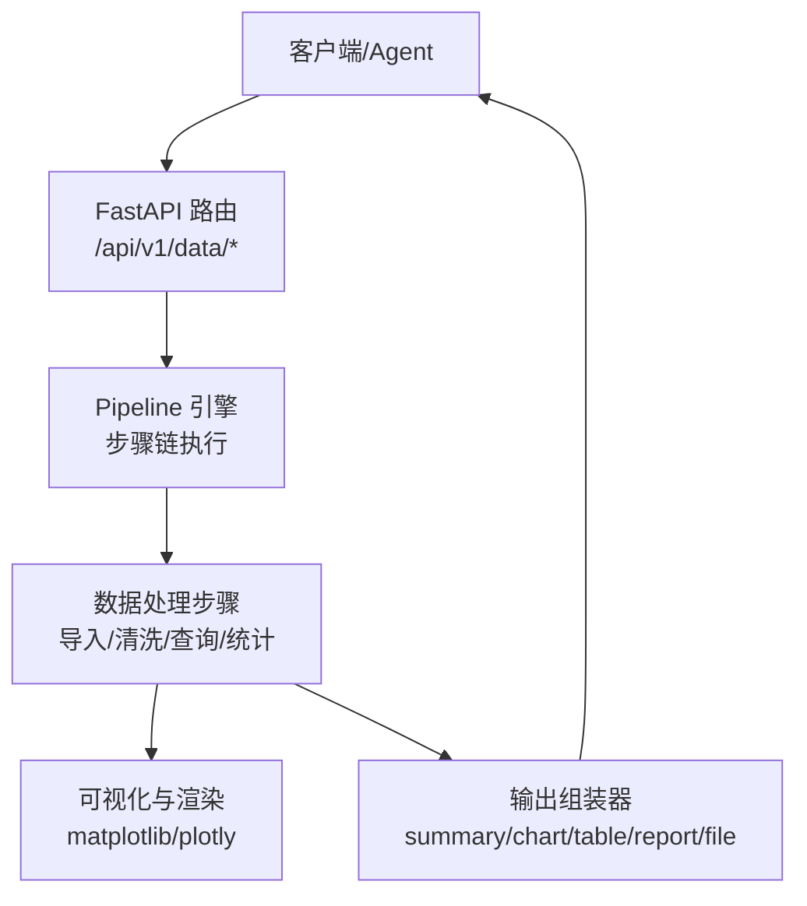
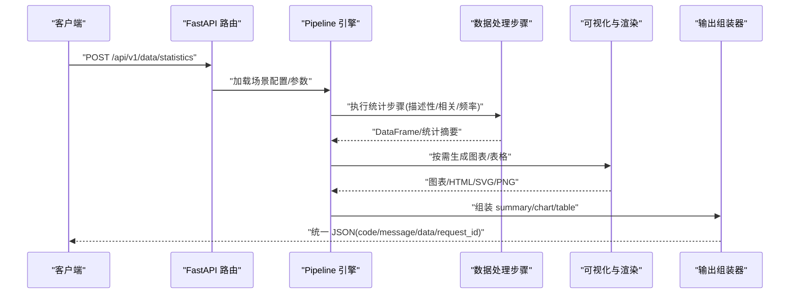
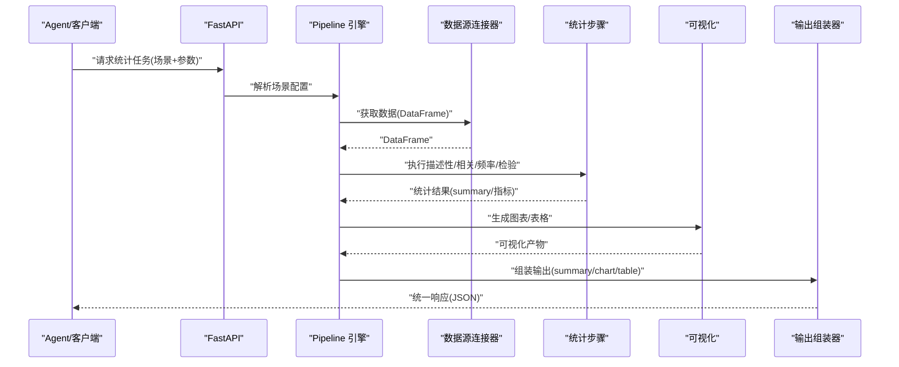

# 统计分析

<cite>
**本文引用的文件**
- [需求说明文档](file://docs/20260821100000_hiagent辅助Web服务_需求说明.md)
</cite>

## 目录
1. [简介](#简介)
2. [项目结构](#项目结构)
3. [核心组件](#核心组件)
4. [架构总览](#架构总览)
5. [详细组件分析](#详细组件分析)
6. [依赖关系分析](#依赖关系分析)
7. [性能考虑](#性能考虑)
8. [故障排查指南](#故障排查指南)
9. [结论](#结论)
10. [附录](#附录)

## 简介
本章节面向 hiagent 辅助 Web 服务的“统计分析”能力，围绕描述性统计、相关性分析、频率分布等基础统计功能进行系统化说明。同时覆盖参数配置、结果解释、可视化支持、性能优化与大数据集处理方案，并补充假设检验与置信区间等高级能力的规划与落地建议。该能力将作为数据处理流水线中的一个关键步骤，服务于竞品分析、机构行为分析、产品规模增量分析等多种业务场景。

## 项目结构
根据需求说明书，统计分析属于“数据处理”模块的一部分，位于统一 API 入口之下，通过 Pipeline 引擎或原子 API 调用。整体工程采用 FastAPI + pandas/numpy + DuckDB + matplotlib/plotly 等技术栈，数据以 DataFrame 形式在流水线中传递，最终由输出组装器生成 summary/chart/table/report/file 等结果。

图表来源
- [需求说明文档:33-68](file://docs/20260821100000_hiagent辅助Web服务_需求说明.md#L33-L68)
- [需求说明文档:71-83](file://docs/20260821100000_hiagent辅助Web服务_需求说明.md#L71-L83)

章节来源
- [需求说明文档:19-22](file://docs/20260821100000_hiagent辅助Web服务_需求说明.md#L19-L22)
- [需求说明文档:33-68](file://docs/20260821100000_hiagent辅助Web服务_需求说明.md#L33-L68)
- [需求说明文档:71-83](file://docs/20260821100000_hiagent辅助Web服务_需求说明.md#L71-L83)

## 核心组件
- 数据处理层：负责数据导入解析（CSV/Excel/JSON）、SQL 查询（DuckDB）、筛选、聚合、透视、排序、去重、数据清洗（空值、类型转换、文本清洗、异常值），以及统计分析（描述性统计、相关性、频率分布）。
- 可视化与渲染层：提供多种图表类型（柱状图/折线图/饼图/散点图/热力图/雷达图等）及报告渲染（Jinja2 HTML、Markdown 转 HTML）、表格渲染（条件着色、排序）。
- 输出组装器：将统计结果封装为 summary/chart/table/report/file 五种输出类型，其中 summary 专为 Agent 设计，便于后续编排与消费。
- Pipeline 引擎：按顺序执行步骤链，支持条件分支与步骤级错误处理（skip/abort），每步独立记录日志和耗时。

章节来源
- [需求说明文档:71-83](file://docs/20260821100000_hiagent辅助Web服务_需求说明.md#L71-L83)
- [需求说明文档:57-64](file://docs/20260821100000_hiagent辅助Web服务_需求说明.md#L57-L64)

## 架构总览
统计分析在流水线中的位置如下：上游连接器获取数据并返回统一 DataFrame；数据处理步骤完成清洗与统计计算；输出组装器将统计指标与可视化产物打包为统一响应。

图表来源
- [需求说明文档:33-68](file://docs/20260821100000_hiagent辅助Web服务_需求说明.md#L33-L68)
- [需求说明文档:71-83](file://docs/20260821100000_hiagent辅助Web服务_需求说明.md#L71-L83)

## 详细组件分析

### 描述性统计
- 目标：对数值型字段计算均值、中位数、标准差、方差、偏度、峰度、最小值、最大值、分位数等；对分类字段计算唯一值计数、缺失比例等。
- 输入：DataFrame（来自连接器或上游步骤），字段选择与分组维度。
- 参数配置要点：
  - 数值字段白名单/黑名单
  - 分组维度（groupby）
  - 是否包含缺失值统计
  - 分位数精度与截尾均值选项
  - 输出格式（summary 表/JSON/图表）
- 结果解释：
  - 集中趋势（均值/中位数）反映典型水平
  - 离散程度（标准差/四分位距）反映波动性
  - 分布形态（偏度/峰度）提示对称性与尾部特征
  - 缺失情况影响样本有效性与推断可靠性
- 可视化支持：
  - 箱线图/小提琴图展示分布与异常值
  - 直方图/密度图展示分布形态
  - 分组对比使用并列箱线或堆叠条形
- 性能与大数据策略：
  - 优先使用 DuckDB 进行聚合与分桶统计，减少内存拷贝
  - 对超大表采用采样（如 stratified sampling）与近似分位数算法
  - 流式读取与分批计算，避免一次性加载全量数据
- 示例流程（概念性）：
  - 选择数值字段 -> 计算基本统计 -> 可选分组 -> 生成 summary -> 生成图表 -> 输出

章节来源
- [需求说明文档:71-77](file://docs/20260821100000_hiagent辅助Web服务_需求说明.md#L71-L77)
- [需求说明文档:79-83](file://docs/20260821100000_hiagent辅助Web服务_需求说明.md#L79-L83)

### 相关性分析
- 目标：度量变量间线性或单调关系强度与方向，常用 Pearson（线性）、Spearman（单调）、Kendall（有序）。
- 输入：数值型矩阵或混合类型（自动识别）；支持分组与窗口化（时间序列）。
- 参数配置要点：
  - 相关系数方法选择
  - 显著性检验开关（p 值）
  - 缺失值处理方式（pairwise/listwise）
  - 多重比较校正（FDR/Bonferroni）
  - 阈值过滤（仅保留 |r| > t 的边）
- 结果解释：
  - r 接近 ±1 表示强相关，接近 0 表示弱相关
  - p 值用于判断统计显著性，需结合效应量与样本量解读
  - 注意：相关不等于因果，需结合领域知识
- 可视化支持：
  - 相关矩阵热力图
  - 网络图/弦图展示高相关变量对
  - 散点图矩阵（含回归线与置信带）
- 性能与大数据策略：
  - 使用向量化计算与并行分块
  - 对高维稀疏数据采用近似或降维（PCA/随机投影）后再算相关
  - 利用 DuckDB 的聚合函数加速分组相关
- 示例流程（概念性）：
  - 选择变量子集 -> 计算相关矩阵 -> 显著性检验 -> 过滤与可视化 -> 输出

章节来源
- [需求说明文档:71-77](file://docs/20260821100000_hiagent辅助Web服务_需求说明.md#L71-L77)
- [需求说明文档:79-83](file://docs/20260821100000_hiagent辅助Web服务_需求说明.md#L79-L83)

### 频率分布
- 目标：统计分类/离散变量的频数与频率，支持多列交叉频表与累计频率。
- 输入：分类或可离散化的数值字段；支持分组与权重列。
- 参数配置要点：
  - 分箱策略（等宽/等频/自定义边界）
  - 是否包含缺失类别
  - 是否输出累积频率/相对频率
  - 交叉维度（两列及以上）
- 结果解释：
  - 高频类别主导分布，长尾类别需关注业务意义
  - 缺失占比影响数据质量评估
  - 交叉频表揭示变量间的联合模式
- 可视化支持：
  - 条形图/堆积条形图
  - 帕累托图（累计贡献）
  - 热力图（交叉频表）
- 性能与大数据策略：
  - 使用 groupby + count 聚合，避免 Python 循环
  - 对高基数类别进行 Top-K 合并与“其他”类归并
  - 流式聚合与增量更新
- 示例流程（概念性）：
  - 选择分类字段 -> 分箱/分组 -> 计算频数/频率 -> 生成交叉表 -> 可视化 -> 输出

章节来源
- [需求说明文档:71-77](file://docs/20260821100000_hiagent辅助Web服务_需求说明.md#L71-L77)
- [需求说明文档:79-83](file://docs/20260821100000_hiagent辅助Web服务_需求说明.md#L79-L83)

### 假设检验与置信区间（高级）
- 目标：基于样本对总体参数进行推断，包括均值/比例的差异检验、方差齐性检验、正态性检验，以及参数的置信区间估计。
- 适用场景：A/B 测试、指标前后对比、群体差异分析。
- 常用方法：
  - 单样本/双样本 t 检验、Z 检验（大样本）
  - Mann-Whitney U / Wilcoxon 符号秩（非参数）
  - 卡方检验（独立性/拟合优度）
  - Shapiro-Wilk / Kolmogorov-Smirnov（正态性）
  - 置信区间：均值、比例、差值的 Bootstrap/Clopper-Pearson
- 参数配置要点：
  - 显著性水平 alpha
  - 双侧/单侧检验
  - 方差齐性假设与校正（Welch）
  - 多重比较校正
  - 小样本下的精确方法与连续性校正
- 结果解释：
  - p 值 < alpha 拒绝原假设，但需结合效应量与置信区间
  - 置信区间给出估计的不确定性范围
  - 注意样本代表性、测量误差与混杂因素
- 可视化支持：
  - 置信区间森林图
  - 检验结果的效应量图（Cohen's d 等）
  - 分布叠加与临界值标注
- 性能与大数据策略：
  - 大样本下可使用渐近近似；小样本用精确方法
  - 对大规模数据采用分块抽样与并行 bootstrap
  - 借助 SQL/DuckDB 预聚合后做统计推断

章节来源
- [需求说明文档:71-77](file://docs/20260821100000_hiagent辅助Web服务_需求说明.md#L71-L77)
- [需求说明文档:79-83](file://docs/20260821100000_hiagent辅助Web服务_需求说明.md#L79-L83)

### 端到端统计流水线（序列图）

图表来源
- [需求说明文档:33-68](file://docs/20260821100000_hiagent辅助Web服务_需求说明.md#L33-L68)
- [需求说明文档:71-83](file://docs/20260821100000_hiagent辅助Web服务_需求说明.md#L71-L83)

## 依赖关系分析
- 技术栈依赖：FastAPI 提供 API 层；pandas/numpy 负责数据与数值计算；DuckDB 提供高性能 SQL 与聚合；matplotlib/plotly 负责可视化；Pydantic/PyYAML 用于配置与校验；WeasyPrint 用于 PDF 报告；httpx/SQLAlchemy/jsonpath-ng 支撑外部集成。
- 模块耦合：
  - 数据处理与可视化通过 DataFrame 解耦
  - Pipeline 引擎通过上下文对象传递中间结果，降低直接耦合
  - 输出组装器统一封装不同产物，屏蔽下游差异
- 外部依赖：
  - 数据库/API/文件连接器按注册表模式扩展，新增成本低
  - 报告模板与图表主题可配置化

章节来源
- [需求说明文档:19-22](file://docs/20260821100000_hiagent辅助Web服务_需求说明.md#L19-L22)
- [需求说明文档:46-64](file://docs/20260821100000_hiagent辅助Web服务_需求说明.md#L46-L64)

## 性能考虑
- 计算性能：
  - 优先使用 DuckDB 进行聚合、透视、分箱与统计，减少 Python 层循环
  - 对大表采用流式读取、分批处理与增量聚合
  - 相关性计算使用向量化与并行分块；必要时采用近似算法
- 内存管理：
  - 控制 DataFrame 副本，尽量原地操作或使用视图
  - 对高基数类别进行 Top-K 合并，降低内存占用
- I/O 与网络：
  - 批量下载与连接复用；超时重试与速率限制
  - 临时文件及时清理，避免磁盘膨胀
- 可观测性：
  - 结构化日志记录 scenario_id、步骤耗时、错误堆栈
  - 健康检查与指标上报

章节来源
- [需求说明文档:97-102](file://docs/20260821100000_hiagent辅助Web服务_需求说明.md#L97-L102)
- [需求说明文档:57-64](file://docs/20260821100000_hiagent辅助Web服务_需求说明.md#L57-L64)

## 故障排查指南
- 常见问题定位：
  - 数据类型不匹配：确认字段类型推断与转换逻辑，必要时显式指定 dtype
  - 缺失值导致统计失效：检查缺失比例与处理方式（删除/填充/忽略）
  - 内存溢出：启用流式处理、分块计算与采样
  - 可视化渲染失败：检查图表数据维度与标签编码
- 错误码规范：
  - 通用 1xxx、数据处理 2xxx、可视化 3xxx、文件文档 4xxx、API 编排 5xxx、Pipeline 引擎 6xxx
- 调试手段：
  - 查看步骤级日志与耗时
  - 导出中间 DataFrame 与统计摘要
  - 使用 /health 与健康探针验证服务状态

章节来源
- [需求说明文档:25-30](file://docs/20260821100000_hiagent辅助Web服务_需求说明.md#L25-L30)
- [需求说明文档:57-64](file://docs/20260821100000_hiagent辅助Web服务_需求说明.md#L57-L64)

## 结论
本统计分析能力以 Pipeline 为核心，将描述性统计、相关性分析与频率分布等基础能力与可视化、报告输出打通，形成从数据到洞察的完整链路。通过 DuckDB 与向量化计算保障性能，通过注册式连接器与统一输出接口提升可扩展性。建议在 Phase 1 先落地基础统计与可视化，Phase 2 引入 Pipeline 与连接器，逐步完善假设检验与置信区间等高级能力，以满足多样化业务场景的分析需求。

## 附录
- 术语速查：
  - 描述性统计：对数据基本特征的概括性度量
  - 相关性：变量间关系的强度与方向
  - 频率分布：分类/离散变量的频数与频率
  - 假设检验：基于样本对总体参数进行推断的统计方法
  - 置信区间：参数估计的不确定性范围
- 参考实现路径（概念性）：
  - 数据处理步骤：导入/清洗/查询/统计
  - 可视化步骤：图表/表格/报告
  - 输出步骤：summary/chart/table/report/file

[本节为概念性内容，不直接分析具体文件]