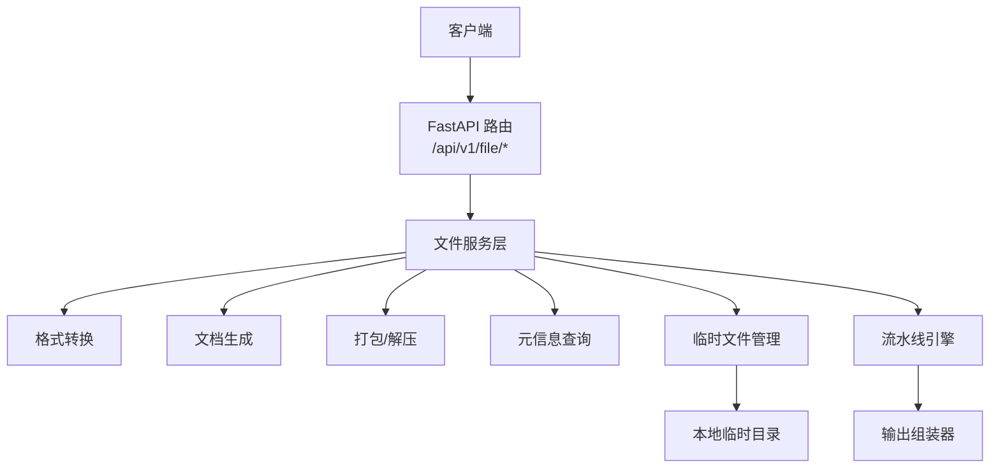
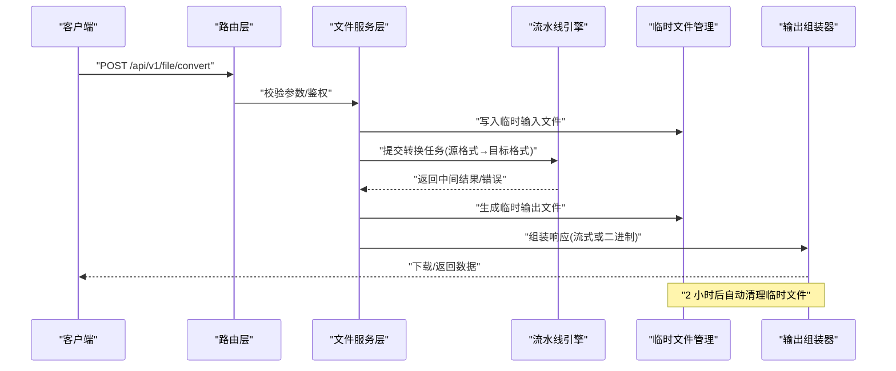
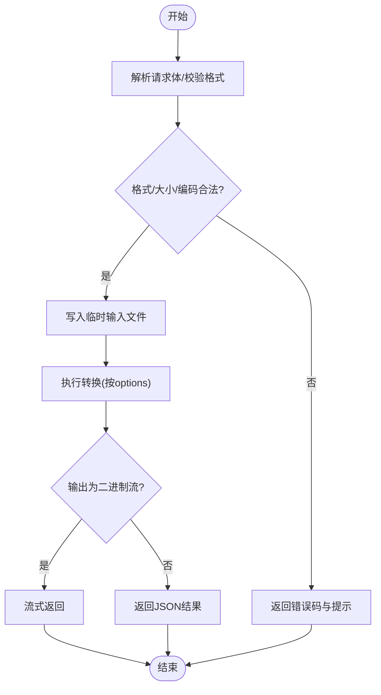
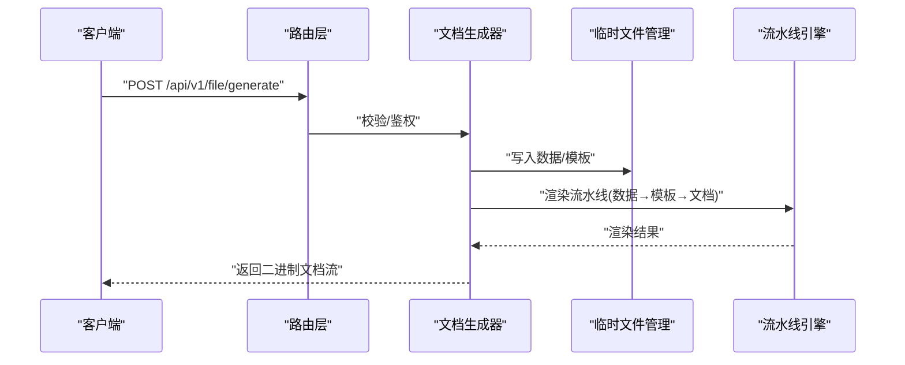
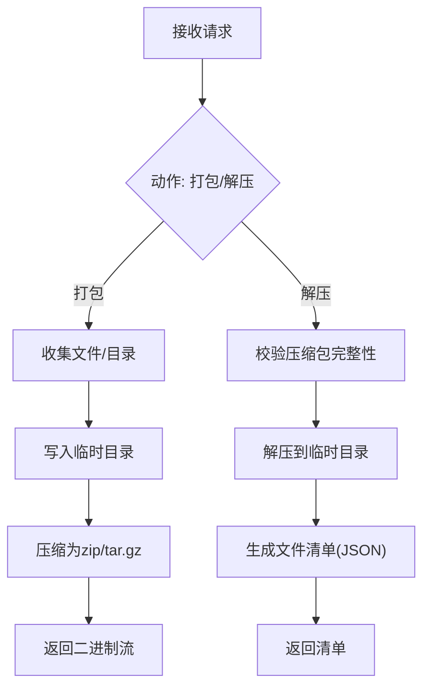
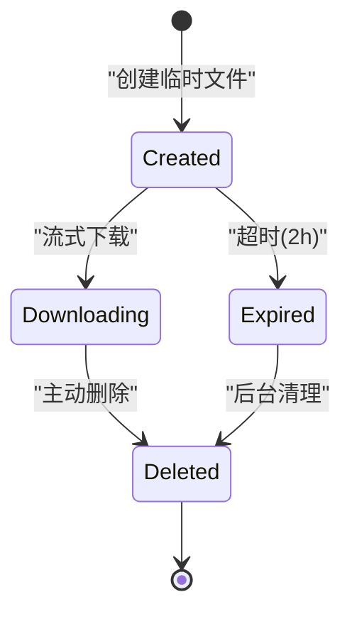
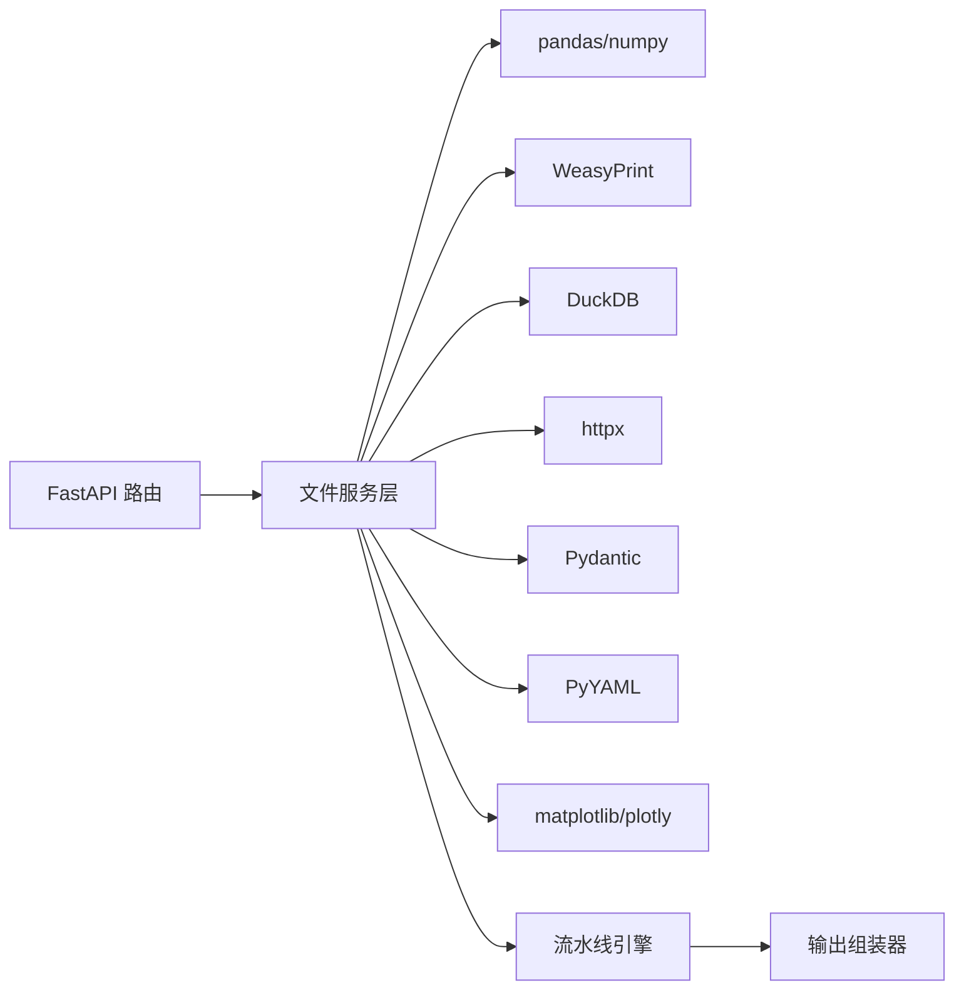

# 文件操作 API

<cite>
**本文引用的文件**
- [需求说明文档](file://docs/20260821100000_hiagent辅助Web服务_需求说明.md)
</cite>

## 目录
1. [简介](#简介)
2. [项目结构](#项目结构)
3. [核心组件](#核心组件)
4. [架构总览](#架构总览)
5. [详细接口说明](#详细接口说明)
6. [依赖关系分析](#依赖关系分析)
7. [性能与容量规划](#性能与容量规划)
8. [故障排查指南](#故障排查指南)
9. [结论](#结论)
10. [附录：示例与最佳实践](#附录示例与最佳实践)

## 简介
本模块面向 hiagent 辅助 Web 服务的“文件与文档操作”能力，提供统一的 /api/v1/file/* 接口族，覆盖格式转换、文档生成、打包解压、元信息查询与临时文件管理等能力。该模块遵循统一接口规范（JSON 响应、API Key 认证），并配合流水线引擎与其他模块协同工作，支撑报告与数据交付场景。

## 项目结构
当前仓库包含需求说明文档，明确了 /api/v1/file 的能力边界与非功能性要求。后续实现将围绕以下关键点展开：
- 路由挂载于 FastAPI 的 /api/v1/file
- 使用本地临时目录作为初始存储策略，便于扩展至对象存储
- 通过流水线引擎编排多步骤处理（解析、转换、渲染、归档）

图表来源
- [需求说明文档:71-105](file://docs/20260821100000_hiagent辅助Web服务_需求说明.md#L71-L105)

章节来源
- [需求说明文档:71-105](file://docs/20260821100000_hiagent辅助Web服务_需求说明.md#L71-L105)

## 核心组件
- 路由层：负责鉴权、参数校验、请求分发与响应封装
- 文件服务层：协调转换、生成、归档、元信息、临时文件等子能力
- 转换器：CSV/Excel/JSON/Markdown/HTML 互转
- 文档生成器：PDF/Word/Excel/PPT 生成（支持模板）
- 归档器：压缩/解压（zip/tar.gz 等）
- 元信息提取器：读取文件类型、大小、编码、表结构等
- 临时文件管理器：创建、追踪、流式下载、定时清理（2 小时）

章节来源
- [需求说明文档:71-105](file://docs/20260821100000_hiagent辅助Web服务_需求说明.md#L71-L105)

## 架构总览
文件操作采用“无状态 + 单一职责”的设计，所有 I/O 通过临时目录隔离，避免跨请求污染；复杂流程通过流水线引擎串联多个原子步骤，保证可观测性与容错。

图表来源
- [需求说明文档:71-105](file://docs/20260821100000_hiagent辅助Web服务_需求说明.md#L71-L105)

## 详细接口说明
以下接口均位于 /api/v1/file/*，统一 JSON 响应格式（code/message/data/request_id），并通过 X-API-Key 进行认证。

### 通用约定
- 认证：请求头 X-API-Key
- 响应：统一 JSON 包装 { code, message, data, request_id }
- 上传：multipart/form-data 字段 file（必要时附加 options）
- 下载：根据 Content-Type 返回二进制流或 JSON 元信息
- 安全：沙箱隔离、白名单格式、大小限制、路径校验、病毒扫描（可选）

### 1) 格式转换
- 端点：POST /api/v1/file/convert
- 功能：在 CSV、Excel、JSON、Markdown、HTML 之间互相转换
- 输入：
  - file：待转换文件
  - options：目标格式、编码、分隔符、是否保留样式、分页/分表策略等
- 输出：
  - 成功：二进制流（Content-Type 对应目标格式）
  - 失败：JSON 错误码与信息
- 典型选项：
  - target_format：csv|excel|json|markdown|html
  - encoding：utf-8/gbk/...
  - delimiter：逗号/制表符/分号
  - sheet_name/index：Excel 多表选择
  - include_header/include_index：是否包含列名/行索引
  - max_rows/max_cols：限制行列数以控制内存
- 批量：
  - 支持 multipart 多文件上传，服务端按顺序转换并返回 zip 包或流式响应
- 流式传输：
  - 大文件建议启用流式写入/读取，避免一次性加载到内存

图表来源
- [需求说明文档:71-105](file://docs/20260821100000_hiagent辅助Web服务_需求说明.md#L71-L105)

章节来源
- [需求说明文档:71-105](file://docs/20260821100000_hiagent辅助Web服务_需求说明.md#L71-L105)

### 2) 文档生成
- 端点：POST /api/v1/file/generate
- 功能：基于数据与模板生成 PDF、Word、Excel、PPT 文档
- 输入：
  - file：数据源（CSV/Excel/JSON）或 Markdown/HTML 内容
  - template：模板标识或模板文件
  - options：页面布局、字体、页眉页脚、表格样式、分页规则等
- 输出：
  - 二进制文档流（application/pdf / vnd.openxmlformats-officedocument.*）
- 模板：
  - 支持预置模板与自定义模板上传
  - 模板变量注入由流水线引擎完成
- 批处理：
  - 多份数据+同一模板，生成多文档并打包为 zip

图表来源
- [需求说明文档:71-105](file://docs/20260821100000_hiagent辅助Web服务_需求说明.md#L71-L105)

章节来源
- [需求说明文档:71-105](file://docs/20260821100000_hiagent辅助Web服务_需求说明.md#L71-L105)

### 3) 打包与解压
- 端点：
  - POST /api/v1/file/archive
  - POST /api/v1/file/unarchive
- 功能：
  - archive：将多个文件或目录打包为 zip/tar.gz
  - unarchive：解压压缩包到临时目录，返回文件清单
- 输入：
  - files：多文件或多目录（archive）
  - file：压缩包（unarchive）
  - options：格式、密码、压缩级别、是否保留路径
- 输出：
  - archive：二进制压缩包流
  - unarchive：JSON 文件清单（名称、大小、类型、哈希）

图表来源
- [需求说明文档:71-105](file://docs/20260821100000_hiagent辅助Web服务_需求说明.md#L71-L105)

章节来源
- [需求说明文档:71-105](file://docs/20260821100000_hiagent辅助Web服务_需求说明.md#L71-L105)

### 4) 元信息查询
- 端点：POST /api/v1/file/metadata
- 功能：读取文件的元信息（类型、大小、编码、MIME、表结构、图片尺寸等）
- 输入：
  - file：待查询文件
  - options：深度（仅基础/完整）、是否解析表头、是否采样内容
- 输出：
  - JSON：{ type, size, mime, encoding, schema?, pages?, images? }

章节来源
- [需求说明文档:71-105](file://docs/20260821100000_hiagent辅助Web服务_需求说明.md#L71-L105)

### 5) 临时文件管理
- 端点：
  - GET /api/v1/file/temp/{id}：流式下载
  - DELETE /api/v1/file/temp/{id}：主动删除
  - 后台任务：每 N 分钟扫描，清理超过 2 小时的临时文件
- 功能：
  - 创建临时文件并返回 id
  - 支持断点续传/流式下载
  - 自动清理过期文件，释放磁盘空间

图表来源
- [需求说明文档:71-105](file://docs/20260821100000_hiagent辅助Web服务_需求说明.md#L71-L105)

章节来源
- [需求说明文档:71-105](file://docs/20260821100000_hiagent辅助Web服务_需求说明.md#L71-L105)

## 依赖关系分析
- 外部库：FastAPI、pandas/numpy、WeasyPrint、httpx、Pydantic、PyYAML、DuckDB、matplotlib/plotly
- 内部组件：流水线引擎、连接器（base/database/api/file）、输出组装器
- 存储：本地临时目录（初期），可扩展至对象存储（OSS）

图表来源
- [需求说明文档:19-22](file://docs/20260821100000_hiagent辅助Web服务_需求说明.md#L19-L22)
- [需求说明文档:106-115](file://docs/20260821100000_hiagent辅助Web服务_需求说明.md#L106-L115)

章节来源
- [需求说明文档:19-22](file://docs/20260821100000_hiagent辅助Web服务_需求说明.md#L19-L22)
- [需求说明文档:106-115](file://docs/20260821100000_hiagent辅助Web服务_需求说明.md#L106-L115)

## 性能与容量规划
- 性能目标：简单接口 < 500ms，数据处理 < 3s，Pipeline 全流程 < 10s
- 并发与吞吐：结合 uvicorn workers 与异步 I/O，对大文件优先使用流式处理
- 内存控制：设置 max_rows/max_cols、分页/分表、增量渲染
- 存储策略：本地临时目录 + 定期清理；后期可迁移至 OSS
- 缓存：对重复模板/公共资源进行缓存，减少 IO

章节来源
- [需求说明文档:97-103](file://docs/20260821100000_hiagent辅助Web服务_需求说明.md#L97-L103)

## 故障排查指南
- 认证失败：检查 X-API-Key 是否正确配置
- 格式不支持：确认目标格式在白名单内
- 大小超限：调整单文件大小限制与内存阈值
- 转换失败：查看日志中的 step 耗时与错误堆栈
- 临时文件未清理：检查定时任务是否运行、磁盘空间是否充足
- 下载中断：确认流式传输是否启用、网络是否稳定

章节来源
- [需求说明文档:97-103](file://docs/20260821100000_hiagent辅助Web服务_需求说明.md#L97-L103)

## 结论
本模块以统一接口与安全策略为基础，提供完整的文件与文档处理能力。通过流水线引擎与临时文件管理，确保高可用、可观测与易扩展。后续可按需接入更多格式与模板，并平滑迁移至对象存储以提升弹性与可靠性。

## 附录：示例与最佳实践
- 批量转换
  - 上传多个文件，指定统一目标格式，服务端返回 zip 包或逐个流式返回
- 流式下载
  - 使用 /api/v1/file/temp/{id} 获取临时文件 ID，再以流式方式下载，避免内存峰值
- 模板化报告
  - 上传数据与模板，调用 /api/v1/file/generate，按需设置分页与样式
- 安全与合规
  - 启用沙箱隔离、白名单格式、大小限制、路径校验、病毒扫描（可选）
- 监控与可观测性
  - 记录结构化日志（含 scenario_id、步骤耗时），暴露 /health 与健康检查

[本节为概念性指导，不直接引用具体代码文件]