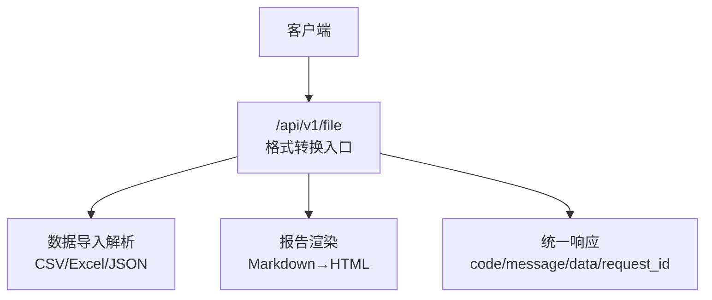
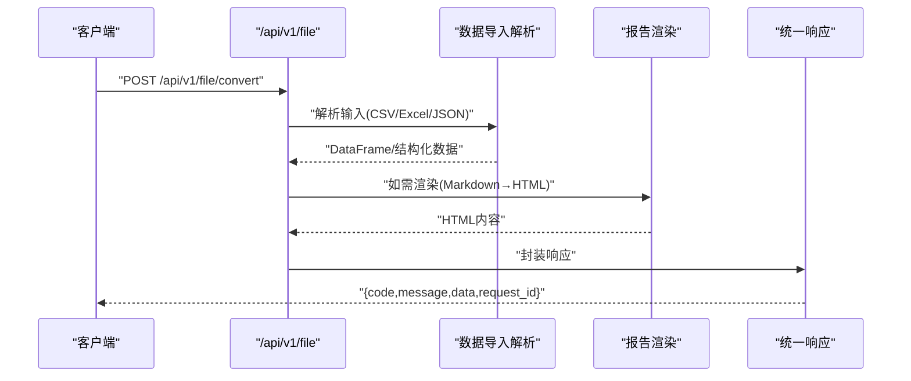
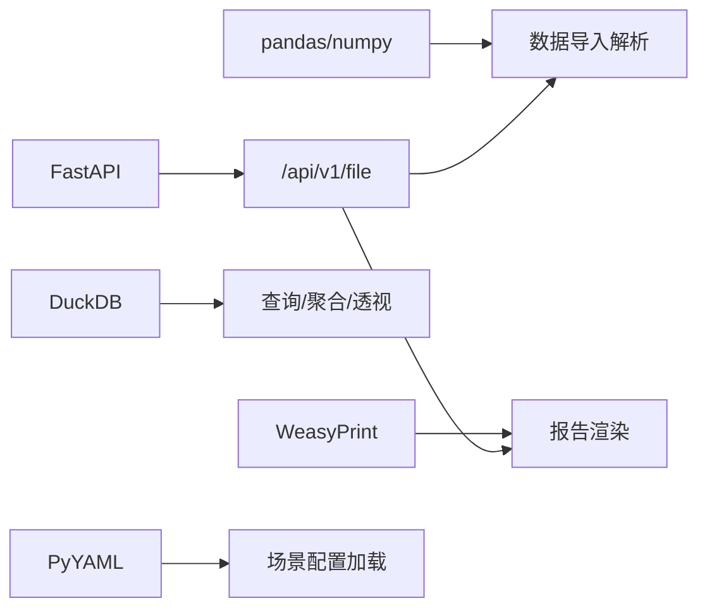

# 文件格式转换

<cite>
**本文引用的文件**
- [需求说明文档](file://docs/20260821100000_hiagent辅助Web服务_需求说明.md)
</cite>

## 目录
1. [简介](#简介)
2. [项目结构](#项目结构)
3. [核心组件](#核心组件)
4. [架构总览](#架构总览)
5. [详细组件分析](#详细组件分析)
6. [依赖关系分析](#依赖关系分析)
7. [性能考虑](#性能考虑)
8. [故障排查指南](#故障排查指南)
9. [结论](#结论)
10. [附录](#附录)

## 简介
本章节面向 hiagent 辅助 Web 服务的“文件格式转换”能力，聚焦 CSV、Excel、JSON、Markdown、HTML 之间的相互转换接口。依据需求说明，该能力位于“文件与文档操作”模块，提供统一的格式转换入口，并支持自动编码检测与类型推断等通用数据处理能力。

## 项目结构
根据需求说明，文件格式转换属于 /api/v1/file 模块的一部分，并与数据导入解析（CSV/Excel/JSON）和报告渲染（Markdown 转 HTML）等能力协同工作。整体采用统一 JSON 响应格式与 API Key 认证。

图表来源
- [需求说明文档:73-88](file://docs/20260821100000_hiagent辅助Web服务_需求说明.md#L73-L88)

章节来源
- [需求说明文档:25-31](file://docs/20260821100000_hiagent辅助Web服务_需求说明.md#L25-L31)
- [需求说明文档:73-88](file://docs/20260821100000_hiagent辅助Web服务_需求说明.md#L73-L88)

## 核心组件
- 文件与文档操作模块：负责格式转换、文档生成、文件打包解压、元信息查询与临时文件管理。
- 数据导入解析：支持 CSV/Excel/JSON 的自动编码检测与类型推断，为后续转换提供结构化数据。
- 报告渲染：支持 Markdown 转 HTML 等渲染能力，支撑 HTML 输出。

章节来源
- [需求说明文档:84-88](file://docs/20260821100000_hiagent辅助Web服务_需求说明.md#L84-L88)
- [需求说明文档:73-77](file://docs/20260821100000_hiagent辅助Web服务_需求说明.md#L73-L77)
- [需求说明文档:79-82](file://docs/20260821100000_hiagent辅助Web服务_需求说明.md#L79-L82)

## 架构总览
文件格式转换在流水线中作为“原子能力”被调用，既可通过 Pipeline API 一次性完成全流程，也可通过原子 API 逐步编排。转换流程通常包括：接收请求与鉴权 → 读取输入文件 → 编码检测与类型推断 → 格式转换 → 输出组装与返回。

图表来源
- [需求说明文档:65-68](file://docs/20260821100000_hiagent辅助Web服务_需求说明.md#L65-L68)
- [需求说明文档:73-88](file://docs/20260821100000_hiagent辅助Web服务_需求说明.md#L73-L88)
- [需求说明文档:25-31](file://docs/20260821100000_hiagent辅助Web服务_需求说明.md#L25-L31)

## 详细组件分析

### 接口规范与认证
- 统一 JSON 响应格式：包含 code、message、data、request_id。
- 认证方式：API Key 认证，通过 X-API-Key Header 传递。
- 错误码分段：1xxx 通用、2xxx 数据处理、3xxx 可视化、4xxx 文件文档、5xxx API 编排、6xxx Pipeline 引擎。

章节来源
- [需求说明文档:25-31](file://docs/20260821100000_hiagent辅助Web服务_需求说明.md#L25-L31)

### 数据导入与预处理（CSV/Excel/JSON）
- 支持的输入格式：CSV、Excel、JSON。
- 自动编码检测：在导入阶段进行编码识别，确保中文等多字节字符正确解析。
- 类型推断：对列类型进行自动推断，便于后续转换与计算。
- 清洗与校验：空值处理、类型转换、文本清洗、异常值处理（在数据处理阶段）。

章节来源
- [需求说明文档:73-77](file://docs/20260821100000_hiagent辅助Web服务_需求说明.md#L73-L77)

### 格式转换能力
- 互转范围：CSV、Excel、JSON、Markdown、HTML 之间相互转换。
- 典型路径：
  - CSV/Excel/JSON → 中间数据结构 → 目标格式（如导出为 Excel 或 JSON）
  - Markdown → HTML（通过报告渲染能力）
  - HTML → 其他格式（结合下载与打包能力）

章节来源
- [需求说明文档:84-88](file://docs/20260821100000_hiagent辅助Web服务_需求说明.md#L84-L88)
- [需求说明文档:79-82](file://docs/20260821100000_hiagent辅助Web服务_需求说明.md#L79-L82)

### 批量与大文件处理
- 批量转换：通过多次调用原子 API 或使用 Pipeline API 一次编排多个步骤实现批量处理。
- 大文件处理：利用流式处理与临时文件管理（2小时自动清理），避免内存压力；必要时分块读取与写入。

章节来源
- [需求说明文档:65-68](file://docs/20260821100000_hiagent辅助Web服务_需求说明.md#L65-L68)
- [需求说明文档:84-88](file://docs/20260821100000_hiagent辅助Web服务_需求说明.md#L84-L88)

### 错误处理与可观测性
- 错误码按模块分段，便于定位问题来源。
- 结构化日志：记录 scenario_id、步骤耗时等信息，便于追踪与诊断。
- 健康检查：提供 /health 端点用于服务可用性探测。

章节来源
- [需求说明文档:25-31](file://docs/20260821100000_hiagent辅助Web服务_需求说明.md#L25-L31)
- [需求说明文档:97-102](file://docs/20260821100000_hiagent辅助Web服务_需求说明.md#L97-L102)

### 配置与扩展
- 场景驱动：通过 YAML 配置描述数据源、处理步骤与输出，便于扩展新的转换规则。
- 连接器模式：注册表模式扩展新连接器，最小化改动成本。

章节来源
- [需求说明文档:40-55](file://docs/20260821100000_hiagent辅助Web服务_需求说明.md#L40-L55)
- [需求说明文档:106-115](file://docs/20260821100000_hiagent辅助Web服务_需求说明.md#L106-L115)

## 依赖关系分析
- 外部库：FastAPI、pandas/numpy、DuckDB、matplotlib/plotly、WeasyPrint、httpx、Pydantic、PyYAML、SQLAlchemy、jsonpath-ng。
- 运行时：uvicorn 作为 ASGI 服务器，支持 Docker 部署。

图表来源
- [需求说明文档:19-22](file://docs/20260821100000_hiagent辅助Web服务_需求说明.md#L19-L22)
- [需求说明文档:73-88](file://docs/20260821100000_hiagent辅助Web服务_需求说明.md#L73-L88)

章节来源
- [需求说明文档:19-22](file://docs/20260821100000_hiagent辅助Web服务_需求说明.md#L19-L22)

## 性能考虑
- 简单接口 < 500ms，数据处理 < 3s，Pipeline 全流程 < 10s。
- 建议：
  - 使用流式读写降低内存占用。
  - 合理设置并发与超时，避免资源争用。
  - 利用缓存与增量更新减少重复计算。
  - 监控关键指标（CPU、内存、I/O）并进行容量规划。

章节来源
- [需求说明文档:97-102](file://docs/20260821100000_hiagent辅助Web服务_需求说明.md#L97-L102)

## 故障排查指南
- 认证失败：检查 X-API-Key 是否正确传递。
- 编码错误：确认输入文件的编码是否被正确检测；必要时显式指定编码。
- 类型推断异常：检查数据类型与期望是否一致，必要时在导入后进行类型转换。
- 大文件溢出：启用流式处理与临时文件管理，关注磁盘空间与清理策略。
- 性能瓶颈：查看结构化日志中的步骤耗时，定位慢步骤并优化。

章节来源
- [需求说明文档:25-31](file://docs/20260821100000_hiagent辅助Web服务_需求说明.md#L25-L31)
- [需求说明文档:97-102](file://docs/20260821100000_hiagent辅助Web服务_需求说明.md#L97-L102)

## 结论
hiagent 的文件格式转换能力以统一接口与标准化输入输出为基础，结合自动编码检测与类型推断，覆盖 CSV、Excel、JSON、Markdown、HTML 的互转需求。通过 Pipeline 与原子 API 双模式，既能简化 Agent 编排，又保留灵活性与可扩展性。配合严格的错误码、结构化日志与健康检查，满足生产环境的稳定性与可观测性要求。

## 附录

### 常见转换示例（概念性）
- CSV → Excel：上传 CSV，后端解析并导出为 Excel。
- Excel → JSON：上传 Excel，解析为 JSON 数组对象。
- JSON → CSV：上传 JSON 数组，转换为 CSV 表格。
- Markdown → HTML：上传 Markdown，渲染为 HTML。
- HTML → 下载：将生成的 HTML 作为文件流返回供下载。

[本节为概念性说明，不直接分析具体代码文件]