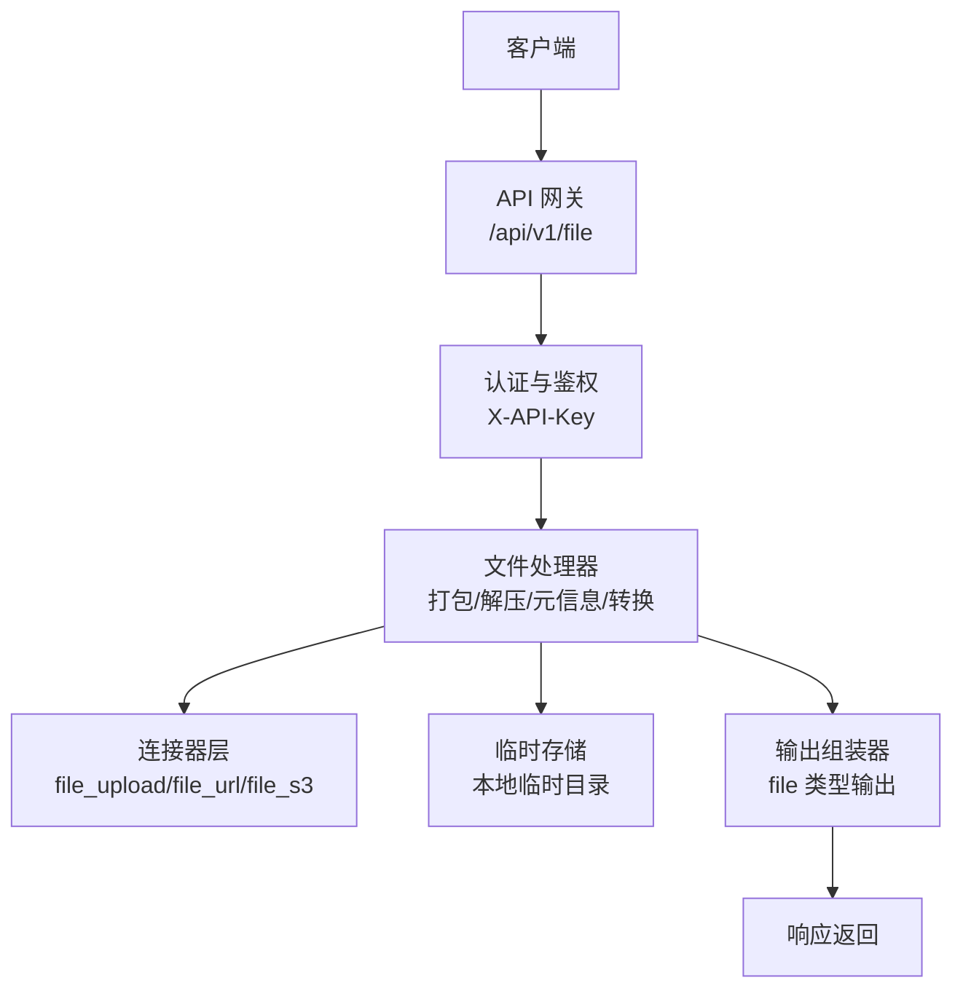
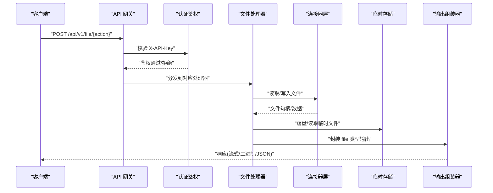
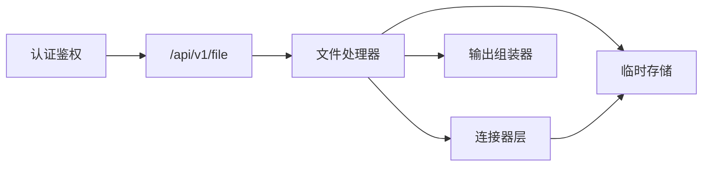

# 文件管理

<cite>
**本文引用的文件**
- [需求说明.md](file://docs/20260821100000_hiagent辅助Web服务_需求说明.md)
</cite>

## 目录
1. [简介](#简介)
2. [项目结构](#项目结构)
3. [核心组件](#核心组件)
4. [架构总览](#架构总览)
5. [详细组件分析](#详细组件分析)
6. [依赖关系分析](#依赖关系分析)
7. [性能考量](#性能考量)
8. [故障排查指南](#故障排查指南)
9. [结论](#结论)
10. [附录](#附录)

## 简介
本章节面向 hiagent 辅助 Web 服务的“文件与文档操作”能力，围绕文件打包解压、元信息查询、临时文件管理等接口进行系统化说明。内容覆盖安全验证、大小限制、存储策略、清理机制、生命周期管理、存储空间监控与异常恢复机制，并提供批量操作、流式传输、权限控制等完整示例思路。该模块在整体架构中作为数据连接器与输出组装器的重要支撑，服务于数据处理与可视化、报告生成等上层场景。

## 项目结构
根据需求说明，文件与文档操作位于统一 API 的 /api/v1/file 路径下，并与以下关键位置协同：
- 数据连接器层：包含 file_upload、file_url、file_s3 等连接器类型，负责从不同来源获取或写入文件。
- 流水线引擎与输出组装器：将文件处理步骤纳入 Pipeline，并以 file 类型输出。
- 本地临时目录：初期采用本地临时目录存储中间结果与待下载文件，后续可扩展至对象存储。

图表来源
- [需求说明.md:84-88](file://docs/20260821100000_hiagent辅助Web服务_需求说明.md#L84-L88)
- [需求说明.md:46-55](file://docs/20260821100000_hiagent辅助Web服务_需求说明.md#L46-L55)
- [需求说明.md:62-67](file://docs/20260821100000_hiagent辅助Web服务_需求说明.md#L62-L67)
- [需求说明.md:108-115](file://docs/20260821100000_hiagent辅助Web服务_需求说明.md#L108-L115)

章节来源
- [需求说明.md:84-88](file://docs/20260821100000_hiagent辅助Web服务_需求说明.md#L84-L88)
- [需求说明.md:46-55](file://docs/20260821100000_hiagent辅助Web服务_需求说明.md#L46-L55)
- [需求说明.md:62-67](file://docs/20260821100000_hiagent辅助Web服务_需求说明.md#L62-L67)
- [需求说明.md:108-115](file://docs/20260821100000_hiagent辅助Web服务_需求说明.md#L108-L115)

## 核心组件
- 认证与鉴权：通过 X-API-Key Header 进行统一认证，确保仅授权调用方可访问文件接口。
- 文件处理器：实现格式转换、文档生成、打包解压、元信息查询等核心能力。
- 连接器层：提供 file_upload（上传）、file_url（下载）、file_s3（对象存储）三种接入方式，统一返回结构化数据或文件句柄供后续处理。
- 临时存储：使用本地临时目录保存中间产物与待下载文件，支持自动清理与流式下载。
- 输出组装器：将处理结果以 file 类型输出，便于下游渲染或 Agent 消费。

章节来源
- [需求说明.md:25-31](file://docs/20260821100000_hiagent辅助Web服务_需求说明.md#L25-L31)
- [需求说明.md:84-88](file://docs/20260821100000_hiagent辅助Web服务_需求说明.md#L84-L88)
- [需求说明.md:46-55](file://docs/20260821100000_hiagent辅助Web服务_需求说明.md#L46-L55)
- [需求说明.md:62-67](file://docs/20260821100000_hiagent辅助Web服务_需求说明.md#L62-L67)
- [需求说明.md:108-115](file://docs/20260821100000_hiagent辅助Web服务_需求说明.md#L108-L115)

## 架构总览
文件管理在整体架构中的职责是桥接外部文件源与内部数据处理流程，同时保障安全与可观测性。其关键交互如下：
- 请求进入 /api/v1/file，经认证后路由到具体处理器。
- 处理器根据动作选择连接器（上传/下载/对象存储），并读写临时存储。
- 处理完成后由输出组装器封装为 file 类型响应，或触发下游流水线步骤。
- 所有步骤记录日志与耗时，便于问题定位与性能优化。

图表来源
- [需求说明.md:25-31](file://docs/20260821100000_hiagent辅助Web服务_需求说明.md#L25-L31)
- [需求说明.md:84-88](file://docs/20260821100000_hiagent辅助Web服务_需求说明.md#L84-L88)
- [需求说明.md:46-55](file://docs/20260821100000_hiagent辅助Web服务_需求说明.md#L46-L55)
- [需求说明.md:62-67](file://docs/20260821100000_hiagent辅助Web服务_需求说明.md#L62-L67)

## 详细组件分析

### 接口与动作设计
- 动作范围：格式转换、文档生成、打包解压、元信息查询、临时文件管理、流式下载。
- 输入规范：统一 JSON 响应格式（code/message/data/request_id），错误码按模块分段（4xxx 文件文档）。
- 认证要求：X-API-Key Header 必填，未通过则拒绝访问。
- 典型端点：/api/v1/file/{action}，action 包括 convert、archive、extract、metadata、upload、download、cleanup 等。

章节来源
- [需求说明.md:25-31](file://docs/20260821100000_hiagent辅助Web服务_需求说明.md#L25-L31)
- [需求说明.md:84-88](file://docs/20260821100000_hiagent辅助Web服务_需求说明.md#L84-L88)

### 安全验证与权限控制
- 认证：基于 X-API-Key 的统一鉴权，确保只有持有有效密钥的请求可访问文件接口。
- 沙箱隔离：文件操作应在受限目录内进行，防止越权访问系统路径。
- 输入校验：对文件名、扩展名、MIME 类型、压缩包内文件数量等进行白名单校验。
- 最小权限：仅授予必要的文件系统读/写/执行权限，避免过度授权。

章节来源
- [需求说明.md:25-31](file://docs/20260821100000_hiagent辅助Web服务_需求说明.md#L25-L31)
- [需求说明.md:97-102](file://docs/20260821100000_hiagent辅助Web服务_需求说明.md#L97-L102)

### 大小限制与资源保护
- 单文件大小限制：设置合理上限，防止恶意大文件导致内存或磁盘耗尽。
- 压缩包解压限制：限制解压后的文件数量与总大小，防止 Zip Bomb 攻击。
- 并发与速率限制：对上传/下载接口实施限流，避免资源被滥用。
- 超时控制：为长耗时操作设置超时，及时释放资源。

章节来源
- [需求说明.md:97-102](file://docs/20260821100000_hiagent辅助Web服务_需求说明.md#L97-L102)

### 存储策略与生命周期管理
- 存储位置：初期使用本地临时目录，便于快速迭代；后期可扩展至对象存储以提升弹性与可用性。
- 生命周期：
  - 上传与中间产物：写入临时目录，标记创建时间。
  - 自动清理：默认 2 小时过期，定时任务扫描并删除过期文件。
  - 流式下载：对大文件采用分块传输，减少内存占用。
- 命名与索引：为每个临时文件分配唯一 ID，建立索引以便查询与清理。

章节来源
- [需求说明.md:84-88](file://docs/20260821100000_hiagent辅助Web服务_需求说明.md#L84-L88)
- [需求说明.md:108-115](file://docs/20260821100000_hiagent辅助Web服务_需求说明.md#L108-L115)

### 清理机制与空间监控
- 清理策略：基于时间的 TTL 清理；支持手动触发清理接口。
- 空间监控：定期统计临时目录占用，超过阈值告警并触发压缩或迁移。
- 回收策略：优先清理最旧文件；必要时暂停新写入，等待空间释放。

章节来源
- [需求说明.md:84-88](file://docs/20260821100000_hiagent辅助Web服务_需求说明.md#L84-L88)

### 异常恢复机制
- 幂等设计：对重复请求具备幂等性，避免重复写入或解压。
- 断点续传：对大文件上传/下载支持断点续传，提升网络不稳定时的可靠性。
- 回滚与补偿：失败时清理部分写入的文件，保证状态一致。
- 可观测性：记录结构化日志（含 request_id、步骤耗时），便于追踪问题。

章节来源
- [需求说明.md:97-102](file://docs/20260821100000_hiagent辅助Web服务_需求说明.md#L97-L102)

### 批量操作与流式传输
- 批量操作：支持一次性提交多个文件进行转换或打包，内部串行或并行处理，返回聚合结果。
- 流式传输：对大文件采用分块读取与发送，降低峰值内存占用，提高吞吐。
- 进度反馈：对长耗时操作提供进度回调或轮询接口，便于前端展示。

章节来源
- [需求说明.md:84-88](file://docs/20260821100000_hiagent辅助Web服务_需求说明.md#L84-L88)

### 与连接器层的集成
- file_upload：接收客户端上传文件，写入临时目录并返回引用。
- file_url：从指定 URL 下载文件，校验来源与内容类型，落盘后返回引用。
- file_s3：对接对象存储，实现文件的持久化与版本管理（后期扩展）。

章节来源
- [需求说明.md:46-55](file://docs/20260821100000_hiagent辅助Web服务_需求说明.md#L46-L55)

### 与流水线引擎和输出组装器的协作
- 流水线集成：文件处理可作为 Pipeline 的一个或多个步骤，通过 PipelineContext 传递中间数据。
- 输出类型：以 file 类型输出，供下游渲染或 Agent 消费。
- 编排模式：支持模式 A（Pipeline API 一次完成全流程）与模式 B（原子 API 逐步调用）。

章节来源
- [需求说明.md:57-67](file://docs/20260821100000_hiagent辅助Web服务_需求说明.md#L57-L67)
- [需求说明.md:62-67](file://docs/20260821100000_hiagent辅助Web服务_需求说明.md#L62-L67)

## 依赖关系分析
文件管理模块依赖认证鉴权、连接器层、临时存储与输出组装器，形成清晰的层次化依赖：
- 认证鉴权：统一入口，拦截非法请求。
- 连接器层：抽象文件来源，屏蔽差异。
- 临时存储：提供短期持久化能力。
- 输出组装器：标准化响应格式。

图表来源
- [需求说明.md:25-31](file://docs/20260821100000_hiagent辅助Web服务_需求说明.md#L25-L31)
- [需求说明.md:84-88](file://docs/20260821100000_hiagent辅助Web服务_需求说明.md#L84-L88)
- [需求说明.md:46-55](file://docs/20260821100000_hiagent辅助Web服务_需求说明.md#L46-L55)
- [需求说明.md:62-67](file://docs/20260821100000_hiagent辅助Web服务_需求说明.md#L62-L67)

章节来源
- [需求说明.md:25-31](file://docs/20260821100000_hiagent辅助Web服务_需求说明.md#L25-L31)
- [需求说明.md:84-88](file://docs/20260821100000_hiagent辅助Web服务_需求说明.md#L84-L88)
- [需求说明.md:46-55](file://docs/20260821100000_hiagent辅助Web服务_需求说明.md#L46-L55)
- [需求说明.md:62-67](file://docs/20260821100000_hiagent辅助Web服务_需求说明.md#L62-L67)

## 性能考量
- 简单接口响应时间目标：< 500ms。
- 数据处理接口响应时间目标：< 3s。
- Pipeline 全流程响应时间目标：< 10s。
- 建议：
  - 使用流式 I/O 处理大文件，降低内存峰值。
  - 对频繁访问的元数据进行缓存。
  - 对批量操作进行批大小调优与并发度控制。
  - 启用连接池与异步 I/O，提升吞吐。

章节来源
- [需求说明.md:97-102](file://docs/20260821100000_hiagent辅助Web服务_需求说明.md#L97-L102)

## 故障排查指南
- 常见问题：
  - 认证失败：检查 X-API-Key 是否正确配置。
  - 文件过大：确认大小限制是否合理，必要时调整阈值。
  - 解压失败：检查压缩包结构与白名单规则。
  - 清理不及时：确认定时任务是否运行，TTL 配置是否正确。
- 诊断手段：
  - 查看结构化日志（含 request_id、步骤耗时）。
  - 检查临时目录占用与文件索引。
  - 复现问题并抓取请求上下文。

章节来源
- [需求说明.md:97-102](file://docs/20260821100000_hiagent辅助Web服务_需求说明.md#L97-L102)

## 结论
文件管理模块通过统一的认证鉴权、安全的文件处理、灵活的连接器层与可靠的临时存储，为 hiagent 的数据处理与可视化提供了坚实基础。结合生命周期管理、空间监控与异常恢复机制，能够在大流量与复杂场景下保持稳定与高效。后续可进一步扩展对象存储支持与更丰富的输出类型，以满足更多业务需求。

## 附录

### 示例：批量操作与流式传输
- 批量转换：提交多个 CSV/Excel/JSON 文件，内部顺序或并行转换，返回统一结果集。
- 流式下载：对大文件分块读取与发送，前端可显示进度条。
- 权限控制：基于 X-API-Key 的细粒度访问控制，确保仅授权用户可操作。

章节来源
- [需求说明.md:84-88](file://docs/20260821100000_hiagent辅助Web服务_需求说明.md#L84-L88)
- [需求说明.md:25-31](file://docs/20260821100000_hiagent辅助Web服务_需求说明.md#L25-L31)

### 示例：文件生命周期与清理
- 上传后生成临时文件，记录创建时间与引用。
- 定时任务每 10 分钟扫描，删除超过 2 小时的过期文件。
- 当磁盘使用率超过阈值，触发告警并优先清理最旧文件。

章节来源
- [需求说明.md:84-88](file://docs/20260821100000_hiagent辅助Web服务_需求说明.md#L84-L88)

### 示例：异常恢复与可观测性
- 失败时清理部分写入文件，保证状态一致。
- 记录结构化日志，包含 request_id、步骤耗时与错误堆栈。
- 提供健康检查与健康指标，便于运维监控。

章节来源
- [需求说明.md:97-102](file://docs/20260821100000_hiagent辅助Web服务_需求说明.md#L97-L102)