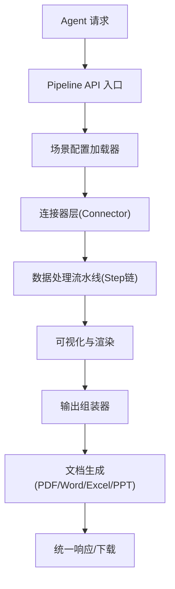
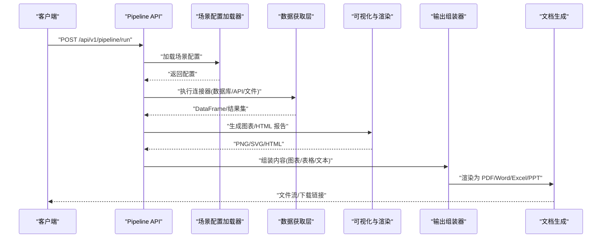
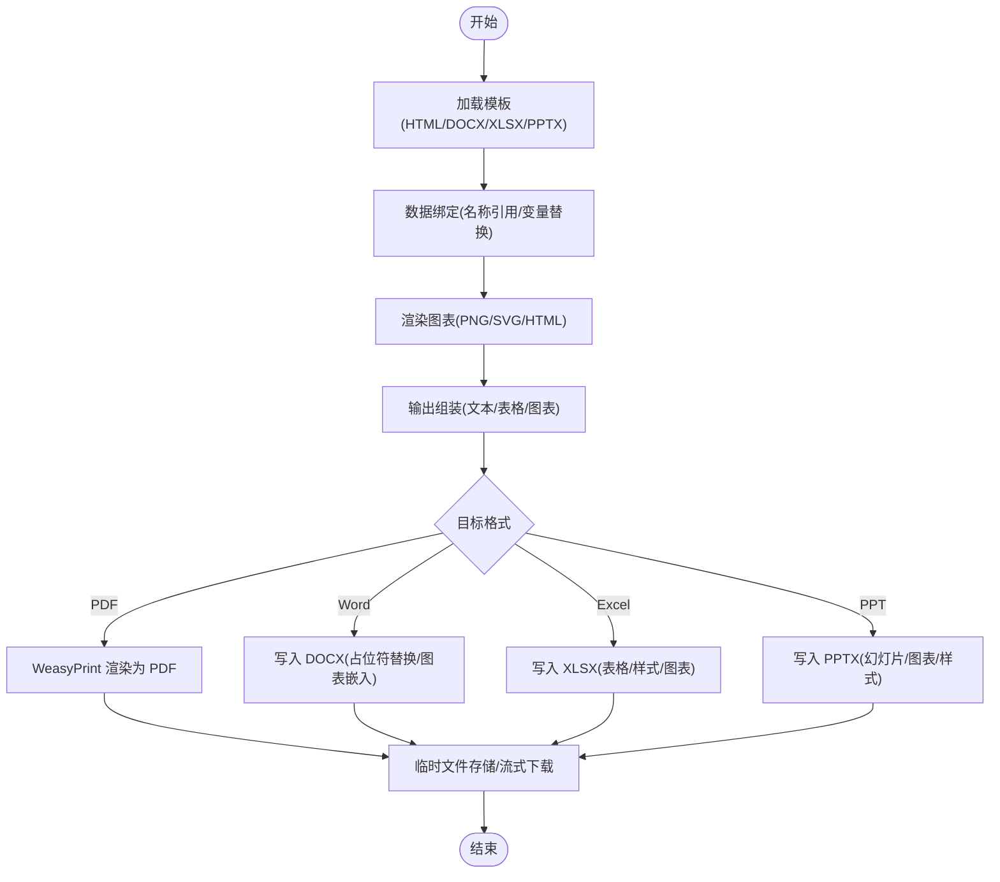
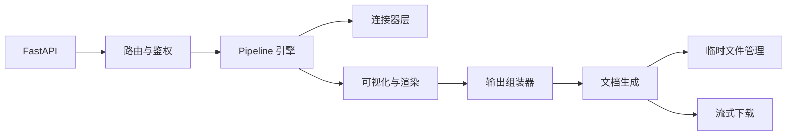

# 文档生成

<cite>
**本文引用的文件**
- [需求说明.md](file://docs/20260821100000_hiagent辅助Web服务_需求说明.md)
</cite>

## 目录
1. [简介](#简介)
2. [项目结构](#项目结构)
3. [核心组件](#核心组件)
4. [架构总览](#架构总览)
5. [详细组件分析](#详细组件分析)
6. [依赖关系分析](#依赖关系分析)
7. [性能与内存管理](#性能与内存管理)
8. [故障排查指南](#故障排查指南)
9. [结论](#结论)
10. [附录：接口与示例](#附录接口与示例)

## 简介
本章节面向“文档生成”能力，覆盖 PDF、Word、Excel、PPT 等格式的输出，重点说明模板支持、数据绑定、样式定制、图表嵌入、批量生成、质量优化、字体处理与内存管理等。该能力位于“文件与文档操作”模块，作为 Pipeline 输出组装器的一部分对外提供统一接口，并可通过原子 API 或 Pipeline 模式调用。

## 项目结构
根据需求说明书，文档生成功能属于 Phase 3（文档与报告）的规划范围，涉及以下关键位置与职责：
- 文件与文档操作模块：负责文档生成、格式转换、打包解压、临时文件管理与流式下载
- 可视化与渲染模块：负责图表生成与 HTML 报告渲染，为文档中的图表与表格提供素材
- 输出组装器：将图表、表格、HTML 报告等组合成最终文档（PDF/Word/Excel/PPT）
- Pipeline 引擎：通过场景配置驱动端到端流程，包含数据获取、处理、可视化与文档生成

图示来源
- [需求说明.md:33-68](file://docs/20260821100000_hiagent辅助Web服务_需求说明.md#L33-L68)
- [需求说明.md:79-88](file://docs/20260821100000_hiagent辅助Web服务_需求说明.md#L79-L88)

章节来源
- [需求说明.md:33-68](file://docs/20260821100000_hiagent辅助Web服务_需求说明.md#L33-L68)
- [需求说明.md:79-88](file://docs/20260821100000_hiagent辅助Web服务_需求说明.md#L79-L88)

## 核心组件
- 文件与文档操作模块
  - 文档生成：PDF/Word/Excel/PPT，支持模板
  - 格式转换：CSV/Excel/JSON/Markdown/HTML 互转
  - 文件打包解压、元信息查询
  - 临时文件管理：2 小时自动清理、流式下载
- 可视化与渲染模块
  - 图表生成：柱状图/折线图/饼图/散点图/热力图/雷达图等，支持 PNG/SVG/HTML
  - 报告渲染：Jinja2 HTML 模板、Markdown 转 HTML
  - 数据表格渲染：条件着色、排序
- 输出组装器
  - 将图表、表格、HTML 报告等组合为最终文档
- Pipeline 引擎
  - 步骤顺序执行，命名引用传递中间数据
  - 支持条件分支、步骤级错误处理（skip/abort）
  - 每步独立记录日志和耗时

章节来源
- [需求说明.md:79-88](file://docs/20260821100000_hiagent辅助Web服务_需求说明.md#L79-L88)
- [需求说明.md:57-68](file://docs/20260821100000_hiagent辅助Web服务_需求说明.md#L57-L68)

## 架构总览
文档生成的整体流程如下：
- 输入：场景配置（YAML）、数据源（数据库/API/文件）、模板（HTML/DOCX/XLSX/PPTX）
- 处理：数据获取 -> 数据处理 -> 可视化 -> 模板渲染 -> 文档生成
- 输出：PDF/Word/Excel/PPT 文件，支持流式下载与临时文件清理

图示来源
- [需求说明.md:33-68](file://docs/20260821100000_hiagent辅助Web服务_需求说明.md#L33-L68)
- [需求说明.md:79-88](file://docs/20260821100000_hiagent辅助Web服务_需求说明.md#L79-L88)

## 详细组件分析

### 文档生成（PDF/Word/Excel/PPT）
- 模板支持
  - 使用 Jinja2 HTML 模板进行报告渲染，便于结构化内容与样式的分离
  - Word/Excel/PPT 模板可基于对应格式的模板文件注入数据与图表
- 数据绑定
  - 通过 PipelineContext 在步骤间传递命名数据，供模板渲染与图表插入使用
- 样式定制
  - 借助 HTML/CSS 控制页面布局、表格样式、图表容器尺寸
  - Word/Excel/PPT 模板中预置样式与占位符，运行时替换
- 图表嵌入
  - 可视化模块生成 PNG/SVG/HTML 图表，由输出组装器嵌入到文档指定位置
- 批量生成
  - 通过 Pipeline 多次调用或单次传入多组参数，结合临时文件管理与流式下载实现批量导出

图示来源
- [需求说明.md:79-88](file://docs/20260821100000_hiagent辅助Web服务_需求说明.md#L79-L88)
- [需求说明.md:19-22](file://docs/20260821100000_hiagent辅助Web服务_需求说明.md#L19-L22)

章节来源
- [需求说明.md:79-88](file://docs/20260821100000_hiagent辅助Web服务_需求说明.md#L79-L88)
- [需求说明.md:19-22](file://docs/20260821100000_hiagent辅助Web服务_需求说明.md#L19-L22)

### 可视化与渲染（图表与报告）
- 图表类型：柱状图、折线图、饼图、散点图、热力图、雷达图等
- 输出格式：PNG、SVG、HTML
- 报告渲染：Jinja2 HTML 模板、Markdown 转 HTML
- 数据表格：条件着色、排序，便于后续嵌入文档

章节来源
- [需求说明.md:79-82](file://docs/20260821100000_hiagent辅助Web服务_需求说明.md#L79-L82)

### 输出组装器与 Pipeline
- 输出类型：chart/table/report/file/summary
- Pipeline 模式：步骤顺序执行，命名引用传递中间数据，支持条件分支与步骤级错误处理
- 日志与耗时：每步独立记录，便于定位瓶颈与问题

章节来源
- [需求说明.md:57-68](file://docs/20260821100000_hiagent辅助Web服务_需求说明.md#L57-L68)

## 依赖关系分析
- 技术栈
  - FastAPI：Web 框架与路由
  - pandas/numpy：数据处理与分析
  - DuckDB：SQL 查询与高性能计算
  - matplotlib/plotly：图表生成
  - WeasyPrint：HTML 转 PDF
  - httpx：HTTP 客户端
  - Pydantic：数据校验
  - PyYAML：场景配置解析
  - SQLAlchemy：数据库 ORM（可选）
  - jsonpath-ng：JSON 路径提取
- 模块耦合
  - 文档生成依赖可视化与渲染（图表素材）
  - 输出组装器依赖 Pipeline 上下文（命名数据）
  - 临时文件管理贯穿文档生成与下载流程

图示来源
- [需求说明.md:19-22](file://docs/20260821100000_hiagent辅助Web服务_需求说明.md#L19-L22)
- [需求说明.md:33-68](file://docs/20260821100000_hiagent辅助Web服务_需求说明.md#L33-L68)
- [需求说明.md:79-88](file://docs/20260821100000_hiagent辅助Web服务_需求说明.md#L79-L88)

章节来源
- [需求说明.md:19-22](file://docs/20260821100000_hiagent辅助Web服务_需求说明.md#L19-L22)
- [需求说明.md:33-68](file://docs/20260821100000_hiagent辅助Web服务_需求说明.md#L33-L68)
- [需求说明.md:79-88](file://docs/20260821100000_hiagent辅助Web服务_需求说明.md#L79-L88)

## 性能与内存管理
- 性能目标
  - 简单接口 < 500ms，数据处理 < 3s，Pipeline 全流程 < 10s
- 内存策略
  - 使用 DataFrame 与 DuckDB 提升查询与聚合效率
  - 图表生成后及时释放对象，避免大对象驻留内存
  - 临时文件 2 小时自动清理，降低磁盘占用
- 并发与限流
  - 通过 Pipeline 的步骤级并行与速率限制控制资源使用
- 可观测性
  - 结构化日志含 scenario_id 与步骤耗时，便于定位瓶颈

章节来源
- [需求说明.md:97-102](file://docs/20260821100000_hiagent辅助Web服务_需求说明.md#L97-L102)
- [需求说明.md:79-88](file://docs/20260821100000_hiagent辅助Web服务_需求说明.md#L79-L88)

## 故障排查指南
- 常见问题
  - 模板缺失或路径错误：检查模板加载与相对路径
  - 数据绑定失败：确认 PipelineContext 中命名数据是否存在且类型匹配
  - 图表渲染异常：检查数据维度与图表类型是否匹配
  - PDF 生成失败：确认 WeasyPrint 环境依赖（字体、CSS）
  - 内存溢出：减少一次性数据量，分块处理；及时释放中间对象
- 诊断方法
  - 查看步骤级日志与耗时，定位慢步骤
  - 检查临时文件目录，确认是否被正确清理
  - 使用 /health 与健康检查接口验证服务状态

章节来源
- [需求说明.md:97-102](file://docs/20260821100000_hiagent辅助Web服务_需求说明.md#L97-L102)
- [需求说明.md:79-88](file://docs/20260821100000_hiagent辅助Web服务_需求说明.md#L79-L88)

## 结论
文档生成功能以 Pipeline 为核心，结合可视化与渲染、输出组装器与临时文件管理，形成从数据到报告的完整链路。通过模板化与数据绑定，支持 PDF/Word/Excel/PPT 的多格式输出，满足报告、报表与演示材料的自动化生成需求。配合性能目标与可观测性设计，可在高并发与大数据量场景下稳定运行。

## 附录：接口与示例

### 接口规范
- 统一 JSON 响应格式：code/message/data/request_id
- 认证：X-API-Key Header
- 错误码分段：1xxx 通用、2xxx 数据处理、3xxx 可视化、4xxx 文件文档、5xxx API 编排、6xxx Pipeline 引擎

章节来源
- [需求说明.md:25-30](file://docs/20260821100000_hiagent辅助Web服务_需求说明.md#L25-L30)

### 典型用例
- 报告模板使用
  - 准备 HTML/DOCX/XLSX/PPTX 模板，定义占位符与图表容器
  - 通过 Pipeline 将数据绑定至模板，渲染并生成文档
- 动态内容插入
  - 使用 PipelineContext 传递动态字段，模板渲染时替换
  - 图表按数据维度动态生成并嵌入
- 批量文档生成
  - 多次调用 Pipeline 或单次传入多组参数，结合流式下载与临时文件管理完成批量导出

章节来源
- [需求说明.md:79-88](file://docs/20260821100000_hiagent辅助Web服务_需求说明.md#L79-L88)
- [需求说明.md:57-68](file://docs/20260821100000_hiagent辅助Web服务_需求说明.md#L57-L68)